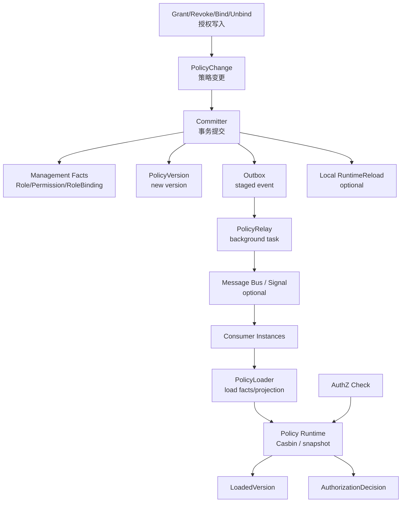
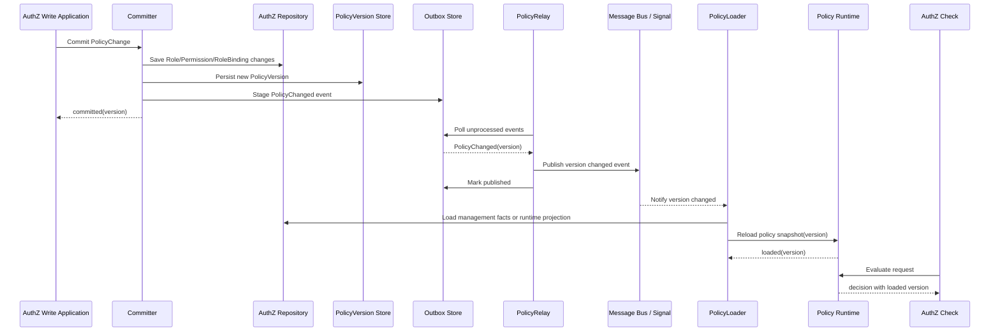
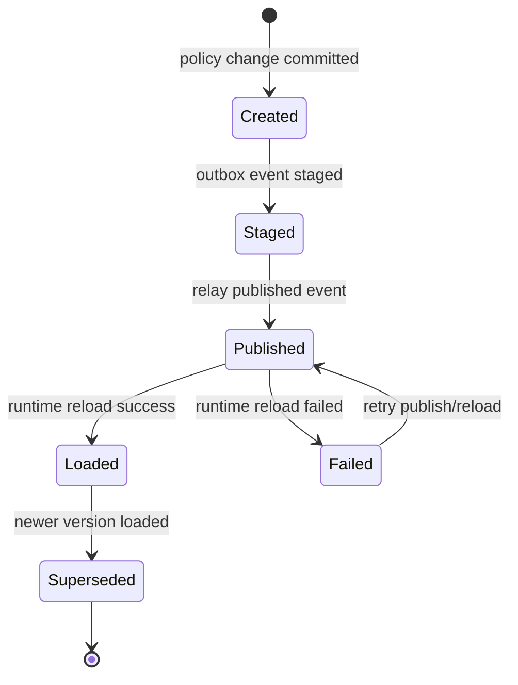

# 关键链路：授权版本传播 PolicyVersion / Outbox / RuntimeReload

> 状态：设计目标 · 第一版正文，待继续按 `application/authz`、`domain/authz`、Outbox、policy relay、Casbin runtime、配置、健康检查、REST/gRPC 契约和测试逐项核对。

---

## 1. 本文回答

本文回答 10 个问题：

- 授权版本传播链路解决什么问题？
- 为什么授权写入成功不等于运行时策略已生效？
- `PolicyChange`、`PolicyVersion`、`Outbox`、`PolicyRelay`、`RuntimeReload` 分别承担什么职责？
- `committed`、`published`、`loaded` 三个状态有什么区别？
- Outbox 如何解决数据库写入和事件发布的双写问题？
- RuntimeReload 为什么不应放在数据库事务内？
- 本地 runtime 和多实例 consumer 如何加载新策略？
- 策略传播的幂等、并发、乱序和失败边界如何处理？
- Check 链路如何感知 loaded PolicyVersion？
- 修改该链路时应该核对哪些代码和测试？

本文只讲授权版本传播链路。
授权写入链路见 [03-关键链路-授权写入Grant-Revoke-Bind-Unbind.md](03-关键链路-授权写入Grant-Revoke-Bind-Unbind.md)；
权限检查链路见 [02-关键链路-权限检查Check.md](02-关键链路-权限检查Check.md)；
Transactional Outbox 设计取舍见 [../../05-专题设计/03-Transactional-Outbox设计.md](../../05-专题设计/03-Transactional-Outbox设计.md)。

---

## 2. 30 秒结论

授权版本传播链路的目标是：

```text
在授权事实变化后，
让运行时授权引擎最终看到新版本，
并让 Check 能明确基于哪个策略版本做出决策。
```

核心主线：

```text
PolicyChange committed
  -> PolicyVersion persisted
  -> Outbox event staged
  -> local RuntimeReload optional
  -> PolicyRelay publishes version changed event
  -> consumers receive event
  -> consumers reload runtime
  -> loaded PolicyVersion updated
  -> Check uses loaded version
```

最重要的边界：

```text
committed：授权管理事实和 Outbox 已提交；
published：Outbox 事件已成功发布；
loaded：某个 runtime 已加载该 PolicyVersion；
committed 不等于 published；
published 不等于 loaded；
loaded 也可能只是某个实例 loaded；
RuntimeReload 不应放在数据库事务内；
Outbox 解决双写问题，但不等于消息队列，也不等于 exactly-once。
```

如果只记一句话：

> 授权写入改变事实，Outbox 保证变更可传播，RuntimeReload 让 Check 的运行时策略最终看到新版本。

---

## 3. 为什么需要版本传播链路

AuthZ 有两类事实：

```text
管理事实：Role / Permission / RoleBinding / PolicyVersion；
运行时事实：Casbin policy / in-memory snapshot / matcher input。
```

授权写入首先改变管理事实，但 Check 读的是运行时事实。

因此写入后必须回答：

```text
新策略版本是什么？
这个版本是否已经写入数据库？
事件是否已经发布出去？
本实例 runtime 是否已加载？
其他实例 runtime 是否已加载？
Check 当前使用的是哪个版本？
如果传播失败，如何重试和观测？
```

没有版本传播链路会导致：

```text
授权写入成功，但 Check 仍使用旧策略；
某些实例已更新，某些实例仍旧；
Outbox 积压但外部看起来“授权成功”；
runtime reload 失败却没有告警；
无法解释一次 AuthorizationDecision 基于哪个版本。
```

---

## 4. 核心概念

| 概念 | 一句话 | 所属层 | 关键边界 |
| --- | --- | --- | --- |
| `PolicyChange` | 一次授权策略变更描述 | domain/application | 不是 runtime 已加载 |
| `PolicyVersion` | 授权策略版本 | domain/application | published 不等于 loaded |
| `Outbox` | 事务内事件记录 | infra/application | 不是消息队列，不等于 exactly-once |
| `PolicyRelay` | Outbox 事件发布器 | application/infra/background task | 事务外异步执行 |
| `RuntimeReload` | 运行时策略重载 | infra/runtime | 不应放在数据库事务内 |
| `LoadedVersion` | runtime 当前加载版本 | runtime/health/metrics | 可能按实例不同 |
| `AuthorizationDecision` | Check 决策结果 | domain/application | 应尽量携带 loaded version |

---

## 5. 链路总览



读图规则：

```text
授权写入事务内提交管理事实、PolicyVersion 和 Outbox；
RuntimeReload 可以在事务后本地执行，但不应在事务内长时间执行；
Outbox 由 PolicyRelay 异步发布；
其他实例通过事件或信号触发 reload；
每个 runtime 应记录 loaded PolicyVersion；
Check 决策应能说明自己基于哪个 loaded version。
```

---

## 6. 状态语义：committed / published / loaded

### 6.1 committed

`committed` 表示授权写入事务已提交。

通常包括：

```text
Role / Permission / RoleBinding 变更已保存；
PolicyVersion 已生成或推进；
Outbox event 已写入；
必要审计记录已写入，若要求强一致。
```

边界：

```text
committed 不代表事件已发出；
committed 不代表 runtime 已加载；
committed 不代表所有实例 Check 已使用新策略。
```

---

### 6.2 published

`published` 表示 Outbox event 已被 relay 成功发布到消息总线、信号通道或内部广播机制。

边界：

```text
published 不代表 consumer 已收到；
published 不代表 consumer reload 成功；
published 不代表 loaded version 已更新；
published 不等于 Check 立即使用新策略。
```

---

### 6.3 loaded

`loaded` 表示某个 runtime 实例已经加载指定 PolicyVersion。

边界：

```text
loaded 是 runtime 侧状态；
loaded 可能是单实例状态，不代表全局所有实例；
loaded version 应能通过 health/metrics/log 暴露；
Check 应尽量基于 loaded version 返回 AuthorizationDecision。
```

---

## 7. 标准传播时序图



注意：

```text
Relay 和 RuntimeReload 发生在写入事务外；
Outbox poll/publish 可能重复，因此 consumer reload 必须幂等；
如果 Bus 不存在，也可以由本地 background task 直接 reload；
具体实现以代码为准，不应把规划写成已实现事实。
```

---

## 8. PolicyVersion

### 8.1 定位

`PolicyVersion` 是授权策略版本治理对象。

它回答：

```text
授权写模型当前处于哪个版本？
runtime 当前加载了哪个版本？
某次 AuthorizationDecision 基于哪个版本？
```

---

### 8.2 生命周期



注意：

```text
状态图是领域语义图；
具体状态枚举以代码为准；
如果当前代码只记录 version number，不记录完整状态，也应在文档中标记为设计目标或规划改造。
```

---

### 8.3 版本生成策略

常见策略：

| 策略 | 说明 | 风险 |
| --- | --- | --- |
| 单调递增整数 | 每次策略变更 +1 | 需要并发控制 |
| 时间戳版本 | 使用提交时间 | 分布式时钟可能漂移 |
| ULID/UUID 版本 | 唯一且易生成 | 顺序语义较弱，需额外 ordering |
| hash 版本 | 基于策略内容 hash | 变更追踪和排序更复杂 |

建议：

```text
Check 和 RuntimeReload 更需要“可比较的版本”；
写入并发时必须保证版本顺序清晰；
旧版本事件不能覆盖新版本 runtime；
版本生成应放在授权写入事务中。
```

---

## 9. Outbox

### 9.1 Outbox 解决什么问题

授权写入有典型双写风险：

```text
数据库写入成功，但事件发布失败；
事件发布成功，但数据库事务回滚；
服务在两步之间崩溃。
```

Outbox 的做法是：

```text
在同一个数据库事务中：
  保存授权管理事实；
  保存 PolicyVersion；
  保存待发布 Outbox event。

事务提交后：
  由 relay 异步读取 Outbox event；
  发布事件；
  标记事件已发布或等待重试。
```

---

### 9.2 Outbox 不是什么

```text
Outbox 不是消息队列；
Outbox 不等于 exactly-once；
Outbox 不保证 consumer 只处理一次；
Outbox 不替代业务幂等；
Outbox 不替代 runtime reload；
Outbox 不替代监控告警。
```

---

### 9.3 Outbox event 建议字段

```text
eventID；
eventType：authz.policy.changed；
policyVersion；
operation：grant/revoke/bind/unbind；
affectedRoleIDs；
affectedPermissionIDs；
affectedSubjectIDs；
affectedScopes；
createdAt；
publishedAt；
attempts；
lastError；
traceID；
operatorID。
```

具体字段以当前代码和迁移为准。

---

## 10. PolicyRelay

`PolicyRelay` 是 Outbox event 的发布器。

它负责：

```text
轮询未发布 Outbox event；
按顺序或按版本读取事件；
发布到消息总线、Redis Pub/Sub、进程内 signal 或其他机制；
标记 published；
失败重试；
记录 attempts / lastError；
暴露积压、延迟和失败指标。
```

它不负责：

```text
创建 Role/Permission/RoleBinding；
生成 PolicyVersion；
修改授权写模型；
直接执行 AuthZ Check；
在数据库事务内长时间阻塞写入。
```

---

## 11. RuntimeReload

### 11.1 定位

`RuntimeReload` 负责让运行时策略引擎看到新版本。

它可以执行：

```text
从管理事实重建完整 runtime snapshot；
从 runtime projection 加载策略；
增量应用 PolicyChange；
替换 Casbin enforcer/policy；
更新 loaded PolicyVersion。
```

具体方式以当前实现为准。

---

### 11.2 为什么不放在事务内

RuntimeReload 不应放在数据库事务内，因为：

```text
reload 可能耗时；
reload 可能访问远程资源；
reload 可能失败；
reload 可能需要锁 runtime；
长事务会阻塞授权写入；
事务回滚无法回滚已经修改的内存 runtime；
多实例 reload 本身不可能在单个数据库事务内完成。
```

正确方式：

```text
事务内提交管理事实 + PolicyVersion + Outbox；
事务后本地 reload 或异步 relay；
reload 成功后更新 loaded version；
reload 失败则重试和告警。
```

---

### 11.3 Reload 策略

| 策略 | 说明 | 适用场景 |
| --- | --- | --- |
| 全量重建 | 每次从管理事实重建完整策略 | 简单可靠，数据量较小时优先 |
| 增量 patch | 根据 PolicyChange 更新 runtime | 数据量大、变更频繁 |
| 双缓冲 snapshot | 新 snapshot 构建成功后原子替换 | 降低 reload 期间不一致 |
| lazy reload | Check 时发现版本落后再触发 | 可用性优先，但延迟不可控 |
| 定时 reload | 周期性拉取最新版本 | 简单，但传播延迟较大 |

建议：

```text
优先保证正确性，再优化性能；
reload 失败不能污染当前可用 runtime；
新 snapshot 构建失败时应继续使用旧 snapshot 或 fail closed，策略必须明确；
高风险系统应暴露 loaded version 和 reload lag。
```

---

## 12. 多实例传播

在多实例部署下，一个实例写入授权事实，其他实例也需要加载新策略。

典型方式：

```text
Outbox relay 发布 policy.changed 事件；
所有实例订阅事件；
每个实例收到 version 后判断是否需要 reload；
reload 成功后更新本实例 loaded version；
health/metrics 暴露每个实例的 loaded version。
```

关键问题：

```text
事件可能重复；
事件可能乱序；
事件可能延迟；
某些实例可能暂时不可达；
实例重启时可能错过事件；
新实例启动时需要加载最新版本。
```

建议：

```text
consumer 按 policyVersion 做幂等判断；
如果 event.version <= loadedVersion，可以忽略；
如果 event.version > loadedVersion，触发 reload 到最新版本，而不是只加载事件版本；
实例启动时主动加载 latest PolicyVersion；
定时 reconcile 防止漏事件；
runtime loaded version 应可观测。
```

---

## 13. 幂等、乱序与并发

### 13.1 幂等

传播链路必须支持重复事件。

```text
同一个 Outbox event 可能发布多次；
同一个 consumer 可能处理多次；
reload 同一版本应幂等；
mark published 也应能处理重复确认。
```

建议：

```text
eventID 去重；
policyVersion 单调判断；
loadedVersion >= event.version 时跳过；
reload 后再次确认 loadedVersion；
relay publish 成功但 mark published 失败时允许重复发布。
```

---

### 13.2 乱序

事件可能乱序到达。

处理原则：

```text
旧版本事件不能覆盖新 runtime；
consumer 收到任意较新版本事件时，应加载 latest version；
不要只按事件 payload 做增量 patch，除非有严格顺序保障；
增量 patch 需要检测 missing version。
```

---

### 13.3 并发

并发风险：

| 风险 | 说明 |
| --- | --- |
| 多个授权写入同时 bump version | 需要单调版本或乐观锁 |
| Relay 多实例并发发布同一 Outbox | 需要 claim/lock 或幂等发布 |
| Runtime 多次并发 reload | 需要 reload lock 或 snapshot 原子替换 |
| 旧 reload 后完成覆盖新 reload | 必须比较 version，禁止回退 |
| Check 与 reload 并发 | 需要 runtime snapshot 读写安全 |

建议：

```text
PolicyVersion 生成应有并发控制；
Outbox relay 可以使用 status/locked_at/locked_by 机制；
RuntimeReload 使用单飞或互斥；
snapshot 替换应原子化；
loadedVersion 只能前进不能后退。
```

---

## 14. Check 如何使用版本

Check 应尽量记录 runtime loaded version。

```text
AuthorizationRequest
  -> runtime evaluate
  -> AuthorizationDecision{Allowed, Reason, PolicyVersion: loadedVersion}
```

用途：

```text
排查“刚授权为什么还没生效”；
支持高风险操作要求最低版本；
支持审计一次决策基于哪个策略版本；
支持观测不同实例的策略漂移。
```

高一致性场景可使用：

```text
expectedPolicyVersion；
minPolicyVersion；
waitUntilLoaded(version, timeout)；
write result 返回 version 后由调用方等待。
```

注意：

```text
不要默认所有 Check 都等待最新版本；
等待会增加延迟和故障耦合；
只有强一致场景才需要显式等待。
```

---

## 15. Health / Metrics / Observability

授权版本传播必须可观测。

建议指标：

```text
latest_committed_policy_version；
latest_published_policy_version；
runtime_loaded_policy_version；
policy_version_lag；
outbox_pending_count；
outbox_oldest_pending_age_seconds；
outbox_publish_attempts_total；
outbox_publish_failures_total；
runtime_reload_attempts_total；
runtime_reload_failures_total；
runtime_reload_duration_seconds；
last_runtime_reload_error；
```

健康检查建议：

| 状态 | 说明 |
| --- | --- |
| healthy | loaded version 接近 latest committed，outbox 无严重积压 |
| degraded | outbox 积压或 reload lag 超阈值，但仍可用旧策略 Check |
| not ready | runtime 未加载任何策略，或关键 reload 失败且无法安全 Check |

关键边界：

```text
不要只暴露 /health=200；
AuthZ runtime loaded version 应能观测；
Outbox 积压应能告警；
reload 失败不能静默。
```

---

## 16. 失败边界

| 场景 | 期望行为 | 说明 |
| --- | --- | --- |
| PolicyVersion 持久化失败 | 授权写入整体失败 | 不能只写 RoleBinding |
| Outbox 写入失败 | 授权写入整体失败 | 防止变更无法传播 |
| Relay 发布失败 | 保留 Outbox 待重试 | 不能丢事件 |
| Relay 发布成功但标记失败 | 允许重复发布 | consumer 必须幂等 |
| Consumer 收到重复事件 | 幂等跳过或重新加载 | 不能导致错误 |
| Consumer 收到旧版本事件 | 忽略 | loadedVersion 不能回退 |
| RuntimeReload 失败 | 保持旧 runtime 或 fail closed | 策略必须明确 |
| Runtime 未加载任何策略 | not ready 或 fail closed | 不应默认 allow |
| Check 发现版本过旧 | 允许、拒绝或等待 | 取决于接口一致性要求 |
| Outbox 长期积压 | degraded + 告警 | 授权变更无法及时生效 |

---

## 17. 与授权写入链路的关系

授权写入负责提交事实。

版本传播负责让 runtime 看到事实。

```text
Grant/Revoke/Bind/Unbind
  -> PolicyChange
  -> PolicyVersion
  -> Outbox
  -> RuntimeReload
  -> Check
```

边界：

```text
写入事务内不做远程 reload；
写入成功不等于 runtime loaded；
如果产品需要“授权立即生效”，需要额外等待 loaded version；
否则应该明确返回 policyVersion 和传播状态。
```

---

## 18. 与 Check 链路的关系

Check 使用 runtime loaded policy。

```text
Check request
  -> runtime snapshot loadedVersion=N
  -> AuthorizationDecision(policyVersion=N)
```

边界：

```text
Check 不应主动修复 Outbox；
Check 不应默认 reload runtime；
Check 可以在发现版本落后时返回特定错误或触发异步 signal，是否实现以代码为准；
Check deny 可能是权限不足，也可能是 runtime 版本未更新，需要通过 version 观测区分。
```

---

## 19. 与其他模块的边界

### 19.1 与 AuthN

```text
AuthN 提供 Principal；
AuthZ 版本传播不校验 Credential / Challenge；
AuthZ 版本传播不签发 Token；
Token 验签成功不代表策略版本已加载。
```

### 19.2 与 Identity

```text
Identity 提供 User/Profile/ProfileLink 身份事实；
PolicyVersion 只治理 AuthZ 授权策略；
Identity 变化是否触发 AuthZ policy reload，必须有明确事件或用例；
AuthZ 不修改 User/Profile/ProfileLink 写模型。
```

### 19.3 与 Suggest

```text
Suggest 可能受授权策略影响；
AuthZ policy reload 不等于 Suggest Index reload；
如果搜索可见性依赖 AuthZ，应明确查询时 Check 还是离线同步过滤；
Suggest ProfileAccessScope 不是 AuthZ Scope。
```

### 19.4 与运行时健康检查

```text
AuthZ runtime loaded version 应进入 readiness/degraded 判断；
runtime 无策略时不应假装 ready；
outbox 积压或 reload lag 可进入 degraded。
```

---

## 20. 常见反模式

| 反模式 | 问题 | 推荐做法 |
| --- | --- | --- |
| 写入成功就宣称权限已生效 | 忽略 runtime 传播延迟 | 区分 committed/published/loaded |
| Outbox 当消息队列 | 职责混淆 | Outbox 只是事务内事件表，Relay 才负责发布 |
| Outbox 当 exactly-once | 重复消费风险 | consumer 和 reload 必须幂等 |
| RuntimeReload 放进数据库事务 | 长事务和不可回滚副作用 | 事务外 reload |
| 只更新 Casbin 不写管理事实 | runtime 吞并领域事实 | 管理事实是源头 |
| 只写管理事实不写 Outbox | 变更无法传播 | Outbox 与管理事实同事务 |
| 旧版本事件覆盖新 runtime | 策略回退风险 | loadedVersion 单调前进 |
| reload 失败静默 | 授权策略漂移 | 指标、日志、告警、degraded |
| Check 默认使用最新 committed 版本 | 混淆管理事实与 runtime | Check 应使用 loaded version |
| 多实例不做 reconcile | 漏事件后长期漂移 | 启动加载 latest + 定时校准 |

---

## 21. 代码事实源

| 事实 | 路径 |
| --- | --- |
| AuthZ domain | `../../../internal/apiserver/domain/authz` |
| PolicyVersion / PolicyChange | `../../../internal/apiserver/domain/authz` |
| AuthZ application | `../../../internal/apiserver/application/authz` |
| Policy administration / committer | `../../../internal/apiserver/application/authz`，具体以代码为准 |
| Outbox store / relay | `../../../internal/apiserver/infra`、`../../../internal/apiserver/application/authz`，具体以代码为准 |
| Policy loader / runtime reload | `../../../internal/apiserver/infra` |
| Casbin runtime / policy adapter | `../../../internal/apiserver/infra` |
| AuthZ container | `../../../internal/apiserver/container/authz` |
| Background task / process lifecycle | `../../../internal/apiserver/process`、`../../../internal/apiserver/container`，具体以代码为准 |
| Health / readiness | `../../../internal/apiserver/transport/rest`、`../../../internal/apiserver/process`，具体以代码为准 |
| REST 契约 | `../../../api/rest` |
| gRPC 契约 | `../../../api/grpc` |
| 架构测试 | `../../../internal/pkg/architecture` |
| 专题设计 | `../../05-专题设计/03-Transactional-Outbox设计.md` |

注意：上表中的具体路径需要继续与当前源码核对。如果源码目录已调整，应以代码为准并同步更新本文。

---

## 22. Verify

修改本文后至少执行：

```bash
make docs-hygiene
```

涉及 AuthZ 领域模型：

```bash
go test ./internal/apiserver/domain/authz/...
```

涉及 AuthZ 写入、PolicyVersion、Outbox 用例：

```bash
go test ./internal/apiserver/application/authz/...
```

涉及 Outbox、policy loader、runtime reload、Casbin adapter：

```bash
go test ./internal/apiserver/infra/...
```

具体路径以当前代码为准。

涉及后台任务和运行时生命周期：

```bash
go test ./internal/apiserver/...
```

涉及 REST/gRPC 契约或 health/readiness：

```bash
make api-validate
make proto-gen
go test ./internal/apiserver/transport/rest/...
go test ./internal/apiserver/transport/grpc/...
```

涉及分层依赖或模块边界：

```bash
go test ./internal/pkg/architecture
```

---

## 23. 本文总结

授权版本传播链路可以压缩成：

```text
PolicyChange committed
  -> PolicyVersion persisted
  -> Outbox event staged
  -> local RuntimeReload optional
  -> PolicyRelay publishes version changed event
  -> consumers reload runtime
  -> loaded PolicyVersion updated
  -> Check uses loaded version
```

最重要的边界是：

```text
committed 不等于 published；
published 不等于 loaded；
loaded 可能只是单实例 loaded；
Outbox 解决双写问题，但不等于消息队列，也不等于 exactly-once；
RuntimeReload 不应放在数据库事务内；
Check 应尽量返回或记录 loaded PolicyVersion；
旧版本事件不能覆盖新 runtime；
runtime reload 失败必须可重试、可观测、可告警。
```

下一篇应继续编写 Casbin 运行时与策略加载，说明 AuthZ 领域事实如何被转换为 Casbin policy / matcher / runtime snapshot，并如何服务 Check。
