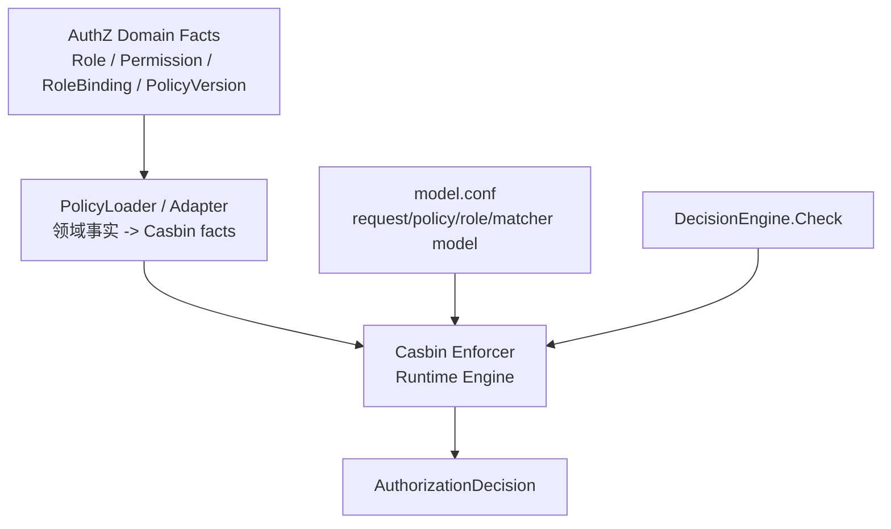
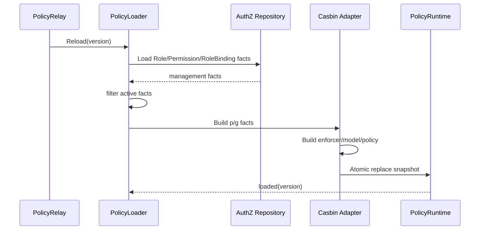

# Casbin 运行时模型

> 状态：设计目标 · 第一版正文，待继续按 Casbin runtime、policy adapter、model.conf、policy loader、DecisionEngine、RuntimeReload、REST/gRPC 契约和测试逐项核对。

---

## 1. 本文回答

本文回答 10 个问题：

- Casbin 在 AuthZ 中的定位是什么？
- 为什么 Casbin 是 infra runtime engine，而不是 AuthZ 领域模型？
- AuthZ 领域事实如何映射为 Casbin runtime facts？
- `r / p / g` facts 分别表达什么运行时语义？
- `model.conf`、matcher、adapter、enforcer、policy loader 分别承担什么职责？
- Check 链路如何通过 `DecisionEngine` 调用 Casbin runtime？
- RuntimeReload 时如何从管理事实重建 Casbin runtime policy？
- Casbin policy 和 `Role / Permission / RoleBinding / PolicyVersion` 的边界是什么？
- Casbin runtime 的幂等、并发、reload、故障和安全边界如何处理？
- 修改 Casbin runtime 时应该核对哪些代码和测试？

本文只讲 Casbin 运行时模型。
AuthZ 领域模型见 [01-领域模型-Subject-Resource-Action-Scope-Role-Permission-RoleBinding.md](01-领域模型-Subject-Resource-Action-Scope-Role-Permission-RoleBinding.md)；
权限检查链路见 [02-关键链路-权限检查Check.md](02-关键链路-权限检查Check.md)；
授权版本传播链路见 [04-关键链路-授权版本传播PolicyVersion-Outbox-RuntimeReload.md](04-关键链路-授权版本传播PolicyVersion-Outbox-RuntimeReload.md)；
设计取舍见 [../../05-专题设计/04-Casbin在AuthZ中的定位.md](../../05-专题设计/04-Casbin在AuthZ中的定位.md)。

---

## 2. 30 秒结论

Casbin 是 AuthZ 的 **infra runtime engine**。

它负责：

```text
加载 runtime policy；
执行 matcher；
基于 request facts 和 policy facts 返回 allow / deny；
支撑 AuthZ Check 的高效运行时决策。
```

它不负责：

```text
定义 AuthZ 领域模型；
替代 Role / Permission / RoleBinding；
替代 PolicyVersion；
替代 Outbox；
替代授权写入用例；
校验 AuthN Credential / Challenge；
签发 Token；
维护 Identity ProfileLink；
维护 Suggest Index。
```

核心映射关系：

```text
AuthZ domain facts
  Role / Permission / RoleBinding / PolicyVersion
    -> policy loader / adapter
    -> Casbin runtime facts
       r = request facts
       p = permission policy facts
       g = role binding / grouping facts
    -> enforcer / matcher
    -> AuthorizationDecision
```

如果只记一句话：

> AuthZ 的领域事实源是 Role / Permission / RoleBinding / PolicyVersion；Casbin 只是运行时执行这些事实投影后的策略引擎。

---

## 3. Casbin 在 AuthZ 中的位置

AuthZ 至少有三层事实：

```text
领域事实：Role / Permission / RoleBinding / PolicyVersion；
运行时事实：Casbin p/g policy、matcher input、runtime snapshot；
决策结果：AuthorizationDecision。
```

Casbin 位于运行时事实层。



读图规则：

```text
领域事实是源头；
policy loader 负责转换；
model.conf 定义运行时匹配模型；
Casbin enforcer 执行匹配；
DecisionEngine 把 runtime 结果翻译为 AuthorizationDecision；
transport 和业务代码不应直接调用 Casbin。
```

---

## 4. 为什么 Casbin 不是领域模型

Casbin 的 `p / g / r` facts 是运行时事实，不是业务领域语言。

例如：

```text
p, role:doctor, profile, read, organization:10

g, user:1001, role:doctor, organization:10

r = sub, obj, act, scope
```

这些 facts 很适合 runtime matcher，但不适合作为唯一领域事实源。

原因：

```text
p/g 行缺少完整业务生命周期；
p/g 行不天然表达审计原因、操作者、授予时间、撤销时间；
p/g 行不天然表达 PolicyVersion 的发布状态；
p/g 行不天然表达 Role/Permission/RoleBinding 的管理语义；
Casbin matcher 是运行时规则，不应反向定义业务模型；
业务文档不能退化成 Casbin CRUD。
```

正确关系：

```text
Role / Permission / RoleBinding / PolicyVersion
  -> runtime projection
  -> Casbin p/g facts
  -> Check
```

错误关系：

```text
Casbin p/g facts
  -> 反向当作 Role / Permission / RoleBinding 的唯一事实源
```

---

## 5. AuthZ 领域事实到 Casbin facts 的映射

### 5.1 领域事实

AuthZ 领域事实包括：

```text
Subject；
Resource；
Action；
Scope；
Role；
Permission；
RoleBinding；
PolicyVersion。
```

其中，常用于构建 Casbin runtime policy 的是：

```text
Role；
Permission；
RoleBinding；
PolicyVersion。
```

---

### 5.2 Casbin runtime facts

Casbin runtime facts 通常包括：

```text
r：request definition；
p：policy definition；
g：role/grouping definition；
e：policy effect；
m：matcher。
```

一个常见的抽象模型是：

```text
r = sub, obj, act, scope
p = sub_or_role, obj, act, scope, effect
g = sub, role, domain_or_scope
m = g(r.sub, p.sub_or_role, r.scope) && r.obj == p.obj && r.act == p.act && scopeMatch(r.scope, p.scope)
```

注意：

```text
这只是运行时模型示例；
当前项目具体 model.conf、matcher、字段顺序和函数名必须以代码和配置为准；
文档不能把示例写成已实现事实。
```

---

### 5.3 映射表

| AuthZ 领域对象 | Casbin runtime facts | 说明 |
| --- | --- | --- |
| `Subject` | `r.sub` / `g.sub` | Check 请求主体，或 role binding 中的主体 |
| `Resource` | `r.obj` / `p.obj` | 被访问资源或 permission 的资源 |
| `Action` | `r.act` / `p.act` | 请求动作或 permission 的动作 |
| `Scope` | `r.scope` / `p.scope` / `g.domain` | 授权范围、domain 或 matcher 条件输入 |
| `Permission` | `p` line | Role 或 Subject 拥有的可访问能力投影 |
| `Role` | `p.sub_or_role` / `g.role` | policy 中的 role 标识或 grouping 目标 |
| `RoleBinding` | `g` line | Subject 与 Role 的运行时绑定投影 |
| `PolicyVersion` | runtime metadata | 标记当前 runtime 加载哪个版本 |

---

## 6. model.conf

`model.conf` 定义 Casbin runtime 如何解释 request、policy、role 和 matcher。

它通常包含：

```text
[request_definition]
[policy_definition]
[role_definition]
[policy_effect]
[matchers]
```

### 6.1 request_definition

request definition 定义 Check 请求进入 runtime 时的字段。

示例：

```text
r = sub, obj, act, scope
```

含义：

```text
sub：Subject；
obj：Resource；
act：Action；
scope：Scope / Domain / Context projection。
```

---

### 6.2 policy_definition

policy definition 定义 permission policy 的字段。

示例：

```text
p = sub, obj, act, scope, eft
```

含义：

```text
sub：role 或 subject；
obj：resource；
act：action；
scope：allowed scope；
eft：effect，allow/deny。
```

---

### 6.3 role_definition

role definition 定义 Subject 与 Role 的关系。

示例：

```text
g = _, _, _
```

可能表达：

```text
g(subject, role, domain_or_scope)
```

---

### 6.4 policy_effect

policy effect 定义多个 policy 命中时如何合并结果。

常见策略：

```text
some(where (p.eft == allow))；
allow-override；
deny-override；
priority-based。
```

具体以项目 model.conf 为准。

---

### 6.5 matcher

matcher 是运行时判断核心。

它负责把：

```text
request facts + policy facts + role facts + custom functions
```

组合成 allow/deny。

关键要求：

```text
matcher 变化必须补测试；
matcher 中的自定义函数必须可测试；
matcher 不应绕过 Scope；
matcher 不应把 token 验签成功当成授权通过；
matcher 不能反向定义领域模型。
```

---

## 7. PolicyLoader / Adapter

`PolicyLoader` 或 Casbin adapter 负责把 AuthZ 领域事实转换成 Casbin runtime policy。

它负责：

```text
读取 Role / Permission / RoleBinding；
过滤 disabled/revoked 的授权事实；
把 Permission 转换成 p facts；
把 RoleBinding 转换成 g facts；
加载 model.conf；
构建 enforcer；
记录 loaded PolicyVersion；
暴露 reload 结果。
```

它不负责：

```text
创建 Role；
创建 Permission；
创建 RoleBinding；
校验 password / otp；
签发 Token；
执行 REST/gRPC 错误映射；
修改 Identity ProfileLink；
维护 Suggest Index。
```

---

## 8. p facts：Permission 投影

`p` facts 通常来自 `Permission`。

示例映射：

```text
Permission{
  Role: role:doctor,
  Resource: profile,
  Action: read,
  Scope: organization:10,
  Effect: allow,
}

->

p, role:doctor, profile, read, organization:10, allow
```

关键边界：

```text
p fact 是 Permission 的 runtime projection；
p fact 不是 Permission 领域对象本身；
p fact 不表达完整审计信息；
p fact 不表达创建者、授予原因、撤销时间；
p fact 应可从管理事实重建。
```

---

## 9. g facts：RoleBinding 投影

`g` facts 通常来自 `RoleBinding`。

示例映射：

```text
RoleBinding{
  Subject: user:1001,
  Role: role:doctor,
  Scope: organization:10,
}

->

g, user:1001, role:doctor, organization:10
```

关键边界：

```text
g fact 是 RoleBinding 的 runtime projection；
g fact 不是 RoleBinding 领域对象本身；
g fact 不等于 Identity.ProfileLink；
g fact 不表达完整生命周期；
g fact 应过滤 revoked/disabled binding；
g fact 应可从 RoleBinding 管理事实重建。
```

---

## 10. r facts：Check 请求投影

`r` facts 来自一次 `AuthorizationRequest`。

示例映射：

```text
AuthorizationRequest{
  Subject: user:1001,
  Resource: profile:2001,
  Action: read,
  Scope: linked_profile,
}

->

r.sub = user:1001
r.obj = profile:2001
r.act = read
r.scope = linked_profile
```

关键边界：

```text
r fact 是一次请求的 runtime input；
r fact 不是长期授权事实；
r fact 不应写入 Casbin policy store；
r fact 构造失败应拒绝，不应默认 global；
r fact 的来源应可追踪到 Principal、route、resource 和 context。
```

---

## 11. 自定义 matcher 函数

Casbin matcher 可能需要自定义函数。

典型函数：

```text
resourceMatch(requestResource, policyResource)；
actionMatch(requestAction, policyAction)；
scopeMatch(requestScope, policyScope)；
domainMatch(requestDomain, policyDomain)；
conditionMatch(context, condition)；
```

关键边界：

```text
自定义函数必须纯净、可测试、无隐式写副作用；
自定义函数不应访问 HTTP request concrete；
自定义函数不应写数据库；
自定义函数不应调用外部 provider；
复杂条件需要明确输入，不应依赖全局变量；
函数失败时应 deny 或返回错误，不能默认 allow。
```

---

## 12. DecisionEngine 调用 runtime

Check 链路不应让 transport 或业务代码直接调用 Casbin。

正确链路：

```text
transport / RouteAuthorizer
  -> application/authz Checker
  -> AuthorizationRequest
  -> DecisionEngine
  -> PolicyRuntime interface
  -> Casbin runtime adapter
  -> AuthorizationDecision
```

`DecisionEngine` 负责：

```text
校验 AuthorizationRequest；
调用 PolicyRuntime；
解释 runtime allow/deny/error；
填充 reason / matched policy / loaded version；
返回 AuthorizationDecision。
```

Casbin adapter 负责：

```text
把 AuthorizationRequest 转换为 r facts；
调用 enforcer.Enforce；
返回 runtime result；
暴露 loaded PolicyVersion；
处理 runtime error。
```

---

## 13. RuntimeReload

RuntimeReload 负责从管理事实或 runtime projection 重建 Casbin runtime。

主线：

```text
PolicyVersion changed
  -> PolicyLoader loads Role/Permission/RoleBinding
  -> build p/g facts
  -> build new enforcer / policy snapshot
  -> validate model and policy
  -> atomically replace runtime
  -> update loaded PolicyVersion
```

时序图：



关键规则：

```text
reload 不应放在数据库事务内；
reload 失败不能污染旧 runtime；
新 snapshot 构建成功后再替换旧 snapshot；
loadedVersion 只能前进，不能回退；
重复 reload 同一版本应幂等；
旧版本事件不能覆盖新 runtime。
```

---

## 14. 并发与线程安全

Casbin runtime 在 Check 和 Reload 之间存在并发。

风险：

```text
Check 正在读 runtime，Reload 正在替换 policy；
多个 Reload 并发执行；
旧 Reload 后完成覆盖新 Reload；
Enforcer 不是线程安全或使用方式不安全；
matcher 函数读写共享状态。
```

建议：

```text
使用 runtime snapshot；
新 snapshot 构建完成后原子替换；
Reload 使用互斥或 singleflight；
Check 只读取不可变 snapshot；
loadedVersion 只能单调前进；
matcher 自定义函数避免共享可变状态；
必要时用 race test 或并发测试覆盖。
```

---

## 15. Deny / Allow / Error 语义

Casbin runtime 返回结果需要翻译成 `AuthorizationDecision`。

| runtime 结果 | AuthorizationDecision | 对外语义 |
| --- | --- | --- |
| allow | `Allowed=true` | 继续业务请求 |
| deny | `Allowed=false, Reason=denied` | 403 / PermissionDenied |
| indeterminate | `Allowed=false, Reason=indeterminate` | 默认拒绝或内部错误，按策略决定 |
| runtime error | `Allowed=false, Reason=runtime_error` | fail closed，必要时返回内部错误 |
| policy not loaded | `Allowed=false, Reason=policy_not_loaded` | not ready 或 fail closed |

关键规则：

```text
不要把 runtime error 当 allow；
不要把 missing policy 当 allow；
deny reason 对外要克制；
内部日志要保留可诊断信息；
AuthorizationDecision 应尽量携带 loaded PolicyVersion。
```

---

## 16. 与 PolicyVersion / Outbox 的关系

Casbin runtime 应由 PolicyVersion 驱动加载。

```text
Authorization write
  -> PolicyVersion committed
  -> Outbox event
  -> RuntimeReload
  -> Casbin loadedVersion updated
  -> Check uses loadedVersion
```

边界：

```text
PolicyVersion committed 不等于 Casbin loaded；
Outbox published 不等于 Casbin loaded；
Casbin loadedVersion 应可观测；
Check 不应默认使用 latest committed version；
Check 应使用 runtime loaded version。
```

---

## 17. 与 Check 链路的关系

Check 链路通过 `DecisionEngine` 调用 runtime。

```text
AuthorizationRequest
  -> DecisionEngine
  -> Casbin runtime
  -> AuthorizationDecision
```

边界：

```text
Check 不应直接拼 Casbin p/g policy；
Check 不应主动写 Casbin policy；
Check 不应在每次请求全量 reload；
Check 可以读取 loaded version；
Check deny 后不应继续执行业务用例。
```

---

## 18. 与领域模型的边界

领域模型：

```text
Subject / Resource / Action / Scope / Role / Permission / RoleBinding / PolicyVersion
```

Casbin runtime：

```text
r / p / g / matcher / enforcer / adapter / snapshot
```

边界：

```text
领域模型可以脱离 Casbin 存在；
Casbin 可以被替换为其他 PolicyRuntime；
业务文档应讲 AuthZ 领域语言，而不是只讲 p/g；
运行时文档可以讲 p/g/r，但必须标记为 infra runtime；
测试应覆盖从领域事实到 runtime facts 的映射。
```

---

## 19. 与其他模块的边界

### 19.1 与 AuthN

```text
AuthN 负责 Principal 和 Token 验签；
Casbin runtime 不校验 password / otp；
Casbin runtime 不签发 AccessToken / RefreshToken；
Token 验签成功不等于 Casbin allow。
```

### 19.2 与 Identity

```text
Identity 提供 User/Profile/ProfileLink 事实；
Casbin runtime 不维护 User/Profile/ProfileLink 写模型；
ProfileLink 可以作为 Scope/condition 的输入，但不是 g fact 的同义词；
RoleBinding 才是授权绑定事实。
```

### 19.3 与 Suggest

```text
Suggest Index 不是 Casbin policy；
Suggest ProfileAccessScope 不是 AuthZ Scope；
搜索可见性可以调用 AuthZ Check 或使用授权过滤投影；
Casbin runtime 不维护 Suggest 索引。
```

---

## 20. 失败边界

| 场景 | 期望行为 | 说明 |
| --- | --- | --- |
| model.conf 解析失败 | runtime reload 失败 | 不应替换旧 runtime |
| p/g facts 构建失败 | runtime reload 失败 | 需要保留错误和告警 |
| permission 字段缺失 | reload 失败或跳过坏数据 | 策略必须明确，建议 fail closed |
| role binding 指向不存在 Role | reload 失败或忽略该 binding | 应由写入链路提前防住 |
| matcher 函数异常 | Check deny 或 runtime error | 不应默认 allow |
| runtime 未加载 | Check fail closed | 不应默认放行 |
| loadedVersion 回退 | 拒绝替换 | 防止旧策略覆盖新策略 |
| reload 与 check 并发 | snapshot 保持一致 | 避免半加载状态被读取 |
| Casbin 返回 false | AuthorizationDecision deny | 认证成功但授权失败 |

---

## 21. 可观测性

Casbin runtime 应暴露可观测信息。

建议指标：

```text
casbin_loaded_policy_version；
casbin_policy_count_p；
casbin_policy_count_g；
casbin_reload_attempts_total；
casbin_reload_failures_total；
casbin_reload_duration_seconds；
casbin_enforce_total；
casbin_enforce_allow_total；
casbin_enforce_deny_total；
casbin_enforce_error_total；
casbin_loaded_version_lag；
```

日志建议：

```text
reload start / success / failure；
loaded policy version；
policy counts；
matcher error；
runtime unavailable；
```

注意：

```text
不要打印完整 token；
不要打印敏感资源属性；
不要在对外响应泄露完整 policy 细节；
内部日志可以保留 policy version 和 traceID。
```

---

## 22. 测试重点

Casbin runtime 测试应覆盖：

```text
领域事实 -> p facts 映射；
RoleBinding -> g facts 映射；
AuthorizationRequest -> r facts 映射；
Scope/domain matcher；
resource/action matcher；
allow case；
deny case；
missing policy case；
revoked binding 不应生效；
disabled role/permission 不应生效；
PolicyVersion reload；
重复 reload 幂等；
旧版本不能覆盖新版本；
并发 Check + Reload；
runtime error fail closed。
```

---

## 23. 常见反模式

| 反模式 | 问题 | 推荐做法 |
| --- | --- | --- |
| 把 p/g facts 当领域模型 | infra runtime 吞并领域 | 领域事实仍是 Role/Permission/RoleBinding |
| transport 直接调用 Casbin | 绕过 application 和 DecisionEngine | transport 调 Checker |
| 业务代码散落 Enforce | 授权逻辑不可治理 | 统一走 AuthZ Check |
| Check 时自动写 p/g policy | 读链路写权限 | 写入走 Grant/Revoke/Bind/Unbind |
| 每次 Check 全量 reload | 性能和稳定性风险 | 由版本传播链路 reload |
| reload 失败清空 runtime | 大面积误拒或误放行 | 新 snapshot 成功后再替换 |
| missing policy 默认 allow | 严重安全风险 | fail closed |
| matcher 绕过 Scope | 越权风险 | Scope matcher 必须测试 |
| model.conf 改动不补测试 | 授权语义漂移 | matcher 和用例测试同步更新 |
| Casbin loadedVersion 不可观测 | 无法排查策略延迟 | 暴露 metrics/health/log |

---

## 24. 代码事实源

| 事实 | 路径 |
| --- | --- |
| AuthZ domain | `../../../internal/apiserver/domain/authz` |
| Role / Permission / RoleBinding | `../../../internal/apiserver/domain/authz` |
| AuthorizationRequest / AuthorizationDecision | `../../../internal/apiserver/domain/authz` |
| AuthZ application checker | `../../../internal/apiserver/application/authz` |
| DecisionEngine | `../../../internal/apiserver/application/authz`、`../../../internal/apiserver/domain/authz`，具体以代码为准 |
| Casbin runtime / policy adapter | `../../../internal/apiserver/infra` |
| PolicyLoader / RuntimeReload | `../../../internal/apiserver/infra` |
| model.conf | 配置路径以当前代码为准 |
| AuthZ container | `../../../internal/apiserver/container/authz` |
| REST/gRPC middleware | `../../../internal/apiserver/transport/rest`、`../../../internal/apiserver/transport/grpc` |
| 架构测试 | `../../../internal/pkg/architecture` |
| 专题设计 | `../../05-专题设计/04-Casbin在AuthZ中的定位.md` |

注意：上表中的具体路径需要继续与当前源码核对。如果源码目录已调整，应以代码为准并同步更新本文。

---

## 25. Verify

修改本文后至少执行：

```bash
make docs-hygiene
```

涉及 AuthZ 领域模型：

```bash
go test ./internal/apiserver/domain/authz/...
```

涉及 AuthZ Check / DecisionEngine：

```bash
go test ./internal/apiserver/application/authz/...
```

涉及 Casbin runtime / policy loader / runtime reload：

```bash
go test ./internal/apiserver/infra/...
```

具体路径以当前代码为准。

涉及 REST/gRPC middleware：

```bash
make api-validate
make proto-gen
go test ./internal/apiserver/transport/rest/...
go test ./internal/apiserver/transport/grpc/...
```

涉及分层依赖或模块边界：

```bash
go test ./internal/pkg/architecture
```

---

## 26. 本文总结

Casbin 运行时模型可以压缩成：

```text
AuthZ domain facts
  Role / Permission / RoleBinding / PolicyVersion
    -> PolicyLoader / Adapter
    -> Casbin runtime facts
       p = permission projection
       g = role binding projection
       r = check request projection
    -> Enforcer / Matcher
    -> AuthorizationDecision
```

最重要的边界是：

```text
Casbin 是 infra runtime engine，不是 AuthZ 领域模型；
p/g/r facts 是运行时事实，不是业务领域语言；
Role/Permission/RoleBinding/PolicyVersion 才是授权事实源；
transport 和业务代码不应直接访问 Casbin；
Check 应通过 DecisionEngine 调用 PolicyRuntime；
RuntimeReload 应由 PolicyVersion/Outbox 驱动；
runtime error 和 missing policy 必须 fail closed；
Casbin loadedVersion 必须可观测。
```
