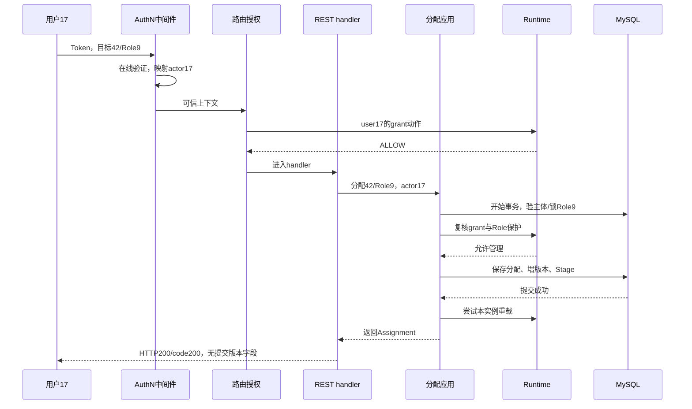

# 关键链路：REST 管理与路由授权

> 状态：已实现 · 2026-10-06 对照组合根、Gin路由、身份映射、管理应用与机器契约深化；源码推论和实际测试分开取证。

## 1. 先明确管理请求在判定谁

用户17携带AccessToken，要求把Role9分配给用户42。路由检查的是**用户17能否执行assignments/grant**；用户42是被管理主体，不是本次操作者。body即使填写`granted_by:"999"`，handler仍以认证UserID的十进制字符串`"17"`记录授予人。

REST v4管理入口位于`/api/v4/authz`，提供Role、Assignment、PermissionGrant和Resource操作，没有`/api/v4/authz/check`。服务间动作判断和范围投影使用[gRPC与SDK](06-关键链路-gRPC服务间授权与SDK.md)，不能用管理列表手工拼权限而绕过Runtime证明预算。

一次管理请求要区分三种约束：路由动作能力、目标Role的管理保护、领域事实的引用/范围/事务规则。管理写入会在应用再次检查动作，但查询应用主要检查对象可见性，不能概括成所有入口都执行同样的第二次鉴权。

## 2. 从Token到两份可信上下文

[JWT middleware](../../../internal/pkg/middleware/authn/jwt_middleware.go)只接受用户AccessToken，并传入当前资源audience。当前在线Verifier依次检查签名/issuer/时效、token类型与audience、撤销标记、active Session和User/LoginIdentity准入；这条链不等于下游仅用JWKS做本地验签。

验证通过后，applyVerifiedClaims同时建立：

| 输入到输出 | 使用者 | 当前责任 |
| --- | --- | --- |
| Claims.UserID → Gin/requestctx UserID | RequirePermission及REST handler | 构造路由Subject、审计字符串及Resource命令Actor |
| Claims.UserID → 标准context的management actor | Role/Assignment/Grant Guard | 以可信用户身份复核操作及受保护Role |
| LoginIdentityID、OrgID、TokenID | 相应用例/审计上下文 | 不自动成为AuthZ路由的公司范围或角色 |

RequirePermission从可信UserID形成`user:17`，资源和动作由服务端路由注册提供；Request没有把OrgID、URL中的RoleID或body中的Subject带入操作者身份。业务OrgID不在这里建立租户授权分区，用户17也不因body目标在另一个Org就被自动拒绝。

认证器的任何调用错误，以及无效/缺失Token，都会被REST middleware折叠为`ErrTokenInvalid=102002`、HTTP401。在线数据库或撤销存储故障也可能形成401；不能仅凭响应断言客户端Token确实失效。认证实现及准入规则由[AuthN](../02-AuthN/03-Session-Token与JWKS.md)拥有。

当前兼容取Token顺序为非空Authorization header、query的token、cookie的access_token。header支持Bearer形式或直接Token，非空但格式错误时不会回退其他来源。这是现行输入行为，管理调用应显式使用Authorization header；本文未做这些来源组合的完整HTTP验收。

### 2.1 一个Assignment授予请求的责任链

下图是普通顶层请求的成功路径。实际Role保护、主体存在性、重复关系或授权失败会在相应边界停止；图不表示所有步骤共享同一权限版本。

handler只信任认证结果映射的actor。公开Assignment DTO里的granted_by被忽略，不代表该字段会被拒绝；AuthZ DTO没有user_id替代身份字段，当前外层JSON也未统一开启未知字段拒绝。退役的constraint_set/attribute_schema则由专用解码器验证，仅接受空兼容值，不能把“忽略无关字段”和“拒绝非空退役字段”混为一谈。

## 3. 路由如何绑定动作

下表列出现行管理路由，冒号参数表示实际Gin路径。路径与资源/动作绑定来自[router](../../../internal/apiserver/transport/rest/authz/router.go)及[常量](../../../internal/apiserver/application/authz/authorization/route_permissions.go)，不能只按HTTP verb猜权限。

| Method + Path（共同前缀/api/v4/authz） | Resource | Action/用途 |
| --- | --- | --- |
| POST /roles | iam:authz:collection:roles | create |
| GET /roles | 同上 | list |
| GET /roles/:id | 同上 | read |
| PUT /roles/:id | 同上 | update |
| DELETE /roles/:id | 同上 | delete |
| GET /roles/:id/assignments | iam:authz:collection:assignments | list |
| POST /assignments/grant | 同上 | grant，无Scope分配 |
| POST /assignments/revoke | 同上 | revoke，按Subject+Role覆盖全部公司 |
| DELETE /assignments/:id | 同上 | revoke，定位单条Assignment |
| GET /assignments/subject | 同上 | list，目标来自query |
| POST /grants | iam:authz:collection:permission_grants | create，精确目录资源/动作 |
| DELETE /grants/:id | 同上 | revoke |
| GET /roles/:id/grants | 同上 | list |
| POST /resources | iam:authz:collection:resources | create |
| GET /resources | 同上 | list |
| GET /resources/:id | 同上 | read |
| GET /resources/key/:key | 同上 | read |
| PUT /resources/:id | 同上 | update |
| DELETE /resources/:id | 同上 | delete |
| POST /resources/validate-action | 同上 | validate_action，仅检查目录支持 |
| GET/POST /role-inheritances | 无路由AuthN/AuthZ | 固定410墓碑 |
| DELETE /role-inheritances/:id | 无路由AuthN/AuthZ | 固定410墓碑 |
| GET /health | 无路由AuthN/AuthZ | status=ok,module=authz |

Grant在这里有两个不同用法：Assignment的grant动作给主体分配Role；PermissionGrant/create给Role增加资源动作能力。REST按数据库ID定位它们，服务间Assignment可按稳定role_name定位，最终进入同一应用事实规则。REST没有完整受管集合或公司Scope替换入口，Assignment输出也不带Scope和策略版本；具体撤销及替换边界由[授权写入](03-关键链路-授权写入与受管Assignment.md)拥有。

validate-action请求例如目录中的assessments/retry，仅回答该目录是否登记retry；即使valid=true，也不证明当前用户可retry、某业务对象可重试或此次调用已经授予能力。

### 3.1 组合根与局部注册是两个条件

局部AuthZ.Register只要engine存在，就先注册health与三条继承墓碑；随后要求RoleHandler、认证函数和Permission函数都存在，才注册受保护组。Assignment/Grant/Resource handler缺失时，对应子路由不注册。RoleHandler是整个保护组的前提，不能推断其他handler单独存在便能管理其子资源。

实际组合根先检查模块available、至少一个AuthZ handler、JWT middleware与AuthZ middleware，再调用局部Register。缺少JWT时，连AuthZ局部health也可能不注册；不是必然留下一个200探针。checker由依赖装配构成；运行期RequirePermission遇到缺失checker则500并停止handler。

“无路由AuthN/AuthZ”不等于绕过全部HTTP处理：全局安全、日志、追踪等middleware仍可执行；CORS预检OPTIONS可提前返回200。继承墓碑不访问业务数据库，局部health也不探测快照、订阅、MySQL或整实例readiness。静态契约、当前实例注册表及生产Ingress可达性仍分别取证。

## 4. 管理保护的边界：能力、对象与委派

### 4.1 原始动作与manage_protected是两道不同检查

REST用户修改受保护Role，须持有roles/update，且须持有roles/manage_protected。仅有后者不允许任意创建、更新、删除或分配；普通Role命名为admin也没有豁免。Guard内可信service=admin是内部服务通道的例外，REST用户不会因角色名或提交字符串而成为这个服务身份。

Role、Grant写入使用RequireOperation复核原始动作，再对目标Role检查管理保护；Assignment使用RequireAssignment，REST用户仍按grant/revoke动作检查。ResourceCatalog则以命令的Actor再次检查resources对应写动作。该Actor由REST可信UserID构造，应用只检查非零并交给authorizer，不独立认证Actor或和私有context actor比较；受信适配器的身份映射是合同的一部分。

目录写入还检查事实依赖：有效Grant仍使用的动作不能被目录更新删去，仍有有效Grant引用的Resource不能删除；Role删除也检查Assignment及有效Grant。锁和事务保证这些被管理事实的完整性，不等于把操作者的权限快照一起锁定。

路由、原始动作、受保护能力是多次独立Runtime读取，可能看到不同版本。路由v41允许后，应用复核看到撤权v42可以拒绝；应用复核也通过后才发布撤权，写入仍可能提交。当前没有将判定版本绑定到提交的协议，不能把双重检查称为原子撤权屏障。传播预算见[多实例收敛](04-关键链路-多实例策略收敛.md)。

### 4.2 Grant创建权是策略配置权

用户U已持有普通Role R，同时有permission_grants/create。若目录登记了assessments/retry，当前Create会锁Role与Resource、验证目录动作及Role保护，但**不检查U是否原先能retry**；U可以向R增加这条能力，随后U及R的其他持有人随快照收敛获得它。无需另创建Assignment，因此这次操作不检查assignments/grant。

这个情境是完整应用检查顺序的代码推论，尚无普通用户贯穿REST的专项验收。当前也没有在这里禁止自授、限制与操作者同Org、或按操作者已有能力计算可授予子集。permission_grants/create应按被信任的策略管理权配置，不能解释为有限委托。

敏感能力承载是另一个约束：[Role保护规则](../../../internal/apiserver/domain/authz/role/protection.go)只将roles/manage_protected、Resource目录create/update/delete及Profile全量list/search两项列为必须由protected Role承载的能力，并检查通配覆盖。permission_grants/create和assignments/grant自身不在该敏感集合。它不是自动识别所有高风险权限的分类器；保护类别也不会给Role自动添加任何能力。

创建Role可声明standard/protected，创建protected还须相应管理能力；现行Role更新DTO不修改Name或ManagementProtection。Grant不可原地编辑：变更能力使用创建/撤销事实，已撤销Grant的重复撤销不推进版本，但仍须通过原始动作和Role保护。

### 4.3 查询可见性不是通用数据范围

| 应用读取 | 当前检查 | REST之外调用的前提 |
| --- | --- | --- |
| Role详情/列表 | protected Role需manage_protected；standard直接可见 | 未统一重查read/list动作 |
| Assignment按Role/Subject列表 | 按关联Role的管理可见性过滤；按Role查询先核对可见性 | 不按本人、公司或Assignment Scope限制目标集合 |
| Role的Grant列表 | 核对Role可见性，只取有效Grant | 不重新检查permission_grants/list |
| Resource读取/列表/validate-action | 直接读目录Repository | 原动作由REST路由等适配器承担 |

无资格读取受保护Role详情，或以其ID查询相关分配/Grant时返回404；有能力调用list并不等于有能力看protected对象。Role列表先取全量、过滤可见对象，再分页，total只计算可见集合。它避免隐藏对象占据页位或混入总数，代价是全量读取与逐对象检查；不能据此承诺大目录固定耗时。

例如两个Role，一个standard、一个protected，用户有roles/list但没有manage_protected。请求limit=1可返回普通Role、total=1，不把数据库原始总数2暴露为列表总数。这是算法推演，尚未找到过滤分页total的专项测试。可见性检查也可能多次读取不同策略，不保证列表筛选与路由判定同一版本；404只描述这些读取入口，不是消除全部管理接口存在性线索的承诺。

管理读取不用于QS业务对象的数据Scope准入。相关动作与业务范围配对算法归[领域模型](01-领域模型设计.md)；同一应用能力被内部调用时，需要明确其可信调用者与动作授权责任。

## 5. DTO行为、成功响应与机器契约缺口

| 请求或输出 | 当前实现 | 使用时的具体后果 |
| --- | --- | --- |
| Role PUT | display_name/description是普通string，handler总传指针 | 省略display_name或仅改description会400；提供名称但省略description会清空描述 |
| Resource PUT | 名称/描述是指针，省略或null不更新 | 显式空名称、空actions拒绝；不据HTTP PUT推断与Role相同的部分更新合同 |
| Role GET列表省略limit | Gin绑定为0，应用裁剪到0条 | 可能有非零可见total却返回空data；客户端应显式提供limit |
| 创建、删除、撤销成功 | HTTP200，AuthZ DTO的code=200 | 删除不是204；不能套用其他模块通用code=0 |
| 写入返回的Role/Assignment/Grant/Resource | 不含committed PolicyVersion | 200不是加载水位或所有实例生效回执 |
| 空退役兼容字段 | 专用解码校验，输出固定空结构 | 非空条件/属性、未知内层键被拒，不能恢复旧能力 |

当前AuthZ OpenAPI是3.0.3，不是3.1；存在以下已核对偏移：管理操作没有security声明，但路由强制用户认证；Role更新schema未声明display_name必填；Role列表limit声明默认10但运行时省略为0；错误响应及空兼容结构约束也未完整反映代码。机器契约是维护入口，不能在这些已知差异上把它当完整运行事实。

现行check-route-contracts比较Swagger/OAS method/path集合，不直接检查Gin动作绑定或security。check-openapi-contracts对schema名取短名，而AuthZ组件仍使用完整历史标识，当前17个AuthZ DTO比较候选全部被跳过；绿色结果不能证明本模块字段/required已比对。门禁实现和其他模块差异由[契约治理](../../04-接口与SDK/01-REST-gRPC与契约治理.md#2-rest-契约闭环)登记。本轮只校准文档，没有改变DTO、机器契约、默认值或检查脚本。

## 6. 错误必须按失败层解释

| 失败层 | 当前响应 | 不能反推什么 |
| --- | --- | --- |
| Token缺失/拒绝、在线验证调用失败 | 401/102002 | 不能仅凭401区分错误凭证与认证依赖故障 |
| 无可信UserID | 401 | body目标身份不能补足操作者 |
| 路由或应用动作DENY、protected写入无资格 | 403/103001 | 角色名称不能替代Grant |
| Runtime无有效新鲜度证明 | 503/103002 | 不应转成普通DENY或默认ALLOW；并非一条同步错误就立即触发 |
| 缺checker/其他路由授权内部错误 | 500 | 不以403隐藏授权故障 |
| JSON绑定或输入非法 | 400 | 兼容空字段与未知普通字段处理不同 |
| 受保护Role不可见/已不存在的读取对象 | 相应404 | 不声明所有非法引用都404 |
| Role/Resource仍被事实引用、重复有效授权 | 相应409 | 不自动删除依赖或静默当成功 |
| DB/UoW失败 | 依返回错误映射，通常5xx | 不能从任意5xx确认所有写入均未提交 |
| 已退役继承路由被注册并命中 | 410、字符串code | 不用通用数字成功/错误包体解析墓碑 |

普通顶层REST请求新开事务时，callback/Stage失败并确定回滚，事实、版本、Outbox一起回滚。Required借用事务的宿主回滚责任、commit结果不确定和请求重放另作处理；请求取消也不是所有内存判定已停止的独立保证。当前普通命令忽略本地reload最终错误，数据库提交后仍可能200。具体持久边界由[授权写入](03-关键链路-授权写入与受管Assignment.md)拥有。

## 7. 跨模块动作的实际例子

| 模块入口 | 当前路由能力 | 边界 |
| --- | --- | --- |
| AuthN JWKS管理 | jwks的create/list/read/retire/force_retire/cleanup/list_publishable | 没有HTTP rotate动作；公开JWKS另走公开读取 |
| AuthN Session撤销 | sessions的明确撤销动作 | 用户认证与动作判断；不按管理角色名放行 |
| IDP WeChat App管理 | wechat_apps的创建/读取/更新、启停、两类密钥轮换、Token读取/刷新 | 当前没有DELETE；不能概括为完整CRUD |
| Suggest搜索 | AuthZ可用且checker装配时检查profiles/search | 缺AuthZ时允许仅JWT的降级入口，普通可见性与全量能力仍由查询协作决定 |
| Cache governance debug | cache_governance/read | 生产要求运维认证/动作；开发诊断装配另有分支 |

这里的简称对应`route_permissions.go`等服务端常量及各模块router；当前没有一个名为permission catalog的独立代码组件。路由键、动作目录和初始/维护Grant需要一起核对，但目录登记动作本身不会授予任何用户。

Suggest的降级是该模块的明确分支，不能套用于AuthZ管理；缺checker时全量/手机号能力关闭，普通owner/OrgID/显式ProfileID可见性按[Suggest查询](../05-Suggest/03-关键链路-SuggestProfile查询.md)执行。本页不复制其对象规则。

## 8. 为什么保留路由与应用两层检查

| 方案 | 收益 | 当前选择与代价 |
| --- | --- | --- |
| 所有检查只放路由 | HTTP责任集中，容易绑定每个路径 | 内部写入容易绕过；当前写应用仍复核，读应用却没有统一同等动作门禁 |
| 原操作写入复核＋目标Role保护 | 限制可信传输或内部调用对保护事实的修改 | 多次快照读取，不提供提交时撤权屏障；读应用负责管理可见性，适配器承担原始read/list动作 |
| 管理者可授予的能力限制为其已有子集（候选） | 给委托设上界 | 策略管理员未必被允许执行所有业务动作；还要处理通配覆盖、动态变化及已有Role持有人，当前未实现 |
| 按操作者/服务配置可授予能力白名单（候选） | 可使策略治理与业务执行权分开 | 需要独立的委派事实、维护与审计规则；当前Assignment服务白名单并不约束PermissionGrant创建 |

不能仅把“二次鉴权”和“最小权限”写为口号。当前明确选择了受信策略配置权和固定敏感承载保护；如果将接口交给公司管理员或有限委托者，应先设计管理范围与可授予集合，再调整合同和证据，而不是从业务OrgID或Role名字推导现有能力。

## 9. 验证与变更入口

| 关注点 | 已有测试入口 | 实际覆盖 |
| --- | --- | --- |
| 用户Claims映射 | [AuthN middleware测试](../../../internal/pkg/middleware/authn/jwt_middleware_test.go) | 断言Gin的UserID/LoginIdentityID/TokenID；未断言标准context的management actor/OrgID或完整Token/依赖故障HTTP链 |
| ALLOW/DENY/401/500/503及路由输入转换 | [AuthZ middleware测试](../../../internal/pkg/middleware/authz/middleware_test.go)、[路由Decision测试](../../../internal/apiserver/application/authz/authorization/route_decision_service_test.go) | middleware的checker替身忽略入参；Decision测试用人工Subject验证标准Request，不证明Token到可信Subject的完整来源链 |
| 注册时部分能力绑定、局部410墓碑 | [AuthZ路由测试](../../../internal/apiserver/transport/rest/authz/router_permissions_test.go) | 捕获Grant/Assignment六种能力对，不逐路径请求验证Role/Resource全部动作 |
| 组合根注册与局部health | [Router测试](../../../internal/apiserver/transport/rest/router_test.go)、[矩阵测试](../../../internal/apiserver/transport/rest/router_matrix_test.go) | Gin注册表/替身，未证明生产Ingress |
| protected详情隐藏 | [Role handler测试](../../../internal/apiserver/transport/rest/authz/handler/role_isolation_test.go) | 直接handler、SQLite查询，绕过路由认证/授权 |
| manage_protected不替代原动作 | [Guard测试](../../../internal/apiserver/application/authz/management/protection_test.go)、[敏感承载测试](../../../internal/apiserver/domain/authz/role/protection_test.go) | 替身判定及领域保护 |
| Resource省略、空名称与空actions | [Resource handler测试](../../../internal/apiserver/transport/rest/authz/handler/resource_test.go) | JSON→命令，未含null用例或完整目录写入验收 |
| 依赖冲突及重复Grant撤销 | [Role应用测试](../../../internal/apiserver/application/authz/role/command_service_integration_test.go)、[目录应用测试](../../../internal/apiserver/application/authz/resource/command_service_integration_test.go)、[Grant应用测试](../../../internal/apiserver/application/authz/permissiongrant/service_integration_test.go) | SQLite/授权与事件替身，不等于真实MySQL普通用户HTTP端到端 |

伪造granted_by的完整HTTP链、策略配置权扩展目标能力、过滤后分页total、多次鉴权跨版本，以及Role PUT/默认limit完整handler行为，均有当前源码依据，尚未找到覆盖完整情境的专项测试。现有MySQL写竞争测试使用可信admin或放行目录作者，证明的是事实锁与依赖约束，不能扩大为REST用户管理边界验收。

新增或修改端点时，同步实际router、资源/动作常量、目录与初始/维护Grant、DTO映射、OpenAPI、消费者及正反用例；检查执行数量/覆盖范围也要核对，不能只保存绿色结论。请求输入、受信操作者、事实提交、实例加载、生产路径和业务正反结果分别记录。
