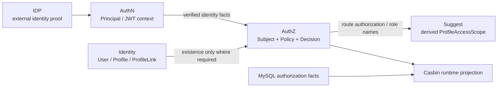

# AuthZ 模块边界与代码索引

> 状态：已实现 · 本文把 AuthZ 与其他模块的概念边界、依赖方向和修改落点映射到当前代码。

## 1. 边界总图



AuthZ 对外提供“判定、快照、授权管理”能力，不拥有认证证明、用户资料或第三方身份。

## 2. Principal、Subject、User 不是同一个对象

| 对象 | 所属模块 | 含义 | 生命周期 |
| --- | --- | --- | --- |
| User | Identity | IAM 内长期业务主体 | 持久 |
| LoginIdentity | AuthN | 可登录入口 | 持久 |
| Principal | AuthN | 一次认证成功后的运行时结果 | 请求/会话相关 |
| Subject | AuthZ | 被授权的 typed reference | 判定输入/授权事实 |

典型转换：

```text
Principal.UserID=42 -> Subject{Type:user, ID:42} -> "user:42"
```

转换只取已验证标识，不把 `AMR`、credential 或 profile 自动变成权限。若未来要基于认证强度授权，应把它显式建模为环境属性或前置认证策略，而不是把 Principal 整体塞进 Casbin 字符串。

## 3. RoleBinding 与 ProfileLink 的差异

两者都像“连接表”，但语义完全不同：

| 对比 | RoleBinding | ProfileLink |
| --- | --- | --- |
| 所属模块 | AuthZ | Identity |
| 左侧 | Subject | User |
| 右侧 | Role | Profile |
| 回答 | 主体具有什么授权角色 | 用户与业务档案是什么关系 |
| 影响 | 资源访问判定 | 身份/档案归属及 Suggest 读模型 |

把 ProfileLink 当权限会让业务关系和安全策略互相污染：解除档案关系可能意外撤权，角色变更又会篡改身份关系。两套关联必须独立演化。

## 4. AuthZ 与 Suggest

Suggest 使用 AuthZ runtime 的两个窄能力：

- 查询直接角色，用于识别平台/租户管理员；
- 对 `iam:identity:collection:profiles + search_by_mobile` 做 route authorization。

之后它把结果编译成自己的 `ProfileAccessScope`，在内存候选上过滤。这里要区分：

- AuthZ `scope.Scope` 是 policy/request 的匹配维度，当前为 all/origin；
- Suggest `ProfileAccessScope` 是派生读模型的可见集合，含 OrgIDs、ProfileIDs、OperatorID；
- 二者名称相似，但不能互相序列化或直接替代。

Suggest 的本地过滤是对高频候选的性能优化，详情接口仍需自己的权威授权，不能把“出现在联想结果中”当成完整读取许可。

## 5. AuthZ 与 Casbin

依赖方向应是：

```text
domain authz <- application ports <- infra/casbin adapter <- casbin library
```

允许：application 定义 `DecisionEngine`、`SnapshotStore`、`RuntimePolicyReloader` 等端口，infra 实现。

禁止：

- transport 直接调用 `enforcer.Enforce`；
- domain import Casbin；
- application 使用 `[]string` 拼 `p/g` facts；
- 管理接口直接 `AddPolicy` 并绕过 UoW；
- 业务系统复制 matcher 实现自己的“近似授权”。

## 6. 分层代码地图

### 6.1 Domain

| 概念 | 路径 | 关键职责 |
| --- | --- | --- |
| Subject | `domain/authz/subject` | typed ref 与 key 语义 |
| Tenant | `domain/authz/tenant` | 授权域值对象 |
| Resource/Action | `domain/authz/resource` | 四段 key、catalog action/scope |
| Scope | `domain/authz/scope` | all/origin 规范化 |
| Role | `domain/authz/role` | 租户内角色 |
| RoleBinding | `domain/authz/rolebinding` | Subject 到 Role |
| Permission | `domain/authz/permission` | Role 到资源动作范围 |
| Policy | `domain/authz/policy` | PolicyChange、不变量、VersionEvent |
| Decision | `domain/authz/decision` | typed request 与 allow/deny |

根级 AuthZ 兼容 facade 已退役；生产代码与测试均直接 import resource、role、assignment、policy 等语义子包，架构测试禁止根级 facade 回流。

### 6.2 Application

| 用例 | 路径 | 说明 |
| --- | --- | --- |
| Check / Snapshot | `application/authz/authorization` | 判定与 app 级快照 |
| Policy write | `application/authz/policy` | Grant/Revoke 与统一 committer |
| Role lifecycle | `application/authz/role` | 角色目录管理 |
| Resource lifecycle | `application/authz/resource` | 资源目录管理 |
| RoleBinding | `application/authz/rolebinding` | Bind/Unbind |
| Policy sync | `application/authz/policysync` | 消费版本事件并 reload |
| Policy lint | `application/authz/policylint` | 检查持久事实漂移 |
| Assignment auth | `application/authz/assignmentauth` | 授权管理接口自身的保护 |

### 6.3 Infrastructure

| 适配器 | 路径 | 说明 |
| --- | --- | --- |
| Casbin | `infra/casbin` | facts 映射、matcher、缓存、reload、health |
| Casbin fact repo | `infra/mysql/casbinrule` | 事务内写 `p/g` facts |
| Role/Resource/Binding repo | `infra/mysql/{role,resource,rolebinding}` | 管理实体 |
| PolicyVersion repo | `infra/mysql/policy` | 租户版本递增与读取 |
| AuthZ UoW | `infra/mysql/uow/authz` | 同一事务提供全部 repo 和 event stager |

### 6.4 Transport 与组合根

| 层 | 路径 | 重点 |
| --- | --- | --- |
| REST | `transport/rest/authz` | DTO、管理接口、Check |
| gRPC | `transport/grpc/service/authz` | Check、Snapshot 等 RPC |
| Container | `container/authz` | module、infra/domain/application、REST/gRPC/runtime 装配 |
| 契约 | `api/rest/authz.v2.yaml`、`api/grpc/iam/authz/v2/authz.proto` | 对外形状 |
| SDK | `pkg/sdk/authz` | 下游调用模型 |

## 7. 典型修改应该落在哪里

### 新增资源或动作

1. 先定义资源 key、action 和允许 scope；
2. 更新资源目录/seed/migration；
3. 更新路由权限映射；
4. 验证 policy lint；
5. 更新 REST/gRPC/SDK 契约（若对外暴露）；
6. 增加 matcher 与端到端判定测试。

不要只在业务 handler 中写字符串，也不要只插一条 `casbin_rule`。

### 新增 Scope kind

至少同时修改：

- `domain/authz/scope` 的构造与解析；
- Resource 的 `ScopeKinds` 校验；
- Casbin scope 编解码和 matcher；
- DB 历史数据迁移；
- REST/gRPC/SDK DTO；
- Grant、Check、Snapshot、lint 测试。

它是跨层契约变化，不是一个 enum 小改动。

### 改写 matcher

matcher 是全局授权语义。修改前必须列出旧规则对新 matcher 的解释差异，准备数据扫描或 migration，并至少覆盖 allow/deny、跨 tenant、通配、非法历史事实和性能回归。

### 强化撤权一致性

需要同时改变传播状态模型、实例身份、loaded version、健康/指标和写接口响应契约。只在 event handler 增加一次 reload 不能证明强一致。

## 8. 测试护栏

| 护栏 | 主要测试位置 |
| --- | --- |
| 领域值对象与不变量 | `domain/authz/**/*_test.go` |
| 写事务/版本/outbox | `application/authz/policy/*_test.go`、`infra/mysql/uow/authz` |
| matcher/facts | `infra/casbin/*_test.go` |
| 多实例 channel/event | `application/authz/policysync`、`container/authz/policy_sync_test.go` |
| REST/gRPC 映射 | `transport/rest/authz`、`transport/grpc/service/authz` |
| 依赖方向 | `internal/pkg/architecture/architecture_test.go` |

## 9. 当前风险清单

1. 没有 per-tenant loaded version，无法严格证明实例与 committed version 对齐。
2. Revoke/Unbind 在多实例传播窗口内可能继续被旧实例允许。
3. 同实例 reload 持写锁，策略集增大后可能抬高 Check 尾延迟。
4. ActionPattern 是正则，治理与性能依赖校验/lint。
5. 非法旧 scope 的兼容回落可能比严格拒绝更宽松。
6. Snapshot 易被下游误用为安全判定，需要在 SDK 和接入文档持续约束。

这些是当前设计的已知边界，不等于已实现改造项。

## 10. 验证

```bash
/Users/yangshujie/.gvm/gos/go1.25.12/bin/go test \
  ./internal/apiserver/domain/authz/... \
  ./internal/apiserver/application/authz/... \
  ./internal/apiserver/infra/casbin/... \
  ./internal/apiserver/transport/rest/authz/... \
  ./internal/apiserver/transport/grpc/service/authz/... \
  ./internal/apiserver/container/authz/...
```
