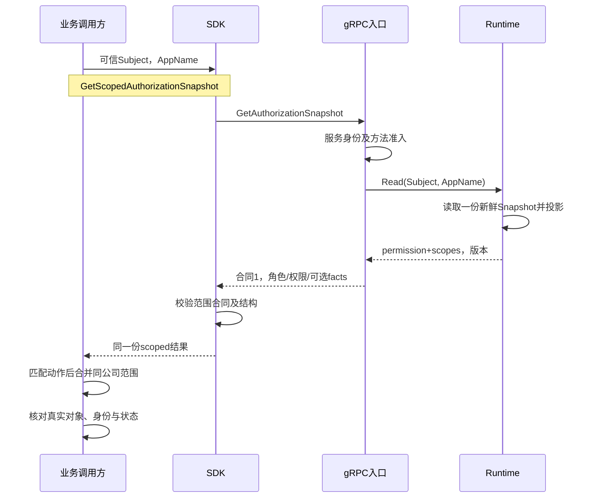

# 关键链路：gRPC 服务间授权与 SDK

> 状态：已实现 · 2026-10-06 对照v4协议、服务入口、受管准入与SDK深化；本地传输验证、代码推论及业务接入要求分别说明。

## 1. 一次调用里有三个不同身份

qs-apiserver.svc用服务证书请求判定user:42能否retry。证书证明调用服务；Subject指定被判定主体；业务服务应从自己的可信用户上下文得到42。IAM不会因为这次RPC来自QS，就重新验证用户42的Token、Session、active状态或有效业务身份。

同一服务提交GrantAssignment(Subject=user:42, RoleName=qs:assessment_operator, GrantedBy=user:17)时，用户42是目标，user:17是委派来源声明，可信管理actor仍是证书解析得到的qs-apiserver.svc。IAM按服务内容准入和Role保护处理，不将user:17变成已认证的REST操作者，也不检查其管理动作。委派声明的格式校验与身份核验是两件事。

如果业务服务把终端随意提交的user_id填入Subject，IAM可能正确判定了另一个人的能力。调用服务必须拥有身份映射与业务准入；方法ACL、SDK和IAM主体格式校验不能修复错误来源。完整模块责任见[协作边界](07-模块边界-AuthZ与AuthN-Identity-Suggest.md)。

Go module/SDK为v5，AuthZ线协议为v4。当前[proto](../../../api/grpc/iam/authz/v4/authz.proto)只有七个RPC：

| RPC | 输入与额外准入 | 返回含义 |
| --- | --- | --- |
| Check | Subject、Resource、具体Action | 动作Decision、命中Grant/Role、所用PolicyVersion；没有数据Scope |
| GetAuthorizationSnapshot | Subject、AppName；可选include_assignment_facts另作维护准入 | 应用角色、permission+scopes、版本、范围合同；可选主体完整分配事实 |
| GetCommittedPolicyVersion | handler固定要求qs-apiserver.svc | 已提交数据库全局版本；不查询或刷新Runtime |
| GrantAssignment | role_name增量授予、服务白名单及Role保护 | PolicyVersion；创建无Scope分配 |
| RevokeAssignment | Subject+role_name、服务白名单及Role保护 | PolicyVersion；撤销该岗位在全部公司的分配 |
| ReplaceManagedAssignments | 完整无范围目标T、服务受管集合M、changed_by | 本次T、PolicyVersion、Changed；没有wire期望版本 |
| ReplaceScopedAssignments | 单公司完整目标T与Scope、正数ExpectedPolicyVersion、相同受管准入 | 本公司本次T、PolicyVersion、Changed；没有Scope或Assignment ID回执 |

GetScopedAuthorizationSnapshot是SDK对同一个Snapshot RPC的校验封装。完整facts也是Snapshot的可选输出，没有独立GetAssignmentFacts RPC或SDK方法。ReplaceScopedAssignments才是独立RPC；老服务返回Unimplemented，可以避免把未知范围字段忽略后执行无范围替换。不能在这一错误上回退旧Replace。

## 2. 证书、方法ACL与方法内部规则分开执行

### 2.1 服务名并不总等于证书CN原文

当前IAM装配pinned component-base v0.8.0的mTLS身份提取器。它优先使用SPIFFE URI SAN的sa段；没有URI服务名才使用CN。包含.svc.的Kubernetes长CN取第一个点之前的名字，qs-apiserver.svc则原样保留。namespace及URI信息会被提取，但当前ACL和Assignment准入的key只使用最终ServiceName，IAM未另装身份validator按trust-domain/namespace绑定权限。

例如把证书CN从qs-apiserver.svc改成qs-apiserver.default.svc.cluster.local，解析结果变成qs-apiserver，便不再匹配当前配置。如果证书还包含另一个SPIFFE服务名，后者优先。此例来自实际依赖源码的解析规则，尚未做这些证书变体的网络复现；签发名称与准入配置需要一起核对，不能只检查证书由可信CA签发。

当前[生产模板](../../../configs/apiserver.prod.yaml)关闭应用凭据认证（Auth.Enabled=false），其链路为TLS握手、服务身份提取、方法ACL、方法特有内容准入、应用规则。Bearer metadata不会替换这份服务身份；当前本地mTLS测试已覆盖伪造Bearer不能将未知证书变成admin。服务Token不是现行接入凭证，ACL文件中保留的credential段也不证明IAM使用它。

### 2.2 配置模板不是运行状态

生产模板开启mTLS及ACL，但通用[Server装配](../../../internal/pkg/grpc/server.go)只有ACL.Enabled且ConfigFile非空才加载ACL，加载的ACL非nil才加入拦截器；当前gRPC选项校验只检查端口。因此独立Server的enabled=true但空路径会省略ACL，单看配置字段不能证明拦截器存在。

标准IAM容器还有另一道约束：[AuthZ模块初始化](../../../internal/apiserver/container/authz/module.go)在ACL启用时调用LoadWithACL，空ACL路径会使初始化失败；当前可靠模式不会忽略该失败继续正常服务。不能从通用Server分支推断标准IAM可在这个配置下启动并提供Check。实际接入需同时核对模块初始化、Server链及部署配置，不把模板当作今天的防线证明。

在mTLS身份仍启用而方法ACL显式关闭的可用装配中，通过证书限制并能解析非空服务名的未知服务，可以进入Check和普通Snapshot；它们没有caller服务白名单。Assignment内容准入和已提交版本的固定caller检查仍在方法内部执行。此装配后果是代码推论，本轮没有改生产配置或做远程验证。

| 层次 | 当前所检查的内容 | 不能推出 |
| --- | --- | --- |
| mTLS身份 | 证书及解析的服务名 | 请求中的用户已经登录、业务Org有效 |
| 方法ACL | 服务能否调用完整RPC方法 | Role内容、可管理岗位、所有方法内部额外条件 |
| Check/普通Snapshot | 服务身份存在、请求格式、Runtime证明 | caller到Subject/AppName的绑定、目标User准入 |
| Assignment准入 | 服务、Subject类型、role_name/M及委派格式 | 委派用户已认证、有管理动作、目标与操作者同Org |
| 应用Guard/领域/UoW | 服务内容准入复核、Role保护、事实完整性及持久边界 | 所有实例已加载、判定与提交原子绑定 |

当前admin的ACL对AuthZ方法通配，仍不能调用GetCommittedPolicyVersion：handler硬编码只允许qs-apiserver.svc。admin的allow_all又只能通过公开增量管理，不能通过要求显式M的两类Replace或完整facts准入。证书上的admin服务名与用户的admin角色也没有隐式转换。

Check/Snapshot接受Ref支持的user/group/service加正数IAM ID，但不证明该主体存在；当前配置的QS管理准入只允许user。读取语法能力、写入准入与现有身份事实分别取证。

## 3. 动作结果与范围结果怎样消费

### 3.1 Allow简化了动作调用，也丢弃了证据

SDK Check保留Allowed、Reason、DenyCode、MatchedGrantID、MatchedRole和PolicyVersion；Allow只返回Allowed和error。false,nil是正常动作拒绝，非nil error表示本次没有取得可用判定。调用方不能忽略error、沿用旧true，或在Unavailable时默认放行。

命中项用于解释本次首个匹配，不是所有贡献角色或完整范围。Check只判定资源/动作，不检查公司、门店、对象状态或关系。它也不接收最低版本，不保证读到最近一次管理提交；证明预算及跨调用一致性由[判定链路](02-关键链路-授权判定与不可变快照.md)和[多实例收敛](04-关键链路-多实例策略收敛.md)拥有。

### 3.2 用一份scoped结果配对动作和范围

用户42有Role A贡献retry且只管公司1门店10，Role B贡献batch_evaluate且只管公司1门店20。快照中的两项permission各自带Scope：

| 动作项 | 配对范围 | 对门店20的含义 |
| --- | --- | --- |
| assessments/retry | 公司1，stores=[10] | 不能retry |
| assessments/batch_evaluate | 公司1，stores=[20] | 有该动作的范围，仍需对象/身份/状态准入 |

先合并所有角色的门店为10/20，再用Check的retry ALLOW访问门店20，会借用不贡献retry的岗位范围。接入要求是从同一份scoped结果中匹配资源/具体动作，只合并匹配项在同公司的范围，再检查真实对象归属。all_stores覆盖该公司符合业务归属的门店，不覆盖其他公司或未归属对象；无Scope不授予数据范围。

下面展示现行SDK与IAM的读取责任。调用方最后的范围和对象检查是接入要求，本仓库不据此声称QS所有业务入口已执行：

GetScopedAuthorizationSnapshot检查scope_contract_version=1、PolicyVersion>0、非空资源/动作、UNCONDITIONAL模式及每个范围的形状；请求完整facts时再执行ValidateAssignmentScopes。它不执行具体动作匹配、范围Union、对象查询或业务过滤，也不替调用方从可信上下文构造Subject。

权限项的scopes为空是有效合同，表示没有数据范围；permission列表为空也不是格式错误，而是没有可用动作项。SDK不会在这些情况自动生成all_stores或直接返回业务403。消费者需要自己做正常拒绝，并在列表分页/total/统计/缓存前约束真实范围。

### 3.3 应用投影不等于调用服务权限分区

AppName是非空投影参数，不是caller应用白名单。roles/direct_roles按Role.Name的应用前缀过滤，permissions按Grant资源键的具体应用段过滤，两种集合独立生成。Role名来自其他应用或全局名字，仍可能贡献qs权限；不能把应用Role列表为空解释为无qs能力。

qs:*:*:*可进入qs投影，*:*:*:*因没有具体应用段而排除，却仍可能参与Check。请求AppName不会限制Check，也不会扩张所有通配Grant为该应用的permission。消费方须遵守资源/动作模式匹配合同；投影差异及具体算法见[判定链路](02-关键链路-授权判定与不可变快照.md)。

两次RPC没有绑定版本：先Check得到v9 ALLOW，撤权后ScopedSnapshot得到v10空范围，不能组装成同版本准入。即使两次PolicyVersion相等，也不证明“最新提交已覆盖”；一次已提交版本读取、快照读取和下一次业务写入仍各有窗口。

## 4. 完整Assignment facts是维护合同

普通Snapshot默认不输出assignment_facts/assignment_scopes，assignment_facts_complete=false。需要迁移、退出或公司范围编辑核对的caller显式请求include_assignment_facts=true；服务端用service:<caller>声明复用replacement准入，Subject类型与服务配置仍需允许。

准入通过后返回的是该主体在同一份已发布快照中的**全部直接角色事实与逐Assignment明细**，包含其他应用、M外及protected Role；不是只读出该caller能修改的M。现有测试在M只有qs:result_reviewer时仍返回protected platform_admin，表明此维护读取比REST管理可见性宽。获准查看不会授予这些角色的撤销或修改能力，permissions/roles的应用过滤也不因完整facts改变。

| 输出 | 用途 | 不能替代 |
| --- | --- | --- |
| assignment_facts | 去重后的Role ID、稳定Name、ManagementProtection | 多公司逐Assignment及Scope |
| assignment_scopes | Assignment ID、对应Role、可空Scope | 持久历史、最新数据库事实 |
| assignment_facts_complete | 生产者声明本主体在该Snapshot中的事实完整 | User存在/active、集群水位、独立完整性证明 |
| PolicyVersion | 此份事实所用版本 | 数据库此刻最新版本或全部实例已加载 |

旧服务缺少完整标志或逐Assignment明细，不能解释为该用户没有角色。nil Scope是合法的“未配置”事实，必须保留为迁移待处理状态，不扩为全公司。格式正确但在当前快照没有分配的主体可得到完整空事实；这不是用户存在性查询。

ValidateAssignmentScopes首先执行范围合同校验，再核对RoleID唯一、AssignmentID唯一、每条Assignment的Role ID/Name/Protection与Role facts一致、范围合法，以及每个Role至少有一条Assignment明细。它不验证Protection字符串枚举、RoleName唯一或permission与这些facts的业务对应，也不能发现“同一Role漏了一条Assignment但仍有另一条”的生产者遗漏。

这属于消费端检查覆盖边界，不能推断当前IAM已漏报或输出非法Protection：当前Runtime构建已验证保护枚举及Role名称/ID唯一。完整性仍依赖可信生产者、正确Source及同份投影，而不是靠客户端重建整个数据库。

Role/Assignment/Org/Store ID在线协议中是字符串。SDK要求正数、int64内的规范十进制表示，例如123456789012345678不会转为浮点数。接口映射与SDK大ID测试证明字符串传递/校验；跨语言消费者仍应保留字符串或无损整数，不能先转成会丢精度的数字再构造Scope。

## 5. 已提交版本不是等待加载的RPC

GetCommittedPolicyVersion调用数据库只读GetCurrent；不创建缺失版本行、不更新Runtime target/proof、不等待实例重载。版本缺失、非正、读取故障或协作者未装配均Unavailable；只有qs-apiserver.svc可调用。SDK返回的非正版本或nil响应还会被本地普通Go error拒绝。

维护caller可先捕获数据库版本42，再读取Snapshot并核对其版本至少42，用于观察某次响应是否覆盖捕获水位。后续数据库可能提交43，负载均衡的下一次RPC也可能去另一实例；这不是全部副本、当前最新策略或后续业务提交的屏障。SDK没有内建WaitUntilPolicyVersion helper或跨实例收敛协议。

完整切换仍需授权写入冻结、逐实例证据和消费者范围合同。在线业务请求不能把一次水位相等当成永久ALLOW。当前AuthZ SDK本身不缓存判定；外部缓存自行拥有撤权和时效策略，响应没有verifiedAt/证明到期时间，IAM默认60秒读取预算不会自动终止下游缓存。

## 6. 管理写入：服务受托、公司编辑与响应不确定

[内容配置](../../../configs/grpc_assignment_constraints.yaml)中qs-apiserver.svc的M是五个部署岗位；集合不按Assignment创建者划分。Grant要求user:<非空后缀>委派格式，当前没有验证后缀是IAM数字ID、用户存在、Session或管理能力；Revoke可缺省actor，由服务器补service:<caller>。Replace的changed_by必填，当前配置接受user:<非空>或真实service:<caller>。这些记录不替代可信caller审计。

应用再次从认证服务context检查部署准入和目标Role保护。非admin服务不会因为委派用户有manage_protected而获得保护管理能力；admin服务另有明确通道。方法ACL允许调用、内容M允许岗位、Role保护和领域引用约束依次保留各自责任。

用户42在公司1/2都持有同岗位时，RevokeAssignment会同时撤销两公司的分配；Scoped Replace只替换公司1的受管集合，保留公司2及M外关系。如果M内还有普通Grant创建的nil Scope分配，Scoped Replace会拒绝并要求显式迁移，即使这条旧分配不是目标公司。接入方不能把增量Grant当作公司范围授予。

两种Replace的direct_roles都是本次目标T，不是用户全部角色，也不是Snapshot中同名的应用角色集合。不能用写响应覆盖客户端保存的其他公司/集合角色。集合算法、no-op、事实锁、Required和事件边界由[授权写入](03-关键链路-授权写入与受管Assignment.md)维护。

### 6.1 全局CAS与默认重试会发生什么

读完整facts v9后编辑公司1，期间另一个用户的Grant推进到v10，本次Scoped Replace也会Aborted。当前ExpectedPolicyVersion锁定全局版本，优点是保守地检测事实变化，代价是无关编辑也冲突；比较发生在no-op计算之前，相同目标也不能绕过旧版本。

统一SDK补默认Retry.Enabled=true，实际连接service config覆盖全部方法，maxAttempts=3，码集合包含UNAVAILABLE、RESOURCE_EXHAUSTED、ABORTED。默认路径没有按写幂等性选择。相同旧Expected会被原请求重发，不自动重读facts、更新版本或取得用户新的确认；实际attempt仍受gRPC响应元数据、预算及caller覆盖配置影响。

| 首次已提交但响应丢失后的重发 | 当前可能结果 | 调用方不能据此判定 |
| --- | --- | --- |
| Grant相同Role | 重复有效关系冲突AlreadyExists | 第一次未提交 |
| Revoke相同Role | 零行撤销仍可推进版本/事件 | 重发没有副作用 |
| Scoped Replace相同旧Expected | Aborted | 一定是他人抢先写入，而非自己的首次成功 |
| 无CAS的Managed Replace旧T | 重试间另一编辑后再写回旧T | 完整目标相同就天然避免覆盖他人编辑 |

这些是应用合同与默认重试的失败时序推演，本轮未模拟网络丢响应或真实MySQL竞争。当前没有请求去重回执；先识别失败层，再重读完整事实/已提交水位并核对目标。不要因IsRetryable=true就盲重放管理写入，或只改Expected版本便覆盖新的管理事实。

context取消/DeadlineExceeded也不是“数据库未提交”的回执：提交前事务可能失败，提交后本地reload使用同一context、失败又会被忽略；响应传输还可能单独失败。普通顶层成功返回版本不证明所有副本加载；Required应用调用若借用宿主事务，最终commit仍归宿主负责。

## 7. SDK连接、deadline与错误的真实边界

SDK NewClient补默认配置并创建共享gRPC连接；默认DialContext没有WithBlock。创建成功不证明TLS握手、ACL或目标方法就绪，首次请求才可能暴露连接错误。DialTimeout默认10秒只用于拨号过程；Config.Timeout虽默认30秒，当前没有自动施加到AuthZ每次RPC。现有TimeoutInterceptor是原样转发，默认链也不装配它。

调用方应为一次业务操作提供明确context deadline，覆盖RPC及重试等待；若编辑流程跨读写多步，还要定义整体预算与失败核对。不能把无效配置值当作资源上限，也不能把keepalive或circuit breaker当作请求超时。关闭统一Client只关闭共享连接；独立JWKS manager由其创建者管理。详细装配及生命周期由[SDK接入](../../04-接口与SDK/02-Go-SDK与业务系统接入.md)维护。

RPC错误经SDK Wrap保留IAMError的GRPCCode、Message与Cause；可以按稳定状态分类。GetScoped/ValidateAssignmentScopes、非正committed响应及CheckObject本地拒绝使用普通Go error，不承诺某个gRPC状态。消费者须同时处理本地合同错误，不能仅按Unavailable/InvalidArgument分类所有失败。

IsRetryable包括DeadlineExceeded，默认连接重试码却不包括它；该谓词也不检查具体方法幂等性、是否已提交或是否仍有预算。错误分类、实际重试配置和业务恢复策略分开理解。

## 8. 失败分层与当前映射偏移

| 失败位置 | 当前结果 | 验证/处理边界 |
| --- | --- | --- |
| mTLS缺证书、过期或不可信 | 现有本地网络测试表现为客户端Unavailable | TLS握手失败不等于业务策略不可用；实际网络表现还与deadline有关 |
| 运行期身份提取失败 | Unauthenticated | 不是目标用户的登录失败 |
| 方法ACL拒绝，或直接handler缺服务身份 | PermissionDenied | 还没有得到目标用户DENY |
| 一般请求缺字段/非法格式、非空退役object_context | 通常InvalidArgument | Scoped非法主体类型存在下述例外 |
| 有效动作请求无Grant匹配 | 正常Allowed=false、NOT_MATCHED | 不以RPC PermissionDenied代替业务Decision |
| Runtime无有效证明/读取能力缺失 | Unavailable | 不降级为无范围ALLOW；同步的单次故障也不必然已耗尽证明预算 |
| Assignment准入未装配 | Internal | 所有写入口与完整facts准入拒绝；不要静默当无受管角色 |
| 白名单外角色、无管理资格 | PermissionDenied | caller获ACL不替代内容准入 |
| Role/User事实不存在、重复有效分配、Scoped含未配置旧分配 | 相应NotFound、AlreadyExists、InvalidArgument | 不将所有“前提不满足”机械解释为FailedPrecondition |
| Scoped Expected<=0 / 版本过期 | InvalidArgument / Aborted | SDK可能重试旧请求，业务应重读核对 |
| 老服务无Scoped Replace | Unimplemented | 不回退无范围替换 |
| 本地Scope/退役API合同校验 | 普通Go error | 不一定有gRPC状态，不视作网络故障 |

当前Scoped handler直接返回parseSubjectKey错误。operator:100的格式和ID合法，但类型非法；subject.NewRef返回coded普通Go error，它没有经ToStatusError，实际wire为Unknown。Check/Snapshot将同类错误明确转换成InvalidArgument。2026-10-06以临时Go overlay、真实IAM Server、本机测试CA/qs证书和当前ACL复现了这三种结果；没有改持久测试或执行数据库写入。本轮登记实现偏移，不用文档宣称错误映射已修复。

条件授权已退役：ObjectContext非空ID、任意attributes或未知protobuf内容被拒；空兼容message可接受。missing_attribute_keys输出为空，当前permissions统一UNCONDITIONAL；它表示无属性条件，不表示无数据范围。SDK CheckObject保留公共符号但立即本地报错，不发RPC，也不自动降级Check。

## 9. 设计选择、验证与变更入口

| 设计方案 | 对当前问题的帮助 | 当前取舍/成本 |
| --- | --- | --- |
| 每次只远程Check | 服务接口小，可给出动作判定与版本 | 不提供业务数据范围；当前后台需消费配对快照 |
| 导出permission+scopes（当前） | 同份策略配对，消费方可在列表/统计前约束范围 | 把模式匹配和对象准入交给消费者；维护投影与全局Check候选存在差异 |
| 服务受管M与委派审计（当前） | 服务可以在明确岗位集合内代表业务配置人员 | 信任caller的用户来源/业务准入，actor声明不再认证；完整维护事实读取较宽 |
| 主体/公司粒度编辑revision（候选） | 减少全局无关变更冲突 | 需定义共享Role/Grant变化如何使编辑失效，不能只替换一个版本字段 |
| 请求ID与持久管理回执（候选） | 区分重试与新编辑，核对丢响应结果 | 要设计回执与事实同事务、保留/重放规则；当前没有该协议 |

这些比较解释现行责任和成本，不推断历史决策，也不把候选设计写成已实现。当前优先保持单份快照内部一致、受管准入和保守全局CAS；更强委派、撤权屏障、请求恢复与查询完整性需要各自的合同。

| 关注点 | 现有测试/实际诊断 | 证据边界 |
| --- | --- | --- |
| 证书、Bearer不改身份、ACL及退役方法 | [mTLS测试](../../../internal/apiserver/transport/grpc/service/authz/mtls_retirement_test.go) | 实际本机TLS/ACL；checker与版本reader替身，不证明业务用户鉴权或生产证书 |
| Decision/Scope/完整facts及Scoped输入映射 | [service测试](../../../internal/apiserver/transport/grpc/service/authz/service_test.go) | 多数直接handler+人工服务context/fake；动作矩阵另用bufconn和内存Runtime，Scoped stale由fake返回 |
| 已提交版本及未提交隔离 | [reader测试](../../../internal/apiserver/application/authz/policyversion/reader_test.go)、[MySQL专项](../../../internal/apiserver/infra/mysql/policy/repo_committed_reader_mysql_test.go) | 本轮只运行替身/本地包；MYSQL_HOST条件的真实MySQL专项未执行 |
| 范围合同与大ID、facts覆盖/一致性 | [SDK Scope测试](../../../pkg/sdk/authz/scope_test.go) | 结构校验，不证明消费方匹配、查询过滤或生产者未漏事实 |
| 管理集合/保护及事实原子性 | [准入测试](../../../internal/apiserver/application/authz/assignmentadmission/policy_test.go)、[Guard测试](../../../internal/apiserver/application/authz/management/protection_test.go)、[替换测试](../../../internal/apiserver/infra/mysql/uow/authz/replace_managed_assignments_test.go) | 内存策略/SQLite/Stage替身，不能扩大为真实MySQL锁与丢响应恢复 |
| RPC注册及公共SDK符号 | [注册契约测试](../../../internal/apiserver/transport/grpc/proto_contract_test.go)、[公共编译测试](../../../pkg/sdk/public_api_compile_test.go) | 注册/符号，不证明AuthZ新鲜度或示例可执行 |
| 重试service config | [transport测试](../../../pkg/sdk/internal/transport/dial_test.go) | 配置被gRPC接受，不证明每种故障的重试次数、副作用或默认deadline |
| Scoped非法Subject类型映射 | 本轮临时overlay、本机mTLS真实调用 | 证实Unknown与其他读方法不同；临时诊断清理，不是已加入回归保护 |

现有测试名含V3或originType不表示当前仍支持对象条件：当前使用v4生成客户端，assessmentCheckRequest不传originType；本地2000次bufconn延迟测试也不是生产容量结论。启动ACL交叉校验只枚举Grant/Revoke/Managed Replace，漏Scoped；运行期内容准入仍执行。

gRPC注册后MarkAllServicesServing直接将服务标记SERVING，9091 HTTP readyz只读取该整体状态，未绑定当前Runtime新鲜度。因此可能探针就绪而Check Unavailable；Health Check/Watch及reflection v1alpha默认跳过身份/ACL拦截器，仍受mTLS握手，不能扩为全部reflection版本。运行时门禁由[就绪正文](../../01-运行时/03-后台任务就绪与优雅关闭.md)维护。

SDK quick-start中的AuthZ文档片段已按v4校准，但旧可执行例子pkg/sdk/_examples/authz仍使用退役Domain及多一个Allow参数；本轮实际编译失败，未修改例子源码。go test ./pkg/sdk/...和公共编译测试不会自动覆盖下划线目录，不能据整体绿色声称所有SDK例子可用。正确当前入口见[SDK AuthZ文档](../../../pkg/sdk/docs/06-authz.md)。

新增或修改RPC时，同步proto字段号/兼容拒绝、注册、mTLS名字/ACL、内容M、应用Guard、DTO映射/错误转换、SDK默认配置和消费者正反用例。还需分别验收真实MySQL、真实证书/网络、每实例水位及业务范围；本页只报告本仓库和本地证据，不借源码或探针替代实际接入。
