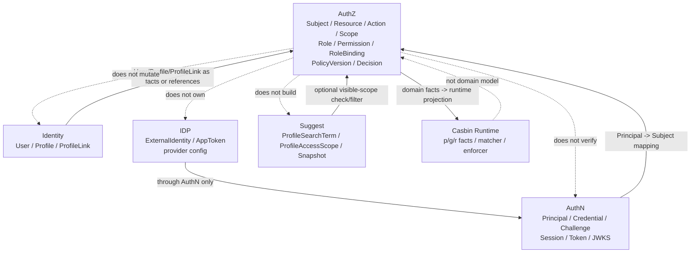

# 模块边界：AuthZ 与 AuthN / Identity

> 状态：待补证据 · 第一版正文，待继续按源码、组合根、跨模块 port、Casbin runtime、REST/gRPC middleware、契约和架构测试逐项核对。

---

## 1. 本文回答

本文回答 10 个问题：

- AuthZ 的模块边界是什么？
- AuthZ 与 AuthN 如何协作，为什么 `Principal` 不是 `Subject`？
- AuthZ 与 Identity 如何协作，为什么 `User` 不是 `Subject`，`ProfileLink` 不是 `RoleBinding`？
- AuthZ 与 IDP 是否直接协作，为什么 `ExternalIdentity` 不能直接成为授权主体？
- AuthZ 与 Suggest 如何协作，为什么 `ProfileAccessScope` 不是 AuthZ `Scope`？
- AuthZ 与 Casbin runtime 的边界是什么？
- Token claims、RoleBinding、Permission、ProfileLink 之间最容易混淆的点在哪里？
- 哪些跨模块协作是允许的，哪些属于边界漂移？
- 授权检查、授权写入、策略传播分别应该如何跨模块协作？
- 修改 AuthZ 边界时应该核对哪些代码和测试？

本文只讲模块边界，不重复完整领域模型和关键链路。
AuthZ 领域模型见 [01-领域模型-Subject-Resource-Action-Scope-Role-Permission-RoleBinding.md](01-领域模型-Subject-Resource-Action-Scope-Role-Permission-RoleBinding.md)；
权限检查见 [02-关键链路-权限检查Check.md](02-关键链路-权限检查Check.md)；
Casbin 运行时见 [05-Casbin运行时模型.md](05-Casbin运行时模型.md)。

---

## 2. 30 秒结论

AuthZ 是 IAM 的授权中心，只维护和产生：

```text
Subject；
Resource；
Action；
Scope；
Role；
Permission；
RoleBinding；
PolicyVersion；
AuthorizationDecision。
```

它不拥有其他模块的写模型：

```text
AuthN 负责 Principal / Credential / Challenge / Session / Token / JWKS；
Identity 负责 User / Profile / ProfileLink；
IDP 负责 ExternalIdentity / provider app / AppToken；
Suggest 负责 ProfileSearchTerm / ProfileAccessScope / Snapshot；
Casbin 是 infra runtime，不是领域模型。
```

最重要的边界：

```text
Principal 不是 Subject；
User 不是 Subject；
ProfileLink 不是 RoleBinding；
Permission 不是 Profile 关系；
Token claims 不替代 AuthZ Check；
ExternalIdentity 不能绕过 AuthN 直接进入 AuthZ；
Suggest ProfileAccessScope 不是 AuthZ Scope；
Casbin p/g/r facts 不是 AuthZ 领域模型。
```

如果只记一句话：

> AuthZ 只回答“某个授权主体能不能访问某个资源”，不回答“请求者如何登录”，也不维护“用户和档案是什么关系”。

---

## 3. 模块边界总图



读图规则：

```text
AuthN 产出 Principal，AuthZ 消费 Subject；
Principal 必须显式映射为 Subject；
Identity 提供 User/Profile/ProfileLink 身份事实；
AuthZ 可以引用这些事实，但不修改这些事实；
IDP 不直接进入 AuthZ，必须先经过 AuthN；
Suggest 可以调用 AuthZ Check 做可见性过滤，但 AuthZ 不维护 Suggest Snapshot；
Casbin runtime 执行策略匹配，但不替代 AuthZ 领域模型。
```

---

## 4. AuthZ 的职责边界

AuthZ 负责：

| 能力 | 说明 |
| --- | --- |
| Subject 建模 | 定义授权主体引用，不等于 User/Principal 本体 |
| Resource / Action / Scope 建模 | 定义授权请求的资源、动作和范围 |
| Role / Permission / RoleBinding 写模型 | 维护授权事实 |
| Grant / Revoke / Bind / Unbind | 授权写入用例 |
| Check | 授权读侧判断，返回 AuthorizationDecision |
| PolicyVersion | 授权策略版本治理 |
| Outbox / RuntimeReload 协作 | 推动策略变更传播到 runtime |
| Casbin runtime adapter | 把领域事实投影到运行时策略引擎 |

AuthZ 不负责：

| 不负责 | 所属模块 |
| --- | --- |
| 登录认证 | AuthN |
| Credential / Challenge 校验 | AuthN |
| Session / Token / JWKS | AuthN |
| User / Profile / ProfileLink 写模型 | Identity |
| 外部 provider app / AppToken | IDP |
| Profile 联想搜索索引 | Suggest |
| Casbin p/g/r 作为领域事实源 | 不允许，Casbin 只是 infra runtime |

---

## 5. AuthZ 与 AuthN

### 5.1 协作关系

AuthN 证明“是谁”。

AuthZ 判断“能不能做”。

```text
AuthN -> Principal
AuthZ -> AuthorizationDecision
```

典型链路：

```text
Bearer Token
  -> AuthN verify
  -> Principal
  -> Principal -> Subject mapping
  -> AuthZ Check(resource, action, scope)
  -> AuthorizationDecision
```

---

### 5.2 Principal 不是 Subject

| 概念 | 所属模块 | 生命周期 | 含义 |
| --- | --- | --- | --- |
| `Principal` | AuthN | 认证成功后的运行时上下文 | 当前请求者的认证结果表达 |
| `Subject` | AuthZ | 授权检查中的主体引用 | 谁在请求访问资源 |

关键边界：

```text
Principal 可以映射为 Subject；
Subject 不是 Principal；
Principal 不应携带完整 Role/Permission；
Subject 不校验 Credential；
AuthZ 不签发 Token；
AuthN 不做资源级 Check。
```

推荐映射：

```text
Principal.UserID
  -> Subject{Type: user, ID: UserID}

Principal.ServiceID
  -> Subject{Type: service, ID: ServiceID}

Principal.StaffID
  -> Subject{Type: staff, ID: StaffID}
```

具体映射以当前代码和业务主体设计为准。

---

### 5.3 Token claims 不替代 AuthZ Check

Token 验签成功只说明：

```text
token 来自可信 issuer；
token 未被篡改；
token 在 exp/nbf/iss/aud 等 claims 上有效；
可以恢复 Principal 或认证上下文。
```

它不说明：

```text
用户能访问某个资源；
用户拥有某个角色；
用户能管理某个 Profile；
用户能执行某个 Action；
用户能在某个 Scope 内访问。
```

正确链路：

```text
Token verify success
  -> Principal
  -> Subject
  -> AuthZ Check
  -> allow / deny
```

禁止：

```text
只要 Token 有 role claim 就跳过 AuthZ Check；
把 token claim 中的 permission list 当唯一授权事实源；
让 AuthN Login 成功后自动写 RoleBinding；
在 AuthZ Check 中校验 password / otp。
```

---

### 5.4 AuthZ 可以使用 AuthN 的哪些信息

AuthZ 可以使用最小认证上下文作为授权输入：

```text
UserID；
ServiceID；
LoginIdentityID，可选；
AuthMethod / AMR，可选；
SessionID，可选；
AuthenticatedAt，可选；
Issuer/Audience，可选。
```

典型用途：

```text
构造 Subject；
高风险操作要求更强认证方式；
审计谁发起了授权管理操作；
管理端写入前先做管理权限 Check。
```

但 AuthZ 不应该使用：

```text
Credential material；
password hash；
OTP code；
RefreshToken；
provider access token；
private key。
```

---

### 5.5 禁止的耦合

禁止：

```text
AuthZ 直接校验 Credential / Challenge；
AuthZ 直接签发 AccessToken / RefreshToken；
AuthZ 直接操作 Session store；
AuthN 直接写 Role / Permission / RoleBinding；
AuthN 直接调用 Casbin Enforce 后决定业务放行；
Principal 被当作 RoleBinding 存储；
Token claims 被当作长期授权事实源。
```

---

## 6. AuthZ 与 Identity

### 6.1 协作关系

Identity 提供身份事实。

AuthZ 可以引用这些事实做授权判断。

```text
Identity.User       -> Subject input
Identity.Profile    -> Resource input
Identity.ProfileLink -> Scope / condition input
```

典型场景：

```text
用户读取自己 User 信息；
用户读取与自己有关联的 Profile；
员工在组织范围内搜索 Profile；
管理员管理 RoleBinding；
服务账号访问某类业务资源。
```

---

### 6.2 User 不是 Subject

| 概念 | 所属模块 | 含义 |
| --- | --- | --- |
| `User` | Identity | IAM 内部稳定身份主体 |
| `Subject` | AuthZ | 授权检查中的主体引用 |

关键边界：

```text
User 是身份事实；
Subject 是授权主体引用；
Subject 可以引用 UserID；
User 不直接拥有 Permission；
RoleBinding 不应写进 User 实体；
User 状态不等于授权决策。
```

正确表达：

```text
User.ID = 1001
  -> Subject{Type: user, ID: 1001}
  -> AuthZ Check
```

错误表达：

```text
User.Permissions = [...]
User.RoleBindings = [...]
```

除非当前代码明确采用该设计，否则不应把授权事实塞进 Identity.User。

---

### 6.3 ProfileLink 不是 RoleBinding

| 概念 | 所属模块 | 表达事实 |
| --- | --- | --- |
| `ProfileLink` | Identity | User 与 Profile 的身份关系事实 |
| `RoleBinding` | AuthZ | Subject 持有 Role 的授权事实 |

区别：

```text
ProfileLink 回答“这个 User 和这个 Profile 有什么身份关系”；
RoleBinding 回答“这个 Subject 被授予了哪个 Role”；
ProfileLink 不等于 Permission；
RoleBinding 不等于亲属关系或档案关系；
Permission 不应被写成 Profile 关系。
```

ProfileLink 可以作为 AuthZ 判断的事实输入：

```text
UserID + ProfileID
  -> Identity.ProfileLink exists(active, rel=parent)
  -> AuthZ Scope/condition input: linked_profile
  -> AuthZ Check
```

但不能替代 RoleBinding：

```text
ProfileLink(parent)
  != RoleBinding(user, role:guardian)
```

是否把 ProfileLink 映射为某种 RoleBinding，必须通过明确授权写入或策略规则表达，不能隐式等同。

---

### 6.4 Permission 不是 Profile 关系

Permission 表达：

```text
允许对 Resource 执行 Action，并受 Scope 约束。
```

ProfileLink 表达：

```text
User 与 Profile 的身份关系事实。
```

错误写法：

```text
Permission = parent_of_profile
```

推荐写法：

```text
Permission = profile:read:linked_profile

Check context:
  ProfileLink(userID, profileID) active
```

这样可以保持：

```text
身份关系归 Identity；
授权规则归 AuthZ；
资源访问决策由 Check 产生。
```

---

### 6.5 AuthZ 可以使用 Identity 的哪些信息

允许使用：

```text
UserID；
User status，可选；
ProfileID；
Profile owner / organization / tenant 信息，具体以业务模型为准；
ProfileLink active/revoked 状态；
ProfileLink rel/type；
Identity query service 输出的最小事实。
```

使用方式：

```text
作为 Subject input；
作为 Resource input；
作为 Scope/condition input；
作为 Check context。
```

不允许：

```text
AuthZ 直接修改 User/Profile/ProfileLink；
AuthZ 直接写 Identity repository concrete；
Identity 直接写 RoleBinding；
Identity 直接调用 Casbin 修改策略；
ProfileLink 直接变成 Permission。
```

---

## 7. AuthZ 与 IDP

### 7.1 协作关系

IDP 是外部身份源辅助模块。

通常链路应该是：

```text
External provider proof
  -> IDP ExternalIdentity
  -> AuthN LoginIdentity / Principal
  -> AuthZ Subject
  -> AuthZ Check
```

AuthZ 通常不直接消费 IDP。

---

### 7.2 ExternalIdentity 不是 Subject

| 概念 | 所属模块 | 含义 |
| --- | --- | --- |
| `ExternalIdentity` | IDP | 外部 provider 返回的身份声明 |
| `Principal` | AuthN | 认证成功后的运行时主体 |
| `Subject` | AuthZ | 授权检查中的主体引用 |

边界：

```text
ExternalIdentity 不直接进入 AuthZ；
openid / unionid / wecom userid 不是 Subject；
外部身份必须先通过 AuthN 绑定或登录；
AuthZ 不管理 provider app secret；
IDP AppToken 不是授权凭证。
```

禁止：

```text
AuthZ 根据 openid 直接授权；
AuthZ 直接调用微信/企微接口校验登录；
RoleBinding 绑定 ExternalIdentity 而不是内部 Subject，除非明确有外部主体授权设计；
IDP 直接创建 RoleBinding。
```

---

## 8. AuthZ 与 Suggest

### 8.1 协作关系

Suggest 负责 Profile 联想搜索读模型。

AuthZ 可以参与 Suggest 可见性判断。

典型链路：

```text
Principal/UserID
  -> Suggest ProfileAccessScope
  -> candidate profiles from Snapshot
  -> AuthZ Check / filter
  -> visible results
```

---

### 8.2 ProfileAccessScope 不是 AuthZ Scope

| 概念 | 所属模块 | 含义 |
| --- | --- | --- |
| `ProfileAccessScope` | Suggest | 搜索可见范围输入或过滤条件 |
| `Scope` | AuthZ | 授权范围语义 |

边界：

```text
ProfileAccessScope 不是 AuthZ Scope；
ProfileAccessScope 可以映射为 AuthZ Scope；
Suggest Snapshot 不是权限事实源；
AuthZ 不维护 Suggest 索引；
Suggest 不能只凭 token 存在返回所有 Profile。
```

---

### 8.3 搜索可见性边界

Suggest 可见性可以有两种治理方式：

```text
查询时调用 AuthZ Check 过滤；
离线构建搜索可见性投影。
```

无论哪种方式，都需要明确：

```text
可见性事实源是什么；
ProfileLink 变化如何影响搜索；
RoleBinding 变化如何影响搜索；
PolicyVersion 变化是否要求搜索索引刷新；
Check deny 时是否过滤结果；
搜索结果是否携带授权版本或可见性依据。
```

本文不假设具体实现，必须以当前代码和设计为准。

---

## 9. AuthZ 与 Casbin Runtime

### 9.1 协作关系

AuthZ 领域事实会被投影到 Casbin runtime。

```text
Role / Permission / RoleBinding / PolicyVersion
  -> PolicyLoader / Adapter
  -> Casbin p/g facts
  -> Enforcer / Matcher
  -> AuthorizationDecision
```

---

### 9.2 Casbin 不是领域模型

| 概念 | 所属层 | 含义 |
| --- | --- | --- |
| Role / Permission / RoleBinding | AuthZ domain | 授权事实源 |
| Casbin p/g/r facts | infra runtime | 运行时策略投影 |
| AuthorizationDecision | AuthZ domain/application | Check 结果 |

边界：

```text
Casbin 是 infra runtime；
Casbin p/g/r facts 不是 AuthZ 领域模型；
Casbin policy line 不应成为唯一事实源；
业务代码不应直接散落调用 Enforce；
transport 不应直接访问 Casbin；
Check 应通过 DecisionEngine 调用 PolicyRuntime。
```

---

## 10. 跨模块协作方式

跨模块协作应显式，而不是隐式共享 repository 或全局变量。

推荐方式：

| 方式 | 适用场景 | 说明 |
| --- | --- | --- |
| middleware context | AuthN -> AuthZ | 传递 Principal，再映射为 Subject |
| application service 调用 | 业务用例前做 AuthZ Check | application 显式调用 checker |
| query service / port | AuthZ 读取 Identity 最小事实 | 例如 ProfileLink 状态、User 状态 |
| event / outbox | 授权变更传播 | PolicyVersion / RuntimeReload |
| runtime adapter | AuthZ -> Casbin | 通过 PolicyRuntime interface 调用 |
| filter service | Suggest -> AuthZ | 对候选 Profile 做可见性过滤 |

禁止方式：

```text
AuthZ 直接 import Identity repository concrete；
AuthN 直接 import AuthZ repository concrete；
IDP 直接写 RoleBinding；
Suggest 直接读取 Casbin policy 当搜索权限；
transport 直接调用 Casbin Enforce；
业务 handler 散落权限判断逻辑。
```

---

## 11. 允许依赖与禁止依赖

### 11.1 允许依赖

AuthZ application 可以依赖：

```text
AuthZ domain；
AuthZ repository port；
PolicyRuntime port；
Identity 最小 query port；
时钟、ID 生成器、事务管理 port；
Outbox/event publisher port。
```

AuthZ transport 可以依赖：

```text
AuthZ application checker；
AuthN middleware 注入的 Principal context；
DTO/proto mapper；
错误映射器。
```

AuthZ infra 可以依赖：

```text
AuthZ domain；
Casbin library；
数据库/Redis concrete；
policy adapter implementation。
```

---

### 11.2 禁止依赖

AuthZ domain 不应依赖：

```text
AuthN domain concrete；
Identity domain concrete；
IDP domain concrete；
Suggest domain concrete；
transport/rest 或 transport/grpc；
infra repository concrete；
Casbin library concrete；
Redis/MySQL client concrete。
```

AuthZ application 不应直接依赖：

```text
AuthN token verifier concrete；
Identity repository concrete；
IDP provider concrete；
Suggest index concrete；
Casbin enforcer concrete，除非通过 PolicyRuntime adapter；
transport handler；
数据库 client concrete。
```

---

## 12. 边界漂移检查清单

如果出现以下变化，需要警惕 AuthZ 边界漂移：

```text
User 增加 permissions / roles 字段；
ProfileLink 被改名或改造成 RoleBinding；
Permission 表达 parent/child 等身份关系；
AuthZ Check 开始校验 password/otp；
AuthN Login 成功后直接写 RoleBinding；
Token claims 中的 roles 成为唯一授权事实源；
Suggest 只凭 AccessToken 返回所有 Profile；
AuthZ domain import casbin 包；
transport handler 直接调用 enforcer.Enforce；
Casbin p/g facts 被写成业务文档里的唯一模型；
Outbox reload 失败但 Check 仍宣称使用最新策略。
```

发现后应回到以下问题：

```text
这是认证事实吗？如果是，归 AuthN；
这是身份事实吗？如果是，归 Identity；
这是外部身份源事实吗？如果是，归 IDP；
这是搜索读模型事实吗？如果是，归 Suggest；
这是授权事实或授权决策吗？如果是，归 AuthZ；
这是 runtime projection 吗？如果是，只能归 infra/runtime。
```

---

## 13. 常见反模式

| 反模式 | 问题 | 推荐做法 |
| --- | --- | --- |
| Subject 当 User | 授权主体引用和身份实体混淆 | Subject 由 UserID/Principal 映射而来 |
| Principal 当 Subject | 认证结果和授权主体混淆 | 显式 Principal -> Subject 映射 |
| ProfileLink 当 RoleBinding | 身份关系和授权事实混淆 | ProfileLink 归 Identity，RoleBinding 归 AuthZ |
| Permission 写成 Profile 关系 | 授权规则和身份关系混淆 | ProfileLink 作为 Scope/condition 输入 |
| Token claims 替代 Check | 认证凭证和授权决策混淆 | Token 验签后继续 AuthZ Check |
| AuthZ 校验 password/otp | AuthZ 吞并 AuthN | Credential/Challenge 校验归 AuthN |
| IDP openid 直接授权 | 外部身份绕过内部主体 | 先 AuthN，再映射 Subject |
| Suggest 只凭 token 返回所有 Profile | 搜索可见性越权 | ProfileAccessScope + AuthZ Check/filter |
| transport 直接调用 Casbin | 绕过 application 和 DecisionEngine | 统一走 AuthZ Checker |
| Casbin p/g 当领域事实源 | infra runtime 吞并领域 | Role/Permission/RoleBinding 是事实源 |

---

## 14. 代码事实源

| 事实 | 路径 |
| --- | --- |
| AuthZ domain | `../../../internal/apiserver/domain/authz` |
| Subject / Resource / Action / Scope | `../../../internal/apiserver/domain/authz` |
| Role / Permission / RoleBinding | `../../../internal/apiserver/domain/authz` |
| AuthorizationRequest / AuthorizationDecision | `../../../internal/apiserver/domain/authz` |
| AuthZ application | `../../../internal/apiserver/application/authz` |
| AuthZ checker / DecisionEngine | `../../../internal/apiserver/application/authz` |
| PolicyVersion / Outbox / runtime reload | `../../../internal/apiserver/application/authz`、`../../../internal/apiserver/infra`，具体以代码为准 |
| Casbin runtime / PolicyRuntime adapter | `../../../internal/apiserver/infra` |
| AuthN Principal | `../../../internal/apiserver/domain/authn/authentication/principal.go` |
| Identity User/Profile/ProfileLink | `../../../internal/apiserver/domain/identity` |
| IDP ExternalIdentity | `../../../internal/apiserver/domain/idp` |
| Suggest ProfileAccessScope / Snapshot | `../../../internal/apiserver/domain/suggest` |
| AuthZ REST transport | `../../../internal/apiserver/transport/rest` |
| AuthZ gRPC transport | `../../../internal/apiserver/transport/grpc` |
| AuthZ container | `../../../internal/apiserver/container/authz` |
| 架构测试 | `../../../internal/pkg/architecture` |

注意：上表中的具体路径需要继续与当前源码核对。如果源码目录已调整，应以代码为准并同步更新本文。

---

## 15. Verify

修改本文后至少执行：

```bash
make docs-hygiene
```

涉及 AuthZ 领域和应用层边界：

```bash
go test ./internal/apiserver/domain/authz/...
go test ./internal/apiserver/application/authz/...
```

涉及 AuthN / Identity / IDP / Suggest 边界：

```bash
go test ./internal/apiserver/domain/authn/...
go test ./internal/apiserver/domain/identity/...
go test ./internal/apiserver/domain/idp/...
go test ./internal/apiserver/domain/suggest/...
```

涉及 Casbin runtime / PolicyRuntime adapter：

```bash
go test ./internal/apiserver/infra/...
```

具体路径以当前代码为准。

涉及 REST/gRPC middleware 和契约：

```bash
make api-validate
make proto-gen
go test ./internal/apiserver/transport/rest/...
go test ./internal/apiserver/transport/grpc/...
```

涉及组合根和依赖方向：

```bash
go test ./internal/pkg/architecture
go test ./internal/apiserver/...
```

---

## 16. 本文总结

AuthZ 的模块边界可以压缩成：

```text
AuthZ 只拥有授权事实和授权决策：
Subject / Resource / Action / Scope / Role / Permission / RoleBinding / PolicyVersion / AuthorizationDecision。
```

与其他模块的关系是：

```text
AuthN 提供 Principal，但 Principal 不是 Subject；
Identity 提供 User/Profile/ProfileLink，但 User 不是 Subject，ProfileLink 不是 RoleBinding；
IDP 提供 ExternalIdentity，但 ExternalIdentity 不能绕过 AuthN 直接授权；
Suggest 提供 ProfileAccessScope/Snapshot，但 ProfileAccessScope 不是 AuthZ Scope；
Casbin 提供 runtime execution，但 p/g/r facts 不是领域模型。
```

最重要的工程规则是：

```text
跨模块协作必须通过 middleware context、application service、query port、event/outbox、PolicyRuntime adapter 等显式方式表达；
不允许为了方便，把认证事实、身份事实、外部身份源、搜索读模型或 runtime projection 塞进 AuthZ 领域模型。
```

下一篇应继续编写 AuthZ 分层架构与代码索引，说明 AuthZ 的 domain、application、infra、transport、container、contract 分别从哪里进入。
