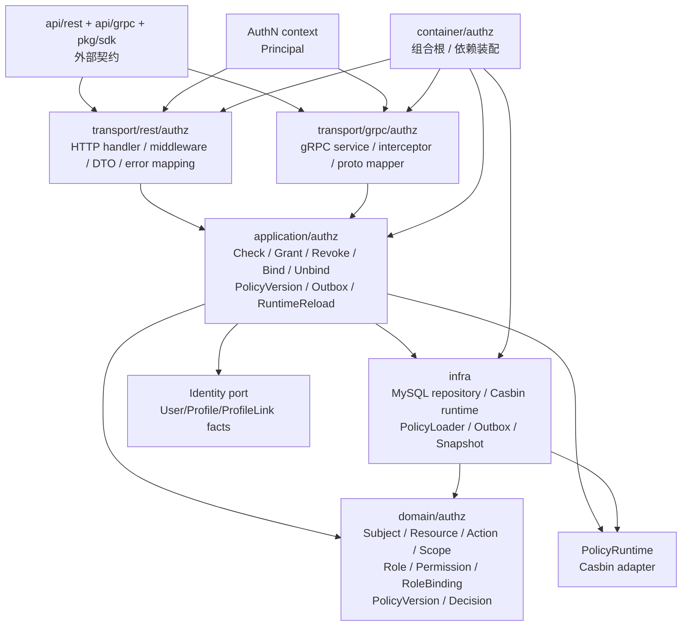

# AuthZ 分层架构与代码索引

> 状态：待补证据 · 第一版正文，待继续按源码目录、契约文件、组合根、Casbin runtime、Outbox/PolicyVersion、配置和架构测试逐项核对。

---

## 1. 本文回答

本文回答 9 个问题：

- AuthZ 模块在代码中如何分层？
- `domain / application / infra / transport / container / contract` 各层分别负责什么？
- 维护 `Subject / Resource / Action / Scope / Role / Permission / RoleBinding / PolicyVersion / AuthorizationDecision` 时应该从哪些入口开始读？
- Check、Grant/Revoke/Bind/Unbind、PolicyVersion/Outbox/RuntimeReload、Casbin runtime 链路如何串起来？
- Casbin infra、MySQL repository、policy loader、runtime adapter 分别在什么位置？
- 哪些依赖方向是允许的，哪些依赖方向是边界漂移？
- REST/gRPC 契约与 AuthZ application/domain 如何对应？
- 修改授权模型、权限检查、策略发布、Casbin matcher 时应该检查哪些文件？
- 修改 AuthZ 代码或文档时应该运行哪些 Verify？

本文是 AuthZ 的代码导航文档，不重复完整领域模型与关键链路。领域模型见 [01-领域模型-Subject-Resource-Action-Scope-Role-Permission-RoleBinding.md](01-领域模型-Subject-Resource-Action-Scope-Role-Permission-RoleBinding.md)，模块边界见 [06-模块边界-AuthZ与AuthN-Identity.md](06-模块边界-AuthZ与AuthN-Identity.md)。

---

## 2. 30 秒结论

AuthZ 模块按 IAM 通用分层组织：

```text
transport/rest + transport/grpc
  -> application/authz
  -> domain/authz
  -> infra/repository + policy runtime + outbox relay
  -> container/authz
  -> api/rest + api/grpc + pkg/sdk
```

各层职责：

```text
domain：表达 Subject / Resource / Action / Scope / Role / Permission / RoleBinding / PolicyVersion / AuthorizationDecision 的模型和规则；
application：编排 Check、Grant/Revoke/Bind/Unbind、PolicyVersion、Outbox、RuntimeReload 等用例；
infra：实现 repository、Casbin runtime、policy loader、policy adapter、outbox store/relay、runtime snapshot；
transport：把 REST/gRPC 请求转换为 application command/query，并处理 Principal -> Subject 的接入层上下文；
container：组合根，装配 AuthZ repository、service、runtime、relay、handler、middleware；
contract：OpenAPI/proto/SDK 对外接入契约。
```

如果只记一句话：

> AuthZ 的授权规则应优先落在 domain/application，Casbin/MySQL/Redis/Outbox 等技术细节应留在 infra/runtime，transport 只做协议适配，container 只做依赖装配。

---

## 3. 分层总图



读图规则：

```text
transport 依赖 application，不直接依赖 repository concrete；
application 可以依赖 domain、repository port、PolicyRuntime port、Identity 最小 query port、Outbox/event port；
domain 不依赖 transport、infra concrete、REST/gRPC、MySQL、Redis、Casbin library；
infra 可以依赖 domain 做模型映射和技术实现；
container 可以知道具体实现，但不能执行业务用例；
contract 是外部机器契约，不等同于 domain 模型。
```

---

## 4. 代码事实源总表

| 层 | 路径 | 说明 |
| --- | --- | --- |
| Domain | `../../../internal/apiserver/domain/authz` | AuthZ 领域模型与授权规则 |
| Application | `../../../internal/apiserver/application/authz` | Check、授权写入、策略传播、runtime reload 用例编排 |
| Casbin infra | `../../../internal/apiserver/infra/casbin` | Casbin runtime、adapter、model、matcher、enforcer，具体以代码为准 |
| MySQL policy | `../../../internal/apiserver/infra/mysql/policy` | Policy / Permission / PolicyVersion 持久化，具体以代码为准 |
| MySQL resource | `../../../internal/apiserver/infra/mysql/resource` | Resource 持久化，具体以代码为准 |
| MySQL role | `../../../internal/apiserver/infra/mysql/role` | Role 持久化，具体以代码为准 |
| MySQL rolebinding | `../../../internal/apiserver/infra/mysql/rolebinding` | RoleBinding 持久化，具体以代码为准 |
| MySQL casbinrule | `../../../internal/apiserver/infra/mysql/casbinrule` | Casbin runtime projection 持久化，具体以代码为准 |
| Outbox / relay | `../../../internal/apiserver/infra`、`../../../internal/apiserver/application/authz` | 策略变更事件和发布，具体路径以代码为准 |
| REST transport | `../../../internal/apiserver/transport/rest/authz` | AuthZ REST handler、DTO、RouteAuthorizer、错误映射 |
| gRPC transport | `../../../internal/apiserver/transport/grpc/authz` | AuthZ gRPC service、interceptor、proto mapper |
| Container | `../../../internal/apiserver/container/authz` | AuthZ 模块装配 |
| REST 契约 | `../../../api/rest/authz.v2.yaml` | AuthZ REST OpenAPI 契约 |
| gRPC 契约 | `../../../api/grpc/iam/authz/v2/authz.proto` | AuthZ gRPC proto 契约 |
| SDK | `../../../pkg/sdk` | 对外 Go SDK 接入封装，具体路径以当前代码为准 |
| 架构测试 | `../../../internal/pkg/architecture` | 分层依赖边界测试 |

注意：上表中的路径需要继续与当前仓库目录逐项核对。如果源码目录已调整，应以代码为准并同步更新本文。

---

## 5. Domain 层

### 5.1 职责

Domain 层负责表达 AuthZ 的核心授权模型和授权不变量。

它应该回答：

```text
Subject 是什么？
Resource 是什么？
Action 是什么？
Scope 是什么？
Permission 如何表达 Resource/Action/Scope？
Role 如何聚合 Permission？
RoleBinding 如何把 Subject 和 Role 绑定起来？
PolicyVersion 如何治理策略发布？
AuthorizationDecision 如何表达一次 Check 的结果？
为什么 ProfileLink 不是 RoleBinding？
为什么 Principal 不是 Subject？
为什么 Casbin 不是领域模型？
```

Domain 层不应该负责：

```text
HTTP/gRPC 参数解析；
OpenAPI/proto DTO；
SQL 查询；
MySQL/GORM 细节；
Redis key 细节；
Casbin enforcer 调用细节；
事务开启和提交；
Outbox relay 轮询；
错误码到 HTTP/gRPC status 的映射；
AuthN Token 验签；
Identity User/Profile/ProfileLink 写入。
```

---

### 5.2 代码索引

| 对象 / 能力 | 路径 | 说明 |
| --- | --- | --- |
| Subject | `../../../internal/apiserver/domain/authz` | 授权主体引用，具体文件以源码为准 |
| Resource | `../../../internal/apiserver/domain/authz` | 受保护资源，具体文件以源码为准 |
| Action | `../../../internal/apiserver/domain/authz` | 授权动作，具体文件以源码为准 |
| Scope | `../../../internal/apiserver/domain/authz` | 授权范围，具体文件以源码为准 |
| Permission | `../../../internal/apiserver/domain/authz` | Resource + Action + Scope 的允许项，具体文件以源码为准 |
| Role | `../../../internal/apiserver/domain/authz` | Permission 集合，具体文件以源码为准 |
| RoleBinding | `../../../internal/apiserver/domain/authz` | Subject 与 Role 的授权绑定事实，具体文件以源码为准 |
| PolicyVersion | `../../../internal/apiserver/domain/authz` | 策略版本治理对象，具体文件以源码为准 |
| AuthorizationDecision | `../../../internal/apiserver/domain/authz` | Check 决策结果，具体文件以源码为准 |
| PolicyChange | `../../../internal/apiserver/domain/authz` | 策略变更描述，具体文件以源码为准 |

---

### 5.3 修改入口

如果要修改：

| 目标 | 优先阅读 |
| --- | --- |
| 新增 Subject 类型 | `domain/authz` Subject 类型定义、Principal -> Subject mapper、Check application |
| 新增 Resource 类型 | Resource 定义、route/resource mapper、REST/gRPC 契约 |
| 新增 Action | Action 定义、route/action mapper、Permission 写入和 Check 用例 |
| 修改 Scope 语义 | Scope 定义、scope matcher、Identity/ProfileLink 输入、Suggest 可见性边界 |
| 修改 Permission 模型 | Permission domain、Role-Permission binding、Casbin p facts 映射 |
| 修改 Role 模型 | Role domain、Role repository、RoleBinding、Permission 聚合规则 |
| 修改 RoleBinding 语义 | RoleBinding domain、Grant/Revoke/Bind/Unbind、Casbin g facts 映射 |
| 修改 PolicyVersion | PolicyVersion domain、Outbox、RuntimeReload、health/metrics |
| 修改 AuthorizationDecision | Decision domain、DecisionEngine、REST/gRPC 错误映射、审计日志 |

---

## 6. Application 层

### 6.1 职责

Application 层负责授权用例编排。

它应该处理：

```text
Check 权限检查；
Principal -> Subject 映射协作；
Resource / Action / Scope 构造或校验；
Grant / Revoke / Bind / Unbind 授权写入；
Role / Permission / RoleBinding 管理；
PolicyChange 构造；
PolicyVersion bump；
Outbox event 写入；
RuntimeReload 编排或触发；
DecisionEngine 调用 PolicyRuntime；
事务边界和应用错误归一化。
```

Application 层不应该处理：

```text
HTTP/gRPC 细节；
SQL 细节；
Casbin model.conf 解析细节；
Redis key 拼接细节；
JWT 签名和验签；
Credential / Challenge 校验；
ProfileLink 写入；
Suggest index 构建。
```

---

### 6.2 代码索引

| 用例组 | 路径 | 说明 |
| --- | --- | --- |
| AuthZ application | `../../../internal/apiserver/application/authz` | AuthZ 用例总入口，具体子目录以代码为准 |
| Check / Checker | `../../../internal/apiserver/application/authz` | 权限检查用例，具体文件以代码为准 |
| Grant / Revoke | `../../../internal/apiserver/application/authz` | 授权授予/撤销用例，具体文件以代码为准 |
| Bind / Unbind | `../../../internal/apiserver/application/authz` | 授权绑定/解绑用例，具体文件以代码为准 |
| Policy administration | `../../../internal/apiserver/application/authz` | Role/Permission/RoleBinding 管理，具体文件以代码为准 |
| PolicyVersion / Outbox | `../../../internal/apiserver/application/authz` | 策略版本和传播事件编排，具体文件以代码为准 |
| Runtime reload | `../../../internal/apiserver/application/authz` | runtime reload 协调入口，具体文件以代码为准 |
| DecisionEngine | `../../../internal/apiserver/application/authz` | Check 决策编排入口，具体文件以代码为准 |

---

### 6.3 用例调用主线

Check：

```text
transport / RouteAuthorizer
  -> application/authz Checker
  -> build AuthorizationRequest
  -> DecisionEngine
  -> PolicyRuntime
  -> AuthorizationDecision
```

Grant / Revoke / Bind / Unbind：

```text
transport
  -> application/authz administration
  -> management permission Check
  -> domain policy validation
  -> repository save
  -> PolicyVersion bump
  -> Outbox event
```

PolicyVersion / Outbox / RuntimeReload：

```text
PolicyChange committed
  -> Outbox staged
  -> PolicyRelay publish
  -> RuntimeReload
  -> loaded PolicyVersion updated
```

Casbin runtime：

```text
Role / Permission / RoleBinding / PolicyVersion
  -> PolicyLoader / Adapter
  -> Casbin p/g facts
  -> PolicyRuntime snapshot
  -> Check
```

---

### 6.4 跨模块 port

AuthZ application 可以通过最小 port 与其他模块协作。

典型 port：

| 协作 | 建议 port 语义 |
| --- | --- |
| AuthN -> AuthZ | 从 request context 读取 Principal，并映射 Subject |
| Identity facts | `UserStatusReader` / `ProfileLinkReader` / `IdentityFactReader`，具体以代码为准 |
| Suggest visibility | `ProfileVisibilityChecker` / `AuthZFilter`，具体以设计为准 |
| Policy runtime | `PolicyRuntime` / `DecisionRuntime` |
| Outbox/event | `PolicyChangePublisher` / `OutboxWriter` |
| Audit | `AuditRecorder`，具体以设计为准 |

要求：

```text
只暴露最小能力；
不直接 import 对方 repository concrete；
不直接操作对方数据库表；
组合根负责装配具体实现；
跨模块协作必须可测试。
```

---

## 7. Infra 层

### 7.1 职责

Infra 层负责授权相关技术实现。

它应该处理：

```text
Role repository concrete；
Permission repository concrete；
RoleBinding repository concrete；
Resource repository concrete；
PolicyVersion repository concrete；
Outbox store / relay concrete；
Casbin adapter / enforcer / model loader；
PolicyLoader；
RuntimeReload；
policy snapshot；
domain entity 与 persistence record 映射；
数据库错误到应用错误的转换辅助。
```

Infra 层不应该处理：

```text
定义 AuthZ 领域模型；
决定 Principal -> Subject 的业务语义；
决定 Identity ProfileLink 是否等于授权；
决定 Token 是否有效；
维护 User/Profile/ProfileLink 写模型；
维护 Suggest Snapshot；
把 Casbin p/g facts 反向写成领域事实源。
```

---

### 7.2 代码索引

| 能力 | 路径 | 说明 |
| --- | --- | --- |
| Casbin runtime | `../../../internal/apiserver/infra/casbin` | Casbin enforcer、adapter、matcher、model，具体以代码为准 |
| Policy repository | `../../../internal/apiserver/infra/mysql/policy` | Policy/Permission/PolicyVersion 持久化，具体以代码为准 |
| Resource repository | `../../../internal/apiserver/infra/mysql/resource` | Resource 持久化，具体以代码为准 |
| Role repository | `../../../internal/apiserver/infra/mysql/role` | Role 持久化，具体以代码为准 |
| RoleBinding repository | `../../../internal/apiserver/infra/mysql/rolebinding` | RoleBinding 持久化，具体以代码为准 |
| Casbin rule repository | `../../../internal/apiserver/infra/mysql/casbinrule` | Casbin runtime projection，具体以代码为准 |
| Outbox store | `../../../internal/apiserver/infra` | Outbox event 持久化，具体以代码为准 |
| Policy relay | `../../../internal/apiserver/infra`、`../../../internal/apiserver/application/authz` | PolicyChanged 事件发布，具体以代码为准 |
| Policy loader | `../../../internal/apiserver/infra`、`../../../internal/apiserver/infra/casbin` | 从管理事实构建 runtime policy，具体以代码为准 |

---

### 7.3 需要重点核对的实现点

| 实现点 | 为什么重要 |
| --- | --- |
| Role/Permission/RoleBinding 唯一约束 | 防重复授权和重复绑定 |
| revoked/disabled 过滤 | 已撤销授权不应进入 runtime |
| PolicyVersion 单调递增 | 防旧版本覆盖新版本 |
| Outbox 与管理事实同事务 | 防数据库写入和事件发布双写不一致 |
| Relay 幂等发布 | Outbox 可能重复发布 |
| RuntimeReload 原子替换 | 防半加载策略被 Check 读取 |
| Casbin p/g 映射 | 防权限语义漂移 |
| matcher 测试 | 防 Scope/Resource/Action 绕过 |
| loaded PolicyVersion 可观测 | 排查授权变更延迟 |
| runtime error fail closed | 防故障时误放行 |

---

## 8. Transport 层

### 8.1 职责

Transport 层负责协议适配和授权接入。

它应该处理：

```text
REST path/query/body/header 解析；
gRPC request metadata/message 解析；
从 AuthN middleware/context 获取 Principal；
构造 AuthZ CheckCommand 或管理 command；
把 REST/gRPC DTO 转换为 application command/query；
调用 AuthZ application service；
把 AuthorizationDecision 映射为继续执行或 403；
把 application error 映射为 HTTP/gRPC 错误；
暴露必要的 AuthZ 管理接口和 check 接口。
```

Transport 层不应该处理：

```text
直接访问 repository；
直接开启事务；
直接构造 SQL；
直接调用 Casbin Enforce；
直接改 Role/Permission/RoleBinding；
直接做 runtime reload；
直接校验 password/otp/token signature；
把 REST path 直接当 Resource 而不做语义映射。
```

---

### 8.2 代码索引

| 协议 | 路径 | 说明 |
| --- | --- | --- |
| REST AuthZ | `../../../internal/apiserver/transport/rest/authz` | AuthZ REST handler、DTO、路由入口 |
| REST RouteAuthorizer | `../../../internal/apiserver/transport/rest` | 路由级授权检查，具体以代码为准 |
| gRPC AuthZ | `../../../internal/apiserver/transport/grpc/authz` | AuthZ gRPC service、proto mapper |
| gRPC interceptor | `../../../internal/apiserver/transport/grpc` | gRPC 授权拦截器，具体以代码为准 |

---

### 8.3 错误映射建议

| 应用错误 | REST | gRPC |
| --- | --- | --- |
| 参数错误 | `400 Bad Request` | `InvalidArgument` |
| 未认证 | `401 Unauthorized` | `Unauthenticated` |
| 授权拒绝 | `403 Forbidden` | `PermissionDenied` |
| 资源不存在 | `404 Not Found` | `NotFound` |
| 重复授权 / 冲突 | `409 Conflict` | `AlreadyExists` 或 `FailedPrecondition` |
| 状态冲突 | `409 Conflict` | `FailedPrecondition` |
| runtime 未加载 | `503 Service Unavailable` 或 fail closed `403` | `Unavailable` 或 `PermissionDenied` |
| 内部错误 | `500 Internal Server Error` | `Internal` |

具体映射必须以当前 REST/OpenAPI、proto 和错误处理实现为准。

安全建议：

```text
deny reason 对外应克制；
内部日志保留 policy version、traceID 和 matched policy 摘要；
日志不打印完整 token、敏感资源属性或完整 policy 细节。
```

---

## 9. Container 层

### 9.1 职责

Container 是组合根，负责把 AuthZ 模块装配进 iam-apiserver。

它应该处理：

```text
创建 Role/Permission/RoleBinding/PolicyVersion repository concrete；
创建 Outbox store / relay；
创建 Casbin runtime adapter；
创建 PolicyLoader / RuntimeReload；
创建 AuthZ application service；
注入 Identity query port；
注入 PolicyRuntime port；
创建 REST handler 和 RouteAuthorizer；
创建 gRPC service 和 interceptor；
把模块对象暴露给 process/transport 注册；
把后台 relay/reload 任务注册给 process 生命周期，具体以代码为准。
```

Container 不应该处理：

```text
执行业务授权写入；
处理 HTTP/gRPC 请求；
直接做 Check；
直接写 RoleBinding；
直接操作 Casbin policy；
隐藏跨模块业务流程。
```

---

### 9.2 代码索引

| 能力 | 路径 | 说明 |
| --- | --- | --- |
| AuthZ module wiring | `../../../internal/apiserver/container/authz` | AuthZ repository、service、runtime、relay、handler 装配 |
| Root container | `../../../internal/apiserver/container` | 全局组合根入口，具体路径以代码为准 |
| Process lifecycle | `../../../internal/apiserver/process` | 后台 relay/reload 生命周期，具体路径以代码为准 |

---

## 10. 契约与 SDK

### 10.1 REST 契约

REST 契约路径：

```text
../../../api/rest/authz.v2.yaml
```

REST 契约应回答：

```text
有哪些 AuthZ HTTP endpoint；
Check / Grant / Revoke / Bind / Unbind 如何命名；
Role / Permission / RoleBinding 管理接口如何表达；
请求/响应 DTO 字段是什么；
错误码如何表达；
哪些接口需要 Bearer token；
哪些管理接口需要 AuthZ Check；
字段命名是否与 application result 对齐。
```

---

### 10.2 gRPC 契约

gRPC 契约路径：

```text
../../../api/grpc/iam/authz/v2/authz.proto
```

gRPC 契约应回答：

```text
有哪些 AuthZ RPC；
request/response message 字段是什么；
是否提供 Check / Grant / Revoke / Bind / Unbind / ListRoles / ListPermissions 等能力；
metadata 中如何携带 token；
错误语义如何映射；
字段是否与 REST 和 application 语义一致。
```

---

### 10.3 SDK

SDK 应基于 REST/OpenAPI 或 gRPC/proto 契约生成或封装。

SDK 不应该：

```text
绕过服务端 application；
在客户端自行决定权限是否 allow；
把 SDK DTO 当作 domain entity；
直接操作 Casbin p/g facts；
隐藏 PermissionDenied / Unauthenticated / Conflict 错误；
在日志中打印完整 token 或敏感 policy。
```

---

## 11. 典型修改路径

### 11.1 新增 Resource / Action

推荐检查顺序：

```text
1. domain/authz：Resource / Action 定义
2. transport：route -> resource/action mapper
3. application/authz：Check command 和 AuthorizationRequest
4. Permission 写入链路：是否允许创建相关 Permission
5. Casbin p/r facts 映射和 matcher
6. REST/gRPC 契约
7. tests + docs
```

---

### 11.2 修改 Scope 语义

推荐检查顺序：

```text
1. domain/authz：Scope 类型和不变量
2. application/authz：Check context 和 Scope 构造
3. Identity query port：是否需要 ProfileLink/User/Profile 事实
4. Suggest：是否影响 ProfileAccessScope 或搜索过滤
5. Casbin matcher：scopeMatch/domainMatch
6. tests + docs
```

---

### 11.3 修改 Role / Permission 模型

推荐检查顺序：

```text
1. domain/authz：Role / Permission 模型
2. application/authz：Grant/Revoke/Bind/Unbind 用例
3. infra/mysql：repository 和唯一约束
4. Casbin p facts 映射
5. PolicyVersion / Outbox
6. REST/gRPC 契约和 SDK
7. tests + docs
```

---

### 11.4 修改 RoleBinding 语义

推荐检查顺序：

```text
1. domain/authz：RoleBinding 字段、状态、软撤销
2. application/authz：Grant/Revoke/Bind/Unbind
3. infra/mysql/rolebinding：repository 和 active 唯一约束
4. Casbin g facts 映射
5. PolicyVersion / Outbox / RuntimeReload
6. Identity/ProfileLink 边界文档
7. tests + docs
```

---

### 11.5 修改 Check 链路

推荐检查顺序：

```text
1. transport：Principal context、route/resource/action/scope mapper
2. application/authz：Checker / DecisionEngine
3. domain/authz：AuthorizationRequest / AuthorizationDecision
4. infra/casbin：PolicyRuntime adapter
5. REST/gRPC 错误映射
6. AuthN/AuthZ 边界文档
7. tests + docs
```

---

### 11.6 修改 PolicyVersion / Outbox / RuntimeReload

推荐检查顺序：

```text
1. domain/authz：PolicyVersion / PolicyChange
2. application/authz：Committer / Outbox use case
3. infra：Outbox store / relay / policy loader
4. infra/casbin：runtime reload / loaded version
5. process/container：后台任务生命周期
6. health/metrics：loaded version、lag、outbox backlog
7. tests + docs
```

---

### 11.7 修改 Casbin model.conf / matcher

推荐检查顺序：

```text
1. 05-Casbin运行时模型.md
2. infra/casbin：model.conf / matcher / custom functions
3. domain/authz：Resource/Action/Scope 是否受影响
4. application/authz：AuthorizationRequest 构造
5. Casbin p/g/r facts 映射
6. allow/deny/missing policy 测试
7. 并发 reload + check 测试
8. docs
```

---

## 12. 依赖方向规则

### 12.1 允许

```text
transport -> application
application -> domain
application -> repository/runtime port
application -> Identity 最小 query port
application -> Outbox/event port
infra -> domain
infra -> Casbin library concrete
container -> all concrete wiring targets
contract -> transport implementation alignment
```

### 12.2 禁止

```text
domain -> application；
domain -> infra/mysql；
domain -> infra/casbin；
domain -> transport/rest；
domain -> transport/grpc；
domain -> api/rest or api/grpc；
domain -> Casbin library concrete；
domain -> Redis/MySQL client concrete；
application -> transport；
transport -> infra repository concrete；
infra -> transport；
AuthZ domain -> authn/identity/idp/suggest concrete；
AuthZ application -> authn/identity/idp/suggest repository concrete。
```

---

## 13. 常见反模式

| 反模式 | 问题 | 推荐做法 |
| --- | --- | --- |
| handler 直接调用 Casbin Enforce | 绕过 application 和 DecisionEngine | handler 调 Checker |
| handler 直接查 RoleBinding repository | 绕过授权写入/检查规则 | handler 调 application service |
| domain import casbin | 领域层依赖 runtime | 通过 PolicyRuntime port |
| repository 决定授权是否 allow | 持久化层吞并授权决策 | DecisionEngine 调 runtime |
| container 中执行 Grant/Check | 组合根混入业务流程 | container 只装配依赖 |
| proto message 直接当 AuthorizationRequest | 契约模型污染领域模型 | transport 做 mapper |
| AuthZ 直接写 Identity repository | 跨模块绕过边界 | 通过 Identity query port 读取最小事实 |
| AuthN 直接写 RoleBinding | AuthN 吞并 AuthZ | 授权写入归 AuthZ |
| Casbin p/g facts 当领域事实源 | runtime 吞并领域模型 | Role/Permission/RoleBinding 是事实源 |
| Check 自动 Grant | 读链路提权风险 | 写入必须显式调用 Grant/Revoke/Bind/Unbind |

---

## 14. Verify

修改本文后至少执行：

```bash
make docs-hygiene
```

涉及 AuthZ domain：

```bash
go test ./internal/apiserver/domain/authz/...
```

涉及 AuthZ application：

```bash
go test ./internal/apiserver/application/authz/...
```

涉及 infra repository / Casbin runtime / Outbox：

```bash
go test ./internal/apiserver/infra/...
```

如果实际 infra 测试路径更细，以当前代码为准，例如：

```bash
go test ./internal/apiserver/infra/casbin/...
go test ./internal/apiserver/infra/mysql/policy/...
go test ./internal/apiserver/infra/mysql/resource/...
go test ./internal/apiserver/infra/mysql/role/...
go test ./internal/apiserver/infra/mysql/rolebinding/...
go test ./internal/apiserver/infra/mysql/casbinrule/...
```

涉及 AuthN / Identity / IDP / Suggest 边界：

```bash
go test ./internal/apiserver/domain/authn/...
go test ./internal/apiserver/domain/identity/...
go test ./internal/apiserver/domain/idp/...
go test ./internal/apiserver/domain/suggest/...
```

涉及 REST 契约或 REST transport：

```bash
make api-validate
go test ./internal/apiserver/transport/rest/...
```

涉及 gRPC 契约或 gRPC transport：

```bash
make proto-gen
go test ./internal/apiserver/transport/grpc/...
```

涉及 SDK：

```bash
go test ./pkg/sdk/...
```

涉及分层依赖边界：

```bash
go test ./internal/pkg/architecture
```

---

## 15. 本文总结

AuthZ 的代码结构可以压缩成：

```text
domain       定义 Subject / Resource / Action / Scope / Role / Permission / RoleBinding / PolicyVersion / AuthorizationDecision
application  编排 Check / Grant / Revoke / Bind / Unbind / PolicyVersion / Outbox / RuntimeReload
infra        实现 repository、Casbin runtime、policy loader、policy adapter、outbox store/relay、runtime snapshot
transport    适配 REST/gRPC 请求、响应、RouteAuthorizer、middleware 和 interceptor
container    装配 AuthZ 模块依赖和跨模块 port
contract     约束 REST/gRPC/SDK 对外接入语义
```

维护 AuthZ 时最重要的工程规则是：

```text
授权规则不要写进 transport；
Casbin/MySQL/Redis/Outbox 细节不要写进 domain；
跨模块协作不要直接共享 repository；
Subject 不要膨胀成 User/Principal 大对象；
ProfileLink 不要写成 RoleBinding；
Token 验签不要被写成 AuthZ 授权通过；
组合根只装配依赖，不执行业务用例。
```

读完本文后，AuthZ 模块主文档已经形成闭环：

```text
00-模块总览.md
01-领域模型-Subject-Resource-Action-Scope-Role-Permission-RoleBinding.md
02-关键链路-权限检查Check.md
03-关键链路-授权写入Grant-Revoke-Bind-Unbind.md
04-关键链路-授权版本传播PolicyVersion-Outbox-RuntimeReload.md
05-Casbin运行时模型.md
06-模块边界-AuthZ与AuthN-Identity.md
07-分层架构与代码索引.md
```
