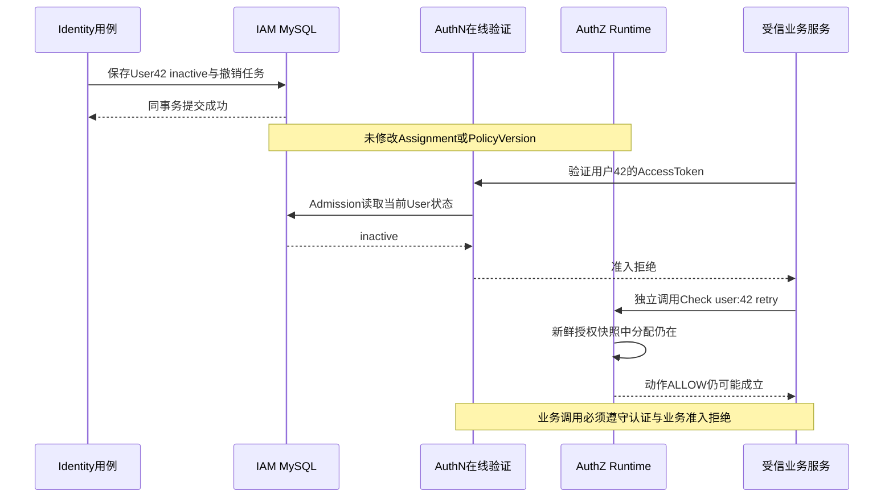

# 模块边界：AuthZ 与 AuthN、Identity、Suggest

> 状态：已实现 · 2026-10-06 对照装配、User能力、认证、授权与Suggest查询深化；接入要求、源码推论及候选设计分别说明。

## 1. 从一次后台操作判断责任

用户42被分配公司1门店10的测评岗位，尝试retry门店10的结果。AuthN回答本次用户身份与持续认证状态是否可接受；AuthZ回答其直接角色是否贡献retry、配对Scope覆盖哪里；业务服务还要检查当前Operator、门店、受试者归属和结果状态。任何一个条件不满足，都不能执行后台操作。

这不是一张通用的“用户有权限”标签。停用User可能没有删Assignment；有ProfileLink可能没有后台动作；Check ALLOW可能没有数据Scope；搜索得到Profile也不意味着能读取详情。模块协作的重点是保留这些差别，而不是让一个模块的成功代替其他规则。

| 事实或决定 | 当前拥有者 | 给其他模块的能力/数据 | 不随之授予 |
| --- | --- | --- | --- |
| User存在与active/inactive/blocked | Identity | UserResolver、UserStatusReader | 业务Operator、机构资格、角色 |
| 身份核验、Admission、Session、Token | AuthN | 认证结果与可信UserID/claims | Resource/Action、当前业务Org资格 |
| Profile与ProfileLink关系 | Identity | 自助关系检查、只读投影 | 后台动作、Suggest全量能力 |
| Role/Grant/Assignment/Scope/Resource | AuthZ | Decision、配对范围、维护事实 | 登录准入、真实门店或对象归属 |
| 候选、可见性与敏感输出 | Suggest | 有限Profile联想结果 | Profile详情、手机号明文或数据写权 |
| Operator、门店、受试者/结果关系和状态 | 业务服务（如QS） | 该用例的最终执行条件 | IAM账户或岗位写入规则 |

AuthZ当前没有对象条件求值，不回调QS库验证对象，也不自动将Identity关系转换成Grant。统一授权空间取消历史Tenant分区；公司ID仍存在于业务身份或Assignment Scope，不能据此恢复旧分区语义。

## 2. 共享ID不等于共享概念

### 2.1 每次转换都要保留来源

| 转换点 | 当前来源和语义 | 容易发生的错误 |
| --- | --- | --- |
| REST认证→user Subject | middleware验证后读取可信UserID，再构造user:<ID> | 用body里的actor或user_id替代已认证操作者 |
| 服务RPC→目标Subject | 证书建立caller；业务服务另外提供目标引用 | 把服务证书等同于目标用户已登录/active |
| UserID→Suggest OperatorID | handler复制IAM UserID，仅作为查询操作者键 | 以字段名Operator推断QS Operator已存在或有效 |
| ProfileID→业务对象ID | Profile是Identity档案；其他服务自行维护映射 | 以数值相同推断ProfileID就是TesteeID |
| OrgID→Scope CompanyID | 两者均承载ID，但用途和取得时间不同 | 直接将Token组织声明当作当前门店授权 |
| ProfileLink→可访问对象 | 只在明确消费关系的用例中生效 | 监护关系自动生成后台岗位或搜索范围 |

AuthZ的subject.Ref是类型+稳定ID引用，不是身份证明。公开读入口支持user/group/service加正数IAM ID；当前Assignment写入只支持user，容器只注册User resolver。证书ServiceName如qs-apiserver.svc又是另一种名字，不自动变成service类型的数值主体。这些语法和准入差异由[服务间授权](06-关键链路-gRPC服务间授权与SDK.md)维护。

### 2.2 三种“组织/范围”必须分别解释

AuthN在线Verify解码JWT、校验Session活跃及User/LoginIdentity准入后返回JWT claims。它不重新读取QS组织资格，也不拿Session的OrgID覆盖JWT OrgID；Refresh从Session认证/业务上下文重新投影声明是另一条链。声明来源可信，不等于业务组织资格今天仍有效。

AuthZ scope.Scope内部字段名为OrgID，当前v4 gRPC及Assignment持久列都使用org_id，业务含义是公司范围；当前REST Assignment DTO没有Scope字段。本文称“公司”不表示协议已改名company_id。Scope构造只要求公司/门店ID为正数、kind与门店集合形状正确，不检查公司存在、门店属于该公司或目标User当前属于该公司；服务岗位白名单M也不建立caller与公司的业务授权关系。生产者填写范围时和消费者访问对象时都需要业务事实支持，不能以IAM接收成功当作业务关系验收。

Suggest visibility.Scope则表示Profile可见性，含all、OrgIDs、ProfileIDs、owner和手机号搜索能力；没有Assignment门店集合。这不是scope.Scope的别名，也没有内建转换。为Suggest增加门店过滤需要新的业务投影和语义规则，仅复制公司数字无法完成转换。

## 3. 窄端口怎样落到当前装配

[module_graph](../../../internal/apiserver/container/module_graph.go)把Identity-owned UserAccess能力缓存于组合根，分别交给AuthN和AuthZ。AuthN/AuthZ虽然先于完整Identity模块启动，消费的仍是Identity端口；启动次序不改变User事实所有权。

| 消费方 | 发布/适配端口 | 当前调用范围 |
| --- | --- | --- |
| AuthN Admission | useraccess.UserStatusReader | 读取当前User状态，与LoginIdentity状态/关联共同形成准入 |
| AuthZ Assignment Validator | assignment.SubjectResolver→UserResolver | 授予与替换校验稳定User锚点；不要求active |
| Identity REST /me | EffectiveRoleReader及可选PermissionEntriesForSubject | 附加直接角色名与动作项；不是授权写入 |
| Suggest授权adapter | authorization.RoutePermissionChecker | 按固定Resource/Action读取布尔能力，丢弃Decision版本/命中证据 |
| Suggest Loader/VisibilityReader | Identity表的只读SQL | 形成候选/手机号与created_by ProfileID读模型 |
| 业务服务 | AuthZ gRPC/SDK | 消费动作、配对范围与维护合同，继续完成自身准入 |

这里既有窄端口，也有共享数据库和SQL schema依赖。Suggest没有通过Identity应用API读取全部投影，AuthZ/User resolver也不因此成为可独立部署服务。当前实现模块不能仅因目录或接口存在就被宣称为完整DDD限界上下文。

AuthN/AuthZ domain不直接引入Identity User repository/concrete，由Identity发布最小能力；具体repository在组合根装配。AuthN SignUp以共享UoW组合User/LoginIdentity/Credential是已存在的事务例外，不能扩展为所有跨模块操作共享一个聚合。例外及拆库代价见[Identity协作](../01-Identity/04-模块边界-Identity与AuthN-AuthZ-Suggest.md#4-authn-signup共享事务的明确例外)。

## 4. User生命周期与Assignment生命周期不联动

### 4.1 存在性检查为什么不等于可使用

Identity UserResolver通过FindByID检查锚点；blocked/inactive记录仍可存在，ResolveUser不检查状态。AuthZ Grant在事实事务内调用SubjectResolver；两类Replace也先检查目标存在，哪怕目标集合为空。按Subject+Role撤销及按Assignment ID删除不重新要求User存在，保留了清理孤儿分配的入口。

resolver收到事务context，当前BaseRepository.WithContext会取出其中Tx，使User存在性查询复用AuthZ事实事务；FindByID使用普通First，没有FOR UPDATE或active约束。事务复用不等于锁住User生命周期，也不保证提交时User仍active。并发事实变动仍需独立评估；本轮没有真实MySQL并发实验。

当前User接口没有删除用例。若运维直接移除User而保留Assignment，Runtime加载不会查询users，重新加载也不会自行清理分配；这是绕过公开用例的源码推论，不是已实现用户删除级联。手工deleted_at标记也不能被笼统等同于UserResolver返回missing。

### 4.2 停用时为什么仍可能得到动作ALLOW

假设user:42的retry分配仍在，旧Session尚未被Worker撤销，停用流程如下；若已撤销，在线验证也可能先被Session门禁拒绝。图中的读取都要求各自依赖可用，不表示跨模块读取或外部执行拥有原子屏障。

Deactivate/Block在状态改变时同事务保存User并尝试Stage Session revoke_all意图；Stage成功也可能命中已有任务而不新增pending。Worker另行调用AuthN Revoker。它们不调用AuthZ、不删Assignment、不推进PolicyVersion。在线Verify的UserStatus检查可以覆盖Worker延迟，但受信服务直接调用AuthZ不会补这次状态检查。

因此默认60秒授权证明预算不是停用传播SLA：User停用根本没有成为AuthZ投影事实，版本核对可继续保持该授权快照fresh。消费者若只做本地JWT验签再Check，也不能靠AuthZ预算获得在线封禁语义。已通过认证的在途请求还存在之后状态变化的窗口。

重新Activate同样不重新授予角色；只要原分配未撤销，它们仍参与求值。保留岗位与停止账户使用是当前两个操作，业务若要求离职同时清空岗位，需要明确的撤权流程、受管边界及失败恢复，而不是假定Deactivate已经做完。

会话还有独立窗口：Activate不取消旧撤销任务，Worker也不按Task.UserVersion或当前User状态跳过；RevokeByUser按执行时的用户索引列举Session。停用→激活→新登录后，旧任务若此时列举，会撤销新Session；列举后才加入的SID不在本轮集合内，失败重试则可能重新列举。这是当前源码的时序推论，未做竞争运行验证，不能承诺Activate会恢复旧Session或保护新Session免受旧任务影响。

还有重复停用的独立限制：当前标准User更新路径不推进users.version，Stage按user/version/action去重，旧completed行保留时可使后续意图不再排队。Activate只有application能力，没有公开激活协议。限定条件、迁移唯一键测试及代次候选由[AuthN模块边界](../02-AuthN/07-模块边界-AuthN与Identity-IDP-AuthZ.md#3-停用用户状态判断与会话清理互补任务成功不是并发屏障)维护，不以源码推论认定实际环境已发生问题。

### 4.3 更强停用语义的候选取舍

| 候选 | 能补什么 | 代价与仍需处理的窗口 |
| --- | --- | --- |
| 消费者使用在线Verify并检查当前业务身份 | 保留User/Operator所有权，拒绝当前不准入者 | 增加调用/故障依赖；通过后到业务提交仍有TOCTOU |
| AuthZ Check每次读取User状态 | 为动作读入口增加主体准入 | 读延迟和Identity故障进入所有Check；服务/组及诊断读取须重定义 |
| 将User状态引入带版本的AuthZ投影 | 状态与动作可在同份快照使用 | 需要User状态事件、版本协议、恢复及传播预算；不能只加缓存字段 |
| 离职编排同时撤销受管Assignment | 明确清理岗位并留下可恢复意图 | 要界定公司/M外/保护岗位，避免重试误删或跨公司撤权 |

这些是基于现实现的方案比较，尚未实施，也不替代既有Session撤销任务。

## 5. 业务范围与对象规则由消费者执行

Role A贡献retry、公司1门店10；Role B贡献batch_evaluate、公司1门店20。业务服务读取同份scoped结果后，要先匹配retry，再合并相同公司下匹配项的Scope，不能先把全部岗位门店合为10/20。Check只给动作Decision，单独Check与Scope读取也没有跨调用版本绑定。

当受试者从门店10转到20，业务服务依据自己的当前归属决定访问；IAM不迁移受试者或历史结果，也不查转店事实。all_stores覆盖该公司中的已归属门店，ContainsStore对store_id<=0拒绝；它不覆盖未归属对象或其他公司。若业务需要历史归属权限，必须定义并读取相应事实，不能自行把历史范围当成当前范围。

后台结果读取需要有效Operator、动作、配对Scope及对象状态/关系；医生身份本身不补足后台权限。参与者、监护人或医生自服务按其独立用例的关系与状态准入，不应统一强加后台Operator门槛。IAM内部MyProfiles.Get/Patch使用active ProfileLink是具体自助前置，不表示关系能替代全部read/update/export/delete动作。

| 接入位置 | 消费者需要保证的执行顺序 |
| --- | --- |
| 列表/分页 | 当前身份及动作范围→查询过滤→计数/分页；只过滤已分页结果会泄漏总数或漏数据 |
| 详情 | 读取可信对象归属/状态→匹配同份动作范围及关系规则→输出 |
| 统计 | 聚合前使用与列表相同的公司/门店范围，避免跨范围计数 |
| 写入 | 核对身份、动作、Scope、状态及并发前置；明确检查到提交的状态变化窗口 |
| 缓存 | 命中时仍遵守主体与范围合同；设计键、失效和最大陈旧窗口，不能仅按对象ID复用 |

这是业务接入要求。本仓库能证明Scope构造、投影、SDK校验和IAM调用边界，不能据此证明QS所有列表、统计、写入或缓存已执行。真实消费者实现、部署配置与普通账号验收仍需其自身证据；历史Scope维护记录也不替代今日验收。

## 6. Suggest组合自己的可见性

### 6.1 授权adapter只返回动作事实

正常Suggest REST入口先在线JWT认证，再在AuthZ/checker可用时检查iam:identity:collection:profiles/search。handler将认证UserID复制为Principal.OperatorID、claims OrgID复制为OrgID；当前REST不填OrgIDs，未重新查询QS Operator或机构资格。

查询未被空白关键词短路、permission端口存在且首项检查成功时，FactsReader执行两次能力查询，按list_all选择分支：

| list_all | 第二次查询 | 最终范围 | 手机号形状关键词 |
| --- | --- | --- | --- |
| true | search_by_mobile_all | 索引内全量Profile | 仅第二项允许时访问索引 |
| false | search_by_mobile | owner/OrgID/VisibilityReader的ProfileID并集 | 仅第二项允许时访问索引 |

若User17有list_all与普通search_by_mobile，却没有search_by_mobile_all，会进入全量分支而不查询普通手机号能力；手机号形状关键词返回200+[]，不会回退局部范围。这是当前分支语义，不是“任一手机号能力都可用”。搜索手机号能力与显示掩码又不同：姓名/ID命中的可见候选仍可返回脱敏手机号。

外层search与内部两次Check分别读取Runtime.current；RoutePermissionChecker只保留bool/error，未把PolicyVersion带给Suggest。撤权/刷新恰好发生在调用间时，能力组合可能来自不同版本。任何checker错误继续返回错误，不把策略过期转换成局部成功；但各次成功不证明整个组合基于同一版本。

### 6.2 普通可见性不是监护关系的展开

无list_all时，默认VisibilityReader查询未软删且created_by=OperatorID的ProfileID；ResolutionPolicy再把这些IDs、Principal组织和候选owner作为OR条件。ProfileID条件由服务端reader输出，不是终端填k=42便能让Profile42可见。created_by是过渡读模型，也不等同于Profile的领域所有权。

默认Loader联结ProfileLink/User，用于候选资格和聚合手机号；不是按查询User的监护关系构造可见范围。其User资格排除软删除，不排除blocked/inactive。因此另一个准入用户仍可能搜索到关联停用User的Profile及手机号掩码，是否适合业务披露要由明确策略判断，不能误称Loader已经过滤active User。

Loader的OrgID目前来自配置占位（0不虚构组织）。若部署把所有候选投成同一非零OrgID且调用者声明相同组织，普通范围会因OR条件扩大；这个结果无需Assignment全量Scope。多组织部署需真实组织投影；把组织声明改名为company_id或套用all_stores不会解决它。

### 6.3 三份视图没有共同的新鲜度证明

普通范围且通过准入的查询可能同时消费AuthZ动作、Identity visibility SQL/缓存和Suggest Store；全量分支跳过visibility读取，空白关键词提前返回，手机号准入拒绝不访问Store。这些视图没有共同事务、共同版本或生成屏障：

| 视图 | 当前更新/失效方式 | 残余窗口 |
| --- | --- | --- |
| AuthZ Runtime | PolicyVersion/事件/周期核对/证明预算 | 单次新鲜，不绑定本次全部动作调用或Identity投影 |
| VisibilityReader缓存 | 可选TTL，key为OperatorID，复制ID slice，也缓存错误 | TTL内旧创建人IDs或旧错误；不缓存/证明整次授权 |
| Suggest Store | 启动Full、定时Full/Delta、删除tombstone | 源关系撤销到本实例刷新之间仍可能召回旧候选；各实例不同步 |

旧ProfileID缓存本身不制造候选，但和仍存在的旧Store、owner/OrgID的OR放行可以组合成旧可见结果。JWT/Runtime校验成功不使Store即时更新。SelectionPolicy在最终limit前过滤/去重/排序；CandidateBudget却在过滤前截断，可能漏掉后面的可见项，不能用少于limit证明只有这些可见对象。

查询完整顺序、脱敏、限流、空数组含义及刷新协议分别归[Suggest查询](../05-Suggest/03-关键链路-SuggestProfile查询.md)、[索引刷新](../05-Suggest/02-关键链路-索引刷新Full-Delta.md)。限流故障放行也不替代权限或可见性；查询结果不是详情授权凭证。

## 7. 缺失依赖、运行错误与readiness分开

| 情形 | 当前组合后果 | 不能推导 |
| --- | --- | --- |
| Suggest/JWT存在，AuthZ未装配或路由checker缺失 | 路由可只挂JWT；facts permission端口也缺失时为零能力，仍计算普通可见性 | 所有候选被拒、允许全量、正常生产会接受这种启动 |
| 已装配checker返回DENY | 外层search拒绝；内部mobile否定可返回空 | AuthZ失效或没有匹配数据 |
| checker返回Unavailable/其他错误 | 错误向上传播；已挂middleware不会自动摘掉授权 | 自动回退缺端口路径 |
| Suggest optional初次Full失败 | 安装DegradedQuerier，成功响应空数组，health保留失败 | “200空”证明无数据或无权限 |
| ModuleState.Available=true | 已初始化且模块能力对象存在；可同时带DegradedReason | Runtime新鲜、后台同步运行、整实例ready |

Container继续尝试后续模块并汇总初始化错误；process在生产模式不允许请求降级启动，启用可靠消息时也不忽略这些错误。故上表缺端口路径是装配能力及开发/测试取舍，不能直接描述为生产AuthZ故障时自动绕过search。本次未改部署或远程验证此路径。

readiness另要求AuthZ、AuthN及其他required组件；gRPC SERVING和9091探针也不等同它。状态采样不为跨模块业务操作提供屏障，具体生命周期由[运行时就绪](../../01-运行时/03-后台任务就绪与优雅关闭.md)维护。

## 8. 写管理与读消费使用不同信任边界

REST管理的actor来自在线认证；路由动作、写应用复核和Role保护分别执行。查询Role/Assignment/Grant还有保护过滤，Resource读目录；不能把query可见性Guard当成read/list动作复核。Resource command.Actor由adapter建立，应用不重新认证或与management actor对齐。PermissionGrant创建是受信策略配置权，未按已有能力/Org计算可授予上界；多个检查也不绑定同一版本或事务提交。完整设计取舍归[REST管理](05-关键链路-REST管理与路由授权.md)。

服务管理通道的可信actor是证书身份；delegated actor只是一份受格式/内容准入约束的审计声明，不认证该User或检查其管理动作。受管M来自部署岗位白名单，不是创建者私有集合；用户管理员也不能覆盖caller准入。admin allow_all可增量Grant/Revoke，但公开两种Replace及完整facts要求显式M，当前拒绝admin。增量Grant没有Scope，按Subject+Role撤销覆盖该岗位全部公司；具体变更和保护规则归[授权写入](03-关键链路-授权写入与受管Assignment.md)。

完整facts经维护准入后可返回该主体跨应用、M外与protected分配，宽于REST保护可见性；读到不表示能写，complete也不证明User存在、最新提交或生产者没有遗漏。AppName只是动作投影参数，不绑定caller应用。维护页面不应从这份facts生成无约束的编辑能力；合同归[服务间授权](06-关键链路-gRPC服务间授权与SDK.md#4-完整assignment-facts是维护合同)。

Identity /me则是展示增强：读取当前User后分别取角色名和permissions。角色读取失败可降级；permission读取失败使GET/PATCH响应失败，当前REST顶层调用中不会回滚此前已提交的资料更新。当前DTO仅resource/action/mode，没有Scope或PolicyVersion，两次读取也不绑定同份快照。它不能当作scoped访问凭证或被安全缓存到任意业务会话中。

## 9. 边界变化怎样设计与验收

### 9.1 不把接口窄化当成一致性已经解决

现实现的可观察收益是AuthZ不依赖业务对象查询，每次求值使用不可变授权快照；Identity保持账户/关系写模型，Suggest拥有搜索策略与派生索引。代价是调用方必须组合多个结果、选择陈旧预算和处理失败，窄端口没有自动关闭这些窗口。

例如希望Suggest的动作能力来自同一版本，候选是增加一次批量事实读取，返回search/list_all/两种mobile能力与PolicyVersion；若只合并内部三项，外层search仍有独立版本窗口。批量接口只补动作组合，不同时绑定Visibility SQL和Store。若要求关系撤销后即时消失，还需独立投影generation、刷新完成证明/读屏障或每次查询真实关系。把CandidateRecaller换成Elasticsearch也不会自行获得这些合同，范围下推要另外设计端口。

新增retry等动作，要同时评审资源目录、直接Grant、可信入口、配对Scope及业务执行规则。不能只新增Grant后用后台管理员验证菜单可见；正反场景须分别证明缺动作、跨公司/范围外、未归属、无有效业务身份、对象状态/关系拒绝，以及缓存命中/统计路径。关系自服务另测，避免错误复用后台门槛。

### 9.2 当前证据能证明到哪里

| 事实/场景 | 证据入口与边界 |
| --- | --- |
| blocked仍能ResolveUser，Status另返回blocked | domain/identity/useraccess测试使用User repository替身；不证明真实MySQL并发锁 |
| Assignment稳定锚点与user-only写入 | domain/authz/assignment、application/authz/assignment；resolver/仓储替身不等于跨User写入屏障 |
| 状态与撤销任务 | application/identity/user及Identity UoW/Worker；本地回归不证明生产任务已处理或Redis已撤销 |
| Token在线准入与claims | domain/authn/token/admission、infra/token/jwt；不证明QS当前业务组织 |
| OR范围、动作分支、索引前手机号拒绝、最终limit前过滤 | domain/application/infra Suggest测试；本轮另用临时checker替身诊断确认全量分支不回退普通mobile，overlay已清理，未纳入持续回归；不证明多实例撤权同步 |
| SQL投影与缓存复制 | infra/mysql/suggest用SQLite验证SQL，infra/suggest/visibility用内存reader；名为FullDeltaEquivalence的现有测试只执行Full→Recall→Select，不能当作Delta等价、生产MySQL或数据验收 |
| /me、模块依赖和路由装配 | Identity handler、container、REST、architecture；静态import/token护栏不证明所有业务责任执行 |
| QS对象/身份/缓存规则 | 本篇只列接入合同；仍需消费者真实实现、运行配置及普通账号验收 |

测试旧名称中的platform/tenant不恢复授权分区；EffectiveRole接口旧注释也不恢复角色继承。现行行为按实际调用/实现核对。

本轮另一项临时诊断让checker替身人为给两次查询标记41/42，reader接受布尔组合；它只说明当前端口/reader没有版本比较，不是Runtime真实并发实验。User生命周期与业务提交竞争、旧owner索引撤销窗口、/me跨读取版本及生产组织投影仍未得到端到端证明。

核心代码为[User能力](../../../internal/apiserver/domain/identity/useraccess/capabilities.go)、[状态用例](../../../internal/apiserver/application/identity/user/service_lifecycle.go)、[Runtime数据源](../../../internal/apiserver/infra/authz/runtime/mysql_source.go)、[Suggest事实adapter](../../../internal/apiserver/infra/suggest/authorization/facts_reader.go)及[可见性策略](../../../internal/apiserver/domain/suggest/visibility/resolution_policy.go)。本轮实际验证另记入[重构记录](../../_data/reviews/2026-10-06-docs-refactor.md)，模型细节归[领域模型](01-领域模型设计.md)，有日期的迁移事实归[Scope维护](../../operations/assignment-scope-migration.md)。
