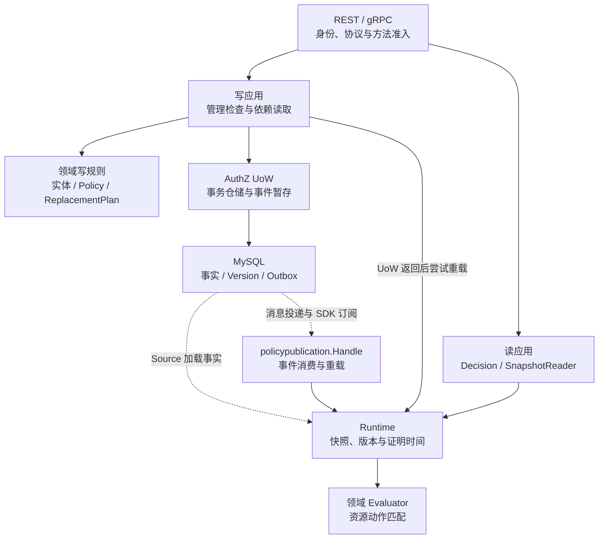

# 分层架构与代码索引

> 状态：已实现 · 2026-10-06 对照当前调用、装配与架构护栏修订；假设的扩展另标为设计检查点。

## 1. 一次修改要找到规则、执行入口和传播路径

AuthZ 将可持久化事实、管理用例和只读运行时分开，但一次事实变更往往跨越这三处。删除资源的 `retry` 动作，不只是修改 Resource 的动作列表：必须读取仍引用它的有效 Grant，决定拒绝还是先撤销这些 Grant，再按版本协议提交。把用户在公司1的门店10换成20，也不能只更新一个 JSON 字段：它属于公司范围替换，要保留该公司受管岗位的完整目标集合、检查期望版本，并重建配对权限投影。

本文回答“从哪里改、哪些调用必须一起检查”。概念与不变量由[领域模型](01-领域模型设计.md)维护；单次判定由[授权判定](02-关键链路-授权判定与不可变快照.md)维护；锁、事务及替换合同由[授权写入](03-关键链路-授权写入与受管Assignment.md)维护。下面的图是当前调用与事实传播关系，不是 Go import 图。

图中的实线表示调用，虚线表示存储或事件提供的输入。写应用在 `WithinTx` 返回后尝试本机重载；拥有事务时这是提交后，借用宿主事务时可能早于宿主提交。最终重载失败不会让普通写命令回滚已提交事实。事件消费调用另一条返回错误的重载路径；加载、覆盖通知版本和各实例就绪的区别见[多实例收敛](04-关键链路-多实例策略收敛.md)。

## 2. 层的职责要落实到端口和绑定点

| 入口或端口 | 当前实现与装配 | 修改时应保留的边界 |
| --- | --- | --- |
| 领域实体、值对象和策略 | [domain/authz](../../../internal/apiserver/domain/authz)，含 Role、Resource、Grant、Assignment、Scope、跨聚合 Policy 及 Evaluator | 不导入数据库或传输实现。跨聚合策略接收应用读出的依赖；Assignment Validator 通过仓储/解析端口做 I/O，因此不能把全部领域代码称为纯函数 |
| `UnitOfWork / TxRepositories` | [应用端口](../../../internal/apiserver/application/authz/uow/uow.go) → [MySQL UoW](../../../internal/apiserver/infra/mysql/uow/authz/uow.go) | 回调获得绑定事务的事实仓储，以及 SubjectResolver 和 Stager，执行时传 `txCtx`；直接拿外层仓储写入不能替代这一组合 |
| `DecisionRuntime / SnapshotRuntime` | [DecisionService](../../../internal/apiserver/application/authz/authorization/decision_service.go)、[SnapshotReader](../../../internal/apiserver/application/authz/authorization/snapshot_reader.go) → 同一 [Runtime](../../../internal/apiserver/infra/authz/runtime/runtime.go) | 应用委托读取；Runtime 管理 Source、快照发布、重载互斥与证明时间；Evaluator 只求值，不承担加载 |
| `management.Checker / RuntimePolicyReloader` | [application.go](../../../internal/apiserver/container/authz/application.go) 将同一 Runtime 注入 Guard 和写服务 | 管理动作判定与写事实事务没有自动绑定到同一版本；Runtime 接口存在不代表目标 User 已认证或 active |
| `CatalogWriteAuthorizer` | ResourceCatalog → [DecisionService.RequireCatalogWrite](../../../internal/apiserver/application/authz/authorization/catalog_write.go) | 目录写入检查使用命令的 Actor；Actor 的可信来源由适配器或内部调用方负责 |
| `assignment.SubjectResolver` | [infra.go](../../../internal/apiserver/container/authz/infra.go) 装配 registry → UserSubjectResolver → Identity `UserResolver` | 普通赋权及两类 Replace 检查 User 锚点存在；撤销留有清理孤儿分配的能力。存在性、active 和业务身份的区别见[模块边界](07-模块边界-AuthZ与AuthN-Identity-Suggest.md) |
| `event.Stager` | 当前生产 [StandardStager](../../../internal/apiserver/infra/mysql/eventoutbox/standard_stager.go) 绑定宿主 MySQL 事务，交给可靠消息 SDK 写标准 Outbox | Stage 是事务内持久化意图，不能换成直接发 Broker。BootstrapStager 另用于历史迁移与测试，其通过不证明标准 Outbox 链路 |

当前依赖倒置的要点是让应用依赖自己需要的窄能力。它并不要求每个输出都是接口：`ApplicationCapabilities` 同时含接口和应用服务指针，typed deps 含 `*gorm.DB` 和 Runtime Config；基础设施 Runtime 也依赖应用定义的 [SubjectSnapshot 读模型](../../../internal/apiserver/application/authz/authorization/snapshot_model.go)。因此调整包位置前，应确认谁定义合同、谁实现它、谁装配它，不能仅按目录层数判断依赖方向。

## 3. 写事实：应用读取依赖，领域决定是否合法

| 要改的事实 | 先进入的应用代码 | 同时检查的领域规则和持久化责任 |
| --- | --- | --- |
| Role 创建、更新或删除 | [role/command_service.go](../../../internal/apiserver/application/authz/role/command_service.go) | 原始管理动作和保护检查；更新/删除锁 Role；删除读取 Assignment 与 Grant 后调用 [RoleRemovalPolicy](../../../internal/apiserver/domain/authz/policy/role_removal_policy.go)，被引用则拒绝，不级联清理 |
| Resource 目录动作 | [resource/command_service.go](../../../internal/apiserver/application/authz/resource/command_service.go) | 更新/删除锁 Resource，读取有效 Grant；[ResourceChangePolicy](../../../internal/apiserver/domain/authz/policy/resource_change_policy.go) 校验候选目录或拒绝被使用的删除 |
| PermissionGrant 能力 | [permissiongrant/service.go](../../../internal/apiserver/application/authz/permissiongrant/service.go) | 创建锁 Role 和 Resource，检查 Role 的固定敏感保护及 Grant 的目录关联/action；首次有效撤销才推进版本 |
| 主体的岗位与 Scope | [assignment/command_service.go](../../../internal/apiserver/application/authz/assignment/command_service.go) | 校验主体、锁定所需 Role/Assignment、执行服务准入与保护；[ReplacementPolicy](../../../internal/apiserver/domain/authz/assignment/replacement_policy.go) 及 [PlanScoped](../../../internal/apiserver/domain/authz/assignment/scoped_replacement.go) 计算差集，应用执行计划 |

跨聚合 Policy 接收候选和依赖事实，让“哪些变更应被拒绝”可以脱离数据库单独验证；应用仍要决定读取哪些依赖、如何加锁和何时提交。代价是规则不会自动应用到每条写路径：漏读有效 Grant 或调用方跳过 Policy，都可能使正确的领域规则失效。数据库锁与另一个写用例采用的锁协议才负责避免检查后依赖被并发改变；替换持久化实现时，这部分原子性需要重新验证。

这些写应用分别调用 `policychange.StagePolicyVersionChanged`，在同一 UoW 中写事实、推进全局版本并暂存事件；它们不经过 `policypublication`。普通命令与 Replace 的 no-op 规则也不同：两类 Replace 仅在计划 `Changed` 时写新版本和尝试重载，不能为“统一发布入口”机械增加无变化事件。详细顺序和失败窗口回链[授权写入](03-关键链路-授权写入与受管Assignment.md)。

### 3.1 例：从目录删除 retry

假设 Resource 支持 `read/retry`，某有效 Grant 引用 `retry`。`UpdateResource` 先锁定目录并在内存形成只含 `read` 的候选，再读取依赖并执行 `ValidateDependencies`。Grant 不能通过候选目录校验，应用返回 `ErrResourceInUse`；候选不会保存，也没有新版本或事件。

这说明目录动作不是可随意收缩的展示标签。若产品决定移除能力，需要明确哪些 Grant 先撤销、哪些调用方停止发出该动作，以及旧快照允许继续返回的窗口；现有实现没有自动级联修改 Grant。另一个受信系统模式 Grant 可以没有 ResourceID，按目录ID查依赖不覆盖这种模式，不能把本规则扩大为所有字符串模式都被目录收缩约束。

现有[应用测试](../../../internal/apiserver/application/authz/resource/command_service_integration_test.go)实际验证拒绝后 `retry` 仍在且无版本行，但使用 SQLite 和允许写入的 authorizer 替身。需要判断“目录更新与并发创建 Grant 谁先成功”时，应转到真实 MySQL 并发专项，而不是从这个回滚用例推导锁行为。

### 3.2 例：公司1的门店10换成20

当前 `stores` 范围变化进入 `ReplaceScopedAssignments`。领域 `PlanScoped` 比较同公司、同受管 Role 的范围：相同目标保留；范围不同则计划撤销旧 Assignment 并创建新 Assignment。完整目标集合中省略的其他受管岗位也会撤销，公司2与集合 M 外的分配保留。应用负责事实读取、锁、CAS 与计划执行；持久化的实际删除及历史保留限制见[授权写入](03-关键链路-授权写入与受管Assignment.md)，不以源码注释“preserving historical audit”代替数据库行为。

若未来提出第三种 Scope Kind，下面是扩展前的设计检查点，当前仍只支持 `all_stores/stores`：

1. 在 [Scope](../../../internal/apiserver/domain/authz/scope/scope.go) 定义零值、构造、相等比较、同公司 Union 和 `ContainsStore` 的含义；新 Kind 是否仍能表达单公司范围、如何处理未归属门店对象，必须先确定。
2. 复核 PlanScoped 的 Kind/门店ID相等比较、[Assignment mapper](../../../internal/apiserver/infra/mysql/assignment/mapper.go) 的恢复，以及 PO/迁移中的唯一约束。只增加枚举会留下旧持久化记录、新字段遗漏和相等性误判风险。
3. 同步 Runtime 配对投影、proto/传输映射和 [SDK Scope](../../../pkg/sdk/authz/scope.go)；明确旧客户端看到未知 Kind 的拒绝行为，再检查业务消费者是否真正执行新范围。SDK 接受字段形状不等于消费者具备这种授权语义。

## 4. 读能力：不要在委托层再造策略或用户准入

读取路径按需要输出的合同定位：

| 要得到的结果 | 当前链路 | 不能由结果推导的结论 |
| --- | --- | --- |
| 路由动作的 bool | [RouteDecisionService](../../../internal/apiserver/application/authz/authorization/route_decision_service.go) 解析 Subject、构造 Request → DecisionService → Runtime → Evaluator | bool 已裁剪匹配证据和版本；不是业务对象范围、当前身份或认证结果 |
| 动作 Decision | DecisionService 检查 Runtime 已配置后直接委托；Runtime 选取通过证明预算检查的快照，再调用领域 Evaluator | DecisionService 不是统一输入验证器，也不再查 User；请求构造、可信来源和消费者业务检查另有入口 |
| 应用权限及配对 Scope | SnapshotReader 检查主体非零、AppName 非空 → Runtime 从同一快照投影 SubjectSnapshot | AppName 非空不证明它绑定调用服务；Scope 不证明对象的当前归属 |
| 已提交水位 | [policyversion.Reader](../../../internal/apiserver/application/authz/policyversion/reader.go) → PolicyVersion 仓储 | 数据库版本不是该实例已加载版本，也不等待实例赶上 |

当前 MySQLSource 加载的是授权事实，没有 User 状态、业务运营人员、门店有效性或 Profile 关系。因而“停用后仍有直接角色”应沿 AuthN/Identity 与消费者准入排查，不能在 RouteDecisionService 中凭已有 Assignment 判定用户仍 active。跨调用的动作/Scope 版本组合、User 状态与 Suggest 多份投影窗口由[模块边界](07-模块边界-AuthZ与AuthN-Identity-Suggest.md)解释。

## 5. 改接口时，要保留传输与应用各自的准入

REST/gRPC 除协议适配外，还负责可信身份来源、方法级权限和部分 Assignment 内容准入；应用再执行自己的 Guard 与领域规则。直接调用应用保留其检查，但跳过了传输身份核验和部分更严格的公开合同。直接调用仓储则连应用管理检查、跨聚合规则与版本协议也会绕过。

例如，为后台任务新增授权写 RPC 时，应先从 [gRPC service](../../../internal/apiserver/transport/grpc/service/authz/service.go) 和 [Scoped RPC](../../../internal/apiserver/transport/grpc/service/authz/scoped_assignment.go) 核对证书 caller、ACL、约束 policy 与 delegated actor，再进入应用。不能以请求内 `service` 字符串构造可信服务上下文，也不能把审计字符串当作最终用户认证。公开两类替换均由准入策略生成显式受管集合 M；Scoped 额外要求正期望版本，兼容 Managed 协议没有该字段。内部应用可走 `ExpectedPolicyVersion=0` 路径，可信 `admin` 上下文也有明确例外。各入口的合同不能互相替代，详见[gRPC 与 SDK](06-关键链路-gRPC服务间授权与SDK.md)。

缺依赖时也要核对具体分支：[Guard.RequireOperation](../../../internal/apiserver/application/authz/management/protection.go) 拒绝缺可信用户/checker 的普通操作，普通服务的分配写缺 admission policy 会拒绝，但可信内部 `admin` 会直接通过原始动作检查。ResourceCatalog 缺 authorizer 会失败；存在 authorizer 时检查的是命令 Actor，并不重新认证或自动对齐 management context。查询服务的检查与写服务又不完全对称，见[REST 管理](05-关键链路-REST管理与路由授权.md)。

当前启动 ACL 交叉校验只枚举 Grant/Revoke/Managed，漏 Scoped，也不计算 `DeniedMethods` 后的有效权限；Scoped 对非法主体类型的部分错误原样返回，客户端可得到 `Unknown`。因此新增方法时，必须同时核对方法ACL、内容准入、错误转换、proto、SDK及实际调用测试，不能沿用“架构护栏通过，所以新 RPC 已受保护”的推断。

## 6. 装配成功、注册成功和读取就绪分别定位

[AuthzModule.InitializeWithDeps](../../../internal/apiserver/container/authz/module.go) 要求 DB、EventStager 和 Identity UserResolver，顺序为基础设施 → 领域 → Runtime 首次加载 → constraints/ACL policy → 应用服务。首次加载在 [runtime_builder.go](../../../internal/apiserver/container/authz/runtime_builder.go)，并调用 `RequireSync`；不是每个 handler 各自创建 Runtime。[deps.go](../../../internal/apiserver/container/authz/deps.go) 和 [capabilities.go](../../../internal/apiserver/container/authz/capabilities.go) 分别维护输入与发布给协作者的能力。

Container 在 AuthZ bootstrap 后半段创建 SDK subscriber；[REST collector](../../../internal/apiserver/container/authz/rest.go) 与 [gRPC collector](../../../internal/apiserver/container/authz/grpc.go) 在后续传输装配中按模块 Available 构造 handler 或注册 closure，process 再启动同步并安排关闭。模块初始化不等于 subscriber 已经运行。后台生命周期从 [bootstrap_modules.go](../../../internal/apiserver/container/bootstrap_modules.go)、[policy_sync.go](../../../internal/apiserver/container/authz/policy_sync.go) 和 [shutdown_lifecycle.go](../../../internal/apiserver/process/shutdown_lifecycle.go) 追踪，避免由传输持有并关闭共享连接或任务。

`policypublication.Service.Handle` 的生产调用来自同步协作者的 SDK 订阅回调：解码版本事件、记录目标版本、已加载则跳过，否则调用返回错误的重载 helper。它是事件消费应用；命名不足以证明它是所有写操作必经的发布 facade。调整重试或 ACK 时读[该服务](../../../internal/apiserver/application/authz/policypublication/service.go)与同步协作者，调整事务内 Stage 时读写应用与 Stager。

`RequireSync` 将同步状态纳入 Runtime health/readiness，但 Check、快照及角色读取直接检查所选快照的证明年龄。初始加载后 proof 有效、subscriber 尚未运行时，可以出现 readiness=false 而读路径仍在预算内执行。gRPC Registry 注册即标记 SERVING，也不证明 Runtime fresh；故障定位应分别确认初始化、注册、sync 状态、所选快照证明和真实业务请求。具体矩阵由[多实例收敛](04-关键链路-多实例策略收敛.md)及[运行时就绪](../../01-运行时/03-后台任务就绪与优雅关闭.md)维护。

## 7. 兼容字段、历史解释器与维护写入分开找

| 路线 | 当前用途 | 修改或运行前的边界 |
| --- | --- | --- |
| [authzcompat](../../../internal/pkg/authzcompat/empty.go) | REST DTO 的旧条件/属性字段解码，以及 Grant/Resource mapper 的存储恢复校验 | 只接受合法空表示；输出规范空对象，如 `{"version":1,"all_of":[]}`。未知字段、非空条件、非法版本、重复字段会拒绝；这里没有条件求值器 |
| [legacycondition](../../../internal/apiserver/maintenance/legacycondition) | rolemodel/conditionretire 解释旧格式与制定迁移计划 | 不被活动 AuthZ 领域或 Runtime 调用。维护代码、启动 bootstrap 和 fixture 仍使用它，不能仅因在线功能退役就删除 |
| [conditionretire](../../../internal/apiserver/maintenance/conditionretire)、[rolemodel](../../../internal/apiserver/maintenance/rolemodel)、[scopemigrate](../../../internal/apiserver/maintenance/scopemigrate) | 独立 preflight/计划、Apply/补偿、receipt、验证；CLI 位于 `cmd/iam-maintenance` | 人工 Apply/回滚有停写声明与审核指纹前置；事务内锁版本、核对事实、写 receipt、推进版本并 Stage，使用自身迁移规则，不复用 REST/gRPC Guard |

条件退役的Build只校验封闭旧规则，不等于当前Mapper/Snapshot完整加载；Verify比对原after图。其rolled_back仅为历史状态，无补偿Hash比较，提交后的报告失败也不证明未落盘。计划/来源报告、连接目标及恢复证据的具体判断归[条件维护手册](08-条件授权退役维护手册.md)，不要把三套维护工具的验证强度概括成同一保证。

维护前置中的 `stopped` 是调用方提供的声明，不会自行停止所有 IAM/QS 写者。Scope 维护对 IAM 使用本地事务并读取 QS 数据，不是跨两库原子提交；真实停写窗口及复核应由[Scope 运维手册](../../operations/assignment-scope-migration.md)执行。

首次迁移的 bootstrap 是另一条路线：[Migrator](../../../internal/pkg/migration/migrate.go) 先确认初始版本为0、除 `schema_migrations` 外没有表，[process/database.go](../../../internal/apiserver/process/database.go) 再于31/33/35阶段调用准备、独立Role和条件退役hook，使用 BootstrapStager。hook可自行生成指纹或传入停写声明，其自身不重新证明数据库最初为空。不能把人工 Apply 的前置机械套到所有 bootstrap，也不能把历史迁移成功当作今天的事实证明。

裸 SQL 修正授权事实若不推进 PolicyVersion，即使周期 Reconcile 正常，Runtime 也可能继续使用旧事实：[freshness.go](../../../internal/apiserver/infra/authz/runtime/freshness.go) 在同版本且无 lag 时只确认并续期证明，不重读事实。因此默认60秒预算不承诺自动发现任意 SQL 变化。正式维护的版本/事件/receipt 协议与裸 SQL 要分别评估；Mapper 和 Snapshot 的校验只能兜住它们实际检查的形状与关联，不能恢复操作者身份、补发丢失事件或重建业务关系。

旧字段编号和迁移原始记录继续保留；旧角色继承接口返回410。处置条件残留沿[退役维护手册](08-条件授权退役维护手册.md)查，不重新把历史格式带回在线 Evaluator。

## 8. 架构护栏证明结构，行为测试证明具体场景

[architecture_test.go](../../../internal/pkg/architecture/architecture_test.go) 采用两类主要检查。AST 扫描按禁止列表检查直接 import，普通规则排除测试、部分规则另含测试；不建立传递依赖图，也不是第三方包的完整允许矩阵。路径/源码片段检查约束退役入口、Evaluator 所在位置、跨聚合 Policy 名称及旧差集片段，全文字符串也可能被注释满足，不证明规则可达或执行顺序。

两个容易误读的名称需要具体说明：`TestAuthzGRPCAssignmentAdmissionNeverFailOpen` 只检查模块的固定错误文案和 service 的失败指标片段；`TestGRPCServicesUseSharedCodedErrorMapper` 禁止指定私有映射形式，并不要求所有返回都经过 `ToStatusError`。当前 Scoped 原样返回非法主体错误仍可通过这类护栏。判定、准入、版本及错误结果必须另从行为测试取得证据。

| 修改关注点 | 已有验证入口 | 证明范围及剩余工作 |
| --- | --- | --- |
| 领域匹配、目录动作及跨聚合策略 | `domain/authz/{authorization,resource,policy}` 的专项测试 | 执行领域规则；不证明数据库锁、可信 Actor 或完整 HTTP/RPC 链 |
| 委托与候选变更被拒 | `application/authz/{authorization,resource,role,assignment,permissiongrant}` | 委托替身与 SQLite 事务场景；Role 应用删除用例覆盖 Grant 依赖，不自动证明 Assignment 删除竞争 |
| 冲突写入序列化 | [hardening_mysql_test.go](../../../internal/apiserver/infra/authz/integration/hardening_mysql_test.go) | 真实 MySQL 的 Role删除/Grant创建、目录更新/Grant创建冲突，断言恰一成功且快照可构建；未配置 `IAM_AUTHZ_TEST_MYSQL_DSN` 会跳过，不能把绿色 package 当作这两项已执行 |
| 事件消费与读取发布 | `application/authz/{policychange,policypublication}`、`infra/authz/runtime` | helper、订阅事件应用与内存 Source 场景；不证明真实 Broker、标准 Outbox 或全部实例加载屏障 |
| 迁移计划、receipt及补偿 | `maintenance/{conditionretire,rolemodel,scopemigrate}` | Role/条件退役使用 `ROLE_MODEL_MYSQL_DSN`，Scope使用 `SCOPE_MIGRATION_MYSQL_DSN`；缺失时普通fixture用SQLite、指定锁专项跳过，相应 `*_REQUIRE_MYSQL=true` 门禁才拒绝缺库。测试存在不表示执行过真实维护或生产写入 |
| 服务注册、协议准入与错误 | `container`、`infra/authz/assignmentconstraints`、`transport/grpc/service/authz`、`pkg/sdk/authz` | collector/registry测试执行注册closure但不发送RPC；临时配置、替身及本机协议测试另取证。新增方法仍须覆盖方法白名单/deny、内容准入、错误分支与消费方行为 |

完成修改时，将正文、协议/配置、图示和适用测试沿同一主题同步。文档门禁只验证已编码事实、链接与图源配对；本地测试、真实存储/消息、部署状态和业务验收各自报告。发布证据由[安全加固与发布验收](09-安全加固与发布验收.md)维护，不由本页的代码位置或“护栏通过”代替。
