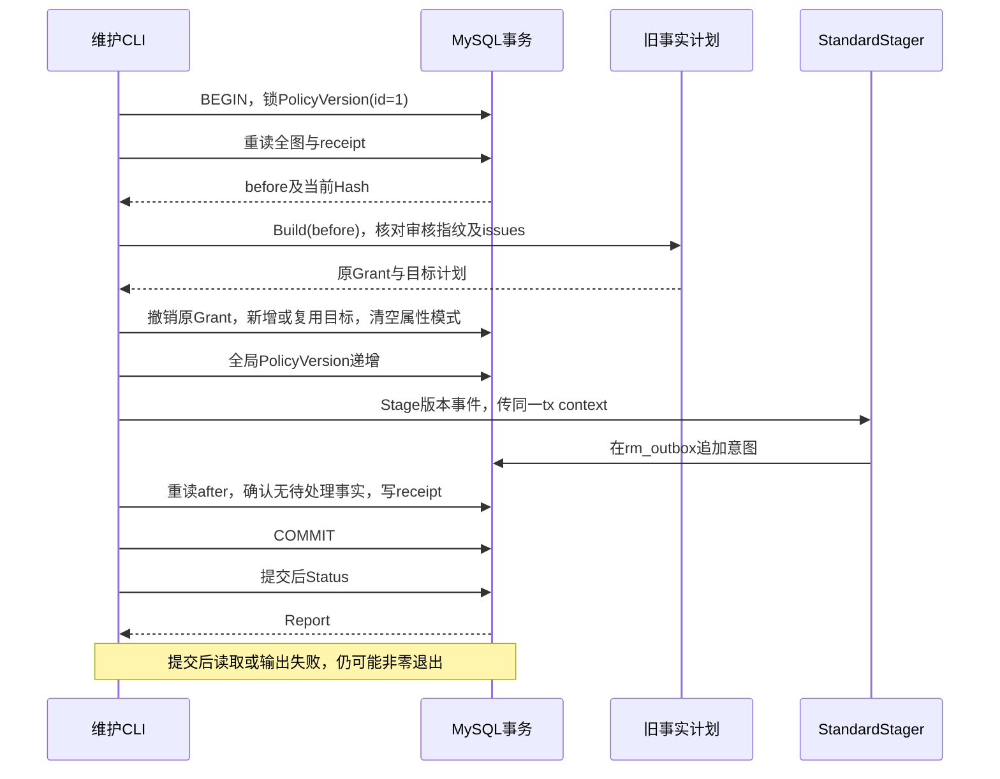

# 条件授权退役维护手册

> 状态：已实现 · 2026-10-06 对照计划、事务、CLI与测试修订；本页描述现有工具和执行判断，本轮未运行维护写入或生产验收。

## 1. 维护结论：这是能力迁移，不是删除旧字段

活动AuthZ已退役对象条件，Mapper不得把非空旧条件静默当成无条件。`condition-authz-retire`则在明确白名单、审核指纹与停写窗口内，撤销两类旧retry Grant，生成或复用无条件目标，并清空对应资源属性模式。它可能扩大单岗位的动作能力，因此不能称为保持原授权语义的清理。

例如user:123只持有运营员，过去retry限于adhoc；迁移后该Role的IAM动作不再区分adhoc/plan。QS须在实际入口继续组合有效身份、配对Assignment Scope、真实公司/门店归属、对象关系/状态和重试并发规则。工具不新增Scope，也不查询QS或User状态；没有业务范围的ALLOW不能作为开放全部数据的依据。当前动作与业务责任见[模块协作](07-模块边界-AuthZ与AuthN-Identity-Suggest.md)。

[迁移35](../../../internal/pkg/migration/migrations/000035_condition_retirement_receipt.up.sql)只安装独立receipt表`iam_condition_retirement_migrations`。固定清单ID为`condition-authz-retire-v1`，与Role迁移、继承归档、Scope清单分开；执行条件退役不会重置旧Role清单的after_hash。新Runtime首次加载活动旧条件会失败；已有快照遇到加载失败仍可能在旧proof预算内服务，不能靠启动失败或一台ready推断全系统已停用旧能力。

## 2. 自动计划只接受哪些旧事实

[Build](../../../internal/apiserver/maintenance/conditionretire/plan.go)使用维护专用legacycondition解释旧数据，不把旧条件求值带回活动领域。先核对活动Grant的规范键，再允许以下封闭变换：

| 待处理事实 | 必须满足的输入 | 目标变换 |
| --- | --- | --- |
| 运营员条件Grant | 活动Role名`qs:assessment_operator`；精确资源`qs:evaluation:collection:assessments`、action=`retry`；非空ResourceID指向活动同键目录；规范化后唯一谓词`object.origin_type eq string adhoc` | 撤销原Grant，生成或复用同Role/Resource/动作的空条件Grant |
| 计划管理员条件Grant | 活动Role名`qs:evaluation_plan_manager`；同一资源/动作/目录要求；唯一谓词的字符串值为`plan` | 同上，原来源限制移交QS业务准入 |
| 非空资源属性模式 | assessments目录，恰好一个`object.origin_type`的string属性；允许值恰为adhoc、plan，顺序不限 | 写为`{"version":1,"attributes":[]}`；不改ResourceKey、actions或其他目录内容 |

旧条件JSON的实际形状例如：

```json
{"version":1,"all_of":[{"key":"object.origin_type","operator":"eq","value":{"type":"string","string":"adhoc"}}]}
```

未知字段、尾随JSON、非法版本/类型、其他Role/资源/动作/来源或条件组合都会形成`issues`并阻止执行。活动Grant的GrantKey按RoleID、ResourceID、pattern、action和规范化条件JSON重算，必须与存储值一致；不是只检查64位格式。撤销/删除历史Grant不参与这些计划校验，保留原内容。旧decoder没有活动authzcompat那样的重复JSON字段拒绝逻辑，不能把两者校验强度混为一谈。

计划也有明确盲区：条件分支核对目录ID→key，却不调用`ValidateAgainst`检查目录是否登记retry；无条件Grant未做完整目录绑定或敏感Role承载校验，Assignment Scope也不由Build恢复验证。因此Preflight通过、Apply写后检查通过或Verify通过，都不是当前Runtime可加载的证明。另用[authorization-verify](../../../cmd/iam-maintenance/authorization_verify.go)核对当前Source/Mapper/Snapshot：执行前活动旧条件导致的拒绝属于预期限制，应记录而非要求通过后才Apply；Apply后才要求构建成功，再独立核对运行实例和消费者。

遇到未知旧规则应停止并制定单独计划；不可删掉条件、改GrantKey或扩展白名单来让本次报告变绿。上述限制及未覆盖案例应随恢复包保存。

## 3. 怎样读懂新增、复用与来源变化

以下是代码允许的输入输出推演，ID仅为示例；`K_empty`表示同RoleID/ResourceID/pattern/action及空条件的规范键，不是本轮数据库观察。

| 输入 | `grants`计划与实际写入 | `users`来源对照 |
| --- | --- | --- |
| user:123只有运营员；Grant201限adhoc，无空条件目标 | old_id=201、target_key=K_empty，existing_id缺失；撤销201并创建新Grant | before=[adhoc]，after=[adhoc,plan]，added=[plan] |
| 上述Role另有相同规范键的活动无条件Grant202 | existing_id=202；撤销201，保留202，不新增目标 | before/after均为两来源，added为空 |
| 主体同时持有运营员adhoc与计划管理员plan，两Role均无空条件目标 | 两条原Grant各撤销，各生成本Role目标 | before/after均为两来源，added为空，但事实仍变化 |
| 主体另有宽通配Role覆盖两来源 | 通配只影响来源并集；不复用另一个Role的Grant作为本Role目标 | added可为空，仍可能创建目标Grant |

复用按规范键完全相同，不能用“已有管理员能力覆盖它”代替ExistingID。`resources`是待清空属性模式的目录ID，`grants`是明确旧ID→目标键/已有ID，不能仅审核总数。

`users`按直接、未删除Assignment与活动Grant推演，固定比较adhoc/plan，不遍历继承，也不检验Subject对应有效User。它忽略Scope、QS人员/机构、业务对象和其他来源类型；字段名不表示已核验人员名单，after_origins也不穷尽无条件Grant允许的未来对象来源。`added_origins=[]`只说明这两个值在现有岗位并集下没有新增，不证明零事实变更、零业务影响或无需范围验收。

## 4. 状态、指纹和receipt分别证明什么

[State/Hash](../../../internal/apiserver/maintenance/rolemodel/source.go)按ID读取Role、Assignment、Grant、Resource、可存在的继承历史和全局PolicyVersion，再对State JSON取SHA-256；包含历史行、PO字段与原始JSON文本。无关Role描述、原始JSON格式或其他授权写入推进版本，也可能使指纹失效。这种全图限制便于拒绝恢复覆盖后续写入，代价是完成后正常授权变更也会阻止自动补偿。

指纹不包含User/LoginIdentity、QS事实、Outbox、schema dirty、部署或消费者状态；相同指纹不能证明这些对象未变。Status/Preflight在只读Repeatable Read事务内读取IAM事实，不能替代跨系统停写。

| `state` | 具体含义 | 可据此做什么 |
| --- | --- | --- |
| pending | 没有对应receipt，甚至receipt表可尚不存在；只表示未登记 | 执行Preflight并核对退出码、issues和写入前置；未知条件仍可能以pending报告失败 |
| applied_unchanged | receipt内容校验通过，当前全图Hash等于原after_hash | Verify可成功；同原fingerprint的Apply返回已有receipt，不推进版本/重复Stage |
| applied_drifted | 已有applied记录，但当前全图不同 | 只审阅differences；Apply、Verify、Rollback均拒绝，不能强改after_hash |
| rolled_back | receipt记载曾补偿，不比较补偿后的当前Hash | 进入恢复核对；Preflight、Verify、Apply与再次Rollback均拒绝，不代表当前恢复事实一致 |
| invalid | 事实加载或receipt JSON/Hash/计划/状态校验失败等 | 保存错误及原材料，停止；它不是所有计划阻断的统一状态 |

pending Preflight的`fingerprint`用于本次审核；完成后Report的`fingerprint`仍是原before指纹，`after_hash`是Apply结果，`current_fingerprint`是现在的全图。不要将current_fingerprint替换为回滚参数。applied_unchanged Preflight返回原计划，不是在今天重新给人授予一轮权限。

receipt在库内保留BeforeJSON、AfterJSON、PlanJSON及两个Hash；CLI报告不导出完整before/after。inspect复核before/after自身Hash、重建原Plan一致且无Issue，但不独立重演“after一定是before按计划变换所得”。它是受信维护记录，不是抗数据库篡改的独立审计证明。rolled_back保留原after_hash，没有单独RollbackHash/JSON。

## 5. 写事务怎样阻止漂移，怎样留下事件

下面描述首次Apply的CLI顶层事务；省略错误分支，任何事务内错误都须传播并回滚。



[mutate/apply/restore](../../../internal/apiserver/maintenance/conditionretire/migrate.go)先锁单例版本行，重读全图、校验清单，再写事实/版本/事件/receipt；Stage失败会使本地事务整体回滚。首次Apply即使计划没有待改Grant/资源，仍会推进版本并登记receipt；只有已applied_unchanged的重复Apply走无写分支。所有版本变化指全局PolicyVersion，实体Grant/Resource另按更新递增Version。

锁版本行可序列化遵守同一协议的写者，不覆盖绕过协议的SQL、User/QS关系变化或运行进程。当前CLI拥有连接和顶层事务；若内部调用借用宿主事务，宿主仍负责传播错误、commit/rollback，库返回不证明已提交。写操作直接走维护规则，不经过REST/gRPC管理Guard或服务M；执行者的数据库权限与维护授权须独立绑定，工具没有actor-id或有限委派合同。

首次空库bootstrap是另一入口：[process/database.go](../../../internal/apiserver/process/database.go)在Migrator确认初始空库后的35阶段调用Bootstrap，使用历史BootstrapStager并自行预演/传stopped=true；不能把它当今天存量库CLI的standard门禁，也不能删掉这段仍被首次初始化使用的legacy解释代码。

## 6. 当前执行前置与私有报告

CLI使用`MYSQL_HOST/PORT/PASSWORD`，用户名优先`MYSQL_USERNAME`再`MYSQL_USER`，数据库优先`MYSQL_DATABASE`再`MYSQL_DBNAME`；HOST含端口时覆盖PORT，不读QS环境。绑定本批工具SHA、目标数据库、事件目录路径/摘要和备份恢复点，凭据只放受限环境。`--timeout`默认1分钟，在连接打开后才创建操作context，不是整个CLI从启动计时的统一deadline。

第7节的authorization-verify使用[另一个解析器](../../../cmd/iam-maintenance/main.go)：优先MYSQL_USER再USERNAME，HOST内端口仅在MYSQL_PORT为空时生效。冲突别名/端口可能导致Apply与加载验证连接不同目标。本批采用HOST不内嵌端口、显式PORT、唯一用户名/数据库别名，或证明重复配置值相同；分别核对两入口的脱敏连接目标与数据库标识，不能把另一库的snapshot成功计为本批证明。

Apply/Rollback必须显式`--outbox-mode=standard`。[MaintenanceStager](../../../internal/apiserver/infra/mysql/eventoutbox/maintenance_stager.go)要求MySQL、schema_migrations恰好一行且clean/版本≥39、标准列可解析、旧Outbox无非published行；不要求旧表全空，也不验证完整DDL类型/索引、运行writer独占或Relay归属。只读Status/Preflight/Verify不构造它，不检查dirty；给只读命令填outbox-mode或writes-stopped不会完成写入门禁。

先冻结相关REST/gRPC、后台任务与QS人员/范围配置，再重新Preflight。`writes-stopped`只是声明，[冻结机制](../../operations/authz-write-freeze.md)的文件/SHA检查不证明每实例已禁写。保持必要读取与恢复路径；标准schema不满足时按协调恢复方案处理，不省略mode或关闭当前必需消息组件绕过。

下面是命令模板，执行者须将目录替换为本批唯一受限目录，确认PATH中的工具为已核对版本。使用新目录、禁止覆盖，并将stdout和stderr均保存在私有证据；本页不执行命令。

```sh
set -eu
umask 077
set -C
REPORT_DIR=/secure/condition-retirement/batch-REPLACE-ME
mkdir -m 700 "$REPORT_DIR"
iam-maintenance condition-authz-retire status > "$REPORT_DIR/status.json" 2> "$REPORT_DIR/status.stderr"
iam-maintenance condition-authz-retire preflight > "$REPORT_DIR/preflight.json" 2> "$REPORT_DIR/preflight.stderr"
```

每一步检查退出码、预期state、issues、逐Grant/资源与主体变化，再人工登记REVIEWED_FINGERPRINT。set -e只防止失败后继续命令，不能理解业务状态；Status返回applied_drifted/rolled_back也可以exit0。错误可包含GrantID/资源标识，CLI没有“公开日志自动只留摘要”的保证；宿主另生成允许字段摘要，不公开原报告或stderr。

| 输出/失败位置 | 需要怎样判断 |
| --- | --- |
| 参数、数据库、catalog或standard门禁早退 | 可无JSON；保存退出码及私有stderr，不将空文件当成功 |
| pending预演有未知条件/错误键 | 可输出pending+issues并exit1；pending本身不表示计划可执行 |
| Apply/Rollback事务报错 | 当前CLI仍可输出未填充Report；不能从空字段推断数据库状态 |
| 提交后Status或JSON输出失败 | 可能已commit但exit1；保持窗口，重新用新文件Status并核对receipt/事实/版本/Outbox，先消除结果不明 |

mutation缺writes-stopped或fingerprint长度非64会在连接前拒绝，但长度64不是审核或匹配证明。未知flag、额外位置参数、timeout≤0拒绝；mode只接受精确standard。不要把退出码1统一解释为“无写入”，也不要用日志正则或最后一次命令成功替代整段结果。

## 7. Apply后达到什么证据才能开放

在上述检查通过、恢复方案可用且写者停住后，用人工核对的本批指纹执行：

```sh
: "${REVIEWED_FINGERPRINT:?填入本批人工审核指纹}"
iam-maintenance condition-authz-retire apply --writes-stopped --fingerprint "$REVIEWED_FINGERPRINT" --outbox-mode standard --event-catalog configs/events.yaml > "$REPORT_DIR/apply.json" 2> "$REPORT_DIR/apply.stderr"
iam-maintenance condition-authz-retire verify > "$REPORT_DIR/verify.json" 2> "$REPORT_DIR/verify.stderr"
iam-maintenance authorization-verify > "$REPORT_DIR/snapshot.txt" 2> "$REPORT_DIR/snapshot.stderr"
```

只有确认每步结果后才进入下一层：condition Verify证明原after图仍一致；authorization-verify输出version/roles/assignments/grants的普通文本摘要，证明当前Mapper/Snapshot可构建，不证明schema clean、运行新鲜度或消费者已加载。随后捕获目标PolicyVersion，逐实例核对loaded/proof及实际授权结果，并核对Outbox/投递、消费方缓存及岗位投影。published、单实例ready和Verify各自不能替代完整收敛。

业务对照样本固定有效身份、对象关系及可操作状态，再逐项改变条件。先对照运营员/计划管理员在adhoc与plan上的IAM动作和QS最终结果；QS的允许/拒绝预期按本批批准的业务关系/状态规则确定，不由after_origins直接推出。另测只持结果岗位且无其他retry/宽通配Grant的账号拒绝retry、跨公司/门店和无归属对象拒绝、专业结果不可见、重复/并发retry满足QS规则。列表/count/统计/缓存与单对象写入采用同一范围；各消费者分别记录其SHA/SDK和实际入口。工具报告来源扩大正是需要这些证据的原因，不能把added_origins为空当作免验收理由。验收分层与撤权窗口见[安全加固与发布验收](09-安全加固与发布验收.md)。

## 8. 补偿恢复什么，不恢复什么

只在applied_unchanged、原fingerprint匹配且受控窗口内补偿。后续普通授权写入或Role描述变化也可能使全图漂移并阻断；保存差异并制定新的恢复计划，不修改原清单让它通过。参数形状与Apply一致，使用原审核指纹及新报告文件：

```sh
iam-maintenance condition-authz-retire rollback --writes-stopped --fingerprint "$REVIEWED_FINGERPRINT" --outbox-mode standard --event-catalog configs/events.yaml > "$REPORT_DIR/rollback.json" 2> "$REPORT_DIR/rollback.stderr"
```

| 对象 | 当前补偿动作 | 必须另核对的边界 |
| --- | --- | --- |
| 本次新建目标Grant | 先撤销并递增记录Version，保留行；不硬删 | 与Role-model rollback物理删除新增行不同，不能套同一审计说法 |
| Apply前已有的目标Grant | 保留，不回收复用能力 | 回滚不是撤销操作者现在全部retry能力 |
| 原条件Grant | 恢复旧revoked_at，条件文本未被Apply清除；更新时间/Version递增 | 不是逐字节恢复整个before图 |
| 资源属性模式 | 恢复before的attribute_schema，更新时间/Version递增 | 非空旧模式会被当前Mapper拒绝 |
| 全局版本/事件/清单 | 再推进PolicyVersion、同事务Stage，receipt置rolled_back | 原after_hash不更新，没有RollbackHash/JSON；Status不证明补偿后事实一致 |

补偿路径不重读并保存完整补偿图，也没有独立“恢复Verify”；再次Rollback不是幂等成功。即使成功后又改Role描述或Grant条件，Status仍可报告rolled_back，这是源码推论，当前专项未直接验证该时序。执行者须按原before/计划逐项核对预期恢复结果，并用匹配旧格式的工具/进程和专用身份验证；不能把CLI返回rolled_back当恢复开放证据。

恢复活动旧条件后，当前Mapper不能加载它。已有实例也不会因补偿立即清空原无条件快照，默认proof预算不是恢复屏障；先保持业务暂停/实例隔离，再协调能解释旧格式的IAM、QS与运营端、消息恢复所有权及缓存。Schema down、事实补偿、镜像回退和备份恢复分别评估；[35 down](../../../internal/pkg/migration/migrations/000035_condition_retirement_receipt.down.sql)故意阻止删除清单来盲降级。完整恢复路线归[数据库运维](../../05-工程质量与运维/03-迁移发布与数据库运维.md)，不靠重新信任泄漏密钥或放开缺范围旧消费者恢复可用。

## 9. 测试与后续变更的证明范围

| 当前证据入口 | 直接覆盖 | 尚不能推出 |
| --- | --- | --- |
| [生命周期/失败测试](../../../internal/apiserver/maintenance/conditionretire/migrate_test.go) | 运营员adhoc新增/精确复用、Apply幂等、一次补偿、Apply Stage失败回滚、前后漂移、receipt腐坏、未知字段和错误指纹 | 计划管理员、双岗位/通配并集、全部schema/目录/键错误组合、Rollback Stage失败、重复补偿、补偿后漂移 |
| [testDatabase](../../../internal/apiserver/maintenance/conditionretire/mysql_test.go)与[MySQL CI](../../../.github/workflows/concurrency-tests.yml) | 无DSN回SQLite；CI强制ROLE_MODEL_REQUIRE_MYSQL=true及隔离MySQL8，执行conditionretire/rolemodel包 | 普通CI通过不是MySQL通过；文档改动不自动触发该workflow，当前run需另查。该包没有真实并发争用专项 |
| DurableOutbox测试 | 使用BootstrapStager写历史Outbox，重复Apply不重复事件，一次补偿追加事件 | 当前standard MaintenanceStager/schema39门禁、SDK Relay、Runtime或全部消费者传播 |
| CLI/当前加载合同 | 本页按源码读取参数、输出/退出码和Mapper边界 | 现有condition包测试不执行CLI；未找到条件CLI专门用例或上述提交后报告失败专项 |

本轮文档核对的本地结果在[重构记录](../../_data/reviews/2026-10-06-docs-refactor.md)单独登记，不把仓库有测试当作已运行MySQL或生产维护。2026-09-11的schema35、126主体及pending只属于原日期预演，保存在[原稿归档](../../_archive/2026-10-06-docs-refactor/authz/08-条件授权退役维护手册.md)；新批次重新查询事实，不复用人数/指纹/执行许可。

后续改变白名单、规范键、计划字段或补偿语义时，同步legacy解析、Build、写后检查、receipt校验、状态/输出合同和测试矩阵；改变Scope、业务规则或传播时同步消费者及[当前分层索引](08-分层架构与代码索引.md)。优先补能区分失败原因的专项，不以“支持任意旧条件”扩大本工具职责。
