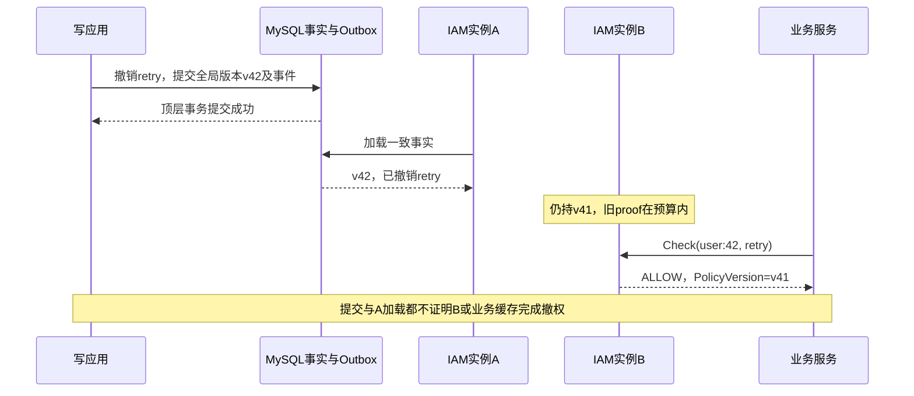

# AuthZ 安全加固与发布验收

> 状态：已实现 · 2026-10-06 对照当前控制、配置和测试修订；验收场景是发布要求，不表示本轮执行过部署、维护写入或业务验收。

## 1. 安全结论：配置权、动作权与数据范围分别约束

AuthZ 当前能限制普通Role承载固定敏感能力、管理受保护Role、服务写入受管集合，以及将资源动作与Assignment Scope配对。它没有把策略配置者自动限制为“只能授予自己已拥有的权限”，也没有在Check中重新认证目标User或核验业务对象。因此发布验收不能只看管理员操作成功、普通用户按钮隐藏或一次Check ALLOW；要证明每道约束在实际入口生效，并确认剩余窗口符合这次变更的要求。

现行Go module/SDK为v5，AuthZ REST/gRPC为v4，AuthN REST/gRPC为v3。授权空间全局统一，公司属于业务身份或Assignment Scope，不是旧Tenant策略分区；角色继承与对象条件已退役。生产模板启用mTLS、强制客户端证书和方法ACL，但模板不证明运行实例加载了这些配置。具体身份与方法合同由[gRPC与SDK](06-关键链路-gRPC服务间授权与SDK.md)维护，本页拥有威胁情境、验收证据及发布/恢复边界。

## 2. 固定敏感承载保护，不等于有限委派

[Role.RequiresProtectedRole](../../../internal/apiserver/domain/authz/role/protection.go)按资源覆盖与动作精确值或`*`识别六组能力：

| 资源 | 必须由protected Role承载的动作 |
| --- | --- |
| `iam:authz:collection:roles` | `manage_protected` |
| `iam:authz:collection:resources` | `create`、`update`、`delete` |
| `iam:identity:collection:profiles` | `list_all`、`search_by_mobile_all` |

这份固定集合同时检查精确授权和通配覆盖。例如standard Role的`profiles/list_all`、`iam:*:*:*/create`均被拒绝；`qs:*:*:*/*`不属于该敏感集合。后者是可信系统Grant/恢复场景：公开[普通Grant创建](../../../internal/apiserver/domain/authz/permissiongrant/grant.go)独立要求目录ResourceID和具体action，不能从通配测试推导REST可创建任意通配。

敏感保护有两个检查位置：[应用Grant创建](../../../internal/apiserver/application/authz/permissiongrant/service.go)在事务内校验Role、目录和action；[Runtime构建](../../../internal/apiserver/infra/authz/runtime/snapshot.go)对恢复的事实再次检查Role承载分类，并校验非零ResourceID的目录关联。非法新快照不会发布，但加载失败不会清除已有快照；旧快照仍可能在原proof的剩余预算内服务，详见第4节。

一个不同的情境是：用户17具有`permission_grants/create`，自己已持有普通Role9，目录登记`retry`，但用户17尚未拥有retry。若他给Role9创建retry Grant，当前应用检查原始管理动作、Role/Resource存在性、Role保护和目录动作；没有计算目标能力是否属于操作者原有能力子集，也没有禁止自授或核对同公司目标。管理能力即使附带Scope，[Guard](../../../internal/apiserver/application/authz/management/protection.go)仍只调用动作Check，不消费该Scope作为管理对象上界。

这是一项受信策略配置权。固定敏感保护降低特定高权限被普通Role承载的风险，却不能安全地直接转换为公司管理员的有限委派。若以后开放有限委派，必须另定义可授予集合、可管理对象与自授规则；现有候选取舍见[REST管理](05-关键链路-REST管理与路由授权.md#42-grant创建权是策略配置权)。上述自授链是源码推论，尚未据此认定生产入口存在漏洞，也未完成普通用户全HTTP链验收。

## 3. 服务可信，不代表其目标主体和对象可信

| 误用情境与前置 | 当前约束 | 仍由调用方或发布验收承担 |
| --- | --- | --- |
| 用户17在body填`user:42`，受信服务原样传Check；42有retry而17没有 | IAM验证caller服务，正确判定42的动作 | Subject必须从已验证用户上下文构造，Resource/Action来自服务端注册；IAM不重新认证目标User，不绑定AppName，也不验证审计actor对应活跃用户 |
| QS服务读取完整facts，其中含M外及protected Role，再尝试写`platform_admin`或填管理员changed_by | 写入按实际caller的M及Role保护核对；委派字符串不能提升服务保护资格 | 完整facts是核对输入，不是可写集合或REST可见性合同；admin的allow_all可增量写，但当前拒绝两类Replace及完整facts，GetCommitted另只准QS caller |
| 某动作允许于门店10，另一动作允许于门店20；消费者将全部Scope合并用于第一动作 | IAM输出只配对真正承载该resource/action的Assignment范围，同公司才能Union | 消费者先匹配动作，再用配对Scope过滤实际对象；不同动作范围不得借用，分页、count、统计和缓存也须采用同一约束 |
| User被停用，但Assignment仍在；后台只做独立Check | 在线AuthN准入拒绝inactive/blocked User；AuthZ不加载User状态 | 停用、撤岗位与Session清理不是同一状态机；业务入口须执行有效身份/关系/状态准入，不能把AuthZ的60秒预算当停用时效 |

REST管理中，受保护Role及相关Assignment/Grant有原动作与额外保护要求；管理查询按其可见性隐藏对象，按ID查询可返回404。管理保护不改变该Role的动作求值或数据范围，Role名称也不产生绕过权。M是部署准入允许该服务配置的Role集合，未持久化为分配创建者所有权；范围写入检查形状和公司一致，不证明调用人有权管理该业务公司。具体边界回链[授权写入](03-关键链路-授权写入与受管Assignment.md)、[模块协作](07-模块边界-AuthZ与AuthN-Identity-Suggest.md)。

Suggest全量档案与全量手机号分别依赖`list_all/search_by_mobile_all`。普通可见性按显式ProfileID、OrgID、owner任一条件放行，不等于ProfileLink关系展开，也不是Assignment Scope。外部业务和Suggest的验收要按各自入口设置拒绝样本，不能共用一份“范围已校验”的结论。

## 4. 撤权提交后，怎样判断还会不会旧ALLOW

下面是当前代码允许的时序推演，假定B的旧proof仍有效、通知或对账尚未使其加载新版本；不是本轮真实多实例实验。

[Runtime](../../../internal/apiserver/infra/authz/runtime/runtime.go)读取所选快照后检查proof年龄。默认60秒是从证明读取起点计算的新读取入口预算，不是从撤权commit计时的全系统SLA。已知更高target、加载失败或degraded都不立即清除预算内旧ALLOW；proof超限或没有快照才返回策略不可用。已通过入口门禁的请求、管理事务和外部缓存也不会被这个计时器终止。事件ACK、Outbox published、加载成功与覆盖目标版本各有不同含义，详细失败时序由[多实例收敛](04-关键链路-多实例策略收敛.md)维护。

若这次撤权要求尽快阻止旧能力，不能仅等待写接口200或一台实例ready。应在操作方控制的窗口里保持相关入口/写者暂停或隔离问题实例，取得各实例和消费方对这次目标版本的证据，再决定恢复流量。这是验收与响应方案；当前没有全实例加载屏障或SDK自动等待接口。借用事务的写应用返回也不证明宿主已commit。

尤其不要把非法新事实、漏通知和版本协议外SQL修改合并为一种故障：非法加载不发布；漏通知可通过版本对账发现；事实变了却不推进PolicyVersion时，同版本确认可以续proof而不重读事实。第三种情况不能承诺60秒自动发现，定位路线见[分层索引](08-分层架构与代码索引.md)。

## 5. 每次发布绑定一组可追溯证据

以下是验收要求。发布负责人按本次影响裁剪并记录未覆盖项，不能把仓库已有测试或历史发布记录填成今日运行结果。

| 证据对象 | 本批必须绑定的材料 | 判定边界 |
| --- | --- | --- |
| 二进制与消费者 | IAM/source SHA、镜像digest；各API、worker、定时任务、工具和外部消费者的构建标识/SDK版本 | Go module版本不等于线协议版本；正式依赖须可下载、无本地replace。SDK包测试跳过下划线examples，现有旧AuthZ示例编译失败须单列 |
| 数据库与事实 | 数据库标识、version/dirty、备份/恢复点；涉及迁移时记录preflight指纹、计划、receipt、after_hash及变更后PolicyVersion | schema可加载不证明人员/门店映射正确；authorization-verify不确认运行实例或消费者已加载 |
| 实际服务入口 | 每实例生效配置指纹/路径、证书标识/解析出的ServiceName、强制客户端证书、ACL与constraints；各caller/方法的正反结果 | Compose环境与挂载可覆盖镜像模板；CA受信不证明信任域被单独限制。当前启动交叉检查漏Scoped/DeniedMethods组合 |
| 传播与实例 | 受影响实例/路由清单、采样时间、目标committed水位、各实例loaded水位、proof年龄及sync状态；消息/隔离/重载异常 | 对捕获目标的`loaded >= target`只证明该实例覆盖那个目标，不证明后来提交或外部缓存；须明确如何命中具体实例，不能只轮询负载均衡地址 |
| 业务执行 | 专用测试账号/主体、真实对象归属、请求入口、预期/实际结果、列表count/统计/缓存、操作后状态 | IAM输出和SDK形状校验不证明消费方执行过滤；普通账号正向成功也不证明反向拒绝 |
| 恢复能力 | 上套镜像/配置/证书路径、数据库恢复产物、所用工具/SQL版本与隔离演练结果 | 保留镜像不证明其兼容当前schema/事实；发现不兼容时保持受控窗口，不能只自动回滚单个组件 |

实例观测要使用真正输出版本或proof的渠道，并保存实例标识与采样时间。AuthZ局部`/api/v4/authz/health`仅为静态模块响应；gRPC注册后health标记SERVING、独立healthz端口也不绑定Runtime新鲜度。HTTP `/readyz`的AuthZ项检查本实例fresh与syncReady，但不比较本次发布目标水位，已知lag也可能仍ready。Runtime健康详情由多次读取拼成，指标与探针样本不构成原子版本证明；详见[运行时就绪](../../01-运行时/03-后台任务就绪与优雅关闭.md)。

[Dockerfile](../../../build/docker/Dockerfile)和[生产Compose](../../../build/docker/docker-compose.prod.yml)的healthcheck当前仍访问`9080/healthz`，所以Docker healthy也不能替代REST `/readyz`。本批记录完整端口/URL、实例及时间，并在draining或proof到期时观察各探针差异；部署脚本保存configs/logs的tar包也不是数据库备份。

### 5.1 业务正反矩阵要能区分失败原因

范围对照样本先固定有效身份、对象关系及可操作状态等其余准入前提，再逐项只改变被测条件；合法范围但业务状态拒绝，不应被误判为授权回归。业务执行请求中的操作者与管理Assignment请求中的目标主体也要区分。

| 固定样本 | 应验收的结果 | 应同时保存 |
| --- | --- | --- |
| 同一主体有retry与公司1门店10范围；对象确属门店10 | 动作与业务准入均通过 | 所用授权版本、真实归属及最终状态，不能只存Check结果 |
| 同主体操作公司1门店20、公司2对象或未归属门店对象 | 本动作配对范围或业务准入拒绝；all_stores也不允许未归属/另一公司 | 拒绝入口、对象事实和无副作用断言 |
| 两个Role同动作分别覆盖10/20；另一个动作仅覆盖10 | 同动作范围并集允许20；另一个动作仍拒绝20 | 具体resource/action、权限条目与查询/写结果，防止借用范围 |
| user17在业务执行body伪造操作者Subject42、company/store、changed_by | 消费者使用可信操作者上下文和服务端对象事实；管理Assignment另按管理资格处理目标Subject，不强制目标等于操作者 | 请求关联标识与实际操作者；与合法User42对照，不能只测非法ID格式 |
| 停用User但不撤Assignment；再分别发在线用户请求与独立服务Check | 用户业务入口拒绝；独立Check可能仍ALLOW，不能误判为停用已撤权 | User/Session状态、两个入口及消费者遵守准入拒绝的证据 |
| 同账号查列表/count/统计、再次命中缓存 | 不返回范围外记录，计数与缓存仍符合授权范围和版本/失效合同 | 原始查询路径、缓存命中与变更前后结果；前端过滤不能作为证据 |
| 普通Role写固定敏感Grant；未具保护资格者操作protected Role | 分别拒绝承载及管理；具保护能力但缺原动作也拒绝 | 角色分类、原动作/保护两次条件与未落盘断言 |
| qs服务尝试M外岗位；admin allow_all调用Replace/完整facts | 内容准入拒绝，不因合法证书、方法ACL或委派管理员放行 | 实际caller、ACL、M/目标及返回状态；admin增量路径另测，不混为统一admin权 |

上述矩阵需在相应消费者/测试环境执行，不是本轮已验收清单。对象关系自服务与后台范围管理也要分别覆盖；把ProfileID、TaskID或其他定位ID当授权证明的接入不能被这份矩阵遗漏。

## 6. 已有测试和CI究竟覆盖哪道控制

| 当前入口 | 已有证明 | 不能扩大的结论 |
| --- | --- | --- |
| [Role保护矩阵](../../../internal/apiserver/domain/authz/role/protection_test.go)、[Snapshot保护](../../../internal/apiserver/infra/authz/runtime/protection_test.go) | 精确/通配固定敏感分类；非法standard事实拒绝构建 | 维护入口可信、有限委派、生产配置或用户全HTTP自授链 |
| [Guard测试](../../../internal/apiserver/application/authz/management/protection_test.go)、[服务测试](../../../internal/apiserver/transport/grpc/service/authz/service_test.go) | 原动作/保护分别检查、内容准入与完整facts输出合同 | checker/reader替身不证明真实身份→MySQL事务完整链；nil admission直接用例未逐个覆盖所有写方法 |
| [Scope配对测试](../../../internal/apiserver/infra/authz/runtime/scopes_test.go)、[proof专项](../../../internal/apiserver/infra/authz/runtime/hardening_test.go) | 内存Source/可控clock下的动作范围隔离、失效预算及对账恢复 | 消费者查询/缓存过滤、真实消息和所有实例的撤权时效 |
| [本机mTLS测试](../../../internal/apiserver/transport/grpc/service/authz/mtls_retirement_test.go) | 合法证书无Bearer、伪造Bearer不改身份、未知/缺失/过期/不可信证书拒绝 | 测试CA/loopback及checker替身不证明生产CA、证书轮换或业务授权正确 |
| [架构护栏](../../../internal/pkg/architecture/architecture_test.go)与文档/契约门禁 | 已编码import、路径、源码片段和契约断言 | 规则名称不证明所有调用必经准入；当前Scoped非法主体可映射Unknown，机器AuthZ schema与自动路由也有覆盖限制，见[分层索引](08-分层架构与代码索引.md) |

[普通CI](../../../.github/workflows/ci.yml)执行文档、OpenAPI、静态、退役检查、普通Go race测试和构建，没有真实MySQL/NSQ环境，也没有`reliable_messaging` tag。带DSN或tag的条件测试可能跳过，SDK examples也不在普通通配测试范围内；绿色结果必须绑定实际命令和Skip记录。

[MySQL工作流](../../../.github/workflows/concurrency-tests.yml)有路径触发和明确选测范围，不是每次提交自动执行全部数据库专项。当前它不覆盖仅AuthZ应用/领域/Runtime路径的自动触发，且未运行[Role删除/Grant创建、目录缩动作/Grant创建专项](../../../internal/apiserver/infra/authz/integration/hardening_mysql_test.go)所在package。普通CI无`IAM_AUTHZ_TEST_MYSQL_DSN`时该专项跳过，M6工作流也未选它；因此多个CI全绿仍不能证明这两项并发场景已执行。

[M6消息工作流](../../../.github/workflows/reliable-messaging-m6-subscriber.yml)以独立MySQL/NSQ及tag验证选定的SDK subscriber/隔离和标准Outbox wiring，不证明全部QS业务接受。真实迁移、补偿、Broker/故障窗口、消费者和部署各自取证；本仓未提供全系统已验收的自动合并结论。

[精确镜像handoff](../../../.github/workflows/reliable-messaging-m6-image-handoff.yml)另构建新/旧SHA镜像，在隔离schema40上通过真实mTLS Check观察ALLOW→DENY→ALLOW。其[probe](../../../scripts/testing/m6_authz_image_probe/main.go)由独立UoW写事实，不经过公开Assignment准入，也不执行QS对象查询或在线用户令牌链；fixture引用的RM SDK版本不是IAM镜像go.mod的依赖版本。[镜像review](../../../.github/workflows/reliable-messaging-primary-image.yml)的文件/架构检查与候选发布也不能证明运行。IAM/QS业务proof依赖外部runner，当前workflow没有触发`RM_BUSINESS_REQUIRED`；记录两个仓库SHA、正式依赖和实际入口日志，不能只写“IAM/SDK CI绿”。

## 7. 当前维护入口与停写前置

| 任务 | 当前入口与完整说明 |
| --- | --- |
| 当前事实能否构建快照 | [authorization-verify](../../../cmd/iam-maintenance/authorization_verify.go)，输出版本及Role/Assignment/Grant数量，不接受旧attribute-providers参数；不是运行实例加载证明 |
| 授权schema迁移 | `authorization-migrate`；按[数据库运维](../../05-工程质量与运维/03-迁移发布与数据库运维.md)及当前允许目标执行，不复制旧31/32指令 |
| 独立Role迁移/继承归档 | `role-model-migrate`；[有日期的迁移记录](../../_data/releases/independent-role-migration-20260909.md) |
| 条件旧数据处置 | `condition-authz-retire`；[退役维护手册](08-条件授权退役维护手册.md) |
| 公司门店范围迁移 | `scope-migrate`；[Scope手册](../../operations/assignment-scope-migration.md) |
| 统计运营目录 | `statistics-operations`；[专题维护](../../operations/statistics-operations-catalog.md) |
| 新登录身份与固定审核账号 | `account-provision/reviewer-scope`；[身份准备](../../operations/account-provision.md)、[10002手册](../../operations/reviewer-10002-provisioning.md) |
| 消息数据就绪清单 | `reliable-messaging preflight`；只读、带行数/时间预算；数据就绪不证明旧writer已停或新Relay已接管 |
| 密钥切换和登录状态清理 | `signing-key-cutover/purge-login-state`；[密钥与登录清理](../02-AuthN/06-关键链路-JWKS与本地验签.md)，须独立明确影响范围 |

环境按子命令选择：authorization/role-model/condition/scope用`MYSQL_*`；pending role-model预演/应用与Scope联合读取另用`QS_MYSQL_*`。account-provision、reviewer-scope、statistics-operations用`IAM_APISERVER_MYSQL_*`。USER/USERNAME与DATABASE/DBNAME兼容以入口为准。凭据从受限环境传入，不写参数、报告或日志。

产生授权版本事件的维护写入显式选择`--outbox-mode=standard`。[MaintenanceStager](../../../internal/apiserver/infra/mysql/eventoutbox/maintenance_stager.go)要求MySQL、clean migration39或更新、标准列可访问、旧Outbox无未发布记录；这些只证明其结构/数据检查，不证明字段全部DDL正确、旧writer已停止或Relay归属。只读状态/preflight与独立继承归档不能机械套用同一Stage合同，具体子命令按其手册核对。

进入涉及事实迁移的窗口前，先确定备份/恢复点、两端写者和人员映射，再冻结相关REST、gRPC、任务及QS配置写入，重新预演并核对指纹；CLI `writes-stopped`是声明，不会自行冻结任何写者。[跨部署冻结机制](../../operations/authz-write-freeze.md)绑定目标SHA和ACL校验和并保留配置，不验证ACL语义、实例已加载或QS/REST已停。暂停CD也不等于暂停业务写入；放开前须用实际caller验证禁写和必要读取仍生效。

`tenant-retirement`、`authz-hardening`、`authz-v3-converge`已退役。前者历史流程须使用对应v5.0.2工具；后两者当前旧错误提示仍指向tenant-retirement，不构成现役命令链。历史指纹、人数、维护身份和迁移状态不能复用为新批次授权或证据。

## 8. 失败后选择补偿、回滚二进制还是恢复数据库

| 失败或漂移 | 处置边界与所需证据 |
| --- | --- |
| 预演后事实变化、receipt/after_hash不匹配 | 保持受控窗口，保存本次与当前清单，重新判断计划；不强改指纹或after_hash绕过漂移 |
| 事实已提交，但某实例/消费者仍未覆盖 | 沿committed→Outbox/投递→loaded/proof→实际业务结果定位；重复Revoke不等于修复传播，也不能通过降低版本消除lag |
| 需要撤销本次数据治理 | 使用对应receipt补偿并发布更高全局PolicyVersion；Scope/条件/Role回滚的数据恢复方式不同，不保证每张表保留全部实体历史 |
| 部署失败或旧镜像不兼容当前数据格式 | 单独评估IAM、消费者与前端兼容，再选择协调恢复；不能靠单个探针或仅恢复一台镜像开放入口 |
| 必须恢复数据库备份 | 恢复是对配置目标的真实写入，先隔离演练和核对目标/恢复点/停写。旧备份可能低于运行快照水位；不能以重启绕过版本回退检查宣称恢复完成，进程基线与消费者缓存须一并核对 |

“版本不回退”指全局PolicyVersion，不是所有实体Version或审计字段。Role-model rollback会按before恢复原行并物理删除本次新增行，Scope/条件补偿另有递增/撤销路径；receipt保留迁移批次不等于全量实体审计历史。Schema down恢复结构，也不替代人员映射和授权事实补偿；标准Outbox已使用、失败状态和历史receipt还可能使down被拒。详细恢复对象与门禁由[数据库运维](../../05-工程质量与运维/03-迁移发布与数据库运维.md)维护。

补偿后的数据还要与服务二进制相容：[条件rollback](../../../internal/apiserver/maintenance/conditionretire/migrate.go)会重新激活旧Grant并恢复旧属性模式，非空旧条件/模式会被当前Mapper与空兼容校验拒绝，不能补偿后让当前实例直接开放。Role回滚若依赖已退役的inheritance表，须先按归档恢复精确DDL/rows再核对after_hash；Scope回滚联合核对IAM/QS漂移，IAM事务不替代QS停写。恢复方案必须同时安排数据、进程和消费者，不能靠关闭当前必需的可靠消息组件来启动当前二进制。

条件退役的`rolled_back`只记历史补偿，没有补偿图Hash，也不会比较后续当前事实；CLI提交后的Status/输出失败又可能非零退出。恢复须先消除提交结果不明，再独立核对补偿结果，具体字段与命令合同归[条件维护手册](08-条件授权退役维护手册.md#8-补偿恢复什么不恢复什么)。

历史[2026-09-08 v5切换](../../_data/releases/iam-v5-cutover-20260908.md)及[独立Role迁移](../../_data/releases/independent-role-migration-20260909.md)只证明各自日期、版本和观察窗口。其旧密钥退役/全员登录清理不授予新一轮清理许可，也不能由旧运行SHA推断今天的实例状态。当前schema down、事实补偿、二进制和身份材料恢复分别评估，不猜测旧域归属，不为恢复可用性重新信任已泄漏密钥或放开缺少范围约束的旧消费者。

## 9. 变更联动与证据记录

修改敏感集合时同步领域保护、写应用/恢复、Runtime构建和正反矩阵；修改服务准入时同步ACL、constraints、每个方法handler及调用方；修改范围时同步SDK/消费者查询与缓存；修改发布或恢复路线时同步手册、工作流和本批证据。

当前代码入口和行为验证由[分层与代码索引](08-分层架构与代码索引.md)定位，通用证据层次由[测试与验收](../../05-工程质量与运维/02-测试契约与验收证据.md)维护。本地测试、条件测试Skip、对应SHA的CI、实际部署和业务接受分别报告；未知状态记为待取证，不由模板、历史记录或绿色命令补齐。
