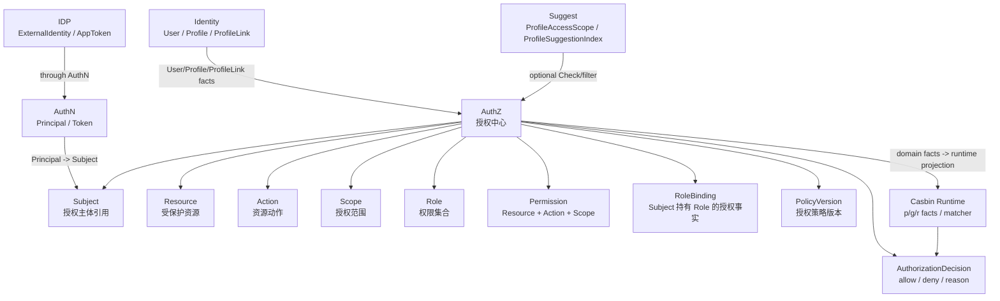

# AuthZ

> 状态：设计目标 · AuthZ 模块入口，已按“模型主文档 + 四条关键链路 + 模块边界 + 代码索引”的结构重写，待继续按源码、契约、配置和测试核对。

---

## 1. 本目录定位

`03-AuthZ/` 是 IAM AuthZ 模块的文档入口。

AuthZ 是 IAM 的授权中心，负责回答：

```text
某个 Subject 在某个授权域下，
能不能对某个 Resource 执行某个 Action，
并满足某个 Scope？
```

AuthZ 维护和产生：

```text
Subject；
Resource；
Action；
Scope；
Role；
Permission；
RoleBinding；
PolicyVersion；
AuthorizationDecision。
```

AuthZ 不负责登录认证、不负责 Token 签发、不负责用户档案写模型、不负责外部身份源配置、不负责 Profile 联想搜索索引。

对应边界：

```text
AuthN 负责 Principal / Credential / Challenge / Session / Token / JWKS；
Identity 负责 User / Profile / ProfileLink；
IDP 负责 ExternalIdentity / provider app / AppToken；
Suggest 负责 ProfileSearchTerm / ProfileAccessScope / ProfileSuggestionIndex；
Casbin 是 infra runtime，不是领域模型。
```

---

## 2. 30 秒结论

AuthZ 可以压缩成一条授权主线：

```text
Subject
  -> RoleBinding
  -> Role
  -> Permission
  -> Resource / Action / Scope
  -> AuthorizationDecision
```

每个对象的职责是：

| 对象 | 一句话 | 不是什么 |
| --- | --- | --- |
| `Subject` | 授权主体引用 | 不是 `User`，也不是 `Principal` |
| `Resource` | 受保护资源 | 不是数据库表，也不是 REST path 本身 |
| `Action` | 资源动作 | 不是 HTTP method 本身 |
| `Scope` | 授权范围 | 不是 `ProfileLink`，也不是 Suggest 的 `ProfileAccessScope` |
| `Permission` | 允许项 | 不是 Role，也不直接绑定 User |
| `Role` | 权限集合 | 不是 Subject，也不是登录身份 |
| `RoleBinding` | 授权绑定事实 | 不是 `ProfileLink` |
| `PolicyVersion` | 授权策略版本 | 不是 Role/Permission/Casbin policy line |
| `AuthorizationDecision` | 授权检查结果 | 不是 Token，也不是长期权限事实 |

最重要的边界：

```text
Principal 不是 Subject；
User 不是 Subject；
ProfileLink 不是 RoleBinding；
Permission 不是 Profile 关系；
Token claims 不替代 AuthZ Check；
ExternalIdentity 不能绕过 AuthN 直接进入 AuthZ；
Suggest ProfileAccessScope 不是 AuthZ Scope；
Casbin p/g/r facts 不是 AuthZ 领域模型。
```

如果只记一句话：

> AuthN 证明“当前请求者是谁”，AuthZ 判断“这个主体能不能对某个资源执行某个动作”。

---

## 3. 文档结构

当前 AuthZ 模块保留 7 篇主文档：

| 文档 | 作用 | 阅读重点 |
| --- | --- | --- |
| [00-模块总览.md](00-模块总览.md) | AuthZ 职责、核心对象、关键链路和模块协作总览 | 建立对 AuthZ 的整体认知 |
| [01-领域模型-Subject-Resource-Action-Scope-Role-Permission-RoleBinding.md](01-领域模型-Subject-Resource-Action-Scope-Role-Permission-RoleBinding.md) | AuthZ 核心模型、模型图、生命周期、状态流转和不变量 | 唯一模型主文档，已合并原“领域模型图”和“生命周期”内容 |
| [02-关键链路-权限检查Check.md](02-关键链路-权限检查Check.md) | Check 读链路：如何从 Principal/route/context 构造授权请求并得到 AuthorizationDecision | `Principal -> Subject`、`Resource/Action/Scope` 构造、DecisionEngine、runtime 边界 |
| [03-关键链路-授权写入Grant-Revoke-Bind-Unbind.md](03-关键链路-授权写入Grant-Revoke-Bind-Unbind.md) | 授权写入链路：Grant/Revoke/Bind/Unbind 如何改变授权事实 | 管理事实、运行时事实、PolicyChange、Committer、PolicyVersion、Outbox |
| [04-关键链路-授权版本传播PolicyVersion-Outbox-RuntimeReload.md](04-关键链路-授权版本传播PolicyVersion-Outbox-RuntimeReload.md) | 授权版本传播链路：授权写入如何最终影响 Check | committed / published / loaded、Outbox、PolicyRelay、RuntimeReload、多实例传播 |
| [05-Casbin运行时模型.md](05-Casbin运行时模型.md) | Casbin runtime：领域事实如何投影为 p/g/r facts 并服务 Check | Casbin 是 infra runtime，不是领域模型 |
| [06-模块边界-AuthZ与AuthN-Identity.md](06-模块边界-AuthZ与AuthN-Identity.md) | AuthZ 与 AuthN、Identity、IDP、Suggest、Casbin runtime 的边界 | 防止 Principal/Subject、User/Subject、ProfileLink/RoleBinding、Token/AuthZ Check 混淆 |
| [07-分层架构与代码索引.md](07-分层架构与代码索引.md) | domain/application/infra/transport/container/contract 代码索引 | 修改代码时的导航入口和 Verify |

注意：

```text
原 02-领域模型图.md 和 03-核心对象生命周期.md 的核心内容已经合并进 01-领域模型-Subject-Resource-Action-Scope-Role-Permission-RoleBinding.md。
后续如果文件仍存在，应考虑删除、归档或改成跳转说明，避免重复维护。
```

---

## 4. AuthZ 模块总图



读图规则：

```text
AuthN 产出 Principal，AuthZ 消费 Subject；
Principal 必须显式映射为 Subject；
Identity 提供 User/Profile/ProfileLink 身份事实；
AuthZ 可以引用这些事实，但不修改这些事实；
IDP 不直接进入 AuthZ，必须先经过 AuthN；
Suggest 可以调用 AuthZ Check 做可见性过滤，但 AuthZ 不维护 Suggest Index；
Casbin runtime 执行策略匹配，但不替代 AuthZ 领域模型。
```

---

## 5. 核心对象

### 5.1 Subject

`Subject` 是授权主体引用。

它回答：

```text
谁在请求访问资源？
这个主体在授权域中如何被引用？
```

关键边界：

```text
Subject 不是 User；
Subject 不是 Principal；
Subject 可以由 Principal.UserID 映射而来；
Subject 不校验 Credential；
Subject 不签发 Token。
```

---

### 5.2 Resource / Action / Scope

| 对象 | 回答的问题 | 边界 |
| --- | --- | --- |
| `Resource` | 主体想访问什么？ | 不是数据库表，也不是 REST path 本身 |
| `Action` | 主体想对资源做什么？ | 不是 HTTP method 本身 |
| `Scope` | 允许在什么范围内访问？ | 不是 ProfileLink，也不是 Suggest ProfileAccessScope |

一次标准授权请求可以表达为：

```text
Check(subject, resource, action, scope, context) -> AuthorizationDecision
```

---

### 5.3 Permission / Role / RoleBinding

| 对象 | 说明 | 边界 |
| --- | --- | --- |
| `Permission` | 允许对 Resource 执行 Action，并受 Scope 约束 | 不直接绑定 User |
| `Role` | Permission 集合 | Role 创建不等于主体获得权限 |
| `RoleBinding` | Subject 持有 Role 的授权事实 | 不是 ProfileLink |

核心关系：

```text
Subject
  -> RoleBinding
  -> Role
  -> Permission
  -> Resource / Action / Scope
```

---

### 5.4 PolicyVersion / AuthorizationDecision

| 对象 | 说明 | 边界 |
| --- | --- | --- |
| `PolicyVersion` | 授权策略发布和 runtime 一致性治理对象 | `published` 不等于 `loaded` |
| `AuthorizationDecision` | 一次 Check 的 allow/deny 结果 | 不是长期权限事实，也不是 Token |

---

## 6. 关键链路

### 6.1 权限检查 Check

Check 是 AuthZ 的核心读链路。

主线：

```text
Principal / route / request context
  -> Subject / Resource / Action / Scope
  -> CheckCommand
  -> AuthorizationRequest
  -> DecisionEngine
  -> Casbin Runtime / Policy Runtime
  -> AuthorizationDecision
```

重点边界：

```text
Check 是读链路，不写授权事实；
Check 不校验 password / otp / token signature；
Principal 不是 Subject；
Token 验签成功不等于 Check allow；
Deny 后必须终止业务用例。
```

详细说明见 [02-关键链路-权限检查Check.md](02-关键链路-权限检查Check.md)。

---

### 6.2 授权写入 Grant / Revoke / Bind / Unbind

授权写入是 AuthZ 的写侧主链路。

主线：

```text
Grant / Revoke / Bind / Unbind
  -> Application Command
  -> PolicyAdministration
  -> AuthorizationPolicy
  -> PolicyChange
  -> Committer
  -> persist management facts
  -> persist runtime facts / policy projection
  -> bump PolicyVersion
  -> write Outbox
  -> runtime reload later
```

重点边界：

```text
授权写入不是简单 CRUD；
授权写入要同时维护管理事实、策略版本和传播事件；
授权写入不做登录认证；
授权写入不创建 ProfileLink；
写入成功不等于 runtime 已加载。
```

详细说明见 [03-关键链路-授权写入Grant-Revoke-Bind-Unbind.md](03-关键链路-授权写入Grant-Revoke-Bind-Unbind.md)。

---

### 6.3 授权版本传播 PolicyVersion / Outbox / RuntimeReload

版本传播负责让运行时授权引擎最终看到新版本。

主线：

```text
PolicyChange committed
  -> PolicyVersion persisted
  -> Outbox event staged
  -> local RuntimeReload optional
  -> PolicyRelay publishes version changed event
  -> consumers reload runtime
  -> loaded PolicyVersion updated
  -> Check uses loaded version
```

重点边界：

```text
committed 不等于 published；
published 不等于 loaded；
loaded 可能只是单实例 loaded；
Outbox 解决双写问题，但不等于消息队列，也不等于 exactly-once；
RuntimeReload 不应放在数据库事务内。
```

详细说明见 [04-关键链路-授权版本传播PolicyVersion-Outbox-RuntimeReload.md](04-关键链路-授权版本传播PolicyVersion-Outbox-RuntimeReload.md)。

---

### 6.4 Casbin 运行时模型

Casbin 是 AuthZ 的 infra runtime engine。

主线：

```text
AuthZ domain facts
  Role / Permission / RoleBinding / PolicyVersion
    -> PolicyLoader / Adapter
    -> Casbin runtime facts
       p = permission projection
       g = role binding projection
       r = check request projection
    -> Enforcer / Matcher
    -> AuthorizationDecision
```

重点边界：

```text
Casbin 是 infra runtime engine，不是 AuthZ 领域模型；
p/g/r facts 是运行时事实，不是业务领域语言；
Role/Permission/RoleBinding/PolicyVersion 才是授权事实源；
transport 和业务代码不应直接访问 Casbin。
```

详细说明见 [05-Casbin运行时模型.md](05-Casbin运行时模型.md)。

---

## 7. 模块边界

| 边界 | 正确理解 | 错误理解 |
| --- | --- | --- |
| `Principal` 与 `Subject` | Principal 可以映射为 Subject | Principal 就是 Subject |
| `User` 与 `Subject` | UserID 可作为 Subject ID | User 就是 Subject |
| `ProfileLink` 与 `RoleBinding` | ProfileLink 是身份关系事实 | ProfileLink 就是 RoleBinding |
| `Permission` 与 Profile 关系 | Permission 是 Resource/Action/Scope 规则 | Permission 是 parent/child 关系 |
| Token claims 与 AuthZ | claims 可提供认证上下文 | claims 替代 AuthZ Check |
| `ExternalIdentity` 与 Subject | ExternalIdentity 先经 AuthN | openid 直接授权 |
| Suggest `ProfileAccessScope` 与 AuthZ `Scope` | 可映射或调用 Check | 两者是同一模型 |
| Casbin p/g/r 与 AuthZ domain | p/g/r 是 runtime projection | p/g/r 是领域模型 |

详细说明见 [06-模块边界-AuthZ与AuthN-Identity.md](06-模块边界-AuthZ与AuthN-Identity.md)。

---

## 8. 分层架构

AuthZ 代码按以下分层维护：

```text
transport/rest + transport/grpc
  -> application/authz
  -> domain/authz
  -> infra/repository + policy runtime + outbox relay
  -> container/authz
  -> api/rest + api/grpc + pkg/sdk
```

| 层 | 职责 |
| --- | --- |
| domain | 定义 Subject / Resource / Action / Scope / Role / Permission / RoleBinding / PolicyVersion / AuthorizationDecision |
| application | 编排 Check / Grant / Revoke / Bind / Unbind / PolicyVersion / Outbox / RuntimeReload |
| infra | 实现 repository、Casbin runtime、policy loader、policy adapter、outbox store/relay、runtime snapshot |
| transport | 适配 REST/gRPC 请求、响应、RouteAuthorizer、middleware 和 interceptor |
| container | 装配 AuthZ 模块依赖和跨模块 port |
| contract | 约束 REST/gRPC/SDK 对外接入语义 |

详细代码索引见 [07-分层架构与代码索引.md](07-分层架构与代码索引.md)。

---

## 9. 推荐阅读路径

### 9.1 新读者

```text
00-模块总览.md
  -> 01-领域模型-Subject-Resource-Action-Scope-Role-Permission-RoleBinding.md
  -> 06-模块边界-AuthZ与AuthN-Identity.md
```

目标：先理解 AuthZ 是什么，以及它不是什么。

---

### 9.2 准备修改权限检查

```text
02-关键链路-权限检查Check.md
  -> 01-领域模型-Subject-Resource-Action-Scope-Role-Permission-RoleBinding.md
  -> 05-Casbin运行时模型.md
  -> 07-分层架构与代码索引.md
```

目标：理解 Principal 如何映射为 Subject，Resource/Action/Scope 如何进入 runtime，并如何得到 AuthorizationDecision。

---

### 9.3 准备修改授权写入

```text
03-关键链路-授权写入Grant-Revoke-Bind-Unbind.md
  -> 01-领域模型-Subject-Resource-Action-Scope-Role-Permission-RoleBinding.md
  -> 04-关键链路-授权版本传播PolicyVersion-Outbox-RuntimeReload.md
  -> 07-分层架构与代码索引.md
```

目标：明确 Grant/Revoke/Bind/Unbind 如何改变授权事实，并如何触发 PolicyVersion 和 Outbox。

---

### 9.4 准备修改策略传播

```text
04-关键链路-授权版本传播PolicyVersion-Outbox-RuntimeReload.md
  -> 05-Casbin运行时模型.md
  -> 07-分层架构与代码索引.md
```

目标：理解 committed / published / loaded 的差异，以及 Outbox、PolicyRelay、RuntimeReload 如何协作。

---

### 9.5 准备修改 Casbin matcher

```text
05-Casbin运行时模型.md
  -> 02-关键链路-权限检查Check.md
  -> 04-关键链路-授权版本传播PolicyVersion-Outbox-RuntimeReload.md
  -> 07-分层架构与代码索引.md
```

目标：理解 p/g/r facts、model.conf、matcher、自定义函数、loaded version 和 runtime reload 边界。

---

### 9.6 准备排查认证与授权混淆

```text
06-模块边界-AuthZ与AuthN-Identity.md
  -> ../02-AuthN/07-模块边界-AuthN与Identity-IDP-AuthZ.md
  -> ../../04-架构护栏/01-分层依赖边界.md
```

目标：确认 AuthZ 是否只做授权，不做认证和登录态治理。

---

## 10. 代码事实源

| 事实 | 路径 |
| --- | --- |
| AuthZ domain | `../../../internal/apiserver/domain/authz` |
| Subject / Resource / Action / Scope | `../../../internal/apiserver/domain/authz` |
| Role / Permission / RoleBinding | `../../../internal/apiserver/domain/authz` |
| AuthorizationRequest / AuthorizationDecision | `../../../internal/apiserver/domain/authz` |
| PolicyVersion / PolicyChange | `../../../internal/apiserver/domain/authz` |
| AuthZ application | `../../../internal/apiserver/application/authz` |
| AuthZ checker / DecisionEngine | `../../../internal/apiserver/application/authz` |
| PolicyVersion / Outbox / runtime reload | `../../../internal/apiserver/application/authz`、`../../../internal/apiserver/infra`，具体以代码为准 |
| Casbin runtime / PolicyRuntime adapter | `../../../internal/apiserver/infra` |
| AuthZ REST transport | `../../../internal/apiserver/transport/rest` |
| AuthZ gRPC transport | `../../../internal/apiserver/transport/grpc` |
| AuthZ container | `../../../internal/apiserver/container/authz` |
| REST 契约 | `../../../api/rest` |
| gRPC 契约 | `../../../api/grpc` |
| 架构测试 | `../../../internal/pkg/architecture` |

注意：上表中的具体路径需要继续与当前源码核对。如果源码目录已调整，应以代码为准并同步更新本文。

---

## 11. 常见反模式

| 反模式 | 问题 | 推荐做法 |
| --- | --- | --- |
| Subject 当 User | 授权主体引用和身份实体混淆 | Subject 由 UserID/Principal 映射而来 |
| Principal 当 Subject | 认证结果和授权主体混淆 | 显式 Principal -> Subject 映射 |
| ProfileLink 当 RoleBinding | 身份关系和授权事实混淆 | ProfileLink 归 Identity，RoleBinding 归 AuthZ |
| Permission 写成 Profile 关系 | 授权规则和身份关系混淆 | ProfileLink 作为 Scope/condition 输入 |
| Token claims 替代 Check | 认证凭证和授权决策混淆 | Token 验签后继续 AuthZ Check |
| AuthZ 校验 password/otp | AuthZ 吞并 AuthN | Credential/Challenge 校验归 AuthN |
| handler 直接调用 Casbin | 绕过 application 和 DecisionEngine | 统一走 AuthZ Checker |
| Casbin p/g 当领域事实源 | infra runtime 吞并领域 | Role/Permission/RoleBinding 是事实源 |
| Check 自动 Grant | 读链路提权风险 | 授权写入必须显式调用 |
| Outbox 失败仍返回授权已生效 | 策略传播状态不实 | 区分 committed/published/loaded |

---

## 12. Verify

修改本目录文档后至少执行：

```bash
make docs-hygiene
```

涉及 AuthZ 领域模型：

```bash
go test ./internal/apiserver/domain/authz/...
```

涉及 AuthZ 用例编排：

```bash
go test ./internal/apiserver/application/authz/...
```

涉及 infra repository / Casbin runtime / Outbox：

```bash
go test ./internal/apiserver/infra/...
```

如果实际 infra 测试路径更细，以当前代码为准，例如：

```bash
go test ./internal/apiserver/infra/casbin/...
go test ./internal/apiserver/infra/mysql/policy/...
go test ./internal/apiserver/infra/mysql/resource/...
go test ./internal/apiserver/infra/mysql/role/...
go test ./internal/apiserver/infra/mysql/rolebinding/...
go test ./internal/apiserver/infra/mysql/casbinrule/...
```

涉及 AuthN / Identity / IDP / Suggest 边界：

```bash
go test ./internal/apiserver/domain/authn/...
go test ./internal/apiserver/domain/identity/...
go test ./internal/apiserver/domain/idp/...
go test ./internal/apiserver/domain/suggest/...
```

涉及 REST/gRPC 契约或 transport：

```bash
make api-validate
make proto-gen
go test ./internal/apiserver/transport/rest/...
go test ./internal/apiserver/transport/grpc/...
```

涉及 SDK：

```bash
go test ./pkg/sdk/...
```

涉及分层依赖或模块边界：

```bash
go test ./internal/pkg/architecture
```

---

## 13. 本目录总结

AuthZ 模块的主线是：

```text
Subject
  -> RoleBinding
  -> Role
  -> Permission
  -> Resource / Action / Scope
  -> AuthorizationDecision
```

AuthZ 的核心职责是：

```text
建模授权主体、资源、动作和范围；
维护 Role、Permission、RoleBinding 等授权事实；
执行权限检查并返回 AuthorizationDecision；
通过 PolicyVersion、Outbox 和 RuntimeReload 治理策略传播；
通过 Casbin runtime adapter 支撑高效运行时检查。
```

AuthZ 的核心边界是：

```text
不做登录认证；
不校验 Credential / Challenge；
不签发 Token；
不维护 User/Profile/ProfileLink 写模型；
不管理 IDP 外部身份源；
不维护 Suggest 搜索索引；
不把 Casbin runtime 写成领域事实源；
不把 Token 验签成功写成授权通过。
```

读完本目录后，应能清楚说明 AuthZ 的模型、链路、边界和代码入口，并能在修改代码时避免把 AuthN、Identity、IDP、Suggest、Casbin runtime 的职责混入 AuthZ。
