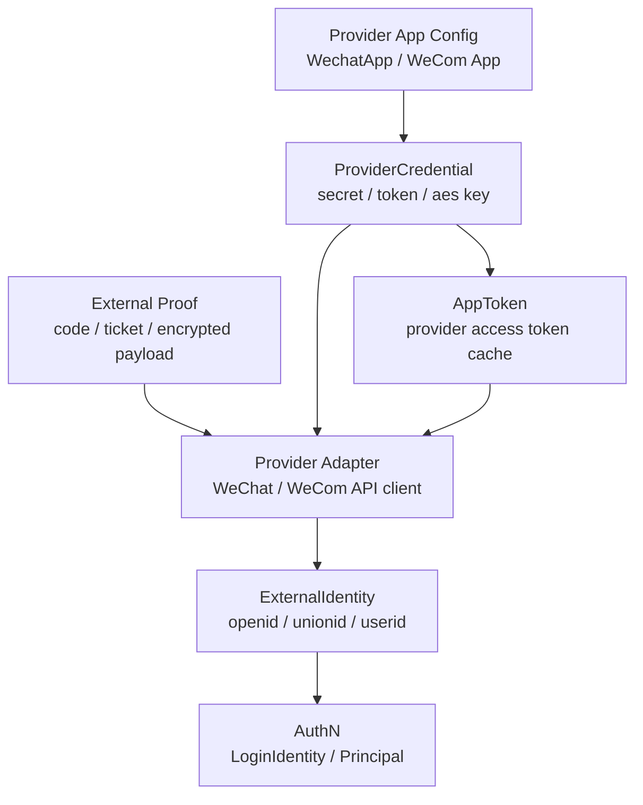

# IDP 模块总览

> 状态：待补证据 · 第一版正文，待继续按 `internal/apiserver/domain/idp`、`application/idp`、微信/企微 provider adapter、AppToken 缓存、REST/gRPC 契约和测试逐项核对。

---

## 1. 本文回答

本文回答 8 个问题：

- IDP 模块在 IAM 中负责什么？
- IDP 为什么是“外部身份源基础设施”，而不是“认证中心”或“授权中心”？
- 当前代码为什么以 `WechatApp` 为主模型？
- `ProviderApp`、`WechatApp`、`ProviderCredential`、`AppToken`、`ExternalIdentity` 分别表达什么？
- IDP 如何为 AuthN 的微信 / 企微登录提供外部身份解析能力？
- IDP 如何管理外部 provider app metadata、secret、message key、access token 缓存？
- IDP 与 AuthN、Identity、AuthZ、Suggest 的边界在哪里？
- 阅读 IDP 代码和后续文档应该从哪里进入？

本文是 IDP 模块入口，只做总览。后续细节应拆到领域模型、微信应用配置、AppToken 生命周期、外部身份解析、模块边界和代码索引文档中。

---

## 2. 30 秒结论

IDP 是 IAM 的**外部身份源基础设施模块**。

它只回答一个核心问题：

```text
IAM 如何安全、稳定、可治理地接入外部身份提供方，
并把外部 provider 的 app、secret、token、identity claim，
转换成 AuthN 可以使用的外部身份事实？
```

IDP 的核心主线可以压缩成：

```text
ProviderApp / WechatApp
  -> ProviderCredential
  -> AppToken
  -> ExternalIdentity
  -> AuthN LoginIdentity / Principal
```

IDP 不负责：

```text
IAM 登录认证结果；
Session / AccessToken / RefreshToken / JWKS；
User / Profile / ProfileLink 写模型；
Role / Permission / RoleBinding / Check；
Profile 联想搜索索引；
业务资源访问判定。
```

如果只记一句话：

> IDP 管外部身份源和外部 provider 凭证，AuthN 才负责把外部身份解析结果变成 IAM 的登录身份和认证结果。

---

## 3. 模块定位

IDP 是外部身份源基础设施模块。

它负责管理和封装：

| 问题 | IDP 的回答 |
| --- | --- |
| IAM 接入了哪些外部 provider app？ | `ProviderApp` / `WechatApp` |
| 外部 app 的 appid、secret、消息密钥如何保存和轮换？ | `ProviderCredential` |
| 调用外部 provider API 需要的 access token 如何获取、缓存和刷新？ | `AppToken` |
| 微信 code、企微 code、provider ticket 如何解析？ | provider adapter / resolver |
| 外部 provider 返回的 openid、unionid、userid 如何表达？ | `ExternalIdentity` |
| 外部身份如何交给 AuthN？ | AuthN 消费 `ExternalIdentity`，再映射或绑定 `LoginIdentity` |

IDP 是外部身份源接入层，不是 IAM 登录态中心，也不是用户中心。

---

## 4. IDP 主线图



读图规则：

```text
ProviderApp / WechatApp 描述外部应用元数据；
ProviderCredential 描述调用外部 provider 所需的敏感凭据；
AppToken 是外部 provider access token，不是 IAM AccessToken；
ExternalIdentity 是外部身份声明，不是 IAM User，也不是 LoginIdentity；
AuthN 决定 ExternalIdentity 如何映射或绑定为 LoginIdentity；
IDP 不签发 IAM Token。
```

---

## 5. 核心对象

### 5.1 ProviderApp / WechatApp

`ProviderApp` 是外部身份源应用的抽象。

当前代码中的 IDP 主模型以 `WechatApp` 为中心。

`WechatApp` 用于表达微信生态中的应用元数据，例如：

```text
小程序 appid；
公众号 appid；
开放平台网站应用 appid；
企业微信 corp/app 配置；
应用名称；
应用类型；
状态；
回调配置；
消息加解密配置引用。
```

具体字段以当前 IDP domain、迁移和契约为准。

关键边界：

```text
WechatApp 是外部 provider app 配置；
WechatApp 不是 User；
WechatApp 不是 LoginIdentity；
WechatApp 不表达登录成功；
WechatApp 不表达授权权限。
```

---

### 5.2 ProviderCredential

`ProviderCredential` 是外部 provider app 的敏感凭据。

它可以包括：

```text
app secret；
token；
encoding aes key；
corp secret；
private key，若 provider 需要；
credential version；
rotation metadata。
```

关键边界：

```text
ProviderCredential 不应明文泄露到 response；
ProviderCredential 不等于 IAM Credential；
ProviderCredential 不用于校验 IAM 用户密码；
ProviderCredential 不应被 AuthN 直接当作 LoginIdentity 凭据；
ProviderCredential 只服务 provider API 调用和消息验签/解密。
```

---

### 5.3 AppToken

`AppToken` 是外部 provider 的应用访问令牌。

典型例子：

```text
微信 access_token；
企业微信 access_token；
外部 provider app-level token。
```

它用于：

```text
调用外部 provider API；
拉取用户信息；
换取外部身份声明；
验证外部消息或 ticket，具体以 provider API 为准。
```

关键边界：

```text
AppToken 是 provider token；
AppToken 不是 IAM AccessToken；
AppToken 不是 IAM RefreshToken；
AppToken 不能访问 IAM API；
AppToken 不代表 IAM 用户已登录；
AppToken 的缓存、过期、刷新归 IDP 管理。
```

---

### 5.4 ExternalIdentity

`ExternalIdentity` 是外部 provider 返回的身份声明。

典型字段：

```text
provider；
appID；
openid；
unionid；
wecomUserID；
externalUserID；
raw claims；
resolvedAt。
```

具体字段以当前代码和 provider 能力为准。

关键边界：

```text
ExternalIdentity 不是 IAM User；
ExternalIdentity 不是 LoginIdentity；
ExternalIdentity 不是 Principal；
ExternalIdentity 不是 Subject；
ExternalIdentity 不直接表达权限；
ExternalIdentity 需要交给 AuthN，由 AuthN 决定登录、注册、绑定或拒绝。
```

---

## 6. 关键链路

### 6.1 外部应用配置链路

外部应用配置用于让 IAM 知道如何接入一个 provider app。

主线：

```text
create/update ProviderApp or WechatApp
  -> store app metadata
  -> store encrypted ProviderCredential
  -> validate callback/message config
  -> enable provider app
```

重点边界：

```text
配置 provider app 不等于创建 IAM 用户；
配置 provider app 不等于启用某个登录身份；
配置 provider app 不等于签发 IAM Token；
secret/message key 不应明文返回。
```

---

### 6.2 AppToken 获取与缓存链路

外部 provider API 通常需要 app-level access token。

主线：

```text
load ProviderApp / Credential
  -> check cached AppToken
  -> if valid return cached token
  -> if expired acquire provider token
  -> cache token with TTL / refresh margin
  -> return AppToken to provider adapter
```

重点边界：

```text
AppToken 只用于调用外部 provider API；
AppToken 不是 IAM AccessToken；
AppToken 缓存失败不应泄露 secret；
并发刷新需要 singleflight/lock，避免击穿 provider API。
```

---

### 6.3 外部身份解析链路

外部身份解析用于把 provider proof 转成 ExternalIdentity。

主线：

```text
provider proof(code/ticket/encrypted payload)
  -> resolve ProviderApp
  -> load ProviderCredential / AppToken
  -> call provider API or verify payload
  -> build ExternalIdentity
  -> return to AuthN
```

重点边界：

```text
IDP 只解析外部身份事实；
IDP 不创建 LoginIdentity；
IDP 不创建 User；
IDP 不创建 Principal；
IDP 不签发 IAM Token；
AuthN 决定 ExternalIdentity 的后续处理。
```

---

### 6.4 Provider 消息验签 / 解密链路

微信/企微等 provider 可能需要消息验签、解密、ticket 处理。

主线：

```text
incoming provider callback
  -> resolve ProviderApp
  -> load ProviderCredential
  -> verify signature
  -> decrypt payload if needed
  -> parse provider event/ticket
  -> update credential/app token cache or emit event
```

重点边界：

```text
消息验签证明消息来自 provider；
消息验签不等于 IAM 用户登录；
provider ticket 不是 IAM Token；
callback 处理不应直接写 RoleBinding 或 User/ProfileLink。
```

---

## 7. 与其他模块的边界

### 7.1 与 AuthN

AuthN 负责认证结果，IDP 负责外部身份源解析。

```text
IDP -> ExternalIdentity
AuthN -> LoginIdentity / Principal / Session / Token
```

协作链路：

```text
wechat code
  -> IDP ResolveExternalIdentity
  -> ExternalIdentity(openid/unionid/appid)
  -> AuthN find or bind LoginIdentity
  -> AuthN build Principal
  -> AuthN create Session / Token
```

关键边界：

```text
ExternalIdentity 不是 LoginIdentity；
IDP 不创建 Principal；
IDP 不签发 IAM AccessToken；
IDP AppToken 不是 IAM AccessToken；
AuthN 不应直接管理 provider app secret；
AuthN 可以通过 IDP port 解析外部身份。
```

---

### 7.2 与 Identity

Identity 负责 IAM 内部身份事实。

IDP 不负责：

```text
创建 User；
创建 Profile；
创建 ProfileLink；
维护监护关系；
维护用户档案。
```

IDP 可以提供：

```text
ExternalIdentity；
provider nickname/avatar 等外部 claims，是否使用由 AuthN/Identity 用例决定；
provider app metadata。
```

关键边界：

```text
openid 不是 UserID；
unionid 不是 UserID；
wecom userid 不是 Staff/User 本体；
外部 claims 不能直接覆盖 Identity 主数据，除非有明确同步用例。
```

---

### 7.3 与 AuthZ

AuthZ 负责授权。

IDP 不负责：

```text
Subject；
Role；
Permission；
RoleBinding；
PolicyVersion；
AuthorizationDecision；
Casbin policy。
```

关键边界：

```text
ExternalIdentity 不是 Subject；
openid 不能直接授权；
IDP AppToken 不是授权凭证；
外部身份必须先经过 AuthN 成为 Principal，再映射为 AuthZ Subject；
IDP 不创建 RoleBinding。
```

---

### 7.4 与 Suggest

Suggest 负责 Profile 联想搜索读模型。

IDP 不负责：

```text
ProfileSearchTerm；
ProfileAccessScope；
Snapshot；
搜索可见性过滤。
```

可能协作：

```text
外部 provider nickname/avatar 等 claims 经 Identity 确认后，可能影响 Profile 展示或搜索字段；
但这种同步必须通过明确 Identity/Suggest 用例，不应由 IDP 直接写 Suggest index。
```

---

## 8. 分层架构入口

IDP 模块应遵循 IAM 通用分层：

```text
transport/rest + transport/grpc
  -> application/idp
  -> domain/idp
  -> infra/provider-adapter + token-cache + credential-store
  -> container/idp
  -> api/rest + api/grpc + pkg/sdk
```

各层职责：

| 层 | 职责 |
| --- | --- |
| domain | 定义 ProviderApp / WechatApp / ProviderCredential / AppToken / ExternalIdentity 等模型和不变量 |
| application | 编排 app 配置、credential 管理、AppToken 获取缓存、ExternalIdentity 解析等用例 |
| infra | 实现微信/企微 API adapter、credential 加解密、token cache、repository、callback verifier |
| transport | 适配 REST/gRPC 请求、provider callback、DTO 和错误映射 |
| container | 装配 IDP repository、provider adapter、token cache、service、handler |
| contract | 约束 REST/gRPC/SDK 对外接入语义 |

---

## 9. 推荐阅读路径

### 9.1 新读者

```text
00-模块总览.md
  -> 01-领域模型-ProviderApp-WechatApp-Credential-AppToken-ExternalIdentity.md
  -> 05-模块边界-IDP与AuthN-Identity.md
```

目标：先理解 IDP 是什么，以及它不是什么。

---

### 9.2 准备接入新的外部 provider

```text
01-领域模型-ProviderApp-WechatApp-Credential-AppToken-ExternalIdentity.md
  -> 02-关键链路-外部应用配置.md
  -> 03-关键链路-AppToken获取与缓存.md
  -> 04-关键链路-ExternalIdentity解析.md
  -> 06-分层架构与代码索引.md
```

目标：明确新增 provider 时要改 ProviderApp、Credential、AppToken、provider adapter、ExternalIdentity resolver 还是 AuthN 登录策略。

---

### 9.3 准备实现微信 / 企微登录

```text
04-关键链路-ExternalIdentity解析.md
  -> ../02-AuthN/04-关键链路-Login登录认证.md
  -> ../02-AuthN/03-关键链路-Linking登录身份绑定.md
  -> ../02-AuthN/02-关键链路-Onboarding身份开通.md
```

目标：理解 IDP 只负责解析外部身份，AuthN 负责登录、绑定、开通和 Token。

---

### 9.4 准备排查 AppToken 问题

```text
03-关键链路-AppToken获取与缓存.md
  -> 06-分层架构与代码索引.md
```

目标：理解 provider access token 的缓存、过期、刷新、并发控制和失败边界。

---

## 10. 常见反模式

| 反模式 | 问题 | 推荐做法 |
| --- | --- | --- |
| IDP 直接创建 User | IDP 吞并 Identity/AuthN | IDP 返回 ExternalIdentity，由 AuthN/Identity 用例处理 |
| IDP 直接创建 LoginIdentity | IDP 吞并 AuthN | AuthN 根据 ExternalIdentity 决定绑定或登录 |
| IDP 签发 IAM Token | 外部身份源和认证中心混淆 | Token 签发归 AuthN |
| AppToken 当 IAM AccessToken | provider token 和 IAM token 混淆 | AppToken 只用于 provider API |
| openid 当 UserID | 外部标识和内部身份混淆 | openid 进入 ExternalIdentity，再由 AuthN 映射 LoginIdentity |
| ProviderCredential 明文返回 | 凭据泄露 | secret/message key 只加密保存和内部使用 |
| AuthN 直接管理 provider secret | 模块边界漂移 | AuthN 通过 IDP port 解析外部身份 |
| IDP 直接写 RoleBinding | IDP 吞并 AuthZ | 授权归 AuthZ |
| Provider callback 直接修改业务档案 | 外部事件越权污染主数据 | 通过明确 application 用例和审计处理 |
| AppToken 并发刷新无控制 | 击穿 provider API 或缓存抖动 | 使用 TTL、refresh margin、singleflight/lock |

---

## 11. 事实源

本文是 IDP 总览，不是机器契约。

当本文与代码、契约、测试冲突时，按以下优先级判断：

1. 源码与运行时行为。
2. 机器可读契约与配置：OpenAPI、proto、配置、迁移。
3. 测试：领域测试、应用测试、契约测试、架构测试、SDK compile test。
4. 现行维护中的 `docs/`。
5. `_archive/` 历史材料。

当前主要事实源：

| 事实 | 路径 |
| --- | --- |
| IDP domain | `../../../internal/apiserver/domain/idp` |
| WechatApp / ProviderApp | `../../../internal/apiserver/domain/idp` |
| ProviderCredential | `../../../internal/apiserver/domain/idp` |
| AppToken | `../../../internal/apiserver/domain/idp`、`../../../internal/apiserver/application/idp`，具体以代码为准 |
| ExternalIdentity | `../../../internal/apiserver/domain/idp` |
| IDP application | `../../../internal/apiserver/application/idp` |
| Provider adapter | `../../../internal/apiserver/infra` |
| Token cache / credential store | `../../../internal/apiserver/infra` |
| IDP REST transport | `../../../internal/apiserver/transport/rest` |
| IDP gRPC transport | `../../../internal/apiserver/transport/grpc` |
| IDP container | `../../../internal/apiserver/container/idp` |
| REST 契约 | `../../../api/rest` |
| gRPC 契约 | `../../../api/grpc` |
| 架构测试 | `../../../internal/pkg/architecture` |

注意：上表中的具体路径需要继续与当前源码核对。如果源码目录已调整，应以代码为准并同步更新本文。

---

## 12. Verify

修改本文后至少执行：

```bash
make docs-hygiene
```

涉及 IDP 领域模型：

```bash
go test ./internal/apiserver/domain/idp/...
```

涉及 IDP 应用用例：

```bash
go test ./internal/apiserver/application/idp/...
```

涉及 provider adapter、credential store、token cache：

```bash
go test ./internal/apiserver/infra/...
```

具体路径以当前代码为准。

涉及 AuthN/Identity/AuthZ/Suggest 边界：

```bash
go test ./internal/apiserver/domain/authn/...
go test ./internal/apiserver/domain/identity/...
go test ./internal/apiserver/domain/authz/...
go test ./internal/apiserver/domain/suggest/...
```

涉及 REST/gRPC 契约或 transport：

```bash
make api-validate
make proto-gen
go test ./internal/apiserver/transport/rest/...
go test ./internal/apiserver/transport/grpc/...
```

涉及 SDK：

```bash
go test ./pkg/sdk/...
```

涉及分层依赖或模块边界：

```bash
go test ./internal/pkg/architecture
```

---

## 13. 本文总结

IDP 模块的主线是：

```text
ProviderApp / WechatApp
  -> ProviderCredential
  -> AppToken
  -> ExternalIdentity
  -> AuthN LoginIdentity / Principal
```

IDP 的核心职责是：

```text
维护外部 provider app 元数据；
安全保存和使用 provider credential；
获取、缓存和刷新 provider AppToken；
通过 provider adapter 解析外部身份声明；
把 ExternalIdentity 交给 AuthN 使用。
```

IDP 的核心边界是：

```text
不做 IAM 登录认证；
不创建 LoginIdentity；
不创建 User/Profile/ProfileLink；
不签发 IAM AccessToken / RefreshToken；
不做 Role/Permission/RoleBinding/Check；
不维护 Suggest 搜索索引；
不把 provider AppToken 当成 IAM Token；
不把 openid/unionid/wecom userid 当成 IAM UserID。
```

读完本文后，应继续编写并阅读 IDP 的领域模型文档，把 `ProviderApp / WechatApp / ProviderCredential / AppToken / ExternalIdentity` 的模型和生命周期讲清楚。
