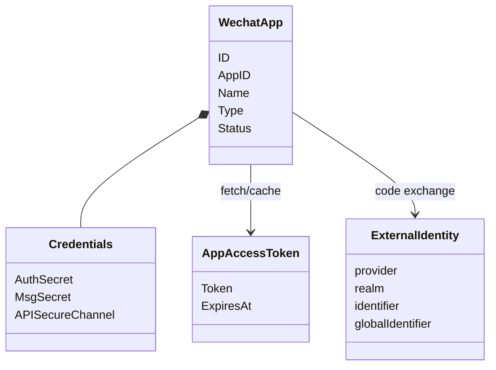
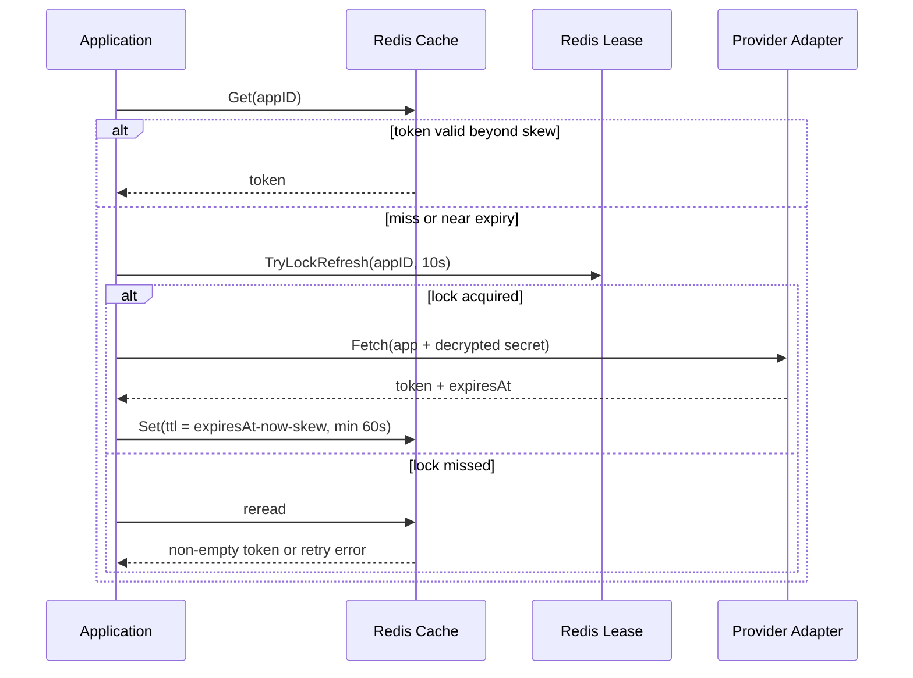

# IDP 模块总览

> 状态：已实现 · 本文统一解释外部应用配置、凭据保护、Provider AppToken、外部身份解析以及与 AuthN 的信任边界。

## 1. IDP 在 IAM 中的定位

IDP 不是“微信登录模块”。它是 IAM 与外部身份提供者之间的防腐层，当前实现以微信生态为主，负责：

1. 管理 IAM 调用 provider 所需的应用配置与密钥；
2. 获取并缓存 provider 的 AppAccessToken；
3. 把小程序/开放平台/企业微信 code 解析成外部身份；
4. 向 AuthN 提供窄端口，不替 AuthN 决定 Login、Linking 或 SignUp。

主线：

```text
ProviderApp + protected credentials
  -> provider API proof exchange
  -> ExternalIdentity(openid/unionid/userid)
  -> AuthN ProviderKey
  -> Login / Linking / SignUp
```

IDP 不创建 IAM User，不创建 Session，不签发 IAM Token，也不执行资源授权。

## 2. 三种“凭据/令牌”不能混淆

| 概念 | 控制者 | 用途 | 生命周期 |
| --- | --- | --- | --- |
| AppSecret / CorpSecret | IAM 服务端与 provider 应用 | 证明 IAM 有权调用 provider API | 长期、需轮换 |
| Provider AppAccessToken | provider 签发给应用 | 调用微信/公众号 API | 短期、缓存 |
| IAM Credential | 终端用户 | 证明用户控制 LoginIdentity | 长期或一次性策略 |
| IAM AccessToken | IAM 签发给主体 | 访问业务服务 | 短期 |

同样叫 secret/token，不代表安全边界相同。AppAccessToken 泄露意味着攻击者可代表应用调用 provider；IAM AccessToken 泄露意味着可代表某主体访问业务。它们的缓存 key、审计、撤销和暴露接口都应独立治理。

## 3. 领域对象



### WechatApp

`AppID` 是 provider 应用标识并在 MySQL 唯一；Type 当前约定为 `MiniProgram`、`MP`、`OpenPlatformWebsite`；Status 为 enabled/disabled/archived。创建默认 enabled。`AppType.IsValid` 虽然存在，但当前 Creator 只拒绝空 Type，Update 也会直接赋值；协议映射会收紧常规入口，领域/应用层本身仍缺少统一枚举校验，这是需要补强的不变量。

Type 是安全边界：开放平台扫码登录必须使用 `OpenPlatformWebsite` 配置，不能把公众号或小程序 AppSecret 误用于另一种 OAuth surface。

### Credentials

- AuthSecret：AppSecret 密文、SHA-256 fingerprint、version、last rotated time；
- MsgSecret：callback token、EncodingAESKey 密文、version；
- APISecureChannel：对称/非对称 API 安全模型占位。

当前 MySQL PO 只持久化 AuthSecret 与 MsgSecret；`RotateAPISymKey`、`RotateAPIAsymKey` 返回 nil 但不修改实体，是未实现占位，不应对外宣称可用。

### AppAccessToken

只包含 token 和 ExpiresAt。`IsValid(now, skew)` 要求 `now + skew < expiresAt`，用于提前刷新，避免刚取出就过期。

### ExternalIdentity

当前没有独立持久化实体；provider proof 返回 openid/unionid/userid 后，由 AuthN 在单次请求内构造 LoginIdentity ProviderKey。外部标识在绑定到 LoginIdentity 之前不是 IAM User。

## 4. 应用配置与凭据轮换

```text
CreateApp
  -> validate AppID/Name/Type
  -> create enabled entity
  -> optional RotateAuthSecret
  -> repository.Create
```

`RotateAuthSecret`：

1. 读取应用；
2. 确保 Credentials 容器存在；
3. 拒绝 archived 应用；
4. 用 fingerprint 判断相同明文，幂等返回；
5. SecretVault 加密；
6. 单槽覆盖 cipher/fingerprint，version++；
7. repository.Update。

### 当前轮换语义的限制

当前是 single-slot replace：

- 没有 previous secret；
- 没有双凭据宽限窗口；
- 没有按 credential version 划分 AppToken cache key；
- 轮换成功后不主动删除 AppAccessToken 或微信 SDK 内部缓存；
- 更新不是独立 UoW + outbox。

因此 provider 新旧 secret 切换不是零停机协议。若 provider 侧先切、IAM 后切，间隙内请求会失败；若 IAM 先切而 provider 尚未生效，同样失败。更完整的设计需双槽、active version、验证切换和 cache invalidation 事件。

## 5. SecretVault 的真实边界

当前 `infra/crypto/secret_vault.go` 使用本地 AES-256-GCM：

```text
32-byte master key
random nonce
ciphertext = nonce || GCM ciphertext+tag
```

它提供静态数据机密性与完整性，但不是 KMS：

- master key 由进程配置提供，不具备托管轮换/version；
- 没有细粒度密钥访问审计；
- `Sign` 未实现；
- 明文会短暂存在进程内存；
- 更换 master key 需要数据重加密方案。

加密不是授权。即使数据库只存密文，能够调用 SecretVault.Decrypt 的服务路径仍可能暴露明文。

## 6. AppAccessToken 读穿缓存



设计目的：Redis 让多实例共享 token，lease 防 provider 被并发刷新击穿，skew 留出网络和时钟余量。

当前精确边界：

- 初次 Get 失败被 `IgnoreGetError` 忽略，会尝试 provider；
- lock holder 调 provider 并写 cache；
- lock loser reread 只检查 token 非空，没有重新按 skew/ExpiresAt 验证；
- cache TTL 最少 60 秒，即使计算的安全 TTL 更短；
- `RefreshAccessToken` 强制 fetch 不争 lease，多个管理员调用可能并发刷新；
- SDK 自身还有 `WechatSDKCache`，与 domain AccessTokenCache 是两层缓存。

因此当前能防大多数缓存击穿，但不能声称严格 singleflight 或绝不返回临近过期 token。

## 7. 外部身份解析与信任链

以微信小程序 SignUp 为例：

```text
public appID + jsCode
  -> server loads enabled WechatApp
  -> server decrypts AppSecret
  -> code2session(appID, secret, code)
  -> openid/unionid
  -> AuthN ProviderKey(wechat_minip, appID, openid, unionid)
```

可信根不是调用方给出的 openid，而是 provider API 对短期 code 的响应。openid 只在 appID realm 内唯一；unionid 可能为空，且只有满足 provider 条件时才能跨应用关联。

企业微信 userid 也只在 corp realm 内有意义。任何外部 ID 都不应直接当 `UserID`、`SubjectID` 或数据库主键。

## 8. IDP 与 AuthN 的协作

IDP 返回“外部证明解析结果”，AuthN 决定：

- Login：ProviderKey 必须已存在，认证后签发 Session/token；
- Linking：当前 Principal 的 UserID 绑定新 ProviderKey；
- SignUp：确保 User 与 LoginIdentity，必要时创建 Credential；
- Conflict：ProviderKey 已属于其他 User 时拒绝，不自动合并账户。

外部请求发生在本地事务外；prepared identity 只在当前请求中流转。这样避免长事务，但 provider proof 与 commit 之间仍有时间窗口。一次性 code 已被 provider 消费可降低重放；更高安全场景还应保存 proof id/nonce 的本地幂等记录。

## 9. 暴露面与当前高风险事实

REST 管理路由只有在 AdminMiddlewares 可用时注册；健康端点可独立存在。gRPC `IDPService` 当前提供：

- `GetWechatApp`；
- `GetWechatAccessToken`；
- `RefreshWechatAccessToken`。

当前 gRPC `GetWechatApp` 会解密并返回 `app_secret`，另外两个 RPC 返回 provider access token。这是高敏感契约，安全性依赖 gRPC 传输认证、网络边界和调用方授权；不能把“数据库里加密”当成端到端不暴露。任何网关/日志/调试代理都不得记录响应体。

更稳妥的替代是：

- 普通查询只返回 metadata/fingerprint/version；
- 内部消费者通过窄能力 RPC 完成 code exchange，而不获取 secret；
- 若确需 secret export，使用单独高权限、强审计、短期审批的接口。

当前代码尚未做此契约收缩，所以本文把它列为真实风险而非已完成改造。

## 10. 失败语义

| 场景 | 当前结果 |
| --- | --- |
| 应用不存在/disabled/type mismatch | proof/login/linking 失败 |
| SecretVault 解密失败 | 不调用 provider，错误返回 |
| provider code exchange 失败 | 不创建/绑定 LoginIdentity |
| cache read 失败 | 尝试 lease/provider，非直接失败 |
| lease 未获取且 reread 无 token | 返回 refresh in progress |
| provider fetch 成功但 cache set 失败 | 整次请求失败，不返回已获取 token |
| credential repository update 失败 | 轮换失败；内存实体已改但请求结束后以 DB 为准 |
| AppSecret 轮换后旧 cache 尚存 | 可能暂时继续返回旧 AppAccessToken |

## 11. 方案演化

### 从直接在 AuthN 配置 secret 到独立 IDP 模块

拆分后，同一 app 配置可被 Login、Linking、SignUp 和 token service 复用；AuthN 不再知道密文格式和微信 SDK。但当前 IDP 仍以 WechatApp 命名，若接入更多 provider，应抽象 ProviderApp/ProviderCredential，同时避免为了抽象而丢失微信特有语义。

### 从本地 AES-GCM 到 KMS/HSM

KMS 可以提供 master key 托管、访问审计、版本和托管签名；代价是在线依赖、延迟和成本。合理演进是 envelope encryption：数据密钥加密 secret，KMS 只包裹数据密钥，并在进程内短时缓存解密能力。

### 从单槽 secret 到版本化双槽

建议状态为 prepared -> active -> previous/retired，cache key 携带 credential version。切换时先验证新 secret，再原子激活并发布 invalidation，旧 secret 保留有限宽限。它复杂但能明确零停机轮换协议。

## 12. 阅读路径

1. [应用凭据与 AppToken 缓存](01-应用凭据与AppToken缓存.md)
2. [外部身份解析与 AuthN 协作](02-外部身份解析与AuthN协作.md)
3. [外部身份信任模型与方案演化](03-外部身份信任模型与方案演化.md)
4. [模块边界与代码索引](04-模块边界与代码索引.md)

## 13. 验证

```bash
go test \
  ./internal/apiserver/domain/idp/... \
  ./internal/apiserver/application/idp/... \
  ./internal/apiserver/infra/mysql/wechatapp/... \
  ./internal/apiserver/infra/cache/redis/... \
  ./internal/apiserver/transport/grpc/service/idp/... \
  ./internal/apiserver/container/idp/...
```
