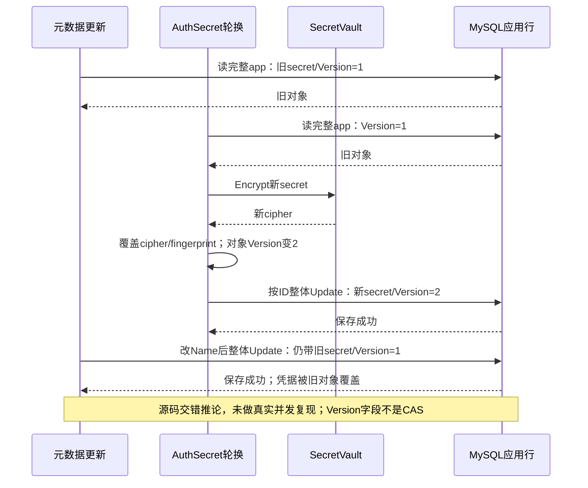
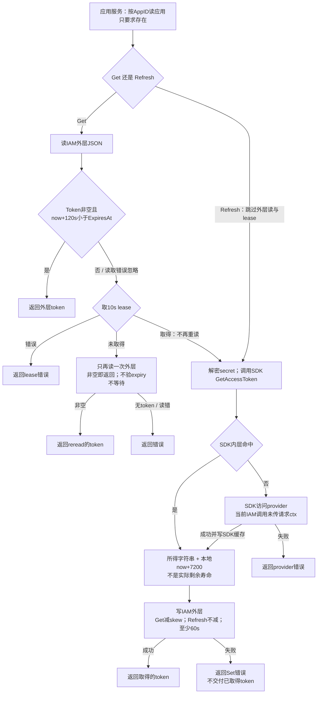

# IDP 应用凭据与 AppToken 缓存

> 状态：已实现 · 本文维护应用登记、凭据保存、两层 token 缓存及失败合同。并发/过期情境按源码推论标记，候选方案尚未实施；不以保存或刷新成功代替 provider 接受。

## 1. 先区分四种成功

| 情境 | 当前成功证明 | 不能推出的结论 |
| --- | --- | --- |
| 创建 WechatApp | 应用行已保存，默认 Enabled；可省略 AppSecret | type 合法、secret 有效、能够交换 code 或获取 token |
| RotateAuthSecret | 对象按指纹变更或不变，再执行仓储 Update | provider 已激活新 secret、并发更新不会覆盖、旧 token 已失效 |
| Get / Refresh AppToken | 取得字符串并按各自路径读写缓存 | token 是刚向 provider 取得、ExpiresAt 是真实剩余寿命、禁用应用不能再取 token |
| Resolver 取得 ExternalIdentity | 本次应用准入/解密/交换得到最小外部标识 | IAM 已创建 User/Session，或在途交换受停用/轮换屏障保护 |

IDP 持有 provider 应用材料；AuthN 持有登录入口与用户证明。小程序 code2Session、开放平台 OAuth 不经过本文的 IAM AppToken 服务。Resolver、WeCom adapter 和 ExternalIdentity 的完整合同归[外部解析](02-外部身份解析与AuthN协作.md)，不能用单一“AppSecret → AppToken → 登录”链概括所有 provider。

本文的核心取舍是：本地 AES-GCM 便于密文落库，Redis 与 SDK 缓存减少外部调用；代价是主密钥、凭据并发、两层到期与失效没有共同版本合同。下面按真实入口解释这些边界。

## 2. WechatApp 保存什么事实

### 2.1 应用、凭据与用户身份的边界

| 材料 | 所有者和用途 | 当前持久化/投影 |
| --- | --- | --- |
| WechatApp ID / AppID / Type / Status | 内部应用行与 provider 命名空间；不是 IAM UserID | MySQL idp_wechat_apps，AppID 唯一；Type/Status 是普通字符串 |
| AuthSecret | AppSecret，用于 provider 交换/应用 token | cipher、明文 SHA-256 fingerprint、Version、LastRotatedAt |
| MsgSecret | CallbackToken 与 EncodingAESKey | CallbackToken **明文**；EncodingAESKey 加密，另有 Version/时间 |
| APISecureChannel | 模型中对称/非对称 API 材料占位 | PO/迁移未保存，两个 RotateAPI 方法直接 nil，不能据调用成功宣称轮换 |
| provider AppAccessToken | provider 给应用的 API 调用材料 | IAM 外层 JSON 与 SDK 内层字符串缓存；不是 IAM AccessToken |
| AuthN Credential / IAM Token | 用户登录证明与持续会话 | AuthN 所有，应用轮换不自动替换 LoginIdentity、撤销 Session 或改 User |

依据：[实体](../../../internal/apiserver/domain/idp/wechatapp/wechatapp.go)、[Credentials](../../../internal/apiserver/domain/idp/wechatapp/credential.go)、[PO](../../../internal/apiserver/infra/mysql/wechatapp/po.go)。[000001](../../../internal/pkg/migration/migrations/000001_init_schema.up.sql)定义表/唯一键，[000005](../../../internal/pkg/migration/migrations/000005_bootstrap_system_data.up.sql)保存系统应用基线；没有 previous secret、master key ID、API secure-channel 或 AppToken 数据表。PO 的 unnamed unique tag 不等于 SQL 索引名称，AutoMigrate 不替代迁移链。

### 2.2 枚举、状态与入口并不统一

AppType 当前为 MiniProgram、MP、OpenPlatformWebsite，Status 的存储值是 Enabled、Disabled、Archived。Creator 默认 Enabled，但只拒绝精确空 AppID/Name/Type，不做 provider 核验；REST Create 直接将 Type cast 为领域类型，只有 List/Patch 使用枚举解析。例如未知非空 Type 可以登记成功，却在 token miss 或 Resolver 准入时失败。

Update 的 Name 会 trim 并拒绝空值；Create 没有同等归一。创建预查忽略查询错误，已存在时返回普通 error；DB duplicate 才映射结构化 ErrWechatAppAlreadyExists，重试不是“返回既有应用”的幂等创建。公开 Archive 未实现，Enable/Disable 也没有禁止 Archived 转换。依据：[Creator](../../../internal/apiserver/domain/idp/wechatapp/creator.go)、[metadata](../../../internal/apiserver/application/idp/wechatapp/service_metadata.go)、[REST mapping](../../../internal/apiserver/transport/rest/idp/handler/wechatapp_mapping.go)。

| 入口 | 当前状态/类型前置 |
| --- | --- |
| Resolver | 按认证 surface 检查 Type 与 Enabled；之后不复查状态/凭据版本 |
| Get/Refresh AppToken | 仅检查应用存在；Get 外层命中不查凭据、状态或类型，miss 的 Fetch 只支持 MiniProgram/MP，仍不查 Enabled |
| gRPC GetWechatApp | 直接 repo + 解密，不检查 Enabled/type 或 caller 对目标 AppID 的归属 |
| Auth/Msg rotation | 拒绝 Archived；允许 Disabled；metadata/启停另有不同规则 |

所以 Disable 可阻止后来读取应用的 Resolver，却不阻止管理读取 secret/token，不删除缓存或已存在 IAM Session，也不撤回已通过准入的在途 provider 交换。状态改变的效力必须按入口命名。

## 3. 密文保护与 master key 生命周期

### 3.1 当前保护到哪里

[本地 SecretVault](../../../internal/apiserver/infra/crypto/secret_vault.go)要求32字节 key，创建 AES-256-GCM，随机 nonce；持久格式为 `nonce || ciphertext+tag`。Seal/Open 的 AAD 为 nil，能够验证密文完整性，却没有把 AppID/材料类型/版本绑定进认证上下文。Sign 直接返回未实现错误。

主进程的 `idp.encryption-key` 经[解析器](../../../internal/apiserver/process/idp_key.go)支持 base64/base64url/hex/原始字节，最终必须32字节。Options.Validate 自身不检查该 key；[资源准备](../../../internal/apiserver/process/bootstrap.go)与[IDP deps](../../../internal/apiserver/container/idp/deps.go)检查，release 禁止 degraded，缺失/无效会阻止启动。debug/test 的显式 degraded 不等于 IDP 可无 key 正常装配。

master key 不在密文内标识，也不是 Auth/Msg.Version；没有旧 key 路由、rewrap 或版本迁移。**直接换配置 key 后，旧密文可能解不开；再次输入相同 AppSecret 又会命中旧 fingerprint 而不重加密。** 这是两个机制组合的源码推论，不是本轮主密钥变更演练。

### 3.2 指纹、明文使用与公开出口

Fingerprint 为原输入的 SHA-256，供 AuthSecret 比较；随机 nonce 使密文相等不能承担此职责。它不解密、不验证 provider，也不证明当前 cipher 仍可用；格式校验仅长度/非空，不保证高熵。指纹、密文及 plaintext 都应按敏感材料处理。

[Fetch adapter](../../../internal/apiserver/container/idp/token_provider.go)解密后清零原 byte slice，但转 string 的副本及 SDK 使用不受该清零覆盖，不能声称全部明文已销毁。gRPC GetWechatApp 会解密并返回 AppSecret；REST metadata result 不含 secret/cipher/fingerprint/version。落库加密与 API 可导出是不同合同，完整安全入口见第7节。

替换远程 KMS 还要处理 ctx/预算：Auth/Msg rotater 当前 Encrypt 使用 Background；本地 Vault 也不检查 ctx。不能只换接口实现就承诺请求取消会终止远端 KMS。密钥材料总览归[密码学](../../03-基础设施/04-密码学密钥与令牌.md)，本篇维护应用侧操作后果。

## 4. 轮换：单槽变更、重复输入与并发写入

### 4.1 Auth 与 Msg 的不同步骤

| 步骤 | RotateAuthSecret | RotateMsgAESKey |
| --- | --- | --- |
| 输入 | TrimSpace 非空且原字符串长度≥16；不按 trim 后值计算指纹 | 43字节且不全空白；不解 Base64/检查解码长度；领域不校验 CallbackToken，REST 要求它非空 |
| 状态 | 拒绝 Archived | 拒绝 Archived |
| 重复输入 | fingerprint 相等，领域直接 nil，不加密/递增；应用仍执行整体 Update | 没有 fingerprint/no-op；每次加密/递增 |
| 变更 | 覆盖当前 cipher/fingerprint，Auth.Version++/本地时间 | 覆盖 CallbackToken/cipher，Msg.Version++/本地时间 |
| 完成 | 仓储按 ID Update；没有 provider 激活/缓存失效步骤 | 同样没有独立消息协议握手或外部接受检查 |

依据：[rotater](../../../internal/apiserver/domain/idp/wechatapp/rotater.go)、[credential 应用服务](../../../internal/apiserver/application/idp/wechatapp/service_credentials.go)。这是单槽覆盖，没有 previous secret、启用时间或回滚槽；保存成功与 provider 在新 secret 下接受是两个证据。重复 Auth no-op 也不自动修复坏 cipher。

### 4.2 Version++ 没有阻止旧对象回写

[Repository.Update](../../../internal/apiserver/infra/mysql/wechatapp/repository.go)按 ID 覆盖 Name/Type/Status 与 Auth/Msg 全部字段，不比较 expected Version/Status；检查影响行数只能处理未更新到目标行。metadata、启停和两种轮换都使用这条路径，没有共同锁协议。



同理，慢轮换可能恢复此前 Disabled，两个轮换都可从 v1 写为 v2。只给 rotater 加锁仍留下 metadata/启停 writer。候选必须让所有写入者共同遵守字段更新/CAS或事务锁行；增加 master key 托管不能解决这个窗口。

## 5. 两层 AppToken 缓存与有限租约

### 5.1 真实路径和 key

正常[IDP infra](../../../internal/apiserver/container/idp/infra.go)将两种缓存都接同一 Redis client，但它们使用不同 key/编码/TTL：

| 层 | key / value | 到期来源 |
| --- | --- | --- |
| IAM 外层 | `idp:wechat:token:{appID}`；JSON Token/ExpiresAt；锁为 `idp:wechat:token:lock:{appID}` | Get 时 `max(ExpiresAt-now-120s,60s)`；Refresh 时 `max(ExpiresAt-now,60s)` |
| SDK 内层 | 默认AK的 `gowechat_miniprogram__access_token_{appID}` / `gowechat_officialaccount__access_token_{appID}`，字符串；双下划线是实际拼接 | pinned silenceper SDK 按 provider expires_in−1500秒写入；IAM adapter 不读取该 key 剩余 TTL |

AppID key 未绑定 credential generation，外层也未区分 Type。环境是否通过部署的 Redis 隔离需实际配置证据。SDK行为绑定[go.mod](../../../go.mod)中的 silenceper/wechat v2.1.11、component-base v0.8.0；本篇只读本机这些版本的源码，没有访问 provider。



图展开 token provider 返回正常非空结果的路径；默认SDK采用普通AK，IAM未设置 UseStableAK 或 force_refresh。holder 完成/失败后 defer Release，不表示 lease 一直有效到外部请求结束。依据：[Cacher](../../../internal/apiserver/domain/idp/wechatapp/accesstoken-cacher.go)、[通用流程](../../../internal/apiserver/cache/readthrough.go)、[应用 Get/Refresh](../../../internal/apiserver/application/idp/wechatapp/service_token.go)、[SDK adapter](../../../internal/apiserver/infra/wechatapi/token-provider.go)、[Redis adapters](../../../internal/apiserver/infra/cache/redis/accesstoken_cache.go)。

### 5.2 外层有效期与 provider 到期不是一个数

生产 Fetch 调 SDK GetAccessToken 取得字符串，再无条件估计 ExpiresAt=本次now+7200；没有 provider 的原始 expiry，也没有 SDK cache 剩余 TTL。REST Get/Refresh 的 expires_in 又固定7200，gRPC只返回token。因此120秒skew只相对**估计**值判断，不能承诺离真实到期还有120秒。

一个具体的源码时序推论：假设T0 provider返回7200秒token，SDK缓存5700秒；T5000显式Refresh仍命中该旧token，外层却被写成ExpiresAt=T12200。即使provider在T7200使它失效，后续外层仍可能判为可用。这不是微信调用复现，但足以说明“Refresh成功即新token/新两小时”不由当前实现保证。

另有独立的短寿命窗口：Get回填至少60秒，加载结果没有再次Valid检查；30秒token可被返回并缓存60秒。lock loser的第二次读取仅要求Token非空，甚至接受已过期模型；现有domain测试明确断言此行为。让reread检查模型ExpiresAt只能修后一个窗口，不能修本地估算延长旧token寿命。

### 5.3 lease 只有限协调 Get

Redis lease用随机owner token和SET NX/TTL，Release比较token删除，避免删除后继holder的锁。基础库有手动Renew/ownership接口，但本路径没有调用；没有自动续期、递增fencing或cache.Set的generation条件。超过10秒的慢holder与后继holder可重叠，晚Set可覆盖后继结果，Release安全不等于写入安全。显式Refresh根本不争同一lease。

holder拿锁后不double-check缓存；loser不等待，只再读一次，尚无可用值便返回refresh in progress。SDK对象自己的进程内mutex也不能替代跨请求/跨实例协议；每次Fetch创建新的SDK对象。不能据“singleflight”注释宣称全局一次刷新或exactly-once。

## 6. 错误、取消与轮换后的接受

| 阶段 | 当前结果/后果 |
| --- | --- |
| 应用查询不存在 | 结构化NotFound；查询故障传播；已有外层token不能绕过先读应用 |
| 外层Get故障 | 忽略后尝试lease；Acquire故障仍失败，不是Redis故障时无约束直连 |
| 外层miss/过期 | holder调用SDK，SDK仍可命中旧内层；无加载后expiry校验 |
| provider/Decrypt失败 | 返回错误；没有返回原缓存stale的通用fallback |
| 外层Set失败 | Get/Refresh报错，不把刚取得token交付；provider/SDK副作用不回滚 |
| 请求取消 | rotater Encrypt/lease Release用Background；TokenProvider接ctx但调用无ctx的SDK GetAccessToken，后者用Background；不能保证取消微信HTTP |
| 内部错误文本 | pinned SDK部分HTTP错误可带含secret的URI；包装不天然脱敏，公开gRPC普通error另有稳定安全映射，不能据此断言内部日志也安全 |

secret轮换不删除任一层cache，AccessTokenCache port甚至没有Delete；状态变更也不清cache。**当前 Refresh 只能作为一次取得/回填尝试，不能充当采用新secret的验收证据。** 若provider有宽限、立即失效或强制刷新差异，需绑定当前应用/provider的真实合同，不能从存储设计推断。

接受至少要把本地保存的凭据版本、实际采用该材料的provider操作、token真实expiry/返回结果与调用方API结果区分。现行API不给这些证明提供统一回执；新的强刷新/验证/回滚流程须先定合同再实现，本文没有执行轮换、清缓存、调用微信或生产操作。

## 7. 公开入口与敏感材料边界

| 入口 | 当前公开能力/准入 | 不能扩大为的保证 |
| --- | --- | --- |
| REST wechat-apps | 十个管理方法；root要求IDP/handler、AuthN与AuthZ middleware，JWT后检查固定`iam:idp:collection:wechat_apps`及action | 目标AppID归属/组织Scope；应用服务没有第二次管理授权 |
| gRPC IDPService | GetWechatApp、GetWechatAccessToken、RefreshWechatAccessToken；依赖server配置的mTLS/Credential/ACL | 方法内已核验目标AppID与caller绑定；没有gRPC创建/轮换命令 |
| SDK Client.IDP | 三个薄封装，共用已有连接 | 额外缓存/准入，或Refresh保证provider回源 |

GetWechatApp直接repo/Vault输出明文AppSecret，REST metadata不含它；Cred/Auth/cipher缺失可成功返回空secret。ACL模板授权的GetWechatApp不限目标AppID，模板不能证明部署已挂载；后续收窄出口必须评估当前caller/SDK兼容。具体注册与安全装配地图归[IDP边界](04-模块边界与代码索引.md)，服务安全归[AuthZ gRPC](../03-AuthZ/06-关键链路-gRPC服务间授权与SDK.md)。

机器描述也有偏移：REST Create实际200+code/message/data，YAML写201+裸对象；管理security/错误面与成功envelope未完整表达。IDP十个Swagger schema当前都被短名匹配跳过。字段/路径门禁不能证明准入、secret出口或TTL；详见[契约治理](../../04-接口与SDK/01-REST-gRPC与契约治理.md)。依据：[REST handler](../../../internal/apiserver/transport/rest/idp/handler/wechatapp.go)、[gRPC service](../../../internal/apiserver/transport/grpc/service/idp/service_impl.go)、[SDK](../../../pkg/sdk/idp/read.go)、[OpenAPI](../../../api/rest/idp.v2.yaml)。

## 8. 候选设计：每一项解决哪个窗口

| 候选 | 具体合同和收益 | 代价/仍未解决 |
| --- | --- | --- |
| metadata按字段Update，credential/status所有writer遵守CAS或锁行 | 防止旧metadata恢复secret/状态；轮换明确expected generation与冲突 | 新迁移/错误兼容/竞争重读；只改一个rotater不闭合，不能解决provider已执行 |
| 收敛为单一token owner并返回真实expiry | provider response/SDK接口提供expiry，避免重估缓存旧token | SDK替换/扩展与兼容；不能拿固定7200或外层TTL冒充真实expiry |
| generation绑定cache + 统一受控Refresh | key/entry绑定AppID/type/credential版本，Get/Refresh共同租约与写入fencing；旧holder晚写不污染当前代 | 双层必须共同治理，纯Delete仍有在途旧请求回填；需定义取消/超时和可恢复结果 |
| 明确fresh与stale策略 | hit/reread/load检查真实expiry；仅经评估允许skew内stale，绝不把非空当有效 | 最低TTL不得延长有效性；Redis错误是否fail/降级以及Set失败交付须分别定合同 |
| provider secret双槽/激活协议 | 区分prepared/active/previous，实际provider验证后切换并保留恢复点 | 依赖provider是否支持双密钥/宽限，不能单方面创造；token代次与Secret状态同步 |
| master key ID + AAD/rewrap，必要时envelope/KMS | 旧数据可路由解密，AppID/材料/版本绑定，定义可中断恢复的迁移 | 旧密文迁移、权限/审计/可用性及请求预算；不解决整体Update和provider token期限 |
| 拆分metadata与秘密出口/代理provider操作 | 最小调用能力与AppID范围，减少不必要secret导出 | SDK/caller迁移和部署准入；日志/缓存/进程内材料仍需保护 |

这些候选没有被实现或排序为已接受计划。配置文件明文secret不是当前持久化选择，每请求直接取token也未采用；当前两层缓存不能简单等同单一“Redis+lease read-through”。架构替代和OIDC/broker取舍归[信任模型](03-外部身份信任模型与方案演化.md)。

## 9. 事实来源与验证边界

| 证据入口 | 当前可证明范围 | 仍缺少的证明 |
| --- | --- | --- |
| domain rotater/cacher tests | stub轮换/no-op、30秒token的60秒TTL、loser返回过期token | 本地Vault/KMS迁移、真实provider接受、lease过期/fencing/双层TTL |
| application tests | stub metadata/启停/filter、token缺app结构化错误 | provider force refresh、并发rotation/status/metadata、generation一致 |
| Redis adapter tests | miniredis JSON/string存取、同锁占用/Release | SDK生成key与真实HTTP、跨实例慢holder/故障/TTL流逝联合链 |
| IDP module/provider tests | SQLite+miniredis装配/缓存族；fake Vault/API的派发/expiry透传/解密失败 | 真实SDK缓存、远端到期、取消、迁移及实际WeCom adapter |
| repository concurrent test | 默认SQLite或MYSQL_HOST指定MySQL；AutoMigrate下100次同AppID创建仅一条 | 不要求99个错误都映射；不验证SQL链、轮换CAS或状态竞争 |
| REST/gRPC tests | 替身管理准入/捕获resource-action、token透传、NotFound及解密错误隐藏 | 真实JWT/mTLS/ACL、成功secret投影和目标AppID范围、完整响应/安全合同 |

依赖源码只读绑定 pinned版本，不是生产环境或微信HTTP验收。现有并发创建测试缺MYSQL_HOST时不会Skip而会用SQLite；SDK IDP没有测试文件。有效性测试与静态门禁都不能证明已轮换或已部署。

```bash
# 按修改面选择；本篇的执行/复用范围另绑定复核记录
go test ./internal/apiserver/domain/idp/wechatapp ./internal/apiserver/application/idp/wechatapp
go test ./internal/apiserver/cache ./internal/apiserver/infra/cache/redis ./internal/apiserver/container/idp
go test ./internal/apiserver/infra/mysql/wechatapp ./internal/apiserver/transport/rest/idp ./internal/apiserver/transport/grpc/service/idp
make docs-hygiene docs-facts docs-validation-tests
```

本轮仅改文档/图示；实际回归范围、日志摘要、复用证据与图示检查在[复核记录](../../_data/reviews/2026-10-06-docs-refactor.md)中登记。下一篇深化[外部身份解析与AuthN协作](02-外部身份解析与AuthN协作.md)，将具体provider链和历史兼容证据逐一核对。
