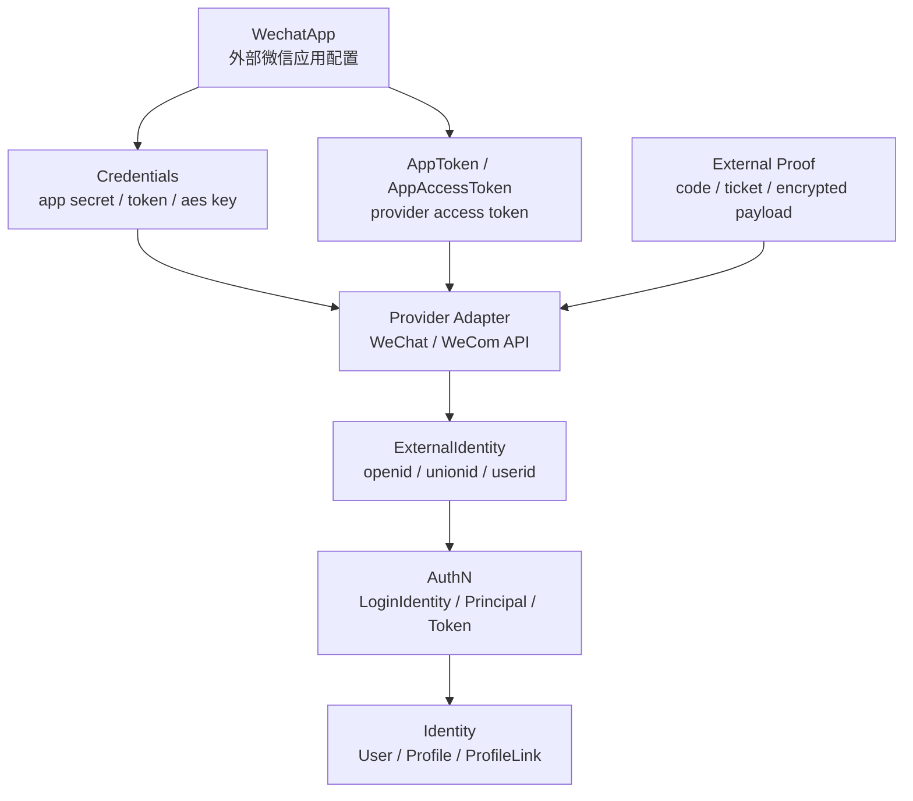
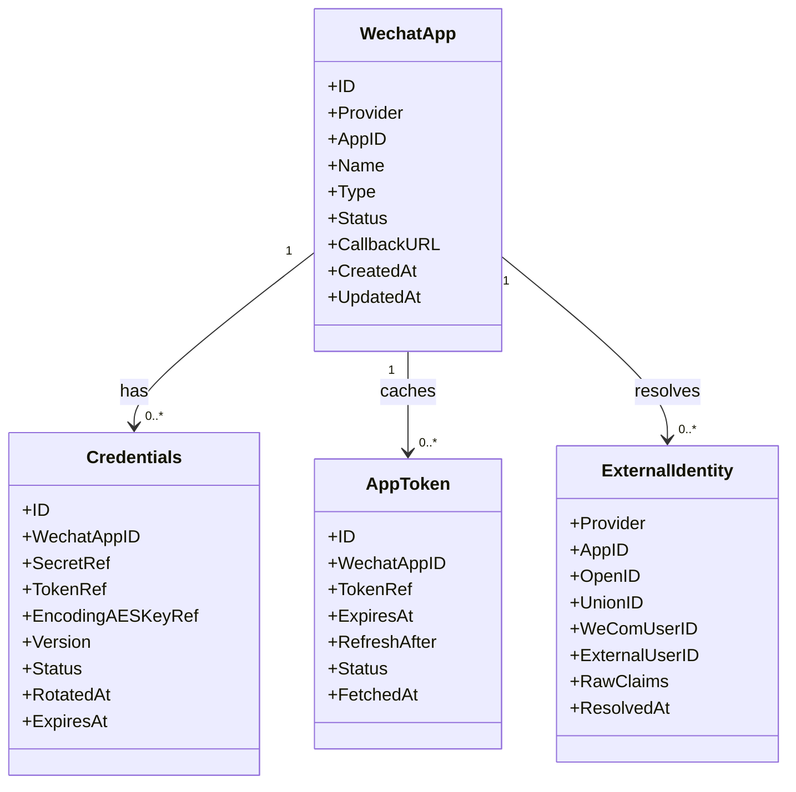
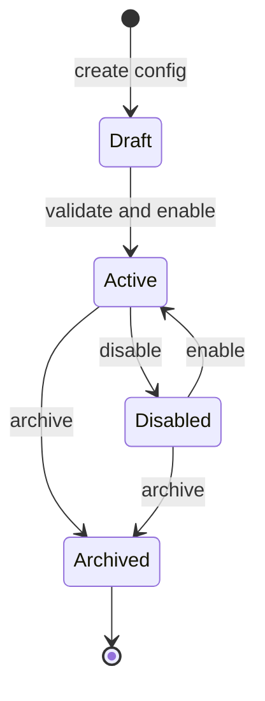
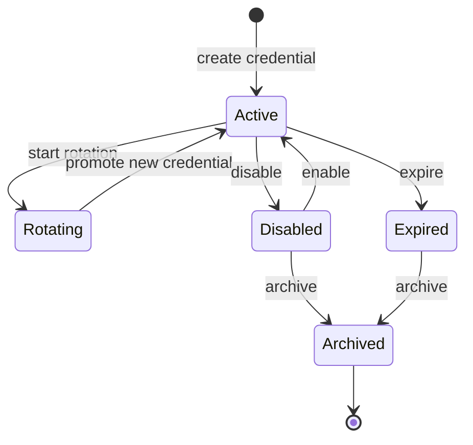
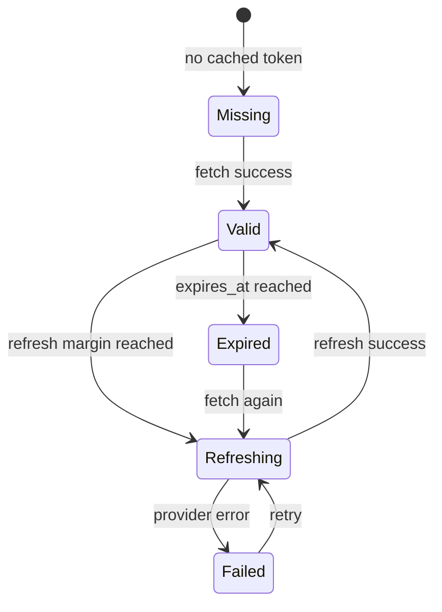
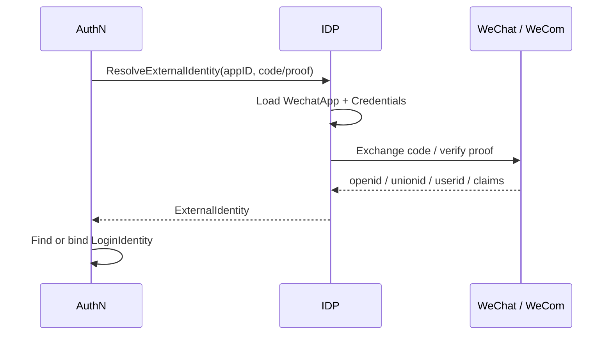

# 领域模型：WechatApp / Credentials / AppToken / ExternalIdentity

> 状态：待补证据 · 第一版正文，待继续按 `internal/apiserver/domain/idp`、`application/idp`、微信/企微 provider adapter、AppToken 缓存、凭据加密存储、REST/gRPC 契约和测试逐项核对。

---

## 1. 本文回答

本文回答 10 个问题：

- IDP 领域模型由哪些核心对象组成？
- 为什么当前 IDP 主模型以 `WechatApp` 为中心？
- `WechatApp` 表达什么外部应用配置事实？
- `Credentials` 表达什么外部 provider 凭据事实？
- `AppToken` / `AppAccessToken` 为什么不是 IAM `AccessToken`？
- `ExternalIdentity` 如何表达 openid、unionid、企微 userid 等外部身份声明？
- `WechatApp`、`Credentials`、`AppToken`、`ExternalIdentity` 的生命周期如何流转？
- IDP 模型与 AuthN 的 `LoginIdentity / Credential / Principal / Token` 如何区分？
- IDP 模型与 Identity 的 `User / Profile / ProfileLink` 如何区分？
- 修改 IDP 模型时应该核对哪些代码、契约和测试？

本文是 IDP 模型主文档，集中说明模型定义、模型图、生命周期、状态流转、不变量和边界。模块总览见 [00-模块总览.md](00-模块总览.md)。

---

## 2. 30 秒结论

IDP 的领域模型可以压缩成一条外部身份源接入主线：

```text
WechatApp
  -> Credentials
  -> AppToken / AppAccessToken
  -> ExternalIdentity
  -> AuthN LoginIdentity / Principal
```

每个对象回答的问题不同：

| 对象 | 一句话 | 领域含义 | 不是什么 |
| --- | --- | --- | --- |
| `WechatApp` | 外部微信应用配置聚合 | IAM 接入了哪个微信/企微应用 | 不是 User，不是 LoginIdentity |
| `Credentials` | 外部应用凭据集合 | 调 provider API 或消息验签需要哪些 secret/key | 不是 AuthN Credential，不是用户密码 |
| `AppToken` / `AppAccessToken` | 外部应用访问令牌 | 调用微信/企微 API 的 provider token | 不是 IAM AccessToken / RefreshToken |
| `ExternalIdentity` | 外部身份声明 | provider 返回的 openid / unionid / userid 等声明 | 不是 IAM User，不是 Principal，不是 Subject |

如果只记一句话：

> IDP 只建模“外部身份源”和“外部身份声明”，AuthN 才负责把这些外部身份声明映射成 IAM 登录身份和认证结果。

---

## 3. 为什么当前模型以 WechatApp 为中心

当前 IAM 的 IDP 场景主要围绕微信生态展开：

```text
微信小程序登录；
微信公众号能力；
微信开放平台网站应用，若具备资质；
企业微信应用，若具备企业主体和应用配置；
微信/企微 callback、ticket、access_token 管理。
```

因此，当前代码里的 IDP 主模型以 `WechatApp` 为中心是合理的。

但在领域语义上，`WechatApp` 可以理解为更通用的 `ProviderApp` 的微信实现：

```text
ProviderApp
  -> WechatApp
  -> WeComApp，若后续拆分
  -> OtherProviderApp，若后续接入其他 provider
```

本文继续沿用当前文件名和代码模型中的 `WechatApp`，但在边界上明确：

```text
WechatApp 是 provider app 配置；
不是登录身份；
不是用户；
不是认证结果；
不是授权主体。
```

---

## 4. 领域模型总图



读图规则：

```text
WechatApp 描述外部应用配置；
Credentials 描述外部应用敏感凭据；
AppToken 是外部 provider token；
ExternalIdentity 是外部 provider 返回的身份声明；
AuthN 决定 ExternalIdentity 如何映射或绑定 LoginIdentity；
Identity 决定是否创建或更新 User/Profile/ProfileLink；
IDP 不直接创建 IAM Token、User、RoleBinding。
```

---

## 5. 类图：核心对象与关系



注意：

```text
上图是领域语义图，不等于数据库物理表结构；
字段名称和数量以当前源码、迁移和契约为准；
如果代码尚未完全实现某个字段，应在具体文档中标记为规划改造或待补证据。
```

---

## 6. WechatApp

### 6.1 定位

`WechatApp` 是外部微信应用配置聚合。

它回答：

```text
IAM 当前接入了哪个微信/企微应用？
这个应用属于哪类 provider app？
它是否启用？
它使用哪组凭据？
它如何处理 callback 或消息验签？
```

典型应用类型：

```text
wechat-mini-program；
wechat-official-account；
wechat-open-platform-web；
wecom-corp；
wecom-agent。
```

具体枚举以当前代码和产品接入范围为准。

---

### 6.2 核心字段

| 字段 | 含义 | 说明 |
| --- | --- | --- |
| `ID` | 内部标识 | IAM 内部 provider app ID |
| `Provider` | provider 类型 | wechat / wecom 等，具体以代码为准 |
| `AppID` | 外部应用 ID | 微信 appid、企微 corpid/agentid 等，具体以类型为准 |
| `Name` | 应用名称 | 人类可读名称 |
| `Type` | 应用类型 | 小程序、公众号、企微应用等 |
| `Status` | 状态 | active / disabled / archived 等，具体以代码为准 |
| `CallbackURL` | 回调地址 | 可选，用于 provider callback |
| `CreatedAt` / `UpdatedAt` | 时间戳 | 审计和同步使用 |

---

### 6.3 生命周期



注意：

```text
状态图是领域语义图；
具体状态枚举以代码为准；
禁用 WechatApp 后，外部身份解析和 AppToken 获取通常应被拒绝；
归档不应物理删除历史凭据和审计信息，具体以代码策略为准。
```

---

### 6.4 边界

```text
WechatApp 是外部 provider app 配置；
WechatApp 不是 User；
WechatApp 不是 LoginIdentity；
WechatApp 不是 Principal；
WechatApp 不是 Subject；
WechatApp 不表达授权权限；
WechatApp 不代表某个用户已登录。
```

---

## 7. Credentials

### 7.1 定位

`Credentials` 表达外部应用凭据集合。

它回答：

```text
调用 provider API、校验 provider callback、解密 provider 消息需要哪些 secret/key？
这些凭据当前是否有效？
凭据如何轮换？
```

典型凭据：

```text
app secret；
callback token；
encoding aes key；
corp secret；
agent secret；
private key，若 provider 需要；
```

---

### 7.2 核心字段

| 字段 | 含义 | 说明 |
| --- | --- | --- |
| `ID` | 凭据 ID | 内部标识 |
| `WechatAppID` | 所属应用 | 关联 WechatApp |
| `SecretRef` | app secret 引用 | 应为加密引用或密文，不应明文返回 |
| `TokenRef` | callback token 引用 | 用于消息验签，具体以 provider 为准 |
| `EncodingAESKeyRef` | 消息加解密密钥引用 | 用于微信/企微消息解密 |
| `Version` | 凭据版本 | 支持轮换和审计 |
| `Status` | 状态 | active / rotating / disabled / expired 等，具体以代码为准 |
| `RotatedAt` | 轮换时间 | 可选 |
| `ExpiresAt` | 过期时间 | 可选，provider 凭据是否有过期语义以 provider 为准 |

---

### 7.3 生命周期



关键规则：

```text
Credentials 不应明文泄露到 response；
凭据轮换期间可能需要新旧凭据短暂并存；
消息验签可能需要按 version 或时间窗口选择凭据；
禁用凭据后应拒绝 provider API 调用或 callback 验签；
凭据变更应记录审计。
```

---

### 7.4 边界

```text
Credentials 是 provider app 凭据；
Credentials 不是 AuthN Credential；
Credentials 不保存 IAM 用户密码；
Credentials 不用于校验 IAM 用户身份；
Credentials 不应进入 LoginIdentity；
Credentials 不应进入 IAM Token claims；
Credentials 只服务 provider API 调用、callback 验签和消息解密。
```

---

## 8. AppToken / AppAccessToken

### 8.1 定位

`AppToken` 或 `AppAccessToken` 是外部 provider 的应用访问令牌。

它回答：

```text
调用微信/企微 provider API 时，当前可用的 app-level access token 是什么？
什么时候过期？
什么时候需要提前刷新？
```

典型例子：

```text
微信 access_token；
企业微信 access_token；
provider app access token。
```

---

### 8.2 核心字段

| 字段 | 含义 | 说明 |
| --- | --- | --- |
| `ID` | token 记录 ID | 内部标识，可选 |
| `WechatAppID` | 所属应用 | 关联 WechatApp |
| `TokenRef` | token 引用 | 应加密或只存在安全缓存中 |
| `ExpiresAt` | 过期时间 | provider 返回 expires_in 后计算 |
| `RefreshAfter` | 建议刷新时间 | 早于 ExpiresAt，用于 refresh margin |
| `FetchedAt` | 获取时间 | 调 provider API 成功时间 |
| `Status` | 状态 | valid / refreshing / expired / failed 等，具体以代码为准 |

---

### 8.3 生命周期



关键规则：

```text
AppToken 应有 TTL；
应设置 refresh margin，避免临界过期；
并发刷新应使用 singleflight、锁或 CAS，避免击穿 provider API；
刷新失败时是否继续使用旧 token，必须以安全和 provider 语义明确；
AppToken 不应长时间明文落库，具体存储策略以代码为准。
```

---

### 8.4 边界

```text
AppToken 是 provider token；
AppToken 不是 IAM AccessToken；
AppToken 不是 IAM RefreshToken；
AppToken 不能访问 IAM API；
AppToken 不代表 IAM 用户已登录；
AppToken 不应进入 AuthN Token；
AppToken 不应作为 AuthZ 授权凭证；
AppToken 的缓存、过期、刷新归 IDP 管理。
```

---

## 9. ExternalIdentity

### 9.1 定位

`ExternalIdentity` 是外部 provider 返回的身份声明。

它回答：

```text
外部 provider 认为当前 proof 对应哪个外部用户？
这个外部用户在当前 provider app 下的稳定标识是什么？
是否有跨应用标识？
```

典型来源：

```text
微信小程序 code2session；
微信公众号 OAuth userinfo；
微信开放平台扫码登录；
企业微信 oauth / userinfo；
provider callback 中的 external user 信息。
```

具体能力以 provider 和当前资质为准。

---

### 9.2 核心字段

| 字段 | 含义 | 说明 |
| --- | --- | --- |
| `Provider` | provider 类型 | wechat / wecom 等 |
| `AppID` | provider app id | openid 通常在 app 范围内唯一 |
| `OpenID` | 微信 openid | app 维度用户标识 |
| `UnionID` | 微信 unionid | 开放平台主体下跨应用用户标识，是否返回取决于配置和用户授权 |
| `WeComUserID` | 企业微信 userid | 企微内部成员标识，具体字段以 provider 为准 |
| `ExternalUserID` | 外部用户 ID | 企微外部联系人等场景，具体以 provider 为准 |
| `RawClaims` | 原始 claims | 可选，用于审计和调试，需避免敏感泄露 |
| `ResolvedAt` | 解析时间 | 外部身份解析完成时间 |

---

### 9.3 生命周期

ExternalIdentity 通常不是长期聚合，而是一次解析结果或外部身份事实输入。

生命周期：

```text
receive provider proof
  -> verify proof / call provider API
  -> build ExternalIdentity
  -> return to AuthN
  -> AuthN find/bind LoginIdentity
```



---

### 9.4 边界

```text
ExternalIdentity 不是 IAM User；
ExternalIdentity 不是 LoginIdentity；
ExternalIdentity 不是 Principal；
ExternalIdentity 不是 Subject；
ExternalIdentity 不直接表达权限；
ExternalIdentity 不应直接创建 User；
ExternalIdentity 不应直接写 RoleBinding；
ExternalIdentity 需要交给 AuthN，由 AuthN 决定登录、注册、绑定或拒绝。
```

---

## 10. 核心不变量汇总

| 不变量 | 所属对象 | 说明 |
| --- | --- | --- |
| WechatApp 表达 provider app 配置 | WechatApp | 不是 User/LoginIdentity/Principal |
| AppID 在合适范围内唯一 | WechatApp | 唯一范围以 provider/type/tenant 设计为准 |
| Credentials 不明文返回 | Credentials | secret/token/aes key 只能内部使用 |
| Credentials 不是 AuthN Credential | Credentials | 不用于校验 IAM 用户密码 |
| AppToken 有过期语义 | AppToken | 必须处理 TTL 和刷新 |
| AppToken 不是 IAM AccessToken | AppToken | 不能访问 IAM API |
| ExternalIdentity 是外部声明 | ExternalIdentity | 不是 User/LoginIdentity/Principal/Subject |
| openid 通常是 app 维度标识 | ExternalIdentity | 不应直接当 UserID |
| unionid 是否存在取决于 provider 配置 | ExternalIdentity | 不能假设一定返回 |
| IDP 不签发 IAM Token | IDP | Token 归 AuthN |
| IDP 不写 RoleBinding | IDP/AuthZ | 授权归 AuthZ |

---

## 11. 失败边界

| 场景 | 期望行为 | 说明 |
| --- | --- | --- |
| WechatApp 不存在 | 解析失败 | 不能使用未知 appid 继续调用 provider |
| WechatApp disabled | 解析失败 | 禁用应用不应继续登录解析 |
| Credentials 缺失 | 解析失败 | 无法调用 provider 或验签 |
| Credentials 过期/禁用 | 解析失败 | 应提示配置问题或内部错误 |
| AppToken 缓存 miss | 拉取 provider token | 成功后缓存 |
| AppToken 刷新失败 | 返回 provider error 或使用旧 token | 策略必须明确 |
| provider code 无效 | 解析失败 | 返回外部认证 proof 无效 |
| provider API 超时 | 解析失败或重试 | 应有超时、重试和降级策略 |
| unionid 缺失 | 允许只返回 openid | 是否能跨应用绑定由 AuthN 策略决定 |
| ExternalIdentity 无稳定标识 | 解析失败 | 不能生成 LoginIdentity key |
| Provider callback 验签失败 | 拒绝 callback | 不应处理 payload |

---

## 12. 与其他模块的边界

### 12.1 与 AuthN

```text
IDP 负责 ExternalIdentity；
AuthN 负责 LoginIdentity / Principal / Session / Token；
ExternalIdentity 不是 LoginIdentity；
Credentials 不是 AuthN Credential；
AppToken 不是 IAM AccessToken；
AuthN 通过 IDP port 解析外部身份；
IDP 不创建 Principal，也不签发 IAM Token。
```

### 12.2 与 Identity

```text
IDP 不创建 User/Profile/ProfileLink；
openid/unionid/wecom userid 不是 UserID；
外部 nickname/avatar 等 claims 不能直接覆盖 Identity 主数据；
是否创建或更新 User/Profile 由 AuthN/Identity 显式用例决定。
```

### 12.3 与 AuthZ

```text
ExternalIdentity 不是 Subject；
openid 不能直接授权；
IDP AppToken 不是授权凭证；
外部身份必须先经过 AuthN 成为 Principal，再映射为 AuthZ Subject；
IDP 不创建 RoleBinding。
```

### 12.4 与 Suggest

```text
IDP 不维护 ProfileSearchTerm / ProfileAccessScope / Snapshot；
外部 claims 如需进入搜索字段，应先经过 Identity 确认，再由 Suggest 用例更新索引；
IDP 不直接写 Suggest index。
```

---

## 13. 常见反模式

| 反模式 | 问题 | 推荐做法 |
| --- | --- | --- |
| WechatApp 当 LoginIdentity | 外部应用配置和登录身份混淆 | WechatApp 只描述 provider app |
| Credentials 当 AuthN Credential | provider secret 和用户凭据混淆 | AuthN Credential 归 AuthN |
| AppToken 当 IAM AccessToken | provider token 和 IAM token 混淆 | AppToken 只用于 provider API |
| ExternalIdentity 当 User | 外部声明和内部身份混淆 | AuthN/Identity 显式映射或创建 |
| openid 当 UserID | 外部 app 维度标识和内部 ID 混淆 | openid 进入 LoginIdentity external id |
| unionid 必然存在 | 依赖不稳定 provider claim | AuthN 策略要处理 unionid 缺失 |
| IDP 直接创建 LoginIdentity | IDP 吞并 AuthN | IDP 返回 ExternalIdentity，由 AuthN 处理 |
| IDP 直接创建 User | IDP 吞并 Identity | User 创建归 Identity/Onboarding 用例 |
| IDP 直接写 RoleBinding | IDP 吞并 AuthZ | 授权归 AuthZ |
| ProviderCredential 明文返回 | 凭据泄露 | secret/key 加密保存且不对外返回 |

---

## 14. 代码事实源

| 事实 | 路径 |
| --- | --- |
| IDP domain | `../../../internal/apiserver/domain/idp` |
| WechatApp | `../../../internal/apiserver/domain/idp` |
| Credentials / ProviderCredential | `../../../internal/apiserver/domain/idp` |
| AppToken / AppAccessToken | `../../../internal/apiserver/domain/idp`、`../../../internal/apiserver/application/idp`，具体以代码为准 |
| ExternalIdentity | `../../../internal/apiserver/domain/idp` |
| IDP application | `../../../internal/apiserver/application/idp` |
| WeChat / WeCom provider adapter | `../../../internal/apiserver/infra` |
| Credential store / encryption | `../../../internal/apiserver/infra` |
| Token cache | `../../../internal/apiserver/infra` |
| IDP REST transport | `../../../internal/apiserver/transport/rest` |
| IDP gRPC transport | `../../../internal/apiserver/transport/grpc` |
| IDP container | `../../../internal/apiserver/container/idp` |
| REST 契约 | `../../../api/rest` |
| gRPC 契约 | `../../../api/grpc` |
| 架构测试 | `../../../internal/pkg/architecture` |

注意：上表中的具体路径需要继续与当前源码核对。如果源码目录已调整，应以代码为准并同步更新本文。

---

## 15. Verify

修改本文后至少执行：

```bash
make docs-hygiene
```

涉及 IDP 领域模型：

```bash
go test ./internal/apiserver/domain/idp/...
```

涉及 IDP 应用用例：

```bash
go test ./internal/apiserver/application/idp/...
```

涉及 provider adapter、credential store、token cache：

```bash
go test ./internal/apiserver/infra/...
```

具体路径以当前代码为准。

涉及 AuthN/Identity/AuthZ/Suggest 边界：

```bash
go test ./internal/apiserver/domain/authn/...
go test ./internal/apiserver/domain/identity/...
go test ./internal/apiserver/domain/authz/...
go test ./internal/apiserver/domain/suggest/...
```

涉及 REST/gRPC 契约或 transport：

```bash
make api-validate
make proto-gen
go test ./internal/apiserver/transport/rest/...
go test ./internal/apiserver/transport/grpc/...
```

涉及 SDK：

```bash
go test ./pkg/sdk/...
```

涉及分层依赖或模块边界：

```bash
go test ./internal/pkg/architecture
```

---

## 16. 本文总结

IDP 的领域模型可以压缩成：

```text
WechatApp
  -> Credentials
  -> AppToken / AppAccessToken
  -> ExternalIdentity
  -> AuthN LoginIdentity / Principal
```

每个对象的职责是：

```text
WechatApp：外部微信/企微应用配置；
Credentials：外部 provider app 凭据和消息密钥；
AppToken：调用 provider API 的应用 access token；
ExternalIdentity：provider 返回的 openid / unionid / userid 等外部身份声明。
```

最重要的边界是：

```text
WechatApp 不是 LoginIdentity；
Credentials 不是 AuthN Credential；
AppToken 不是 IAM AccessToken；
ExternalIdentity 不是 User / Principal / Subject；
openid/unionid/wecom userid 不是 IAM UserID；
IDP 不创建 User、LoginIdentity、Principal、Token 或 RoleBinding。
```

读完本文后，应继续编写外部应用配置链路，说明 WechatApp 和 Credentials 如何创建、更新、启用、禁用、轮换和审计。
