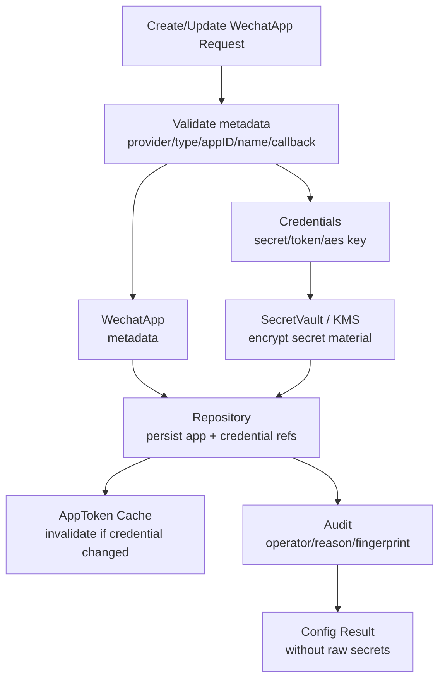
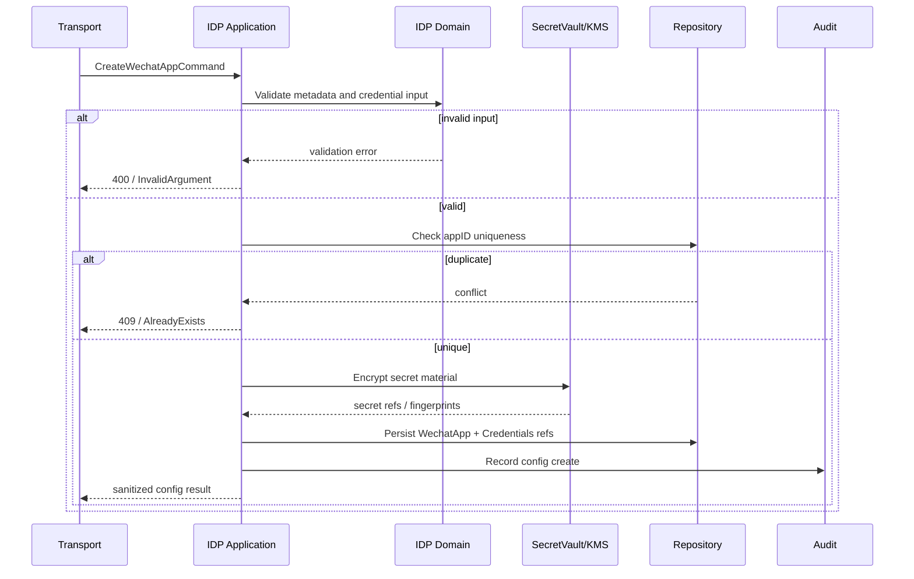
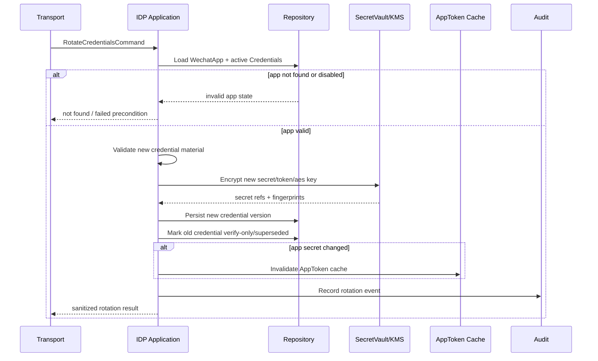

# 关键链路：微信应用配置与密钥轮换

> 状态：待补证据 · 骨架初稿，待与代码/契约核对。

## 链路目标

管理 `WechatApp` 元数据和密钥，支撑外部身份源调用。

## 配置链路

```text
create app
  -> validate appID/name/type
  -> persist WechatApp
  -> enable / disable
```

## 密钥轮换链路

```text
load WechatApp
  -> validate new secret
  -> encrypt by SecretVault
  -> update credential fingerprint/version
  -> persist
```

## 关键边界

- 密钥只属于 IDP 外部应用配置。
- 密钥轮换不创建 LoginIdentity。
- 密钥轮换不签发 IAM Token。

# 关键链路：微信应用配置与密钥轮换

> 状态：待补证据 · 第一版正文，待继续按 `application/idp`、`domain/idp`、WechatApp repository、Credentials store、SecretVault、provider callback、REST/gRPC 契约和测试逐项核对。

---

## 1. 本文回答

本文回答 10 个问题：

- 微信应用配置链路解决什么问题？
- `WechatApp` 元数据和 `Credentials` 为什么要分开管理？
- 创建、更新、启用、禁用微信应用配置时应该维护哪些事实？
- app secret、callback token、encoding aes key 等密钥应该如何保存、展示和审计？
- 密钥轮换为什么不是简单更新一列明文 secret？
- 密钥轮换如何支持 version、fingerprint、双凭据窗口和回滚？
- 配置变更如何影响 AppToken 缓存和 provider callback 验签？
- 微信应用配置与 AuthN LoginIdentity、Identity User、AuthZ RoleBinding 的边界在哪里？
- 幂等、并发、失败边界和安全策略如何处理？
- 修改该链路时应该核对哪些代码和测试？

本文只讲微信/企微应用配置和密钥轮换链路。IDP 领域模型见 [01-领域模型-WechatApp-Credentials-AppToken-ExternalIdentity.md](01-领域模型-WechatApp-Credentials-AppToken-ExternalIdentity.md)，模块总览见 [00-模块总览.md](00-模块总览.md)。

---

## 2. 30 秒结论

微信应用配置与密钥轮换是 IDP 的配置写侧链路。

它的目标是：

```text
安全维护 WechatApp 元数据和 provider credentials，
让后续 AppToken 获取、ExternalIdentity 解析、provider callback 验签/解密有可靠配置基础。
```

核心主线：

```text
Create / Update WechatApp
  -> validate app metadata
  -> persist WechatApp
  -> encrypt and persist Credentials
  -> enable / disable app
  -> invalidate related AppToken cache if needed
  -> audit config change
```

密钥轮换主线：

```text
Rotate Credentials
  -> load WechatApp
  -> validate new secret/token/aes key
  -> encrypt by SecretVault / KMS
  -> generate credential version and fingerprint
  -> keep old credential in verify-only window if needed
  -> promote new credential
  -> invalidate AppToken cache if needed
  -> audit rotation
```

最重要的边界：

```text
WechatApp 是外部 provider app 配置，不是 LoginIdentity；
Credentials 是 provider app 凭据，不是 AuthN Credential；
AppSecret / CallbackToken / EncodingAESKey 不应明文返回；
密钥轮换不创建 User；
密钥轮换不创建 LoginIdentity；
密钥轮换不签发 IAM Token；
密钥轮换不写 RoleBinding。
```

如果只记一句话：

> IDP 配置链路只负责让 IAM 安全接入外部微信应用，不负责让某个用户登录成功。

---

## 3. 链路目标

微信应用配置链路用于管理 IAM 接入微信生态所需的 provider app 配置。

它支撑后续链路：

```text
AppToken 获取与缓存；
微信小程序 code2session；
公众号 OAuth；
微信开放平台扫码登录，若具备资质；
企业微信 OAuth；
provider callback 验签和消息解密；
ExternalIdentity 解析。
```

该链路不是：

```text
登录认证链路；
Onboarding 身份开通链路；
LoginIdentity 绑定链路；
Session / Token 签发链路；
授权写入链路；
Profile 搜索索引链路。
```

---

## 4. WechatApp 与 Credentials 为什么分开

`WechatApp` 和 `Credentials` 应该分开管理。

| 对象 | 变化频率 | 敏感性 | 职责 |
| --- | --- | --- | --- |
| `WechatApp` | 较低 | 一般 | appid、名称、类型、状态、callback 等元数据 |
| `Credentials` | 中等 | 高 | app secret、callback token、encoding aes key、corp secret 等敏感凭据 |

分开的好处：

```text
减少密钥暴露面；
支持独立密钥轮换；
支持凭据版本和 fingerprint；
支持只读展示 app metadata 时不触碰 secret；
支持审计“谁改了配置”和“谁轮换了密钥”；
支持同一 app 多版本凭据短暂共存。
```

---

## 5. 配置链路总览



读图规则：

```text
配置请求可以包含 metadata 和 secret material；
secret material 必须先进入 SecretVault/KMS 或加密流程；
repository 只保存密文、引用或 fingerprint，不应保存明文；
返回结果不包含 raw secret；
如果凭据变化，需要考虑 AppToken cache 失效；
所有配置和密钥变更都应审计。
```

---

## 6. 创建 WechatApp 链路

### 6.1 链路目标

创建 `WechatApp` 用于登记一个外部微信/企微应用。

主线：

```text
create app request
  -> validate provider/type/appID/name/callback
  -> check appID uniqueness in expected scope
  -> create WechatApp metadata
  -> encrypt and create initial Credentials if provided
  -> persist app and credential refs
  -> return sanitized app config
```

---

### 6.2 时序图



---

### 6.3 校验项

建议校验：

| 校验项 | 说明 |
| --- | --- |
| provider/type | 只允许受支持的微信/企微应用类型 |
| appID/corpID/agentID | 格式和唯一性，唯一范围以代码设计为准 |
| name | 非空、长度限制 |
| callback URL | 可选，但需要合法 URL 或路径 |
| callback token | 若启用 callback 验签则需要 |
| encoding aes key | 若启用加解密 callback 则需要 |
| app secret/corp secret | 若需要调用 provider API 则需要 |
| status | 初始状态必须明确，避免半配置直接启用 |

---

## 7. 更新 WechatApp 元数据链路

更新元数据通常不等于轮换密钥。

主线：

```text
update app metadata
  -> load WechatApp
  -> validate editable fields
  -> apply metadata changes
  -> persist
  -> audit metadata change
```

可以更新：

```text
name；
description；
callback URL；
status；
业务标签；
显示名称；
```

通常不建议直接更新：

```text
appID；
provider type；
密钥明文；
历史 credential version；
```

如果要改 appID 或 provider type，应考虑：

```text
是否创建新 WechatApp；
是否影响 openid 范围；
是否影响 LoginIdentity external id；
是否影响 AppToken cache；
是否需要迁移或禁止修改。
```

---

## 8. 启用 / 禁用 WechatApp 链路

### 8.1 启用

启用 app 表示允许它参与 provider 调用和外部身份解析。

主线：

```text
enable app
  -> load WechatApp
  -> validate required credentials exist and active
  -> optional verify provider connectivity
  -> mark app active
  -> audit enable
```

启用前应确认：

```text
Credentials 已配置；
必要 callback 配置有效；
AppToken 获取能力可用，若需要；
provider type 与配置匹配。
```

---

### 8.2 禁用

禁用 app 表示停止使用该 provider app 进行外部身份解析或 provider API 调用。

主线：

```text
disable app
  -> load WechatApp
  -> mark disabled
  -> invalidate AppToken cache
  -> reject future ExternalIdentity resolve
  -> audit disable
```

关键边界：

```text
禁用 WechatApp 不删除 LoginIdentity；
禁用 WechatApp 不删除 User；
禁用 WechatApp 不 revoke IAM Session，除非有明确安全策略；
禁用 WechatApp 不删除历史审计；
禁用后新的外部身份解析应失败。
```

---

## 9. 密钥轮换链路

### 9.1 链路目标

密钥轮换用于安全替换 provider app 的 secret、callback token 或 encoding aes key。

它要解决：

```text
旧密钥可能泄露；
provider 要求定期更换密钥；
callback 验签需要新旧 key 短暂共存；
AppToken 依赖 app secret，需要刷新；
需要审计谁在什么时候替换了什么密钥。
```

---

### 9.2 标准轮换主线

```text
rotate credentials request
  -> load WechatApp
  -> validate app status and operator permission
  -> validate new secret/token/aes key shape
  -> encrypt new secret material
  -> generate new credential version
  -> generate fingerprint
  -> mark old credential verify-only or superseded
  -> promote new credential active
  -> invalidate AppToken cache if app secret changed
  -> audit rotation
  -> return sanitized rotation result
```

---

### 9.3 时序图



---

## 10. 双凭据窗口

部分 provider callback 场景中，密钥轮换可能需要短暂支持新旧凭据。

例如：

```text
provider 控制台已经改成新 token/aes key；
外部平台仍可能重试旧消息；
多实例配置传播有延迟；
callback 请求可能在轮换瞬间到达。
```

推荐状态：

```text
active：当前用于 provider API 调用和新 callback 验签；
verify-only：只用于短时间验证历史 callback，不用于发起新 provider API；
superseded：已被新版本替代，不再使用；
disabled：不可使用；
expired：超过有效期，不可使用。
```

注意：

```text
是否需要 verify-only 窗口取决于 provider API 和当前实现；
verify-only 窗口必须有 TTL；
不能长期保留多个 active secret；
验签选择凭据时应有明确顺序和日志。
```

---

## 11. fingerprint 与审计

密钥不能明文展示，但需要可审计和可确认。

建议记录：

```text
credential version；
fingerprint；
secret type；
rotated by；
rotated at；
reason；
old version；
new version；
appID；
traceID；
```

fingerprint 要求：

```text
不能反推出原始 secret；
可以用于确认当前配置是否变化；
可以用于审计和排查；
不应作为认证凭据使用。
```

---

## 12. AppToken cache 失效

密钥轮换可能影响 AppToken。

需要失效的场景：

```text
app secret 改变；
corp secret 改变；
agent secret 改变；
provider app 被禁用；
provider appID/corpID 变更，若允许。
```

通常不需要失效的场景：

```text
name/description 更新；
callback URL 更新，除非影响 token 获取；
callback token / aes key 更新，若只用于消息验签。
```

主线：

```text
credential changed
  -> detect token-affecting fields
  -> invalidate AppToken cache
  -> next provider API call fetches new token
```

关键边界：

```text
AppToken 是 provider token；
失效 AppToken 不等于 revoke IAM AccessToken；
刷新 provider AppToken 不等于用户重新登录；
AppToken cache 失败不应泄露 provider secret。
```

---

## 13. Provider callback 验签影响

callback token 和 encoding aes key 变化会影响 provider callback。

主线：

```text
incoming callback
  -> resolve WechatApp by appID/corpID
  -> load active and verify-only credentials
  -> verify signature
  -> decrypt payload if needed
  -> accept or reject
```

轮换期间注意：

```text
active credential 优先；
verify-only credential 只在短窗口内尝试；
验签失败不应继续解析 payload；
解密失败不应处理业务事件；
日志记录 appID、credential version、fingerprint 摘要和 traceID，但不记录明文 secret。
```

---

## 14. 幂等与并发

### 14.1 幂等

配置链路要明确幂等语义。

| 操作 | 推荐语义 |
| --- | --- |
| Create same appID | conflict 或返回已存在，必须明确 |
| Update same metadata | 幂等成功，无需新 credential version |
| Rotate same secret | 可拒绝、可生成新版本，必须明确 |
| Disable already disabled app | 幂等成功 |
| Enable already active app | 幂等成功 |

建议：

```text
密钥轮换最好每次生成明确审计事件；
如果新 secret 与旧 fingerprint 相同，应考虑拒绝无意义轮换；
幂等响应不能误导调用方以为产生了新密钥。
```

---

### 14.2 并发

并发风险：

| 风险 | 说明 |
| --- | --- |
| 两个创建请求同时写同一 appID | 需要唯一约束兜底 |
| 两个轮换请求同时更新凭据 | 需要版本 CAS 或事务锁 |
| 轮换与 AppToken 刷新同时发生 | 需要失效顺序和 token fetch 互斥 |
| 禁用 app 与 ExternalIdentity 解析同时发生 | 解析前必须检查 app status |
| callback 验签与密钥轮换同时发生 | 需要 active/verify-only 策略 |

建议：

```text
appID 唯一约束；
credential version 单调递增；
轮换使用事务或乐观锁；
AppToken refresh 使用 singleflight/lock；
读取凭据时只使用 committed version；
禁用操作要使新解析请求失败。
```

---

## 15. 失败边界

| 场景 | 期望行为 | 说明 |
| --- | --- | --- |
| appID 重复 | 创建失败 | 409 / AlreadyExists |
| app type 不支持 | 创建或更新失败 | 400 / InvalidArgument |
| secret 格式错误 | 轮换失败 | 不写入新版本 |
| SecretVault/KMS 加密失败 | 整体失败 | 不保存明文 |
| repository 写入失败 | 整体失败 | 不返回成功 |
| audit 写入失败 | 按强一致要求决定 | 高风险密钥操作建议强一致审计 |
| AppToken cache 失效失败 | 轮换成功但需告警，或整体失败 | 取决于安全策略 |
| 轮换期间 callback 验签失败 | 拒绝 callback | 不应处理 payload |
| disable 后仍有解析请求 | 拒绝解析 | app status 必须生效 |
| provider 控制台配置与 IAM 不一致 | provider 调用失败 | 需要排查 fingerprint/appID/secret version |

---

## 16. 安全策略

微信应用配置和密钥轮换是高风险链路。

建议：

```text
所有配置和密钥操作都需要管理权限 Check；
secret/token/aes key 不明文返回；
日志不打印 raw secret；
密钥加密保存或只保存安全引用；
密钥轮换记录 operator、reason、version、fingerprint；
高风险操作需要审计；
支持最小权限访问 SecretVault/KMS；
禁用 app 后新的外部身份解析必须失败；
密钥轮换失败不能留下半更新状态；
对外错误避免泄露 secret 是否正确。
```

---

## 17. 与其他链路的关系

### 17.1 与 AppToken 获取与缓存

```text
Credentials changed
  -> AppToken cache invalidated if token-affecting
  -> next provider API call fetches new AppToken
```

边界：

```text
AppToken 是 provider token；
AppToken 失效不影响 IAM AccessToken；
AppToken 刷新不创建 IAM Session。
```

---

### 17.2 与 ExternalIdentity 解析

```text
External proof
  -> resolve WechatApp
  -> load active Credentials / AppToken
  -> call provider API
  -> ExternalIdentity
```

边界：

```text
配置不完整时不应解析；
disabled app 不应解析；
ExternalIdentity 仍需交给 AuthN 处理。
```

---

### 17.3 与 Provider callback

```text
Provider callback
  -> resolve WechatApp
  -> load Credentials
  -> verify signature / decrypt
  -> parse event
```

边界：

```text
callback 验签成功不等于 IAM 用户登录；
callback event 不应直接创建 User/LoginIdentity/RoleBinding。
```

---

## 18. 与其他模块的边界

### 18.1 与 AuthN

```text
密钥轮换不创建 LoginIdentity；
密钥轮换不创建 Principal；
密钥轮换不签发 IAM Token；
AuthN 不应直接读取 raw provider secret；
AuthN 通过 IDP port 解析 ExternalIdentity。
```

### 18.2 与 Identity

```text
配置 WechatApp 不创建 User；
轮换 secret 不创建 Profile/ProfileLink；
外部 app metadata 不直接覆盖 Identity 主数据；
openid/unionid 不是 UserID。
```

### 18.3 与 AuthZ

```text
配置或轮换密钥不创建 Role/Permission/RoleBinding；
配置管理操作本身应受 AuthZ Check 保护；
IDP AppToken 不是授权凭证。
```

### 18.4 与 Suggest

```text
配置或轮换密钥不维护 Suggest Snapshot；
provider nickname/avatar 等 claims 如需进入搜索字段，应经过 Identity/Suggest 明确用例。
```

---

## 19. 常见反模式

| 反模式 | 问题 | 推荐做法 |
| --- | --- | --- |
| app secret 明文落库 | 凭据泄露 | 使用 SecretVault/KMS 或加密字段 |
| app secret 明文返回 | 严重泄露 | 只返回 fingerprint/version |
| WechatApp 和 Credentials 混成一个大对象 | 暴露面扩大，不利于轮换 | 元数据和凭据分离 |
| 轮换直接覆盖旧 secret | callback 兼容和审计不足 | 使用 version、fingerprint、verify-only 窗口 |
| 密钥轮换不失效 AppToken | provider token 可能继续使用旧 secret | token-affecting 变更后失效缓存 |
| 禁用 app 但仍允许解析 code | 安全策略失效 | 解析前检查 app status |
| 密钥轮换创建 LoginIdentity | IDP 吞并 AuthN | 登录身份归 AuthN |
| callback 验签失败仍处理 payload | provider 来源不可信 | 验签失败立即拒绝 |
| 配置管理不做 AuthZ Check | 任意修改外部身份源 | 管理操作必须授权 |
| 日志打印 raw secret/token | 凭据泄露 | 只打印 version/fingerprint/traceID |

---

## 20. 代码事实源

| 事实 | 路径 |
| --- | --- |
| IDP domain | `../../../internal/apiserver/domain/idp` |
| WechatApp | `../../../internal/apiserver/domain/idp` |
| Credentials / ProviderCredential | `../../../internal/apiserver/domain/idp` |
| IDP application config use cases | `../../../internal/apiserver/application/idp` |
| SecretVault / credential encryption | `../../../internal/apiserver/infra` |
| WechatApp repository | `../../../internal/apiserver/infra` |
| Credentials repository / store | `../../../internal/apiserver/infra` |
| AppToken cache | `../../../internal/apiserver/infra`、`../../../internal/apiserver/application/idp`，具体以代码为准 |
| Provider callback verifier | `../../../internal/apiserver/infra` |
| IDP REST transport | `../../../internal/apiserver/transport/rest` |
| IDP gRPC transport | `../../../internal/apiserver/transport/grpc` |
| IDP container | `../../../internal/apiserver/container/idp` |
| REST 契约 | `../../../api/rest` |
| gRPC 契约 | `../../../api/grpc` |
| 架构测试 | `../../../internal/pkg/architecture` |

注意：上表中的具体路径需要继续与当前源码核对。如果源码目录已调整，应以代码为准并同步更新本文。

---

## 21. Verify

修改本文后至少执行：

```bash
make docs-hygiene
```

涉及 IDP 领域模型：

```bash
go test ./internal/apiserver/domain/idp/...
```

涉及 IDP 配置和密钥轮换用例：

```bash
go test ./internal/apiserver/application/idp/...
```

涉及 credential store、SecretVault、provider callback verifier、AppToken cache：

```bash
go test ./internal/apiserver/infra/...
```

具体路径以当前代码为准。

涉及 AuthN/Identity/AuthZ/Suggest 边界：

```bash
go test ./internal/apiserver/domain/authn/...
go test ./internal/apiserver/domain/identity/...
go test ./internal/apiserver/domain/authz/...
go test ./internal/apiserver/domain/suggest/...
```

涉及 REST/gRPC 契约或 transport：

```bash
make api-validate
make proto-gen
go test ./internal/apiserver/transport/rest/...
go test ./internal/apiserver/transport/grpc/...
```

涉及 SDK：

```bash
go test ./pkg/sdk/...
```

涉及分层依赖或模块边界：

```bash
go test ./internal/pkg/architecture
```

---

## 22. 本文总结

微信应用配置与密钥轮换链路可以压缩成：

```text
Create / Update WechatApp
  -> validate app metadata
  -> persist WechatApp
  -> encrypt and persist Credentials
  -> enable / disable app
  -> invalidate related AppToken cache if needed
  -> audit config change
```

密钥轮换可以压缩成：

```text
Rotate Credentials
  -> load WechatApp
  -> validate new secret/token/aes key
  -> encrypt by SecretVault / KMS
  -> generate credential version and fingerprint
  -> keep old credential in verify-only window if needed
  -> promote new credential
  -> invalidate AppToken cache if needed
  -> audit rotation
```

最重要的边界是：

```text
WechatApp 是外部 provider app 配置，不是 LoginIdentity；
Credentials 是 provider app 凭据，不是 AuthN Credential；
AppSecret / CallbackToken / EncodingAESKey 不应明文返回；
密钥轮换不创建 User、LoginIdentity、Principal、Token 或 RoleBinding；
AppToken cache 失效不等于 IAM AccessToken 失效。
```

下一篇应继续编写 AppToken 获取与缓存链路，说明 provider access token 如何获取、缓存、刷新、防击穿和失败降级。