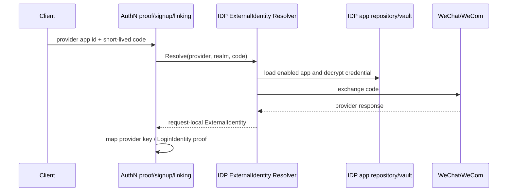

# 外部身份解析与 AuthN 协作

> 状态：已实现 · 本文解释 code/openid/unionid/wecom userid 怎样跨过 provider 边界，但不会把外部声明直接当成 IAM User。

## 1. 核心链路



IDP 证明“provider 对这次 code 返回了什么”；AuthN 再决定该外部标识对应哪个 LoginIdentity/User，是否允许注册、登录或绑定。

## 2. Resolver 的 fail-closed 检查

`application/idp/externalidentity.Resolver` 在 IDP 边界内逐项检查：

1. repository 与 Vault 已装配；
2. app 能按 AppID 查询；
3. app 类型与场景相符：小程序为 `MiniProgram`，开放平台网站为 `OpenPlatformWebsite`，企微沿用现有登记表的 `MP`；
4. app 当前 enabled；
5. AuthSecret 存在；
6. 密文可解密。

Resolver 只返回 IDP 分类错误，不依赖 AuthN 或 HTTP 错误码。登录 proof、signup 与 linking 分别把分类错误映射回既有公开 code/message，保留三个用例原有差异。结构化日志只记录 provider、realm 和错误分类，不记录 code、secret、token 或完整 provider 响应。

显式 app type 校验很关键：同一个微信生态里，小程序、公众号、网站开放平台的 code 语义和 API 不同。只凭 appID 存在就调用错误 endpoint，既会造成失败，也可能混淆登录边界。企微当前没有新增独立存储枚举，Resolver 显式将 `wecom` 映射到历史 `MP` 类型，以在不做数据迁移的前提下防止跨类型取密钥。

## 3. 三类外部标识不能混为一谈

- openid：通常只在某个 app 范围内稳定；
- unionid：满足微信开放平台条件时跨多个关联 app 稳定；
- wecom userid/open user id：属于企业微信身份域。

它们都不是 IAM UserID。AuthN 把 provider、realm/app 和 identifier 组合成 ProviderKey；需要跨 realm 去重时才使用 GlobalIdentifier。不能在没有 provider/realm 的情况下用裸 openid 查 User。

## 4. code 是一次性 proof，不是 Credential

小程序 jsCode、网站 OAuth code 和企业微信 code 都是短期交换材料。它们应尽快提交 provider，且不能持久化为长期 AuthN Credential。

典型安全链：

```text
OAuth state/nonce 校验并消费
  -> IDP Resolver(app/type/secret/code exchange)
  -> request-local ExternalIdentity
  -> LoginIdentity lookup/ensure
```

OAuth state 的创建和消费属于 AuthN Challenge；provider API 交换属于 IDP adapter；LoginIdentity 归属判断再回到 AuthN。这种边界避免 IDP adapter 顺手创建 User 或签发 IAM token。

## 5. 为什么外部交换在本地事务外

provider 网络调用可能超时、限流或返回业务错误。SignUp 在 Prepare 阶段先调用 IDP Resolver，之后才进入 MySQL UoW 创建 User/LoginIdentity/Credential。

好处是数据库事务短；代价是外部 proof 与本地 commit 之间存在时间差。当前依赖 provider code 的一次性交换和 prepared result 的请求内生命周期来约束，不会把 prepared result 持久化后长期复用。

## 6. ExternalIdentity 与 provider adapter 的当前形态

`domain/idp/externalidentity.ExternalIdentity` 是不可持久化、不可序列化的请求内值对象，只包含 provider、realm、受限标识集合和 exchange 成功时间。它不包含 code、AppSecret、session key、access token、provider 原始响应或 IAM 主体标识，也不能直接交给 Authenticator 登录。

`infra/wechat/IdentityProviderImpl` 实现 IDP application 的 provider exchanger port：

- 微信小程序与开放平台委托 `wechatapi.AuthProvider`；
- 企业微信仍通过 silenceper SDK 并使用共享 SDK cache；
- 返回最小的 openID/unionID/userID，而不返回整个 provider response。

这种 anti-corruption layer 让 IDP domain/application 和 AuthN 都不依赖第三方 SDK 类型。AuthN 只消费 `Resolver` 和标准化结果，再按 SignIn、SignUp、Linking 的既有策略映射为 ProviderKey 或认证输入。

Identity v2 protobuf 中同名的 `ExternalIdentity` 是历史 transport 契约；当前 handler 仍未使用它。本次 IDP 请求内值对象没有进入 REST、gRPC、SDK、缓存或数据库，两者不能互相替代。

## 7. 错误和可用性边界

| 故障 | 当前语义 |
| --- | --- |
| app 不存在/禁用/类型不符 | proof 或 linking 失败 |
| master key 错误/密文损坏 | 解密失败，fail closed |
| provider 超时/限流 | 本次认证失败，不创建本地事实 |
| provider 返回空 openid | adapter 明确报错 |
| Redis SDK cache 故障 | 取决于 provider SDK 调用，不能降级为可信身份 |

不能在 provider 不可用时用旧 code、仅客户端上报的 openid 或缓存的身份声明“降级登录”。认证降级的安全方向必须是拒绝，而不是扩大信任。

## 8. 备选设计

### IDP 直接维护 User

减少一次映射层，但会把 provider 生命周期和业务身份生命周期绑死，多 provider 合并、解绑、封禁和审计都会困难。当前由 AuthN LoginIdentity 显式映射。

### 每个 provider 建独立登录表

开始简单，长期会复制状态、唯一性和查询逻辑。ProviderKey 把共同不变量统一，同时保留 provider adapter 差异。

### 直接信任客户端提交 openid

客户端无法证明 openid 属于自己，等价于允许冒充。必须以短期 code/token 调 provider 验证，或验证 provider 签名的可信声明。

## 9. 面试追问

### openid 和 unionid 为什么都需要？

openid 通常是 app-scoped 的稳定键，unionid 可在满足条件的关联应用间识别同一微信主体。用 unionid 合并账户前仍需明确平台边界和冲突策略，不能无条件覆盖既有归属。

### IDP 成功为什么不等于登录成功？

它只证明外部 provider 返回的身份。IAM 还要找到 LoginIdentity、检查其与 User 状态、记录认证结果、建立 Session 和签发 token。

### 第三方不可用时能否缓存登录结果？

缓存长期外部身份会把一次性 proof 变成可重放凭据。可以缓存 provider app token 和公开配置，但用户认证 proof 的复用必须有独立、可审计的本地会话机制，也就是 AuthN Session，而不是绕过验证。

## 10. 事实来源与验证

- value object：`internal/apiserver/domain/idp/externalidentity`
- resolver：`internal/apiserver/application/idp/externalidentity`
- AuthN proof/linking/signup：`internal/apiserver/application/authn/{signin,linking,signup}`
- AuthN mapper：`internal/apiserver/application/authn/externalidentity`
- adapters：`internal/apiserver/infra/wechat`、`internal/apiserver/infra/wechatapi`
- composition：`internal/apiserver/container/idp`、`internal/apiserver/container/authn`

```bash
go test ./internal/apiserver/application/idp/... ./internal/apiserver/application/authn/signin/... ./internal/apiserver/application/authn/linking ./internal/apiserver/application/authn/signup ./internal/apiserver/container/idp
```
