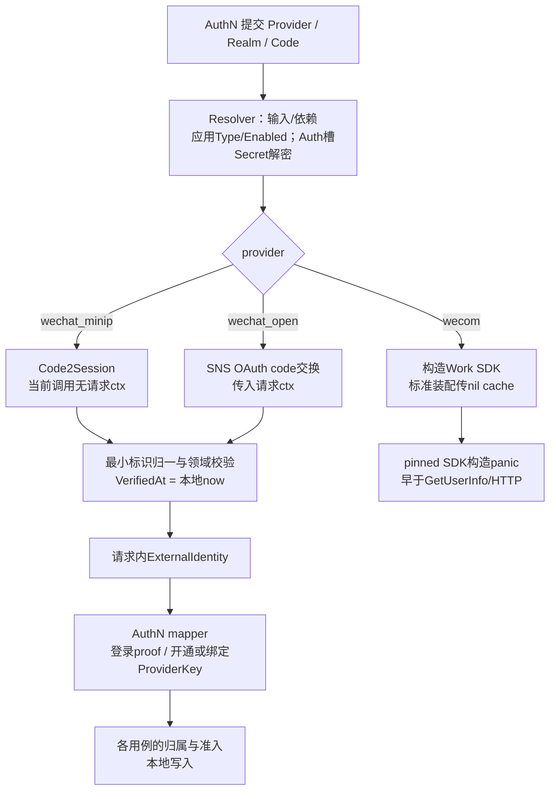
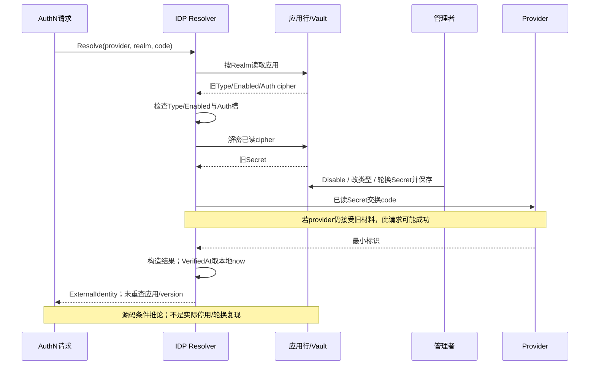

# 外部身份解析与 AuthN 协作

> 状态：已实现 · 本文维护标准 Resolver 的来源合同、三个 provider adapter、标识/时间交接及分类错误。企微装配、在途状态变化和取消结果按源码推论标记；没有用替身测试代替 provider 接受。

## 1. 结论：统一解析入口，保留不同用例的决策

IDP 用应用配置和秘密交换外部 code，将最小结果交给 AuthN；AuthN 才决定查找、开通或绑定哪个登录入口。ExternalIdentity 的字段有效不独立证明来源、用途或新鲜度：当前信任来自组合根安装的标准 Resolver/Exchanger，用户无法通过一个直接的 Resolver REST/gRPC 接口提交该对象。

三个具体情境说明为什么不能只画“code → 身份 → 登录”：

| 情境 | 当前结果 | 设计上需要区分什么 |
| --- | --- | --- |
| app 已登记，却用小程序入口访问网站类型 | Resolver 在交换前返回 type mismatch | 登记存在与认证 surface 准入不同；同生态也不能混用类型 |
| 企微结果只有 OpenUserID | 可构造 ExternalIdentity、进入登录查询；Link 的 ProviderKey 仍要求 UserID，映射失败 | 解析能识别某个标识，不表示每个用例都能建立长期入口 |
| 网站 state 已消费，随后 provider 超时或本地保存失败 | 后续用例失败，state 不恢复；code 是否已被 provider 消费需另证 | 本地拒绝、外部请求结果和一次性材料恢复不是一个事务 |

本文拥有解析与交接合同；User/LoginIdentity 保存、准入、Session 和绑定完整链分别归[SignUp](../02-AuthN/02-注册登录与身份绑定.md)、[Login](../02-AuthN/04-关键链路-Login登录认证.md)与[Linking](../02-AuthN/03-关键链路-Linking登录身份绑定.md)。应用秘密、并发更新与 AppToken 两层缓存归[凭据主文](01-应用凭据与AppToken缓存.md)。

## 2. ExternalIdentity 保存结构，可信来源由端口负责

### 2.1 值对象的不变量与实际边界

[领域对象](../../../internal/apiserver/domain/idp/externalidentity/external_identity.go)包含私有 provider、realm、identifiers、verifiedAt。构造时新建标识集合，getter 返回防御拷贝；不是把 SDK response 暴露给 AuthN。

| 内容 | 当前构造规则 | 不能据此推出 |
| --- | --- | --- |
| Provider / Realm | 仅 wechat_minip、wechat_open、wecom；Realm trim 后非空 | realm 属于某个业务组织、caller 获准使用此应用 |
| Identifier | kind 限定、value trim 非空；相同 kind/value 去重，同 kind 不同值拒绝 | 字符集/长度上限、provider 已认证这个值 |
| 微信标识 | OpenID 必需，UnionID 可选；拒绝企微 kind | 两个 provider 或任意平台账户拥有同一全局用户 |
| 企微标识 | UserID/OpenUserID 至少一项；拒绝微信 kind | 两项可互换，或 Link 必然能建 ProviderKey |
| VerifiedAt | 必须非零；标准 Resolver 取交换完成后的本地 now | provider 签发时间、期限、非未来时间或最近一次成功登录 |

对象不含 code、AppSecret、session key、provider token、raw response、IAM UserID/Subject。**当前没有它的 REST/gRPC、缓存或仓储投影**；这描述现行调用路径。私有字段和没有持久化 adapter，不是拒绝序列化/持久化的机制；导出的 New 也不验证签名、proof ID、purpose、目标 User、到期或消费记录。

长期保存外部标识用于 LoginIdentity 映射是现有设计；把旧解析结果再次当作新认证才会改变证明寿命。Realm 表示 appID/corpID 等外部范围，与 OrgID 分开。

### 2.2 来源和请求关联的责任

标准 [Resolver](../../../internal/apiserver/application/idp/externalidentity/resolver.go)把请求 Provider 和 trim 后 Realm 直接用于结果，按该 Realm 查询应用/交换 code。[AuthN mapper](../../../internal/apiserver/application/authn/externalidentity/mapper.go)不普遍重比结果与原请求：

- Wechat mapper 接受 mini/open 两类；mini 与网站 proof 使用返回 Realm，未核对返回 Provider 是否正是该 surface。
- SignUp mini 和三类 Link 使用通用 ProviderKey mapper，它能接受三种 provider。
- Wecom mapper要求 provider=wecom，但不比较返回 Realm 与输入 CorpID。

所以替换 Resolver 的责任包含“结果来自本次请求的 provider/realm”。这不是当前公开接口可伪造该对象的证明，也不能把一个测试替身成功返回的结构当成独立认证。IDP app repository 的 key 查询合同同样受信；Resolver 没有另比返回 app.AppID 与请求 Realm，也没有独立 realm allowlist。

## 3. Resolver 的前置、顺序与错误分类

NewResolver 只保存 Dependencies，不提前检查健康或每个 provider 的实际可用性。Resolve 按以下顺序执行；依据[实现](../../../internal/apiserver/application/idp/externalidentity/resolver.go)：

| 顺序 | 当前检查 | 返回的分类 |
| --- | --- | --- |
| 1 | trim Realm/Code，Provider 合法且两者非空 | invalid_request |
| 2 | Apps、Vault、Exchanger 接口已提供 | unavailable |
| 3 | WeCom 的服务端 AgentID trim 后非空；早于查应用 | provider_configuration_missing |
| 4 | GetByAppID；查询故障与 nil app 分开 | app_query_failed / app_not_found |
| 5 | mini=MiniProgram、open=OpenPlatformWebsite、wecom=MP | app_type_mismatch，含 Expected/Actual |
| 6 | app.IsEnabled() | app_disabled |
| 7 | Cred/Auth 指针存在，再 Vault.Decrypt(cipher) | credential_missing / secret_decrypt_failed |
| 8 | 对应 exchanger 返回错误，或最小标识构造失败 | provider_exchange_failed / invalid_provider_response |

“Auth 槽存在但 cipher 为空”不在第7步的指针缺失分支，本地 Vault 通常归解密失败；Resolver 本身没有另检解密结果非空，标准 AuthProvider 还有输入检查。返回的错误经 ResolutionError 分类并保留 cause；panic 不在这套返回错误合同内。

三路最小结果及现行企微断点如下。图展开正常前置通过后的路径，失败分类由上表维护：


```mermaid
flowchart TB
    A["AuthN 提交 Provider / Realm / Code"] --> R["Resolver：输入/依赖<br/>应用Type/Enabled；Auth槽<br/>Secret解密"]
    R --> P{"provider"}
    P -->|"wechat_minip"| M["Code2Session<br/>当前调用无请求ctx"]
    P -->|"wechat_open"| O["SNS OAuth code交换<br/>传入请求ctx"]
    P -->|"wecom"| W["构造Work SDK<br/>标准装配传nil cache"]
    M --> I["最小标识归一与领域校验<br/>VerifiedAt = 本地now"]
    O --> I
    W --> X["pinned SDK构造panic<br/>早于GetUserInfo/HTTP"]
    I --> E["请求内ExternalIdentity"]
    E --> B["AuthN mapper<br/>登录proof / 开通或绑定ProviderKey"]
    B --> D["各用例的归属与准入<br/>本地写入"]
```

Enabled 是交换前读到的状态，Resolver 不锁应用行、不绑定凭据版本，也不在交换后重查。与 AppToken Get/Refresh 只要求应用存在的规则不同，不能统一称为“IDP 已检查应用启用”。

## 4. 三个 provider adapter 的具体差异

### 4.1 HTTP、结果裁剪与取消

[IdentityProviderImpl](../../../internal/apiserver/infra/wechat/identity_provider.go)实现 ProviderExchanger，[AuthProvider](../../../internal/apiserver/infra/wechatapi/auth-provider.go)封装微信调用；行为绑定[go.mod](../../../go.mod)的 silenceper/wechat v2.1.11。

| 路径 | 当前外部调用与检查 | 交给 Resolver / 请求预算 |
| --- | --- | --- |
| 小程序 | Code2Session；SDK检 errcode/JSON，IAM要求原始 OpenID 与 SessionKey 非空 | 只交 OpenID/UnionID；SessionKey留在中间结果。IAM调无ctx版本，SDK用Background |
| 网站开放平台 | SNS oauth2/access_token；SDK检 errcode/JSON，IdentityProvider要求原始 OpenID 非空 | 只交 OpenID/UnionID；OAuth access/refresh/expiry/scope 被裁掉。GetUserAccessTokenContext传请求ctx |
| 企微 | 当前标准nil-cache构造先panic；非nil注入后才可能走GetAccessToken→auth/getuserinfo | SDK userid→UserID，SDK openid→内部命名OpenUserID；无请求ctx方法 |

网站路径没有再调 userinfo/sns/auth，也没有校验 token/expiry/scope 各字段非空或正数；它维护最小身份交换，不承诺已拉取用户资料或完整 OAuth token 合同。两个微信 adapter 的原始非空检查后，Resolver 还会 trim 标识并按领域规则拒绝空结果。

小程序 code2Session、网站 SNS OAuth 不调用 IAM AppToken 服务；SNS用户授权 token 与应用 AppAccessToken不同。SDK默认使用 http.DefaultClient，这些 adapter 未配置固定 HTTP timeout；网站可继承 caller deadline，小程序/企微不能据接受ctx参数就承诺请求取消终止HTTP。

### 4.2 企微的装配断点与字段含义

[标准 IDP infra](../../../internal/apiserver/container/idp/infra.go)已创建微信SDK Redis cache，却把 nil 作为 NewIdentityProvider 的第二参数。[adapter](../../../internal/apiserver/infra/wechat/identity_provider.go)将它交给 WorkConfig.Cache；pinned SDK 的 NewWorkAccessToken 构造要求 cache，nil时panic，早于 GetUserInfo。

该路径只有服务端 AgentID 和应用/type=MP/Enabled/解密等前置都通过才到达；缺配置或前置拒绝仍按第3节分类返回。这里是已核对依赖源码的标准路径推论，**没有真实企微请求复现**。Resolver没有recover将其转成ResolutionError，具体传输入口的恢复结果需另外验证；装配非nil capability不能证明请求期正常。

若后续给 adapter 注入非nil cache，使其可以继续，SDK GetUserInfo先取企业应用token，再请求用户信息；当前使用无ctx方法。SDK响应字段是 userid/openid/user_ticket/external_userid，IAM只返回前两项；内部 OpenUserID来自 SDK.OpenID，不能误写为读取 provider 的 open_userid 字段。缓存/HTTP联合行为与标识迁移都须单独验证，不能只接上cache便宣称企微兼容完成。

### 4.3 MP 是现行映射，历史兼容仍要独立证据

[枚举](../../../internal/apiserver/domain/idp/wechatapp/types.go)中 MP 注释为公众号；Resolver 对WeCom显式复用MP。应用表只有普通type字符串与AppID唯一键，没有独立企业类型、corp/agent材料归属字段。[000005基线](../../../internal/pkg/migration/migrations/000005_bootstrap_system_data.up.sql)只登记MiniProgram，没有企微回填。

[000023](../../../internal/pkg/migration/migrations/000023_retire_legacy_authn_tables.up.sql)对 wc-com→wecom、realm和既有LoginIdentity归属对账，不核验IDP登记Type/Secret/SDK cache。于是“代码保留MP映射”与“历史企业应用都按MP登记且可用”是不同结论，本轮没有后者的数据库/部署证据。

后续接受至少绑定目标环境的wecom LoginIdentity realm、对应WechatApp存在/类型/状态、服务端AgentID与当前Secret实际交换结果。应用/Secret不能写入公开验收输出；迁移和真实接受不由SQLite装配或现行枚举证明。

## 5. AuthN 怎样把最小标识变成登录入口

### 5.1 provider、realm 与 global 的配对

| 当前路径 | 长期 ProviderKey | GlobalIdentifier / 查找差异 |
| --- | --- | --- |
| 小程序 | wechat_minip + AppID + OpenID | 可用UnionID；登录还有canonical/legacy回退，完整规则归Login |
| 网站 | wechat_open + AppID + OpenID | 可用UnionID；与mini是不同provider |
| 企微绑定 | wecom + CorpID + UserID | 无global；ProviderKey不接受仅OpenUserID |
| 企微登录 | 按CorpID先找UserID，必要时找OpenUserID | 首次未找到且无查询错误才回退；UserID已找到但入口状态拒绝，不另找OpenUserID |

依据：[mapper](../../../internal/apiserver/application/authn/externalidentity/mapper.go)、[ProviderKey](../../../internal/apiserver/domain/authn/loginidentity/key.go)、[企微策略](../../../internal/apiserver/domain/authn/authentication/wechat-com.go)。AuthN global唯一性是provider+global_identifier，没有额外微信平台账户维度；相同UnionID字符串不自动跨mini/open合并。数据库裁决、canonical归属与附加realm规则归[AuthN模型](../02-AuthN/01-领域模型与认证策略.md)。

例如受信企微结果{CorpID=C, UserID空, OpenUserID=O}：领域对象成立，登录策略可以查询wecom/C/O；Link随后NewWecomProviderKey(C,空)失败。若两项分别指向不同入口，当前登录优先UserID，并未定义账户合并。新增统一标识模型必须先定兼容和冲突合同。

### 5.2 VerifiedAt 的去向不同

| 用例 | 当前对交换时间的处理 |
| --- | --- |
| SignIn | proof只带标识，不携带VerifiedAt；成功Principal.AuthenticatedAt由认证策略另取time.Now.UTC |
| Link新建 | Builder.WithVerifiedAt保存此次本地交换完成时间 |
| Link复用 | 返回既有入口，不更新VerifiedAt或顺便补UnionID |
| SignUp | prepared只保ProviderKey等资料，没有VerifiedAt；Builder不调用WithVerifiedAt |

依据：[proof](../../../internal/apiserver/application/authn/signin/proof/oauth.go)、[Link builder](../../../internal/apiserver/application/authn/linking/linker.go)、[复用](../../../internal/apiserver/application/authn/linking/link_ensure.go)、[SignUp构建](../../../internal/apiserver/application/authn/signup/step_ensure_login_identity.go)。LoginIdentity.VerifiedAt不能被消费者当成最近一次登录/绑定证明；统一保存和新鲜度判定是候选合同。

## 6. 一次性材料、在途变更与本地提交

### 6.1 网站 state 与 provider code 不是同一消费记录

| 入口 | 交换前的当前步骤 |
| --- | --- |
| mini/WeCom登录、公开mini注册 | 无共同OAuth state步骤，交对应code到Resolver |
| 网站扫码登录 | VerifyAndConsume state后才比AppID，再Resolve；AppID不匹配也已消费state |
| Complete网站绑定 | 消费state，再检查state.UserID/非零ExpectedUserID，然后Link最近认证检查和Resolve |
| 内部直接Link输入 | Link最近认证检查后交换；不自行消费网站state |

网站完成入参没有nonce对照，不能写成所有provider共有“state/nonce校验并消费”。Complete的内部ExpectedUserID=0会跳过归属比较；公开Actor/用户准入与最近认证完整规则回链[Linking](../02-AuthN/03-关键链路-Linking登录身份绑定.md)。

Resolver没有本地spent-code表或幂等结果缓存；再次调用会再次提交code。provider的重复code行为、超时是否已执行，本轮没有真实证明。state已消费→provider超时→原state重试，不会恢复发起上下文；用例可能在交换前已拒绝，也可能交换完成后才本地失败。恢复要明确重新发起证明，不能把ExternalIdentity加TTL便视为一次性票据。

### 6.2 停用在途应用不能撤回已读Secret


```mermaid
sequenceDiagram
    participant A as AuthN请求
    participant R as IDP Resolver
    participant D as 应用行/Vault
    participant M as 管理者
    participant P as Provider
    A->>R: Resolve(provider, realm, code)
    R->>D: 按Realm读取应用
    D-->>R: 旧Type/Enabled/Auth cipher
    R->>R: 检查Type/Enabled与Auth槽
    R->>D: 解密已读cipher
    D-->>R: 旧Secret
    M->>D: Disable / 改类型 / 轮换Secret并保存
    R->>P: 已读Secret交换code
    Note over R,P: 若provider仍接受旧材料，此请求可能成功
    P-->>R: 最小标识
    R->>R: 构造结果；VerifiedAt取本地now
    R-->>A: ExternalIdentity；未重查应用/version
    Note over A,D: 源码条件推论；不是实际停用/轮换复现
```

交换后没有type/status/credential generation再核验；应用更新时间和VerifiedAt未组成撤销屏障。真实provider是否继续接受旧Secret需其合同和本次运行结果，不能由本地SQL判断。单次先读准入的收益是避免把网络等待持在应用锁内，代价是停用/轮换对在途请求的有限效力。

SignUp在开启**自身**UoW前完成Prepare/Resolve；若context已借用宿主事务，外部调用仍可能发生在外层事务存续期。Link只准备后写LoginIdentity，不是SignUp三仓储UoW。本地rollback不能撤回Challenge消费或provider操作；完整保存、补偿和重试合同由各用例维护。

## 7. 分类错误、公开结果与日志是三层证据

[ResolutionError](../../../internal/apiserver/application/idp/externalidentity/resolver.go)的Error()只给provider/realm/kind，Unwrap保留内部cause；IDP不依赖AuthN错误码。[AuthN映射](../../../internal/apiserver/application/authn/externalidentity/errors.go)后还要看外层用例：

| Resolver分类 | Login最终应用code | Link最终应用code | mini SignUp最终应用code |
| --- | --- | --- | --- |
| app查询/不存在/停用/凭据缺失/解密失败 | 102409 ProofBuildFailed | 100005 InvalidArgument | 100005 InvalidArgument |
| app_type_mismatch | 104004 WechatAppTypeMismatch | 104004 WechatAppTypeMismatch | 100005 InvalidArgument |
| provider_exchange_failed / invalid_provider_response（普通故障） | 100008 InternalServerError，保留cause | 102305 InvalidCredential | 100005 InvalidArgument |

Login把交换失败保为AuthenticationStageError，[SignIn](../../../internal/apiserver/application/authn/signin/sign_in.go)按认证阶段包装；其他有code错误保留其code。MapSignupError内部可以先产生104004/102305，但[Prepare.Run](../../../internal/apiserver/application/authn/signup/step_prepare.go)对任意准备错误重新WithCode(100005)。只测mapper不能证明注册整体公开code。

取消还不同：交换cause若是Canceled/DeadlineExceeded，Login保留错误链，[gRPC mapper](../../../internal/pkg/grpc/error_mapper.go)先映射取消/超时；Link/SignUp的%v编码失去cause。此为源代码路径推论，不是三个公开transport的联合取消实测，且不能据它推导小程序HTTP已经结束。

结构化“外部身份解析失败”日志由MapLoginProofError写，不由Resolver统一写；字段为action、credential_kind、provider、realm、error_kind。Link/SignUp mapper不调用它。现有sentinel测试只验证一次受控Login映射；SDK部分HTTP错误内部URI可带code/secret，cause与其他日志并不天然脱敏。公开安全错误、内部排障材料和日志审计各自验证。

## 8. 公开可达性与受信兼容输入

没有直接输出ExternalIdentity的Resolver REST/gRPC/SDK API。公开链经AuthN Login、mini SignUp、Link消费；IDP三个gRPC方法维护AppSecret/AppToken，不能代替用户证明解析。网站Authorize/CompleteLink当前是REST能力，gRPC没有对应网站Link/Authorize方法；协议、Actor与服务准入归[契约治理](../../04-接口与SDK/01-REST-gRPC与契约治理.md)。

内部mini SignUp若输入非空OpenID，优先构建TrustedLegacyInput，即使同时给JSCode也不Resolve；这个标签不是独立信任校验。当前[REST](../../../internal/apiserver/transport/rest/authn/handler/onboarding.go)与[gRPC](../../../internal/apiserver/transport/grpc/service/authn/auth_signup_service.go)只投影AppID+JsCode，不给公开客户端OpenID/UnionID注册分支。内部兼容用途及其调用方责任归SignUp。

[Identity v2](../../../api/grpc/iam/identity/v2/identity.proto)同名ExternalIdentity只有provider/external_id/display_name，属于历史transport；现行User mapper返回空列表，没有把IDP对象投影到它。两个同名类型没有共同证明语义，增加其字段不是解析结果出站设计。

## 9. 候选设计：先确定哪条责任需要改变

| 候选 | 具体收益 | 代价 / 尚未解决 |
| --- | --- | --- |
| 保持用途无关Resolver，AuthN复核预期provider/realm | 换adapter/测试替身时显式拒绝错配；所有surface有共同交接合同 | 每个caller及错误兼容要同步；不证明provider已接受或解决重放 |
| 用途/目标主体/期限绑定的验证票据 | 若需跨请求交接，明确audience、purpose、request ID与来源；可选自包含票据或不透明句柄加受保护记录 | 自包含签名票据需密钥治理；各方案仍需投影、消费与重试合同，只签名加TTL不保证一次性 |
| 企微cache装配、字段模型和企业类型分别治理 | 先移除实际SDK断点，再明确userid/openid的查找/绑定及corp/agent材料归属 | 现有MP登记、旧入口和冲突需迁移验证；接上cache不能证明历史兼容 |
| 三adapter统一ctx/HTTP预算与最小响应合同 | 请求取消和超时可测，定义哪些字段必需及哪些错误可公开 | provider执行可能早于取消，code结果未知仍需恢复；不得记录完整URL |
| 绑定应用generation并定义交换后停用政策 | 明确读时准入还是完成时有效，必要时拒绝旧代次结果 | 所有writer参与，补读只缩小窗口；锁住网络调用带来连接/锁成本 |
| 分开state失败与provider结果未知的恢复 | 可区分未发起、已发起未知、已验证但本地失败，再选择重新发起/查询用例结果 | 需要AuthN持久回执/幂等和秘密期限；长期缓存ExternalIdentity不能替代Session |

这些是待选择的合同，本文没有修改adapter、迁移、认证或错误行为。账户等价关系与OIDC/broker取舍归[信任模型](03-外部身份信任模型与方案演化.md)，具体凭据代次/缓存/主密钥候选归凭据主文。

## 10. 事实来源与验证范围

| 现有证据 | 能证明 | 不能证明 |
| --- | --- | --- |
| domain ExternalIdentity tests | 归一/去重、provider标识集合、非零上下文 | 来源/请求绑定、年龄、序列化禁令或独立防重放 |
| Resolver tests | repo/Vault/exchanger stub的分类、派发、空标识、deadline cause、服务端AgentID | 实际SDK HTTP取消、企微nil-cache路径、真实code消费 |
| AuthN mapper tests | mapper层code/message、认证阶段包装 | Prepare再次包装后的全部公开响应 |
| Link/scan proof tests | 单次Resolve、新建VerifiedAt；scan的真实Challenge+内存仓储证明state消费/AppID顺序 | 外部provider接受、真实Actor/mTLS、在途停用屏障 |
| CompleteLink tests | fake verifier下的用户条件、错配后不调用Link | fake不消费state；真实消费后再检查UserID的顺序本篇另由源码证明 |
| SignUp tests | Resolve先于自身UoW；legacy不交换、三仓储编排 | 宿主外层事务不存在、外部操作与本地提交共同回滚 |
| 企微策略tests | 替身仓储下UserID优先/OpenUserID回退 | 实际adapter成功、两标识冲突合并或历史登记兼容 |
| 结构/装配护栏 | 指定AST依赖禁止、源码片段；SQLite/miniredis能力/cache族 | 任意SDK依赖、真实Resolve、所有序列化/安全行为 |

infra/wechat没有测试文件；infra/wechatapi现有测试只覆盖授权URL构建，未覆盖三个实际交换。领域防御拷贝可从代码核对，当前领域测试也没有独立覆盖它。依赖实现已按pinned版本只读核验，没有访问微信、企微、真实数据库或执行轮换。

```bash
# 按变更面选择；不是声明本篇把所有入口重新跑了一遍
go test ./internal/apiserver/domain/idp/externalidentity ./internal/apiserver/application/idp/externalidentity
go test ./internal/apiserver/application/authn/externalidentity ./internal/apiserver/application/authn/signup
go test ./internal/apiserver/application/authn/linking ./internal/apiserver/application/authn/signin/proof
go test ./internal/apiserver/domain/authn/authentication -run '^TestWecomAuthStrategy'
make docs-hygiene docs-facts docs-validation-tests
```

本篇实际执行与复用范围、图源检查及日志绑定归[复核记录](../../_data/reviews/2026-10-06-docs-refactor.md)。下一篇深化[外部身份信任模型与方案演化](03-外部身份信任模型与方案演化.md)，解释这些具体边界下的命名空间、账户归属和替代架构取舍。
