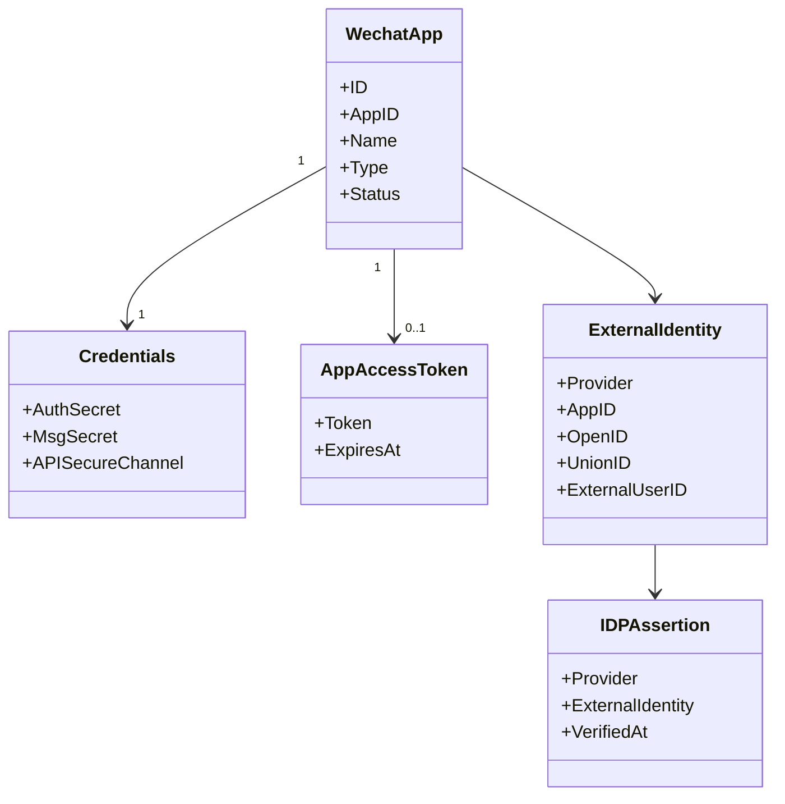

# IDP 领域模型图

```mermaid
classDiagram
    class WechatApp {
        +ID
        +AppID
        +Name
        +Type
        +Status
    }
    class Credentials {
        +AuthSecret
        +MsgSecret
        +APISecureChannel
    }
    class AppAccessToken {
        +Token
        +ExpiresAt
    }
    class ExternalIdentity {
        +Provider
        +AppID
        +OpenID
        +UnionID
        +ExternalUserID
    }
    class IDPAssertion {
        +Provider
        +ExternalIdentity
        +VerifiedAt
    }
    WechatApp "1" --> "1" Credentials
    WechatApp "1" --> "0..1" AppAccessToken
    WechatApp --> ExternalIdentity
    ExternalIdentity --> IDPAssertion
```
