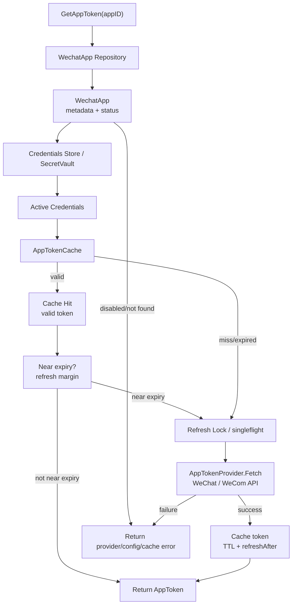
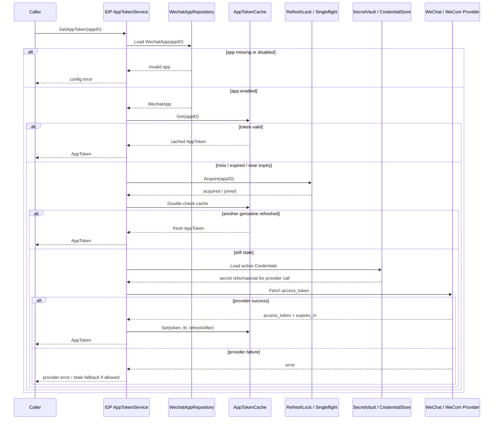

# 关键链路：微信 AccessToken 获取与缓存

> 状态：待补证据
> 第一版正文，待继续按 `application/idp`、`domain/idp`、WechatApp repository、Credentials store、AppToken cache、微信/企微 provider adapter、singleflight/lock、REST/gRPC 契约和测试逐项核对。

---

## 1. 本文回答

本文回答 10 个问题：

- 微信 AccessToken 获取与缓存链路解决什么问题？
- 微信 `access_token` / 企微 `access_token` 为什么不是 IAM `AccessToken`？
- `WechatApp`、`Credentials`、`AppTokenCache`、`AppTokenProvider` 分别承担什么职责？
- 缓存命中、缓存未命中、提前刷新、强制刷新分别如何处理？
- 并发请求同时发现 token 过期时，如何防止击穿微信/企微 API？
- token 刷新失败时是否可以继续使用旧 token？边界是什么？
- 配置变更和密钥轮换如何影响 AppToken cache？
- 外部身份解析、provider callback、业务 API 调用如何复用 AppToken？
- 失败边界、安全策略和可观测性如何设计？
- 修改该链路时应该核对哪些代码和测试？

本文只讲微信/企微 provider access token 的获取与缓存。微信应用配置和密钥轮换见 [02-关键链路-微信应用配置与密钥轮换.md](02-关键链路-微信应用配置与密钥轮换.md)，IDP 领域模型见 [01-领域模型-WechatApp-Credentials-AppToken-ExternalIdentity.md](01-领域模型-WechatApp-Credentials-AppToken-ExternalIdentity.md)。

---

## 2. 30 秒结论

微信 AccessToken 获取与缓存是 IDP 的 provider API 基础设施链路。

它的目标是：

```text
为调用微信/企微外部 API 提供可用的 provider app access token，
并通过缓存、提前刷新和并发控制减少外部 provider 调用。
```

核心主线：

```text
GetAppToken(appID)
  -> load WechatApp
  -> check app enabled
  -> load active Credentials
  -> read AppTokenCache
  -> if valid return cached token
  -> if near expiry try refresh
  -> acquire refresh lock / singleflight
  -> call AppTokenProvider.Fetch
  -> cache token with TTL and refresh margin
  -> return AppToken
```

最重要的边界：

```text
微信 access_token 是外部 provider token；
IAM AccessToken 由 AuthN 签发；
微信 access_token 不能访问 IAM API；
微信 access_token 不代表 IAM 用户已登录；
缓存失败不能被写成认证成功或失败的业务事实；
AppToken 获取不创建 User、LoginIdentity、Principal、Session 或 RoleBinding。
```

如果只记一句话：

> IDP 的 AppToken 只服务外部 provider API 调用，不能和 AuthN 的 IAM AccessToken 混用。

---

## 3. 链路目标

微信/企微很多 API 需要应用级 access token。

典型用途：

```text
调用微信 API 获取 provider 信息；
调用企业微信 API 获取成员信息；
处理 provider callback 或 ticket 相关接口；
辅助 ExternalIdentity 解析；
调用 provider 侧管理接口，具体以业务需求为准。
```

该链路要解决：

```text
如何安全读取 provider app 配置和 secret；
如何减少 provider token API 调用；
如何避免 token 过期瞬间大量请求击穿；
如何处理 provider API 失败；
如何让调用方知道当前 token 是否可用；
如何避免把 provider token 泄露给客户端或 AuthN Token。
```

该链路不是：

```text
IAM 登录认证；
微信 code 登录解析本身；
IAM Token 签发；
Role/Permission 授权检查；
User/Profile/ProfileLink 写入；
Profile 搜索索引更新。
```

---

## 4. 核心对象与职责

| 对象 / 组件 | 所属层 | 职责 | 边界 |
| --- | --- | --- | --- |
| `WechatApp` | domain | provider app 元数据、状态、appid/corpid/agentid | 不是 LoginIdentity |
| `Credentials` | domain/infra | app secret、corp secret、agent secret 等敏感凭据 | 不是 AuthN Credential |
| `AppToken` / `AppAccessToken` | domain/application | provider access token 及过期时间 | 不是 IAM AccessToken |
| `AppTokenCache` | infra/application port | 读写 provider token cache | 不是认证事实源 |
| `AppTokenProvider` | infra adapter | 调微信/企微 token API | 不签发 IAM Token |
| `RefreshLock` / `singleflight` | infra/application | 防并发刷新击穿 | 不改变领域事实 |
| `Clock` | application/domain service | 判断 TTL、refresh margin、过期 | 避免依赖真实时间不可测 |

---

## 5. 链路总览



读图规则：

```text
先检查 WechatApp 是否存在且启用；
再读取 active Credentials；
再读 AppTokenCache；
缓存有效则直接返回；
缓存缺失、过期或接近过期时进入刷新流程；
刷新必须有并发控制；
刷新成功后写入 TTL 和 refresh margin；
刷新失败不能泄露 secret，也不能伪装成 IAM 登录失败。
```

---

## 6. 标准获取链路

### 6.1 主线

```text
load WechatApp
  -> check app enabled
  -> load active Credentials
  -> read AppTokenCache
  -> if valid and not near expiry return cached token
  -> if miss/expired/near expiry acquire refresh lock
  -> double-check cache
  -> AppTokenProvider.Fetch
  -> cache with TTL and refresh margin
  -> return token
```

---

### 6.2 时序图



关键规则：

```text
刷新锁拿到后必须 double-check cache；
避免多个请求排队后重复刷新；
provider success 后缓存 token；
provider failure 时是否 stale fallback 必须明确；
返回给调用方的是内部 AppToken 对象或受控 token，不应直接暴露给前端客户端。
```

---

## 7. 缓存语义

### 7.1 缓存 Key

缓存 key 应包含足够区分 provider app 的维度。

建议维度：

```text
provider；
app type；
appID / corpID / agentID；
credential version，是否包含取决于失效策略；
tenant/domain，若存在多租户隔离。
```

示例：

```text
idp:wechat:app_token:{appID}
idp:wecom:app_token:{corpID}:{agentID}
```

具体 key 格式以当前代码为准。

---

### 7.2 TTL 与 refresh margin

provider 通常返回 `expires_in`。

缓存策略建议：

```text
expiresAt = fetchedAt + expires_in
refreshAfter = expiresAt - refreshMargin
cacheTTL = expires_in - safetyMargin
```

说明：

```text
expiresAt 表达 provider token 的理论过期时间；
refreshAfter 表达本系统开始提前刷新的时间；
cacheTTL 应短于 provider 理论过期时间，避免临界过期；
refreshMargin 应留出网络延迟、时钟偏移和 provider 抖动空间。
```

---

### 7.3 缓存值

缓存值建议包含：

```text
token ciphertext or secure value；
expiresAt；
refreshAfter；
fetchedAt；
provider；
appID；
credentialVersion；
source：cache/provider；
```

安全边界：

```text
缓存中 token 应尽量减少明文暴露；
日志不打印 token；
返回值不进入 IAM AccessToken claims；
缓存读取失败不代表用户认证失败。
```

---

## 8. 缓存命中 / 未命中 / 过期 / 接近过期

| 状态 | 判断 | 行为 |
| --- | --- | --- |
| hit-valid | now < refreshAfter | 直接返回缓存 token |
| hit-near-expiry | refreshAfter <= now < expiresAt | 可返回旧 token 并异步刷新，或同步刷新，取决于策略 |
| expired | now >= expiresAt | 同步刷新，刷新失败通常不能继续使用 |
| miss | cache 不存在 | 同步刷新 |
| corrupt | cache 反序列化失败 | 删除缓存并同步刷新 |

推荐默认策略：

```text
未过 refreshAfter：直接返回；
接近过期：优先刷新，可按调用场景决定是否 stale-while-refresh；
已过期：同步刷新；
缓存损坏：删除后刷新；
刷新失败：按 stale fallback 策略处理。
```

---

## 9. 并发刷新与防击穿

### 9.1 问题

当 token 过期时，大量请求可能同时触发 provider token API。

风险：

```text
击穿微信/企微 API；
触发 provider rate limit；
刷新结果互相覆盖；
旧 token 覆盖新 token；
日志和告警风暴。
```

---

### 9.2 推荐策略

```text
singleflight：同一 appID 同一时间只有一个刷新调用；
distributed lock：多实例部署下跨实例互斥；
double-check：拿锁后再次读取缓存；
version check：写缓存时确认 credentialVersion；
jitter：refresh margin 加随机抖动，避免同时刷新；
rate limit：限制 provider token API 调用频率。
```

---

### 9.3 多实例场景

单实例 `singleflight` 只能保护进程内并发。

多实例还需要：

```text
Redis lock / DB lock / CAS；
缓存 set-if-newer；
credentialVersion 校验；
实例启动时不要同时批量预热所有 token；
刷新失败要退避重试。
```

注意：

```text
是否需要分布式锁取决于当前部署形态和调用频率；
如果当前只有单实例，也应在文档标记为后续扩展点。
```

---

## 10. stale fallback 策略

刷新失败时是否使用旧 token，需要明确。

| 旧 token 状态 | 是否可 fallback | 说明 |
| --- | --- | --- |
| 未过 expiresAt，仅到 refreshAfter | 可以继续使用旧 token | 旧 token 理论仍有效 |
| 已过 expiresAt | 通常不应继续使用 | provider 可能拒绝 |
| 刚过 expiresAt 很短时间 | 不建议，除非明确容忍 | 需要风险边界 |
| provider 明确返回 secret invalid | 不应 fallback | 说明凭据可能已失效 |
| WechatApp disabled | 不应 fallback | 配置已禁用 |
| Credentials rotated | 不应使用旧 credential 生成的新 token | 按 credentialVersion 判断 |

推荐：

```text
near-expiry refresh 失败时，可以返回尚未过期的旧 token；
expired token 刷新失败时，应返回 provider/cache 错误；
secret invalid、app disabled、credential version mismatch 时不 fallback；
所有 fallback 都要记录 metrics 和日志。
```

---

## 11. Credentials 读取边界

AppToken 获取需要读取 provider secret。

要求：

```text
只在刷新时读取 secret；
缓存命中时不读取 secret；
secret 通过 SecretVault/KMS 或加密字段读取；
secret 不进入日志；
secret 不进入 response；
secret 不进入 IAM Token；
secret 读取失败时返回配置或内部错误。
```

边界：

```text
Credentials 是 provider app 凭据；
Credentials 不是 AuthN Credential；
Credentials 不用于校验 IAM 用户密码；
Credentials 不应被 AuthN 直接读取；
AuthN 通过 IDP port 使用 ExternalIdentity 解析能力。
```

---

## 12. 密钥轮换与缓存失效

密钥轮换可能影响 token 缓存。

主线：

```text
Rotate Credentials
  -> detect token-affecting fields
  -> invalidate AppTokenCache(appID)
  -> next GetAppToken fetches token with new credential version
```

必须失效：

```text
app secret changed；
corp secret changed；
agent secret changed；
app disabled；
appID/corpID/agentID changed，若允许。
```

不一定失效：

```text
callback token changed；
encoding aes key changed；
callback URL changed；
app name changed。
```

关键规则：

```text
缓存值应携带 credentialVersion；
读取缓存时应确认当前 active credentialVersion 是否匹配；
旧 credentialVersion 的 token 不应在轮换后继续使用，除非明确允许；
失效 AppTokenCache 不等于撤销 IAM AccessToken。
```

---

## 13. 与 ExternalIdentity 解析的关系

ExternalIdentity 解析可能需要 provider AppToken，也可能不需要。

典型：

```text
小程序 code2session：可能直接用 appid + secret 换 openid/session_key，不一定需要 cached app access token；
公众号 OAuth userinfo：可能需要网页授权 access token，不同于 app access_token；
企业微信 userinfo：可能需要 corp/agent access_token；
provider API 查询用户详情：通常需要 app access token。
```

注意：

```text
不同 provider 的 token 类型不同；
不要把所有 provider token 都简化成一个 AppToken；
如果存在 user-level oauth token，应单独建模，不要混入 app-level AppToken；
本文只讨论 app-level provider access token。
```

---

## 14. 与 Provider callback 的关系

Provider callback 处理通常依赖 Credentials 做验签/解密，不一定依赖 AppToken。

可能需要 AppToken 的场景：

```text
callback 中收到 ticket 后调用 provider API 校验或换取配置；
callback 事件需要拉取 provider 侧详情；
企业微信回调后需要调用接口补充用户信息。
```

边界：

```text
callback 验签成功不等于 IAM 用户登录；
AppToken 获取成功不等于 callback 可信；
callback payload 必须先验签/解密，再决定是否调用 provider API。
```

---

## 15. 失败边界

| 场景 | 期望行为 | 说明 |
| --- | --- | --- |
| WechatApp 不存在 | 返回配置错误 | 不调用 provider |
| WechatApp disabled | 返回配置禁用 | 不使用缓存 token |
| Credentials 缺失 | 返回配置错误 | 不能刷新 token |
| Credentials 解密失败 | 返回内部/配置错误 | 不打印 secret |
| 缓存 miss | 调 provider 获取 | 成功后写缓存 |
| 缓存损坏 | 删除后刷新 | 记录 metrics |
| refresh lock 获取失败 | 等待、重试或返回错误 | 以策略为准 |
| provider 超时 | 返回错误或 fallback | 不应无限重试 |
| provider 返回 secret invalid | 返回配置错误并告警 | 不 fallback |
| provider 返回 rate limit | 退避重试或 fallback | 保护 provider API |
| cache set 失败 | 可返回 token 但告警，或整体失败 | 取决于一致性要求 |
| token 已过期且刷新失败 | 返回错误 | 不默认使用 expired token |

---

## 16. 安全策略

建议：

```text
AppToken 不对前端客户端返回；
AppToken 不进入 IAM AccessToken claims；
日志不打印 AppToken；
日志不打印 app secret/corp secret；
缓存 key 不包含 secret；
缓存值如落地存储应考虑加密；
provider API 调用设置超时；
provider API 调用失败不要泄露 secret 是否正确；
refresh lock 设置过期时间，避免死锁；
刷新失败要有退避，避免 provider API 风暴。
```

---

## 17. 可观测性

建议指标：

```text
idp_app_token_cache_hit_total；
idp_app_token_cache_miss_total；
idp_app_token_refresh_total；
idp_app_token_refresh_success_total；
idp_app_token_refresh_failure_total；
idp_app_token_refresh_duration_seconds；
idp_app_token_stale_fallback_total；
idp_app_token_lock_wait_seconds；
idp_app_token_provider_rate_limited_total；
idp_app_token_cache_set_failure_total；
```

建议日志：

```text
appID；
provider；
credentialVersion；
cache hit/miss；
refresh result；
provider error code；
traceID；
```

禁止日志：

```text
raw app secret；
raw access_token；
raw refresh token，若存在；
session_key；
provider encrypted sensitive payload。
```

---

## 18. 与其他模块的边界

### 18.1 与 AuthN

```text
AppToken 获取不创建 LoginIdentity；
AppToken 获取不创建 Principal；
AppToken 获取不签发 IAM AccessToken；
AuthN 不应直接管理 provider app secret；
AuthN 可通过 IDP port 调用外部身份解析能力。
```

### 18.2 与 Identity

```text
AppToken 获取不创建 User/Profile/ProfileLink；
provider access token 不等于 UserID；
调用 provider API 得到的 claims 不能直接覆盖 Identity 主数据。
```

### 18.3 与 AuthZ

```text
AppToken 不是授权凭证；
AppToken 获取不创建 Role/Permission/RoleBinding；
调用 GetAppToken 的管理接口本身可以受 AuthZ Check 保护；
provider token 不能作为 IAM 资源访问权限依据。
```

### 18.4 与 Suggest

```text
AppToken 获取不维护 Suggest Snapshot；
通过 AppToken 拉到的 provider nickname/avatar 如需进入搜索字段，应先经 Identity 确认，再由 Suggest 用例更新索引。
```

---

## 19. 常见反模式

| 反模式 | 问题 | 推荐做法 |
| --- | --- | --- |
| 微信 access_token 当 IAM AccessToken | provider token 和 IAM token 混淆 | AppToken 只用于 provider API |
| 缓存命中仍每次读取 app secret | 增加 secret 暴露和性能开销 | 命中直接返回 |
| token 过期时所有请求一起刷新 | 击穿 provider API | singleflight / lock / double-check |
| 没有 refresh margin | 临界过期失败 | 提前刷新 |
| 刷新失败默认使用过期 token | provider 调用失败和安全风险 | expired 后失败返回错误 |
| secret invalid 仍 fallback | 配置错误被掩盖 | 告警并返回配置错误 |
| 轮换 secret 不清 token cache | 继续使用旧凭据 token | token-affecting 变更后失效 |
| 日志打印 access_token | 凭据泄露 | 只记录 appID/version/traceID |
| AppToken 返回给前端 | provider 凭据外泄 | 只在服务端内部使用 |
| AppToken 获取失败写成登录失败 | 边界混淆 | 区分 provider infra error 和 AuthN login error |

---

## 20. 代码事实源

| 事实 | 路径 |
| --- | --- |
| IDP domain | `../../../internal/apiserver/domain/idp` |
| AppToken / AppAccessToken | `../../../internal/apiserver/domain/idp`、`../../../internal/apiserver/application/idp`，具体以代码为准 |
| WechatApp | `../../../internal/apiserver/domain/idp` |
| Credentials | `../../../internal/apiserver/domain/idp` |
| IDP AppToken service | `../../../internal/apiserver/application/idp` |
| AppTokenCache | `../../../internal/apiserver/infra` |
| AppTokenProvider / WeChat API adapter | `../../../internal/apiserver/infra` |
| RefreshLock / singleflight | `../../../internal/apiserver/infra`、`../../../internal/apiserver/application/idp`，具体以代码为准 |
| SecretVault / credential store | `../../../internal/apiserver/infra` |
| IDP REST transport | `../../../internal/apiserver/transport/rest` |
| IDP gRPC transport | `../../../internal/apiserver/transport/grpc` |
| IDP container | `../../../internal/apiserver/container/idp` |
| REST 契约 | `../../../api/rest` |
| gRPC 契约 | `../../../api/grpc` |
| 架构测试 | `../../../internal/pkg/architecture` |

注意：上表中的具体路径需要继续与当前源码核对。如果源码目录已调整，应以代码为准并同步更新本文。

---

## 21. Verify

修改本文后至少执行：

```bash
make docs-hygiene
```

涉及 IDP 领域模型：

```bash
go test ./internal/apiserver/domain/idp/...
```

涉及 IDP AppToken 用例：

```bash
go test ./internal/apiserver/application/idp/...
```

涉及 provider adapter、credential store、token cache、singleflight/lock：

```bash
go test ./internal/apiserver/infra/...
```

具体路径以当前代码为准。

涉及 AuthN/Identity/AuthZ/Suggest 边界：

```bash
go test ./internal/apiserver/domain/authn/...
go test ./internal/apiserver/domain/identity/...
go test ./internal/apiserver/domain/authz/...
go test ./internal/apiserver/domain/suggest/...
```

涉及 REST/gRPC 契约或 transport：

```bash
make api-validate
make proto-gen
go test ./internal/apiserver/transport/rest/...
go test ./internal/apiserver/transport/grpc/...
```

涉及 SDK：

```bash
go test ./pkg/sdk/...
```

涉及分层依赖或模块边界：

```bash
go test ./internal/pkg/architecture
```

---

## 22. 本文总结

微信 AccessToken 获取与缓存链路可以压缩成：

```text
GetAppToken(appID)
  -> load WechatApp
  -> check app enabled
  -> load active Credentials
  -> read AppTokenCache
  -> if valid return cached token
  -> if near expiry try refresh
  -> acquire refresh lock / singleflight
  -> call AppTokenProvider.Fetch
  -> cache token with TTL and refresh margin
  -> return AppToken
```

最重要的边界是：

```text
微信 access_token 是外部 provider token；
IAM AccessToken 由 AuthN 签发；
微信 access_token 不能访问 IAM API；
微信 access_token 不代表 IAM 用户已登录；
缓存失败不能被写成认证成功或失败的业务事实；
AppToken 获取不创建 User、LoginIdentity、Principal、Session 或 RoleBinding。
```

下一篇应继续编写 ExternalIdentity 解析链路，说明微信 code、企微 code 或 provider proof 如何被 IDP 转换成 AuthN 可消费的外部身份声明。
