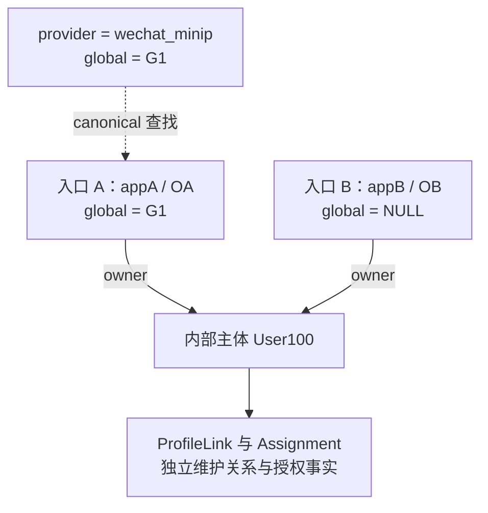
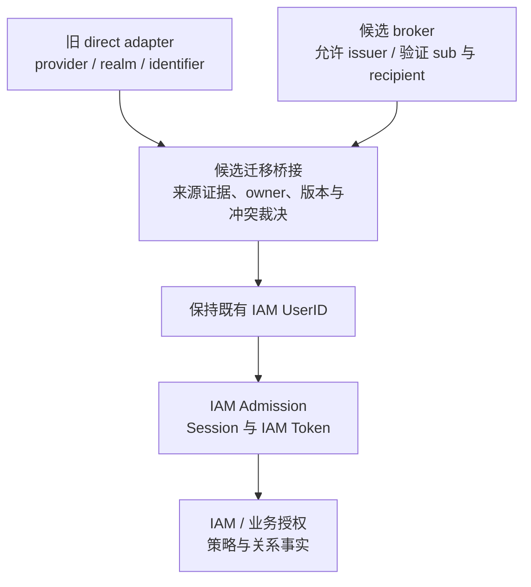

# 外部身份信任模型与方案演化

> 状态：已实现 · 当前设计与设计分析。本文区分源码事实、条件推论和候选方案。候选不表示已实施；真实 provider、历史数据、目标数据库与生产行为尚需独立验收。交换流程见[解析主文](02-外部身份解析与AuthN协作.md)，凭据与缓存见[凭据主文](01-应用凭据与AppToken缓存.md)。

## 1. 结论：证明来源、标识等价、内部归属需要分别成立

一次成功的 provider 交换只为本次请求提供外部标识。AuthN 再查该标识对应的 LoginIdentity/User；登录还要通过当前准入，才能创建 Session。外部字段相同，不自动授权迁移另一个 User 的资料、关系或权限。

当前方案的收益是让多个入口共用稳定 UserID，并将 provider SDK、凭据与协议差异隔离在 IDP。它的代价也很具体：各用例查找顺序不完全相同；global identifier 只保存一个 canonical 锚点；应用配置的变化没有直接贯穿会话撤销。这些是理解当前设计的前提。

| 需要回答的问题 | 当前承载对象或步骤 | 仍不能推出 |
| --- | --- | --- |
| 这次外部标识从哪里来 | 注册应用、服务端交换、Resolver capability | 仅靠客户端 OpenID，或构造一个值对象，就证明来源可信 |
| 两个外部标识是否按当前规则相等 | ProviderKey、provider/global 查找及数据库比较规则 | 相同字符串就是同一个人；跨 provider 自动等价 |
| 标识目前归谁所有 | LoginIdentity → UserID | 操作者有权迁移另一个 User 的历史 |
| 这个 User 此刻能否登录 | SignIn/在线 Verify/Refresh 的 Admission | 注册复用、Link、独立 AuthZ Check 都重新执行同一准入 |
| 此刻能否访问某资源 | AuthZ 策略与业务关系事实 | provider 认证成功就获得 Resource/Action 权限 |

本文讨论这几层如何衔接以及在哪里值得演化，不复制交换、绑定或 Token 的完整执行算法。

## 2. 当前信任锚点：受控注册与交换，不是对象的名字

### 2.1 Resolver 信任的是哪一份应用注册

请求 Provider 选择固定 adapter，Realm 用作 AppID/CorpID。Resolver 按 Realm 查当前全局唯一的 app_id，检查 Type、Enabled 和 Auth 凭据，再解密并交换。当前 mini 要求 MiniProgram，网站要求 OpenPlatformWebsite；企微复用 MP，并使用全局 AgentID。它没有通用外部 issuer 注册表、任意 ID Token 消费或交换后的凭据代次复核。

因此“受信 provider”落在受控应用配置、adapter endpoint 和可信 Resolver 的实现上。请求中自带一个 provider 名称，不能自行扩大允许来源；但应用层也没有从返回字段重新证明 AppID/CorpID 与请求一致。标准 Resolver 提供这项来源与请求关联合同，各 AuthN mapper 的防御检查并不完全相同。

依据：[Resolver](../../../internal/apiserver/application/idp/externalidentity/resolver.go)、[应用 PO](../../../internal/apiserver/infra/mysql/wechatapp/po.go)、[AuthN 映射](../../../internal/apiserver/application/authn/externalidentity/mapper.go)。实际 provider 适配、错误、ctx 和标准 WeCom nil-cache 构造断点由[解析主文](02-外部身份解析与AuthN协作.md)维护。MP 的代码复用不能替代旧生产注册、Agent 与 Secret 的兼容验收。

### 2.2 ExternalIdentity 是受信端口的结果，不是可独立验真的票据

它保存标准化 Provider/Realm/标识及本地 VerifiedAt，不携带 code、AppSecret、provider token、session key 或 IAM UserID。构造器验证字段形状和非零时间；没有自行验签、验证来源、最大年龄、目标用途或单次消费。私有字段和防御拷贝保护对象内容，不能代替这些认证条件。

当前标准流程在请求内交换并消费结果，没有把旧 ExternalIdentity 作为长期登录凭证。若将 Resolver 改成长期结果缓存，旧结果可能支撑新的 AuthN 认证时间；这属于改变受信端口合同的候选改动，不是当前公开入口已允许客户端注入旧证明。内部 SignUp 的 TrustedLegacyInput 也只表示绕过标准交换的调用路径，不是一个独立信任校验器。

短期 proof ticket 只有在确有跨进程交接需求时才值得引入。设计必须分别给出来源、接收方、用途、目标用户、寿命、消费记录及保存失败后的重试语义；不透明句柄和签名票据承担这些条件的方式不同。缓存长期映射与缓存“本次登录已证明”必须分开。

依据：[ExternalIdentity](../../../internal/apiserver/domain/idp/externalidentity/external_identity.go)、[微信登录 proof](../../../internal/apiserver/application/authn/signin/proof/oauth.go)、[SignUp 微信准备](../../../internal/apiserver/application/authn/signup/wechat_signup.go)。网站 state、code 交换和本地保存的失败窗口见[解析主文](02-外部身份解析与AuthN协作.md)。

## 3. 命名空间和 canonical：当前到底保存了什么

### 3.1 两个键，表达两种查找

| 当前键 | 例子 | 作用与限制 |
| --- | --- | --- |
| provider + realm + identifier | wechat_minip / appA / OA | 精确入口键；不同 app/不同 provider 不因字符串相同而等价 |
| provider + global_identifier | wechat_minip / G1 | 当前跨 realm 查找锚点；不含额外 issuer/平台命名空间 |
| wecom / CorpID / UserID | wecom / corpA / employee7 | 当前企微 ProviderKey；SDK userid/openid 映射为内部 UserID/OpenUserID，两者在登录和绑定中的消费不同 |
| IAM UserID | User100 | 内部稳定主体引用；密码、手机号、外部入口均可引用它 |

Provider 当前是有限枚举；ProviderKey 构造会 TrimSpace，不进行统一小写化。不能从通用字段名推断任意协议、任意租户已受支持；企微也没有复用微信 UnionID 的 global 规则。

数据库约束让一个非 NULL 的 (provider, global_identifier) 只由一条 canonical 行持有。相同 User 的附加 realm 行可保存 global=NULL；这保持了 owner 连续性，但没有为每条附加行保留“原来由哪个 G 关联”的证据。

下面是 canonical A 仍 active、附加 B 已创建后的存储示例。虚线是查询锚点，不是另一条外部认证证明。

依据：[ProviderKey](../../../internal/apiserver/domain/authn/loginidentity/key.go)、[Provider 枚举](../../../internal/apiserver/domain/authn/loginidentity/provider.go)、[PO 唯一键](../../../internal/apiserver/infra/mysql/loginidentity/po.go)、[canonical 仓储](../../../internal/apiserver/infra/mysql/loginidentity/repo.go)。创建和解绑的完整裁决见[Linking](../02-AuthN/03-关键链路-Linking登录身份绑定.md)。

### 3.2 Go 字符串与数据库“相等”不是同一个合同

建表/补齐迁移采用 VARCHAR 和 utf8mb4_unicode_ci，普通入口查询没有显式 BINARY/COLLATE。MySQL 的非二进制字符串比较依赖 collation，_ci 表示不区分大小写；不能把当前 SQL 查找描述成 Go 逐字节相等。[MySQL 字符串比较](https://dev.mysql.com/doc/refman/8.0/en/case-sensitivity.html)、[collation 命名](https://dev.mysql.com/doc/refman/8.0/en/charset-collation-names.html)。

[000028](../../../internal/pkg/migration/migrations/000028_authn_global_identifier_unique_guard.up.sql)按数据库比较规则拒绝跨 User 冲突，将同 owner 重复行按 active、绑定时间和 ID 等顺序收敛，再建立 provider/global 唯一键；它没有修改 collation。[000023](../../../internal/pkg/migration/migrations/000023_retire_legacy_authn_tables.up.sql)中的 BINARY 退休对账属于另一项检查，不能扩大为所有运行时查询的比较规则。

这产生一个需要显式选择的设计问题：外部 opaque 标识要按字节、大小写敏感字符还是协议规定的规范形式比较？如果未来改 collation，必须先列出旧规则下等价、新规则下分离的行，以及所有 writer/查询的兼容方案。本轮没有读取目标数据库的实际 schema；SQLite 回归也不能证明 MySQL 的比较与行锁行为。

## 4. 同一输入，登录、注册与绑定为什么会得到不同结果

下表假设外部证明及对应入口前置通过，User 存在；A=(wechat_minip, appA, OA, G1) 属于 User100 且 active。结果为条件源码推论，不代表每一行都已有联合场景测试。这里“注册”指当前 mini SignUp。

| 新输入或操作 | 当前结果 | 设计含义 |
| --- | --- | --- |
| mini appB/OB/G1 登录，B 尚不存在 | 经 global 查到 A，使用 A 的 LoginIdentityID/User100；本次认证 Realm 为 appB，不保存 B | 查询能复用主体，不等于已经绑定该 realm |
| 同输入注册 | 复用 User100，再创建 B；A active 时 B 的 global 为 NULL | 复用主体和新增入口是两个写入判断 |
| User100 Link 同输入；User200 Link 同输入 | 前者可创建 B，后者因 G1 归其他 User 拒绝 | 新证明不授权覆盖旧 owner |
| 换成 wechat_open/appB/OB/G1 | 不经 mini 的 G1 找到 User100 | 当前 global 唯一性与查询仍区分 provider |
| 精确 appA/OA，本次 G2 已属 User200 | 登录、注册优先 A，不检查或改写新 G2；Link 先检查 G2，拒绝 | 不能泛称所有用例都先拒绝 global 冲突 |
| 精确 appA/OA，本次从无 G 变为 G2，或 G1 变为未占用 G2 | 当前复用不补写/替换 global | 以后新 realm 携 G2 不会由该旧映射自动找到 User100 |
| canonical A inactive，新 realm 携 G1 | 登录选到 inactive A 后拒绝；注册/同 owner Link 可创建新入口并转移 G1 | 登录不会自动跳过 inactive anchor 找其他 active 行 |

依据：[登录精确/global 顺序](../../../internal/apiserver/domain/authn/authentication/wechat-identity.go)、[注册找 User](../../../internal/apiserver/application/authn/signup/step_resolve_user.go)、[注册复用入口](../../../internal/apiserver/application/authn/signup/step_ensure_login_identity.go)、[Link 先查 global](../../../internal/apiserver/application/authn/linking/linker.go)。

保留精确入口优先，可以避免一份变化的新 UnionID 直接迁移已有 owner；代价是新 G 不入库、跨 realm 的识别可能分裂。统一冲突策略也不是“每行 G 必须相等”：合法附加行当前保存 NULL。若改变行为，须分别定义新 G 缺失、未占用、同 owner、异 owner 时的登录/注册/绑定政策，并处理当前 canonical 存储模型。

### 4.1 标记 legacy 回退只属于登录

设只有旧行 L=(mini, appA, identifier=G, global=NULL)→User100，并带显式 openid_or_unionid 标记。本次 proof 为 appA/O新/G：

- 登录的精确/global 查找都 miss 后，可按标记回退到 L。
- 注册没有同一 legacy 回退；在其余建用户条件通过时，可创建 User200 与 O新/G canonical。
- Link 也不按该 legacy 标记预查 owner。新精确/canonical 一旦存在，后续登录优先新映射。

这是当前查询组合允许的条件结果。本轮全仓搜索未找到自动为所有旧行补该标记的当前迁移证据；“有回退代码”和“历史数据已兼容”是两项验收。依据：[legacy 查找](../../../internal/apiserver/infra/mysql/loginidentity/repo.go)与[标记门禁测试](../../../internal/apiserver/infra/mysql/loginidentity/repo_legacy_wechat_test.go)。

### 4.2 canonical 转移保 owner，不证明完整外部关联

Unlink A 时，接替者按稳定顺序选第一个同 owner、同 provider 的 active 行；选择器不要求该行 global=NULL，也不验证它原来属于 G1。SQL 转移随后要求目标 global IS NULL。

因此若第一候选已有 G2，即使后面还有 NULL 行，整个解绑也可回滚，而不是继续选下一项。若选到 NULL 行并成功，则只能说明 G1 的内部 owner 延续；当前没有持久化证据让系统从这次转移反推两条入口由 provider 证明为同一外部主体。没有同 provider 接替者、但最后 active 保护已通过时（例如还有 active 手机号入口），G1 留在 deleted A，并未释放给其他 User；若是最后 active 入口，则先拒绝解绑，A 不变为 deleted。

候选演化可以引入独立 ExternalSubject/归属锚点，或为 realm 入口保存受信 G 关联及来源代次。这样才能按同一 G 选择接替者，但必须处理附加 NULL 行的未知历史来源、多个 G 同属一 User、全部写入者和迁移冲突。仅把“选 NULL 行”补进选择器只能解决一项转移失败，不能恢复缺失的关联证据。

依据：[选择策略](../../../internal/apiserver/domain/authn/loginidentity/binding_policy.go)、[Unlink 原子写](../../../internal/apiserver/infra/mysql/loginidentity/repo.go)；当前最后 active 保护与失败后果由[Linking](../02-AuthN/03-关键链路-Linking登录身份绑定.md)维护。

## 5. 失效事件由谁消费：停用应用不直接撤销 IAM 会话

| 变化或故障 | 当前消费点 | 没有完成的联动 |
| --- | --- | --- |
| App disabled / Type 与请求 provider 不匹配 | 交换前读取发现停用或不匹配时拒绝 | 已读 enabled 的在途交换没有交换后复核；已存在 Session 不读 App |
| AuthSecret 轮换 | 覆盖应用材料，后续解密使用新值 | 不自动删除 IAM/SDK 两层 AppToken，也没有所有在途请求的代次栅栏 |
| provider 交换返回错误/缺必需标识 | 本次 proof 失败 | 不根据客户端 OpenID 建立匿名映射；实际超时、取消、panic 边界见解析主文 |
| AppToken 过期或 provider 拒绝 | provider 应用 API/token 边界 | 不能据此推导已有 IAM Session 已撤销 |
| LoginIdentity 非 active、User 非 active | SignIn 和在线 Verify/Refresh 的准入 | SignUp 复用、Link 内部和独立 AuthZ Check 不执行同一完整检查 |
| Session revoked/expired | 在线 Session loader | SDK 本地验签没有在线 Session/User/Admission 状态 |
| 本地保存失败 | 当前用例返回失败 | 不回滚已发生的外部步骤；仅据本地失败不能判定 code 是否已被 provider 消费 |

例如请求已读到 enabled，管理员随后停用，provider 最后返回成功：源码没有在返回后复读 App。另一个用户已经成功登录，再停用 App，只要 Session、User、LoginIdentity 仍满足在线条件，Verify/Refresh 路径继续成立。这是条件时序，不是生产事故复现。

不能把跨 realm 登录的 canonical 行 Realm 直接当本次认证来源：它可能是 appA 的 A，而 Session 记录本次 appB。若希望“停用某应用同时撤销由它建立的会话”，应先定义是否包含跨 realm fallback、何时生效和在途请求处理，再选认证来源索引、撤销任务与代次屏障。只写 App disabled 或删除 AppToken 不会形成这个合同。

主体准入同样按入口理解：SignUp 可复用 blocked User，但不自动解封或创建 Session；Link 自身不读取 UserStatus，REST 在线验证和受信 gRPC actor 是外围合同；AuthZ 独立 Check 判策略，不重新证明 User 此刻允许登录。具体竞态与撤销保证见[AuthN 边界](../02-AuthN/07-模块边界-AuthN与Identity-IDP-AuthZ.md)、[Token](../02-AuthN/05-关键链路-Token签发刷新吊销.md)和[Identity 边界](../01-Identity/04-模块边界-Identity与AuthN-AuthZ-Suggest.md)。

## 6. 账户合并是独立业务设计，普通 Link 不能顺带完成

User17 控制新外部入口，不代表它有权接管 User42 现有映射；当前 Link 对精确键/global 的其他 owner 均拒绝，包括 inactive 的旧归属。注册通过 global 选择既有 User，也没有将两个已经存在的 User 合并。迁移 000023 核对旧映射仍指向同一 owner，承担的是退休对账。

若产品确需“两个账号合一”，下列是候选交付合同，而非当前能力：

| 阶段 | 必须产生的具体结果 | 失败/恢复原则 |
| --- | --- | --- |
| 证明与计划 | 分别重新证明控制两个主体；确定存续 UserID、来源 UserID、请求键和双方版本；输出入口及引用清单 | 仅相同 UnionID/email/姓名不通过；另一 owner 的既有冲突进入人工裁决 |
| 影响裁决 | ProfileLink 的 self/guardian 重复和类型冲突逐项判定；Assignment 按公司/范围审查；明确业务系统保存的 UserID 是否需 alias | 不直接把两边权限做集合并集，避免“合一”扩大访问范围 |
| 冻结与应用 | 阻止来源主体的新写入/新会话；有持久化阶段与条件写；本地可同事务的动作一并提交，跨服务动作有可重试记录 | 版本漂移重新计划；部分跨服务完成不能伪装成全体回滚 |
| 会话与历史 | 按规则撤销/重发会话；保留原 actor/owner 审计；给旧 UserID 的只读定位或受控 alias 定义寿命 | 不让旧 JWT 的 sub 静默获得存续主体全部权限 |
| 验收与恢复 | 输出迁移差异、失败项、入口/关系/权限验证及补偿计划 | 区分可撤回 alias、可恢复关系与已被外部业务消费的不可逆动作 |

这套设计会跨越 Identity、AuthN、AuthZ 与引用 UserID 的业务系统。仅修改 LoginIdentity.user_id 或把 duplicate 当作成功，无法交付它。当前文档重构没有实现合并、冻结或 alias；详见[Identity 主体/关系模型](../01-Identity/01-领域模型-User-Profile-ProfileLink.md)与[AuthZ 模型](../03-AuthZ/01-领域模型设计.md)。

## 7. 从 direct adapter 到 OIDC/broker：先确定新增合同

### 7.1 比较方案时保留内部主体与准入所有权

| 方案 | 可以解决的具体问题 | 必须承担的代价与采用条件 |
| --- | --- | --- |
| 保留内置 adapter + Resolver | 当前微信生态可沿现有 request-scoped 端口接入，AuthN 不直接依赖 SDK | 先补可运行的企微 cache/注册配对、ctx/时限、错误脱敏与真实交换验收；当前替身成功不证明三条链可用 |
| 通用 ProviderApp 注册模型 | 新增协议/租户时表达各自来源、client/注册范围、凭据类型和代次 | 迁移 globally-unique app_id、Type/MP、密文/AAD、两层 cache 和管理面；AuthN 枚举/键/mapper/策略与 SQL 也须配套 |
| IAM 作为 OIDC RP 直接接外部 issuer | 将某来源的标准证明转为 IAM 登录输入 | 新增受控 issuer/注册、回调关联、ID Token 验证与映射冲突合同；现有 IAM JWT codec 不能代替外部 RP |
| 外部 identity broker，IAM 消费其证明 | broker 承担多个上游协议、MFA/federation 的统一接入 | broker 成为认证可用性与信任依赖；需 claims/MFA 信任、source 注册和旧映射桥接，IAM 仍保有内部准入/Session/授权边界 |

这些是本轮基于实现约束的设计比较，不是已采纳的架构决策记录。把 IDP 改成直接维护 User，虽减少调用层，却使 provider 注册/离职/迁移与内部主体生命周期绑定；当前 request-scoped 端口有独立价值，应优先保留。

### 7.2 外部 issuer 与 IAM access JWT 的 issuer 分开

OIDC 的稳定外部键使用 iss+sub；pairwise sub 可随 sector 不同而变化，不能自动恢复跨应用“同一个人”。[OIDC Core §5.7](https://openid.net/specs/openid-connect-core-1_0.html#ClaimStability)、[§8.1](https://openid.net/specs/openid-connect-core-1_0.html#PairwiseAlg)。

采用候选 RP 时，IAM 的接收策略应明确允许的 issuer/注册、recipient、算法/密钥和时间，并依据选定流程核对 ID Token 与 nonce。具体协议规则以[OIDC ID Token 验证](https://openid.net/specs/openid-connect-core-1_0.html#IDTokenValidation)为准。候选还须把授权事务与客户端/浏览器关联，按选定流程明确 PKCE/state/nonce 和多来源混淆防御；这些不是把几个字符串字段都设非空。[OAuth 安全 BCP](https://www.rfc-editor.org/rfc/rfc9700.html#section-2.1)。

当前 SDK AllowedIssuer 检查的是 IAM 签发的 access JWT。broker 的外部 iss 属于另一条接收合同，不能直接替换它，也不能把 broker ID Token 塞进现有 IAM bearer 通道。当前 IAM 自签 JWT/JWKS、Verify API 和 REST 外部 code payload，都不等于已实现 OIDC RP 或 broker。

依据：[IAM issuer 装配](../../../internal/apiserver/container/authn/infra.go)、[SDK issuer 策略](../../../pkg/sdk/auth/verifier/policy.go)、[现有外部登录 payload](../../../pkg/sdk/auth/loginv3/types.go)。

### 7.3 若引入 broker，迁移桥接比字段改名更关键

以下图全部是候选。旧键与 broker 键经受控桥接保持同一内部 User；broker 不直接接管 User、Session 或 Assignment。

可审阅的迁移应至少分三步：

1. **只读盘点与影子比较。** 对选定注册建立旧键与 broker (issuer,sub) 的来源证据清单；分别列出唯一 owner、未关联、跨 owner、多个 sector、legacy 标记及未知关联。新旧解析并行比较不自动写归属；仅相同 UnionID/email 或字符串不构成桥接证据。
2. **小批受控建桥与切换。** 为无冲突记录保存桥接 owner/来源/版本；同事务或条件写保护旧映射，预定义旧入口是否仍可写。新 broker proof 经过 IAM 独立准入，记录本次认证来源；不能把全体用户先重新注册再期待 UserID 自然保持。
3. **停止旧写与可恢复退役。** 每批有写入者、差异回执、失败清单与回滚期限；先验证 broker 中断、密钥变化、停用及旧入口恢复，再退役旧交换。若新入口/业务引用已产生，回滚要保留新事实和审计，不能只撤销一条路由。

ProviderApp 候选也要区分注册范围和身份命名空间：OIDC issuer+client、微信 AppID、企微 Corp+Agent 所需信息不同。当前 realm 长度/唯一键/枚举与 global 的 provider-only 维度没有表达全部条件，重命名 WechatApp 不会自动完成迁移。

## 8. 本篇证据与后续验收

| 当前证据入口 | 能验证的范围 | 尚缺的接受证据 |
| --- | --- | --- |
| loginidentity domain 策略/构造测试 | 有限 provider/realm 键、同/异 owner 裁决、canonical 候选与解绑规则 | 外部 opaque 标识的统一比较合同 |
| loginidentity 仓储测试 | 单 canonical、inactive 转移、Unlink 转移、归属隐藏及最后 active 并发保护 | 本轮使用 SQLite；不是 MySQL collation/行锁/迁移证明 |
| 微信登录 strategy 测试 | 精确键优先、global 与显式标记 legacy 的查找顺序 | G 变化/异 owner、旧标记注册后分裂等联合场景；部分 fixture 不符合当前 SQL 唯一键 |
| Resolver、AuthN mapper、SignUp/Link 测试 | 替身交换分派、字段交接、注册/绑定的局部规则 | 三 provider 真实交换、在途应用/凭据变化、跨注册 Agent 配对 |
| 000028 MySQL 专项 | 提供同 owner 去重、异 owner 拒绝、非 canonical 空白标识拒绝和唯一键的专项入口 | 无 MYSQL_HOST 会 Skip；本轮未执行实际迁移或连接数据库 |
| OIDC/broker/合并候选 | 源码边界与官方标准支持设计输入 | 没有实现、迁移测试或端到端验收 |

本篇复核新运行 loginidentity domain/仓储及选定微信查找策略，复用源码未变的解析、mapper、注册与绑定结果；具体数量、环境和日志绑定见[阶段记录](../../_data/reviews/2026-10-06-docs-refactor.md)。文档引用/事实门禁和图示渲染只验证对应层次，不能代替上表的行为接受。

后续修改应先选合同：是统一 G 变化政策、补完整外部关联、应用停用会话编排，还是接入新协议。每项需要不同的 writer、存储、调用方与验收，不能以“增强第三方认证安全”作为一个没有边界的实现任务。
