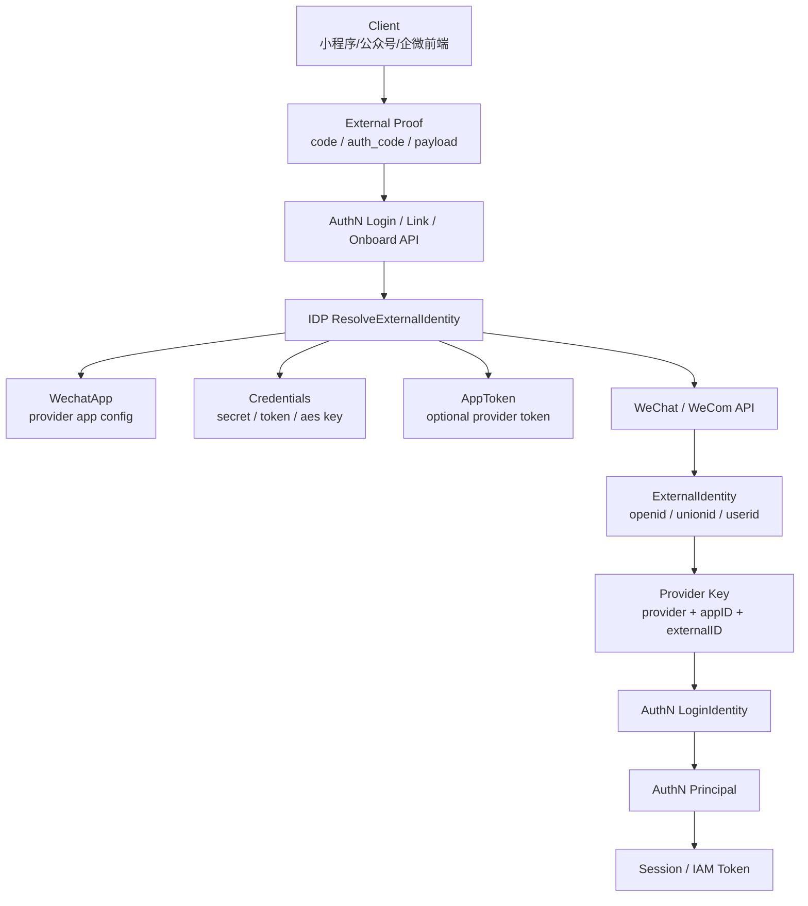
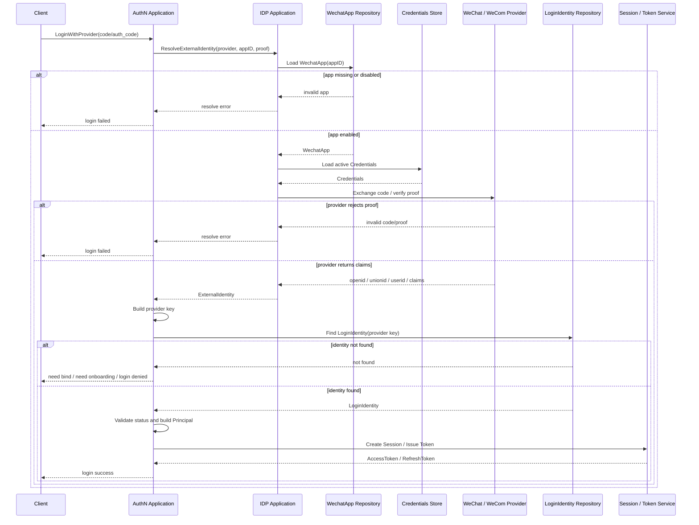

# 关键链路：外部身份解析与 AuthN 协作

> 状态：规划改造 · 已完成当前事实盘点；正文仍含待实现或尚未收敛的设计内容，不得作为现有能力承诺。

---

## 1. 本文回答

本文回答 10 个问题：

- 外部身份解析链路解决什么问题？
- IDP 为什么只返回 `ExternalIdentity`，不直接创建 `LoginIdentity`？
- 微信小程序 code、公众号 OAuth code、企微 auth_code 等 proof 如何被解析？
- `ExternalIdentity` 如何转换为 AuthN 可使用的 provider key？
- AuthN 如何基于外部身份决定 Login、Linking、Onboarding 或拒绝？
- `openid / unionid / wecom userid` 与 `LoginIdentity.ExternalID`、`UserID` 的边界是什么？
- 外部身份解析失败、未绑定、冲突绑定、unionid 缺失等情况如何处理？
- 该链路与 IAM Session / Token 签发的边界是什么？
- 安全、幂等、并发、可观测性如何治理？
- 修改该链路时应该核对哪些代码和测试？

本文只讲 IDP 解析外部身份并交给 AuthN 的协作链路。
IDP 领域模型见 [01-领域模型-WechatApp-Credentials-AppToken-ExternalIdentity.md](01-领域模型-WechatApp-Credentials-AppToken-ExternalIdentity.md)；
微信 AccessToken 获取与缓存见 [03-关键链路-微信AccessToken获取与缓存.md](03-关键链路-微信AccessToken获取与缓存.md)；
AuthN 登录链路见 [../02-AuthN/04-关键链路-Login登录认证.md](../02-AuthN/04-关键链路-Login登录认证.md)。

---

## 2. 30 秒结论

外部身份解析与 AuthN 协作链路的目标是：

```text
把微信/企微等外部 provider proof，
解析成可信的 ExternalIdentity，
再交给 AuthN 决定登录、绑定、开通或拒绝。
```

核心主线：

```text
external proof(code/auth_code/encrypted payload)
  -> IDP resolve WechatApp
  -> IDP load Credentials / AppToken if needed
  -> IDP call provider API or verify payload
  -> IDP build ExternalIdentity
  -> AuthN build provider key
  -> AuthN find or bind LoginIdentity
  -> AuthN build Principal
  -> AuthN create Session / Token if login succeeds
```

最重要的边界：

```text
IDP 只解析外部身份事实；
IDP 不创建 LoginIdentity；
IDP 不创建 User；
IDP 不创建 Principal；
IDP 不签发 IAM Token；
AuthN 决定登录是否成功；
Token 链路不直接依赖原始 IDP proof；
ExternalIdentity 不是 User、不是 Principal、不是 Subject。
```

如果只记一句话：

> IDP 证明“外部 provider 说这个人是谁”，AuthN 决定“这个外部身份在 IAM 中能不能登录成谁”。

---

## 3. 链路目标

外部身份解析链路用于把外部 provider 的 proof 转成 IAM 内部可消费的外部身份声明。

典型 proof：

```text
微信小程序 js_code；
微信公众号 OAuth code；
微信开放平台扫码登录 code，若具备资质；
企业微信 auth_code；
provider callback ticket；
加密 payload / session_key 相关材料，具体以 provider 能力为准。
```

解析结果是：

```text
ExternalIdentity
```

后续处理归 AuthN：

```text
LoginIdentity 查找；
LoginIdentity 绑定；
Onboarding 身份开通；
Principal 构建；
Session / Token 签发；
登录失败处理。
```

---

## 4. 职责分工

| 阶段 | 所属模块 | 输入 | 输出 |
| --- | --- | --- | --- |
| 解析 provider proof | IDP | code / auth_code / encrypted payload | ExternalIdentity |
| 构造 provider key | AuthN | ExternalIdentity | provider login key |
| 查找登录身份 | AuthN | provider key | LoginIdentity 或 not found |
| 绑定登录身份 | AuthN | Principal/User + ExternalIdentity | LoginIdentity / Credential |
| 开通身份 | AuthN + Identity | ExternalIdentity + onboarding info | User + LoginIdentity |
| 构建认证结果 | AuthN | LoginIdentity / User status | Principal |
| 签发 IAM Token | AuthN | Principal / Session | AccessToken / RefreshToken |

边界：

```text
IDP 不跨过 ExternalIdentity；
AuthN 不直接管理 provider app secret；
Identity 不直接解析 provider code；
AuthZ 不直接消费 openid；
Suggest 不直接消费 provider proof。
```

---

## 5. 链路总览



读图规则：

```text
前端把 provider proof 提交给 AuthN 登录/绑定/开通入口；
AuthN 通过 IDP port 解析 ExternalIdentity；
IDP 内部使用 WechatApp、Credentials、AppToken 和 provider adapter；
IDP 返回 ExternalIdentity；
AuthN 基于 ExternalIdentity 查找或创建 LoginIdentity；
只有 AuthN 登录成功后才会产生 Principal、Session 和 IAM Token。
```

---

## 6. 标准登录协作链路

### 6.1 主线

```text
AuthN Login request with provider proof
  -> AuthN calls IDP.ResolveExternalIdentity
  -> IDP resolves ExternalIdentity
  -> AuthN builds provider key
  -> AuthN finds LoginIdentity
  -> AuthN verifies LoginIdentity status
  -> AuthN builds Principal
  -> AuthN creates Session / Token
```

---

### 6.2 时序图



关键规则：

```text
IDP proof 解析失败时，AuthN 登录失败；
LoginIdentity not found 不等于 IDP 解析失败；
LoginIdentity disabled 不等于 provider proof 无效；
AuthN 应区分外部身份解析错误、未绑定、状态禁用和系统错误；
AccessToken / RefreshToken 只在 AuthN 登录成功后签发。
```

---

## 7. ExternalIdentity 到 provider key

AuthN 需要把 `ExternalIdentity` 转成稳定的登录身份 key。

常见 key 维度：

```text
provider；
appID；
externalID type；
externalID value；
```

示例：

```text
wechat-mini:appid:openid
wechat-open:unionid
wecom:corpID:userid
wecom:corpID:external_userid
```

推荐规则：

```text
openid 通常是 app 维度标识；
unionid 通常是开放平台主体维度标识，但不一定返回；
企微 userid 通常是企业内部成员标识；
不同 provider 的 ID 类型不能混用；
provider key 的唯一约束必须清晰；
key 构造规则归 AuthN，ExternalIdentity 字段来源归 IDP。
```

---

## 8. openid / unionid / userid 边界

### 8.1 openid

```text
openid 通常在某个 appID 下唯一；
openid 不应直接当 IAM UserID；
openid 可以作为 LoginIdentity.ExternalID；
不同 appID 下 openid 可能不同；
如果需要跨应用识别，应考虑 unionid，前提是 provider 返回且配置正确。
```

---

### 8.2 unionid

```text
unionid 通常用于微信开放平台主体下跨应用识别；
unionid 是否返回取决于开放平台绑定、用户授权和 provider 能力；
不能假设所有微信登录都有 unionid；
unionid 可以辅助账号合并或绑定策略；
unionid 缺失时 AuthN 必须有明确 fallback 策略。
```

---

### 8.3 企业微信 userid

```text
wecom userid 通常是企业内部成员标识；
corpID 是重要命名空间；
不同企业下 userid 不能直接混用；
企微外部联系人 external_userid 与内部成员 userid 不同；
是否映射为 staff/user 由 AuthN/Identity 业务用例决定。
```

---

## 9. Login / Linking / Onboarding 三种后续处理

IDP 返回 `ExternalIdentity` 后，AuthN 可能进入不同用例。

### 9.1 Login

已有绑定时：

```text
ExternalIdentity
  -> provider key
  -> LoginIdentity exists
  -> validate status
  -> Principal
  -> Session / Token
```

---

### 9.2 Linking

已登录用户绑定新的外部身份时：

```text
current Principal
  -> ResolveExternalIdentity
  -> check provider key not bound to another User
  -> create LoginIdentity / Credential if needed
  -> bind to current User
```

边界：

```text
Linking 必须要求当前用户已认证；
Linking 不是匿名登录；
IDP 不判断是否允许绑定；
AuthN 判断绑定冲突和安全策略。
```

---

### 9.3 Onboarding

首次使用外部身份开通账号时：

```text
ExternalIdentity
  -> provider key not found
  -> AuthN onboarding policy
  -> Identity creates User if allowed
  -> AuthN creates LoginIdentity
  -> AuthN builds Principal or requires additional profile info
```

边界：

```text
IDP 不创建 User；
IDP 不创建 LoginIdentity；
是否允许自动开通由 AuthN/Identity 用例决定；
是否需要手机号、儿童档案、监护关系等信息由业务 onboarding 策略决定。
```

---

## 10. Token 链路边界

Token 链路不直接依赖原始 IDP proof。

正确关系：

```text
IDP proof
  -> ExternalIdentity
  -> LoginIdentity
  -> Principal
  -> Session / Token
```

错误关系：

```text
IDP proof
  -> IAM AccessToken
```

关键边界：

```text
微信 code 不是 IAM Token；
微信 session_key 不是 IAM Token；
企微 access_token 不是 IAM Token；
provider proof 不应写入 IAM AccessToken claims；
IAM Token 应表达 AuthN Principal，而不是原始 provider proof；
RefreshToken 刷新不应重新依赖原始 provider code。
```

---

## 11. 幂等与并发

### 11.1 幂等

| 场景 | 推荐语义 |
| --- | --- |
| 同一个 code 重复登录 | provider code 可能一次性，重复通常失败 |
| 同一个 ExternalIdentity 重复 login | 如果 LoginIdentity 存在，应稳定登录同一 User |
| 重复 linking 同一身份到同一 User | 幂等成功或 conflict，必须明确 |
| linking 已绑定到其他 User | conflict / account already linked |
| onboarding 重复提交 | 基于 provider key 唯一约束避免重复 User/LoginIdentity |

---

### 11.2 并发

并发风险：

| 风险 | 说明 |
| --- | --- |
| 两个 onboarding 同时使用同一 ExternalIdentity | 可能重复创建 User 或 LoginIdentity |
| linking 与 login 同时发生 | LoginIdentity 状态可能变化 |
| unionid 合并与 openid 登录并发 | 账号合并策略复杂 |
| provider API 重试导致重复解析 | 应保证 AuthN 侧唯一约束 |

建议：

```text
LoginIdentity provider key 唯一约束；
onboarding 创建 User + LoginIdentity 应在事务内；
linking 应检查绑定冲突并使用唯一约束兜底；
ExternalIdentity 解析本身可以重复，但 AuthN 映射必须幂等可控。
```

---

## 12. 失败边界

| 场景 | 所属阶段 | 期望行为 |
| --- | --- | --- |
| WechatApp 不存在 | IDP | 解析失败，AuthN 登录失败 |
| WechatApp disabled | IDP | 解析失败，AuthN 登录失败 |
| Credentials 缺失 | IDP | 解析失败，配置错误 |
| provider code 无效 | IDP | 解析失败，invalid proof |
| provider API timeout | IDP | 解析失败或重试，按策略处理 |
| unionid 缺失 | IDP/AuthN | 可用 openid fallback，是否允许由 AuthN 决定 |
| ExternalIdentity 无稳定 ID | IDP | 解析失败 |
| LoginIdentity not found | AuthN | 进入绑定/开通/拒绝策略，不是 IDP 错误 |
| LoginIdentity disabled | AuthN | 登录拒绝 |
| provider key 已绑定其他 User | AuthN | binding conflict |
| User disabled | Identity/AuthN | 登录拒绝或需要状态处理 |
| Token 签发失败 | AuthN | 登录失败，IDP 解析结果不代表登录成功 |

---

## 13. 安全策略

建议：

```text
provider proof 只使用一次或短时有效；
不在日志中打印 code、session_key、access_token、raw encrypted payload；
ExternalIdentity raw claims 需要脱敏；
ExternalIdentity 到 provider key 的构造必须防混淆；
openid 必须带 appID 命名空间；
wecom userid 必须带 corpID 命名空间；
unionid 缺失不能自动合并账号；
linking 必须要求当前用户已认证；
onboarding 必须防重复创建；
AuthN Token 不应携带原始 provider proof。
```

---

## 14. 可观测性

建议指标：

```text
idp_external_identity_resolve_total；
idp_external_identity_resolve_success_total；
idp_external_identity_resolve_failure_total；
idp_external_identity_provider_latency_seconds；
idp_external_identity_invalid_proof_total；
authn_provider_login_success_total；
authn_provider_login_not_bound_total；
authn_provider_link_conflict_total；
authn_provider_onboarding_total；
```

建议日志字段：

```text
provider；
appID；
externalID type；
externalID hash/fingerprint；
resolve result；
AuthN next action：login/link/onboard/deny；
traceID；
```

禁止日志：

```text
raw code；
raw session_key；
raw provider access_token；
raw encrypted payload；
完整 raw claims；
IAM AccessToken / RefreshToken。
```

---

## 15. 与其他链路的关系

### 15.1 与微信应用配置

```text
ExternalIdentity 解析依赖 WechatApp 和 Credentials；
WechatApp disabled 后不应继续解析；
Credentials 轮换可能影响解析 provider proof；
配置错误应返回 IDP 解析失败，而不是 AuthN Credential 错误。
```

### 15.2 与微信 AccessToken 获取与缓存

```text
部分 provider API 需要 AppToken；
部分 code exchange 使用 app secret 而不使用 app-level AppToken；
不同 provider token 类型必须区分；
AppToken 获取失败不等于 LoginIdentity 不存在。
```

### 15.3 与 AuthN Login / Linking / Onboarding

```text
IDP 负责 ExternalIdentity；
AuthN 负责 LoginIdentity；
Identity 负责 User；
Token 归 AuthN；
失败原因要分层表达，避免把 provider 错误混成账号错误。
```

---

## 16. 与其他模块的边界

### 16.1 与 AuthN

```text
IDP 不创建 LoginIdentity；
IDP 不创建 Principal；
IDP 不签发 AccessToken / RefreshToken；
AuthN 不直接管理 WechatApp secret；
AuthN 通过 IDP port 解析 ExternalIdentity；
AuthN 决定 login/link/onboard/deny。
```

### 16.2 与 Identity

```text
IDP 不创建 User/Profile/ProfileLink；
ExternalIdentity 不等于 User；
openid/unionid/wecom userid 不等于 UserID；
是否创建 User 由 AuthN/Identity onboarding 用例决定。
```

### 16.3 与 AuthZ

```text
ExternalIdentity 不是 Subject；
openid 不能直接授权；
provider proof 不是授权凭证；
AuthN 登录成功后得到 Principal，再映射为 AuthZ Subject；
IDP 不创建 RoleBinding。
```

### 16.4 与 Suggest

```text
IDP 不维护 ProfileSearchTerm / ProfileAccessScope / ProfileSuggestionIndex；
provider nickname/avatar 等 claims 如需进入搜索字段，应经过 Identity 确认和 Suggest 用例更新。
```

---

## 17. 常见反模式

| 反模式 | 问题 | 推荐做法 |
| --- | --- | --- |
| IDP 解析成功就直接签发 IAM Token | IDP 吞并 AuthN | IDP 返回 ExternalIdentity，AuthN 签发 Token |
| ExternalIdentity 当 User | 外部声明和内部身份混淆 | AuthN/Identity 显式映射 |
| openid 直接当 UserID | 外部 app 维度 ID 和内部 ID 混淆 | openid 进入 LoginIdentity external id |
| unionid 必然存在 | 依赖不稳定 claim | AuthN 处理 unionid 缺失策略 |
| Token 链路依赖原始 code | provider proof 生命周期混入 IAM token | Token 基于 Principal，不基于 code |
| Linking 不要求已登录 | 账号劫持风险 | Linking 必须有当前 Principal |
| provider key 不带 appID/corpID | 身份串号风险 | key 必须带命名空间 |
| AuthN 直接读 app secret | AuthN 吞并 IDP | AuthN 通过 IDP port 解析 |
| IDP 直接创建 User | IDP 吞并 Identity | Onboarding 用例处理 |
| 日志打印 code/session_key/token | 凭据泄露 | 只记录 hash/fingerprint/traceID |

---

## 18. 代码事实源

| 事实 | 路径 |
| --- | --- |
| IDP domain | `../../../internal/apiserver/domain/idp` |
| ExternalIdentity | `../../../internal/apiserver/domain/idp` |
| WechatApp / Credentials / AppToken | `../../../internal/apiserver/domain/idp` |
| IDP ExternalIdentity resolver | `../../../internal/apiserver/application/idp` |
| WeChat / WeCom provider adapter | `../../../internal/apiserver/infra` |
| AuthN provider login strategy | `../../../internal/apiserver/application/authn` |
| LoginIdentity | `../../../internal/apiserver/domain/authn` |
| Principal | `../../../internal/apiserver/domain/authn/authentication/principal.go` |
| AuthN Token / Session service | `../../../internal/apiserver/application/authn` |
| Identity User | `../../../internal/apiserver/domain/identity` |
| IDP REST transport | `../../../internal/apiserver/transport/rest` |
| IDP gRPC transport | `../../../internal/apiserver/transport/grpc` |
| IDP container | `../../../internal/apiserver/container/idp` |
| REST 契约 | `../../../api/rest` |
| gRPC 契约 | `../../../api/grpc` |
| 架构测试 | `../../../internal/pkg/architecture` |

注意：上表中的具体路径需要继续与当前源码核对。如果源码目录已调整，应以代码为准并同步更新本文。

---

## 19. Verify

修改本文后至少执行：

```bash
make docs-hygiene
```

涉及 IDP 领域模型：

```bash
go test ./internal/apiserver/domain/idp/...
```

涉及 IDP 外部身份解析用例：

```bash
go test ./internal/apiserver/application/idp/...
```

涉及 provider adapter、credential store、token cache：

```bash
go test ./internal/apiserver/infra/...
```

具体路径以当前代码为准。

涉及 AuthN provider login/link/onboarding：

```bash
go test ./internal/apiserver/domain/authn/...
go test ./internal/apiserver/application/authn/...
```

涉及 Identity/AuthZ/Suggest 边界：

```bash
go test ./internal/apiserver/domain/identity/...
go test ./internal/apiserver/domain/authz/...
go test ./internal/apiserver/domain/suggest/...
```

涉及 REST/gRPC 契约或 transport：

```bash
make api-validate
make proto-gen
go test ./internal/apiserver/transport/rest/...
go test ./internal/apiserver/transport/grpc/...
```

涉及 SDK：

```bash
go test ./pkg/sdk/...
```

涉及分层依赖或模块边界：

```bash
go test ./internal/pkg/architecture
```

---

## 20. 本文总结

外部身份解析与 AuthN 协作链路可以压缩成：

```text
external proof(code/auth_code/encrypted payload)
  -> IDP resolve WechatApp
  -> IDP load Credentials / AppToken if needed
  -> IDP call provider API or verify payload
  -> IDP build ExternalIdentity
  -> AuthN build provider key
  -> AuthN find or bind LoginIdentity
  -> AuthN build Principal
  -> AuthN create Session / Token if login succeeds
```

最重要的边界是：

```text
IDP 只解析外部身份事实；
IDP 不创建 LoginIdentity；
IDP 不创建 User；
IDP 不创建 Principal；
IDP 不签发 IAM Token；
AuthN 决定登录是否成功；
Token 链路不直接依赖原始 IDP proof；
ExternalIdentity 不是 User、不是 Principal、不是 Subject。
```

下一篇应继续编写 IDP 模块边界，系统说明 IDP 与 AuthN、Identity、AuthZ、Suggest 的职责隔离和跨模块协作方式。
