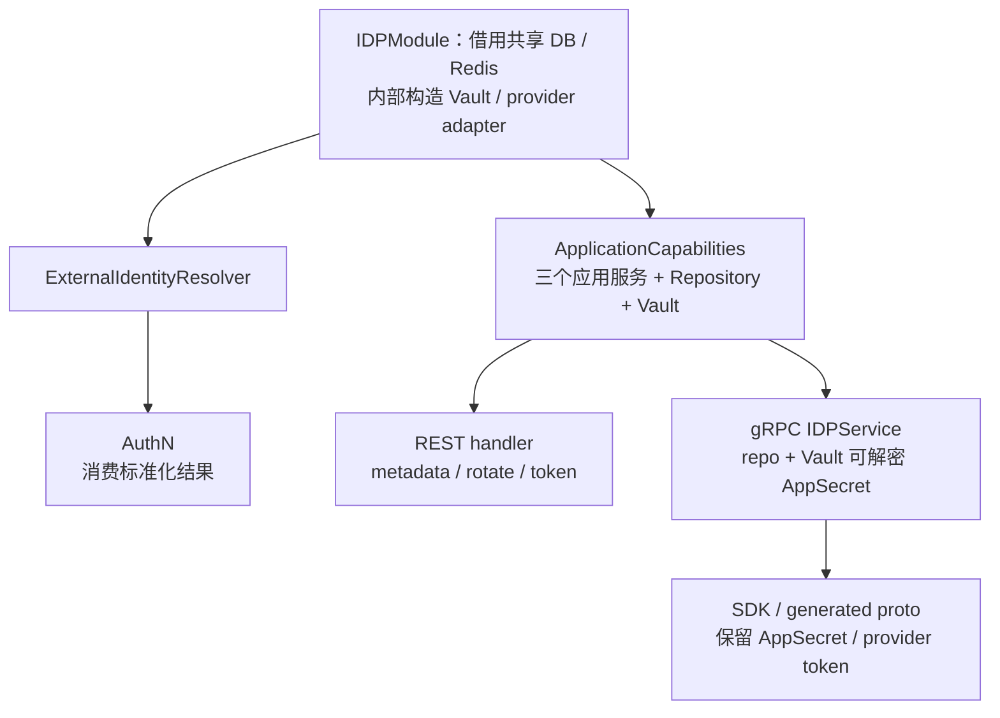

# IDP 模块边界与代码索引

> 状态：已实现 · 当前设计与实现。本文维护能力出口、装配/注册、协议与调用方、修改责任链及验证范围。条件推论和候选另作标记；凭据/cache、交换和身份归属分别回链主文，不在此复制完整算法。

## 1. 结论：模块内所有权、传输暴露和运行可用性分别核对

组合根向AuthN传入整个IDPModule指针，AuthN infra目前只提取ExternalIdentityResolver；后续执行链不读取IDP应用仓储、SecretVault或SDK struct。这是当前消费约定，不是deps类型已经只允许Resolver。整个IDP对其他调用方还有更宽出口：REST得到管理应用服务，gRPC还得到repository/Vault，并可返回明文AppSecret与provider token。

另一个区别是“构造了能力”和“该能力可运行”。IDP 初始化检查 DB/Redis 指针与 32 字节 key，装配服务/adapter；它没有逐 provider 交换或完整存储健康验证。管理 handler 非 nil、RPC 已注册和 health 返回 ok，同样不能证明请求能成功。

| 面向哪个问题 | 所有权/出口 | 详细规则归属 |
| --- | --- | --- |
| 外部应用、凭据与 provider AppToken | IDP domain/application，管理传输调用 | [凭据与两层缓存](01-应用凭据与AppToken缓存.md) |
| 本次 code 交换与字段标准化 | IDP Resolver/Exchanger → AuthN | [外部解析与交接](02-外部身份解析与AuthN协作.md) |
| LoginIdentity/User 归属、注册/登录/绑定 | AuthN；User 的领域所有权在 Identity | [信任模型](03-外部身份信任模型与方案演化.md)、[AuthN 边界](../02-AuthN/07-模块边界-AuthN与Identity-IDP-AuthZ.md) |
| Session 与 IAM Token | AuthN，Identity 状态变更有独立联动 | [Token](../02-AuthN/05-关键链路-Token签发刷新吊销.md) |
| 管理动作准入/资源授权 | REST AuthN/AuthZ 中间件；gRPC 全局服务准入 | 本篇 §4–5，策略细节见[AuthZ 边界](../03-AuthZ/07-模块边界-AuthZ与AuthN-Identity-Suggest.md) |

IDP 没有创建 User、Session 或 Assignment 的用例；provider AppToken 不进入 IAM Token 签发链。需要区分“当前事实”与“希望收缩的出口”，避免把模块封装描述成实际未完成的权限隔离。

## 2. 代码地图：先找能力出口，再追到实现

下表源码链接可直接定位。没有链接的局部文件名均以前一列所在目录为准。

| 阅读顺序 | 入口 | 负责什么；继续追哪里 |
| --- | --- | --- |
| 输入依赖 | [module_graph](../../../internal/apiserver/container/module_graph.go)、[IDP deps](../../../internal/apiserver/container/idp/deps.go) | DB、Redis、32字节 encryption key；WeCom 全局 AgentID只给IDP Resolver配置 |
| 模块装配 | [module](../../../internal/apiserver/container/idp/module.go)、[infra](../../../internal/apiserver/container/idp/infra.go) | infra→domain→application的构造次序；repo/cache/Vault/token/exchanger的真实实例 |
| 领域服务 | [domain 装配](../../../internal/apiserver/container/idp/domain.go)、[WechatApp](../../../internal/apiserver/domain/idp/wechatapp/wechatapp.go) | Creator/Rotater/Cacher及appTokenProvider；规则见凭据主文 |
| 应用服务 | [application 装配](../../../internal/apiserver/container/idp/application.go)、[应用服务接口](../../../internal/apiserver/application/idp/wechatapp/services.go) | metadata/credentials/token三类用例；同目录service_metadata/credentials/token实现 |
| 外部解析 | [Resolver](../../../internal/apiserver/application/idp/externalidentity/resolver.go)、[值对象](../../../internal/apiserver/domain/idp/externalidentity/external_identity.go) | app/type/status/secret/交换与最小字段；AuthN mapper/proof属于消费方 |
| provider adapter | [identity_provider](../../../internal/apiserver/infra/wechat/identity_provider.go)、[auth-provider](../../../internal/apiserver/infra/wechatapi/auth-provider.go)、[token adapter](../../../internal/apiserver/container/idp/token_provider.go) | 外部用户证明和应用token是不同调用链，不能据一个adapter成功推断另一个 |
| 本地存储/密文 | [WechatApp repo](../../../internal/apiserver/infra/mysql/wechatapp/repository.go)、[Vault](../../../internal/apiserver/infra/crypto/secret_vault.go) | app_id查找/整体更新、密文保护；不负责传输层caller准入 |
| 两层缓存 | [IAM AppToken cache](../../../internal/apiserver/infra/cache/redis/accesstoken_cache.go)、[SDK cache](../../../internal/apiserver/infra/cache/redis/wechatsdk_cache.go) | 两类key/inspectors；期限、lease与Refresh差异见凭据主文 |
| 能力导出 | [capabilities](../../../internal/apiserver/container/idp/capabilities.go)、module的两类方法 | Resolver给AuthN；ApplicationCapabilities同时含管理服务、Repository、Vault |
| REST/gRPC收集 | [REST collector](../../../internal/apiserver/container/idp/rest.go)、[gRPC collector](../../../internal/apiserver/container/idp/grpc.go) | 构造handler/service及注册closure，后续仍要检查标准router/server |
| 协议与SDK | [REST router](../../../internal/apiserver/transport/rest/idp/router.go)、[gRPC service](../../../internal/apiserver/transport/grpc/service/idp/service_impl.go)、[SDK](../../../pkg/sdk/idp/read.go) | 实际响应、错误及secret/token出口，见§4–6 |

infra→domain→application 是组合根的构造次序，不是所有包的 import 方向。Domain 定义技术端口，infra 实现；application 编排，container 选择实例，transport 适配入口。IDP 容器的 collector 可以依赖 transport，不能据此要求整个容器包禁止这类依赖。

### 2.1 三个出口的宽度不同

这张图表示当前能力消费，不是网络允许名单，也不表示AuthN的deps类型只接收Resolver。gRPC是否可达要继续看server准入，REST是否注册要看组合根。ApplicationCapabilities并非无秘密的DTO；private repository字段经导出能力可被传输层使用，不能宣称只有模块内部能取得它。缓存治理还有独立inspector出口，见下一节。

## 3. 装配与失败：哪些检查在哪个阶段发生

### 3.1 当前正常构造顺序

module_graph提供资源/配置 → InitializeWithDeps检查DB/Redis非nil与key长度 → infra构造repo、两层cache、Vault、provider → domain装配Creator/Rotater/Cacher → application装配三服务和Resolver。

AuthN deps仍接收IDPModule指针，但infra只取ExternalIdentityResolver；IDPModule可以为nil，Resolver便保留nil，相应用例执行时再报依赖错误。这不等于给AuthN装配了一个“不可用Resolver实现”，也不等于整个标准进程一定支持缺失IDP。

标准进程把IDP列为critical；初始化正常返回后的失败是否可继续，仍由RuntimeProfile与可靠消息前置裁决。release解析为production，不能degraded启动。下层AuthN构造允许nil与标准进程允许继续是两个合同。共享DB/Redis由宿主管理，当前IDP没有独立worker/Close runtime hook；缓存inspector是读能力，不是IDP自行关闭连接或后台刷新。依据：[critical清单/runtime出口](../../../internal/apiserver/container/runtime_deps.go)、[process前置](../../../internal/apiserver/process/bootstrap.go)、[RuntimeProfile](../../../internal/pkg/server/runtime_profile.go)。

当前infra把SDK cache给应用token的provider，却给外部IdentityProvider的WorkCache传nil。标准WeCom请求期因此存在pinned SDK构造断点；初始化测试没有执行Resolve。具体触发条件由[解析主文](02-外部身份解析与AuthN协作.md)维护，不从缓存族已登记推导企微链可用。

### 3.2 普通错误记录不能覆盖 panic

若进入bootstrap、IDP初始化返回普通error，initIDPModule不会保存模块；bootstrap记录错误后继续其他步骤，只有指定的可靠消息不安全handoff错误会早停。随后cache governance把各模块指针放进interface切片，只判断interface==nil；typed-nil的*IDPModule不被跳过，而CacheFamilyInspectors直接读取接收者字段。

这是一条源码允许的条件panic路径，runBootstrapPlan没有recover。它没有被本轮专项复现，也不表示目标运行配置已经触发；但足以收紧“任意模块失败都记录为降级并正常返回”的文档承诺。Container只有在bootstrap返回后才设置initialized、返回组合错误。

依据：[bootstrap](../../../internal/apiserver/container/bootstrap.go)、[模块初始化/cache收集](../../../internal/apiserver/container/bootstrap_modules.go)、[IDP inspector方法](../../../internal/apiserver/container/idp/module.go)。完整进程策略归[启动与组合根](../../01-运行时/01-启动与组合根.md)。

### 3.3 注册状态不能代替能力验收

| 检查/测试 | 当前证明什么 | 还没有证明什么 |
| --- | --- | --- |
| IDP Initialize入口检查 | 依赖指针/密钥长度满足构造要求 | 所有schema、Redis可用、凭据能解密、provider接受 |
| ModuleState.Available | 已initialized且IDPModule指针存在 | 每项ApplicationCapabilities均完整且当前可运行 |
| CollectREST/CollectGRPC | available、模块和输出指针满足条件时构造对象/closure | 服务字段均非nil，实际调用成功 |
| BuildREST/GRPCDeps测试 | 空模块也可生成handler及注册顺序/closure | 完整初始化、listener/mTLS/ACL或业务请求 |
| /api/v2/idp/health | 已注册时固定返回status=ok/module=idp | DB/cache/provider健康、secret或应用状态 |
| gRPC SERVING / readyz | Registry注册后统一MarkAllServicesServing；readyz检查已列组件 | gRPC状态不是IDP探针；readyz没有独立provider交换检查 |
| IDP smoke测试 | SQLite+miniredis能初始化、token能力非nil和两个缓存族存在 | schema/真实token/外部Resolve；失败后的typed-nil路径 |

若要修订失败或可用性合同，候选改动应分别覆盖模块收集的nil安全、关键协作者验证和真实请求探针；不能只增加一个反射nil判断，就宣称所有降级路径和远端依赖均已接受。

健康状态依据：[gRPC registry](../../../internal/apiserver/transport/grpc/registry.go)、[readyz组件](../../../internal/apiserver/container/readiness.go)。

## 4. REST：动作受保护，但没有逐 AppID 所有权模型

### 4.1 两级注册前置

下层idp.Register先注册health；没有handler或AuthMiddleware/Permission时只保留health，不注册管理路由。标准REST组合根却先检查container/module可用、IDP handler、JWT与授权中间件，再调用IDP注册；因此标准路径中health也可能整组缺席。

管理组使用在线JWT认证和固定ResourceWechatApps的动作检查。以下路径都相对于/api/v2/idp/wechat-apps，动作名来自实际router，不由YAML摘要推断：

| method/path | action |
| --- | --- |
| GET 空路径 | list |
| POST 空路径 | create |
| GET /:app_id | read |
| PATCH /:app_id | update |
| POST /:app_id/enable | enable |
| POST /:app_id/disable | disable |
| GET /:app_id/access-token | get_access_token |
| POST /rotate-auth-secret | rotate_auth_secret |
| POST /rotate-msg-secret | rotate_msg_secret |
| POST /refresh-access-token | refresh_access_token |

权限函数接收resource/action，不接收path/body AppID；handler和IDP应用用例也没有当前Actor/Org与AppID归属判定。当前AppID是查找目标，不是caller被授权管理该应用的独立证据。拥有集合动作能力与只能操作指定AppID是不同合同，后者尚未在此实现。

依据：[标准注册路径](../../../internal/apiserver/transport/rest/module_routes.go)、[IDP router](../../../internal/apiserver/transport/rest/idp/router.go)、[动作resource常量](../../../internal/apiserver/application/authz/authorization/route_permissions.go)。

### 4.2 metadata、token与材料输入的边界

metadata响应只投影ID/AppID/Name/Type/Status，不返回cipher、fingerprint、secret或version；token获取/刷新返回provider access_token并固定expires_in=7200，不代表实际剩余寿命。创建/轮换请求会接收明文Secret，不能由“metadata不输出secret”推导请求体、日志或全部协议都无秘密。

Create把非空Type直接cast；List/Patch按有限枚举解析，两者不是相同验证强度。Create实际经公共Success返回200和code/message/data，Swagger/OAS写201及裸metadata对象；Type注释还留MiniProgram/MP说法。修改时要追request→mapper→application→公开response，不能只改schema。

LoginWithCode/DecryptPhone等旧request/response类型还存在，但当前IDP router没有相应认证路由。当前登录走AuthN入口；存在类型或过时注释不构成可访问API证据。

依据：[request/response](../../../internal/apiserver/transport/rest/idp/request/request.go)、[mapper](../../../internal/apiserver/transport/rest/idp/handler/wechatapp_mapping.go)、[handler](../../../internal/apiserver/transport/rest/idp/handler/wechatapp.go)、[公共响应](../../../pkg/core/handler.go)、[OAS](../../../api/rest/idp.v2.yaml)。期限和错误合同由[凭据主文](01-应用凭据与AppToken缓存.md)维护。

## 5. gRPC：当前 GetWechatApp 是秘密出口

### 5.1 实际三条方法及准入来源

| RPC | 实际调用/返回 | 当前额外限制 |
| --- | --- | --- |
| GetWechatApp | 直接repo读App，再经Vault解密写入proto.app_secret | 不按Enabled/Type或目标AppID所有权拒绝；无Vault时有密文也可能返回空secret |
| GetWechatAccessToken | token application service → provider token字符串 | service缺失为Unimplemented，方法内没有caller/AppID授权 |
| RefreshWechatAccessToken | refresh application service → provider token字符串 | RPC名/注释不证明绕过SDK cache或强制provider回源 |

GetWechatApp绕过metadata应用投影；它取得repo/Vault是当前collector的显式装配。因此“IDP内部保密、下游只取metadata”是收缩目标，不是现行事实。proto也没有secret/token的独立审批或材料版本回执。

三个方法内部不读取ServiceIdentity、不执行AuthZ Check或AppID允许名单；方法准入来自可配置的全局gRPC server认证/ACL链。模块collector只依赖自身available/module；没有REST那样要求AuthN/AuthZ middleware才注册。mTLS身份、方法允许、目标AppID允许需要分别成立，不能相互代替。

NewConfig的默认服务器配置为Insecure，mTLS/Auth/ACL默认关闭；配置开启与实际证书/允许名单采用另需核对。IDP注册本身没有强制这些开关，不能把模板或默认函数当作目标部署状态。依据：[配置默认值](../../../internal/pkg/grpc/config.go)、[server拦截器链](../../../internal/pkg/grpc/server.go)。

当前仓库ACL模板给qs-apiserver.svc的GetWechatApp许可，admin模板给IDPService/*。**在这些模板实际生效、请求通过方法准入且应用存在的条件下**，服务可以提交另一AppID；该方法也能读disabled应用的材料。这是源码/模板条件推论，不是当前线上ACL或调用行为的证据。

依据：[collector](../../../internal/apiserver/container/idp/grpc.go)、[service](../../../internal/apiserver/transport/grpc/service/idp/service_impl.go)、[proto](../../../api/grpc/iam/idp/v2/idp.proto)。具体全局认证/ACL、TLS装配与模板定位见[服务间授权](../03-AuthZ/06-关键链路-gRPC服务间授权与SDK.md)和[传输安全](../../03-基础设施/05-传输层与服务间安全.md)。

### 5.2 不把响应脱敏和日志保证合并为一句话

已有gRPC测试证明Decrypt内部错误不会把sentinel返回给caller，不能扩大为secret获取成功路径、所有provider错误或全部日志均脱敏。秘密转换为string并进入proto后，清空某个局部byte slice也无法撤回已交付内容。

标准REST/gRPC transport logger记录方法、路径、状态、时长等metadata，不自动序列化请求/响应体；路径可能包含AppID。gRPC Audit在mTLS/ACL之后，前置拒绝不会进入这层审计，事件也没有完整的AppID/凭据版本/导出结果。应用服务仍可能记录底层err.Error()；自定义adapter与消费者日志需分别核对。这些是当前边界，不是已发生泄漏的结论。依据：[HTTP logger](../../../internal/pkg/middleware/api_logger.go)、[gRPC logger](../../../internal/pkg/middleware/grpc_server_logger.go)、[凭据服务日志](../../../internal/apiserver/application/idp/wechatapp/service_credentials.go)。

若收缩出口，必须一起处理response、server/client日志与tracing、调用方保存/转发、错误cause和观测标签。本仓库可见调用只构成静态入口清单，线上消费者、实际ACL及日志配置仍未知；不能据本仓库没有业务caller便删除兼容接口。

## 6. SDK：完整返回协议，连接和重试仍由宿主管理

pkg/sdk/idp三项wrapper构造request、调用generated client并errors.Wrap，直接返回完整proto；Raw返回同一个generated client，统一SDK的Conn也能直接构造generated client。它们不筛掉AppSecret/token，不增加AppID授权或独立缓存，也不替调用方建立证明来源。Raw/direct调用绕过wrapper错误包装，但共享连接的transport策略仍在。

统一SDK在initSubClients中使用共享conn构造IDP client；独立idp.NewClient只接收generated client，不检查它是否带mTLS/ACL/拦截器。宿主负责共享连接、ctx/deadline及生命周期，不应让IDP子客户端关闭借来的连接。

通用配置的Timeout默认值不代表默认每次RPC已施加该deadline；当前默认拨号/拦截器链没有接入它。默认service config的重试覆盖方法，Refresh也没有被特别排除；传输重试不保证一次provider调用、Secret轮换接受或业务幂等。调用方应按实际ctx/额外拦截器与方法语义评估，具体配置归[SDK接入](../../04-接口与SDK/02-Go-SDK与业务系统接入.md)。

当前静态清单包括SDK wrapper、Raw/generated调用面、服务mapper、proto和ACL模板；未核对其他仓库/目标运行消费者。缩减proto字段/改变Refresh语义前，还须取得绑定版本的消费者清单和接受结果。

显式启用的内置observability记录method/code/duration等，不序列化完整响应；它不约束用户自定义interceptor，也不构成secret-export审计。errors.Wrap保留gRPC code/message/cause，不是所有错误内容的脱敏器。宿主配置与服务器出口仍须一起审查。

依据：[子客户端](../../../pkg/sdk/idp/client.go)、[wrapper](../../../pkg/sdk/idp/read.go)、[Raw](../../../pkg/sdk/idp/raw.go)、[统一SDK](../../../pkg/sdk/client.go)。字段清单以当前proto为准，不能由SDK注释中的“强制刷新”推断实际行为。

## 7. 用三个具体改动确定责任链

### 7.1 新增一个外部来源，不能只加 Resolver switch

先确定注册来源/recipient、凭据种类与realm/global命名空间，再追以下链：

1. IDP注册模型、存储/密文、配置和adapter；每Corp/Agent配对不能用一个全局AgentID自然表达。
2. Resolver请求/结果合同、容器注入和真实SDK行为；不能只用exchanger stub通过分派测试。
3. AuthN ProviderKey枚举/构造、mapper、proof、strategy、SignUp/Link规则与SQL比较/唯一键。
4. 公开payload/state流程、transport错误、SDK/caller和历史兼容。
5. 真实交换与失败矩阵、归属冲突/历史数据验证、迁移/回滚证据。

G变化、legacy与canonical维护跨越多个AuthN writer，不能由修改Resolver单独统一。OIDC/broker与比较合同的候选取舍由[信任模型](03-外部身份信任模型与方案演化.md)维护。

### 7.2 将服务限制为“只能读 appA 的 metadata”

当前集合动作/方法ACL都不足以表达这句话。候选需要定义caller与应用授权事实，在所有对应REST/gRPC入口核对目标AppID，并防止Raw、GetWechatApp或token方法成为旁路；不要只给SDK helper加一层本地条件。

最低可验收矩阵应包含同caller请求appA/appB、匿名/无方法许可、缺失应用、停用应用和不同材料类别。先决定disabled时metadata、token和secret各自是否允许，再改行为；provider proof拒绝disabled不自动意味着管理读取也应拒绝。

### 7.3 把 GetWechatApp 收缩成无 secret metadata

| 阶段 | 需要完成的具体工作 | 不能替代它的做法 |
| --- | --- | --- |
| 定消费者/目的 | 盘点绑定版本的GetWechatApp与Raw调用，区分metadata、外部交换和provider API用途 | 仅搜本仓库、或据TLS已启用推断全部caller都需要secret |
| 提供替代能力 | 增加无secret metadata；需要provider能力的caller另选窄exchange/token接口及AppID准入 | 原mapper置空但保留“返回AppSecret”的契约 |
| 迁移与观测 | proto/generated/SDK/ACL、caller配置和错误合同一起迁移；观测只记方法/来源/目标与结果，不记材料 | 仅发布新SDK，旧generated/Raw调用仍可读 |
| 兼容退役 | 明确旧方法/字段的拒绝或保留期限，验证无旧writer/caller，再版本化收缩 | 未证消费者接受就删除proto字段或复用其field number |

这是一条候选迁移链，没有在本次文档授权中实施。密钥轮换则沿全体metadata/启停/轮换writer、Vault、两层cache、provider激活与回滚追踪；不能仅修改rotater或cache key，完整责任见[凭据主文](01-应用凭据与AppToken缓存.md)。

候选验收还须覆盖old client/new server和new client/old server的稳定拒绝、不自动回落旧敏感出口、真实mTLS/ACL与目标AppID、成功序列化没有secret、token是否仍获准，以及重试/响应丢失和日志/trace。移除字段时保留旧tag/name不复用；不能只重新生成pb.go便认定消费者迁移完成。

## 8. 验证索引：每项绿灯实际覆盖什么

| 验证入口 | 当前覆盖 | 本篇不能据此宣称 |
| --- | --- | --- |
| container/idp tests | 空deps触及缺DB分支；fake Vault/provider的token adapter分派/解密错误；SQLite+miniredis初始化与缓存族 | 缺Redis/错误key长度逐项专项、三provider真实交换、IDP失败后完整bootstrap正常返回 |
| container的BuildREST/GRPCDeps tests | 空模块可构造transport、available选择、nil container与注册顺序 | 完整依赖、TLS/ACL/AppID准入或请求成功 |
| REST idp router tests | 显式action绑定、缺管理中间件不注册、部分字段/用例错误与过滤 | 标准组合根health的全部分支、真正JWT/AuthZ、跨AppID限制 |
| gRPC idp service tests | token stub返回、结构化NotFound、decrypt错误隐藏 | 成功secret读取的授权/脱敏、TLS/ACL、真实provider和Refresh回源 |
| pkg/sdk/idp / public API compile / 通用dial测试 | IDP包无测试；compile只引用类型/构造，dial只检查ServiceConfig被接受 | 三RPC实际调用、故障重试、deadline、鉴权或成功响应过滤 |
| architecture护栏 | 已列import/源码片段及当前接口/注册模式 | 穷举所有SDK/import、动态装配、运行时nil或权限保证 |
| docs/API门禁 | 已编码的事实、路径/方法、文档链接与选定schema检查 | 全文语义、secret出口/准入/TTL或全部IDP schema字段一致 |

AuthN的Resolver护栏扫描指定AuthN目录的import与AppSecret/CorpSecret/WecomAgentID/IdentityProvider等片段；禁止清单不是所有SDK包的完整黑名单，文本命中也不执行时序。它支持维护方向，不替代真实capability消费与adapter审查。依据：[architecture护栏](../../../internal/pkg/architecture/architecture_test.go)。

当前OpenAPI checker将Swagger全名取最后一段后查OAS；IDP schema使用全名，所以这些schema被跳过。即使命中，通用比较也只核属性名/required；深层shape专项不普遍覆盖IDP。路由比较和实际注册检查有各自范围，不能由“OpenAPI specs match”认定字段、响应envelope、安全或状态行为全体一致。依据：[checker](../../../scripts/check-openapi-contracts.py)、[契约治理](../../04-接口与SDK/01-REST-gRPC与契约治理.md)。

本篇新运行IDP容器/REST/gRPC与选定组合根注册回归，复用源码未变的Resolver和架构结果；数量、日志和源码绑定见[阶段记录](../../_data/reviews/2026-10-06-docs-refactor.md)。文档/图示验证与真实存储、provider、消费者接受分别留证；没有把条件推论当作专项或生产复现。
