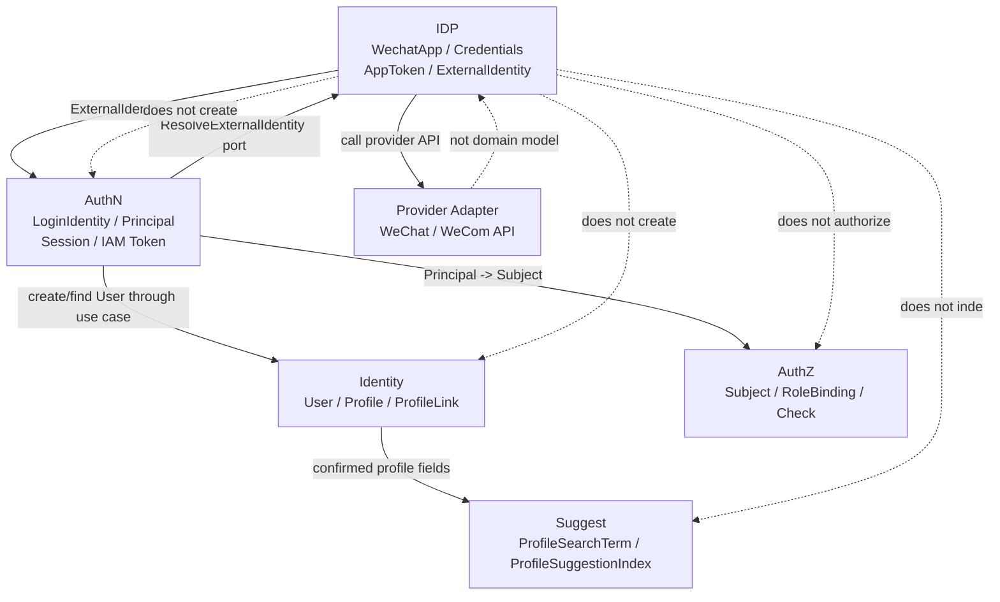

# 模块边界：IDP 与 AuthN

> 状态：设计目标 · 第一版正文，待继续按源码、组合根、跨模块 port、微信/企微 provider adapter、AuthN 登录/绑定/开通用例、REST/gRPC 契约和架构测试逐项核对。

---

## 1. 本文回答

本文回答 10 个问题：

- IDP 的模块边界是什么？
- IDP 与 AuthN 如何协作，为什么 `ExternalIdentity` 不是 `LoginIdentity`？
- `WechatApp`、`Credentials`、`AppToken` 为什么不能进入 AuthN 领域模型？
- AuthN 可以从 IDP 使用哪些能力，不能直接访问哪些事实？
- IDP 与 Identity 的边界是什么，为什么 openid / unionid / userid 不是 `User`？
- IDP 与 AuthZ 的边界是什么，为什么 `ExternalIdentity` 不是 `Subject`？
- IDP 与 Suggest 的边界是什么，为什么外部 claims 不能直接写搜索索引？
- IDP 与 provider adapter / infra 的边界是什么？
- 哪些跨模块协作是允许的，哪些属于边界漂移？
- 修改 IDP 边界时应该核对哪些代码和测试？

本文重点讲 IDP 与 AuthN 的边界，同时补充 IDP 与 Identity、AuthZ、Suggest、provider adapter 的协作边界。
IDP 领域模型见 [01-领域模型-WechatApp-Credentials-AppToken-ExternalIdentity.md](01-领域模型-WechatApp-Credentials-AppToken-ExternalIdentity.md)；
外部身份解析链路见 [04-关键链路-外部身份解析与AuthN协作.md](04-关键链路-外部身份解析与AuthN协作.md)；

---

## 2. 30 秒结论

IDP 是 IAM 的外部身份源基础设施模块。

它只维护和产生：

```text
WechatApp / ProviderApp；
Credentials / ProviderCredential；
AppToken / AppAccessToken；
ExternalIdentity；
provider callback verification result；
provider adapter result。
```

AuthN 是 IAM 的认证中心。

它维护和产生：

```text
LoginIdentity；
AuthN Credential / Challenge；
Principal；
Session；
AccessToken / RefreshToken；
JWKS / Token verification context。
```

最重要的边界：

```text
WechatApp 不是 LoginIdentity；
Credentials 不是 AuthN Credential；
AppToken 不是 IAM AccessToken；
ExternalIdentity 不是 LoginIdentity；
ExternalIdentity 不是 User；
ExternalIdentity 不是 Principal；
ExternalIdentity 不是 Subject；
openid / unionid / wecom userid 不是 UserID；
provider proof 不是长期 Credential；
IDP 解析成功不等于 AuthN 登录成功。
```

如果只记一句话：

> IDP 负责“外部 provider 说了什么”，AuthN 负责“这些外部身份声明在 IAM 中能不能登录成谁”。

---

## 3. 模块边界总图



读图规则：

```text
AuthN 通过 IDP port 解析 ExternalIdentity；
IDP 返回 ExternalIdentity，不返回 LoginIdentity；
AuthN 决定 Login / Linking / Onboarding / Deny；
Identity 只在明确用例中创建或更新 User/Profile/ProfileLink；
AuthZ 只消费 AuthN Principal 映射后的 Subject，不直接消费 openid；
Suggest 不直接消费 provider proof；
provider adapter 是 infra，不是 IDP 领域模型本身。
```

---

## 4. IDP 的职责边界

IDP 负责：

| 能力 | 说明 |
| --- | --- |
| 外部应用配置 | `WechatApp` / `ProviderApp` 元数据、状态、callback 配置 |
| 外部应用密钥 | app secret、corp secret、callback token、encoding aes key 等 provider credentials |
| 外部 AppToken | 微信/企微 provider access token 获取、缓存、刷新、防击穿 |
| 外部身份解析 | code / auth_code / encrypted payload -> `ExternalIdentity` |
| provider callback 验签/解密 | 验证 provider callback 来源并解析 provider event |
| provider adapter 封装 | 屏蔽微信/企微 API 细节 |
| 外部凭据安全治理 | 加密保存、fingerprint、版本、轮换和审计 |

IDP 不负责：

| 不负责 | 所属模块 |
| --- | --- |
| LoginIdentity 映射和绑定 | AuthN |
| AuthN Credential / Challenge 校验 | AuthN |
| Principal 构造 | AuthN |
| Session / IAM Token 签发 | AuthN |
| User / Profile / ProfileLink 写模型 | Identity |
| Subject / Role / Permission / RoleBinding / Check | AuthZ |
| Profile 搜索索引和可见性读模型 | Suggest |
| 业务资源访问判定 | AuthZ / 业务模块 |

---

## 5. IDP 与 AuthN

### 5.1 协作关系

IDP 负责外部身份源解析。

AuthN 负责 IAM 认证结果。

```text
IDP -> ExternalIdentity
AuthN -> LoginIdentity / Principal / Session / Token
```

典型链路：

```text
provider proof
  -> IDP ResolveExternalIdentity
  -> ExternalIdentity
  -> AuthN provider key
  -> LoginIdentity
  -> Principal
  -> Session / IAM Token
```

---

### 5.2 ExternalIdentity 不是 LoginIdentity

| 概念 | 所属模块 | 生命周期 | 含义 |
| --- | --- | --- | --- |
| `ExternalIdentity` | IDP | 一次解析结果或外部身份声明 | provider 返回的 openid / unionid / userid 等声明 |
| `LoginIdentity` | AuthN | IAM 长期登录身份 | IAM 内部可登录身份，绑定到 User |

关键边界：

```text
ExternalIdentity 可以被 AuthN 用来查找或创建 LoginIdentity；
ExternalIdentity 本身不是 LoginIdentity；
ExternalIdentity 不直接表达 IAM 用户已登录；
LoginIdentity 的唯一约束、状态、绑定冲突由 AuthN 管理；
IDP 不创建 LoginIdentity；
IDP 不决定登录是否成功。
```

正确关系：

```text
ExternalIdentity(provider, appID, openid/unionid/userid)
  -> AuthN provider key
  -> LoginIdentity(type, externalID, appID, userID)
```

错误关系：

```text
ExternalIdentity == LoginIdentity
openid == UserID
```

---

### 5.3 WechatApp 不是 LoginIdentity

`WechatApp` 表达外部 provider app 配置。

它回答：

```text
IAM 接入了哪个微信/企微应用？
这个应用用什么 appid/corpid/agentid？
这个应用是否启用？
这个应用使用哪些 provider credentials？
```

`LoginIdentity` 表达 IAM 内部登录身份。

它回答：

```text
某个 User 可以通过哪种登录方式登录 IAM？
这个登录方式的外部 ID 是什么？
这个登录身份当前是否可用？
```

关键边界：

```text
WechatApp 是 app 级配置；
LoginIdentity 是用户级登录身份；
一个 WechatApp 可解析多个 ExternalIdentity；
多个 LoginIdentity 可以引用同一个 WechatApp 的 appID；
禁用 WechatApp 不等于删除 LoginIdentity；
删除 LoginIdentity 不等于删除 WechatApp。
```

---

### 5.4 Credentials 不是 AuthN Credential

| 概念 | 所属模块 | 典型内容 | 用途 |
| --- | --- | --- | --- |
| `Credentials` / `ProviderCredential` | IDP | app secret、corp secret、callback token、encoding aes key | 调 provider API、验签、解密 |
| `Credential` | AuthN | password hash、otp、oauth binding material 等 | 校验 IAM 登录身份 |

关键边界：

```text
ProviderCredential 不保存用户密码；
ProviderCredential 不校验 IAM 用户身份；
ProviderCredential 不应进入 AuthN Credential；
AuthN Credential 不保存 provider app secret；
AuthN 不应直接读取 raw provider secret；
AuthN 通过 IDP port 使用 provider 能力。
```

---

### 5.5 AppToken 不是 IAM AccessToken

| 概念 | 所属模块 | 签发方 | 用途 |
| --- | --- | --- | --- |
| `AppToken` / 微信 access_token | IDP | 微信/企微 provider | 调用 provider API |
| `AccessToken` | AuthN | IAM | 访问 IAM API |
| `RefreshToken` | AuthN | IAM | 刷新 IAM AccessToken |

关键边界：

```text
微信 access_token 不能访问 IAM API；
IAM AccessToken 不能调用微信 API；
AppToken 不代表 IAM 用户已登录；
AppToken 不应进入 IAM AccessToken claims；
AppToken 获取失败不等于 AuthN Credential 校验失败；
AppToken 失效不等于 IAM AccessToken 失效。
```

---

### 5.6 provider proof 不是长期 Credential

provider proof 包括：

```text
微信 js_code；
公众号 OAuth code；
微信开放平台扫码 code；
企业微信 auth_code；
加密 payload；
provider callback ticket。
```

边界：

```text
provider proof 通常短期、一次性或上下文绑定；
provider proof 不应长期保存为 Credential；
provider proof 不应写入 IAM Token；
provider proof 不应在日志中明文打印；
provider proof 解析成功后应转换为 ExternalIdentity，再交给 AuthN。
```

---

### 5.7 AuthN 可以使用 IDP 的哪些能力

AuthN 可以通过 IDP port 使用：

```text
ResolveExternalIdentity(provider, appID, proof)；
GetProviderAppMetadata(appID)，可选；
ValidateProviderProof(proof)，如果与解析拆分；
GetProviderIdentityClaims，具体以代码为准。
```

AuthN 不应该直接使用：

```text
raw app secret；
raw corp secret；
raw callback token；
raw encoding aes key；
raw provider access_token；
provider adapter concrete；
provider HTTP client concrete；
IDP repository concrete。
```

---

### 5.8 AuthN 的决策责任

IDP 返回 `ExternalIdentity` 后，AuthN 负责决定：

```text
Login：已有 LoginIdentity，是否允许登录；
Linking：当前 Principal 是否允许绑定该外部身份；
Onboarding：是否允许基于外部身份开通 User + LoginIdentity；
Deny：外部身份有效但 IAM 不允许登录；
Conflict：该外部身份已绑定其他 User；
Disabled：LoginIdentity 或 User 状态不允许登录。
```

IDP 不负责这些决策。

---

## 6. IDP 与 Identity

### 6.1 协作关系

Identity 负责 IAM 内部身份事实。

```text
Identity -> User / Profile / ProfileLink
IDP -> ExternalIdentity
```

可能协作链路：

```text
ExternalIdentity
  -> AuthN onboarding policy
  -> Identity creates User if allowed
  -> AuthN creates LoginIdentity
```

---

### 6.2 ExternalIdentity 不是 User

| 概念 | 所属模块 | 含义 |
| --- | --- | --- |
| `ExternalIdentity` | IDP | 外部 provider 身份声明 |
| `User` | Identity | IAM 内部稳定身份主体 |

关键边界：

```text
openid 不是 UserID；
unionid 不是 UserID；
wecom userid 不是 UserID；
ExternalIdentity 不创建 User；
外部 nickname/avatar 不应直接覆盖 Identity 主数据；
是否创建或更新 User 由 AuthN/Identity 明确用例决定。
```

---

### 6.3 外部 claims 不能直接写 Identity 主数据

provider 可能返回：

```text
nickname；
avatar；
gender；
country/province/city；
email/phone，取决于 provider 和授权范围；
```

边界：

```text
这些 claims 是外部声明，不是 IAM 主数据；
是否采信、同步、覆盖必须有明确策略；
敏感字段需要用户授权和审计；
不能由 IDP adapter 直接写 User/Profile/ProfileLink。
```

推荐做法：

```text
IDP 返回 ExternalIdentity + sanitized claims；
AuthN/Identity onboarding 或 profile sync 用例决定是否使用；
所有写入 Identity 主数据的行为归 Identity application 管理。
```

---

## 7. IDP 与 AuthZ

### 7.1 协作关系

AuthZ 负责授权判断。

IDP 不负责：

```text
Subject；
Role；
Permission；
RoleBinding；
PolicyVersion；
AuthorizationDecision；
Casbin policy。
```

---

### 7.2 ExternalIdentity 不是 Subject

| 概念 | 所属模块 | 含义 |
| --- | --- | --- |
| `ExternalIdentity` | IDP | 外部身份声明 |
| `Subject` | AuthZ | 授权主体引用 |
| `Principal` | AuthN | 认证成功后的运行时主体 |

正确链路：

```text
ExternalIdentity
  -> AuthN LoginIdentity
  -> AuthN Principal
  -> AuthZ Subject
  -> AuthZ Check
```

错误链路：

```text
openid
  -> AuthZ Subject
  -> Check
```

关键边界：

```text
openid 不能直接授权；
unionid 不能直接授权；
provider AppToken 不是授权凭证；
IDP 不创建 RoleBinding；
配置 WechatApp 不授予任何业务权限；
IDP 管理接口本身可以受 AuthZ Check 保护。
```

---

## 8. IDP 与 Suggest

Suggest 负责 Profile 联想搜索读模型。

IDP 不负责：

```text
ProfileSearchTerm；
ProfileAccessScope；
Snapshot；
搜索可见性过滤；
搜索索引刷新。
```

外部 claims 如需进入搜索：

```text
provider claims
  -> AuthN/Identity 确认和清洗
  -> Identity 主数据或 Profile 展示字段
  -> Suggest 用例更新 Snapshot / SearchTerm
```

禁止：

```text
IDP provider adapter 直接写 Suggest index；
Suggest 直接消费 provider proof；
Suggest 直接根据 openid 返回 Profile；
ProfileAccessScope 与 provider app scope 混用。
```

---

## 9. IDP 与 provider adapter / infra

provider adapter 是 infra 实现，不是领域模型本身。

它负责：

```text
调用微信/企微 API；
处理 HTTP request/response；
解析 provider error code；
处理超时、重试、rate limit；
把 provider response 转成 domain/application 可理解的 result。
```

它不负责：

```text
创建 User；
创建 LoginIdentity；
签发 IAM Token；
写 RoleBinding；
决定登录是否成功；
维护业务身份主数据。
```

边界：

```text
domain/idp 不应直接依赖 provider SDK concrete；
application/idp 通过 provider port 调用 adapter；
infra adapter 可以依赖 provider SDK 或 HTTP client；
provider error 需要映射成 IDP application error；
provider raw response 不能泄露到对外响应。
```

---

## 10. 跨模块协作方式

推荐方式：

| 协作 | 推荐方式 | 说明 |
| --- | --- | --- |
| AuthN -> IDP | `ExternalIdentityResolver` port | AuthN 解析外部身份，不读取 raw secret |
| IDP -> provider | provider adapter interface | 屏蔽微信/企微 API 细节 |
| AuthN -> Identity | onboarding / user service port | 创建或查找 User |
| AuthN -> AuthZ | Principal -> Subject 后 Check | 登录后访问资源再授权 |
| Identity -> Suggest | profile changed event / application call | 更新搜索读模型 |
| Admin API -> AuthZ | 管理操作 Check | 配置 IDP app 和轮换密钥需要授权 |

禁止方式：

```text
AuthN 直接 import IDP repository concrete；
AuthN 直接读取 raw provider secret；
IDP 直接 import AuthN LoginIdentity repository concrete；
IDP 直接 import Identity User repository concrete；
IDP 直接 import AuthZ RoleBinding repository concrete；
Suggest 直接 import IDP provider adapter；
provider adapter 直接写业务表。
```

---

## 11. 允许依赖与禁止依赖

### 11.1 允许依赖

IDP application 可以依赖：

```text
IDP domain；
IDP repository port；
Provider adapter port；
Credential store / SecretVault port；
AppToken cache port；
Clock / ID generator；
Audit port；
AuthZ management-check port，若配置管理接口需要授权。
```

AuthN application 可以依赖：

```text
IDP ExternalIdentityResolver port；
AuthN domain；
Identity onboarding/query port；
Session / Token service；
LoginIdentity repository port。
```

IDP infra 可以依赖：

```text
IDP domain；
provider SDK / HTTP client；
Redis / DB / SecretVault concrete；
serialization / encryption concrete。
```

---

### 11.2 禁止依赖

IDP domain 不应依赖：

```text
AuthN domain concrete；
Identity domain concrete；
AuthZ domain concrete；
Suggest domain concrete；
provider SDK concrete；
HTTP client concrete；
Redis/MySQL client concrete；
transport/rest 或 transport/grpc。
```

IDP application 不应直接依赖：

```text
AuthN LoginIdentity repository concrete；
Identity User repository concrete；
AuthZ RoleBinding repository concrete；
Suggest index concrete；
provider SDK concrete，除非通过 adapter port；
transport handler；
数据库 client concrete。
```

AuthN application 不应直接依赖：

```text
IDP repository concrete；
SecretVault raw implementation；
provider HTTP client concrete；
WeChat SDK concrete。
```

---

## 12. 边界漂移检查清单

如果出现以下变化，需要警惕边界漂移：

```text
IDP 代码开始创建 LoginIdentity；
IDP 代码开始创建 User/Profile/ProfileLink；
IDP 代码开始签发 IAM AccessToken；
IDP 代码开始写 RoleBinding；
AuthN 代码开始读取 app secret/corp secret；
AuthN Credential 中保存 provider app secret；
ExternalIdentity 被持久化为 User；
openid 被当作 UserID；
微信 access_token 被放进 IAM Token claims；
provider proof 被长期保存为 Credential；
provider adapter 直接写业务表；
Suggest 直接根据 openid 搜索 Profile。
```

发现后应回到以下问题：

```text
这是外部 provider 配置或 provider 声明吗？如果是，归 IDP；
这是 IAM 登录身份和认证结果吗？如果是，归 AuthN；
这是 IAM 内部用户/档案关系吗？如果是，归 Identity；
这是资源访问权限吗？如果是，归 AuthZ；
这是搜索读模型吗？如果是，归 Suggest；
这是 provider HTTP/API 实现细节吗？如果是，归 infra adapter。
```

---

## 13. 常见反模式

| 反模式 | 问题 | 推荐做法 |
| --- | --- | --- |
| WechatApp 当 LoginIdentity | app 配置和用户登录身份混淆 | WechatApp 归 IDP，LoginIdentity 归 AuthN |
| Credentials 当 AuthN Credential | provider secret 和用户凭据混淆 | ProviderCredential 归 IDP，Credential 归 AuthN |
| AppToken 当 IAM AccessToken | provider token 和 IAM token 混淆 | AppToken 只用于 provider API |
| ExternalIdentity 当 User | 外部声明和内部身份混淆 | AuthN/Identity 显式映射 |
| openid 当 UserID | 外部 app 维度 ID 和内部 ID 混淆 | openid 进入 LoginIdentity external id |
| IDP 直接签发 Token | IDP 吞并 AuthN | AuthN 基于 Principal 签发 Token |
| IDP 直接创建 User | IDP 吞并 Identity | Onboarding 用例处理 |
| IDP 直接写 RoleBinding | IDP 吞并 AuthZ | 授权归 AuthZ |
| AuthN 直接读取 provider secret | AuthN 吞并 IDP | AuthN 通过 IDP port 解析 |
| provider adapter 直接写业务表 | infra 越权 | adapter 只返回 provider result |

---

## 14. 代码事实源

| 事实 | 路径 |
| --- | --- |
| IDP domain | `../../../internal/apiserver/domain/idp` |
| WechatApp / Credentials / AppToken / ExternalIdentity | `../../../internal/apiserver/domain/idp` |
| IDP application | `../../../internal/apiserver/application/idp` |
| ExternalIdentity resolver | `../../../internal/apiserver/application/idp` |
| Provider adapter | `../../../internal/apiserver/infra` |
| Credential store / AppToken cache | `../../../internal/apiserver/infra` |
| AuthN domain | `../../../internal/apiserver/domain/authn` |
| LoginIdentity | `../../../internal/apiserver/domain/authn` |
| Principal | `../../../internal/apiserver/domain/authn/authentication/principal.go` |
| AuthN application | `../../../internal/apiserver/application/authn` |
| Identity domain | `../../../internal/apiserver/domain/identity` |
| AuthZ domain | `../../../internal/apiserver/domain/authz` |
| Suggest domain | `../../../internal/apiserver/domain/suggest` |
| IDP REST transport | `../../../internal/apiserver/transport/rest` |
| IDP gRPC transport | `../../../internal/apiserver/transport/grpc` |
| IDP container | `../../../internal/apiserver/container/idp` |
| 架构测试 | `../../../internal/pkg/architecture` |

注意：上表中的具体路径需要继续与当前源码核对。如果源码目录已调整，应以代码为准并同步更新本文。

---

## 15. Verify

修改本文后至少执行：

```bash
make docs-hygiene
```

涉及 IDP 领域和应用层边界：

```bash
go test ./internal/apiserver/domain/idp/...
go test ./internal/apiserver/application/idp/...
```

涉及 AuthN provider login/link/onboarding：

```bash
go test ./internal/apiserver/domain/authn/...
go test ./internal/apiserver/application/authn/...
```

涉及 provider adapter、credential store、token cache：

```bash
go test ./internal/apiserver/infra/...
```

具体路径以当前代码为准。

涉及 Identity/AuthZ/Suggest 边界：

```bash
go test ./internal/apiserver/domain/identity/...
go test ./internal/apiserver/domain/authz/...
go test ./internal/apiserver/domain/suggest/...
```

涉及 REST/gRPC 契约或 transport：

```bash
make api-validate
make proto-gen
go test ./internal/apiserver/transport/rest/...
go test ./internal/apiserver/transport/grpc/...
```

涉及 SDK：

```bash
go test ./pkg/sdk/...
```

涉及分层依赖或模块边界：

```bash
go test ./internal/pkg/architecture
```

---

## 16. 本文总结

IDP 与 AuthN 的边界可以压缩成：

```text
IDP：WechatApp / Credentials / AppToken / ExternalIdentity
AuthN：LoginIdentity / Credential / Challenge / Principal / Session / Token
```

协作链路是：

```text
provider proof
  -> IDP ResolveExternalIdentity
  -> ExternalIdentity
  -> AuthN provider key
  -> LoginIdentity
  -> Principal
  -> Session / IAM Token
```

最重要的工程规则是：

```text
IDP 不创建 LoginIdentity；
IDP 不创建 User；
IDP 不创建 Principal；
IDP 不签发 IAM Token；
AuthN 不直接读取 provider secret；
AuthN 通过 IDP port 解析外部身份；
ExternalIdentity 不是 User / LoginIdentity / Principal / Subject；
AppToken 不是 IAM AccessToken。
```

下一篇应继续编写 IDP 分层架构与代码索引，说明 IDP 的 domain、application、infra、transport、container、contract 分别从哪里进入。
