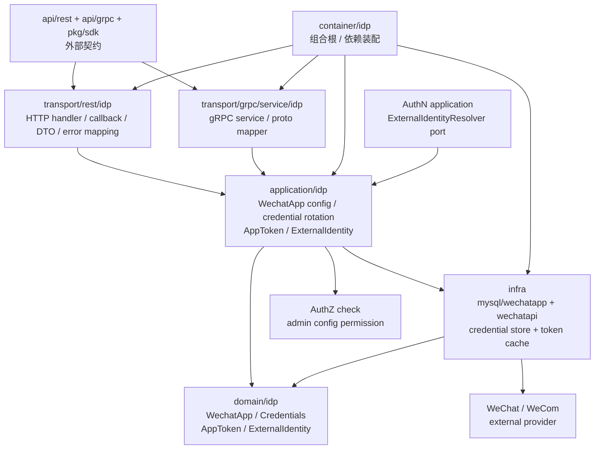

# IDP 分层架构与代码索引

> 状态：规划改造 · 已完成当前事实盘点；正文仍含待实现或尚未收敛的设计内容，不得作为现有能力承诺。

---

## 1. 本文回答

本文回答 9 个问题：

- IDP 模块在代码中如何分层？
- `domain / application / infra / transport / container / contract` 各层分别负责什么？
- `WechatApp / Credentials / AppToken / ExternalIdentity` 应该从哪些入口开始读？
- 微信应用配置、密钥轮换、AccessToken 获取缓存、外部身份解析链路如何串起来？
- MySQL repository、微信 provider adapter、AppToken cache、SecretVault 分别在什么位置？
- IDP 与 AuthN 的跨模块 port 应该放在哪里？
- 哪些依赖方向是允许的，哪些属于边界漂移？
- 修改 IDP 模型、配置链路、token 缓存、provider adapter 时应该检查哪些文件？
- 修改 IDP 代码或文档时应该运行哪些 Verify？

本文是 IDP 的代码导航文档，不重复完整领域模型和关键链路。
领域模型见 [01-领域模型-WechatApp-Credentials-AppToken-ExternalIdentity.md](01-领域模型-WechatApp-Credentials-AppToken-ExternalIdentity.md)；
模块边界见 [05-模块边界-IDP与AuthN.md](05-模块边界-IDP与AuthN.md)；

---

## 2. 30 秒结论

IDP 模块按 IAM 通用分层组织：

```text
transport/rest + transport/grpc
  -> application/idp
  -> domain/idp
  -> infra/mysql + infra/wechatapi + token cache + credential store
  -> container/idp
  -> api/rest + api/grpc + pkg/sdk
```

各层职责：

```text
domain：表达 WechatApp / Credentials / AppToken / ExternalIdentity 的模型和不变量；
application：编排微信应用配置、密钥轮换、AccessToken 获取缓存、ExternalIdentity 解析等用例；
infra：实现 MySQL repository、微信/企微 API adapter、SecretVault/Credentials store、AppToken cache、singleflight/lock；
transport：把 REST/gRPC 请求转换为 application command/query，并处理 provider callback；
container：组合根，装配 IDP repository、service、provider adapter、token cache、handler；
contract：OpenAPI/proto/SDK 对外接入契约。
```

如果只记一句话：

> IDP 的外部身份源规则应落在 domain/application，微信 SDK、MySQL、Redis、SecretVault、HTTP callback 等技术细节应留在 infra/transport，AuthN 只能通过 IDP port 消费 ExternalIdentity。

---

## 3. 分层总图



读图规则：

```text
transport 依赖 application，不直接依赖 repository concrete；
application 可以依赖 domain、repository port、provider adapter port、credential store port、token cache port；
domain 不依赖 transport、infra concrete、REST/gRPC、MySQL、Redis、微信 SDK；
infra 可以依赖 domain 做模型映射和技术实现；
container 可以知道具体实现，但不能执行业务用例；
AuthN 通过 ExternalIdentityResolver port 调用 IDP application，不直接读取 IDP repository 或 provider secret。
```

---

## 4. 代码事实源总表

| 层 | 路径 | 说明 |
| --- | --- | --- |
| Domain | `../../../internal/apiserver/domain/idp/wechatapp` | WechatApp 领域模型，当前代码主入口 |
| Domain root | `../../../internal/apiserver/domain/idp` | IDP domain 根目录，具体结构以代码为准 |
| Application WechatApp | `../../../internal/apiserver/application/idp/wechatapp` | 微信应用配置、查询、管理用例 |
| Application Prepare | `../../../internal/apiserver/application/idp/prepare` | 外部身份解析前置准备或 provider proof 准备 |
| Application root | `../../../internal/apiserver/application/idp` | IDP application 根目录，具体结构以代码为准 |
| MySQL WechatApp | `../../../internal/apiserver/infra/mysql/wechatapp` | WechatApp 持久化实现 |
| WeChat infra | `../../../internal/apiserver/infra/wechatapi` | 微信/企微 API adapter |
| Infra root | `../../../internal/apiserver/infra` | Credential store、AppToken cache、provider adapter 等可能入口 |
| Container | `../../../internal/apiserver/container/idp` | IDP 依赖装配 |
| REST transport | `../../../internal/apiserver/transport/rest/idp` | IDP REST handler、DTO、callback 入口 |
| gRPC transport | `../../../internal/apiserver/transport/grpc/service/idp` | IDP gRPC service、proto mapper |
| REST 契约 | `../../../api/rest/idp.v2.yaml` | IDP REST OpenAPI 契约 |
| gRPC 契约 | `../../../api/grpc/iam/idp/v2/idp.proto` | IDP gRPC proto 契约 |
| SDK | `../../../pkg/sdk` | 对外 SDK 接入封装，具体路径以当前代码为准 |
| 架构测试 | `../../../internal/pkg/architecture` | 分层依赖边界测试 |

注意：上表中的路径需要继续与当前仓库目录逐项核对。如果源码目录已调整，应以代码为准并同步更新本文。

---

## 5. Domain 层

### 5.1 职责

Domain 层负责表达 IDP 的核心模型和不变量。

它应该回答：

```text
WechatApp 是什么？
Credentials 是什么？
AppToken / AppAccessToken 是什么？
ExternalIdentity 是什么？
为什么 WechatApp 不是 LoginIdentity？
为什么 Credentials 不是 AuthN Credential？
为什么 AppToken 不是 IAM AccessToken？
为什么 ExternalIdentity 不是 User / Principal / Subject？
openid / unionid / wecom userid 如何理解？
```

Domain 层不应该负责：

```text
HTTP/gRPC 参数解析；
OpenAPI/proto DTO；
SQL 查询；
MySQL/GORM 细节；
Redis key 细节；
微信 SDK / HTTP client 调用；
SecretVault concrete；
AppToken cache concrete；
AuthN LoginIdentity repository；
Identity User repository；
AuthZ RoleBinding repository；
错误码到 HTTP/gRPC status 的映射。
```

---

### 5.2 代码索引

| 对象 / 能力 | 路径 | 说明 |
| --- | --- | --- |
| WechatApp | `../../../internal/apiserver/domain/idp/wechatapp` | 外部微信/企微应用配置聚合 |
| Credentials / ProviderCredential | `../../../internal/apiserver/domain/idp/wechatapp` | 外部 provider app 凭据，具体文件以源码为准 |
| AppToken / AppAccessToken | `../../../internal/apiserver/domain/idp/wechatapp`、`../../../internal/apiserver/domain/idp` | provider access token |
| ExternalIdentity | `../../../internal/apiserver/domain/idp` | 外部身份声明 |
| Provider / AppType / Status | `../../../internal/apiserver/domain/idp/wechatapp` | provider 类型、应用类型和状态枚举 |
| Domain errors | `../../../internal/apiserver/domain/idp` | IDP 领域错误 |

---

### 5.3 修改入口

如果要修改：

| 目标 | 优先阅读 |
| --- | --- |
| 新增微信应用类型 | `domain/idp/wechatapp` app type、application/idp/wechatapp、REST/gRPC 契约 |
| 修改 WechatApp 状态 | domain status、enable/disable 用例、ExternalIdentity 解析入口 |
| 修改 Credentials 模型 | domain credentials、SecretVault/store、密钥轮换链路、审计 |
| 修改 AppToken 语义 | domain AppToken、application token service、cache、wechatapi adapter |
| 修改 ExternalIdentity 字段 | domain ExternalIdentity、AuthN provider key、LoginIdentity 映射 |
| 修改 provider key 规则 | IDP ExternalIdentity + AuthN LoginIdentity 映射共同核对 |
| 修改 unionid/openid 策略 | ExternalIdentity resolver、AuthN login/link/onboarding 策略 |

---

## 6. Application 层

### 6.1 职责

Application 层负责 IDP 用例编排。

它应该处理：

```text
WechatApp 创建、更新、启用、禁用；
Credentials 创建、加密引用、轮换、禁用；
AppToken 获取、缓存命中、提前刷新、防击穿；
ExternalIdentity 解析；
provider proof 校验和错误归一化；
provider callback 验签/解密编排；
配置管理审计；
必要的 AuthZ management-check；
事务边界和应用错误归一化。
```

Application 层不应该处理：

```text
HTTP/gRPC 协议细节；
SQL 细节；
Redis key 拼接细节，除非通过 cache port；
微信 SDK concrete；
JWT 签名和验签；
LoginIdentity 创建；
User/Profile/ProfileLink 创建；
RoleBinding 创建；
Suggest index 更新。
```

---

### 6.2 代码索引

| 用例组 | 路径 | 说明 |
| --- | --- | --- |
| WechatApp application | `../../../internal/apiserver/application/idp/wechatapp` | 微信应用配置、查询、管理用例 |
| Prepare application | `../../../internal/apiserver/application/idp/prepare` | 外部身份解析准备、provider proof 相关准备 |
| IDP application root | `../../../internal/apiserver/application/idp` | IDP application 根目录 |
| ExternalIdentity resolver | `../../../internal/apiserver/application/idp` | 外部身份解析 use case |
| AppToken service | `../../../internal/apiserver/application/idp` | provider access token 获取与缓存 |
| Credential rotation | `../../../internal/apiserver/application/idp/wechatapp` | 密钥轮换用例 |

---

### 6.3 用例调用主线

微信应用配置：

```text
transport
  -> application/idp/wechatapp command
  -> domain validation
  -> credential encryption/store
  -> repository save
  -> audit
```

密钥轮换：

```text
RotateCredentials
  -> load WechatApp
  -> validate new secret/token/aes key
  -> encrypt secret material
  -> persist new credential version
  -> invalidate AppToken cache if needed
  -> audit
```

微信 AccessToken 获取：

```text
GetAppToken(appID)
  -> load WechatApp
  -> load active Credentials
  -> read AppTokenCache
  -> refresh with singleflight/lock if needed
  -> call provider adapter
  -> cache token
```

外部身份解析：

```text
ResolveExternalIdentity(proof)
  -> load WechatApp
  -> load Credentials / AppToken if needed
  -> call provider adapter
  -> build ExternalIdentity
  -> return to AuthN
```

---

### 6.4 跨模块 port

IDP application 可以通过最小 port 与其他模块协作。

典型 port：

| 协作 | 建议 port 语义 |
| --- | --- |
| AuthN -> IDP | `ExternalIdentityResolver` |
| IDP -> provider | `WechatAPIClient` / `ProviderAdapter` |
| IDP -> credential store | `CredentialStore` / `SecretVault` |
| IDP -> token cache | `AppTokenCache` |
| IDP -> lock/singleflight | `RefreshLock` / `SingleflightGroup` |
| IDP -> audit | `AuditRecorder` |
| IDP admin -> AuthZ | `ManagementAuthorizer`，若配置管理需要授权 |

要求：

```text
只暴露最小能力；
AuthN 不直接读取 raw provider secret；
IDP 不直接 import AuthN LoginIdentity repository concrete；
provider adapter 只返回 provider result，不写业务表；
组合根负责装配具体实现；
跨模块协作必须可测试。
```

---

## 7. Infra 层

### 7.1 职责

Infra 层负责 IDP 相关技术实现。

它应该处理：

```text
WechatApp repository concrete；
Credentials repository / store concrete；
SecretVault / encryption concrete；
AppToken cache concrete；
RefreshLock / singleflight concrete；
微信/企微 provider API adapter；
provider callback verifier；
domain entity 与 persistence record 映射；
provider error code 到 application error 的转换辅助。
```

Infra 层不应该处理：

```text
定义 IDP 领域模型；
创建 LoginIdentity；
创建 User/Profile/ProfileLink；
签发 IAM Token；
写 RoleBinding；
更新 Suggest index；
决定 AuthN 登录是否成功；
把 provider raw response 直接暴露给客户端。
```

---

### 7.2 代码索引

| 能力 | 路径 | 说明 |
| --- | --- | --- |
| WechatApp MySQL repository | `../../../internal/apiserver/infra/mysql/wechatapp` | WechatApp 持久化实现 |
| WeChat API adapter | `../../../internal/apiserver/infra/wechatapi` | 微信/企微 API 调用封装 |
| Credential store | `../../../internal/apiserver/infra` | ProviderCredential 加密保存和读取，具体路径以代码为准 |
| SecretVault / encryption | `../../../internal/apiserver/infra` | 密钥加解密、fingerprint，具体路径以代码为准 |
| AppToken cache | `../../../internal/apiserver/infra` | provider AppToken 缓存，具体路径以代码为准 |
| RefreshLock / singleflight | `../../../internal/apiserver/infra` | 防击穿并发控制，具体路径以代码为准 |
| Provider callback verifier | `../../../internal/apiserver/infra/wechatapi`、`../../../internal/apiserver/infra` | callback 验签/解密 |

---

### 7.3 需要重点核对的实现点

| 实现点 | 为什么重要 |
| --- | --- |
| appID/corpID 唯一约束 | 防 provider app 配置冲突 |
| WechatApp status 检查 | disabled app 不应继续解析身份 |
| Credentials 加密保存 | 防 app secret 泄露 |
| Credentials fingerprint | 支持审计和排查 |
| credential version | 支持密钥轮换和 cache 失效 |
| AppToken TTL / refresh margin | 防临界过期 |
| singleflight/lock | 防 provider API 击穿 |
| provider error mapping | 区分 provider proof 错误和系统错误 |
| callback 验签失败即拒绝 | 防伪造 provider event |
| 日志脱敏 | 防 code/token/secret 泄露 |

---

## 8. Transport 层

### 8.1 职责

Transport 层负责协议适配和 provider callback 接入。

它应该处理：

```text
REST path/query/body/header 解析；
gRPC request metadata/message 解析；
provider callback query/body 解析；
DTO/proto 到 application command/query 的转换；
调用 IDP application service；
把 application result 转换为 REST/gRPC response；
把 application error 映射为 HTTP/gRPC 错误；
必要时从 AuthN/AuthZ middleware 获取管理操作上下文。
```

Transport 层不应该处理：

```text
直接访问 repository；
直接读取 raw provider secret；
直接调用微信 SDK；
直接写 AppToken cache；
直接创建 LoginIdentity；
直接创建 User；
直接签发 IAM Token；
直接写 RoleBinding；
把 provider raw response 原样返回给客户端。
```

---

### 8.2 代码索引

| 协议 | 路径 | 说明 |
| --- | --- | --- |
| REST IDP | `../../../internal/apiserver/transport/rest/idp` | IDP REST handler、DTO、callback 入口 |
| gRPC IDP | `../../../internal/apiserver/transport/grpc/service/idp` | IDP gRPC service、proto mapper |
| REST root | `../../../internal/apiserver/transport/rest` | 路由注册、middleware 接入 |
| gRPC root | `../../../internal/apiserver/transport/grpc` | gRPC service 注册、interceptor 接入 |

---

### 8.3 错误映射建议

| 应用错误 | REST | gRPC |
| --- | --- | --- |
| 参数错误 | `400 Bad Request` | `InvalidArgument` |
| provider app 不存在 | `404 Not Found` | `NotFound` |
| provider app disabled | `409 Conflict` 或 `403 Forbidden` | `FailedPrecondition` 或 `PermissionDenied` |
| provider proof 无效 | `401 Unauthorized` 或 `400 Bad Request` | `Unauthenticated` 或 `InvalidArgument` |
| provider API 超时 | `502 Bad Gateway` / `504 Gateway Timeout` | `Unavailable` / `DeadlineExceeded` |
| appID 重复 | `409 Conflict` | `AlreadyExists` |
| 密钥轮换冲突 | `409 Conflict` | `FailedPrecondition` |
| 内部错误 | `500 Internal Server Error` | `Internal` |

具体映射必须以当前 REST/OpenAPI、proto 和错误处理实现为准。

安全建议：

```text
对外错误不泄露 secret 是否正确；
日志保留 provider、appID、credentialVersion、traceID；
日志不打印 code、session_key、access_token、app secret、encoding aes key。
```

---

## 9. Container 层

### 9.1 职责

Container 是组合根，负责把 IDP 模块装配进 iam-apiserver。

它应该处理：

```text
创建 WechatApp repository concrete；
创建 CredentialStore / SecretVault concrete；
创建 AppTokenCache concrete；
创建 RefreshLock / singleflight concrete；
创建 WeChat / WeCom provider adapter；
创建 IDP application service；
创建 ExternalIdentityResolver port implementation；
创建 REST handler 和 callback handler；
创建并注册 IDP gRPC service，公开 `GetWechatApp`、`GetWechatAccessToken` 和 `RefreshWechatAccessToken`；
把 IDP service 注入 AuthN provider login strategy；
把模块对象暴露给 process/transport 注册。
```

Container 不应该处理：

```text
执行业务配置写入；
执行 ExternalIdentity 解析；
直接刷新 AppToken；
直接调用 provider API；
处理 HTTP/gRPC 请求；
创建 LoginIdentity；
签发 IAM Token。
```

---

### 9.2 代码索引

| 能力 | 路径 | 说明 |
| --- | --- | --- |
| IDP module wiring | `../../../internal/apiserver/container/idp` | IDP repository、service、adapter、handler 装配 |
| Root container | `../../../internal/apiserver/container` | 全局组合根入口，具体路径以当前代码为准 |
| AuthN wiring with IDP | `../../../internal/apiserver/container/authn`、`../../../internal/apiserver/container/idp` | AuthN provider login strategy 与 IDP resolver 装配 |
| Process lifecycle | `../../../internal/apiserver/process` | 后台任务生命周期，若 AppToken 预热或 callback task 存在 |

---

## 10. 契约与 SDK

### 10.1 REST 契约

REST 契约路径：

```text
../../../api/rest/idp.v2.yaml
```

REST 契约应回答：

```text
有哪些 IDP HTTP endpoint；
WechatApp 创建/更新/启用/禁用如何表达；
Credentials 轮换接口如何表达；
是否暴露 AppToken 管理/刷新接口；
provider callback URL 如何定义；
请求/响应 DTO 是否隐藏 raw secret；
错误码如何表达；
哪些管理接口需要 Bearer token 和 AuthZ Check。
```

---

### 10.2 gRPC 契约

gRPC 契约路径：

```text
../../../api/grpc/iam/idp/v2/idp.proto
```

gRPC 契约应回答：

```text
有哪些 IDP RPC；
WechatApp / Credentials / ExternalIdentity message 如何表达；
是否提供 ResolveExternalIdentity RPC；
是否提供 AppToken 管理 RPC；
metadata 中如何携带认证上下文；
错误语义如何映射；
字段是否与 REST 和 application 语义一致。
```

---

### 10.3 SDK

SDK 应基于 REST/OpenAPI 或 gRPC/proto 契约生成或封装。

SDK 不应该：

```text
暴露 raw app secret；
暴露 raw provider access_token；
在客户端自行调用 provider API；
绕过服务端 IDP application；
直接决定 AuthN 登录是否成功；
把 SDK DTO 当作 domain entity；
隐藏 provider proof invalid 和 provider API unavailable 的错误差异。
```

---

## 11. 典型修改路径

### 11.1 新增微信应用类型

推荐检查顺序：

```text
1. domain/idp/wechatapp：AppType / Provider 类型
2. application/idp/wechatapp：创建/更新/启用校验
3. infra/wechatapi：provider adapter 是否支持
4. REST/gRPC 契约：DTO/proto 枚举
5. container/idp：装配对应 adapter
6. tests + docs
```

---

### 11.2 修改密钥轮换策略

推荐检查顺序：

```text
1. domain/idp/wechatapp：Credentials / version / status
2. application/idp/wechatapp：RotateCredentials 用例
3. infra：SecretVault / encryption / fingerprint
4. infra/cache：AppToken cache invalidation
5. provider callback verifier：active/verify-only 策略
6. audit / logs / metrics
7. tests + docs
```

---

### 11.3 修改 AppToken 获取缓存

推荐检查顺序：

```text
1. domain/idp：AppToken / AppAccessToken 语义
2. application/idp：GetAppToken service
3. infra：AppTokenCache / RefreshLock / singleflight
4. infra/wechatapi：Fetch token API adapter
5. container/idp：cache/lock/provider 装配
6. metrics/logs
7. tests + docs
```

---

### 11.4 修改 ExternalIdentity 解析

推荐检查顺序：

```text
1. domain/idp：ExternalIdentity 字段和不变量
2. application/idp/prepare 或 resolver：proof 解析用例
3. infra/wechatapi：code/auth_code exchange adapter
4. AuthN application：provider key 构造和 LoginIdentity 映射
5. AuthN domain：LoginIdentity 唯一约束和状态
6. REST/gRPC 契约
7. tests + docs
```

---

### 11.5 修改 IDP 与 AuthN 协作

推荐检查顺序：

```text
1. 05-模块边界-IDP与AuthN.md
2. application/idp：ExternalIdentityResolver port implementation
3. application/authn：provider login/link/onboarding strategy
4. domain/authn：LoginIdentity / Credential / Principal
5. container/idp + container/authn：依赖装配
6. architecture tests
7. docs
```

---

### 11.6 修改 provider adapter

推荐检查顺序：

```text
1. infra/wechatapi：adapter implementation
2. application/idp：provider port interface
3. domain/idp：provider result 映射对象
4. error mapping：provider error code -> application error
5. timeout/retry/rate limit 配置
6. logs/metrics 脱敏
7. tests + docs
```

---

## 12. 依赖方向规则

### 12.1 允许

```text
transport -> application
application -> domain
application -> repository/provider/cache/secret/audit port
application -> AuthZ management-check port，若需要
AuthN application -> IDP ExternalIdentityResolver port
infra -> domain
infra -> provider SDK / HTTP client concrete
container -> all concrete wiring targets
contract -> transport implementation alignment
```

### 12.2 禁止

```text
domain/idp -> application/idp；
domain/idp -> infra/mysql；
domain/idp -> infra/wechatapi；
domain/idp -> transport/rest；
domain/idp -> transport/grpc；
domain/idp -> api/rest or api/grpc；
domain/idp -> provider SDK concrete；
domain/idp -> Redis/MySQL client concrete；
application/idp -> transport；
application/idp -> AuthN LoginIdentity repository concrete；
application/idp -> Identity User repository concrete；
application/idp -> AuthZ RoleBinding repository concrete；
transport/idp -> infra repository concrete；
AuthN application -> IDP repository concrete；
infra/wechatapi -> AuthN/Identity/AuthZ repository concrete。
```

---

## 13. 常见反模式

| 反模式 | 问题 | 推荐做法 |
| --- | --- | --- |
| transport 直接调用微信 SDK | 协议层吞并 infra | transport 调 application，infra 调 provider |
| AuthN 直接读 IDP repository | AuthN/IDP 边界漂移 | AuthN 通过 ExternalIdentityResolver port |
| IDP 创建 LoginIdentity | IDP 吞并 AuthN | AuthN 根据 ExternalIdentity 创建或查找 |
| IDP 创建 User | IDP 吞并 Identity | Onboarding 用例处理 |
| IDP 写 RoleBinding | IDP 吞并 AuthZ | 授权归 AuthZ |
| AppToken 返回给前端 | provider 凭据泄露 | AppToken 只在服务端内部使用 |
| raw secret 出现在 DTO | 严重安全问题 | DTO 只返回 fingerprint/version |
| domain import 微信 SDK | 领域层依赖外部 provider | provider SDK 留在 infra adapter |
| callback handler 直接写业务表 | provider event 越权 | callback 走 application 用例 |
| provider raw response 直接返回 | 泄露和契约不稳定 | 映射为稳定 DTO/result |

---

## 14. Verify

修改本文后至少执行：

```bash
make docs-hygiene
```

涉及 IDP domain：

```bash
go test ./internal/apiserver/domain/idp/...
```

如果实际 domain 更细，以当前代码为准，例如：

```bash
go test ./internal/apiserver/domain/idp/wechatapp/...
```

涉及 IDP application：

```bash
go test ./internal/apiserver/application/idp/...
```

如果实际 application 更细，以当前代码为准，例如：

```bash
go test ./internal/apiserver/application/idp/wechatapp/...
go test ./internal/apiserver/application/idp/prepare/...
```

涉及 container / transport：

```bash
go test ./internal/apiserver/container/idp
go test ./internal/apiserver/transport/rest/idp
```

如果 gRPC 已实现：

```bash
go test ./internal/apiserver/transport/grpc/service/idp/...
```

涉及 infra repository / provider adapter / cache：

```bash
go test ./internal/apiserver/infra/mysql/wechatapp/...
go test ./internal/apiserver/infra/wechatapi/...
go test ./internal/apiserver/infra/...
```

涉及 AuthN 协作：

```bash
go test ./internal/apiserver/domain/authn/...
go test ./internal/apiserver/application/authn/...
```

涉及 REST/gRPC 契约：

```bash
make api-validate
make proto-gen
```

涉及 SDK：

```bash
go test ./pkg/sdk/...
```

涉及分层依赖边界：

```bash
go test ./internal/pkg/architecture
```

---

## 15. 本文总结

IDP 的代码结构可以压缩成：

```text
domain       定义 WechatApp / Credentials / AppToken / ExternalIdentity
application  编排微信应用配置、密钥轮换、AccessToken 获取缓存、ExternalIdentity 解析
infra        实现 MySQL repository、微信/企微 provider adapter、SecretVault、AppToken cache、RefreshLock
transport    适配 REST/gRPC 请求、响应、provider callback 和错误映射
container    装配 IDP 模块依赖，并把 ExternalIdentityResolver 暴露给 AuthN
contract     约束 REST/gRPC/SDK 对外接入语义
```

维护 IDP 时最重要的工程规则是：

```text
外部 provider 细节不要进入 domain；
raw secret/token 不要进入 transport response；
AuthN 不直接读取 IDP repository 或 raw provider secret；
IDP 不创建 LoginIdentity、User、Principal、Token 或 RoleBinding；
provider adapter 只封装外部 API，不写业务表；
组合根只装配依赖，不执行业务用例。
```

读完本文后，IDP 模块主文档已经形成闭环：

```text
00-模块总览.md
01-领域模型-WechatApp-Credentials-AppToken-ExternalIdentity.md
02-关键链路-微信应用配置与密钥轮换.md
03-关键链路-微信AccessToken获取与缓存.md
04-关键链路-外部身份解析与AuthN协作.md
05-模块边界-IDP与AuthN.md
06-分层架构与代码索引.md
```
