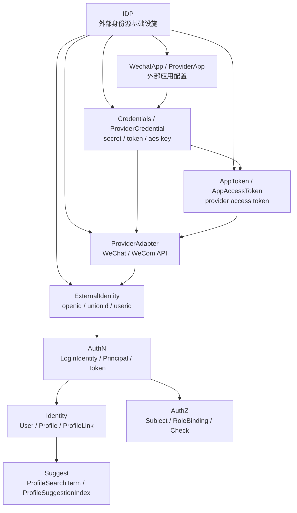

# IDP

> 状态：设计目标 · IDP 模块入口，已按“模型主文档 + 三条关键链路 + 模块边界 + 代码索引”的结构重写，待继续按源码、契约、配置和测试核对。

---

## 1. 本目录定位

`04-IDP/` 是 IAM IDP 模块的文档入口。

IDP 是 IAM 的外部身份源基础设施模块，负责回答：

```text
IAM 如何安全、稳定、可治理地接入外部身份提供方，
并把外部 provider 的 app、secret、token、identity claim，
转换成 AuthN 可以使用的外部身份事实？
```

IDP 维护和产生：

```text
WechatApp / ProviderApp；
Credentials / ProviderCredential；
AppToken / AppAccessToken；
ExternalIdentity；
provider callback verification result；
provider adapter result。
```

IDP 不负责登录态、不签发 IAM Token、不创建 IAM 内部用户、不做授权判定、不维护搜索索引。

对应边界：

```text
AuthN 负责 LoginIdentity / Credential / Challenge / Principal / Session / Token / JWKS；
Identity 负责 User / Profile / ProfileLink；
AuthZ 负责 Subject / Role / Permission / RoleBinding / Check；
Suggest 负责 ProfileSearchTerm / ProfileAccessScope / ProfileSuggestionIndex；
Provider adapter 是 infra runtime，不是领域模型本身。
```

---

## 2. 30 秒结论

IDP 可以压缩成一条外部身份源接入主线：

```text
WechatApp / ProviderApp
  -> Credentials / ProviderCredential
  -> AppToken / AppAccessToken
  -> ExternalIdentity
  -> AuthN LoginIdentity / Principal
```

每个对象的职责是：

| 对象 | 一句话 | 不是什么 |
| --- | --- | --- |
| `WechatApp` / `ProviderApp` | 外部微信/企微应用配置 | 不是 `User`，不是 `LoginIdentity` |
| `Credentials` / `ProviderCredential` | 外部应用凭据集合 | 不是 AuthN `Credential`，不是用户密码 |
| `AppToken` / `AppAccessToken` | 外部 provider 应用访问令牌 | 不是 IAM `AccessToken` / `RefreshToken` |
| `ExternalIdentity` | 外部身份声明 | 不是 `User`，不是 `Principal`，不是 `Subject` |
| `ProviderAdapter` | 微信/企微 API 技术适配器 | 不是 IDP 领域模型，也不写业务表 |

最重要的边界：

```text
WechatApp 不是 LoginIdentity；
Credentials 不是 AuthN Credential；
AppToken 不是 IAM AccessToken；
ExternalIdentity 不是 LoginIdentity；
ExternalIdentity 不是 User；
ExternalIdentity 不是 Principal；
ExternalIdentity 不是 Subject；
openid / unionid / wecom userid 不是 UserID；
provider proof 不是长期 Credential；
IDP 解析成功不等于 AuthN 登录成功。
```

如果只记一句话：

> IDP 负责“外部 provider 说了什么”，AuthN 负责“这些外部身份声明在 IAM 中能不能登录成谁”。

---

## 3. 文档结构

当前 IDP 模块保留 6 篇主文档：

| 文档 | 作用 | 阅读重点 |
| --- | --- | --- |
| [00-模块总览.md](00-模块总览.md) | IDP 职责、核心对象、关键链路和模块协作总览 | 建立对 IDP 的整体认知 |
| [01-领域模型-WechatApp-Credentials-AppToken-ExternalIdentity.md](01-领域模型-WechatApp-Credentials-AppToken-ExternalIdentity.md) | IDP 核心模型、模型图、生命周期、状态流转和不变量 | 唯一模型主文档 |
| [02-关键链路-微信应用配置与密钥轮换.md](02-关键链路-微信应用配置与密钥轮换.md) | 微信应用配置和密钥轮换链路 | WechatApp 元数据、Credentials 安全存储、fingerprint、双凭据窗口、AppToken cache 失效 |
| [03-关键链路-微信AccessToken获取与缓存.md](03-关键链路-微信AccessToken获取与缓存.md) | 微信/企微 provider access token 获取与缓存 | TTL、refresh margin、singleflight/lock、stale fallback、防击穿 |
| [04-关键链路-外部身份解析与AuthN协作.md](04-关键链路-外部身份解析与AuthN协作.md) | 外部身份解析与 AuthN 登录/绑定/开通协作 | `ExternalIdentity -> provider key -> LoginIdentity -> Principal -> Token` |
| [05-模块边界-IDP与AuthN.md](05-模块边界-IDP与AuthN.md) | IDP 与 AuthN、Identity、AuthZ、Suggest、provider adapter 的边界 | 防止 ExternalIdentity/LoginIdentity、AppToken/IAM Token、openid/UserID 混淆 |
| [06-分层架构与代码索引.md](06-分层架构与代码索引.md) | domain/application/infra/transport/container/contract 代码索引 | 修改代码时的导航入口和 Verify |

注意：

```text
原 02-领域模型图.md 的核心内容已经合并进 01-领域模型-WechatApp-Credentials-AppToken-ExternalIdentity.md。
后续如果该文件仍存在，应考虑删除、归档或改成跳转说明，避免重复维护。
```

---

## 4. IDP 模块总图



读图规则：

```text
WechatApp 描述外部 provider app 配置；
Credentials 描述外部 provider app 的敏感凭据；
AppToken 是外部 provider access token，不是 IAM AccessToken；
ProviderAdapter 封装微信/企微 API，不是领域模型；
ExternalIdentity 是外部身份声明，不是 IAM User，也不是 LoginIdentity；
AuthN 决定 ExternalIdentity 如何映射或绑定为 LoginIdentity；
IDP 不签发 IAM Token，不创建 User，不写 RoleBinding。
```

---

## 5. 核心对象

### 5.1 WechatApp / ProviderApp

`WechatApp` 是外部微信/企微应用配置聚合。

它回答：

```text
IAM 当前接入了哪个微信/企微应用？
这个应用属于哪类 provider app？
它是否启用？
它使用哪组凭据？
它如何处理 callback 或消息验签？
```

关键边界：

```text
WechatApp 是外部 provider app 配置；
WechatApp 不是 User；
WechatApp 不是 LoginIdentity；
WechatApp 不是 Principal；
WechatApp 不是 Subject；
WechatApp 不表达授权权限；
WechatApp 不代表某个用户已登录。
```

---

### 5.2 Credentials / ProviderCredential

`Credentials` 表达外部应用凭据集合。

典型凭据：

```text
app secret；
callback token；
encoding aes key；
corp secret；
agent secret；
private key，若 provider 需要。
```

关键边界：

```text
Credentials 是 provider app 凭据；
Credentials 不是 AuthN Credential；
Credentials 不保存 IAM 用户密码；
Credentials 不用于校验 IAM 用户身份；
Credentials 不应进入 LoginIdentity；
Credentials 不应进入 IAM Token claims；
Credentials 只服务 provider API 调用、callback 验签和消息解密。
```

---

### 5.3 AppToken / AppAccessToken

`AppToken` 或 `AppAccessToken` 是外部 provider 的应用访问令牌。

典型例子：

```text
微信 access_token；
企业微信 access_token；
provider app access token。
```

关键边界：

```text
AppToken 是 provider token；
AppToken 不是 IAM AccessToken；
AppToken 不是 IAM RefreshToken；
AppToken 不能访问 IAM API；
AppToken 不代表 IAM 用户已登录；
AppToken 不应进入 AuthN Token；
AppToken 不应作为 AuthZ 授权凭证；
AppToken 的缓存、过期、刷新归 IDP 管理。
```

---

### 5.4 ExternalIdentity

`ExternalIdentity` 是外部 provider 返回的身份声明。

典型字段：

```text
provider；
appID；
openid；
unionid；
wecomUserID；
externalUserID；
raw claims；
resolvedAt。
```

关键边界：

```text
ExternalIdentity 不是 IAM User；
ExternalIdentity 不是 LoginIdentity；
ExternalIdentity 不是 Principal；
ExternalIdentity 不是 Subject；
ExternalIdentity 不直接表达权限；
ExternalIdentity 不应直接创建 User；
ExternalIdentity 不应直接写 RoleBinding；
ExternalIdentity 需要交给 AuthN，由 AuthN 决定登录、注册、绑定或拒绝。
```

---

## 6. 关键链路

### 6.1 微信应用配置与密钥轮换

配置链路负责安全维护 `WechatApp` 元数据和 provider credentials。

主线：

```text
Create / Update WechatApp
  -> validate app metadata
  -> persist WechatApp
  -> encrypt and persist Credentials
  -> enable / disable app
  -> invalidate related AppToken cache if needed
  -> audit config change
```

密钥轮换主线：

```text
Rotate Credentials
  -> load WechatApp
  -> validate new secret/token/aes key
  -> encrypt by SecretVault / KMS
  -> generate credential version and fingerprint
  -> keep old credential in verify-only window if needed
  -> promote new credential
  -> invalidate AppToken cache if needed
  -> audit rotation
```

重点边界：

```text
WechatApp 是外部 provider app 配置，不是 LoginIdentity；
Credentials 是 provider app 凭据，不是 AuthN Credential；
AppSecret / CallbackToken / EncodingAESKey 不应明文返回；
密钥轮换不创建 User、LoginIdentity、Principal、Token 或 RoleBinding；
AppToken cache 失效不等于 IAM AccessToken 失效。
```

详细说明见 [02-关键链路-微信应用配置与密钥轮换.md](02-关键链路-微信应用配置与密钥轮换.md)。

---

### 6.2 微信 AccessToken 获取与缓存

AccessToken 获取与缓存链路负责为 provider API 调用提供可用的外部 app access token。

主线：

```text
GetAppToken(appID)
  -> load WechatApp
  -> check app enabled
  -> load active Credentials
  -> read AppTokenCache
  -> if valid return cached token
  -> if near expiry try refresh
  -> acquire refresh lock / singleflight
  -> call AppTokenProvider.Fetch
  -> cache token with TTL and refresh margin
  -> return AppToken
```

重点边界：

```text
微信 access_token 是外部 provider token；
IAM AccessToken 由 AuthN 签发；
微信 access_token 不能访问 IAM API；
微信 access_token 不代表 IAM 用户已登录；
缓存失败不能被写成认证成功或失败的业务事实；
AppToken 获取不创建 User、LoginIdentity、Principal、Session 或 RoleBinding。
```

详细说明见 [03-关键链路-微信AccessToken获取与缓存.md](03-关键链路-微信AccessToken获取与缓存.md)。

---

### 6.3 外部身份解析与 AuthN 协作

外部身份解析链路负责把 provider proof 解析成 `ExternalIdentity`，再交给 AuthN 处理。

主线：

```text
external proof(code/auth_code/encrypted payload)
  -> IDP resolve WechatApp
  -> IDP load Credentials / AppToken if needed
  -> IDP call provider API or verify payload
  -> IDP build ExternalIdentity
  -> AuthN build provider key
  -> AuthN find or bind LoginIdentity
  -> AuthN build Principal
  -> AuthN create Session / Token if login succeeds
```

重点边界：

```text
IDP 只解析外部身份事实；
IDP 不创建 LoginIdentity；
IDP 不创建 User；
IDP 不创建 Principal；
IDP 不签发 IAM Token；
AuthN 决定登录是否成功；
Token 链路不直接依赖原始 IDP proof；
ExternalIdentity 不是 User、不是 Principal、不是 Subject。
```

详细说明见 [04-关键链路-外部身份解析与AuthN协作.md](04-关键链路-外部身份解析与AuthN协作.md)。

---

## 7. 模块边界

| 边界 | 正确理解 | 错误理解 |
| --- | --- | --- |
| `WechatApp` 与 `LoginIdentity` | app 级配置可解析多个外部身份 | WechatApp 就是 LoginIdentity |
| `Credentials` 与 AuthN `Credential` | provider app 凭据只服务外部 API | provider secret 是用户凭据 |
| `AppToken` 与 IAM `AccessToken` | AppToken 只调用 provider API | 微信 access_token 可访问 IAM API |
| `ExternalIdentity` 与 `LoginIdentity` | ExternalIdentity 可映射为 LoginIdentity | ExternalIdentity 就是 LoginIdentity |
| `ExternalIdentity` 与 `User` | 外部身份声明需经 AuthN/Identity 映射 | openid/unionid 就是 UserID |
| `ExternalIdentity` 与 `Subject` | AuthN 登录成功后 Principal 才能映射 Subject | openid 直接进入 AuthZ Check |
| provider proof 与 Credential | proof 短期、一次性或上下文绑定 | code/auth_code 长期保存为 Credential |
| provider adapter 与 domain | adapter 是 infra 实现 | 微信 SDK 进入 domain |

详细说明见 [05-模块边界-IDP与AuthN.md](05-模块边界-IDP与AuthN.md)。

---

## 8. 分层架构

IDP 代码按以下分层维护：

```text
transport/rest + transport/grpc
  -> application/idp
  -> domain/idp
  -> infra/mysql + infra/wechatapi + token cache + credential store
  -> container/idp
  -> api/rest + api/grpc + pkg/sdk
```

| 层 | 职责 |
| --- | --- |
| domain | 定义 WechatApp / Credentials / AppToken / ExternalIdentity |
| application | 编排微信应用配置、密钥轮换、AccessToken 获取缓存、ExternalIdentity 解析 |
| infra | 实现 MySQL repository、微信/企微 provider adapter、SecretVault、AppToken cache、RefreshLock |
| transport | 适配 REST/gRPC 请求、响应、provider callback 和错误映射 |
| container | 装配 IDP 模块依赖，并把 ExternalIdentityResolver 暴露给 AuthN |
| contract | 约束 REST/gRPC/SDK 对外接入语义 |

详细代码索引见 [06-分层架构与代码索引.md](06-分层架构与代码索引.md)。

---

## 9. 推荐阅读路径

### 9.1 新读者

```text
00-模块总览.md
  -> 01-领域模型-WechatApp-Credentials-AppToken-ExternalIdentity.md
  -> 05-模块边界-IDP与AuthN.md
```

目标：先理解 IDP 是什么，以及它不是什么。

---

### 9.2 准备配置微信/企微应用

```text
02-关键链路-微信应用配置与密钥轮换.md
  -> 01-领域模型-WechatApp-Credentials-AppToken-ExternalIdentity.md
  -> 06-分层架构与代码索引.md
```

目标：理解 WechatApp 元数据、Credentials、密钥轮换、双凭据窗口、审计和缓存失效。

---

### 9.3 准备排查 provider access token

```text
03-关键链路-微信AccessToken获取与缓存.md
  -> 02-关键链路-微信应用配置与密钥轮换.md
  -> 06-分层架构与代码索引.md
```

目标：理解 TTL、refresh margin、singleflight/lock、stale fallback、防击穿和 token-affecting 配置变更。

---

### 9.4 准备实现微信/企微登录

```text
04-关键链路-外部身份解析与AuthN协作.md
  -> ../02-AuthN/04-关键链路-Login登录认证.md
  -> ../02-AuthN/03-关键链路-Linking登录身份绑定.md
  -> ../02-AuthN/02-关键链路-Onboarding身份开通.md
```

目标：理解 IDP 只负责解析 ExternalIdentity，AuthN 负责 LoginIdentity、Principal、Session 和 Token。

---

### 9.5 准备修改 IDP 与 AuthN 协作

```text
05-模块边界-IDP与AuthN.md
  -> 04-关键链路-外部身份解析与AuthN协作.md
  -> ../02-AuthN/07-模块边界-AuthN与Identity-IDP-AuthZ.md
  -> 06-分层架构与代码索引.md
```

目标：确认 ExternalIdentity、LoginIdentity、User、Principal、Token 的边界没有漂移。

---

## 10. 代码事实源

| 事实 | 路径 |
| --- | --- |
| IDP domain root | `../../../internal/apiserver/domain/idp` |
| WechatApp domain | `../../../internal/apiserver/domain/idp/wechatapp` |
| IDP application root | `../../../internal/apiserver/application/idp` |
| WechatApp application | `../../../internal/apiserver/application/idp/wechatapp` |
| Prepare application | `../../../internal/apiserver/application/idp/prepare` |
| MySQL WechatApp repository | `../../../internal/apiserver/infra/mysql/wechatapp` |
| WeChat / WeCom provider adapter | `../../../internal/apiserver/infra/wechatapi` |
| Credential store / AppToken cache | `../../../internal/apiserver/infra` |
| IDP REST transport | `../../../internal/apiserver/transport/rest/idp` |
| IDP gRPC transport | `../../../internal/apiserver/transport/grpc/service/idp` |
| IDP container | `../../../internal/apiserver/container/idp` |
| REST 契约 | `../../../api/rest/idp.v2.yaml` |
| gRPC 契约 | `../../../api/grpc/iam/idp/v2/idp.proto` |
| 架构测试 | `../../../internal/pkg/architecture` |

注意：上表中的具体路径需要继续与当前源码核对。如果源码目录已调整，应以代码为准并同步更新本文。

---

## 11. 常见反模式

| 反模式 | 问题 | 推荐做法 |
| --- | --- | --- |
| WechatApp 当 LoginIdentity | app 配置和用户登录身份混淆 | WechatApp 归 IDP，LoginIdentity 归 AuthN |
| Credentials 当 AuthN Credential | provider secret 和用户凭据混淆 | ProviderCredential 归 IDP，Credential 归 AuthN |
| AppToken 当 IAM AccessToken | provider token 和 IAM token 混淆 | AppToken 只用于 provider API |
| ExternalIdentity 当 User | 外部声明和内部身份混淆 | AuthN/Identity 显式映射 |
| openid 当 UserID | 外部 app 维度 ID 和内部 ID 混淆 | openid 进入 LoginIdentity external id |
| IDP 直接签发 Token | IDP 吞并 AuthN | AuthN 基于 Principal 签发 Token |
| IDP 直接创建 User | IDP 吞并 Identity | Onboarding 用例处理 |
| IDP 直接写 RoleBinding | IDP 吞并 AuthZ | 授权归 AuthZ |
| AuthN 直接读取 provider secret | AuthN 吞并 IDP | AuthN 通过 IDP port 解析 |
| provider adapter 直接写业务表 | infra 越权 | adapter 只返回 provider result |
| AppToken 返回给前端 | provider 凭据泄露 | AppToken 只在服务端内部使用 |
| raw secret 出现在 DTO | 严重安全问题 | DTO 只返回 fingerprint/version |

---

## 12. Verify

修改本目录文档后至少执行：

```bash
make docs-hygiene
```

涉及 IDP domain：

```bash
go test ./internal/apiserver/domain/idp/...
```

如果实际 domain 更细，以当前代码为准，例如：

```bash
go test ./internal/apiserver/domain/idp/wechatapp/...
```

涉及 IDP application：

```bash
go test ./internal/apiserver/application/idp/...
```

如果实际 application 更细，以当前代码为准，例如：

```bash
go test ./internal/apiserver/application/idp/wechatapp/...
go test ./internal/apiserver/application/idp/prepare/...
```

涉及 container / transport：

```bash
go test ./internal/apiserver/container/idp
go test ./internal/apiserver/transport/rest/idp
```

涉及 gRPC transport：

```bash
go test ./internal/apiserver/transport/grpc/service/idp/...
```

涉及 infra repository / provider adapter / cache：

```bash
go test ./internal/apiserver/infra/mysql/wechatapp/...
go test ./internal/apiserver/infra/wechatapi/...
go test ./internal/apiserver/infra/...
```

涉及 AuthN 协作：

```bash
go test ./internal/apiserver/domain/authn/...
go test ./internal/apiserver/application/authn/...
```

涉及 Identity / AuthZ / Suggest 边界：

```bash
go test ./internal/apiserver/domain/identity/...
go test ./internal/apiserver/domain/authz/...
go test ./internal/apiserver/domain/suggest/...
```

涉及 REST/gRPC 契约：

```bash
make api-validate
make proto-gen
```

涉及 SDK：

```bash
go test ./pkg/sdk/...
```

涉及分层依赖边界：

```bash
go test ./internal/pkg/architecture
```

---

## 13. 本目录总结

IDP 模块的主线是：

```text
WechatApp / ProviderApp
  -> Credentials / ProviderCredential
  -> AppToken / AppAccessToken
  -> ExternalIdentity
  -> AuthN LoginIdentity / Principal
```

IDP 的核心职责是：

```text
维护外部 provider app 元数据；
安全保存和使用 provider credentials；
获取、缓存和刷新 provider AppToken；
通过 provider adapter 解析外部身份声明；
把 ExternalIdentity 交给 AuthN 使用。
```

IDP 的核心边界是：

```text
不做 IAM 登录认证；
不创建 LoginIdentity；
不创建 User/Profile/ProfileLink；
不签发 IAM AccessToken / RefreshToken；
不做 Role/Permission/RoleBinding/Check；
不维护 Suggest 搜索索引；
不把 provider AppToken 当成 IAM Token；
不把 openid/unionid/wecom userid 当成 IAM UserID；
不把微信 SDK / provider raw response 写进 domain。
```

读完本目录后，应能清楚说明 IDP 的模型、链路、边界和代码入口，并能在修改代码时避免把 AuthN、Identity、AuthZ、Suggest 或 provider infra 的职责混入 IDP。
