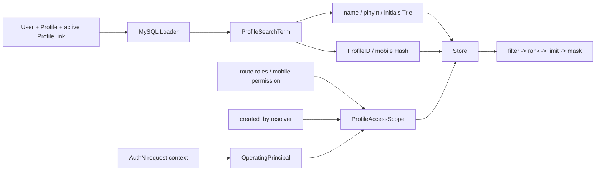

# Suggest 模块总览

> 状态：已实现 · 本文从读模型、索引、权限过滤和刷新协议四个角度解释 Suggest，并明确它为什么不是 Identity 仓储或 AuthZ 判定器。

## 1. Suggest 解决的问题

后台输入姓名、拼音、拼音首字母、ProfileID 或获准的手机号时，需要低延迟返回少量 Profile 候选。直接对 Identity 权威表执行模糊 SQL 会遇到：

- `%keyword%`/拼音匹配难以稳定走索引；
- 高频键入会放大数据库 QPS；
- 数据权限过滤与排序很难兼顾；
- 手机号搜索与返回需要额外安全控制；
- 主查询模型会被 UI 联想需求污染。

当前选择是 CQRS 风格的进程内派生读模型：

```text
Identity MySQL facts
  -> Full/Delta Loader
  -> ProfileSearchTerm
  -> process-local Trie + Hash
  -> scope-filtered SuggestProfile
  -> masked REST result
```

MySQL 的 User/Profile/ProfileLink 仍是事实源；内存 Store 可以重建、允许短暂滞后，不能被回写到 Identity。

## 2. 模型关系



`ProfileSearchTerm` 同时包含搜索键和本地过滤的最小属性，不包含完整 Profile。当前字段为 ProfileID、DisplayName、Mobiles、Weight、OrgID、OwnerOperatorIDs。

## 3. 为什么 Trie 与 Hash 并存

两类查询语义不同：

| 关键词 | 索引 | 匹配 |
| --- | --- | --- |
| 非纯数字 | Trie | 中文名、全拼、拼音首字母的前缀/通配展开 |
| 纯数字 | Hash | ProfileID 或完整手机号精确匹配 |

手机号不做前缀模糊搜索，能减少枚举面；纯数字也不会进入 Trie。`MatchKind` 把 exact、prefix、wildcard 带入排序，同权重时 exact 优先。

### Trie 的当前实现

每个 Profile 导入：

- 原始 DisplayName；
- 全拼；
- 拼音首字母。

查询会把短关键词补 `*` 到 KeyPadLen，通过三元搜索树展开最多 WildcardKeyCap 个终端 key，再最多收集 InternalLimit 个候选。两个上限分别限制树展开和候选数量，避免短前缀造成无界扫描。

### Hash 的当前实现

键为 ProfileID 字符串和每个原始手机号，值为 ProfileID 列表。它提供精确查询，不解决手机号归一化；如果 Loader 写入 `+86`/空格/不同格式，同一号码可能变成不同 key，数据规范化责任仍需明示。

## 4. 可见范围不是在结果之后补一刀

一次查询先解析 `ProfileAccessScope`：

```text
AllProfile
OR explicit ProfileIDs
OR OrgIDs
OR OperatorID owns term
```

Store 的顺序是：

```text
recall up to InternalLimit
  -> compile scope sets
  -> filter unauthorized terms
  -> deduplicate and rank
  -> final Limit
```

如果先 limit 再过滤，无权限候选会占满前 N 个位置，调用方看到空/少量结果，即使后面还有有权候选；更严重的是实现可能为了补齐结果反复拉取，形成侧信道。当前把过滤放在最终排序/截断前。

## 5. Scope 怎样生成

`OperatingPrincipal` 来自 JWT request context：

- OperatorID = authenticated UserID；
- TenantDomain = IAM/Casbin domain；
- OrgID = 业务组织 claim；
- 数字形式的历史 tenant 标识会映射回默认业务域。

`OperatingProfileAccessScopeProvider` 再组合：

1. 显式 `IsSuperAdmin` 或 platform domain 的平台管理员角色 -> AllProfile + mobile；
2. 当前 tenant domain 的 route roles；
3. `search_by_mobile` route authorization；
4. Principal OrgIDs；
5. visibility resolver 按 `profiles.created_by=OperatorID` 补 ProfileIDs。

若 AuthZ runtime 为 nil，当前降级为 owner/org/visibility，而不是全量或报错；若 AuthZ 调用存在但返回错误，则整次查询报错。两者不能混为“AuthZ 不可用”。

当前 tenant_admin/super_admin 只会合并 Principal 已有的 OrgIDs，不会凭角色自动产生全租户 Profile 范围。默认数据权限仍是过渡模型。

## 6. 手机号的三层保护

### 搜索许可

7–15 位纯数字被视为手机号形态。未获得 `iam:identity:collection:profiles + search_by_mobile` 时，策略链选择 `mobile_denied`，返回空列表。

### 速率限制

REST handler 在 scope/index 前按 operator 限流，普通关键词与手机号形态分桶。memory 是单实例 token bucket；Redis 是多实例共享的约 1 秒固定窗口。Redis 错误 fail-open，因此它是滥用抑制，不是强授权边界。

### 输出脱敏

应用只返回第一个手机号的 `MobileMask`，默认 `138****8000`。production 若配置 `disable_mobile_mask=true`，模块初始化直接失败。

注意：原始手机号仍存在 MySQL Loader 结果、进程内 Term 和 Hash key 中。当前安全保证是“不写 snapshot 文件、不记录原文、响应默认脱敏”，不是“内存中没有明文”。

## 7. Full 与 Delta 的一致性协议

### Full

1. 获取非阻塞 refresh lock；
2. 在查询前捕获 `windowStart`；
3. Loader 读取所有 eligible Profile；
4. 新建完整 Store；
5. Runtime 用 `atomic.Value` 替换指针；
6. `lastFetch=windowStart`。

构建期间查询继续读旧 Store，切换是原子的。

### Delta

1. 同一把 refresh lock，避免和 Full 重叠；
2. `since=lastFetch`，查询前捕获新 windowStart；
3. Loader 找到 Profile/ProfileLink/User 的 affected profiles；
4. 重新计算完整 term，或输出 DisplayName 为空的 tombstone；
5. Store 在写锁内先撤销旧 Trie/Hash keys，再 upsert/remove；
6. 成功后推进游标。

游标取查询开始时间，而不是结束时间。查询执行期间发生的变更可能被本次或下次重复读，但不会因为结束时取 now 而永久跨过。

## 8. Eligibility 与 tombstone

默认 Full/Delta 都要求：

- Profile 未软删除；
- 至少一个 ProfileLink 未删除且未 revoked；
- 关联 User 未软删除。

Delta 不能只返回“仍存在的更新行”。当最后一个 active link 被撤销或 User/Profile 删除时，必须返回 tombstone，Store 才能删除旧 name/mobile keys。

自定义 `delta_sql` 是高风险扩展点：它必须实现相同的 affected set、完整 upsert 和 tombstone 协议。若做不到，应关闭 Delta、只用 Full，而不是接受永不删除的幽灵候选。

## 9. 启动、降级与新鲜度

模块启用时先同步 RunFull，成功后才启动 Cron：

- `required=true`：初始 Full/cron 配置失败会使模块初始化失败；
- `required=false`：失败时装配 DegradedService，查询返回空列表；
- 后续刷新失败：保留旧索引和旧游标；
- Full/Delta 重叠：后到任务返回 `refresh_in_progress`，不排队；
- 进程重启：没有持久 snapshot，必须重新 Full。

健康检查只确认“至少一次 refresh 成功”，没有暴露源数据 watermark、当前 generation、索引 age SLA 或各实例一致性。所以 `health=ok` 不等于数据足够新。

## 10. 查询失败语义

| 场景 | 对外结果 |
| --- | --- |
| 未认证 | 401 |
| 限流拒绝 | 429 |
| 空关键词 | 200 + [] |
| 手机号无权限 | 200 + [] |
| runtime/index 为 nil | 200 + [] |
| DegradedService | 200 + [] |
| 无匹配/全部过滤 | 200 + [] |
| scope provider 实际错误 | 统一错误映射 |

空数组故意不区分无权限与无匹配，减少策略信息泄露；代价是排障必须结合模块 health、刷新指标、策略计数和日志。当前没有独立审计存储。

## 11. 为什么不采用其他方案

### 每次直接 SQL

一致性最好、部署简单，但拼音/高频前缀/权限过滤会压数据库。数据量和 QPS 很小时它反而可能是更合理的方案；当前代码为稳定低延迟选择内存索引。

### Redis/Elasticsearch 集中索引

多实例共享、重启无需 Full，且 Elasticsearch 能做更丰富分词；代价是新增集群、索引写入管道、权限过滤和敏感数据治理。当前需求较窄，进程内结构更简单。

### 把权限预展开进索引

查询更快，但授权变更会触发大规模重建，并把 AuthZ 快照变成长期派生数据。当前索引只放最小可见属性，查询时解析 scope，是更新成本与查询成本的折中。

## 12. 当前风险

1. 默认 OrgID 是配置占位，visibility 是 `created_by` 过渡规则，不是成熟组织权限模型。
2. 各实例独立刷新，没有 generation 对齐；结果可能短暂不同。
3. 无持久 snapshot，数据库故障时新实例无法预热。
4. visibility cache 可连错误一起缓存 TTL，短暂数据库错误可能持续影响同一 operator。
5. Redis rate limit fail-open，且固定窗口只使用 burst 近似 QPS。
6. 原始手机号存在进程内索引；heap dump/诊断工具也应按敏感数据治理。
7. 只有 REST，没有 gRPC/SDK；跨服务复用需明确是否值得新增契约。

## 13. 阅读路径

1. [模型与应用端口](01-模型与应用端口.md)
2. [索引刷新 Full/Delta](02-关键链路-索引刷新Full-Delta.md)
3. [SuggestProfile 查询](03-关键链路-SuggestProfile查询.md)
4. [模块边界与代码索引](04-模块边界与代码索引.md)

## 14. 验证

```bash
/Users/yangshujie/.gvm/gos/go1.25.12/bin/go test -race \
  ./internal/apiserver/domain/suggest/... \
  ./internal/apiserver/application/suggest/... \
  ./internal/apiserver/infra/suggest/... \
  ./internal/apiserver/infra/mysql/suggest/... \
  ./internal/apiserver/transport/rest/suggest/... \
  ./internal/apiserver/container/suggest/...
```
