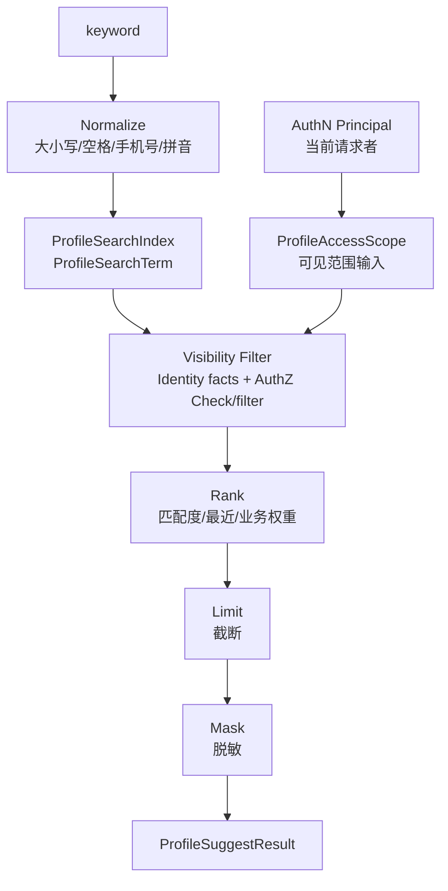

# Suggest 模块总览

> 状态：待补证据 · 第一版正文，待继续按 `internal/apiserver/domain/suggest`、`application/suggest`、Profile 索引构建、AuthZ 可见性过滤、REST/gRPC 契约和测试逐项核对。

---

## 1. 本文回答

本文回答 9 个问题：

- Suggest 模块在 IAM 中负责什么？
- Suggest 为什么是 Profile 联想搜索读模型，而不是 Identity 写模型？
- `ProfileSearchTerm`、`ProfileSearchIndex`、`ProfileAccessScope`、`ProfileSuggestResult` 分别表达什么？
- Suggest 如何从关键字归一化、索引命中、可见范围过滤、排序、脱敏结果返回候选 Profile？
- 为什么必须先做权限/范围过滤，再排序截断？
- Suggest 与 Identity、AuthZ、AuthN、IDP 的边界在哪里？
- Suggest 如何处理手机号、姓名、证件号等敏感字段的搜索和脱敏？
- Suggest 的一致性、索引刷新、缓存、失败边界如何治理？
- 阅读 Suggest 代码和后续文档应该从哪里进入？

本文是 Suggest 模块入口，只做总览。后续细节应拆到领域模型、索引构建、查询链路、可见性过滤、模块边界和代码索引文档中。

---

## 2. 30 秒结论

Suggest 是 IAM 的 **Profile 联想搜索读模型模块**。

它只回答一个核心问题：

```text
当前请求者在允许的可见范围内，
根据 keyword 能看到哪些可选择的 Profile 候选项？
```

Suggest 的核心主线可以压缩成：

```text
keyword
  -> normalize
  -> search terms / index
  -> visibility scope filter
  -> rank
  -> limit
  -> mask
  -> ProfileSuggestResult
```

Suggest 不负责：

```text
User / Profile / ProfileLink 写模型；
登录认证；
Token / Session / JWKS；
Role / Permission / RoleBinding / PolicyVersion；
通用授权策略管理；
外部 provider 身份解析；
返回明文手机号、证件号等敏感字段。
```

如果只记一句话：

> Suggest 负责“在允许范围内快速找到可展示的 Profile 候选项”，Identity 负责“Profile 是什么”，AuthZ 负责“谁能看什么”。

---

## 3. 模块定位

Suggest 是面向交互体验的读侧模块。

它服务的典型场景：

```text
输入手机号、姓名、拼音、证件号片段搜索儿童档案；
运营人员在组织范围内搜索 Profile；
家长在自己有关联的 Profile 中快速选择儿童；
业务系统根据关键字选择测评对象、就诊人、档案；
移动端输入关键字后返回有限数量候选项。
```

Suggest 的关注点不是“如何保存 Profile”，而是：

```text
如何把 Profile 的可搜索字段构造成读模型；
如何把 keyword 归一化为可匹配 token；
如何按请求者的可见范围过滤；
如何排序、截断和脱敏；
如何避免未授权 Profile 被搜索侧泄露。
```

---

## 4. Suggest 主线图



读图规则：

```text
AuthN 提供 Principal，但 Suggest 不负责登录认证；
ProfileAccessScope 表达本次搜索的可见范围输入，但不是 AuthZ Scope 本体；
索引命中只是候选集，不代表可见；
必须先做可见性过滤，再排序和截断；
结果必须脱敏，不能返回明文手机号或证件号；
最终返回的是 ProfileSuggestResult，不是 Profile 写模型。
```

---

## 5. 核心对象

### 5.1 ProfileSearchTerm

`ProfileSearchTerm` 是从 Profile 派生出的可搜索词条。

它可以包含：

```text
姓名；
姓名拼音 / 拼音首字母；
手机号后四位或脱敏可搜索 token；
证件号片段或 hash token，若允许；
档案编号；
业务编号；
别名或备注名，若存在。
```

关键边界：

```text
ProfileSearchTerm 是读模型词条；
ProfileSearchTerm 不是 Profile 本体；
ProfileSearchTerm 不应保存不必要的明文敏感字段；
ProfileSearchTerm 应可由 Identity 的 Profile 事实重建。
```

---

### 5.2 ProfileSearchIndex

`ProfileSearchIndex` 是用于快速搜索的索引或读模型。

它回答：

```text
某个 keyword 归一化后，可能命中哪些 Profile 候选项？
```

关键边界：

```text
索引命中不等于用户可见；
索引不是 Profile 主数据；
索引可以最终一致；
索引丢失时应能从 Identity 主数据重建；
索引中敏感字段必须最小化、脱敏或 hash 化。
```

---

### 5.3 ProfileAccessScope

`ProfileAccessScope` 是 Suggest 查询时的可见范围输入。

它可能表达：

```text
self；
linked_profiles；
organization；
tenant；
staff_assigned；
explicit_profile_ids；
```

具体枚举以当前代码和产品场景为准。

关键边界：

```text
ProfileAccessScope 不是 AuthZ Scope 本体；
ProfileAccessScope 可以映射为 AuthZ Check 的 scope/context；
ProfileAccessScope 不应替代 RoleBinding；
ProfileAccessScope 不应绕过 Identity.ProfileLink 或 AuthZ Check。
```

---

### 5.4 ProfileSuggestResult

`ProfileSuggestResult` 是 Suggest 对外返回的候选项。

它通常包含：

```text
profileID；
displayName；
maskedPhone；
maskedIDNo，若允许；
relationHint，若允许；
matchReason，内部可选；
rankScore，内部可选。
```

关键边界：

```text
ProfileSuggestResult 是展示结果；
不是 Profile 写模型；
不应返回明文手机号；
不应返回明文证件号；
不应泄露无权限 Profile 的存在性；
对外 matchReason 应克制，避免泄露敏感索引命中信息。
```

---

## 6. 关键链路

### 6.1 索引构建链路

索引构建链路负责从 Identity 的 Profile 主数据派生 Suggest 读模型。

主线：

```text
Profile changed
  -> extract searchable fields
  -> normalize terms
  -> build ProfileSearchTerm
  -> write ProfileSearchIndex
  -> mark version / updatedAt
```

重点边界：

```text
Identity 是 Profile 主数据源；
Suggest 只维护读模型；
Suggest 不创建或修改 Profile；
索引可以重建；
索引中不应保存不必要的明文敏感字段。
```

---

### 6.2 Suggest 查询链路

查询链路负责从 keyword 返回可见候选项。

主线：

```text
Suggest(keyword, principal, accessScope)
  -> validate keyword
  -> normalize keyword
  -> search index
  -> visibility filter
  -> rank
  -> limit
  -> mask
  -> return ProfileSuggestResult
```

重点边界：

```text
keyword 命中只产生候选集；
候选集必须经过可见性过滤；
先过滤再排序截断；
结果必须脱敏；
空 keyword 或过短 keyword 应限制或拒绝，避免枚举。
```

---

### 6.3 可见性过滤链路

可见性过滤是 Suggest 的安全核心。

主线：

```text
candidate profileIDs
  -> build visibility context
  -> Identity facts: ProfileLink / organization / assignment
  -> AuthZ Check or batch filter
  -> visible profileIDs
```

重点边界：

```text
可见性过滤不是可选优化；
不能先全局排序截断再过滤；
不能因为索引命中就返回候选；
不能只凭 token 存在返回 Profile；
过滤规则要和 AuthZ/Identity 边界一致。
```

---

### 6.4 脱敏返回链路

脱敏返回负责把内部候选项转换成安全展示结果。

主线：

```text
visible profile
  -> select display fields
  -> mask phone / id number / sensitive fields
  -> remove internal match details
  -> return result
```

重点边界：

```text
不返回明文手机号；
不返回明文证件号；
不返回完整内部搜索 token；
不向无权限用户泄露 Profile 是否存在；
不同调用方的展示字段可以不同，但必须有明确策略。
```

---

## 7. 为什么必须先过滤再排序截断

错误链路：

```text
keyword
  -> search global index
  -> rank globally
  -> limit 10
  -> visibility filter
  -> return maybe empty
```

问题：

```text
用户本来有可见结果，但被全局高分无权限结果挤掉；
返回结果不稳定；
可能通过结果数量推测无权限 Profile 的存在；
搜索体验和安全边界都会出问题。
```

正确链路：

```text
keyword
  -> search candidate set
  -> visibility filter
  -> rank visible candidates
  -> limit
  -> mask
```

一句话：

> 先过滤再排序截断，保证返回结果既安全，又不被无权限候选项挤占。

---

## 8. 与其他模块的边界

### 8.1 与 Identity

Identity 负责 User / Profile / ProfileLink 写模型。

Suggest 可以消费：

```text
ProfileID；
Profile display fields；
ProfileLink facts；
organization / tenant / assignment facts，若属于 Identity 或业务事实；
Profile changed event。
```

Suggest 不负责：

```text
创建 User；
创建 Profile；
创建 ProfileLink；
修改监护关系；
覆盖 Profile 主数据。
```

---

### 8.2 与 AuthZ

AuthZ 负责授权策略和权限检查。

Suggest 可以：

```text
调用 AuthZ Check 或 batch filter；
把 ProfileAccessScope 映射为 AuthZ Check context；
使用 AuthZ 返回的 allow/deny 结果过滤候选项。
```

Suggest 不负责：

```text
Role；
Permission；
RoleBinding；
PolicyVersion；
通用授权策略管理；
Casbin policy。
```

关键边界：

```text
ProfileAccessScope 不是 AuthZ Scope；
Suggest 不能直接写 RoleBinding；
Suggest 不能把搜索索引当权限事实源；
AuthZ allow 才能进入可见结果。
```

---

### 8.3 与 AuthN

AuthN 负责登录认证和 Principal。

Suggest 可以使用：

```text
Principal.UserID；
Principal.StaffID，若存在；
Principal.ServiceID，若存在；
认证上下文。
```

Suggest 不负责：

```text
Credential / Challenge 校验；
Session；
AccessToken / RefreshToken；
JWKS；
登录态创建和刷新。
```

---

### 8.4 与 IDP

IDP 负责外部身份源。

Suggest 不负责：

```text
WechatApp；
Credentials；
AppToken；
ExternalIdentity；
provider callback；
微信/企微 API adapter。
```

可能协作：

```text
provider nickname/avatar 等 claims 经 Identity 确认后，可能成为 Profile 展示或搜索字段；
但不能由 IDP 直接写 Suggest index。
```

---

## 9. 分层架构入口

Suggest 模块应遵循 IAM 通用分层：

```text
transport/rest + transport/grpc
  -> application/suggest
  -> domain/suggest
  -> infra/search-index + cache + repository
  -> container/suggest
  -> api/rest + api/grpc + pkg/sdk
```

各层职责：

| 层 | 职责 |
| --- | --- |
| domain | 定义 ProfileSearchTerm / ProfileAccessScope / ProfileSuggestResult / ranking policy 等模型和不变量 |
| application | 编排 keyword normalize、index search、visibility filter、rank、limit、mask 等用例 |
| infra | 实现搜索索引、缓存、repository、批量查询、脱敏辅助等技术细节 |
| transport | 适配 REST/gRPC 请求、DTO、错误映射和认证上下文 |
| container | 装配 Suggest repository、index、AuthZ/Identity port、service、handler |
| contract | 约束 REST/gRPC/SDK 对外接入语义 |

---

## 10. 推荐阅读路径

### 10.1 新读者

```text
00-模块总览.md
  -> 01-领域模型-ProfileSearchTerm-ProfileAccessScope-ProfileSuggestResult.md
  -> 05-模块边界-Suggest与Identity-AuthZ.md
```

目标：先理解 Suggest 是什么，以及它不是什么。

---

### 10.2 准备实现搜索查询

```text
03-关键链路-Profile联想查询.md
  -> 01-领域模型-ProfileSearchTerm-ProfileAccessScope-ProfileSuggestResult.md
  -> 04-关键链路-可见性过滤与脱敏.md
  -> 06-分层架构与代码索引.md
```

目标：理解 keyword 如何变成候选项，以及候选项如何过滤、排序、脱敏。

---

### 10.3 准备实现索引构建

```text
02-关键链路-Profile搜索索引构建.md
  -> ../01-Identity/README.md
  -> 06-分层架构与代码索引.md
```

目标：理解 Suggest 如何从 Identity 主数据派生读模型。

---

### 10.4 准备排查越权或结果缺失

```text
04-关键链路-可见性过滤与脱敏.md
  -> ../03-AuthZ/02-关键链路-权限检查Check.md
  -> ../01-Identity/README.md
```

目标：确认是索引缺失、可见性过滤、排序截断、脱敏策略还是 AuthZ/Identity 事实导致的问题。

---

## 11. 常见反模式

| 反模式 | 问题 | 推荐做法 |
| --- | --- | --- |
| Suggest 直接创建 Profile | 读模型吞并 Identity 写模型 | Profile 创建归 Identity |
| 搜索命中就返回 | 越权泄露 Profile 存在性 | 命中后必须可见性过滤 |
| 先全局 limit 再过滤 | 可见结果被无权限结果挤掉 | 先过滤再排序截断 |
| 返回明文手机号 | 敏感信息泄露 | 返回 maskedPhone |
| ProfileAccessScope 当 AuthZ Scope | 搜索输入和授权模型混淆 | 明确映射到 AuthZ Check context |
| Suggest 直接写 RoleBinding | Suggest 吞并 AuthZ | 授权归 AuthZ |
| IDP claims 直接写搜索索引 | 外部声明污染读模型 | 先经 Identity 确认 |
| keyword 过短仍全量搜索 | 枚举风险和性能风险 | 限制最小长度/频率 |
| 索引当主数据 | 数据漂移无法修复 | 索引应可从 Identity 重建 |
| 对外暴露 matchReason 过细 | 泄露敏感索引字段 | 对外 reason 克制，内部日志留 trace |

---

## 12. 事实源

本文是 Suggest 总览，不是机器契约。

当本文与代码、契约、测试冲突时，按以下优先级判断：

1. 源码与运行时行为。
2. 机器可读契约与配置：OpenAPI、proto、配置、迁移。
3. 测试：领域测试、应用测试、契约测试、架构测试、SDK compile test。
4. 现行维护中的 `docs/`。
5. `_archive/` 历史材料。

当前主要事实源：

| 事实 | 路径 |
| --- | --- |
| Suggest domain | `../../../internal/apiserver/domain/suggest` |
| ProfileSearchTerm / ProfileAccessScope / ProfileSuggestResult | `../../../internal/apiserver/domain/suggest` |
| Suggest application | `../../../internal/apiserver/application/suggest` |
| Suggest index / repository | `../../../internal/apiserver/infra` |
| Suggest REST transport | `../../../internal/apiserver/transport/rest` |
| Suggest gRPC transport | `../../../internal/apiserver/transport/grpc` |
| Suggest container | `../../../internal/apiserver/container/suggest` |
| Identity domain | `../../../internal/apiserver/domain/identity` |
| AuthZ domain/application | `../../../internal/apiserver/domain/authz`、`../../../internal/apiserver/application/authz` |
| REST 契约 | `../../../api/rest` |
| gRPC 契约 | `../../../api/grpc` |
| 架构测试 | `../../../internal/pkg/architecture` |

注意：上表中的具体路径需要继续与当前源码核对。如果源码目录已调整，应以代码为准并同步更新本文。

---

## 13. Verify

修改本文后至少执行：

```bash
make docs-hygiene
```

涉及 Suggest 领域模型：

```bash
go test ./internal/apiserver/domain/suggest/...
```

涉及 Suggest 应用用例：

```bash
go test ./internal/apiserver/application/suggest/...
```

涉及索引、缓存、repository、脱敏辅助：

```bash
go test ./internal/apiserver/infra/...
```

具体路径以当前代码为准。

涉及 Identity/AuthZ/AuthN/IDP 边界：

```bash
go test ./internal/apiserver/domain/identity/...
go test ./internal/apiserver/domain/authz/...
go test ./internal/apiserver/domain/authn/...
go test ./internal/apiserver/domain/idp/...
```

涉及 REST/gRPC 契约或 transport：

```bash
make api-validate
make proto-gen
go test ./internal/apiserver/transport/rest/...
go test ./internal/apiserver/transport/grpc/...
```

涉及 SDK：

```bash
go test ./pkg/sdk/...
```

涉及分层依赖或模块边界：

```bash
go test ./internal/pkg/architecture
```

---

## 14. 本文总结

Suggest 模块的主线是：

```text
keyword
  -> normalize
  -> search terms / index
  -> visibility scope filter
  -> rank
  -> limit
  -> mask
  -> ProfileSuggestResult
```

Suggest 的核心职责是：

```text
维护 Profile 搜索读模型；
把 keyword 归一化并命中候选 Profile；
根据 Identity/AuthZ 事实过滤可见范围；
对可见候选排序、截断和脱敏；
返回安全的 ProfileSuggestResult。
```

Suggest 的核心边界是：

```text
不创建 User/Profile/ProfileLink；
不做登录认证；
不签发 Token；
不管理 Role/Permission/RoleBinding；
不解析外部 provider 身份；
不返回明文手机号或证件号；
不把搜索索引当主数据；
不绕过 AuthZ/Identity 可见性过滤。
```

读完本文后，应继续编写 Suggest 的领域模型文档，把 `ProfileSearchTerm / ProfileAccessScope / ProfileSuggestResult` 的模型和生命周期讲清楚。
