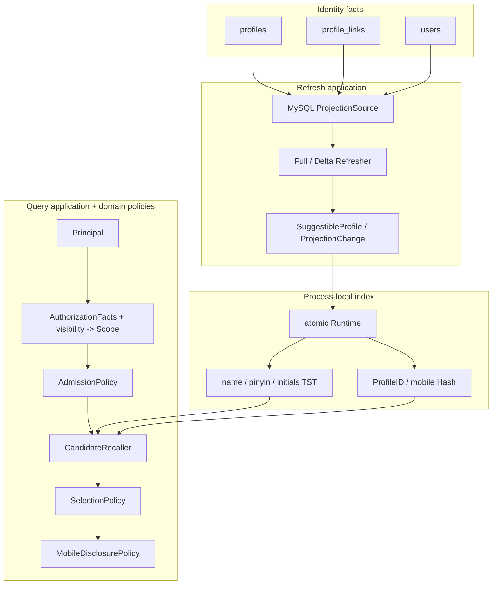

# Suggest 模块总览

> 状态：已实现 · 本文给出 Suggest 的问题空间、模型边界、两条主链路、运行语义与当前限制。

## 1. 一句话定位

Suggest 是 Identity 之上的可见 Profile 联想读模型：它用可重建索引换取低延迟召回，用领域策略保证关键词准入、数据可见性、稳定排序和敏感字段披露。

## 2. 为什么需要独立模块

后台输入姓名、拼音、拼音首字母、ProfileID 或获准的手机号时，需要在每次键入中快速返回少量候选。把这项能力直接塞进 Identity Repository 会带来几个问题：

- 姓名/拼音前缀匹配难以稳定使用普通关系索引；
- 高频键入把读放大直接压到 MySQL；
- UI 的候选排序、limit、手机号形态等规则污染主数据模型；
- 搜索候选的权限与 Profile 详情权限容易混为一谈；
- 手机号精确搜索需要独立 capability、限流和披露策略。

因此当前采用 CQRS 风格的派生读模型：Identity 保持权威事实，Suggest 定期拉取并构建进程内索引。

## 3. 负责与不负责

### 3.1 Suggest 负责

- 定义什么是合法的 `SuggestibleProfile`；
- 把 Principal、AuthZ facts 和 visibility facts 解析成 `Scope`；
- 决定关键词是否允许查询、应使用哪种召回意图；
- 对候选执行 scope filter、去重、排序和最终 limit；
- 控制手机号的输出披露；
- 编排 Full/Delta、游标、互斥和索引成功状态；
- 通过 REST 暴露 Profile 联想结果。

### 3.2 Suggest 不负责

- 创建或修改 User/Profile/ProfileLink；
- 登录、Session、Token 或 JWT 签发；
- 保存角色、PermissionGrant 或 Casbin policy；
- 替代 Profile 详情接口的授权；
- 把内存索引当作可恢复的事实存储；
- 提供通用全文搜索或模糊手机号枚举。

## 4. 总体架构



这不是“domain 外面包一层 TST”。领域层负责稳定业务语义，TST/Hash 只是当前 `CandidateRecaller` 和 `IndexWriter` 的进程内 adapter。

## 5. 领域模型为什么这样拆

当前 domain 有三个内聚子包：

| 子包 | 核心问题 | 主要对象 |
| --- | --- | --- |
| `profile` | 什么候选可以进入读模型，手机号怎样披露 | `SuggestibleProfile`、`MobileDisclosurePolicy` |
| `visibility` | 当前操作者能看哪些 Profile，能否搜手机号 | `Principal`、`AuthorizationFacts`、`Scope`、`ResolutionPolicy` |
| `search` | 关键词怎样准入，候选怎样选择 | `Keyword`、`Decision`、`Candidate`、`SelectionPolicy` |

application 再按用例拆成：

- `queryprofile`：一次在线联想查询；
- `refreshindex`：派生索引的 Full/Delta 生命周期。

这比按“Manager/Service/Repository”机械分层更适合当前问题。Suggest 没有需要跨多个写操作维持强一致性的聚合，因此不需要伪造聚合根或空 Repository；它的模型强度体现在不变量与策略可直接阅读、
单测和替换。

## 6. 查询主链路

```text
GET /api/v2/suggest/profile
  -> JWT authentication
  -> current-domain profiles/search permission
  -> query binding + Principal
  -> per-operator rate limit
  -> AuthZ facts + visibility IDs
  -> ResolutionPolicy => Scope
  -> AdmissionPolicy => NumericExact | TextPrefix | Denied
  -> TST/Hash recall up to CandidateBudget
  -> Scope filter
  -> ProfileID deduplicate
  -> Weight/strength/direct-prefix/ID ranking
  -> final Limit
  -> mobile disclosure
  -> {code,message,data[]}
```

### 6.1 两级授权

外层路由要求 `iam:identity:collection:profiles/search`。进入用例后：

- 平台域 `profiles/list` 决定是否 `allProfiles`；
- 平台或当前 tenant domain 的 `profiles/search_by_mobile` 决定手机号形态查询是否可进入索引；
- operator owner、业务 org 和 visibility ProfileIDs 决定非全量用户能看哪些候选。

手机号无 capability 时返回空数组，不暴露“无权”与“无匹配”的差异。

### 6.2 两类召回

| 关键词 | Intent | 当前索引 | 语义 |
| --- | --- | --- | --- |
| 非纯数字 | `TextPrefix` | TST | 原名、全拼、拼音首字母的前缀/通配展开 |
| 纯数字 | `NumericExact` | Hash | ProfileID 或完整手机号精确匹配 |

手机号不做前缀匹配。TST 与 Hash 只返回带 `MatchStrength` 的候选，不负责 scope 或最终业务排序。

### 6.3 选择顺序

`SelectionPolicy` 固定：

```text
scope filter -> ProfileID deduplicate -> rank -> final limit
```

排序键依次为 Weight 降序、MatchStrength 降序、DisplayName 直接前缀优先、ProfileID 升序。

## 7. 刷新主链路

### 7.1 Full

```text
TryLock
  -> capture windowStart
  -> Loader.Full
  -> validate every SuggestibleProfile
  -> build a new Store
  -> atomic pointer swap
  -> advance lastFetch and success timestamp
```

构建期间查询继续读旧 Store，不会读到半构建索引。失败时不切换、不推进游标。

### 7.2 Delta

```text
TryLock
  -> since = lastFetch
  -> capture next windowStart
  -> detect affected Profile/ProfileLink/User
  -> recompute complete projection
  -> Upsert if eligible / Delete if no longer eligible
  -> remove stale keys + apply changes under Store write lock
  -> advance cursor only after success
```

Delta 的 Delete 是显式 `ProjectionChange`。MySQL 空 name 行只是一种 tombstone wire convention，不能进入 domain 成为“空名称 Profile”。

### 7.3 默认 eligibility

候选必须同时满足：Profile 未软删除、至少一条 ProfileLink 活跃且未 revoked、关联 User 未软删除。手机号、关系或软删除变化都必须进入 Delta affected set。

## 8. 一致性模型

Suggest 提供的是最终一致的进程内读模型：

- MySQL 是唯一事实源；
- Full 安装快照，Delta 修补快照；
- 游标使用查询开始时间，减少刷新窗口内变化被跨过的风险；
- 重复 Upsert/Delete 可安全重放；
- 后续刷新失败保留旧索引；
- Full/Delta 重叠直接跳过后到任务；
- 每个实例独立刷新，不保证同时切换同一 generation。

它不是事件驱动强一致投影，也没有 CDC offset、数据库 watermark、版本向量或跨实例 barrier。

## 9. 安全模型

### 9.1 手机号搜索

通常的 7–15 位纯数字被视为手机号形态；没有 `search_by_mobile` capability 时不会访问 Hash。

### 9.2 手机号返回

响应默认只返回第一个手机号的掩码。production 禁止 `disable_mobile_mask=true`。

### 9.3 限流

REST 支持按 operator 的普通/手机号独立配额：

- memory：单实例 token bucket；
- Redis：多实例共享、约一秒 fixed window，后端错误 fail-open。

限流不能替代路由授权和领域准入。

### 9.4 敏感数据驻留

原始手机号仍会存在于 Loader 行、`SuggestibleProfile.Mobiles` 和 Hash key 中。当前没有 snapshot 落盘，Suggest 专用手机号日志也不记录原始关键词，但 heap dump、
调试接口和通用 access log 仍应按敏感数据标准治理。

## 10. 启动、健康与降级

模块启用时要求 MySQL，并在启动阶段同步执行 Full：

| 场景 | 行为 |
| --- | --- |
| `required=true` 且初始 Full/调度失败 | 初始化失败 |
| `required=false` 且初始 Full/调度失败 | `DegradedQuerier` 返回空数组 |
| 初始成功、后续刷新失败 | 保留旧索引，下一次 Cron 再尝试 |
| 进程重启 | 重新 Full，没有 snapshot 恢复 |

当前 optional 启动降级不会启动后台重试，需通过重启恢复。健康检查只确认 querier 非 nil 且至少成功刷新过一次，没有覆盖索引 age、Cron 活性、
generation 一致性和 querier 是否已被替换为 degraded 的全部组合。

## 11. 为什么当前不用 Elasticsearch

当前数据源和查询语义较窄，进程内 TST/Hash 有这些优点：

- 无新增集群和索引写入链；
- Full 可直接重建；
- 低网络开销；
- domain/application 端口已隔离算法。

Elasticsearch 更适合以下需求被证据确认之后：

- 数据规模或短前缀展开超过单进程内存/CPU；
- 多实例必须共享同一索引 generation；
- 需要复杂分词、容错、模糊检索或可解释相关性；
- 新实例不能等待 MySQL Full；
- 需要独立索引运维与容量伸缩。

迁移时应替换 infra adapter，不应把 ES DSL、index alias 或 refresh interval 放进 domain。

## 12. 原 P1/P2 修复复验

本轮复验确认：

- Full/Delta 的 MySQL 投影映射错误已 fail-closed；
- 非空 Delta 的 Apply、计数、游标推进已有契约测试；
- source/Apply/Replace 失败均不推进游标，Replace 失败也不建立成功健康状态；
- `RawProjection` 已删除，合法状态通过 `SuggestibleProfile` 构造；
- REST 成功响应已使用专用 envelope schema，顶层响应与 envelope 已纳入 Swagger/OpenAPI 对照门禁；当前脚本尚未递归校验 `ProfileSuggestResponseItem`，仍需补齐；
- ratelimit 等 infra 配置不再依赖全局 options，映射集中到 container；
- MySQL visibility reader 已补 active/soft-deleted/operator 隔离测试；
- 架构护栏固定 application/domain/infra/transport 的依赖方向。

## 13. 当前风险与后续决策点

| 风险 | 当前影响 | 何时需要升级 |
| --- | --- | --- |
| placeholder OrgID | 可能不能表达真实多组织可见性 | 多组织数据正式接入前 |
| `created_by` visibility | 只能表达 owner 过渡规则 | 出现共享、部门树或委托授权时 |
| CandidateBudget 先于 scope | 可见结果可能不足 | 指标显示 matched 高、visible/returned 低时 |
| 实例独立 generation | 同一请求落不同实例可能结果不同 | 业务要求强读一致或灰度稳定时 |
| 无 snapshot | 新实例启动依赖 MySQL Full | Full 耗时或数据库可用性不可接受时 |
| 时间游标 + 严格 `>` | 依赖时钟和时间戳精度 | 观察到边界漏更或引入 CDC 时 |
| optional 降级无自愈 | 故障恢复依赖重启 | Suggest 成为核心路径时 |
| health 表达不完整 | 可能不能发现调度/降级组合异常 | 建立 freshness SLO 前 |
| response item 契约未递归比较 | 字段漂移可能绕过 API gate | 下次契约护栏修复时 |

## 14. 延伸阅读

1. [领域模型与应用端口](01-模型与应用端口.md)
2. [索引刷新 Full/Delta](02-关键链路-索引刷新Full-Delta.md)
3. [SuggestProfile 查询](03-关键链路-SuggestProfile查询.md)
4. [模块边界与代码索引](04-模块边界与代码索引.md)
5. [为什么采用派生读模型](../../06-专题设计/05-Suggest为什么是读模型.md)
