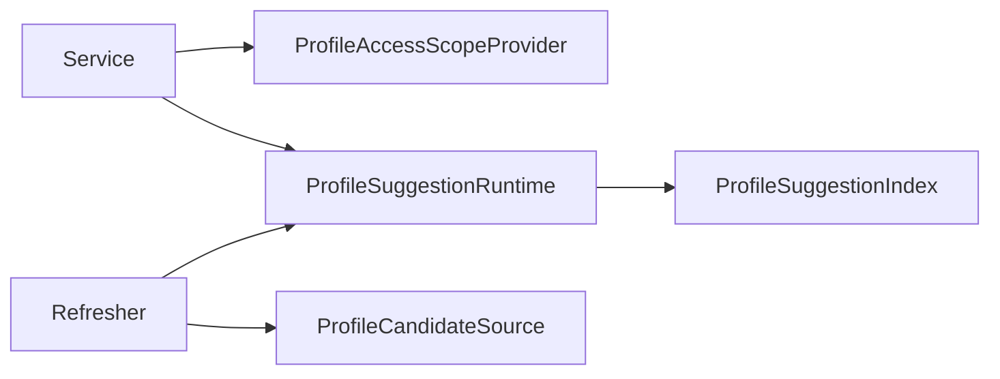

# Suggest 模型与应用端口

> 状态：已实现 · 已与 `domain/suggest`、`application/suggest`、search runtime 和测试核对。

## 1. 30 秒结论

Suggest 的模型分成两层：

- domain 表达查询所需的最小业务语义：操作者、可见范围、搜索项、关键词、查询限制和排序规则。
- application 表达用例边界：索引/runtime 端口、候选数据源、scope provider、限流器和返回项。

`ProfileSuggestionIndex`、`ProfileSuggestionRuntime` 和 `ProfileSuggestItem` 都是 application 符号，不是 domain entity。

## 2. 对象速查

| 对象 | 所在层 | 当前作用 |
| --- | --- | --- |
| `OperatingPrincipal` | domain | Suggest 所需的最小操作员身份视图 |
| `ProfileAccessScope` | domain | 本次查询允许看到的 Profile 范围和手机号搜索开关 |
| `ProfileSearchTerm` | domain | 进入索引的 Profile 读模型项 |
| `Keyword` / `Query` | domain | 规范化关键词、返回限制和 Trie 展开限制 |
| `MatchKind` / `RankingPolicy` | domain | 表达召回类型和最终排序规则 |
| `ProfileSuggestionIndex` | application port | 对 scope 内候选执行 Suggest 查询 |
| `ProfileSuggestionRuntime` | application port | 持有当前索引并支持 Full replace / Delta import |
| `ProfileCandidateSource` | application port | 从数据源执行 Full / Delta 拉取 |
| `ProfileAccessScopeProvider` | application port | 把 Principal 解析成查询 scope |
| `ProfileSuggestItem` | application DTO | 返回给 transport 的脱敏候选项 |

## 3. Domain 模型

### 3.1 OperatingPrincipal

当前关键字段：

| 字段 | 语义 |
| --- | --- |
| `OperatorID` | 当前操作员 ID；非超级管理员必须大于 0 |
| `TenantDomain` | IAM/Casbin 授权域，例如 `fangcun` 或 `platform` |
| `OrgID` / `OrgIDs` | 业务组织范围，不是 IAM tenant |
| `IsSuperAdmin` | 直接解析为全量可见和允许手机号搜索 |

`TenantID` 是历史兼容字段，不应继续用于新的 Suggest 数据权限逻辑。

### 3.2 ProfileAccessScope

```go
type ProfileAccessScope struct {
    AllProfile        bool
    TenantIDs         []int64 // Deprecated: 历史兼容字段
    OrgIDs            []int64
    OperatorID        int64
    ProfileIDs        []int64
    AllowMobileSearch bool
}
```

`TenantIDs` 仍为兼容字段。`ScopePolicy` 的允许条件是以下任一成立：

- `AllProfile=true`；
- ProfileID 在 `ProfileIDs`；
- OrgID 在 `OrgIDs`；
- Profile 的 owner 列表包含 `OperatorID`；
- 兼容的 TenantID 命中。

空 scope 默认拒绝所有候选。一次查询会先编译切片为集合，避免逐候选线性扫描大列表。

### 3.3 ProfileSearchTerm

当前字段包括：

```text
ProfileID
DisplayName
Mobiles
Weight
OrgID
OwnerOperatorIDs
TenantID（兼容）
```

构造函数会 trim 展示名和手机号、移除空手机号，并对 owner ID 去重。它是索引读模型，不是完整 Profile，也不能回写 Identity。

注意：`Mobiles` 保存的是原始手机号，用于精确匹配；敏感字段保护发生在运行环境和输出映射，而不是这个模型内部。

### 3.4 Keyword 与 Query

`Keyword` 只做 trim 和纯数字判断。`LooksLikeMobile` 再把 7 到 15 位纯数字识别为手机号形态。

`NewQuery` 提供默认值：

| 参数 | 默认行为 |
| --- | --- |
| `Limit` | 20 |
| `InternalLimit` | `Limit * 10`，且不小于 Limit |
| `KeyPadLen` | 25 |
| `WildcardKeyCap` | 100 |

### 3.5 排序

`RankingPolicy` 按以下顺序排序并截断：

1. `Weight` 高者优先；
2. 匹配类型按 exact、prefix、wildcard 排序；
3. 同权重时展示名直接前缀命中优先；
4. 最后按 ProfileID 升序稳定收口。

同一 ProfileID 的重复候选只保留更优项。

## 4. Application 端口



关键边界：

- application 只依赖端口，不依赖 MySQL、Trie、Redis 或 Gin。
- `ProfileSuggestionIndex.SuggestProfile` 接收已经构造好的 Query 和 Scope。
- `ProfileSuggestionRuntime.Replace` 用于 Full；`ImportDelta` 用于 Delta。
- 刷新结果只更新进程内 Runtime，不通过 application 端口写盘。
- `ProfileSuggestItem` 只有 ProfileID、DisplayName、MobileMask、Weight。

## 5. 当前不变量

| 不变量 | 当前实现 |
| --- | --- |
| 无有效 Principal 不执行查询 | application 返回 `ErrUnauthenticated` |
| 空关键词不扫描索引 | 返回空列表 |
| 无 runtime、scope provider 或当前 index | 返回空列表 |
| 空 scope 不泄露候选 | `ScopePolicy` 默认 deny |
| 手机号形态且无权限 | `mobileDeniedStrategy` 返回空列表 |
| 过滤必须早于最终 limit | `Store.SuggestProfile` 先 filter，再 rank/limit |
| 默认输出不含原始手机号 | application 转成 `MobileMask` |
| 生产环境不能关闭手机号脱敏 | container 初始化时拒绝 |

## 6. 事实源

| 内容 | 路径 |
| --- | --- |
| Domain 模型 | `internal/apiserver/domain/suggest` |
| Application DTO 和端口 | `internal/apiserver/application/suggest/dto.go`、`internal/apiserver/application/suggest/ports.go` |
| 查询服务和策略 | `internal/apiserver/application/suggest/service.go`、`internal/apiserver/application/suggest/search_strategy.go` |
| Store 与 runtime | `internal/apiserver/infra/suggest/search` |

## 7. Verify

```bash
go test ./internal/apiserver/domain/suggest/...
go test ./internal/apiserver/application/suggest/...
go test ./internal/apiserver/infra/suggest/search/...
make docs-hygiene
```
