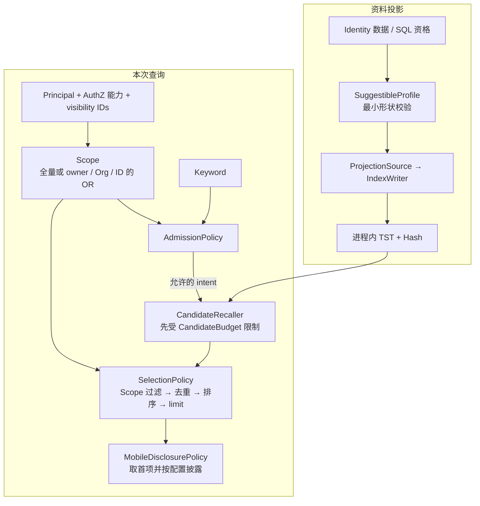

# Suggest 模型与应用端口

> 状态：已实现 · 按当前 domain、application、默认 MySQL 投影及内存 adapter 核对。文中的演进方案均为候选；源码情境推演不表示目标环境已复现。

## 1. 设计结论：查询对象的合法形状、来源资格与本次可见性分开负责

Suggest 用 Identity 事实生成可重建的搜索资料，再为每次查询组合可见范围、判断关键词准入、选择和披露候选。它不拥有 User、Profile 或 ProfileLink 的写入生命周期。一个合法 `SuggestibleProfile` 只表示数据满足最小构造约束，不能证明来源关系有效、操作者获准查看或资料仍然新鲜。

当前模型按三个子包组织：`profile` 保存派生资料与手机号披露规则；`visibility` 组合查询范围；`search` 表达关键词意图、准入、候选与选择。Full/Delta 是应用层的物理投影协议；SQL、TST/Hash、缓存、调度和指标是 adapter。这里的“领域”指规则归属，不表示 Suggest 已形成独立事务聚合、部署单元或完整的数据授权系统。

| 要回答的问题 | 当前责任 | 不能据此推导 |
| --- | --- | --- |
| 哪些源资料进入默认索引 | Loader 的 Profile/Link/User 条件 | User 已通过 AuthN active 准入 |
| 一个资料对象能否构造 | `profile.New` | 号码真实、owner 有效、组织归属权威 |
| 本次操作者可以看谁 | `ResolutionPolicy` + `Scope.Allows` | 当前 ProfileLink 关系或成员资格已认证 |
| 关键词能否访问索引 | `AdmissionPolicy` | 输出手机号由同一能力位控制 |
| 如何选出结果 | 预算内召回 + `SelectionPolicy` | 完整可见集合的全局 top-N |
| 如何修改索引 | `ProjectionSource` / `IndexWriter` | 已提交业务事件、同版本授权或跨实例一致 |

实际链路与输入边界如下。图表示非空关键词的正常查询；早退与错误见第 7 节。


```mermaid
flowchart TB
    subgraph Build["资料投影"]
        Source["Identity 数据 / SQL 资格"] --> Model["SuggestibleProfile<br/>最小形状校验"]
        Model --> Writer["ProjectionSource → IndexWriter"]
        Writer --> Index["进程内 TST + Hash"]
    end
    subgraph Query["本次查询"]
        Principal["Principal + AuthZ 能力 + visibility IDs"] --> Scope["Scope<br/>全量或 owner / Org / ID 的 OR"]
        Keyword["Keyword"] --> Admission["AdmissionPolicy"]
        Scope --> Admission
        Admission -->|"允许的 intent"| Recall["CandidateRecaller<br/>先受 CandidateBudget 限制"]
        Index --> Recall
        Recall --> Select["SelectionPolicy<br/>Scope 过滤 → 去重 → 排序 → limit"]
        Scope --> Select
        Select --> Disclosure["MobileDisclosurePolicy<br/>取首项并按配置披露"]
    end
```

## 2. `SuggestibleProfile`：字段来源比字段名称更重要

### 2.1 默认投影不是 Identity Profile 的复制品

| 字段 | 默认 Loader 来源 | 查询用途及边界 |
| --- | --- | --- |
| `ID` | `profiles.id` | 去重、末位排序和数字 Hash key；仍是 ProfileID |
| `DisplayName` | `profiles.name` | 展示、姓名/拼音/缩写索引、名称直接前缀加分 |
| `Mobiles` | 符合 JOIN 条件的 `users.phone` 聚合 | Hash key 与输出首项；不是 Profile 自有或已核验的“主手机号” |
| `Weight` | 常量 `1` | 第一排序键；默认资料之间没有真实业务权重差异 |
| `OrgID` | `loader_placeholder_org_id` | Scope 组织分支；不是从 Profile 读取的真实组织 |
| `OwnerOperatorIDs` | `profiles.created_by` | Scope owner 分支；采用创建人作为过渡语义，不等同监护关系 |

默认资格要求 Profile 未软删除，至少有一条未删除、未撤销的 ProfileLink，且对应 User 未软删除；没有检查 `User.Status=active`。Link 决定资料与手机号是否进入投影，创建人决定默认 owner 和显式可见 ID，这两套条件不能互相替代。

例如，Profile 由 User 42 创建，关联 User 7 的手机号。默认 owner 是 42，手机号来自 7；仅凭这条 Link 不会把 7 加入 owner。若撤销该 Link、另有合格 Link 使 Profile 继续留在索引，创建人 42 的可见性不会随这一关系撤销而消失。这是条件源码推演，是否符合业务授权预期仍需另定合同。

来源：[Loader](../../../internal/apiserver/infra/mysql/suggest/loader.go)、[创建人 visibility reader](../../../internal/apiserver/infra/mysql/suggest/visibility_reader.go)。Full/Delta 资格与变化传播详见[刷新链路](02-关键链路-索引刷新Full-Delta.md)。

### 2.2 构造器保证到哪里

`profile.New` 要求 ID 正数，名称 trim 后非空；手机号逐项 trim、去空，保留重复项且不验证格式；owner ID 去重、去零，保留负数。Weight、OrgID 没有范围或存在性校验。手机号和 owner 的输入/输出 slice 均复制，调用方没有公开 setter。

这些约束足以让正常构造的对象供查询使用，却不是完整的数据资格校验。Go 零值仍能产生 ID=0 的对象；`MustNew` 对构造错误 panic，适合已知合法的测试资料，不能作为坏行恢复策略。源 adapter 和应用端口必须另行约定可信来源、字段含义和错误处理。

Suggest 不提供 `Save`、`UpdateName` 或主数据领域事件：资料变化应由 Identity 写入，再重新投影。给此对象加主数据写接口会同时引入两个事实 owner，以及失败时如何补偿双写的问题。

### 2.3 同一份源资料在 Full 与 Delta 中可能有不同含义

标准 Loader 的 Full 逐行调用构造器，坏 ID 或 trim 后空名称使整批返回映射错误。Delta 要求正 ID，但将 trim 后空名称解释为显式 Delete；其余行才构造资料并生成 Upsert。不能概括为“Full/Delta 的任意坏行都报错”。

Identity 的 Profile 名称校验只拒绝空字符串，没有 trim。因此名称 `"   "`、且仍有合格 Link/User 的 Profile，可以由 Identity 保存，却让 Suggest Full 失败；同样的 Delta 行会被解释成删除。这揭示两个模型的交接差异，并不表示 Identity 已将该 Profile 删除。

若要收敛，需要分别选择：新 writer 名称归一化和旧数据迁移；Delta 增加独立动作字段以免空名称承担两种含义；坏行继续全批失败还是隔离并报告不完整。隔离能提高可用性，但会留下旧资料或丢失候选，不能在没有完整性合同的情况下直接跳过。

来源：[Suggest 构造器](../../../internal/apiserver/domain/suggest/profile/profile.go)、[Identity 名称校验](../../../internal/apiserver/domain/identity/profile/profile.go)、[Loader 映射](../../../internal/apiserver/infra/mysql/suggest/loader.go)。

## 3. 手机号是三个不同合同：存储表示、查询意图与输出披露

### 3.1 当前号码表示没有跨模块闭环

Identity 的 `meta.Phone` 当前解析并保存 E.164，例如 `+8613800138000`。默认 Loader 读取原值，Hash 也按该字符串建 key；Suggest 不转换国家码。查询则先 trim：纯数字走 NumericExact，含 `+` 的输入走 TextPrefix，TST 只索引名称、拼音和缩写。

以名称“张三”、仅有上述号码的资料为例：

| 输入 | 当前意图 | 对该资料手机号 key 的结果 |
| --- | --- | --- |
| `13800138000` | 获准后 NumericExact | 与 `+8613800138000` 不同，不能命中该 key |
| `+8613800138000` | TextPrefix | 不查手机号 Hash；该资料的名称 key 不匹配此输入 |

这是当前 writer、Loader 与索引代码的条件推论，未作为真实 MySQL 或线上验收。SQLite fixture 直接写裸 11 位号码并验证查询，不能证明当前 Identity writer 的产物可经完整链路检索。

候选设计需同时定义存储 key、输入归一化与手机号准入；只改任一端仍会错配。保留国家码主 key、增加地区明确的别名，或引入显式 mobile intent，各有兼容、碰撞与权限测试成本。来源：[Phone 编解码](../../../internal/pkg/meta/phone.go)、[Hash](../../../internal/apiserver/infra/suggest/index/memory/hash.go)、[Keyword](../../../internal/apiserver/domain/suggest/search/keyword.go)。

### 3.2 形态识别不是号码验证，也不是 ID 类型识别

`LooksLikeMobile` 用 trim 后 **7–15 字节**长度和 `unicode.IsDigit` 判断；对通常 ASCII 输入表现为 7–15 位数字。它不是严格 ASCII/E.164 校验，也不是按 Unicode 字符数计长。通过形态识别、却无手机号能力的关键词，在访问索引前返回空结果。

因此 ProfileID `1234567` 也先受手机号准入限制；系统不会先确认它是否 ID。其他纯数字仍查同一个 Hash，ID 与 mobile 没有命名空间区分。由于对象不验证 mobile，ID=42 与另一资料的 `Mobiles=["42"]` 可落入同一 key。未来分离 intent/key 可以减少歧义，但会改变旧 numeric 查询行为。

### 3.3 披露只取第一项，没有“主手机号”保证

| 输入/策略 | 输出 |
| --- | --- |
| 无手机号 | 空字符串 |
| 默认掩码，首项至少 7 字节 | 首 3 字节 + `****` + 末 4 字节 |
| 默认掩码，首项不足 7 字节 | 空字符串，不尝试第二项 |
| `DisableMask=true` | 原样返回首项，包括短字符串 |

掩码不验证号码格式，也不按 Unicode 字符截取。默认 SQL 的 `GROUP_CONCAT` 未明确号码排序，因此首项不是稳定的主手机号。名称命中可见资料时也会输出掩码：披露策略不读取 Scope 的手机号搜索能力。

标准启用模块在 production 初始化时禁止关闭掩码；领域策略和直接构造的应用服务不检查环境。这一配置约束不能推广到任意 caller。来源：[披露策略](../../../internal/apiserver/domain/suggest/profile/disclosure_policy.go)、[掩码实现](../../../internal/apiserver/domain/suggest/profile/mobile.go)、[标准装配](../../../internal/apiserver/container/suggest/module.go)。

## 4. `visibility`：一次查询的范围，不是持久授权或成员证明

### 4.1 各输入保留什么事实

`Principal` 携带 OperatorID、OrgID/OrgIDs；`AuthorizationFacts` 携带全量可见、全量手机号、局部手机号三个能力结果；`Resource` 是候选的 ProfileID、OrgID、owner；`Scope` 保存组合后的集合与手机号能力。它们都不携带完整 JWT、当前成员证明、授权版本或索引水位。

标准 REST 将认证上下文的 IAM UserID 和业务 OrgID 复制给 Principal，不填 OrgIDs，也不复查当前组织成员资格。应用只要求 OperatorID>0；直接传一个正数不等同完成认证。身份来源与 JWT 组织声明的时效见[AuthN 协作](../02-AuthN/07-模块边界-AuthN与Identity-IDP-AuthZ.md)。

### 4.2 局部范围是 OR，默认组织占位会参与真实选择

`Scope.Allows` 采用以下规则：

```text
allProfiles
OR ProfileID 在显式集合中
OR 正 OrgID 在组织集合中
OR 正 OperatorID 在候选 owner 集合中
```

例如 Principal 的 OrgID=8，候选 OrgID=8，即使不是创建人也可见；另一个 OrgID=9、由自己创建的候选可由 owner/显式 ID 分支可见。如果 Loader 给全部候选同一个占位 OrgID=8，该组织输入就可能覆盖整个索引，无须 `list_all`。这表达当前 OR 与占位配置的组合，不证明真实多组织隔离。

`NewScope` 的集合去重、忽略 0，保留负值；getter 返回排序副本。`ResolutionPolicy` 合并显式 ProfileIDs 时过滤 <=0，但 `Principal.OrgIDs` 只要非空就优先使用，即使全是 0/负值也不回退单值 OrgID。只有候选正 OrgID 与正 OperatorID 才参与对应分支。不能统称“非法 ID 均被归一化”。

### 4.3 能力分支不是三个 bool 任意相加

标准 FactsReader 每次先查 `list_all`：true 时只查 `search_by_mobile_all`；false 时只查 `search_by_mobile`。ResolutionPolicy 据此生成全量或局部 Scope。

| 输入能力 | 资料范围 | 手机号搜索 |
| --- | --- | --- |
| 无 list_all，有 scoped mobile | owner / Org / 显式 ID | 允许 |
| 有 list_all，无 all mobile，即使原有 scoped mobile | 全量 | 拒绝 |
| 有 list_all，有 all mobile | 全量 | 允许 |

增加 list_all 可能让原有局部手机号搜索在本接口失效。直接 OR 两个 mobile bool 再套全量 Scope，会把局部能力扩大到全量。若业务需要“全量名称 + 局部手机号”，候选模型应分别表达两种意图的范围。

缺失也有不同结果：ScopeResolver 没有 facts 端口时返回空 Scope；标准非 nil FactsReader 没有 checker 时返回三个 false，Policy 仍组合 operator/org/创建人 IDs；读取错误则中止查询。标准路由硬要求 JWT，AuthZ 可用时再追加外层 search 权限；生产启动的关键模块门禁另行约束可达性。不能由 nil 情境推断目标部署绕过授权。

每个能力 Check 可以读取不同 AuthZ 快照，随后 visibility cache 和索引也独立读取，没有共同版本。一次批量能力读取能收敛能力位混读，仍不能自动解决 JWT Org、创建人缓存与资料投影的时效。完整路由/查询顺序见[查询链路](03-关键链路-SuggestProfile查询.md)。

来源：[Scope / ResolutionPolicy](../../../internal/apiserver/domain/suggest/visibility/scope.go)、[组合策略](../../../internal/apiserver/domain/suggest/visibility/resolution_policy.go)、[FactsReader](../../../internal/apiserver/infra/suggest/authorization/facts_reader.go)、[ScopeResolver](../../../internal/apiserver/application/suggest/queryprofile/scope_resolver.go)、[路由装配](../../../internal/apiserver/transport/rest/module_routes.go)。

## 5. `search`：排序有明确规则，召回完备性没有保证

### 5.1 意图与匹配强度

Admission 先拒绝空关键词及无能力的手机号形态，再将其他纯数字分为 NumericExact，其余为 TextPrefix。封闭 Decision 表达 intent/denial；infra metrics 负责映射指标字符串。

`Candidate{Profile, Strength}` 是索引返回的数据，字段公开，不是已授权结果。Hash 映射为 Exact；TST adapter 根据命中的技术 key 映射 DirectPrefix/ExpandedPrefix，这不等同原名是否直接前缀。未知 Strength 的排名优先级落入最低档，候选类型本身不强制只有三个合法枚举值。

### 5.2 选择顺序与排序层次

Selection 按 Scope 过滤 → ProfileID 去重 → 排序 → limit。`MatchedCount` 是已召回候选数；`VisibleCount` 是过滤后、去重前数量，均不表示全索引命中总数。

同 ID 先保留 Weight 更高者，再取 Strength 更高者；二者相等保留先出现者，不裁决哪份名称/组织事实更新。随后排序为：

1. Weight 降序；
2. Strength 优先级：Exact > DirectPrefix > ExpandedPrefix；
3. 原始名称是否直接以 trim 后关键词开头，命中优先；该比较区分大小写，不进行拼音转换；
4. ProfileID 升序。

所以高 Weight 的扩展命中可以排在低 Weight 的精确命中之前。索引只保存一份同 ID 资料时正常不会出现不同资料副本，但替换 adapter 返回重复 ID 时，排序择优也不是版本一致性裁决。

### 5.3 预算先于范围：可见项和高权重项可能根本没有进入排序

RecallRequest 只有 Keyword、Intent、CandidateBudget，没有 Scope。默认预算为 MaxResults×10，至少 MaxResults；最终请求 limit 较小也不改变预算。Hash 按桶内顺序截断，文本召回按遍历结果去重/截断，领域选择发生在这之后。

具体情境：两个资料共用一个可检索的裸数字手机号，先载入不可见的 Profile 1，再载入可见的 Profile 2；MaxResults=CandidateBudget=1，且手机号准入允许。Hash 只返回 1，Scope 将其过滤，结果为空。领域规则没有机会选择 2。重复 mobile 或 mobile=自身 ID 还可让同一 ID 多次进入 Hash 桶，占用预算；后置去重不能补足召回。

这意味着当前承诺是“已召回集合内的可见排序”。继续有限召回可控制成本，但应接受不足 limit 和非全局 top-N；分页补召回或 Scope 下推能改善完备性，需新定义授权事实、版本、扫描成本与停止条件。单纯加大预算只能减轻问题，不能证明完整性。算法细节见[查询召回与选择](03-关键链路-SuggestProfile查询.md)。

来源：[选择策略](../../../internal/apiserver/domain/suggest/search/selection_policy.go)、[查询配置](../../../internal/apiserver/application/suggest/queryprofile/config.go)、[内存召回](../../../internal/apiserver/infra/suggest/index/memory/store.go)。

## 6. 应用端口：声明消费责任，不自动补齐一致性合同

| 用例/端口 | 消费责任与当前实现 | 当前接口未提供 |
| --- | --- | --- |
| Query / `AuthorizationFactsReader` | AuthZ adapter 读取 Suggest 能力位 | 共用策略版本、成员证明 |
| Query / `VisibilityReader` | MySQL 按创建人读取 ProfileIDs，可包 TTL cache | 当前关系许可、撤销屏障 |
| Query / `ScopeResolver` | 读取事实并调用 ResolutionPolicy | 持久授权写入 |
| Query / `CandidateRecaller` | 内存 Runtime 按 intent、预算召回 | Scope、完整命中数、全局 top-N |
| Query / `Querier` | transport 消费 Service 或 DegradedQuerier | 所有 caller 的 JWT/限流校验 |
| Refresh / `ProjectionSource` | Loader 提供 Full 资料和 Delta 物理变更 | source revision、水位、每 ID 唯一性 |
| Refresh / `IndexWriter` | Runtime Replace 全量、Apply 增量 | 通用 rollback、部分成功回执、跨实例 generation |
| 两用例各自的 `Metrics` | 查询规模；刷新耗时/结果与成功时间 | 独立业务审计或交付回执 |

`Upsert(profile)` 重新检查最小形状，`Delete(id)` 要求正 ID。它们表达物理索引变更，不是 Identity 业务事件；Go 零值 ProjectionChange 仍存在，当前 Store 忽略未知 kind。Full/Apply 同 ID 后行覆盖前行，并清理旧 key，因此自定义来源的重复行/不确定顺序也会影响最终资料。

标准内存 Full 构建新 Store 后切换指针，Delta 锁当前 Store 更新；刷新游标、互斥和成功时间属于 Refresher，Cron/启动/关闭属于 container。端口有 ctx 参数，但 Loader 的数据库取消与内存 adapter 的行为不同：Store Recall 忽略 ctx，Runtime Replace/Apply 不主动检查取消。不能将某个 adapter 的锁和指针交换推广到任意 IndexWriter。

替换来源应明确 ID/名称、号码表示、真实 Org/owner 命名空间、Full/Delta 同一资格、全部变化来源、确定顺序和 tombstone；标准自定义 Delta SQL 接收两次 since 参数。自定义 SQL 的只读、资格与字段完整性不是构造器或 Raw 调用自动保证。刷新算法与故障窗口由[Full/Delta 主文](02-关键链路-索引刷新Full-Delta.md)维护。

来源：[查询端口](../../../internal/apiserver/application/suggest/queryprofile/ports.go)、[刷新端口](../../../internal/apiserver/application/suggest/refreshindex/ports.go)、[物理变更](../../../internal/apiserver/application/suggest/refreshindex/change.go)、[Runtime](../../../internal/apiserver/infra/suggest/index/memory/runtime.go)。

## 7. 编排、配置与验收

### 7.1 正常主链与早退分别记录

非空关键词正常经过正 OperatorID 检查、依赖检查、ResolveScope、Admission、Recall、Selection、Disclosure。非 nil Service 先检查 OperatorID>0，再让空关键词在范围读取与指标前返回空数组；无有效操作者时，即使空关键词也返回 ErrUnauthenticated。手机号拒绝在范围读取后、Recall 前返回空；依赖或 adapter 错误向上传递。nil Service 与 DegradedQuerier 也成功返回空数组，不表示已就绪或没有匹配。

请求 limit≤0 或超过 MaxResults 均重置为 MaxResults（默认 20）；不是将超大请求报错。ResultItem 仅含 ProfileID、DisplayName、MobileMask、Weight；REST 把 ID 转成字符串并包装 envelope。限流在 REST handler，直接调用应用服务没有这道限流；详细错误与空结果矩阵见[查询链路](03-关键链路-SuggestProfile查询.md)。

### 7.2 配置在组合根拆分

| 外部配置 | 内部责任 |
| --- | --- |
| `max_results` / `internal_max_results` / `disable_mobile_mask` | `queryprofile.Config`：结果上限、召回预算、披露 |
| `key_pad_len` / `trie_wildcard_key_cap` | memory Config：技术 key/展开控制；不作全局 top-N 保证 |
| `full_sql` / `delta_sql` / `loader_placeholder_org_id` | LoaderConfig：来源协议和过渡组织 |
| `visibility_cache_ttl_seconds` | visibility cache；当前按 OperatorID 缓存，改为关系/Org 来源时需同步键与失效合同 |
| `rate_limit.*` | ratelimit adapter |
| `enable` / `required` / Full/Delta cron | container：启动、调度和失败策略 |

转换由 `ModuleConfigFromOptions` 完成；infra 不读取全局 options。模型、算法、配置的修改入口见[模块边界与代码索引](04-模块边界与代码索引.md)。

### 7.3 已有测试支持哪些结论

| 证据入口 | 已覆盖 | 证明边界 |
| --- | --- | --- |
| [profile / visibility / search 测试](../../../internal/apiserver/domain/suggest) | 构造/基础清洗、普通掩码、OR 范围、准入、排序/去重 | 不穷举防御复制、负 ID、Unicode 边界或 E.164 闭环 |
| [queryprofile 测试](../../../internal/apiserver/application/suggest/queryprofile) | 替身 Scope/Recall 的编排、拒绝、limit/错误 | 不执行真实 JWT/Org、成员资格或 AuthZ 跨版本组合 |
| [authorization 测试](../../../internal/apiserver/infra/suggest/authorization/facts_reader_test.go) | 能力动作分支和错误 | action 替身不证明资源绑定或同版本读取 |
| [memory 测试](../../../internal/apiserver/infra/suggest/index/memory) | 姓名/拼音/缩写、共享手机号/ID、预算与旧 key 清理、Replace/Apply | 不证明全局 top-N、重复耗预算/Scope 组合或取消 |
| [Loader/visibility 测试](../../../internal/apiserver/infra/mysql/suggest) | SQLite 简化表的映射、部分资格/删除/改号与坏行 | 不走实际迁移；不证明 MySQL 聚合顺序或当前 E.164 writer 输入 |
| [Refresher 测试](../../../internal/apiserver/application/suggest/refreshindex/refresher_test.go) | 替身 source/writer 的游标、互斥与错误不推进 | 不证明任意 writer 失败后无部分提交 |
| [架构护栏](../../../internal/pkg/architecture/architecture_test.go) | 指定 import 和源码片段约束 | 不执行认证、资格、排序或时序 |

`TestLoaderFullDeltaEquivalenceOnActiveProfile` 实际只执行 Full→memory→Select，没有比较 Full 与 Delta；`TestRecallNumericExactDedupAndSort` 主要断言结果数量，不能从名称推导完整去重/排序覆盖。验收应读测试体，再分别记录受控测试、真实数据库、运行配置、数据新鲜度与业务可见性。新增设计应先定义上述交接合同，再决定是否扩充模型或更换 adapter。
