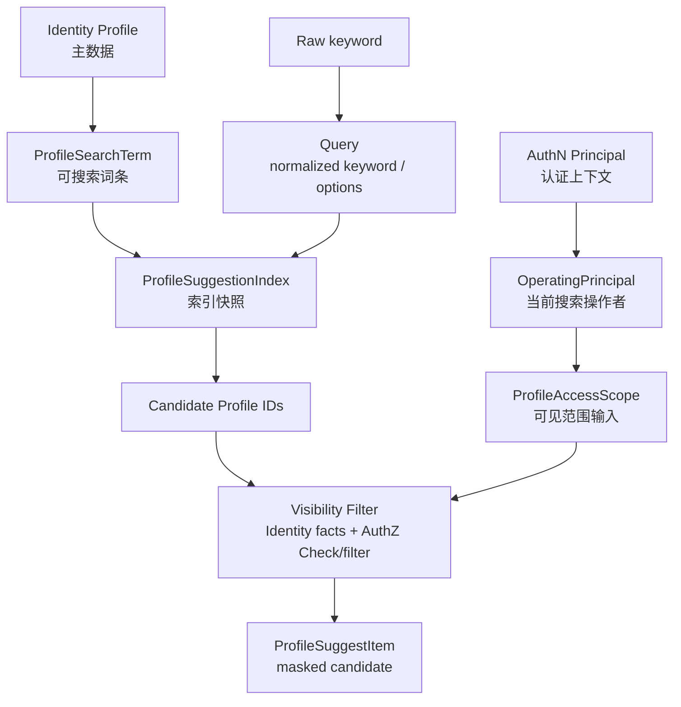
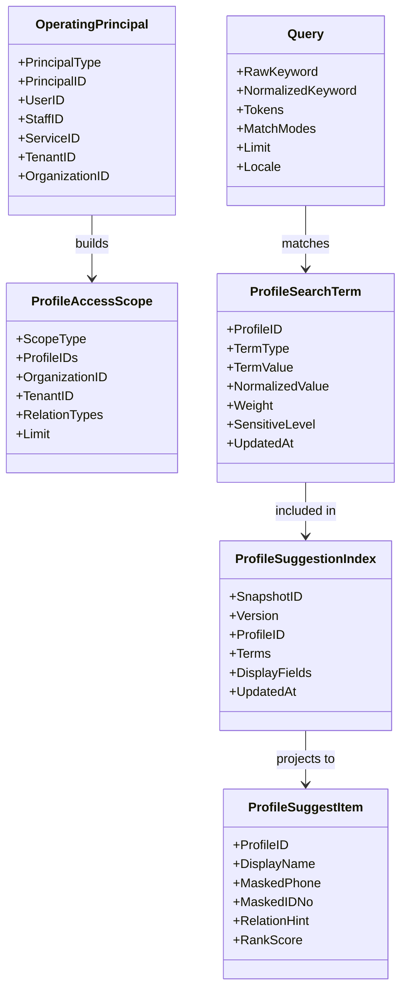
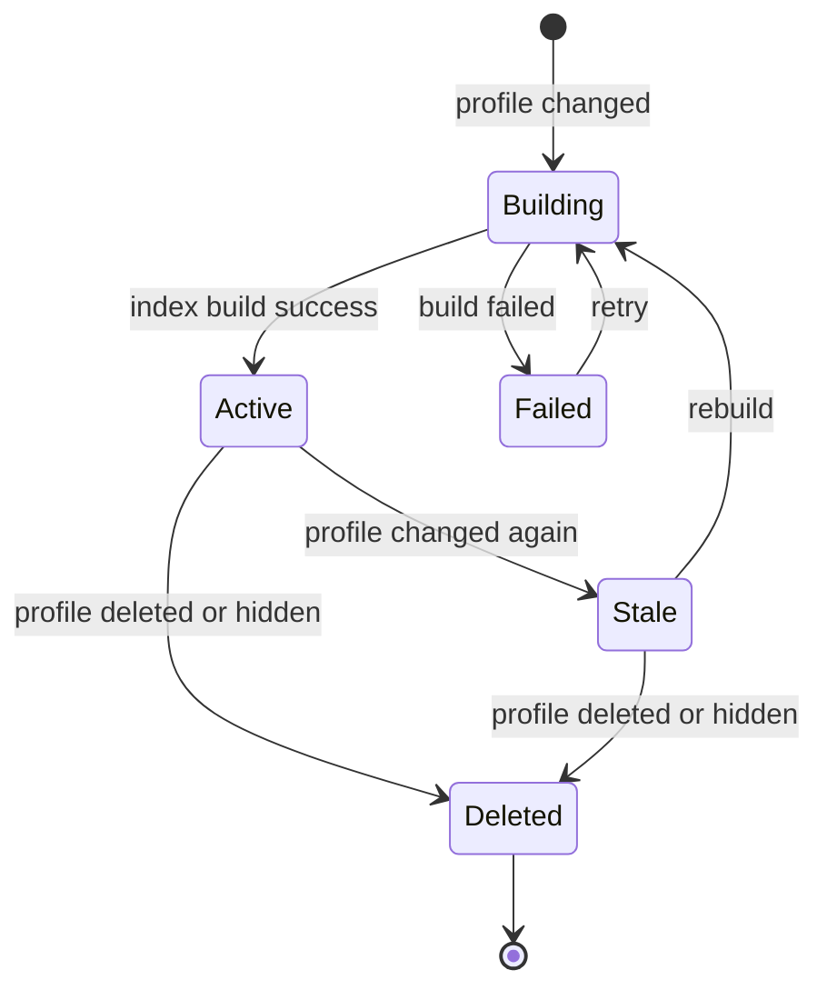

# 领域模型：ProfileSearchTerm / ProfileAccessScope / Snapshot

> 状态：规划改造
> `ProfileSuggestionIndex` 是 application port，`ProfileSuggestItem` 是 application 返回类型；`SnapshotWriter` 负责可选快照写入。本文把它们提升为独立领域模型的部分仍属待收敛设计。

---

## 1. 本文回答

本文回答 10 个问题：

- Suggest 领域模型由哪些核心对象组成？
- `OperatingPrincipal` 为什么不是 AuthN `Principal` 本体？
- `ProfileSearchTerm` 如何表达 Profile 的可搜索词条？
- `ProfileAccessScope` 为什么不是 Identity `ProfileLink`，也不是 AuthZ `Scope`？
- `Query` 如何表达规范化后的搜索请求？
- `ProfileSuggestionIndex` 为什么是读模型快照，不是 Profile 主数据？
- `ProfileSuggestItem` 如何表达脱敏后的候选结果？
- Suggest 模型的生命周期、状态流转和不变量是什么？
- Suggest 与 Identity、AuthZ、AuthN、IDP 的边界在哪里？
- 修改 Suggest 模型时应该核对哪些代码、契约和测试？

本文是 Suggest 模型主文档，集中说明模型定义、模型图、生命周期、状态流转、不变量和边界。模块总览见 [00-模块总览.md](00-模块总览.md)。

---

## 2. 30 秒结论

Suggest 的领域模型可以压缩成一条 Profile 联想搜索读模型主线：

```text
OperatingPrincipal
  -> ProfileAccessScope
  -> Query
  -> ProfileSearchTerm
  -> ProfileSuggestionIndex
  -> visibility filter
  -> ProfileSuggestItem
```

每个对象回答的问题不同：

| 对象 | 一句话 | 领域含义 | 不是什么 |
| --- | --- | --- | --- |
| `OperatingPrincipal` | 当前搜索操作者引用 | 谁在发起本次联想搜索 | 不是 AuthN `Principal` 本体，也不是 User 写模型 |
| `ProfileAccessScope` | 可见范围输入 | 本次搜索允许在哪个范围内找 Profile | 不是 `ProfileLink`，也不是 AuthZ `Scope` 本体 |
| `ProfileSearchTerm` | 可搜索词条 | Profile 派生出的搜索 token | 不是 `Profile` 写模型，不是敏感字段明文仓库 |
| `Query` | 规范化搜索请求 | keyword 归一化后的查询条件 | 不是原始 HTTP request |
| `ProfileSuggestionIndex` | 索引快照 | 某个版本的搜索读模型 | 不是 Profile 主数据 |
| `ProfileSuggestItem` | 脱敏候选结果 | 对外展示的可选 Profile 候选项 | 不是 Profile 写模型，不应包含敏感明文 |

如果只记一句话：

> Suggest 的模型只表达“可搜索、可见、可展示的 Profile 候选项”，不表达 Profile 的写入事实，也不表达通用授权策略。

---

## 3. 为什么 Suggest 需要独立模型

Identity 的 `Profile` 是主数据模型，适合表达真实档案事实。

Suggest 的模型是读侧搜索模型，适合表达：

```text
如何被搜索；
如何被匹配；
如何按可见范围过滤；
如何被排序；
如何被脱敏展示。
```

如果直接用 Identity `Profile` 做搜索，会出现问题：

```text
搜索字段与主数据耦合；
手机号、证件号等敏感字段容易被误返回；
无法为拼音、后四位、业务编号等派生 token 建模；
可见性过滤和排序策略散落在 handler；
索引缓存和主数据一致性边界不清楚；
难以解释为什么某个候选项被返回或被过滤。
```

所以 Suggest 需要独立建模：

```text
Identity Profile
  -> derive ProfileSearchTerm
  -> build ProfileSuggestionIndex
  -> query by Query + ProfileAccessScope
  -> return ProfileSuggestItem
```

---

## 4. 领域模型总图



读图规则：

```text
AuthN Principal 进入 Suggest 后应转换为 OperatingPrincipal；
OperatingPrincipal 只保留搜索所需身份引用；
ProfileAccessScope 表达搜索范围输入，不直接等于授权通过；
ProfileSearchTerm 从 Identity Profile 派生；
ProfileSuggestionIndex 是读模型快照，可以重建；
候选集必须经过可见性过滤；
最终返回 ProfileSuggestItem，而不是 Profile 写模型。
```

---

## 5. 类图：核心对象与关系



注意：

```text
上图是领域语义图，不等于数据库物理表结构；
字段名称和数量以当前源码、迁移和契约为准；
如果代码尚未完全实现某个字段，应在具体文档中标记为规划改造或待补证据。
```

---

## 6. OperatingPrincipal

### 6.1 定位

`OperatingPrincipal` 是 Suggest 内部使用的当前搜索操作者引用。

它回答：

```text
谁在发起本次 Profile 联想搜索？
搜索可见范围应该以哪个主体为中心构造？
审计和限流应该归属到哪个操作者？
```

它通常由 AuthN `Principal` 映射而来。

---

### 6.2 典型字段

| 字段 | 含义 | 说明 |
| --- | --- | --- |
| `PrincipalType` | 操作者类型 | user / staff / service / system，具体以代码为准 |
| `PrincipalID` | 操作者统一 ID | Suggest 内部主体引用 |
| `UserID` | 用户 ID | 可选，家长/普通用户场景 |
| `StaffID` | 员工 ID | 可选，运营/后台场景 |
| `ServiceID` | 服务账号 ID | 可选，系统调用场景 |
| `TenantID` | 租户 ID | 可选，多租户边界 |
| `OrganizationID` | 组织 ID | 可选，组织内搜索边界 |

---

### 6.3 边界

```text
OperatingPrincipal 不是 AuthN Principal 本体；
OperatingPrincipal 不校验 Credential / Challenge；
OperatingPrincipal 不签发 Token；
OperatingPrincipal 不应携带完整 JWT claims；
OperatingPrincipal 不应包含敏感 token；
OperatingPrincipal 只保留 Suggest 查询和审计所需的最小身份引用。
```

---

## 7. ProfileAccessScope

### 7.1 定位

`ProfileAccessScope` 是 Suggest 查询时的可见范围输入。

它回答：

```text
本次联想搜索应该在哪个 Profile 范围内寻找候选项？
```

典型范围：

```text
self；
linked_profiles；
organization；
tenant；
staff_assigned；
explicit_profile_ids；
```

具体枚举以当前代码和产品场景为准。

---

### 7.2 典型字段

| 字段 | 含义 | 说明 |
| --- | --- | --- |
| `ScopeType` | 范围类型 | linked_profiles / organization / explicit 等 |
| `ProfileIDs` | 显式 Profile 集合 | 可选，用于候选限制 |
| `OrganizationID` | 组织范围 | 可选 |
| `TenantID` | 租户范围 | 可选 |
| `RelationTypes` | 关系类型 | 可选，例如 guardian/parent 等 |
| `Limit` | 最大候选数量 | 防枚举和控制响应大小 |

---

### 7.3 边界

```text
ProfileAccessScope 不是 Identity.ProfileLink；
ProfileAccessScope 不是 AuthZ Scope 本体；
ProfileAccessScope 不等于授权通过；
ProfileAccessScope 可以作为 AuthZ Check/filter 的 context；
ProfileAccessScope 不应替代 RoleBinding；
ProfileAccessScope 不应绕过 Identity.ProfileLink 或 AuthZ Check。
```

正确关系：

```text
OperatingPrincipal + request context
  -> ProfileAccessScope
  -> Identity facts / AuthZ Check
  -> visible profileIDs
```

错误关系：

```text
ProfileAccessScope
  -> directly return all matching profiles
```

---

## 8. ProfileSearchTerm

### 8.1 定位

`ProfileSearchTerm` 是从 Identity `Profile` 派生出的可搜索词条。

它回答：

```text
某个 Profile 可以被哪些 keyword 命中？
这些 keyword 应该如何规范化、加权和匹配？
哪些词条具有敏感属性，需要限制展示或日志？
```

---

### 8.2 Term 类型

常见 `TermType`：

| TermType | 来源 | 示例 | 敏感性 |
| --- | --- | --- | --- |
| `name` | 姓名 | 张三 | 中 |
| `name_pinyin` | 姓名拼音 | zhangsan | 中 |
| `name_initial` | 拼音首字母 | zs | 中 |
| `phone_suffix` | 手机号后四位 | 1234 | 高 |
| `phone_hash` | 手机号 hash token | hash(phone) | 高 |
| `id_no_suffix` | 证件号片段 | 5678 | 高 |
| `profile_code` | 档案编号 | P20260001 | 中 |
| `business_code` | 业务编号 | 外部系统编号 | 中 |
| `alias` | 别名/备注 | 小名 | 中 |

具体类型以当前代码、隐私要求和产品场景为准。

---

### 8.3 典型字段

| 字段 | 含义 | 说明 |
| --- | --- | --- |
| `ProfileID` | 所属 Profile | 指向 Identity Profile |
| `TermType` | 词条类型 | name / pinyin / phone_suffix 等 |
| `TermValue` | 原始或安全词条值 | 是否明文取决于敏感等级 |
| `NormalizedValue` | 归一化值 | 用于匹配 |
| `Weight` | 权重 | 用于排序 |
| `SensitiveLevel` | 敏感等级 | 决定日志、展示和存储策略 |
| `UpdatedAt` | 更新时间 | 用于索引刷新和排查 |

---

### 8.4 边界

```text
ProfileSearchTerm 是读模型词条；
ProfileSearchTerm 不是 Profile 写模型；
ProfileSearchTerm 不应保存不必要的敏感明文；
ProfileSearchTerm 不表达授权通过；
ProfileSearchTerm 命中只产生候选集；
ProfileSearchTerm 应能由 Identity Profile 事实重建。
```

---

## 9. Query

### 9.1 定位

`Query` 是规范化后的搜索请求。

它回答：

```text
用户输入的 keyword 如何被清洗、拆分、归一化和限制？
本次查询允许哪些匹配模式？
本次最多返回多少候选项？
```

---

### 9.2 典型字段

| 字段 | 含义 | 说明 |
| --- | --- | --- |
| `RawKeyword` | 原始输入 | 只在必要范围内使用，日志需脱敏 |
| `NormalizedKeyword` | 归一化 keyword | trim、lower、去空格等 |
| `Tokens` | 拆分后的 token | 拼音、数字、文本片段等 |
| `MatchModes` | 匹配模式 | prefix / contains / exact / suffix，具体以代码为准 |
| `Limit` | 返回数量限制 | 防枚举和控制性能 |
| `Locale` | 语言/区域 | 可选，影响拼音或大小写规则 |

---

### 9.3 校验规则

建议规则：

```text
空 keyword 拒绝或只返回受限默认候选，具体以产品策略为准；
过短 keyword 限制搜索范围或拒绝，避免枚举；
手机号/证件号类 keyword 需要更严格限流和权限；
keyword 长度有上限；
keyword 需要归一化，但不能把敏感信息写入日志；
limit 有服务端最大值，不能完全信任客户端。
```

---

## 10. ProfileSuggestionIndex

### 10.1 定位

`ProfileSuggestionIndex` 是某一版本的 Profile 搜索读模型快照。

它回答：

```text
当前搜索索引基于哪个 Profile 版本构建？
某个 Profile 的可搜索词条和展示字段是什么？
索引是否需要刷新或重建？
```

---

### 10.2 典型字段

| 字段 | 含义 | 说明 |
| --- | --- | --- |
| `SnapshotID` | 快照 ID | 可选，按实现而定 |
| `Version` | 索引版本 | 用于一致性和排查 |
| `ProfileID` | 所属 Profile | 指向 Identity Profile |
| `Terms` | 搜索词条集合 | ProfileSearchTerm 集合 |
| `DisplayFields` | 展示字段快照 | 应为最小必要字段 |
| `UpdatedAt` | 更新时间 | 用于判断延迟 |
| `SourceVersion` | Profile 源版本 | 可选，用于和 Identity 对齐 |

---

### 10.3 生命周期



注意：

```text
状态图是领域语义图；
具体状态枚举以当前代码为准；
索引 stale 不代表 Profile 不存在；
索引 failed 不应导致越权返回；
索引丢失时应能从 Identity Profile 重建。
```

---

### 10.4 边界

```text
ProfileSuggestionIndex 是读模型；
ProfileSuggestionIndex 不是 Profile 主数据；
ProfileSuggestionIndex 不应成为权限事实源；
ProfileSuggestionIndex 可以最终一致；
ProfileSuggestionIndex 可以被重建；
ProfileSuggestionIndex 中敏感字段必须最小化、脱敏或 hash 化。
```

---

## 11. ProfileSuggestItem

### 11.1 定位

`ProfileSuggestItem` 是对外返回的脱敏候选项。

它回答：

```text
当前请求者最终可以看到哪些 Profile 候选？
每个候选项可以展示哪些安全字段？
```

---

### 11.2 典型字段

| 字段 | 含义 | 说明 |
| --- | --- | --- |
| `ProfileID` | Profile ID | 可用于后续选择 |
| `DisplayName` | 展示名称 | 可来自 Profile 昵称/姓名等 |
| `MaskedPhone` | 脱敏手机号 | 如 `138****1234`，具体策略以代码为准 |
| `MaskedIDNo` | 脱敏证件号 | 是否返回取决于权限和产品策略 |
| `RelationHint` | 关系提示 | 可选，例如“本人孩子/组织内档案” |
| `RankScore` | 排序分 | 通常仅内部使用，不一定对外返回 |
| `MatchReason` | 命中原因 | 对外需克制，避免泄露敏感字段 |

---

### 11.3 边界

```text
ProfileSuggestItem 不是 Profile 写模型；
ProfileSuggestItem 不应包含明文手机号；
ProfileSuggestItem 不应包含明文证件号；
ProfileSuggestItem 不应暴露完整搜索 token；
ProfileSuggestItem 不应泄露无权限 Profile 的存在性；
ProfileSuggestItem 字段应根据调用方和权限策略最小化。
```

---

## 12. 核心不变量汇总

| 不变量 | 所属对象 | 说明 |
| --- | --- | --- |
| OperatingPrincipal 是搜索操作者引用 | OperatingPrincipal | 不等于 AuthN Principal 本体 |
| ProfileAccessScope 是搜索范围输入 | ProfileAccessScope | 不等于 ProfileLink，也不等于 AuthZ Scope 本体 |
| ProfileSearchTerm 是读模型词条 | ProfileSearchTerm | 不等于 Profile 写模型 |
| ProfileSearchTerm 命中不等于可见 | ProfileSearchTerm | 必须继续做可见性过滤 |
| Query 必须归一化和限流 | Query | 防枚举和性能风险 |
| ProfileSuggestionIndex 是可重建读模型 | ProfileSuggestionIndex | 不等于 Profile 主数据 |
| ProfileSuggestionIndex 不作为权限事实源 | ProfileSuggestionIndex | 可见性由 Identity/AuthZ 决定 |
| ProfileSuggestItem 必须脱敏 | ProfileSuggestItem | 不返回明文手机号/证件号 |
| 先过滤再排序截断 | Query chain | 防越权和结果挤占 |
| 无权限候选不得泄露存在性 | ProfileSuggestItem | 结果数量和 reason 都要克制 |

---

## 13. 失败边界

| 场景 | 期望行为 | 说明 |
| --- | --- | --- |
| keyword 为空 | 拒绝或返回受限默认候选 | 以产品策略为准 |
| keyword 过短 | 限制或拒绝 | 防枚举 |
| keyword 疑似手机号/证件号 | 更严格权限和限流 | 高敏感搜索 |
| 索引缺失 | 返回空或触发重建 | 不能绕过可见性直接查全量明文 |
| 索引 stale | 可返回旧结果但需可观测 | 以一致性策略为准 |
| 可见性过滤失败 | fail closed | 不应返回未过滤候选 |
| AuthZ 不可用 | fail closed 或降级到最小安全范围 | 策略必须明确 |
| Identity facts 不可用 | fail closed | 不应默认全局可见 |
| 脱敏失败 | 不返回敏感字段 | 不应返回明文兜底 |
| limit 超限 | 使用服务端最大值 | 不信任客户端 limit |

---

## 14. 与其他模块的边界

### 14.1 与 Identity

```text
Identity 负责 User/Profile/ProfileLink 写模型；
Suggest 从 Identity Profile 派生 ProfileSearchTerm / ProfileSuggestionIndex；
Suggest 不创建或修改 User/Profile/ProfileLink；
Suggest 索引丢失时应能从 Identity 重建；
ProfileLink 可以作为可见性过滤事实输入，但不是 ProfileAccessScope 本身。
```

### 14.2 与 AuthZ

```text
AuthZ 负责 Role/Permission/RoleBinding/Check；
Suggest 可以调用 AuthZ Check 或 batch filter；
ProfileAccessScope 可以映射为 AuthZ context；
ProfileAccessScope 不是 AuthZ Scope 本体；
Suggest 不写 RoleBinding；
Suggest 索引不是权限事实源。
```

### 14.3 与 AuthN

```text
AuthN 提供 Principal；
Suggest 可把 Principal 映射为 OperatingPrincipal；
Suggest 不校验 Credential / Challenge；
Suggest 不签发 Session / Token；
Suggest 不解析 JWT。
```

### 14.4 与 IDP

```text
IDP 负责 ExternalIdentity / WechatApp / AppToken；
Suggest 不解析外部 provider 身份；
provider claims 如需进入搜索索引，必须先经过 Identity 确认；
IDP 不直接写 Suggest index。
```

---

## 15. 常见反模式

| 反模式 | 问题 | 推荐做法 |
| --- | --- | --- |
| ProfileSearchTerm 当 Profile | 读模型吞并主数据 | Profile 主数据归 Identity |
| ProfileAccessScope 当 ProfileLink | 搜索范围和身份关系混淆 | ProfileLink 归 Identity，Scope 是查询输入 |
| ProfileAccessScope 当 AuthZ Scope | 搜索输入和授权模型混淆 | 明确映射到 AuthZ Check context |
| 搜索命中直接返回 | 越权泄露 | 先可见性过滤 |
| 先 limit 再过滤 | 可见结果被挤掉 | 先过滤再排序截断 |
| ProfileSuggestItem 返回明文手机号 | 敏感泄露 | 返回 maskedPhone |
| 索引保存完整证件号明文 | 高风险泄露 | 使用 suffix/hash/最小化字段 |
| 无权限结果返回 matchReason | 泄露存在性 | deny 后不进入结果 |
| keyword 太短全局搜索 | 枚举风险 | 最小长度、限流、范围限制 |
| 索引当权限事实源 | 授权漂移 | Identity/AuthZ 决定可见性 |

---

## 16. 代码事实源

| 事实 | 路径 |
| --- | --- |
| Suggest domain | `../../../internal/apiserver/domain/suggest` |
| OperatingPrincipal | `../../../internal/apiserver/domain/suggest` |
| ProfileAccessScope | `../../../internal/apiserver/domain/suggest` |
| ProfileSearchTerm | `../../../internal/apiserver/domain/suggest` |
| Query | `../../../internal/apiserver/domain/suggest` |
| ProfileSuggestionIndex | `../../../internal/apiserver/application/suggest` |
| ProfileSuggestItem | `../../../internal/apiserver/application/suggest` |
| Suggest application | `../../../internal/apiserver/application/suggest` |
| Suggest index / repository | `../../../internal/apiserver/infra` |
| Identity Profile / ProfileLink | `../../../internal/apiserver/domain/identity` |
| AuthZ Check | `../../../internal/apiserver/application/authz` |
| Suggest REST transport | `../../../internal/apiserver/transport/rest` |
| Suggest gRPC transport | `../../../internal/apiserver/transport/grpc` |
| Suggest container | `../../../internal/apiserver/container/suggest` |
| REST 契约 | `../../../api/rest` |
| gRPC 契约 | `../../../api/grpc` |
| 架构测试 | `../../../internal/pkg/architecture` |

注意：上表中的具体路径需要继续与当前源码核对。如果源码目录已调整，应以代码为准并同步更新本文。

---

## 17. Verify

修改本文后至少执行：

```bash
make docs-hygiene
```

涉及 Suggest 领域模型：

```bash
go test ./internal/apiserver/domain/suggest/...
```

涉及 Suggest 应用用例：

```bash
go test ./internal/apiserver/application/suggest/...
```

涉及索引、缓存、repository、脱敏辅助：

```bash
go test ./internal/apiserver/infra/...
```

具体路径以当前代码为准。

涉及 Identity/AuthZ/AuthN/IDP 边界：

```bash
go test ./internal/apiserver/domain/identity/...
go test ./internal/apiserver/domain/authz/...
go test ./internal/apiserver/domain/authn/...
go test ./internal/apiserver/domain/idp/...
```

涉及 REST/gRPC 契约或 transport：

```bash
make api-validate
make proto-gen
go test ./internal/apiserver/transport/rest/...
go test ./internal/apiserver/transport/grpc/...
```

涉及 SDK：

```bash
go test ./pkg/sdk/...
```

涉及分层依赖或模块边界：

```bash
go test ./internal/pkg/architecture
```

---

## 18. 本文总结

Suggest 的领域模型可以压缩成：

```text
OperatingPrincipal
  -> ProfileAccessScope
  -> Query
  -> ProfileSearchTerm
  -> ProfileSuggestionIndex
  -> visibility filter
  -> ProfileSuggestItem
```

每个对象的职责是：

```text
OperatingPrincipal：当前搜索操作者引用；
ProfileAccessScope：本次搜索的可见范围输入；
Query：规范化后的搜索请求；
ProfileSearchTerm：从 Profile 派生的可搜索词条；
ProfileSuggestionIndex：某一版本的搜索读模型快照；
ProfileSuggestItem：脱敏后的候选展示结果。
```

最重要的边界是：

```text
ProfileSearchTerm 不是 Profile 写模型；
ProfileAccessScope 不是 ProfileLink，也不是 AuthZ Scope 本体；
ProfileSuggestionIndex 不是 Profile 主数据，也不是权限事实源；
ProfileSuggestItem 必须脱敏；
索引命中不等于可见；
必须先过滤再排序截断；
Suggest 不创建 User/Profile/ProfileLink，不写 RoleBinding，不签发 Token。
```

读完本文后，应继续编写 Profile 搜索索引构建链路，说明 Suggest 如何从 Identity 主数据派生、刷新和修复搜索读模型。
