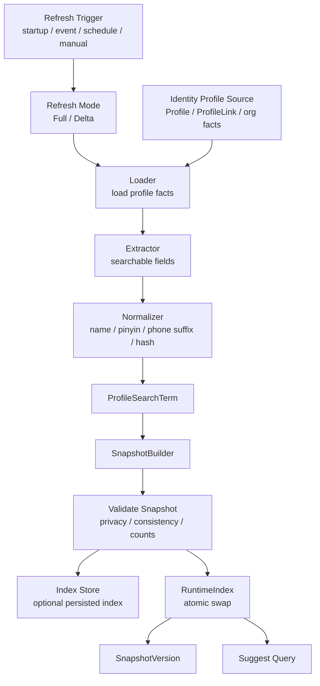
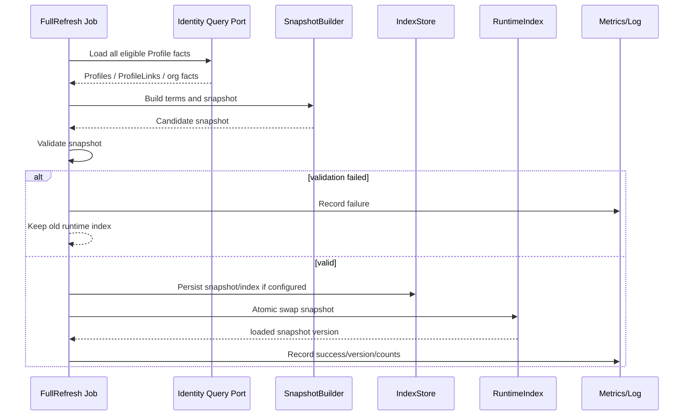
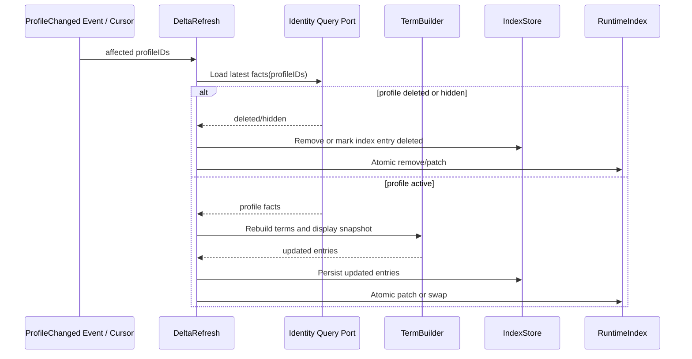

# 关键链路：索引刷新 Full / Delta / Snapshot

> 状态：规划改造
> 当前实现以 `ProfileIndexRefresher`、`ProfileSuggestionRuntime` 和 `SnapshotWriter` 为事实源；本文把快照描述成独立领域模型的部分属于待收敛设计。

---

## 1. 本文回答

本文回答 10 个问题：

- Suggest 索引刷新链路解决什么问题？
- 为什么 Suggest 索引是读模型，不是 Identity Profile 主数据？
- Full rebuild、Delta refresh、Snapshot 分别承担什么职责？
- Profile 主数据变化后，如何派生 `ProfileSearchTerm` 和 `ProfileSuggestionIndex`？
- 刷新过程中如何避免运行时读到半更新索引？
- Full 与 Delta 如何处理一致性、幂等、并发和失败回滚？
- 索引中敏感字段如何最小化、hash 化或脱敏？
- 索引刷新与查询链路、可见性过滤、脱敏返回如何协作？
- 索引延迟、stale、build failed 如何观测和告警？
- 修改该链路时应该核对哪些代码和测试？

本文只讲 Suggest 索引刷新链路。
领域模型见 [01-领域模型-ProfileSearchTerm-ProfileAccessScope-Snapshot.md](01-领域模型-ProfileSearchTerm-ProfileAccessScope-Snapshot.md)；
模块总览见 [00-模块总览.md](00-模块总览.md)；

---

## 2. 30 秒结论

索引刷新是 Suggest 的读模型构建链路。

它的目标是：

```text
把 Identity 的 Profile 主数据和必要关联事实，
派生成可搜索、可过滤、可脱敏展示的 Suggest 索引快照，
并以原子切换方式提供给查询链路使用。
```

核心主线：

```text
Identity Profile source
  -> load profile facts
  -> extract searchable fields
  -> normalize terms
  -> build ProfileSearchTerm
  -> build ProfileSuggestionIndex
  -> validate snapshot
  -> atomic swap runtime index
  -> expose snapshot version
```

Full / Delta / Snapshot 的职责：

```text
Full：从事实源完整重建索引；
Delta：根据变更事件或变更游标增量刷新局部索引；
Snapshot：构建完成后的只读索引视图，用于运行时安全切换。
```

最重要的边界：

```text
Suggest 索引不是 Profile 主数据；
索引命中不等于可见；
刷新失败不能污染当前可用索引；
查询链路不能读取半构建索引；
Snapshot 应先构建、校验，再原子替换；
索引中敏感字段必须最小化、脱敏或 hash 化；
索引可最终一致，但必须可观测。
```

如果只记一句话：

> Suggest 索引刷新负责把 Identity 主数据安全派生成搜索读模型，但不会替代 Identity，也不会替代 AuthZ 可见性过滤。

---

## 3. 链路目标

Suggest 查询需要快速根据 keyword 找到候选 Profile。

直接查 Identity 主数据会带来问题：

```text
每次查询都做复杂字段匹配，性能不可控；
拼音、首字母、手机号后四位等派生词条无法清晰治理；
敏感字段容易被误查、误返、误记日志；
排序权重和搜索字段耦合在业务表；
查询时很难保证先过滤再排序截断；
索引延迟和主数据一致性边界不清楚。
```

因此 Suggest 需要独立刷新链路：

```text
Identity Profile facts
  -> Suggest search terms
  -> Suggest snapshot
  -> query runtime
```

---

## 4. 核心概念

| 概念 | 一句话 | 关键边界 |
| --- | --- | --- |
| `ProfileSource` | Profile 主数据事实源 | 来自 Identity，不归 Suggest 写 |
| `ProfileSearchTerm` | 从 Profile 派生的搜索词条 | 不是 Profile 本体，不表达授权通过 |
| `FullRefresh` | 全量重建索引 | 用于冷启动、修复、重建 |
| `DeltaRefresh` | 增量刷新索引 | 用于 Profile 变化后的局部更新 |
| `ProfileSuggestionIndex` | 某个版本的只读索引快照 | 不是 Profile 主数据，可重建 |
| `RuntimeIndex` | 查询链路使用的运行时索引 | 必须避免半更新状态 |
| `SnapshotVersion` | 索引版本 | 用于一致性、排查和观测 |
| `IndexBuildResult` | 刷新结果 | 成功、失败、跳过、部分失败等 |

---

## 5. 索引刷新总览



读图规则：

```text
刷新可以由启动、事件、定时任务或人工触发；
Full 和 Delta 共享 extractor/normalizer/snapshot builder；
Snapshot 构建完成前不能影响当前查询；
Snapshot 校验通过后才能写 store 或切换 runtime；
查询链路读取 RuntimeIndex 的稳定版本；
SnapshotVersion 应进入日志、metrics 和排查信息。
```

---

## 6. Full Refresh

### 6.1 定位

`FullRefresh` 是从事实源完整重建 Suggest 索引。

适用场景：

```text
服务冷启动；
索引首次构建；
索引数据损坏；
字段规则变更；
normalizer 规则变更；
隐私脱敏策略变更；
Delta 积压过多或游标丢失；
人工修复或定期校准。
```

---

### 6.2 主线

```text
FullRefresh
  -> load all eligible profiles from Identity
  -> extract searchable fields
  -> normalize terms
  -> build all ProfileSearchTerm
  -> build full ProfileSuggestionIndex
  -> validate full snapshot
  -> persist snapshot/index if needed
  -> atomic swap runtime index
  -> record version and metrics
```

---

### 6.3 时序图



关键规则：

```text
Full 构建失败不应清空当前 runtime index；
Full 构建期间查询仍使用旧 snapshot；
Full 成功后一次性切换到新 snapshot；
Full 应记录 profile count、term count、version、duration；
Full 可以慢，但必须可观测和可中断，具体以代码策略为准。
```

---

## 7. Delta Refresh

### 7.1 定位

`DeltaRefresh` 是根据 Profile 变化局部刷新索引。

适用场景：

```text
Profile 创建；
Profile 更新；
Profile 删除或隐藏；
手机号、姓名、证件号、展示字段变化；
ProfileLink 或可见性相关事实变化；
组织归属变化；
外部确认后的展示字段同步变化。
```

注意：

```text
如果变化只影响可见性，不一定需要重建搜索词条；
如果变化影响搜索字段，需要重建该 Profile 的 ProfileSearchTerm；
如果变化影响展示字段，需要更新 ProfileSuggestItem 所需 display snapshot；
如果变化影响权限策略，可能只影响查询时过滤，不一定影响索引。
```

---

### 7.2 主线

```text
DeltaRefresh(change event or cursor)
  -> resolve affected profileIDs
  -> load latest profile facts
  -> rebuild terms for affected profiles
  -> update snapshot/index entry
  -> validate affected entries
  -> atomic patch or build new snapshot
  -> record version and metrics
```

---

### 7.3 时序图



关键规则：

```text
Delta 应以 Identity 最新事实为准；
同一个 profileID 的 Delta 应幂等；
重复事件不应产生重复词条；
删除/隐藏 Profile 应从索引移除或标记不可搜索；
Delta 失败不应污染其他 Profile 的索引；
Delta 积压过多时应触发 Full 校准。
```

---

## 8. Snapshot 与原子切换

### 8.1 为什么需要 Snapshot

查询链路不能读到半更新索引。

错误方式：

```text
直接在运行时 map/list 上边构建边修改；
Full 构建失败后留下部分新数据；
Delta patch 过程中查询读到一半旧、一半新；
reload 失败时清空索引。
```

正确方式：

```text
先构建新 Snapshot；
校验通过；
再原子替换 RuntimeIndex 指针；
失败则继续使用旧 Snapshot。
```

---

### 8.2 Snapshot 主线

```text
Build Snapshot(version=N+1)
  -> validate terms/display/privacy/counts
  -> atomic swap current snapshot
  -> current version = N+1
```

运行时查询：

```text
Query
  -> load current snapshot pointer
  -> search immutable snapshot
  -> return candidates
```

关键规则：

```text
Snapshot 应尽量不可变；
原子切换后旧 Snapshot 可由 GC 或引用计数释放；
loaded snapshot version 只能前进，不能回退，除非有明确 rollback 策略；
查询结果应可记录 snapshot version，方便排查索引延迟。
```

---

## 9. ProfileSearchTerm 构建

### 9.1 输入字段

来自 Identity Profile 的字段可能包括：

```text
姓名；
昵称；
手机号；
证件号；
ProfileID；
档案编号；
组织/租户信息；
业务编号；
备注名或别名，若存在。
```

具体字段以 Identity 模型和隐私策略为准。

---

### 9.2 派生词条

常见派生：

```text
姓名原文；
姓名拼音；
拼音首字母；
手机号后四位；
手机号 hash token；
证件号后四位；
证件号 hash token；
档案编号；
业务编号；
```

注意：

```text
不是所有字段都应该进入索引；
高敏感字段应优先使用 suffix/hash，而不是明文全文；
是否支持证件号搜索必须结合权限和审计要求；
派生规则变化后需要 Full rebuild。
```

---

### 9.3 Normalizer

Normalizer 负责把原始字段转成可匹配形式。

它可能处理：

```text
trim；
lowercase；
全角半角转换；
去空格；
手机号格式清洗；
拼音转换；
拼音首字母；
特殊字符过滤；
hash / HMAC token；
```

关键边界：

```text
Normalizer 必须可测试；
Normalizer 规则变化需要索引重建；
高敏感字段 hash 应使用稳定、安全、不可逆策略；
日志不应打印原始敏感 keyword 或原始敏感 term。
```

---

## 10. 隐私与敏感字段治理

索引刷新必须遵循最小化原则。

建议策略：

| 字段 | 索引策略 | 返回策略 |
| --- | --- | --- |
| 姓名 | 可明文或规范化 token，视隐私策略 | 可返回 displayName |
| 手机号 | 后四位 / hash token | maskedPhone |
| 证件号 | 尽量不索引；如必须，使用 suffix/hash | 默认不返回或 maskedIDNo |
| 生日 | 通常不索引 | 默认不返回 |
| 地址 | 通常不索引 | 默认不返回 |
| 外部 claims | 先经 Identity 确认 | 按 Identity 展示字段返回 |

关键规则：

```text
索引不是敏感字段明文仓库；
能用 suffix/hash 的，不保存全文；
能不索引的敏感字段，不索引；
对外结果必须脱敏；
内部日志也必须脱敏。
```

---

## 11. 一致性模型

Suggest 索引通常可以接受最终一致。

状态：

```text
Identity committed：Profile 主数据已提交；
Index updated：Suggest 索引已刷新；
Runtime loaded：查询运行时已加载对应 snapshot；
```

边界：

```text
Identity committed 不等于 Suggest index updated；
Suggest index updated 不等于 Runtime loaded；
Runtime loaded 也不代表 AuthZ 策略最新；
查询结果可能短时间 stale，但不能越权；
可见性过滤应以最新可获取的 Identity/AuthZ 事实为准，具体以实现为准。
```

建议：

```text
记录 source profile version；
记录 snapshot version；
暴露 index lag；
定时 Full 校准；
Delta 失败可重试；
Delta 游标丢失时触发 Full rebuild。
```

---

## 12. 幂等与并发

### 12.1 幂等

| 操作 | 推荐语义 |
| --- | --- |
| FullRefresh 重复执行 | 生成等价新 snapshot 或相同 version，必须明确 |
| Delta 同一 profile 重复执行 | 最终索引与 Identity 最新事实一致 |
| 删除事件重复 | 保持 deleted/hidden，不报错或幂等成功 |
| 隐藏后又更新 | 应保持不可搜索，除非重新启用 |
| normalizer 规则相同 | 不应产生重复 terms |

---

### 12.2 并发

并发风险：

| 风险 | 说明 |
| --- | --- |
| Full 与 Delta 同时执行 | Delta 可能被 Full 覆盖或乱序 |
| 多个 Delta 更新同一 profile | 旧事件覆盖新事实 |
| Snapshot swap 与 Query 并发 | 查询读到半更新数据 |
| 删除与更新并发 | 已删除 Profile 被重新索引 |
| 多实例同时刷新 | Snapshot version 或 store 写入冲突 |

建议：

```text
Full 和 Delta 需要协调锁或版本序列；
Delta 应重新读取 Identity 最新事实，而不是只信事件 payload；
同 profileID 的更新使用 version 判断；
Snapshot 原子替换；
Runtime snapshot 只读；
旧版本不能覆盖新版本。
```

---

## 13. 失败边界

| 场景 | 期望行为 | 说明 |
| --- | --- | --- |
| Identity source 不可用 | 刷新失败 | 保留旧 Snapshot |
| Full 构建失败 | 不切换 runtime | 避免清空可用索引 |
| Delta 构建失败 | 该 profile 保持旧索引或标记重试 | 不能污染其他 profile |
| Snapshot 校验失败 | 不切换 runtime | 记录错误和告警 |
| Store 写入失败 | 刷新失败或只保留内存，按策略 | 必须可观测 |
| Runtime swap 失败 | 保留旧 Snapshot | 不返回半更新结果 |
| Normalizer panic/error | 刷新失败 | 需要测试和恢复策略 |
| 敏感字段处理失败 | 不写入该敏感 term | 不应保存明文兜底 |
| Delta 积压过多 | 触发 Full rebuild | 防止无限落后 |
| 版本回退 | 拒绝切换 | 防旧索引覆盖新索引 |

---

## 14. 与查询链路的关系

查询链路依赖刷新链路产出的 Snapshot。

```text
Index Refresh
  -> current Snapshot(version=N)
  -> Query reads Snapshot(version=N)
  -> candidate profileIDs
  -> visibility filter
  -> rank / limit / mask
```

边界：

```text
Snapshot 只负责快速找候选；
Snapshot 命中不等于可见；
查询仍必须做可见性过滤；
查询不应在每次请求中重建全量索引；
如果 Snapshot missing，可以返回空、降级或触发异步重建，策略必须明确。
```

---

## 15. 与可见性过滤的关系

索引刷新不应内嵌最终授权结果。

原因：

```text
权限关系可能频繁变化；
ProfileLink / RoleBinding / AuthZ policy 可能独立变化；
把可见性静态写入索引会导致权限漂移；
搜索索引不应成为权限事实源。
```

可选策略：

```text
索引只存候选和展示字段，查询时实时过滤；
索引存粗粒度 organization/tenant 用于预过滤，最终仍做 AuthZ/Identity 可见性过滤；
高性能场景构建可见性投影，但必须有版本和刷新治理。
```

关键边界：

```text
无论使用哪种策略，最终返回前必须保证调用方可见；
不能因为索引里存在某个 Profile 就返回给用户；
AuthZ/Identity 事实不可用时应 fail closed 或降级到最小安全范围。
```

---

## 16. 可观测性

建议指标：

```text
suggest_index_full_refresh_total；
suggest_index_full_refresh_success_total；
suggest_index_full_refresh_failure_total；
suggest_index_delta_refresh_total；
suggest_index_delta_refresh_success_total；
suggest_index_delta_refresh_failure_total；
suggest_index_refresh_duration_seconds；
suggest_index_snapshot_version；
suggest_index_profile_count；
suggest_index_term_count；
suggest_index_stale_lag_seconds；
suggest_index_delta_backlog_count；
suggest_index_runtime_swap_failure_total；
```

建议日志字段：

```text
refreshMode；
snapshotVersion；
sourceVersion；
profileCount；
termCount；
affectedProfileIDs count；
duration；
result；
traceID；
```

禁止日志：

```text
明文手机号；
明文证件号；
原始敏感 keyword；
完整搜索 token；
未脱敏 Profile 展示字段。
```

---

## 17. 与其他模块的边界

### 17.1 与 Identity

```text
Identity 是 Profile 主数据源；
Suggest 从 Identity 派生搜索读模型；
Suggest 不创建、修改或删除 Profile 主数据；
Profile 删除/隐藏后 Suggest 索引应删除或标记不可搜索；
ProfileLink 可以作为可见性事实，但不是索引刷新唯一职责。
```

### 17.2 与 AuthZ

```text
AuthZ 负责授权策略；
索引刷新不写 RoleBinding；
索引刷新不生成 Permission；
索引不是权限事实源；
查询返回前仍要经过 AuthZ/Identity 可见性过滤。
```

### 17.3 与 AuthN

```text
AuthN 提供 Principal；
索引刷新通常不依赖当前登录用户；
索引刷新不校验 Credential / Challenge；
索引刷新不签发 Token。
```

### 17.4 与 IDP

```text
IDP 外部 claims 不能直接写索引；
外部 claims 如 nickname/avatar 需要先经过 Identity 确认；
Suggest 不读取 WechatApp / Credentials / AppToken / ExternalIdentity。
```

---

## 18. 常见反模式

| 反模式 | 问题 | 推荐做法 |
| --- | --- | --- |
| 直接修改运行时索引 | 查询读到半更新数据 | 构建 Snapshot 后原子切换 |
| Full 失败清空索引 | 大面积不可用 | 保留旧 Snapshot |
| Delta 只信事件 payload | 旧事件可能覆盖新事实 | Delta 重新读取 Identity 最新事实 |
| 索引保存明文证件号 | 高敏感泄露 | suffix/hash/最小化 |
| 索引命中即返回 | 越权泄露 | 查询时可见性过滤 |
| 索引写入 RoleBinding | Suggest 吞并 AuthZ | 授权归 AuthZ |
| 索引当 Profile 主数据 | 主从倒置 | Profile 主数据归 Identity |
| 查询时每次 Full rebuild | 性能不可控 | 异步刷新 + Snapshot 查询 |
| 旧 Snapshot 覆盖新 Snapshot | 版本回退 | Snapshot version 单调前进 |
| 日志打印原始搜索 token | 敏感泄露 | 日志脱敏和 hash |

---

## 19. 代码事实源

| 事实 | 路径 |
| --- | --- |
| Suggest domain | `../../../internal/apiserver/domain/suggest` |
| ProfileSearchTerm | `../../../internal/apiserver/domain/suggest` |
| ProfileSuggestionIndex / ProfileSuggestionRuntime | `../../../internal/apiserver/application/suggest` |
| Suggest application | `../../../internal/apiserver/application/suggest` |
| Full / Delta refresh use case | `../../../internal/apiserver/application/suggest` |
| Normalizer / TermBuilder | `../../../internal/apiserver/application/suggest`、`../../../internal/apiserver/domain/suggest`，具体以代码为准 |
| Suggest index / repository | `../../../internal/apiserver/infra` |
| Runtime snapshot / cache | `../../../internal/apiserver/infra`、`../../../internal/apiserver/application/suggest`，具体以代码为准 |
| Identity Profile source | `../../../internal/apiserver/domain/identity`、`../../../internal/apiserver/application/identity` |
| Suggest REST transport | `../../../internal/apiserver/transport/rest` |
| Suggest gRPC transport | `../../../internal/apiserver/transport/grpc` |
| Suggest container | `../../../internal/apiserver/container/suggest` |
| REST 契约 | `../../../api/rest` |
| gRPC 契约 | `../../../api/grpc` |
| 架构测试 | `../../../internal/pkg/architecture` |

注意：上表中的具体路径需要继续与当前源码核对。如果源码目录已调整，应以代码为准并同步更新本文。

---

## 20. Verify

修改本文后至少执行：

```bash
make docs-hygiene
```

涉及 Suggest 领域模型：

```bash
go test ./internal/apiserver/domain/suggest/...
```

涉及 Suggest 索引刷新用例：

```bash
go test ./internal/apiserver/application/suggest/...
```

涉及索引、缓存、repository、Snapshot runtime：

```bash
go test ./internal/apiserver/infra/...
```

具体路径以当前代码为准。

涉及 Identity/Profile 事实源：

```bash
go test ./internal/apiserver/domain/identity/...
go test ./internal/apiserver/application/identity/...
```

涉及 AuthZ/AuthN/IDP 边界：

```bash
go test ./internal/apiserver/domain/authz/...
go test ./internal/apiserver/domain/authn/...
go test ./internal/apiserver/domain/idp/...
```

涉及 REST/gRPC 契约或 transport：

```bash
make api-validate
make proto-gen
go test ./internal/apiserver/transport/rest/...
go test ./internal/apiserver/transport/grpc/...
```

涉及 SDK：

```bash
go test ./pkg/sdk/...
```

涉及分层依赖或模块边界：

```bash
go test ./internal/pkg/architecture
```

---

## 21. 本文总结

索引刷新链路可以压缩成：

```text
Identity Profile source
  -> load profile facts
  -> extract searchable fields
  -> normalize terms
  -> build ProfileSearchTerm
  -> build ProfileSuggestionIndex
  -> validate snapshot
  -> atomic swap runtime index
  -> expose snapshot version
```

Full / Delta / Snapshot 的职责是：

```text
Full：从 Identity 事实源完整重建索引；
Delta：根据 Profile 变化局部刷新索引；
Snapshot：提供运行时只读索引视图，并通过原子切换避免半更新状态。
```

最重要的边界是：

```text
Suggest 索引不是 Profile 主数据；
索引命中不等于可见；
刷新失败不能污染当前可用索引；
查询链路不能读取半构建索引；
Snapshot 应先构建、校验，再原子替换；
索引中敏感字段必须最小化、脱敏或 hash 化；
索引可最终一致，但必须可观测。
```

下一篇应继续编写 Profile 联想查询链路，说明 Query 如何命中 Snapshot、生成候选集，并进入可见性过滤、排序、截断和脱敏。
