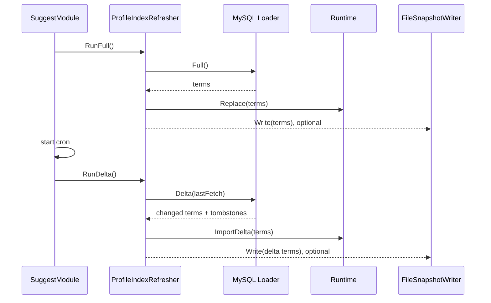

# 关键链路：索引刷新 Full / Delta / Snapshot

> 状态：已实现 · 已与 `ProfileIndexRefresher`、MySQL Loader、search Runtime/Store、文件 writer、container 和测试核对。

## 1. 30 秒结论

Suggest 启动时先执行一次 Full refresh，成功后才启动定时任务。Full 会构建新 Store 并原子替换当前索引；Delta 会在现有 Store 上合并 upsert 和删除 tombstone。

```text
Full:  MySQL Full -> []ProfileSearchTerm -> Runtime.Replace(new Store)
Delta: MySQL Delta(since) -> changed terms/tombstones -> Runtime.ImportDelta
```

当前 `snapshot.txt` 只是可选写出文件：启动时不会读取，Delta 后写入的也只是本次增量，不是完整可恢复快照。

## 2. 主链路



## 3. Full Refresh

`RunFull` 的当前顺序：

1. `ProfileCandidateSource.Full` 查询全部候选；
2. `Runtime.Replace` 调用 `search.Load` 构建一个新 Store；
3. `atomic.Value.Store` 一次切换当前 Store 指针；
4. 更新 `lastFetch`；
5. 可选写 `snapshot.txt`；
6. 记录耗时、条数和成功日志。

Loader 失败时不会替换旧 runtime。Store 构建期间查询仍可读取旧指针；切换后新查询读取新 Store。

首次 Full 发生在 cron 启动之前。它失败时由 `SuggestModule` 根据 `required` 决定启动失败还是降级为空结果服务。

## 4. Delta Refresh

Delta 只有在 `lastFetch` 已由成功 Full/Delta 设置后才执行。

默认 Delta SQL 返回：

- `since` 之后变更的活跃 Profile；
- `since` 之后软删除的 Profile tombstone。

当前 tombstone 协议是 `DisplayName` 为空。`Store.ImportTerms` 对每个 ProfileID：

1. 撤销旧 Trie 和 Hash 键；
2. tombstone 则删除 term；
3. 否则写入新的姓名、拼音、ID 和手机号键。

因此当前 Delta 能清理旧搜索键；自定义 `delta_sql` 必须继续提供删除 tombstone，否则软删除数据可能残留到下一次 Full。

如果 Delta 没有结果，`lastFetch` 保持不变；下次查询仍从原时间点拉取。成功合并后才更新时间。

## 5. Loader 当前事实

默认 Loader 从以下表派生读模型：

```text
profiles
  JOIN profile_links
  JOIN users
```

主要映射：

| ProfileSearchTerm 字段 | 当前来源 |
| --- | --- |
| ProfileID / DisplayName | `profiles.id` / `profiles.name` |
| Mobiles | 关联 User 的 `phone` 聚合 |
| OwnerOperatorIDs | `profiles.created_by` |
| Weight | 默认 SQL 固定为 1 |
| OrgID | `loader_placeholder_org_id` 或自定义 SQL |
| TenantID | 默认固定 0，已弃用 |

默认 OrgID 是当前表结构的过渡方案。多组织部署必须给出可信的业务组织来源，不能把 IAM 授权域直接塞入 OrgID。

## 6. Store 与索引结构

一个 Store 同时维护：

- Trie：展示名、全拼和拼音首字母；
- Hash：Profile ID 和原始手机号精确键；
- `terms`：ProfileID 到 `ProfileSearchTerm`；
- `profileKeys`：用于 Delta 撤销旧键。

`Runtime.Replace` 更新索引条数指标；`ImportDelta` 在当前 Store 上加锁修改，不是复制后原子替换。因此 Full 是整库原子切换，Delta 是当前 Store 内部的互斥更新。

## 7. 文件 Snapshot

开启 `suggest.snapshot` 后，writer 把数据写到：

```text
<data_dir>/snapshot.txt
```

当前行格式：

```text
name|profile_id|mobiles|tenant_id|org_id|owner_ids|weight
```

必须明确：

- 文件包含原始手机号；
- 权限是当前实现的 `0644`；
- 每次 Write 直接覆盖文件；
- Full 写完整候选，Delta 写本次增量；
- 启动路径没有读取或恢复逻辑；
- writer 失败只记录 warn，不影响已完成的 runtime 更新。

所以它当前更接近调试/导出文件，不是可靠的持久化快照。生产环境启用前应把数据目录按敏感数据保护。

## 8. 失败与可观测性

| 场景 | 当前行为 |
| --- | --- |
| Full 查询失败 | 返回错误，不替换 runtime |
| Delta 查询失败 | 返回错误，不更新时间 |
| Delta 时 runtime 不可用 | 返回错误 |
| 文件写失败 | warn；runtime 结果保留 |
| 定时刷新失败 | container 记录 error，服务继续使用当前索引 |

当前指标包括 Full/Delta 耗时和索引 term 数；没有 snapshot 新鲜度、最后成功时间或连续失败次数指标。

## 9. 事实源

| 内容 | 路径 |
| --- | --- |
| Refresher 和端口 | `internal/apiserver/application/suggest/refresher.go`、`ports.go` |
| MySQL Loader | `internal/apiserver/infra/mysql/suggest/loader.go` |
| Runtime / Store / Trie / Hash | `internal/apiserver/infra/suggest/search` |
| File writer | `internal/apiserver/infra/suggest/search/snapshot.go` |
| 启动和 cron | `internal/apiserver/container/suggest/module.go` |
| 配置 | `configs/apiserver.dev.yaml`、`configs/apiserver.prod.yaml` |

## 10. Verify

```bash
go test ./internal/apiserver/application/suggest/...
go test ./internal/apiserver/infra/mysql/suggest/...
go test ./internal/apiserver/infra/suggest/search/...
go test ./internal/apiserver/container/suggest/...
make docs-hygiene
```
