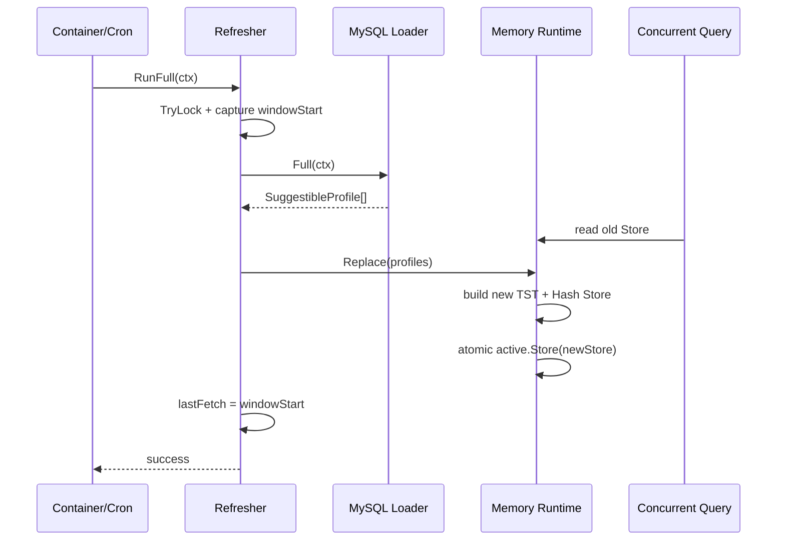

# 关键链路：索引刷新 Full / Delta

> 状态：已实现 · 刷新编排位于 `application/suggest/refreshindex`，MySQL 负责投影，内存 adapter 负责物理索引。

## 1. 30 秒结论

```text
startup / cron
  -> refreshindex.Refresher
  -> ProjectionSource.Full / Delta
  -> MySQL Loader
  -> SuggestibleProfile[] / ProjectionChange[]
  -> IndexWriter.Replace / Apply
  -> memory Runtime
  -> TST + Hash
```

- Full 在旧索引可读期间构建新 Store，完成后用 `atomic.Value` 一次切换。
- Delta 重新计算受影响 Profile 的完整投影；仍 eligible 则 Upsert，否则 Delete。
- Full 和 Delta 共用非阻塞互斥锁；重叠任务立即返回 `ErrRefreshInProgress`。
- 游标取本次查询开始前的 `windowStart`；source/writer 失败均不推进。
- MySQL 行无法构成合法投影时整批失败，不再跳过坏行。
- 进程内索引没有持久 snapshot；每个实例启动时都必须先 Full。

## 2. 谁拥有数据

刷新链路只读 Identity 事实：

```text
profiles
profile_links
users
```

Identity 负责这些表的生命周期和约束；Suggest 只定义“什么样的组合可以进入联想索引”。索引是派生状态，可以被替换、丢弃和重建，不能反向写回主表。

## 3. 默认 eligibility

默认 Full 与 Delta 的有效候选都要求：

1. `profiles.deleted_at IS NULL`；
2. 至少存在一条 `profile_links.deleted_at IS NULL` 且 `revoked_at IS NULL` 的关系；
3. 关联 `users.deleted_at IS NULL`。

默认投影字段为：

| 投影字段 | 默认来源 |
| --- | --- |
| ProfileID | `profiles.id` |
| DisplayName | `profiles.name` |
| Mobiles | 活跃关联 User 的去重 `phone` 集合 |
| OwnerOperatorIDs | `profiles.created_by` |
| Weight | 常量 `1` |
| OrgID | `loader_placeholder_org_id` |

`OrgID` 是当前 schema 过渡产生的占位值。多组织场景不能把它当作真实组织事实，应提供包含真实 org 字段的 `full_sql` / `delta_sql`，或保持 `0` 以避免虚构组织范围。

## 4. Full：构建并原子替换完整快照

### 4.1 时序



### 4.2 成功条件

Full 只有在以下步骤全部完成后才更新游标和成功时间：

- source 返回；
- 每一行都映射为合法 `SuggestibleProfile`；
- writer 成功安装新 Store。

MySQL Loader 现在通过 `profile.New` 构造每一项。ID 非正或名称为空会返回 `map full suggest profile <id>` 错误。Refresher 仍有一层防御性过滤，用于保护其他可能的 `ProjectionSource` 实现；生产 MySQL 路径的非法行会在到达该层之前失败。

### 4.3 查询并发语义

新 Store 的 TST、Hash、profile map 和反向 key map 在独立对象中构建。构建期间查询继续使用旧 Store；只有 `atomic.Value` 切换发生在一个瞬间，因此同一次查询不会读到半构建快照。

Full 不会在原 Store 上逐项清空和重建，这避免了长时间写锁和部分索引状态。

## 5. Delta：重新投影后 Upsert 或 Delete

### 5.1 affected set

默认 Delta 以 `since` 找出任一事实发生变化的 Profile：

- Profile 更新或软删除；
- ProfileLink 更新、软删除或 revoked；
- 关联 User 更新或软删除。

它不是只查 `profiles.updated_at`。否则手机号变化、最后一条关系撤销或 User 删除都无法更新旧索引。

### 5.2 变更协议

对 affected Profile 重新计算 eligibility：

| 重算结果 | SQL 行 | adapter 输出 |
| --- | --- | --- |
| 仍 eligible | 完整 ID/name/org/mobiles/owners/weight | `ProjectionChange.Upsert` |
| 已不 eligible | 正 ID + 空 name 的 tombstone 行 | `ProjectionChange.Delete` |

空名称只是 MySQL Delta 行协议，不是一个合法的领域 Profile。adapter 必须在边界把它翻译成 Delete；domain `SuggestibleProfile` 始终拒绝空 DisplayName。

### 5.3 Apply 语义

`memory.Store.ApplyChanges` 在写锁内处理整批 change：

- Upsert：先根据 `profileKeys` 撤销该 Profile 的旧 TST/Hash keys，再导入新姓名、拼音、首字母、ID 和手机号 keys；
- Delete：撤销全部旧 keys，并删除 profile 与反向 key 记录；
- 重复 Delete：没有旧项时保持幂等。

先撤销旧 keys 非常重要。只覆盖 profile map 会让旧姓名或旧手机号继续命中，形成幽灵候选或敏感数据残留。

### 5.4 首次 Full 之前

`lastFetch` 为零时，`RunDelta` 直接 no-op。Delta 只描述相对变化，不能替代完整基线；Runtime 未安装 Store 时也拒绝 Apply。

## 6. 游标为什么取查询开始时间

Full/Delta 都在访问 source 前记录 `windowStart`，成功后设置：

```text
lastFetch = windowStart
```

下一次 Delta 使用旧 `lastFetch` 作为 `since`。这样本次查询执行期间发生的更新会落入本次结果或下次窗口，而不会因为结束后才取时间而被永久跨过。重复读由 Upsert/Delete 的幂等语义吸收。

但当前实现仍有两个前提：

- 应用时钟与 MySQL `updated_at` 时钟需要足够一致；
- 默认 SQL 使用严格 `>`，时间戳精度必须能区分边界更新。

如果部署环境不能满足这两个前提，应引入数据库 watermark、重叠窗口或单调变更序号，而不是只调大 Cron 频率。

## 7. 游标与失败矩阵

| 场景 | Store | `lastFetch` | 成功时间/health | 结果 |
| --- | --- | --- | --- | --- |
| Full source 失败 | 保留旧 Store | 不推进 | 不更新 | 返回错误 |
| Full 映射坏行 | 保留旧 Store | 不推进 | 不更新 | 返回错误 |
| Full Replace 失败 | 保留 writer 语义决定的旧状态 | 不推进 | 不更新 | 返回错误 |
| Delta source 失败 | 保留当前 Store | 不推进 | 不更新 | 返回错误 |
| Delta 映射坏行 | 保留当前 Store | 不推进 | 不更新 | 返回错误 |
| Delta Apply 失败 | 由 writer 原子性决定；当前 Runtime 整批持写锁 | 不推进 | 不更新 | 返回错误 |
| Delta 无变化 | 不变 | 推进到 windowStart | 更新 | 成功 |
| Full/Delta 重叠 | 不变 | 不推进 | 不更新 | `ErrRefreshInProgress` |

P1 的核心闭环是：adapter 不再 `continue` 吞掉映射错误，Refresher 也只在 writer 成功后推进游标和 `lastSuccessUnix`。

## 8. 自定义 SQL 契约

### 8.1 `full_sql`

自定义 Full SQL 必须返回以下列名：

```text
id, name, org_id, mobiles, owner_operator_ids, weight
```

`mobiles`、`owner_operator_ids` 使用逗号分隔字符串。当前 parser 会 trim 空项；无法解析的 owner ID 会被忽略，因此自定义 SQL 应主动保证数据质量。

### 8.2 `delta_sql`

自定义 Delta SQL 除返回相同列外，还必须满足：

1. 接受两个相同的 `since` 参数；
2. 覆盖 Profile、关系和 User 的全部受影响路径；
3. 对 eligible 项返回完整投影，而不是局部字段 patch；
4. 对不再 eligible 的项返回正 ID、空 name tombstone；
5. 允许重复读取同一变化。

内建 Delta SQL 自己使用七个 `since` 参数；这是 adapter 内部实现，不是自定义 SQL 的调用契约。

如果自定义查询无法提供可靠 tombstone，应关闭 `delta_sync_cron`，保留周期 Full，而不是接受无法删除的旧 key。

## 9. 刷新互斥与调度

`Refresher` 使用同一把 `sync.Mutex.TryLock` 保护 Full 和 Delta：

- 重叠任务不等待、不排队；
- 后到任务记录 `refresh_in_progress` 后返回；
- 下一次 Cron 再尝试。

调度属于 `container/suggest`：

1. 模块初始化时同步执行一次 Full；
2. Full 成功后注册周期 Full；
3. 仅当 `delta_sync_cron` 非空时注册 Delta；
4. Cleanup 取消 context 并停止 Cron。

## 10. 启动、降级与恢复

| 配置/场景 | 行为 |
| --- | --- |
| `enable=false` | 不初始化，不注册路由能力 |
| 缺少 MySQL | 初始化失败，不受 `required` 降级逻辑覆盖 |
| production + `disable_mobile_mask=true` | 初始化失败 |
| 首次 Full/调度初始化成功 | 安装查询服务并启动 Cron |
| 上述步骤失败且 `required=true` | 模块初始化返回错误 |
| 上述步骤失败且 `required=false` | 使用 `DegradedQuerier`，查询返回空数组 |
| 后续周期刷新失败 | 保留上一次可用索引与游标，等待下次 Cron |

当前 optional 启动降级不会继续启动刷新调度，因此不能在同一进程内自动恢复，通常需要修复依赖后重启。

还有一个需要单独治理的健康检查边界：若初始 Full 已成功、随后 Cron 表达式注册失败，optional 分支会切到 `DegradedQuerier`，但 `HasSuccessfulRefresh` 已为真；现有 `CheckHealth` 可能报告健康。这不是 P1 投影闭环问题，但运维不能把当前 health 当作 querier 类型和调度状态的完整证明。

## 11. 可观测性

| 指标 | 关键 label/含义 |
| --- | --- |
| `iam_suggest_refresh_duration_seconds` | `kind=full|delta` |
| `iam_suggest_refresh_total` | `kind` + `result=success|failed|refresh_in_progress` |
| `iam_suggest_refresh_items_total` | `kind` + `operation=upsert|tombstone` |
| `iam_suggest_last_success_timestamp_seconds` | 每类刷新最后成功时间 |
| `iam_suggest_index_terms` | 当前 Runtime 中的 Profile 数 |

健康检查目前只判断启用模块是否有 querier，以及是否至少成功刷新过一次。它没有检查：

- 索引 age 是否超过 SLA；
- Full/Delta Cron 是否仍在运行；
- 各实例 generation 是否一致；
- source watermark 是否追平。

## 12. 测试证据

| 行为 | 证据入口 |
| --- | --- |
| Full 使用查询开始时间作为游标 | `refreshindex/refresher_test.go` |
| 空 Delta 推进游标 | `refreshindex/refresher_test.go` |
| source/Apply/Replace 失败不推进 | `refreshindex/refresher_test.go` |
| 非空 Delta Apply、计数并推进 | `refreshindex/refresher_test.go` |
| Full/Delta 互斥 | `refreshindex/refresher_test.go` |
| Profile 删除产生 tombstone | `infra/mysql/suggest/loader_integration_test.go` |
| 手机号变化产生完整 Upsert | `infra/mysql/suggest/loader_integration_test.go` |
| malformed Full/Delta fail-closed | `infra/mysql/suggest/loader_integration_test.go` |
| Upsert 撤销旧 TST/Hash keys | `infra/suggest/index/memory/*_test.go` |
