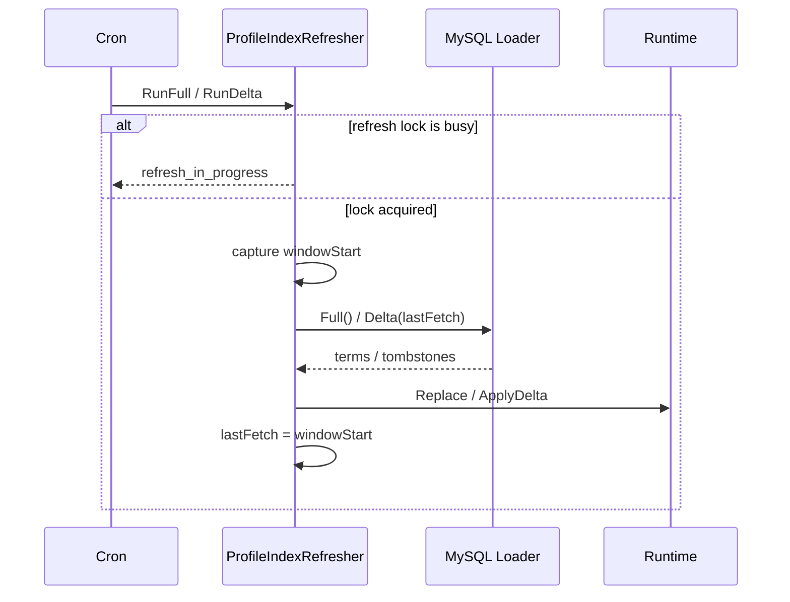

# 关键链路：索引刷新 Full / Delta

> 状态：已实现 · 已与 `ProfileIndexRefresher`、MySQL Loader、search Runtime/Store、container 和并发测试核对。

## 1. 结论

Suggest 索引只存在于进程内，不写入文件。启动时先执行 Full refresh，成功后才启动 Cron。Full 与 Delta 共用一把非阻塞刷新锁：任务重叠时后到任务返回 `refresh_in_progress` 并立即结束，
不堆积刷新 goroutine。

```text
Full:  windowStart -> MySQL Full -> Runtime.Replace -> lastFetch=windowStart
Delta: lastFetch -> windowStart -> MySQL Delta(since) -> Runtime.ApplyDelta -> lastFetch=windowStart
```

查询窗口在访问 Loader 之前捕获。这样查询期间发生的变更最晚会在下一次 Delta 中被重复读取，不会因为“查询结束后才取 now”而被游标跳过。

## 2. 刷新顺序



Full 使用新 Store 原子替换当前指针；构建期间查询继续读取旧 Store。Delta 在当前 Store 的互斥区内撤销旧键，再导入 upsert 或删除 tombstone。

两种更新的原子性不同：Full 是“构建新快照后换指针”，查询要么看到完整旧 Store、要么看到完整新 Store；Delta 是“在现有 Store 的写锁中逐项修改”，同一进程的查询不会看到某个 Profile 已删旧 name
key 却尚未写新 key 的中间状态。Delta 不是跨 Profile 的数据库事务，但 Store 写锁使一次 ImportTerms 对并发查询整体不可见。

## 3. 游标不变量

- `lastFetch` 只在刷新锁内读写。
- Full 成功后将游标设为 Full 查询开始时间。
- Delta 成功后将游标设为 Delta 查询开始时间。
- 空 Delta 也是成功，会推进游标。
- Loader 或 Runtime 更新失败时不推进游标。
- 首次 Full 尚未成功时，Delta 直接结束。

默认 Full/Delta 共用同一 eligibility：Profile 未软删除，至少一个 ProfileLink 未删除且 `revoked_at IS NULL`，关联 User 未软删除。Delta 的 affected set
覆盖 Profile、ProfileLink 和 User 的更新/删除；每个 affected Profile 都重新计算，仍有效时输出完整 upsert，最后一个有效关系失效时输出 `DisplayName` 为空的
tombstone。自定义 `full_sql/delta_sql` 必须承担相同 active-link、active-user 与 tombstone 协议。

## 4. 为什么游标保存查询开始时间

假设上一次成功游标为 `t0`，本次查询在 `t1` 开始、`t2` 结束：

```text
t0 -------- t1 -------- change X -------- t2
```

如果成功后保存 `lastFetch=t2`，而数据库快照没有读到发生在查询末尾的 X，下一轮会从 t2 之后查询，X 可能永久丢失。当前保存 t1，下一轮仍会扫描 `(t1, nextStart]`，X 至少再有一次机会被读取。

代价是边界重叠与重复项。Store 的 upsert/remove 必须幂等：同一 Profile 重复出现时先撤销旧 keys，再写完整 term；同一 tombstone 重复出现也只会保持不存在。

当前 SQL 使用 `>`，如果数据库时间精度不足、两个变更恰好等于 watermark，理论上仍可能存在边界风险。更强方案是使用数据库递增 change sequence、outbox offset，或
`(updated_at, primary_key)` 复合游标，而不是只依赖应用时钟。

## 5. affected set 与重新计算

Delta 不是简单执行：

```sql
SELECT * FROM profiles WHERE updated_at > ?
```

因为索引项同时依赖 Profile、ProfileLink 和 User。默认 SQL 先用 CTE 收集 affected ProfileID：

- Profile 自身更新/软删除；
- ProfileLink 更新、软删除、revoke；
- 关联 User 更新/软删除。

然后对每个 affected Profile 重新执行完整 eligibility 与聚合，输出新的 DisplayName、mobiles、owner 和 weight。这样手机号变化、关系撤销和用户删除都会改写同一个派生 term。

为什么要“重新计算完整 term”而不是发送字段 patch：Store 同时维护 `terms`、Trie keys、Hash keys 和 `profileKeys` 反向索引。局部 patch 很容易漏删旧手机号/拼音 key；完整
replacement 可以统一执行 remove-old-keys + import-new-keys。

## 6. tombstone 协议

Delta 在 MySQL adapter 边界将空 `name` 转为显式 `ProfileIndexDelete`；domain/application/runtime 不再解释 `DisplayName == ""`。

## 7. Full 与 Delta 的取舍

| 维度 | Full | Delta |
| --- | --- | --- |
| 正确性恢复 | 能清除任意历史漂移 | 依赖 affected/tombstone 完整 |
| 数据库开销 | 扫描全部 eligible facts | 扫描变更窗口和 affected 重算 |
| 内存切换 | 新建 Store 后原子替换 | 原 Store 写锁内修改 |
| 故障恢复 | 失败保留旧 Store | 失败保留旧 Store 和游标 |
| 适用频率 | 低频校准、启动预热 | 高频新鲜度维护 |

当前同时保留 Full 和可选 Delta：Delta 缩短新鲜度，周期 Full 充当反熵校准。若自定义 SQL 无法可靠产生 tombstone，宁可关闭 Delta 并提高 Full 频率，也不要接受难以观测的长期错误索引。

## 8. 敏感数据边界

Loader 与内存索引可以包含原始手机号，用于授权后的手机号搜索；响应仍只返回脱敏值。刷新数据不得写盘或写入日志。

从旧版本升级时，必须在所有旧实例退出后精确删除旧数据目录中的遗留 `snapshot.txt`，不得递归删除整个目录，也不得为该遗留文件制作新备份。

## 9. 并发、调度与关闭

Full 与 Delta 共用 `sync.Mutex.TryLock`，重叠任务不等待。这样避免 Cron 周期短于刷新耗时后堆积 goroutine，也避免多个任务以不同 watermark 交错写 Store。

模块启动顺序：

```text
construct loader/runtime/refresher
  -> synchronous initial Full
  -> register Full cron
  -> optional Delta cron
  -> cron.Start
```

首次 Full 未成功时不会对外宣称健康。`required=false` 的启动失败会改用 DegradedService；这时后续不会保留一个后台任务自动恢复，恢复通常需要修复依赖并重启模块/进程。

Cleanup 先 cancel refresh context，再等待 cron stop。具体 SQL 是否能及时停止取决于 GORM/driver 对 context 取消的支持；关闭期间不应启动新的长 Full。

## 10. 失败策略

| 场景 | 行为 |
| --- | --- |
| Full 查询失败 | 保留旧 Runtime；启动阶段按 `required` 决定失败或降级 |
| Delta 查询失败 | 保留旧 Runtime 和旧游标 |
| Runtime 更新失败 | 保留旧游标 |
| 刷新任务重叠 | 后到任务跳过并记录非错误状态 |
| 后续 Cron 失败 | 记录不含候选数据的错误，继续使用当前索引 |

“继续使用旧索引”是可用性选择，不是无风险降级。旧数据可能包含已经 revoke 的 ProfileLink；详情接口必须重新授权，且运维应对 index age/refresh failure 告警。当前 health
只知道是否至少成功过一次，尚不能执行基于 age SLA 的自动摘流。

## 11. 自定义 SQL 契约清单

自定义 FullSQL/DeltaSQL 至少返回列：

```text
id, name, org_id, mobiles, owner_operator_ids, weight
```

并保证：

1. Full 与 Delta 的 eligibility 一致；
2. mobiles/owner IDs 使用 Loader 能解析的逗号格式；
3. Delta 参数数量符合实现：自定义 SQL 当前传入两个 `since`；
4. 每个 upsert 是完整 term；
5. 失效对象产生空 name tombstone；
6. 不把敏感字段拼入日志；
7. 查询计划和索引能承受 Cron 频率；
8. 时区和时间精度与应用 watermark 一致。

## 12. 事实源与验证

| 内容 | 路径 |
| --- | --- |
| Refresher、锁和游标 | `internal/apiserver/application/suggest/refresher.go` |
| MySQL Loader | `internal/apiserver/infra/mysql/suggest/loader.go` |
| Runtime / Store | `internal/apiserver/infra/suggest/search` |
| Cron 装配 | `internal/apiserver/container/suggest/module.go` |
| 配置 | `configs/apiserver.dev.yaml`、`configs/apiserver.prod.yaml` |

```bash
go test -race ./internal/apiserver/application/suggest/... \
  ./internal/apiserver/infra/suggest/... \
  ./internal/apiserver/container/suggest
```
