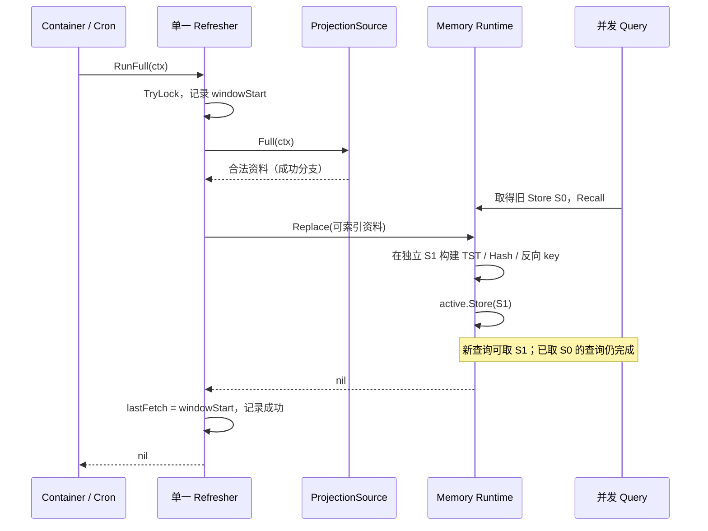
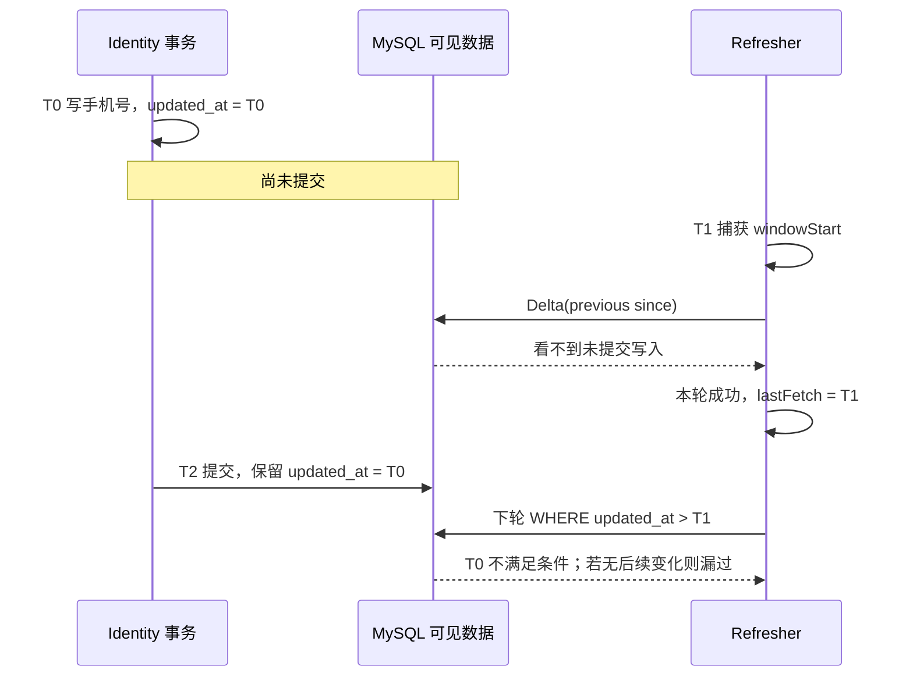

# Suggest 索引刷新：Full / Delta 的提交、游标与恢复边界

> 状态：已实现 · 按标准 MySQL Loader、单一 Refresher、内存 Runtime 和 container 核对。文中的交错情境为源码条件推演，未作为真实 MySQL 或生产复现；演进方案均为候选。

## 1. 设计结论：能重建，不等于所有变化都能及时到达

Suggest 从 Identity 的 profiles、profile_links、users 派生进程内索引。Full 建立完整基线；Delta 用时间条件找出受影响 Profile，再重新投影。当前没有 Identity 事件/CDC 消费、持久索引 snapshot、共享 generation 或提交水位。

| 当前保证 | 适用边界 |
| --- | --- |
| Full 构建新 Store 后一次换指针 | 查询不会读到半构建 Store；已取旧 Store 的查询仍可完成 |
| Delta 一批变更持同一 Store 写锁 | Recall 不见半批键集合；锁不是事务回滚或乱序保护 |
| Full/Delta 不重叠执行 | 同一个 Refresher；不协调其它 writer、其它实例 |
| 普通 source/writer 错误不推进游标 | Full、非空 Delta 等待 writer；空 Delta 在 source 成功后直接推进 |
| 下次 Cron 可重试返回普通 error 的任务 | scheduler 已启动且进程仍存活；panic、启动降级和持续坏行另有边界 |
| 成功 Full 可校正旧索引 | 不保证 Full 总能成功，也没有自动有界新鲜度承诺 |

因此接入方需要接受“每实例最终同步的读投影”，同时明确时间/删除传播前提。不能以刷新 success、health 通过或测试名称，推导索引已完整追平源提交。

本篇维护刷新时序、物理变更与运行恢复；字段/号码、Scope 和候选预算见[模型主文](01-模型与应用端口.md)，公开请求与空结果见[查询链路](03-关键链路-SuggestProfile查询.md)。

## 2. 来源资格：哪些事实进入索引，哪些变化能被发现

### 2.1 默认 Full 与 Delta 的资料条件

标准 Loader 的有效资料同时满足：Profile 未软删除；存在未软删除、未撤销的 ProfileLink；关联 User 未软删除。它不检查 User.Status=active，也不按 Link.Type/Relation 筛选；创建人可见性与 AuthN 准入不由这些 JOIN 证明。

ID/Name 来自 Profile；手机号来自合格关联 User 的 `GROUP_CONCAT(DISTINCT phone)`；owner 来自 created_by；Weight=1；OrgID 来自配置占位。聚合没有显式手机号排序，不能保证稳定“主号码”。真正的组织来源、自定义资格及号码表示必须由投影合同明确，详见[字段来源](01-模型与应用端口.md)。

### 2.2 affected set 的三个入口

默认 Delta 的所有时间条件均为严格 `> since`：

| 入口 | 检查列 | 重算什么 |
| --- | --- | --- |
| Profile | updated_at / deleted_at | 该 Profile 的完整投影 |
| ProfileLink | updated_at / deleted_at / revoked_at | 该行当前 profile_id |
| User 经仍存在的 ProfileLink | User.updated_at / deleted_at | 该 User 关联的所有 Profile |

User 的 affected JOIN 不预先排除已撤销/软删除的 Link，目的是保留影响 ProfileID 的查找入口；之后 eligible 子查询才重新判定资格。若一个 User 改号并关联三个 Profile，正常可将三个资料都重新聚合，而不是只 patch 一个手机号。当前 SQL 不读取实体 version，也不输出变更前后版本。

### 2.3 删除和关系变化必须留下可定位事实

| 来源情境 | 默认 Delta 可表达 | 需要的前提 |
| --- | --- | --- |
| 最后一条合格 Link 撤销/软删，或 User 软删使最后一条合格关联失效 | 正 ProfileID 的 Delete | 行保留，变化列满足时间条件 |
| 一条 Link 失效、仍有其他合格关联 | 完整 Upsert，重算手机号集合 | 只移除不再由任何合格关联贡献的号码，而非局部 patch |
| Link 恢复或新增 | 完整 Upsert | 更新时点可被 affected 捕获 |
| Profile 被物理删除 | 不能仅靠默认 tombstone 分支定位已消失的 Profile 行 | tombstone 最后仍从 profiles JOIN affected |
| Link/User 被物理删除 | 对应影响入口可能消失 | 没有另外可检测写入时，旧资料/手机号可保留到成功 Full |
| 关系移动到另一个 Profile | 当前行只能给出新的 profile_id | 还需记录旧端，或显式触碰旧 Profile |

后三项适用于维护直写或未来 writer，不能写成当前公开 Revoke 的行为；当前三类 Identity 仓储接口没有公开 Delete，Revoke 保留关系行。成功 Full 可按现存事实移除这些旧项；若 Full 失败或 scheduler 停止，就没有这层修复。

来源：[默认 SQL 与映射](../../../internal/apiserver/infra/mysql/suggest/loader.go)、[Identity 仓储合同](../../../internal/apiserver/domain/identity/profilelink/repository.go)、[关系写入](../../../internal/apiserver/infra/mysql/profilelink/repo.go)。

## 3. Full：读取、构建、发布是三个阶段

### 3.1 时序与查询可见性

```mermaid
sequenceDiagram
    participant C as Container / Cron
    participant R as 单一 Refresher
    participant L as ProjectionSource
    participant M as Memory Runtime
    participant Q as 并发 Query
    C->>R: RunFull(ctx)
    R->>R: TryLock，记录 windowStart
    R->>L: Full(ctx)
    L-->>R: 合法资料（成功分支）
    Q->>M: 取得旧 Store S0，Recall
    R->>M: Replace(可索引资料)
    M->>M: 在独立 S1 构建 TST / Hash / 反向 key
    M->>M: active.Store(S1)
    Note over M,Q: 新查询可取 S1；已取 S0 的查询仍完成
    M-->>R: nil
    R->>R: lastFetch = windowStart，记录成功
    R-->>C: nil
```

标准 Runtime 不清空正在使用的 Store，而是先 Load 新对象，再切换 `atomic.Value` 指针。Recall 在已取得 Store 上持读锁；选择/披露使用召回出的资料。指针切换避免半构建状态，却不使发布后的 Store 永久不可变：后续 Delta 原地修改当前 Store。

构建时可能同时驻留旧 Store、新 Store、SQL 行与资料集合；旧查询持引用期间旧对象不能回收。当前没有流式建索引、内存容量预检或持久恢复。全量任务的成本还会让同一 Refresher 的 Delta 被跳过，需结合数据量、构建耗时和进程内存实测，不能仅凭“换指针很快”推导全流程便宜。

### 3.2 坏行、空集合与成功含义

标准 Loader Full 逐行通过 `profile.New`；非正 ID 或 trim 后空名称使整批返回 `map full suggest profile <id>` 错误，没有安装新 Store，也不推进游标。号码、Org、owner 等仍只有最小清洗，字段可构造不等于来源完整。

通用 Refresher 还有防御过滤：自定义 source 返回的零值资料会被跳过；过滤后为空仍可调用 Replace，成功安装空索引并记录成功。正常空 Full 也会移除所有旧项。没有“空数据即不就绪”的规则。

Full 的 success 表示 source 返回、标准映射/防御过滤完成、writer 返回成功。它不是资料数量正确或业务数据新鲜的证明；标准 MySQL 坏行拒绝不能推广为所有自定义 source 都 fail-closed。

## 4. Delta：完整重算、旧键撤销和重放取舍

### 4.1 行协议与物理动作

| 重算/行状态 | Loader 输出 | 语义 |
| --- | --- | --- |
| 正 ID + trim 非空名称 | 构造资料后 Upsert | 替换该 Profile 的完整搜索资料 |
| 正 ID + trim 后空名称 | Delete | MySQL 行协议中的 tombstone |
| ID 非正 | 整批 error | 无法定位变更对象 |

SQL eligibility 不校验名称。Identity 可保存非空的空白名称 `"   "`：Full 构造失败，Delta 却将它解释成 Delete，并可能成功推进游标；Identity 事实并未删除。这个差异说明空 name 同时承担数据与动作编码，不能写成“所有非法 Delta 行均失败”。候选显式动作字段需兼容旧自定义 SQL 和坏行政策，详见[模型交接](01-模型与应用端口.md)。

### 4.2 Apply 对索引做什么

Store 整批持写锁：Upsert 先按反向 key 记录撤销旧姓名/拼音/缩写、ID/mobile keys，再导入新资料；Delete 移除这些 keys、Profile map 和反向记录。重复 Delete 无旧项时继续成功。仅更新 Profile map 会让旧名称/手机号仍命中，所以撤键是物理投影责任。

标准 Runtime 的常规 error 发生在 nil/未初始化前置检查；进入 ApplyChanges 后没有逐项 error 或 rollback。写锁使标准 Recall 不看见中途状态，但不提供 panic 后回滚，也不替任意自定义 writer 保证“失败完全未写入”。零值 ProjectionChange 被 Store 忽略，非空批次仍可能成功推进。

### 4.3 重放不保证顺序无关或候选结果不变

当前没有 projection revision。旧 Upsert 在新资料之后应用会回退字段；Delete 后应用旧 Upsert 会恢复资料。重复同内容 Upsert 可清理旧键并重建同一资料，却会改变 Hash 桶内顺序。

例如两个 Profile 共用裸数字手机号，桶为 `[1,2]`，CandidateBudget=1。重放内容完全相同的 Upsert(1) 会先撤出 1，再追加为 `[2,1]`，召回从 1 变成 2。该情境为源码推演，说明“重复读由幂等吸收”只能限于条目/键残留，不能承诺有界查询结果不变。

稳定候选顺序与旧投影覆盖保护是两个合同：前者需要确定的桶/候选排序；后者需要 source revision、条件写和版本化 tombstone。只增加互斥锁不能识别旧资料，单纯扩大预算也不能证明结果稳定。查询取舍见[预算内选择](01-模型与应用端口.md)。

来源：[Runtime](../../../internal/apiserver/infra/suggest/index/memory/runtime.go)、[Store](../../../internal/apiserver/infra/suggest/index/memory/store.go)、[Hash](../../../internal/apiserver/infra/suggest/index/memory/hash.go)。

## 5. 游标：查询开始时间减少窗口，不是提交水位

### 5.1 推进规则

| 分支 | 调用 source/writer | 游标与成功时间 |
| --- | --- | --- |
| 首次 Full 之前 RunDelta | 都不调用 | no-op，不记本次成功/耗时 |
| 成功 Full | Full → Replace，即使空集合 | lastFetch=windowStart |
| 成功非空 Delta | Delta(previous lastFetch) → Apply | lastFetch=windowStart |
| 成功空 Delta | 仅 Delta；不检查或调用 writer | lastFetch=windowStart |
| source / writer 返回 error | 失败阶段之前可能已执行 | 不推进；既有“曾成功”状态保留 |

windowStart 在本次 source 查询前捕获；成功时间另由实际 `time.Now().UTC()` 记录。它们不是同一个水位。默认 SQL 没有 `<= windowStart` 上界，可能读取查询开始后已可见的变化，后续再读；这是当前重复重算的来源之一。

取开始时间比取结束时间少跨过查询期间的变化，但仍依赖各 writer 时钟、时间精度和提交可见性。Identity 三类 PO 在写入前使用应用 `time.Now()`，不是提交时分配的可靠序号。

### 5.2 晚提交：没有上界也不能消除这个窗口

```mermaid
sequenceDiagram
    participant T as Identity 事务
    participant D as MySQL 可见数据
    participant R as Refresher
    T->>T: T0 写手机号，updated_at = T0
    Note over T,D: 尚未提交
    R->>R: T1 捕获 windowStart
    R->>D: Delta(previous since)
    D-->>R: 看不到未提交写入
    R->>R: 本轮成功，lastFetch = T1
    T->>D: T2 提交，保留 updated_at = T0
    R->>D: 下轮 WHERE updated_at > T1
    D-->>R: T0 不满足条件；若无后续变化则漏过
```

T0<T1<T2 时，Delta 或 Full 的查询可读不到在途事务，随后推进到 T1。该事务在 T2 才可见，但更新时间仍是 T0；没有其他可检测变化或成功 Full 时，后续 Delta 可持续漏过。这是条件源码推论，未做真实 MySQL 长事务专项。

### 5.3 精度：迁移中的秒级时间列与带小数的游标不同

[初始迁移](../../../internal/pkg/migration/migrations/000001_init_schema.up.sql)的三表 updated_at/deleted_at、关系 revoked_at 使用无 fsp 的 DATETIME；相关重建迁移也保留该声明。目标数据库的实际 schema、量化方式和会话配置仍需现场核验，不能由迁移文件推断已部署状态。

具体前提：windowStart=12:00:00.100，查询快照建立后在 .200 写入，最终数据库时间值为 12:00:00。下轮严格 `> 12:00:00.100` 不会选中这次变化。SQLite 当前 fixture 不执行 MySQL DATETIME 精度处理，测试绿不能排除该窗口。跨实例写入时钟偏差也需放入同一游标合同。

### 5.4 演进需选完整合同

| 候选 | 能改善什么 | 仍需承担的成本/边界 |
| --- | --- | --- |
| 提高时间精度 + 有界回看 | 减少同秒量化、短暂晚提交/时钟偏差漏读 | 定义事务/时钟上界；重复聚合与撤键；不覆盖任意晚提交和已消失 ID |
| 保留 tombstone / 旧新受影响 ProfileID | 支持硬删/关系移动传播 | 所有 writer/维护导入遵守；保留期覆盖消费者落后 |
| 同事务变更账本/outbox 或提交有序 CDC | 提供可重放变化来源 | 写入覆盖、逐实例消费/ACK/保留、重启基线与Full衔接；自增ID不天然等于提交顺序 |
| 周期 Full 对账 | 校正多种漏项、删除与投影规则变化 | 必须持续成功；全量内存/DB成本；需要可接受的陈旧窗口 |

这些不是本轮实施计划。当前没有上述账本消费或重叠回看；提高 Cron 频率不能单独证明无漏更。Identity 共享提交与消费边界见[协作主文](../01-Identity/04-模块边界-Identity与AuthN-AuthZ-Suggest.md)。

## 6. 调度、并发与失败：区分拒绝调用、旧状态和外部 writer

同一 Refresher 使用非阻塞 TryLock；后到任务记 refresh_in_progress 并返回，不排队、不自动补跑。被拒绝的调用没有写入，先到任务仍可能更新 Store/游标，不能把全局状态写成“不变”。每实例独立刷新，没有跨进程互斥或共同 generation。

标准装配只有一个 Runtime/Refresher。若未来绕过它直接调用 writer，或多个 Refresher 共享 Runtime：Apply 可以先取得 S0，Replace 随后发布 S1，Apply 再修改脱离 active 的 S0并返回成功。原子指针没有解决这个写者竞争。候选可约束唯一 owner，或从 source→publish 建立代次协调；仅把发布写锁串行化仍不能判断哪次读到的资料更新。

| 失败/分支 | 当前标准 Runtime 与 Refresher | 不能扩大为 |
| --- | --- | --- |
| Full/Delta source 或标准映射 error | 不调用 writer，保留此前 Store与游标 | 任意坏字段都已拒绝 |
| Full Replace / Delta Apply 前置 error | 不推进游标/成功时间 | 任意自定义 writer 无部分提交 |
| 空 Delta | Store不写，推进游标/成功时间 | writer 健康或源完整性证明 |
| 后续 Cron 返回普通 error | callback记录日志，等下次已启动的Cron | 自动降级、自愈、立即重试 |
| 同实例重叠 | 后到调用跳过 | 先到调用不变或跨实例单writer |
| 数据已读完后ctx取消 | 内存writer仍可能成功发布并推进 | 取消即停止发布或回滚 |
| 任务panic | 无本模块Recover合同 | 只要失败就能等下次Cron |

Loader 使用 DB.WithContext，Refresher/Runtime 不主动检查 ctx.Err。锁定的 robfig/cron v3.0.1 中默认 NewChain 没有 Recover wrapper；模块直接 cron.New，也未增加 Recover。这里限定源码允许的 panic 传播，不声称目标环境已发生故障。候选发布前取消、超时和 Recover 还需定义“已修改多少资料”及告警，不能仅吞错误。

## 7. 启动、健康、关闭与自定义来源的验收

### 7.1 初始化完成不等于查询、调度和新鲜度都可用

模块顺序：检查 enable/DB/production掩码 → 组装查询/刷新 → 同步 Full → 登记 Full Cron → 可选登记 Delta Cron → Start。options转换将空 Full Cron补为 `@every 1h`；直接传 ModuleConfig不经过该转换。Delta Cron空意味着不调度增量，但 Loader的空 delta_sql仍选择默认SQL。

| 场景 | 模块结果 | 后续状态 |
| --- | --- | --- |
| enable=false | 不初始化 | 标准容器不保存查询模块 |
| DB缺失或production关闭掩码 | 返回error，不进入required降级分支 | 进程是否继续由外围运行模式决定 |
| 首次Full/调度失败，required=true | 返回error | 标准容器不保存该模块 |
| 同阶段失败，required=false | 安装DegradedQuerier、返回nil | 没有已启动Cron，不在同进程自动恢复 |
| 全部成功 | 正常Querier + 已启动Cron | 后续普通error保留索引；health不检查age |

典型情境：首次 Full成功、Full Cron合法，但Delta Cron表达式无效。索引、游标、full success和index_terms都已更新；整个Cron尚未Start，所以两种刷新都不运行。optional分支换成空查询，模块仍可被登记Available，而 CheckHealth可能通过。指标绿、模块可用与请求空数组可以同时成立。

CheckHealth只看启用模块有Querier且Refresher“曾成功”；空Full可通过，后续连续失败不清此标志。readiness另将 Suggest.Required作为组件必需性：optional错误可整体ready并标degraded（其他必需项通过时），required错误可使not_ready。普通不允许degraded的进程模式还会阻断初始化错误；模块required不是启动的唯一决策。路由仍受JWT、可选search和限流，降级不意味着任何请求都200空。

候选先验证所有调度表达式、分别表达query/loaded/scheduler/freshness状态，能减少上述矛盾。若保留已加载数据继续查询，还须定义最大索引age与超时后的行为，而不是仅增加一个health布尔值。来源：[模块](../../../internal/apiserver/container/suggest/module.go)、[readiness装配](../../../internal/apiserver/container/readiness.go)、[进程启动](../../../internal/apiserver/process/bootstrap.go)。

### 7.2 Cleanup等待任务，不保证取消后零发布

模块初始化为首次Full和Cron创建 background context，没有调用方初始化deadline。Cleanup先cancel，再Cron.Stop并等待运行任务结束，无自己的超时。查询已返回后取消不妨碍当前内存writer完成；关闭过程中仍可能发布Store并记success。

进程关闭先等Suggest cleanup，之后才进行后续Identity、DB和HTTP/gRPC关闭。若某任务无法退出，等待可阻挡后续清理。候选带超时的关闭必须同时决定在途任务仍借用DB时如何处理，不能超时即关闭连接池。完整关闭责任由[运行时主文](../../01-运行时/03-后台任务就绪与优雅关闭.md)维护。

### 7.3 指标不是删除账本或同步证明

| 指标 | 当前口径/例外 |
| --- | --- |
| `iam_suggest_refresh_duration_seconds` | Full/有基线Delta的实际尝试；重叠与首次Full前Delta不计 |
| `iam_suggest_refresh_total` | kind + success/failed/refresh_in_progress；不记录独立Cron注册失败 |
| `iam_suggest_refresh_items_total` | Delta物理命令数；Full upsert为过滤后输入数量、tombstone为过滤掉的输入数量 |
| `iam_suggest_last_success_timestamp_seconds` | 按kind记录局部成功，包括空Delta；不是提交水位 |
| `iam_suggest_index_terms` | Runtime中的Profile数，不是TST/Hash key数或完整源数量 |

旧Store有两项、Full返回空集合时，实际两项消失，Full却计upsert=0/tombstone=0。重复Delete仍可计多条Delta命令。调度初始化失败不会撤回Full成功指标；这些值只能与Querier类型、scheduler活性、索引age和业务对账共同解释。来源：[刷新计数](../../../internal/apiserver/application/suggest/refreshindex/refresher.go)、[指标](../../../internal/apiserver/infra/suggest/metrics/metrics.go)。

### 7.4 自定义SQL/adapter必须作为一套投影合同验收

FullSQL与DeltaSQL分别独立补默认，不自动证明等价。只定制Full以筛active User或提供真实Org/owner，却保留默认Delta，会在后续Upsert重新引入/覆盖Full语义。没有可靠tombstone时，可先关闭Delta Cron并接受周期Full窗口，不能只留空delta_sql期望停用增量。

Full返回 `id, name, org_id, mobiles, owner_operator_ids, weight`；mobiles与owner_operator_ids使用CSV。Delta还接收两个相同since参数，eligible输出完整资料、不再eligible输出正ID/空name，并覆盖全部来源变化。内建Delta使用七个since，这是内部实现。Raw Scan未校验缺失列、资格等价或SQL只读；无法解析owner项被忽略，Org/Weight可落零值。

替换adapter还需确定重复ID/行顺序、号码表示、旧新关系端点、source revision、部分写失败和重放/取消政策。建议分别以独立入口情境验收：仅User时间跨游标的多Profile改号、最后/非最后Link撤销与恢复、User软删、维护硬删、边界精度/晚提交、Full与Delta规则变化、失败后重放；这是一组候选验收需求，本轮未新增实现或测试。

### 7.5 现有测试覆盖与空白

| 已有证据 | 支持范围 | 不支持的扩展结论 |
| --- | --- | --- |
| [Refresher测试](../../../internal/apiserver/application/suggest/refreshindex/refresher_test.go) | 替身游标、空Delta、同实例互斥、计数、前置writer/error分支 | 部分写回滚、晚提交、取消后发布或真实数据库 |
| [Runtime/Store测试](../../../internal/apiserver/infra/suggest/index/memory) | 单线程替换/增量、未初始化、旧键撤销和重复Delete | writer竞争、乱序投影、同内容重放后的预算稳定 |
| [Loader测试](../../../internal/apiserver/infra/mysql/suggest) | SQL字符串护栏；SQLite精简表的映射、Delete、改号Upsert、坏ID/名称 | 实际迁移、MySQL时间精度/聚合和Full-Delta全体等价 |
| [模块测试](../../../internal/apiserver/container/suggest) | 配置转换、enable/DB/掩码检查、基本health | Full成功后Cron失败、连续失败、Cleanup在途或真实可查 |
| [指标测试](../../../internal/apiserver/infra/suggest/metrics/recorder_test.go) | recorder计数/标签映射 | scheduler活性、新鲜度或数据完整性 |

两个SQLite变更测试的seed时间本来就晚于since，因此未改动的Profile/Link也能进入affected；它们支持最终Delete/改号Upsert结果，不能独立证明User.updated_at fan-out或deleted_at入口。名为FullDeltaEquivalence的测试只跑Full→memory→Select。模块development测试fixture缺revoked_at且optional允许降级，IsInitialized通过不证明Full/Cron成功。

验证必须按测试体解释，再分别取真实数据库、运行配置、新鲜度和业务可见性的证据。聚焦命令与修改地图见[代码索引](04-模块边界与代码索引.md)；本篇没有把文档校准变成投影修复或生产操作。
