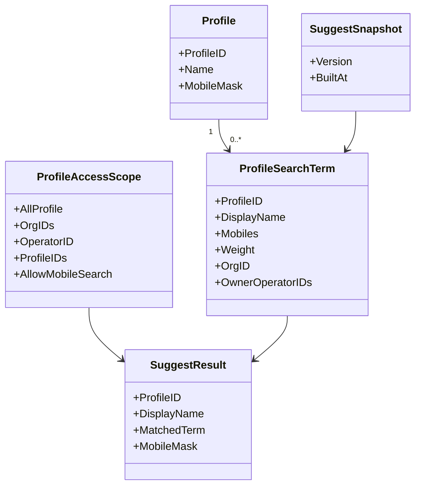

# Suggest 领域模型图

> 状态：待补证据 · 骨架初稿，待与代码/契约核对。

```mermaid
classDiagram
    class Profile {
        +ProfileID
        +Name
        +MobileMask
    }
    class ProfileSearchTerm {
        +ProfileID
        +DisplayName
        +Mobiles
        +Weight
        +OrgID
        +OwnerOperatorIDs
    }
    class ProfileAccessScope {
        +AllProfile
        +OrgIDs
        +OperatorID
        +ProfileIDs
        +AllowMobileSearch
    }
    class SuggestSnapshot {
        +Version
        +BuiltAt
    }
    class SuggestResult {
        +ProfileID
        +DisplayName
        +MatchedTerm
        +MobileMask
    }
    Profile "1" --> "0..*" ProfileSearchTerm
    SuggestSnapshot --> ProfileSearchTerm
    ProfileAccessScope --> SuggestResult
    ProfileSearchTerm --> SuggestResult
```
