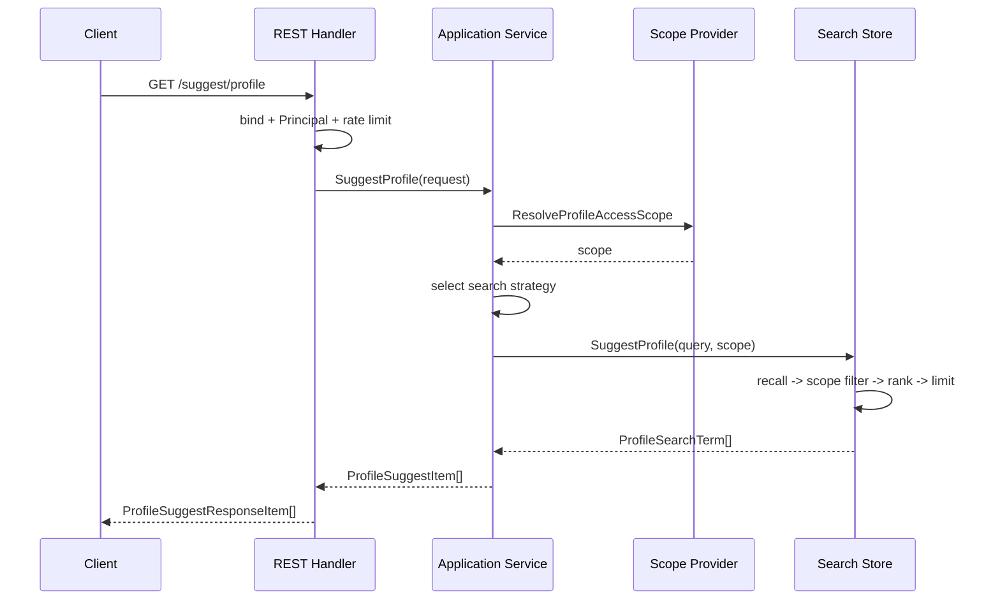

# 关键链路：SuggestProfile 查询与安全策略

> 状态：已实现 · 已与 REST handler、Principal 映射、application service/策略链、scope provider、Store、限流器、DTO、OpenAPI 和测试核对。

## 1. 30 秒结论

SuggestProfile 当前只有一个 REST 入口：

```text
GET /api/v2/suggest/profile?k=<keyword>&limit=<n>
```

请求先经过认证 middleware 和按 operator 限流，再进入 application：

```text
JWT context
  -> OperatingPrincipal
  -> ProfileAccessScope
  -> mobile_denied / numeric_exact / prefix_text
  -> Store 召回
  -> scope 过滤
  -> 排序和 limit
  -> MobileMask
  -> REST DTO
```

手机号安全的当前边界是：手机号形态关键词需要额外权限，输出默认脱敏；但索引和文件 snapshot 仍保存原始手机号，Redis 限流异常会 fail-open，也没有独立审计存储。

## 2. 请求与响应

| 输入 | 当前行为 |
| --- | --- |
| `k` | 必填；trim 后为空则返回空列表 |
| `limit` | 小于等于 0 或超过配置上限时使用 `MaxResults` |
| Bearer Token | middleware 注入 user、tenant domain 和业务 org 上下文 |

REST 返回项：

```json
{
  "id": "123",
  "name": "张三",
  "mobile_mask": "138****8000",
  "weight": 1
}
```

当前没有 Suggest gRPC 或 SDK 接口。

## 3. 查询时序



## 4. Principal 和可见范围

REST 从请求上下文构造：

```text
OperatorID   <- authenticated user ID
TenantDomain <- JWT tenant domain
OrgID        <- business org ID
```

`OperatingProfileAccessScopeProvider` 再组合角色、手机号搜索权限和可见 ProfileID：

| 主体 | 当前 scope |
| --- | --- |
| `IsSuperAdmin` 或平台管理员角色 | `AllProfile=true`，允许手机号搜索 |
| tenant_admin / super_admin | 合并 Principal 的业务 OrgID 范围 |
| 普通操作员 | OperatorID + 可选 OrgIDs + visibility resolver 返回的 ProfileIDs |
| AuthZ runtime 不可用（nil） | 不报错；退化到 OperatorID/OrgIDs/visibility |

手机号权限通过以下资源动作判断：

```text
resource = iam:identity:collection:profiles
action   = search_by_mobile
```

当前 visibility resolver 按 `profiles.created_by = OperatorID` 查询，是过渡读模型。Store 对候选执行本地 `ScopePolicy`，不会逐候选调用 AuthZ Check。

## 5. 搜索策略

application 按顺序选择第一个支持当前关键词的策略：

| 策略 | 条件 | 结果 |
| --- | --- | --- |
| `mobile_denied` | 7–15 位纯数字且 `AllowMobileSearch=false` | 返回空列表 |
| `numeric_exact` | 其他纯数字，或已允许的手机号形态 | Hash 精确匹配 Profile ID / 手机号 |
| `prefix_text` | 非纯数字 | Trie 匹配展示名、全拼和拼音首字母 |

手机号无权限当前不是显式 `403`，而是成功响应空列表。普通数字可能被当作 Profile ID 查询。

## 6. 过滤、排序与截断

`Store.SuggestProfile` 的实际顺序：

1. Hash 或 Trie 召回，最多取 `InternalLimit`；
2. 把 scope 编译为集合；
3. 过滤不可见候选；
4. 按 Weight、匹配类型、展示名前缀和 ProfileID 排序；
5. 截断到 `Limit`。

这保证无权限候选不会占用最终返回名额，也不会通过结果 DTO 暴露。

## 7. 手机号脱敏

application 用 `MaskMobiles` 处理第一个手机号：

```text
13800138000 -> 138****8000
长度不足 7 -> 空字符串
```

`disable_mobile_mask=true` 会输出第一个原始手机号，但 container 在 production 模式直接拒绝这种配置。

需要区分两个事实：

- 对外结果默认只有 `mobile_mask`；
- 内存 SearchTerm、Hash key 和 MySQL Loader 结果仍含原始手机号，但不会写入文件。

## 8. 限流

限流发生在 REST handler，早于 scope 解析和索引查询。

| backend | 当前语义 |
| --- | --- |
| memory | 单进程、按 operator 的令牌桶，普通和手机号形态分桶 |
| redis | 多副本共享约 1 秒固定窗口，普通和手机号形态分 key |

`PerOperatorQPS<=0` 表示关闭限流。Redis backend 没有 client 时退回 memory；Redis 执行异常时记录 warn 并允许请求。

所以 Redis 限流是 fail-open，不应被描述成强安全边界。

## 9. 日志与指标

手机号形态查询会记录 operator、tenant domain、是否允许和关键词长度，不记录关键词原文。

当前 Prometheus 信号包括：

- 查询次数和策略；
- 手机号形态查询数；
- 返回条数；
- scope 过滤前后候选数；
- 限流拒绝数；
- 当前索引条数和刷新耗时。

当前没有独立、持久化的 Suggest 审计记录；日志和指标不能替代审计系统。

## 10. 失败语义

| 场景 | 当前行为 |
| --- | --- |
| 参数绑定失败 | `400` |
| Principal 缺失或无效 | `401` |
| REST rate limit 拒绝 | `429` |
| scope provider 返回错误 | 进入统一错误映射 |
| 手机号搜索无权限 | `200` + 空列表 |
| runtime/index 不可用 | `200` + 空列表 |
| Suggest 降级服务 | `200` + 空列表 |

空结果可能表示无匹配、无权限、索引不可用或降级，当前响应没有区分原因；排障需结合日志、模块状态和指标。

## 11. 事实源

| 内容 | 路径 |
| --- | --- |
| REST handler / Principal / DTO | `internal/apiserver/transport/rest/suggest` |
| 查询服务、策略和端口 | `internal/apiserver/application/suggest` |
| Scope 和手机号规则 | `internal/apiserver/domain/suggest` |
| Scope provider | `internal/apiserver/infra/suggest/access` |
| Store / Trie / Hash | `internal/apiserver/infra/suggest/search` |
| Memory / Redis limiter | `internal/apiserver/infra/suggest/ratelimit` |
| OpenAPI | `api/rest/suggest.v2.yaml` |

## 12. Verify

```bash
go test ./internal/apiserver/domain/suggest/...
go test ./internal/apiserver/application/suggest/...
go test ./internal/apiserver/infra/suggest/access/...
go test ./internal/apiserver/infra/suggest/search/...
go test ./internal/apiserver/infra/suggest/ratelimit/...
go test ./internal/apiserver/transport/rest/suggest/...
make docs-hygiene
```
