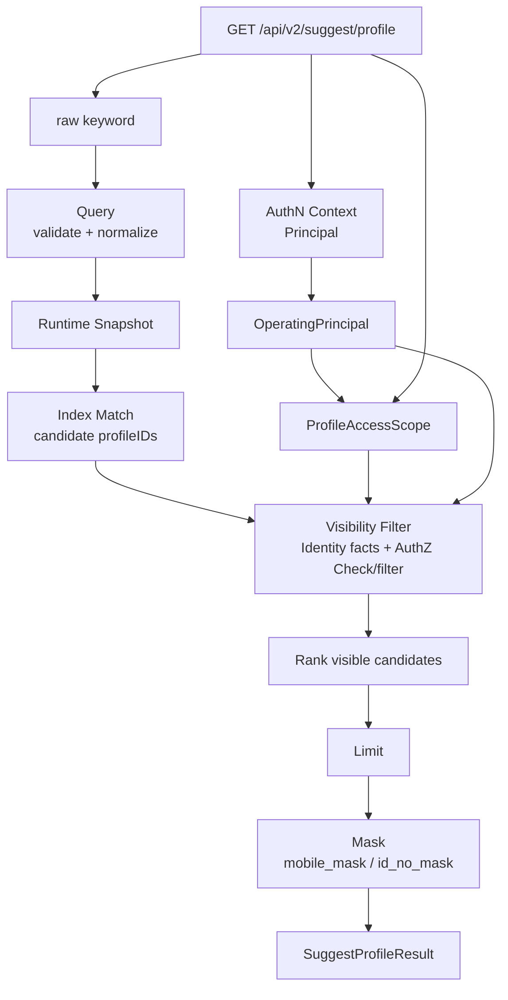
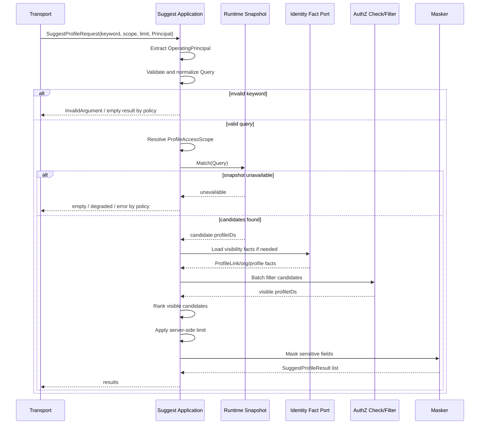

# 关键链路：SuggestProfile 查询

> 状态：规划改造 · 当前查询只通过 REST 暴露，application 返回 `ProfileSuggestItem`；本文中的 gRPC/SDK 与 `ProfileSuggestItem` 描述不是现行代码事实。

---

## 1. 本文回答

本文回答 10 个问题：

- SuggestProfile 查询链路解决什么问题？
- 为什么 SuggestProfile 查询必须基于当前操作者和可见范围？
- 如何从 AuthN `Principal` 提取 `OperatingPrincipal`？
- 原始 keyword 如何变成 Suggest `Query`？
- `ProfileAccessScope` 如何解析，为什么它不是最终授权结果？
- Runtime Snapshot 如何命中候选 Profile？
- 为什么必须先做可见性过滤，再排序和 limit？
- 手机号、证件号等敏感形态 keyword 需要哪些额外限制？
- 结果为什么只返回脱敏字段，例如 `mobile_mask`？
- 修改该链路时应该核对哪些代码和测试？

本文只讲 SuggestProfile 在线查询链路。
领域模型见 [01-领域模型-ProfileSearchTerm-ProfileAccessScope-Snapshot.md](01-领域模型-ProfileSearchTerm-ProfileAccessScope-Snapshot.md)；
索引刷新见 [02-关键链路-索引刷新Full-Delta-Snapshot.md](02-关键链路-索引刷新Full-Delta-Snapshot.md)；

---

## 2. 30 秒结论

SuggestProfile 查询是 Suggest 的核心读链路。

它的目标是：

```text
根据当前操作者、keyword 和可见范围，
从 Suggest Snapshot 中找到候选 Profile，
经过可见性过滤、排序、截断和脱敏后返回安全候选项。
```

核心主线：

```text
GET /api/v2/suggest/profile
  -> extract OperatingPrincipal
  -> validate and normalize Query
  -> resolve ProfileAccessScope
  -> read Runtime Snapshot
  -> match candidate profileIDs
  -> visibility filter
  -> rank visible candidates
  -> limit
  -> mask fields
  -> return SuggestProfileResult
```

最重要的边界：

```text
Snapshot 命中不等于可见；
ProfileAccessScope 不等于授权通过；
不能先全局 limit 再过滤 scope；
手机号/证件号形态 keyword 需要额外权限、限流和审计；
响应只返回脱敏字段，例如 mobile_mask；
查询链路不创建 Profile；
查询链路不写 RoleBinding；
查询链路不签发 Token；
查询链路不刷新全量索引。
```

如果只记一句话：

> SuggestProfile 查询必须先把候选集过滤到“当前操作者可见”，再排序、截断和脱敏返回。

---

## 3. 链路目标

SuggestProfile 查询服务于“输入关键字，快速选择 Profile”的交互场景。

典型入口：

```text
GET /api/v2/suggest/profile?keyword=...；
后台运营选择儿童档案；
家长选择自己关联的儿童；
业务系统选择测评对象、就诊人或档案；
移动端输入手机号后四位、姓名或拼音进行联想。
```

该链路要解决：

```text
如何从当前认证上下文得到搜索操作者；
如何限制 keyword，避免枚举；
如何从索引中快速命中候选；
如何保证无权限 Profile 不被返回；
如何让排序和 limit 不被无权限候选干扰；
如何脱敏手机号、证件号等敏感字段；
如何解释空结果、索引延迟、权限过滤失败等情况。
```

该链路不是：

```text
Profile 创建或修改链路；
ProfileLink 创建或修改链路；
AuthN 登录认证链路；
AuthZ 授权写入链路；
索引 Full/Delta 刷新链路；
外部 provider 身份解析链路。
```

---

## 4. 核心输入与输出

### 4.1 输入

| 输入 | 来源 | 说明 |
| --- | --- | --- |
| `Principal` | AuthN middleware/context | 当前认证结果，进入 Suggest 前需转换为 OperatingPrincipal |
| `keyword` | HTTP query / gRPC request | 原始搜索词，需要校验和归一化 |
| `scope` | request 参数或默认策略 | 搜索可见范围输入，例如 linked_profiles / organization |
| `limit` | request 参数 | 服务端必须设置最大值 |
| `tenant/organization` | Principal 或 request context | 可选，用于组织/租户边界 |
| `traceID` | request context | 审计和排查 |

---

### 4.2 输出

SuggestProfile 查询返回 `SuggestProfileResult` 列表。

建议字段：

```text
profile_id；
display_name；
mobile_mask；
id_no_mask，若允许；
relation_hint，若允许；
```

内部可记录但不一定对外返回：

```text
rank_score；
match_reason；
snapshot_version；
visibility_reason；
traceID。
```

对外响应边界：

```text
不返回明文手机号；
不返回明文证件号；
不返回完整内部 search token；
不返回无权限候选；
不泄露无权限 Profile 是否存在；
match_reason 对外应克制。
```

---

## 5. 链路总览



读图规则：

```text
Principal 只提供认证上下文，Suggest 内部使用 OperatingPrincipal；
keyword 必须先校验再归一化；
ProfileAccessScope 是查询范围输入，不等于授权通过；
Snapshot 命中只得到候选 profileIDs；
候选 profileIDs 必须经过可见性过滤；
过滤后才能排序、limit 和脱敏；
最终返回 SuggestProfileResult，而不是 Profile 写模型。
```

---

## 6. 标准查询时序图



关键规则：

```text
可见性过滤失败时不能返回未过滤候选；
Snapshot 不可用时不能回退到无过滤的全量 Profile 查询；
ranking 只能作用于 visible candidates；
limit 必须是服务端受控上限；
mask 失败时不能返回明文字段兜底。
```

---

## 7. OperatingPrincipal 提取

`OperatingPrincipal` 由 AuthN `Principal` 映射而来。

主线：

```text
AuthN Principal
  -> extract user/staff/service identity
  -> build OperatingPrincipal
  -> attach tenant/organization context if available
```

典型映射：

```text
Principal.UserID
  -> OperatingPrincipal{Type: user, UserID: ...}

Principal.StaffID
  -> OperatingPrincipal{Type: staff, StaffID: ...}

Principal.ServiceID
  -> OperatingPrincipal{Type: service, ServiceID: ...}
```

边界：

```text
OperatingPrincipal 不是 AuthN Principal 本体；
Suggest 不校验 password / otp；
Suggest 不验签 JWT；
Suggest 不签发 Token；
Suggest 不应携带完整 token claims；
Principal 缺失时应返回 Unauthenticated 或空结果，具体以接口策略为准。
```

---

## 8. Query 校验与归一化

### 8.1 校验

建议规则：

| 规则 | 目的 |
| --- | --- |
| keyword trim | 去除无效空格 |
| 空 keyword 拒绝或受限默认候选 | 防止全量枚举 |
| 最小长度限制 | 防枚举和降低索引压力 |
| 最大长度限制 | 防异常输入和性能问题 |
| limit 服务端上限 | 防大结果集枚举 |
| 高敏感 keyword 识别 | 手机号/证件号类搜索需要额外治理 |
| 特殊字符清洗 | 防注入、异常匹配和日志污染 |

---

### 8.2 归一化

Normalizer 可能处理：

```text
trim；
lowercase；
全角半角转换；
去空格；
手机号格式清洗；
拼音转换；
拼音首字母；
数字 suffix 提取；
hash / HMAC token；
```

注意：

```text
Normalizer 规则必须和索引刷新链路一致；
Normalizer 规则变化后可能需要 Full rebuild；
日志不应打印原始敏感 keyword；
手机号/证件号 keyword 应记录脱敏或 hash 形式。
```

---

## 9. ProfileAccessScope 解析

`ProfileAccessScope` 表达本次搜索的可见范围输入。

来源可能包括：

```text
默认策略；
request scope 参数；
OperatingPrincipal 类型；
organization / tenant context；
业务入口限制；
显式 profileIDs 限制，若允许。
```

常见 scope：

| Scope | 说明 |
| --- | --- |
| `linked_profiles` | 搜索当前用户有关联的 Profile |
| `organization` | 搜索组织范围内 Profile |
| `tenant` | 搜索租户范围内 Profile |
| `staff_assigned` | 搜索员工被分配的 Profile |
| `explicit_profile_ids` | 只在显式候选集内搜索 |

边界：

```text
ProfileAccessScope 不是 AuthZ Scope 本体；
ProfileAccessScope 不是 ProfileLink；
ProfileAccessScope 不等于授权通过；
ProfileAccessScope 只是构造候选可见性过滤的输入；
最终仍需要 Identity facts 和/或 AuthZ Check/filter。
```

---

## 10. Runtime Snapshot 匹配

Snapshot 匹配负责从索引中找到候选 Profile。

主线：

```text
Query
  -> current Snapshot
  -> match ProfileSearchTerm
  -> candidate profileIDs + match metadata
```

匹配模式可能包括：

```text
exact；
prefix；
contains；
suffix；
pinyin；
initials；
hash match；
```

关键边界：

```text
Snapshot 只提供候选；
Snapshot 命中不代表可见；
Snapshot stale 可能导致结果短暂延迟；
Snapshot 不可用时不应绕过可见性过滤直接查全量 Profile；
Snapshot match metadata 默认内部使用，对外要克制。
```

---

## 11. 可见性过滤

可见性过滤是 SuggestProfile 查询的安全核心。

主线：

```text
candidate profileIDs
  -> ProfileAccessScope
  -> Identity facts
  -> AuthZ Check or batch filter
  -> visible profileIDs
```

过滤依据可能包括：

```text
Identity.ProfileLink；
组织/租户归属；
员工分配关系；
显式候选集；
AuthZ RoleBinding / Permission / Check；
业务场景上下文。
```

关键规则：

```text
过滤不是可选优化；
过滤失败应 fail closed；
不能只凭 token 存在返回 Profile；
不能因为 Profile 在索引里就返回；
不能先 limit 再过滤；
无权限候选不进入排序和结果。
```

---

## 12. 为什么不能先全局 limit 再过滤

错误链路：

```text
keyword
  -> global index match
  -> rank globally
  -> limit 10
  -> visibility filter
  -> return results
```

问题：

```text
可见结果可能被无权限高分候选挤掉；
结果数量可能泄露无权限候选存在；
用户体验不稳定；
越权排查困难；
排序逻辑和安全逻辑互相污染。
```

正确链路：

```text
keyword
  -> candidate profileIDs
  -> visibility filter
  -> rank visible candidates
  -> limit
  -> mask
```

一句话：

> limit 必须作用于 visible candidates，而不是 global candidates。

---

## 13. 排序与截断

排序只能发生在可见候选集上。

排序因素可能包括：

```text
exact match 优先；
prefix match 优先；
手机号后四位 exact 优先；
姓名完全匹配优先；
最近访问或最近选择；
组织内关联权重；
业务优先级；
Profile 状态；
```

截断规则：

```text
limit 使用服务端最大值；
客户端 limit 只能缩小，不能突破服务端上限；
高敏感搜索可以使用更小 limit；
返回空结果时不区分“无匹配”和“无权限”，除非内部排查。
```

---

## 14. 手机号 / 证件号形态 keyword

手机号、证件号类 keyword 具备更高枚举和隐私风险。

识别方式：

```text
纯数字；
疑似手机号；
手机号后四位；
疑似证件号；
包含生日/地区码特征的数字串；
```

建议策略：

```text
提高最小长度要求；
限制搜索 scope；
要求更高权限；
更严格 rate limit；
记录审计；
只使用 suffix/hash token 匹配；
不返回明文手机号或证件号；
不对无权限候选返回 match reason。
```

边界：

```text
手机号形态 keyword 需要额外权限或更严格策略；
响应只返回 mobile_mask；
证件号默认不返回，若返回也必须脱敏；
日志记录 hash/fingerprint，不记录原文。
```

---

## 15. 脱敏返回

脱敏返回负责把 visible candidate 转换成安全响应。

主线：

```text
visible profile snapshot
  -> select allowed display fields
  -> mask mobile
  -> mask id number if allowed
  -> remove internal search metadata
  -> return SuggestProfileResult
```

字段策略：

| 字段 | 对外策略 |
| --- | --- |
| `profile_id` | 可返回，用于后续选择 |
| `display_name` | 可返回，但按产品策略 |
| `mobile_mask` | 只返回脱敏手机号 |
| `mobile` | 禁止返回 |
| `id_no_mask` | 默认不返回；如返回必须脱敏 |
| `id_no` | 禁止返回 |
| `match_reason` | 默认不返回或只返回粗粒度 |
| `rank_score` | 默认不返回 |

关键规则：

```text
mask 失败时不能返回明文字段兜底；
无权限候选不进入 mask；
不同调用方可有不同展示字段，但必须由权限/场景策略控制；
响应字段必须与 REST/gRPC 契约一致。
```

---

## 16. 失败边界

| 场景 | 期望行为 | 说明 |
| --- | --- | --- |
| Principal 缺失 | 401 / Unauthenticated | 或按接口策略返回空 |
| keyword 为空 | 400 / empty result by policy | 防枚举 |
| keyword 过短 | 400 / empty result by policy | 防枚举 |
| Snapshot 不可用 | degraded empty / 503 | 不能绕过过滤查全量 |
| Snapshot stale | 可返回旧结果 | 需可观测 |
| Identity facts 不可用 | fail closed | 不返回未过滤候选 |
| AuthZ 不可用 | fail closed 或最小安全范围 | 策略必须明确 |
| 可见性过滤超时 | fail closed | 不返回候选 |
| mask 失败 | 删除敏感字段或返回错误 | 不返回明文 |
| limit 超限 | 使用服务端最大值 | 不信任客户端 |
| 高敏感 keyword 超频 | rate limit | 防枚举 |

---

## 17. 安全策略

建议：

```text
所有查询都必须绑定 OperatingPrincipal；
不允许匿名 Suggest 全局搜索；
keyword 最小长度限制；
高敏感 keyword 更严格限流；
候选必须经过可见性过滤；
limit 作用于 visible candidates；
对外只返回脱敏字段；
日志脱敏 keyword 和结果字段；
无权限候选不进入结果，不泄露存在性；
搜索行为可按操作者审计。
```

---

## 18. 可观测性

建议指标：

```text
suggest_profile_query_total；
suggest_profile_query_success_total；
suggest_profile_query_failure_total；
suggest_profile_query_duration_seconds；
suggest_profile_snapshot_version；
suggest_profile_snapshot_miss_total；
suggest_profile_candidate_count；
suggest_profile_visible_count；
suggest_profile_filtered_count；
suggest_profile_sensitive_keyword_total；
suggest_profile_rate_limited_total；
suggest_profile_mask_failure_total；
```

建议日志字段：

```text
operatorType；
operatorID hash；
scopeType；
keywordType；
keywordHash；
snapshotVersion；
candidateCount；
visibleCount；
resultCount；
duration；
traceID；
```

禁止日志：

```text
明文手机号；
明文证件号；
原始敏感 keyword；
完整搜索 token；
未脱敏 Profile 展示字段；
完整 AuthN token。
```

---

## 19. 与索引刷新链路的关系

查询链路依赖索引刷新链路产出的 Snapshot。

```text
Index Refresh
  -> Runtime Snapshot(version=N)
  -> SuggestProfile Query reads version=N
```

边界：

```text
查询不负责 Full rebuild；
查询不应每次请求 Delta refresh；
Snapshot stale 可能导致短暂搜索不到最新 Profile；
stale 不能导致越权返回；
必要时查询可以触发异步刷新信号，是否实现以代码为准。
```

---

## 20. 与其他模块的边界

### 20.1 与 Identity

```text
Identity 负责 Profile 主数据；
Suggest 查询只读 Profile snapshot 或 Identity facts；
Suggest 查询不创建或修改 Profile/ProfileLink；
ProfileLink 可作为可见性过滤事实输入。
```

### 20.2 与 AuthZ

```text
AuthZ 负责授权判断；
Suggest 查询可以调用 AuthZ Check/batch filter；
Suggest 查询不创建 Role/Permission/RoleBinding；
ProfileAccessScope 不是 AuthZ Scope 本体；
索引不是权限事实源。
```

### 20.3 与 AuthN

```text
AuthN 提供 Principal；
Suggest 查询把 Principal 映射为 OperatingPrincipal；
Suggest 查询不校验 Credential / Challenge；
Suggest 查询不签发 Token。
```

### 20.4 与 IDP

```text
IDP 负责外部身份解析；
Suggest 查询不读取 WechatApp / Credentials / AppToken / ExternalIdentity；
provider claims 如需进入搜索结果，应先经过 Identity 确认。
```

---

## 21. 常见反模式

| 反模式 | 问题 | 推荐做法 |
| --- | --- | --- |
| 匿名全局 suggest | 枚举和隐私泄露 | 必须绑定 OperatingPrincipal |
| Snapshot 命中即返回 | 越权泄露 | 必须可见性过滤 |
| 先 limit 再过滤 | 可见结果被挤掉 | 先过滤再 limit |
| 手机号 keyword 不加限制 | 枚举风险 | 额外权限、限流、审计 |
| 返回 mobile 明文 | 敏感泄露 | 只返回 mobile_mask |
| mask 失败返回原值 | 严重泄露 | 删除字段或返回错误 |
| 查询时全量重建索引 | 性能不可控 | 使用 Runtime Snapshot |
| AuthZ 不可用时放行 | 越权风险 | fail closed 或最小安全范围 |
| 日志打印原始 keyword | 敏感泄露 | hash/脱敏记录 |
| ProfileAccessScope 当授权通过 | 边界混淆 | 仍需 Identity/AuthZ filter |

---

## 22. 代码事实源

| 事实 | 路径 |
| --- | --- |
| Suggest domain | `../../../internal/apiserver/domain/suggest` |
| OperatingPrincipal / Query / ProfileAccessScope | `../../../internal/apiserver/domain/suggest` |
| ProfileSuggestItem | `../../../internal/apiserver/application/suggest` |
| Suggest application query use case | `../../../internal/apiserver/application/suggest` |
| Runtime Snapshot / index | `../../../internal/apiserver/infra`、`../../../internal/apiserver/application/suggest`，具体以代码为准 |
| Visibility filter | `../../../internal/apiserver/application/suggest` |
| Identity facts | `../../../internal/apiserver/domain/identity`、`../../../internal/apiserver/application/identity` |
| AuthZ Check/filter | `../../../internal/apiserver/application/authz` |
| Masker | `../../../internal/apiserver/application/suggest`、`../../../internal/apiserver/domain/suggest`，具体以代码为准 |
| Suggest REST transport | `../../../internal/apiserver/transport/rest` |
| Suggest gRPC transport | `../../../internal/apiserver/transport/grpc` |
| Suggest container | `../../../internal/apiserver/container/suggest` |
| REST 契约 | `../../../api/rest` |
| gRPC 契约 | `../../../api/grpc` |
| 架构测试 | `../../../internal/pkg/architecture` |

注意：上表中的具体路径需要继续与当前源码核对。如果源码目录已调整，应以代码为准并同步更新本文。

---

## 23. Verify

修改本文后至少执行：

```bash
make docs-hygiene
```

涉及 Suggest 领域模型：

```bash
go test ./internal/apiserver/domain/suggest/...
```

涉及 Suggest 查询用例：

```bash
go test ./internal/apiserver/application/suggest/...
```

涉及索引、缓存、repository、Snapshot runtime：

```bash
go test ./internal/apiserver/infra/...
```

具体路径以当前代码为准。

涉及 Identity/Profile 事实源：

```bash
go test ./internal/apiserver/domain/identity/...
go test ./internal/apiserver/application/identity/...
```

涉及 AuthZ/AuthN/IDP 边界：

```bash
go test ./internal/apiserver/domain/authz/...
go test ./internal/apiserver/application/authz/...
go test ./internal/apiserver/domain/authn/...
go test ./internal/apiserver/domain/idp/...
```

涉及 REST/gRPC 契约或 transport：

```bash
make api-validate
make proto-gen
go test ./internal/apiserver/transport/rest/...
go test ./internal/apiserver/transport/grpc/...
```

涉及 SDK：

```bash
go test ./pkg/sdk/...
```

涉及分层依赖或模块边界：

```bash
go test ./internal/pkg/architecture
```

---

## 24. 本文总结

SuggestProfile 查询链路可以压缩成：

```text
GET /api/v2/suggest/profile
  -> extract OperatingPrincipal
  -> validate and normalize Query
  -> resolve ProfileAccessScope
  -> read Runtime Snapshot
  -> match candidate profileIDs
  -> visibility filter
  -> rank visible candidates
  -> limit
  -> mask fields
  -> return SuggestProfileResult
```

最重要的边界是：

```text
Snapshot 命中不等于可见；
ProfileAccessScope 不等于授权通过；
不能先全局 limit 再过滤 scope；
手机号/证件号形态 keyword 需要额外权限、限流和审计；
响应只返回脱敏字段，例如 mobile_mask；
查询链路不创建 Profile；
查询链路不写 RoleBinding；
查询链路不签发 Token；
查询链路不刷新全量索引。
```

下一篇应继续编写可见性过滤与脱敏链路，单独说明 Identity/ProfileLink、AuthZ Check、batch filter、mask policy 和敏感字段治理。
