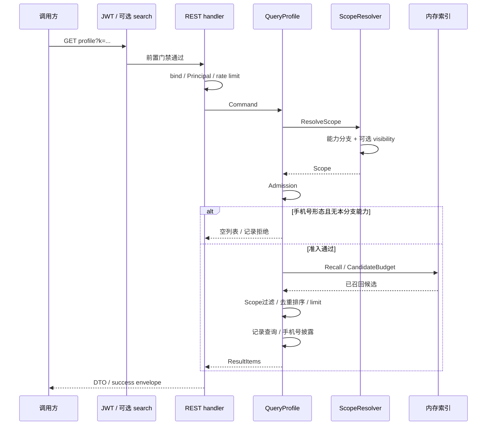

# SuggestProfile 查询：请求门禁、有限召回与空结果

> 状态：已实现 · 本文按标准 REST 装配、应用编排、索引适配器与现有测试核对；候选改进单独说明，不代表已经实现。

## 1. 先明确这个接口承诺什么

`GET /api/v2/suggest/profile` 返回本次范围内、已召回集合中的少量候选。它不证明全库最佳结果、实时关系许可或详情操作已获授权。

一次请求依次经过 JWT、可选外层 `profiles/search`、参数绑定、Principal、限流、Scope、准入、召回、选择和披露。后面的成功分支不能覆盖前面的失败：

- 手机号能力否定是在 Scope 成功之后才返回 `200 + []`；权限或 visibility 故障可以先返回错误。
- 空白、准入拒绝、零命中、过滤后为空、optional 初始降级都可得到空数组，业务含义不同。
- `limit` 限制返回条数，`CandidateBudget` 限制已召回候选；两者都不能证明遍历成本有硬上限。
- 内部能力调用、visibility 和索引没有共同版本；“每次 Check 使用新鲜策略”不等于整次查询的一致快照。
- 默认手机号披露是掩码；内存仍保留原号码，非 production 的显式配置可以关闭掩码。

字段与端口合同归 [模型与应用端口](01-模型与应用端口.md)，索引年龄和恢复归 [Full/Delta 刷新](02-关键链路-索引刷新Full-Delta.md)。本篇聚焦一次查询怎样执行及调用方如何解释结果。

## 2. 公开请求与响应

```http
GET /api/v2/suggest/profile?k=张&limit=10
Authorization: Bearer <access-token>
```

| 输入 | 实际处理 |
| --- | --- |
| `k` | query 必填；缺失、`k=` 绑定失败。非空原文进入 handler，application 再 `TrimSpace` |
| `limit` | 可省略；非整数绑定失败。正常 Service 在准入后把 ≤0 或大于 `MaxResults` 的值改为上限，默认上限20 |
| 操作者/范围 | 不从 query 接收；从认证上下文复制 IAM UserID 为 OperatorID、BusinessOrgID 为 OrgID，当前不填 OrgIDs |
| 认证 | 推荐 Bearer header；实际 JWT middleware 还兼容裸 Authorization、query token 与 cookie，详见 [Token](../02-AuthN/05-关键链路-Token签发刷新吊销.md) |

```json
{"code":0,"message":"success","data":[{"id":"123","name":"张三","mobile_mask":"138****8000","weight":1}]}
```

DTO 把 int64 ProfileID 转成十进制字符串；`name`、`weight` 总会序列化，空 `mobile_mask` 被省略。handler 把 nil 列表转为空列表，成功空结果为 `"data":[]`。`weight` 是投影权重，不是权限、概率或相似度评分。

默认披露取号码列表第一项，按字节截取前三/后四并插入星号，短值返回空；它不保证这一项是稳定“主号码”。`DisableMask` 分支直接返回首项原值，包括短值。标准启用模块在 production 初始化时禁止关闭掩码；领域策略、自定义 Querier 和底层 Register 并无同样的强制保证，不能据 DTO 的 `mobile_mask` 名称推断所有调用都已脱敏。

### 2.1 机器契约与检查的覆盖缺口

[Suggest OpenAPI](../../../api/rest/suggest.v2.yaml) 与 Swagger 列出200/400/401/403/429，未列实际可能出现的500/503。OpenAPI 没有完整表达 limit 归一化规则，item 的 id/name/weight 也没有 required 约束；服务器当前稳定输出这些字段与 schema 允许省略是两个事实。

`check-openapi-contracts.py` 的专用检查比较该 path 的200响应引用及顶层 envelope shape；内部 item 是 `$ref`，检查不递归展开其定义。通用比较又用短 schema 名查找 component，Suggest 完整限定名没有被这一路匹配。因此绿色门禁不能证明 item 字段类型/required、参数、security 或全部错误响应与实现一致。

偏移汇总归 [契约治理](../../04-接口与SDK/01-REST-gRPC与契约治理.md)。本轮只校准文档，没有修改 YAML、Swagger、DTO 或 checker。

## 3. 主链路与前置顺序

下图限定为标准装配、参数合法、正 OperatorID、非空关键词且 Scope 成功的请求；外层失败与空白早退见后文，不能把图中的正常返回当作所有请求的保证。


```mermaid
sequenceDiagram
    participant C as 调用方
    participant M as JWT / 可选 search
    participant H as REST handler
    participant Q as QueryProfile
    participant S as ScopeResolver
    participant I as 内存索引
    C->>M: GET profile?k=...
    M->>H: 前置门禁通过
    H->>H: bind / Principal / rate limit
    H->>Q: Command
    Q->>S: ResolveScope
    S->>S: 能力分支 + 可选 visibility
    S-->>Q: Scope
    Q->>Q: Admission
    alt 手机号形态且无本分支能力
        Q-->>H: 空列表 / 记录拒绝
    else 准入通过
        Q->>I: Recall / CandidateBudget
        I-->>Q: 已召回候选
        Q->>Q: Scope过滤 / 去重排序 / limit
        Q->>Q: 记录查询 / 手机号披露
        Q-->>H: ResultItems
    end
    H-->>C: DTO / success envelope
```

### 3.1 标准入口与直接调用有不同合同

标准 router 要求 container、Suggest 与 AuthN 可用、Querier/TokenVerifier 非空，才能注册带 JWT 的入口；AuthZ 可用且 middleware 存在时追加 `profiles/search`。AuthZ 初始化不可用时这一层可不装；已经装好的 middleware 遇策略新鲜度故障则拒绝，不会自动消失。

底层 `suggest.Register` 只检查 Querier 与非空 middleware slice，不鉴别 slice 中是否真有 JWT。handler 单测人工放入 UserID 的成功请求不能证明标准认证/授权装配已经端到端通过。

正常 Service 的早退顺序为：nil receiver 返回空列表；OperatorID≤0 返回 `ErrUnauthenticated`；trim 后为空返回空列表；然后才检查依赖并 ResolveScope。直接调用 application 时，空字符串只在正操作者前提下短路；它能掩盖缺失 Scope/Recaller，却不能掩盖非法操作者。此早退没有经过 `AdmissionPolicy.DenialEmptyKeyword`，也没有正常查询指标。

标准 HTTP 请求即使 `k=空格`，也先经过 JWT/search、绑定、Principal 和限流；缺失 k、非法 limit 则在绑定阶段停下。空白查询和最终被手机号准入拒绝的请求仍会消耗相应限流桶。

### 3.2 Principal 是哪些事实

在线 JWT Verify 检查 token、Session 与 User/LoginIdentity 准入；handler 使用其中的 IAM UserID，并未重验 QS Operator 是否存在。OrgID 来自经过认证的业务声明，不证明当前组织成员资格。

当前新登录 SessionCreator 使用空 BusinessContext；历史 Session/兼容快照可能仍携 Org 信息。Refresh 重新投影已有 Session，并不读取最新组织成员事实。动作权限、业务组织、候选范围分别判断，详见 [AuthN 协作](../02-AuthN/07-模块边界-AuthN与Identity-IDP-AuthZ.md)。

## 4. 限流先记账，后端也不是等价替换

handler 在 ResolveScope 和 Admission 前，用 trim 后关键词的手机号形态选择桶；普通与手机号桶独立，手机号请求不再消耗普通总桶。标准配置 `PerOperatorQPS≤0` 关闭整套限流，单独设置正 mobile QPS 不能启用它；mobile 参数也不必然比普通桶更严。

| 项目 | memory | Redis |
| --- | --- | --- |
| 算法 | 按 QPS 补充 token、Burst 定容量 | INCR，首次计数时 EXPIRE 1秒，窗口内按 Burst 比较 |
| QPS 含义 | 决定持续补充速率 | 标准配置据 QPS 派生默认 Burst，但 limiter 不直接使用 QPS |
| 窗口 | token 随时间补充 | 从此 key 的首个请求起约1秒，非墙钟对齐；拒绝也增计数，不续 TTL |
| 多实例 | 每进程独立 | 相同 Redis DB/key 与一致阈值下共享 |
| 容量 | std/mob 两张 map 各受 MaxEntries 限制，合计可达两倍；满时扫描最久访问项 | 每个计数 key 有 TTL；前缀 `iam:suggest:rl:{std\|mob}:{operator}` 没有 org/env 分区 |
| 失败 | nil/非正 operator 放行；标准 handler 通常已拒绝无用户 | Eval error 告警并放行，不切换到 memory |
| 可观测性 | handler 拒绝时记录 rate-limited | 同左；fail-open 的 Eval error 不等于限流拒绝 |

例如显式 QPS=10、Burst=2：memory 可持续按10/s补充，Redis 单个约1秒窗口最多放行2次。切后端可能改变有效吞吐，不能把配置名相同当作语义相同。标准默认 std Burst 为 max(5, ceil(2×QPS))、mobile Burst 为 max(3, ceil(2×mobile QPS))；构造器直接调用的兜底不等于标准配置转换。

memory 两桶共用 mutex，满 map 的淘汰扫描为 O(n)。被淘汰操作者再访问会新建满 Burst 桶，容量上限同时影响配额连续性；当前没有定时清理。Redis 配置缺 client 时才在构造阶段告警回退 memory，运行中的 Redis error 不执行该回退。

Redis Allow 创建50ms的独立 Background context，没有继承请求取消。锁定 go-redis v9.16.0 的网络 deadline 还受 `ContextTimeoutEnabled` 控制；标准 component-base v0.8.0 建 client 未开启这一项，socket 等待依据 client Read/WriteTimeout，不能承诺50ms内返回。本轮是锁定依赖源码核对，未做真实 Redis 故障耗时实验。

候选改进要先决定是否统一 QPS/Burst 语义、手机号是否也耗总桶、故障开放策略与配额命名空间；若要求请求取消/硬耗时，Limiter 端口及专用 client deadline 都需定义。直接改共享 Redis client 会影响 AuthN/IDP，不能只为这个接口调整全局超时。

## 5. Scope 是动作能力与局部范围的组合

AuthZ Check 的 subject 为 `user:{OperatorID}`，resource 为 `iam:identity:collection:profiles`：

| 内层分支 | 第二个动作 | 形成的范围 |
| --- | --- | --- |
| `list_all=true` | `search_by_mobile_all` | 全量 Scope；是否可搜手机号取该第二次结果，不读普通 mobile 或 visibility |
| `list_all=false` | `search_by_mobile` | 读取局部 visibility，并用 operator/org/ProfileIDs 组合 Scope |

两次内层 Check 都完成后才处理手机号准入；局部分支还先读取 visibility。比如 mobile=false 且 visibility 查询失败，得到错误而非准入空数组。统一 ResolveScope 让所有意图使用同一合同，但把这一依赖成本放在了拒绝之前；提前拒绝需要拆清能力读取与完整范围构造。

标准 FactsReader 若 permissions 端口缺失，返回零能力，Scope 仍可组合 creator/org。nil ScopeResolver 接口会被 Service 判为缺依赖；nil `*ScopeResolverService` receiver 或其 facts 接口为 nil，才由 ResolveScope 返回空 Scope。nil visibility 仅意味着没有 ProfileIDs，不能机械理解为局部无任何许可。生产装配前提归 [AuthZ 边界](../03-AuthZ/07-模块边界-AuthZ与AuthN-Identity-Suggest.md)。

### 5.1 三次 Check 没有一次查询的共同版本

外层 search、内层 list_all 与分支 mobile 分别调用 Check；FactsReader 只消费 bool，丢弃 PolicyVersion。源码允许这样一种条件交错：v41 有 list_all、无 all-mobile；v42 撤掉 list_all、授予 all-mobile；切换发生在两次内层调用之间，reader 可组合成 all=true/mobile=true，尽管两个版本都没有授予这一组合。

这是源码条件推演，没有真实 Runtime 并发复现。此前临时替身诊断只确认分支及无版本比较，历史证据留在 [重构记录](../../_data/reviews/2026-10-06-docs-refactor.md)，不作为持续回归。批量能力读取可解决能力间混读，仍不能让 JWT Org、visibility 与 Store 自动属于同一时刻。

### 5.2 OR 可见性不等于当前关系许可

局部 Scope 按显式 ProfileIDs、正值同 Org、索引 OwnerOperatorID 任一满足即允许。默认 visibility SQL 只查未软删、`created_by=operator` 的 Profile，没有查询 ProfileLink；默认投影 OrgID 也是过渡占位，不能声称完整组织模型。

具体撤销窗口：operator17 创建的 Profile42 已在 MySQL 软删，实时 visibility 不再含42，但旧 Store 仍保存 owner17；owner OR 仍可允许它。关闭 visibility cache 或批量 Check 都不能单独堵住旧投影许可。

关系资格是另一层：最后一条合格 ProfileLink 失效后，候选等待成功刷新移除；若仍有其他合格关系，则候选可继续存在，号码集合等待重算。默认 Loader 不按查询操作者筛 link，也不要求关联 User.Status=active，因此不能描述成“我的监护关系即时权限”。

若要求立即撤销，需定义所有 OR 分支共同依赖的当前资格/撤销事实，再决定逐次查库、撤销屏障或有界传播成本；只新增 ProfileIDs 检查却保留旧 owner 兜底仍不够。刷新与数据库窗口见 [刷新主文](02-关键链路-索引刷新Full-Delta.md)。

## 6. visibility 缓存与调用取消

`CachedReader` 仅以 OperatorID 为 key；TTL≤0直接透传，命中结果做防御复制。TTL 控制缓存结果是否可用，不证明资格最新，也不控制 map 容量：

- 回源之前取 now，expiresAt=该 now+TTL；慢查询会缩短剩余缓存寿命，可能返回时已经过期。
- error 同样缓存。直接调用中取消/超时也可能变成该操作者后续有效请求共享的错误；hit 不检查新请求 context。
- miss 解锁回源，没有 singleflight/代次检查。A读取旧结果后延迟返回，B先缓存新结果，A仍可覆盖B，过期点取A的开始时刻。
- 无容量、主动失效或清理；过期且不再访问的操作者记录仍留在 map。

当前 key 与 creator-only SQL 相符；若扩展到 org/关系/资料版本依赖，key 和失效条件也须同步。可选容量/清理、并发合并或代次检查、按错误分类缓存分别解决不同问题；把 TTL 改成返回时起算还可能延长旧结果驻留，不能笼统写成“缓存优化”。

取消还要追到调用方。JWT/search 用 `c.Request.Context()`，Suggest handler 却把 `*gin.Context` 传给 application；标准 server 使用 `gin.New()`，没有启用 `ContextWithFallback`。锁定 Gin v1.11.0 在该默认值下不提供请求 Deadline/Done/Err，因此 visibility 的 `db.WithContext(ctx)` 不能证明 HTTP 取消已透传。

即使直接调用传入有效 context，memory Store.Recall 仍忽略它，整次召回持有 RLock；复杂展开或等待不会因取消停止，并可延后 Delta 获取写锁。以上是源码限定，没有取消或并发覆盖实验；HTTP context、缓存错误政策与索引中断应作为三个合同验收。

## 7. 准入、召回与预算

| 关键词 | 准入/召回 |
| --- | --- |
| trim 后为空 | 正常 Service 已提前返回，不访问 Scope/索引 |
| 纯数字、符合手机号形态 | 需当前分支 mobile 能力，然后 NumericExact |
| 其他纯数字 | NumericExact，查 ProfileID/手机号共用的 Hash key 空间 |
| 非纯数字 | TextPrefix，查姓名/拼音/首字母 TST；用户 `*`、`.` 也参与通配 |

手机号形态由 Unicode digit 与7–15字节长度共同判断，并非统一号码规范化；长 ProfileID 也可能走该拒绝。当前 E.164 writer、Hash 原字符串与意图分类没有对齐，带 `+` 的号码是文本，裸号码又可能不同 key。号码失败例与修正取舍由 [模型主文](01-模型与应用端口.md) 维护，不能靠改显示掩码解决检索错配。

### 7.1 文本不是全部按字面前缀搜索

TST 将短关键词补 `*` 到 KeyPadLen；该长度是最短 padding 长度，不是关键词上限。输入里的 `*` 和 `.` 也被当成通配，未转义：`k=*` 可展开不同姓名，`k=张.` 不要求姓名真有句点。后续 Scope 仍执行，这不证明授权绕过，但调用方不能把它理解为纯字面前缀。拼音转换也不是一般语言的大小写、拼写纠错或分词规范。

WildcardKeyCap 在递归局部判断，子分支各自拿完整 cap 后合并，不能视作最终 key 数硬上限；CandidateBudget 在展开 keys 之后才截候选，不能限制此前遍历工作。Delete 会撤销 ID，但当前 TST 保留空终端；空 key 仍可能占展开名额，造成有候选却本轮未召回。此类细节的代码入口归 [边界与索引](04-模块边界与代码索引.md)。

应先公开选择“保留显式通配语法”还是“用户输入按字面、仅内部 padding 通配”，再定义全局 key/扫描预算、空终端处理和取消条件；改变转义规则需要兼顾现有调用。

### 7.2 返回 limit 与召回质量是两个问题

默认 MaxResults=20、CandidateBudget=200；请求 limit=1仍使用200候选预算。预算在 Scope/去重/排序前生效，Service 不续查补满，故可能不足 limit，也可能遗漏预算外更高权重的可见项。

Hash 先按桶顺序截 ID，重复引用也耗预算。比如共享号码桶 `[1,1,2]`、预算2，只召回1两次，后续去重为一条，2没有机会。默认 SQL 的 DISTINCT 可减少重复来源，却不为自定义来源或 ID/mobile 同键提供独立命名空间。

扩大预算是成本/质量折中；adapter 接收已解析 Scope 可以提前过滤，但需扩展事实/版本/成本合同；分批续查还需定义稳定游标与批间 Store 切换。两种候选都不能仅凭“多召回一点”证明全库 top-k。

## 8. 选择顺序与 MatchStrength

`SelectionPolicy` 先 Scope 过滤，再按 ProfileID 去重，以 Weight 降序、Strength 优先、DisplayName 字面前缀 bonus、ProfileID 升序排序，最后 limit。默认 Loader 权重均为1；自定义高 Weight 的弱匹配可以排在低 Weight 的 Exact 前。

Strength 描述技术 key 命中：NumericExact 为 Exact；文本仅在命中 key 等于原关键词或 padded pattern 时标 Direct，否则 Expanded。例如 `张` 命中 `张三` 通常是 Expanded，`zs` 命中张三的首字母 key 可以是 Direct；DisplayName 的字面前缀 bonus 是另一项规则。

文本 adapter 按第一次遇到的 ID 保留 Strength，不汇总所有 key 后取最高强度。领域去重也只比较 Weight/Strength，完全同分保留先到项；标准同 Store 中同 ID 资料一致，自定义 Recaller 返回冲突同 ID 时，最终 ID 排序不能保证被选资料稳定。排名不是资料版本裁决，范围也只覆盖已召回集合。

手机号披露在选择后执行；能按姓名看到候选掩码，不等于已经拥有按手机号搜索能力。

## 9. 怎样解释成功空数组和错误

下表均以此前阶段已通过为前提；标准执行顺序决定哪个结果先出现。

| 阶段/情境 | 当前结果 | 调用方可据此判断什么 |
| --- | --- | --- |
| JWT Verify error / invalid | 401、102002 | 公开层折叠为 token invalid，不能从401断言只是过期 |
| 可选外层 search=false | 403、103001 | 动作拒绝，还未绑定关键词或读取 Scope |
| 外层策略 freshness error | 503、103002 | 已装配授权服务无法给出新鲜判定 |
| 外层其他 checker error | 500、100008 | middleware 重新编码为 Internal |
| 缺/空 k、limit非整数 | 400、100003 | 绑定失败，尚未限流/查询 |
| handler 缺有效 UserID | 401、102002 | Principal 无法形成 |
| limiter 拒绝 | 429、100303 | 本次被记账桶拒绝，不等于权限拒绝 |
| trim 后空白 | 200、[] | 正操作者应用早退，没做 Scope/Admission |
| mobile=false且 Scope 成功 | 200、[] | 应用准入拒绝，不访问索引 |
| Recall零候选或过滤后空 | 200、[] | 仅本次预算/Store/Scope 下没有返回项 |
| optional 初始 DegradedQuerier | 200、[] | 尚不能用正常 Service 语义解释索引命中 |
| 内层 capability/visibility/Recaller error | coder 对应状态；普通非编码 error 为500、code1 | 不是成功空数组；应按层次排查依赖 |

最后一行依据当前 component-base v0.8.0 `ParseCoder`：非 nil 普通 error 返回 unknown coder（1/500），`BaseHandler` 的100101兜底不会执行；编码的策略不可用仍可返回503。不要把所有 Scope 故障笼统当成数据库100101或无权限。

几种成功空结果具有相同 HTTP 状态/数据形状，不证明耗时与全部侧信道不可区分。诊断需同时查看模块是否 degraded、应用/query/selection/限流指标、当前 Scope 来源与最近成功刷新；客户端不得据空数组确认号码不存在或撤销已经传播。

## 10. 指标与隐私证明到哪一层

| 路径 | Query / mobile-shaped counter | Selection matched/visible |
| --- | --- | --- |
| 应用手机号拒绝 | 记录，returned=0 | 不记录 |
| Recall/Selection成功，包括零候选 | 记录返回条数 | 记录 |
| nil Service、非法operator、空白、缺依赖、Scope error | 不记录 | 不记录 |
| 准入后 Recall error | 不记录 | 不记录 |
| JWT/search/bind/限流拒绝、DegradedQuerier | 不走正常 Service 计数；限流拒绝另有计数 | 不记录 |

因此 query/mobile-shaped 计数既不是全部 HTTP 请求，也不是全部已经做 Admission 决策的查询。matched/visible 仅描述已召回集合，不能独自估计预算外可见项；错误率、索引新鲜度或“每次都搜到了”不能从这些计数直接推导。

原始号码会经过 Loader、SuggestibleProfile 与进程内 Hash key；当前没有 Suggest 文件 snapshot。专用 mobile-shaped 日志在 Scope 成功、Admission 之前记录 operator、允许标志与关键词 rune 长度，不记录原始关键词；空白/Scope失败甚至没有这条日志。

仓库默认通用 access log 记录 URL.Path、route 模板与 metadata，不读取 RawQuery/body；BaseHandler 错误日志使用安全分类字段。固定文件的架构护栏不能证明反向代理、外部日志平台、其他 warning、heap dump 与诊断访问都不含敏感数据。客户端把号码置于 query 的风险仍需由部署与访问治理独立核验。

## 11. 验证依据与修改验收

| 当前证据 | 已证明的范围 | 未证明的范围 |
| --- | --- | --- |
| application query/Scope 测试 | 空白正operator早退、能力与可见性分支、替身候选过滤、limit超大值、mobile拒绝 | 真预算截断后的补缺/全局最佳；完整HTTP认证链；所有早退指标 |
| FactsReader 测试 | all/局部分支、第二动作、缺端口与错误传播 | subject/resource实参、真实多版本一致 |
| memory 测试 | 姓名/拼音与数字召回、Upsert/Delete撤旧key | 用户通配专项、全局硬cap、空terminal预算、取消与遍历耗时 |
| 限流测试 | memory第三operator可通过；miniredis共享计数/分桶；nil client Ping失败 | 精确淘汰对象/refill、真实Redis TTL/故障/50ms、两后端等价QPS |
| CachedReader 测试 | 固定时钟命中、零TTL透传、防御复制 | 到期/error/取消共享、并发覆盖、容量清理 |
| REST handler / core / AuthZ middleware 测试 | 人工UserID下envelope、400/401/429；独立授权中间件403/503/500；绑定编码 | 真实JWT+AuthZ+SQL+索引端到端、Org来源、全部HTTP code/item schema |
| selection/profile 与指标测试 | 同权重Strength优先、重复ID取高Weight、常规掩码、计数/直方图适配 | 字面bonus/同分/冲突ID、所有长度Unicode披露、每个异常分支计数 |

本轮现有回归与源文件绑定由 [重构记录](../../_data/reviews/2026-10-06-docs-refactor.md) 维护；不新增实现测试，也不将替身/SQLite/miniredis当作真实服务验收。

若修改查询，应选择能区分行为的样本：缺失/空白/非法limit与门禁先后；all/scoped mobile分支及策略版本交错；软删后旧owner OR；普通字面与用户通配；重复Hash/预算外可见项；两后端跨窗与故障；缓存并发/取消及DTO省略。具体选择由变化影响决定，无需每次机械执行全部生产实验。
