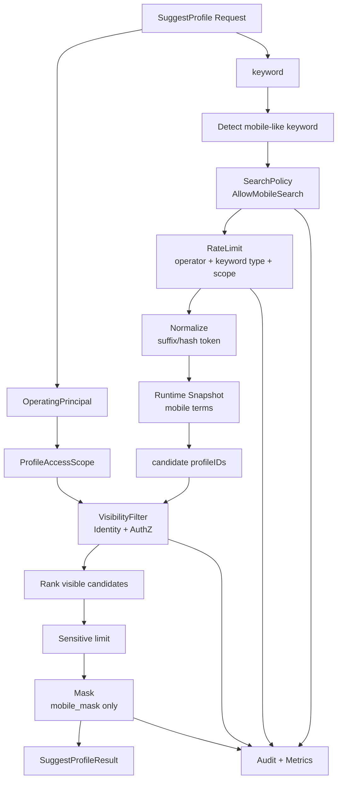

# 安全策略：手机号搜索 / 脱敏 / 限流

> 状态：待补证据 · 第一版正文，待继续按 `domain/suggest`、`application/suggest`、REST/gRPC 契约、AuthZ 可见性过滤、限流中间件、日志脱敏和测试逐项核对。

---

## 1. 本文回答

本文回答 10 个问题：

- 为什么手机号搜索是 Suggest 中的高风险能力？
- `AllowMobileSearch` 应该表达什么语义？
- 手机号形态 keyword 如何识别和归一化？
- 手机号搜索为什么不能绕过 `ProfileAccessScope` 和可见性过滤？
- 为什么响应只能返回 `mobile_mask`，不能返回明文 `mobile`？
- Store / Index 为什么不能直接调用 AuthZ？
- 手机号搜索需要哪些限流、审计、指标和日志脱敏？
- 手机号后四位、完整手机号、疑似证件号数字串应如何区别治理？
- 手机号搜索失败、超频、权限不足、可见性过滤失败时如何处理？
- 修改该链路时应该核对哪些代码和测试？

本文是 Suggest 的安全策略文档，聚焦手机号搜索、脱敏和限流。
SuggestProfile 查询链路见 [03-关键链路-SuggestProfile查询.md](03-关键链路-SuggestProfile查询.md)；
领域模型见 [01-领域模型-ProfileSearchTerm-ProfileAccessScope-Snapshot.md](01-领域模型-ProfileSearchTerm-ProfileAccessScope-Snapshot.md)；

---

## 2. 30 秒结论

手机号搜索是高风险能力，必须同时满足：

```text
权限允许；
范围受限；
候选可见；
结果脱敏；
频率受控；
行为可审计；
指标可区分。
```

核心链路：

```text
keyword
  -> detect mobile-like keyword
  -> check AllowMobileSearch
  -> normalize / suffix / hash token
  -> match mobile index terms
  -> ProfileAccessScope filter
  -> AuthZ / Identity visibility filter
  -> rank visible candidates
  -> limit with stricter cap
  -> return mobile_mask only
  -> audit + metrics
```

最重要的边界：

```text
AllowMobileSearch 只允许“使用手机号索引命中候选”，不代表候选可见；
手机号搜索不能绕过 ProfileAccessScope；
手机号搜索不能绕过 AuthZ / Identity 可见性过滤；
响应 DTO 不应包含明文 mobile；
Store / Index 不应直接调用 AuthZ；
ProfileLink 不是 ProfileAccessScope；
手机号搜索必须限流和审计。
```

如果只记一句话：

> 手机号搜索只能扩大“可匹配方式”，不能扩大“可见范围”。

---

## 3. 为什么手机号搜索高风险

手机号具有强识别性和强枚举风险。

风险包括：

```text
通过手机号后四位枚举儿童档案；
通过完整手机号确认某个 Profile 是否存在；
通过结果数量推测无权限 Profile；
通过未脱敏响应泄露监护人或儿童联系方式；
通过日志泄露原始手机号；
通过高频请求撞库；
通过先 limit 后过滤造成结果数量侧信道；
通过 Store 层绕过 application 可见性过滤。
```

因此手机号搜索必须作为安全敏感能力单独治理。

---

## 4. 核心概念

| 概念 | 一句话 | 边界 |
| --- | --- | --- |
| `MobileLikeKeyword` | 疑似手机号或手机号片段的 keyword | 不是一定合法手机号 |
| `AllowMobileSearch` | 是否允许本次查询使用手机号索引 | 不等于授权通过 |
| `mobile_suffix` | 手机号后几位索引 token | 不应单独作为可见性依据 |
| `mobile_hash` | 手机号 hash/HMAC token | 不应对外返回 |
| `mobile_mask` | 脱敏手机号展示值 | 只能用于响应展示 |
| `ProfileAccessScope` | 查询可见范围输入 | 不是 ProfileLink，也不是授权通过 |
| `VisibilityFilter` | AuthZ/Identity 可见性过滤 | 必须在返回前执行 |
| `RateLimitKey` | 限流维度 | 应包含操作者、scope、keyword 类型等 |

---

## 5. 安全链路总览



读图规则：

```text
先识别 keyword 是否手机号形态；
手机号形态必须检查 AllowMobileSearch；
命中手机号索引前应执行限流策略；
手机号索引只产生候选 profileIDs；
候选必须经过 ProfileAccessScope 和 AuthZ/Identity 可见性过滤；
只对 visible candidates 排序和 limit；
响应只返回 mobile_mask；
审计和指标必须能区分普通搜索与手机号搜索。
```

---

## 6. AllowMobileSearch 语义

`AllowMobileSearch` 建议表达：

```text
当前操作者在当前场景下，是否允许使用手机号相关索引词条进行候选匹配。
```

它不表达：

```text
当前操作者可以看到所有手机号命中的 Profile；
当前操作者可以查看明文手机号；
当前操作者可以绕过 ProfileAccessScope；
当前操作者可以绕过 AuthZ Check；
当前操作者可以无限频搜索手机号；
当前操作者可以下载手机号列表。
```

正确链路：

```text
AllowMobileSearch == true
  -> allow matching mobile_suffix/mobile_hash terms
  -> still apply ProfileAccessScope
  -> still apply VisibilityFilter
  -> return mobile_mask only
```

错误链路：

```text
AllowMobileSearch == true
  -> return all matched profiles
```

---

## 7. 手机号形态识别

手机号形态 keyword 包括但不限于：

```text
完整手机号；
手机号后四位；
连续数字串；
带空格、横线、国家码等格式的手机号；
疑似手机号片段；
```

建议识别维度：

| 类型 | 示例 | 风险 | 建议策略 |
| --- | --- | --- | --- |
| 完整手机号 | `13812345678` | 极高 | 需要 AllowMobileSearch、限流、审计、hash/exact token |
| 手机号后四位 | `5678` | 高 | 需要 AllowMobileSearch、更小 limit、范围限制 |
| 连续数字串 | `123456` | 中高 | 根据长度和形态分类 |
| 带格式手机号 | `138 1234 5678` | 极高 | 归一化后按完整手机号处理 |
| 疑似证件号 | `370...` | 极高 | 应进入证件号策略，不应误当普通手机号搜索 |

注意：

```text
手机号形态识别应该在 Query normalization 阶段完成；
识别结果应进入 SearchPolicy、RateLimit、Audit 和 Metrics；
日志不应记录原始手机号 keyword；
疑似证件号数字串不能按普通数字搜索放行。
```

---

## 8. 手机号索引策略

手机号不应作为明文全文索引随意保存。

建议索引策略：

```text
mobile_suffix：手机号后四位或后 N 位；
mobile_hash：标准化手机号的 hash/HMAC；
mobile_last_seen_version：索引来源版本，可选；
mobile_sensitive_level：敏感等级；
```

不建议：

```text
保存完整明文手机号作为普通 contains 索引；
在日志中打印 mobile term；
把 mobile_hash 返回给客户端；
把 mobile_suffix 当作权限依据；
使用可逆加密值作为搜索 token 后随意暴露。
```

关键边界：

```text
手机号索引只用于候选匹配；
手机号索引不是 Profile 主数据；
手机号索引不是权限事实源；
手机号索引丢失应能从 Identity Profile 重建；
手机号索引结果必须继续可见性过滤。
```

---

## 9. 查询流程

手机号搜索主线：

```text
SuggestProfile(keyword)
  -> detect MobileLikeKeyword
  -> evaluate SearchPolicy.AllowMobileSearch
  -> apply RateLimit
  -> normalize to mobile_suffix/mobile_hash query
  -> match Runtime Snapshot
  -> candidate profileIDs
  -> ProfileAccessScope filter
  -> AuthZ / Identity visibility filter
  -> rank visible candidates
  -> apply sensitive limit
  -> mask mobile
  -> return results
```

关键规则：

```text
AllowMobileSearch=false 时，不应命中手机号索引；
可以继续按非手机号词条搜索，还是直接拒绝，取决于 Query 类型和产品策略；
候选 profileIDs 不能直接返回；
filter 失败时 fail closed；
limit 必须作用于 visible candidates；
mask 失败时不能返回明文兜底。
```

---

## 10. ProfileAccessScope 边界

手机号搜索不能绕过 `ProfileAccessScope`。

正确关系：

```text
MobileLikeKeyword
  -> mobile index candidate profileIDs
  -> ProfileAccessScope restricts search domain
  -> AuthZ / Identity filters visibility
  -> result
```

错误关系：

```text
MobileLikeKeyword
  -> mobile index candidate profileIDs
  -> return directly
```

关键边界：

```text
ProfileAccessScope 是本次搜索范围输入；
ProfileAccessScope 不是 ProfileLink；
ProfileAccessScope 不是 AuthZ Scope 本体；
ProfileAccessScope 不等于授权通过；
手机号权限不能扩大 ProfileAccessScope；
手机号搜索只能在既定 scope 内查找。
```

---

## 11. ProfileLink 边界

`ProfileLink` 是 Identity 的身份关系事实。

它可以用于：

```text
判断 user 与 profile 是否存在关联；
作为可见性过滤事实输入；
辅助构造 linked_profiles 范围。
```

它不应该被当成：

```text
ProfileAccessScope 本体；
AuthZ RoleBinding；
手机号搜索授权开关；
返回结果的唯一安全依据。
```

正确关系：

```text
ProfileAccessScope(linked_profiles)
  -> Identity.ProfileLink facts
  -> visible profileIDs
```

错误关系：

```text
ProfileLink exists
  -> bypass mobile search policy
```

---

## 12. AuthZ 调用边界

Store / Index 不应直接调用 AuthZ。

原因：

```text
Store 是数据访问或索引访问组件；
AuthZ Check 是应用用例层的安全决策；
让 Store 调 AuthZ 会导致依赖方向倒置；
会让测试和审计困难；
会让不同查询路径安全策略不一致；
会把权限逻辑埋进基础设施层。
```

推荐分层：

```text
application/suggest
  -> search index store: get candidates
  -> visibility filter service: AuthZ / Identity filter
  -> rank / limit / mask
```

禁止：

```text
infra/suggest store
  -> AuthZ Check
```

边界规则：

```text
Store 只返回候选；
Application 负责编排可见性过滤；
AuthZ 通过 application port 或 filter service 使用；
Domain 不依赖 AuthZ concrete；
Infra 不直接依赖 AuthZ application concrete，除非通过明确 adapter 且符合架构测试。
```

---

## 13. 脱敏策略

响应只返回 `mobile_mask`。

字段策略：

| 字段 | 是否允许对外返回 | 说明 |
| --- | --- | --- |
| `mobile` | 禁止 | 明文手机号不得进入响应 DTO |
| `mobile_mask` | 允许 | 例如 `138****5678`，具体策略以代码为准 |
| `mobile_suffix` | 默认禁止 | 容易被拼接和枚举 |
| `mobile_hash` | 禁止 | 内部匹配 token，不对外暴露 |
| `match_reason=mobile` | 谨慎 | 对外最好隐藏或粗粒度表达 |

Mask 规则要求：

```text
mask 函数必须可测试；
mask 失败时不能返回明文；
DTO 不应包含明文 mobile 字段；
日志也应使用 mobile_mask 或 hash；
不同调用方如需不同展示策略，必须经权限和产品策略明确控制。
```

---

## 14. 限流策略

手机号搜索必须限流，防止枚举。

建议限流维度：

```text
operatorID；
operatorType；
tenantID / organizationID；
clientID / appID；
IP；
keywordType；
scopeType；
```

建议限流分层：

| 层级 | 说明 |
| --- | --- |
| 用户级 | 同一操作者每分钟手机号搜索次数 |
| IP 级 | 防匿名或异常来源撞库 |
| 组织级 | 防某组织下批量枚举 |
| 关键词级 | 同一手机号/后四位重复查询频率 |
| 全局级 | provider 或系统保护阈值 |

高敏感策略：

```text
完整手机号搜索比姓名搜索更严格；
后四位搜索比完整手机号更容易产生大量候选，应限制更小 limit；
失败和空结果也计入限流；
被限流时不应透露是否有匹配结果；
限流事件需要指标和审计。
```

---

## 15. 审计与指标

手机号搜索应可审计。

建议审计字段：

```text
operatorType；
operatorID hash；
tenantID / organizationID；
keywordType；
keywordHash；
scopeType；
AllowMobileSearch result；
candidateCount；
visibleCount；
resultCount；
rateLimit result；
snapshotVersion；
traceID；
```

禁止审计字段：

```text
明文手机号；
明文证件号；
完整 raw keyword；
完整 search token；
完整 AuthN token；
无权限 Profile 的明细。
```

建议指标：

```text
suggest_mobile_search_total；
suggest_mobile_search_allowed_total；
suggest_mobile_search_denied_total；
suggest_mobile_search_rate_limited_total；
suggest_mobile_search_candidate_count；
suggest_mobile_search_visible_count；
suggest_mobile_search_result_count；
suggest_mobile_search_duration_seconds；
suggest_mobile_search_mask_failure_total；
suggest_mobile_search_visibility_filter_failure_total；
```

---

## 16. 失败边界

| 场景 | 期望行为 | 说明 |
| --- | --- | --- |
| AllowMobileSearch=false | 禁止手机号索引命中或返回拒绝 | 策略必须明确 |
| keyword 疑似手机号但权限不足 | 拒绝或降级非手机号搜索 | 不能偷偷命中手机号索引 |
| 限流命中 | 返回 429 或空结果策略 | 不泄露是否匹配 |
| Snapshot 不可用 | degraded empty / 503 | 不能绕过过滤查主库明文 |
| VisibilityFilter 失败 | fail closed | 不返回候选 |
| AuthZ 不可用 | fail closed 或最小安全范围 | 策略必须明确 |
| Identity facts 不可用 | fail closed | 不返回未过滤结果 |
| mask 失败 | 删除字段或返回错误 | 不返回明文 |
| DTO 意外包含 mobile | 契约测试失败 | 阻断发布 |
| 日志脱敏失败 | 降低日志细节或拒绝记录敏感值 | 不打印原文 |

---

## 17. 与 SuggestProfile 查询链路的关系

手机号安全策略嵌入 SuggestProfile 查询链路。

```text
SuggestProfile Query
  -> Query detect mobile-like keyword
  -> SearchPolicy / AllowMobileSearch
  -> RateLimit
  -> mobile index match
  -> VisibilityFilter
  -> rank / limit
  -> mask mobile
  -> result
```

边界：

```text
手机号策略不是独立查询入口绕过主链路；
手机号策略必须复用主链路的 ProfileAccessScope 和 VisibilityFilter；
手机号策略只改变 matching 和安全治理，不改变可见性事实源。
```

---

## 18. 与索引刷新链路的关系

索引刷新负责构建手机号相关 search terms。

```text
Identity Profile mobile
  -> normalize mobile
  -> build mobile_suffix / mobile_hash terms
  -> write SuggestSnapshot
```

边界：

```text
索引刷新不判断当前用户是否能搜索手机号；
索引刷新不调用 AuthZ；
索引刷新只构建安全 token；
是否允许使用手机号 token 查询，由查询链路的 SearchPolicy 决定；
索引中不应保存不必要的明文手机号。
```

---

## 19. 与其他模块的边界

### 19.1 与 Identity

```text
Identity 是手机号主数据来源；
Suggest 可以从 Identity 派生 mobile_suffix/mobile_hash；
Suggest 不修改 Identity mobile；
Suggest 不把索引 mobile token 当主数据；
ProfileLink 可参与可见性过滤，但不是手机号搜索开关。
```

### 19.2 与 AuthZ

```text
AuthZ 负责授权判断；
AllowMobileSearch 可以来自 AuthZ policy 或 application policy，具体以实现为准；
Store 不直接调用 AuthZ；
Application 编排 AuthZ/Identity 可见性过滤；
手机号搜索不能绕过 Role/Permission/RoleBinding/Check。
```

### 19.3 与 AuthN

```text
AuthN 提供 Principal；
Suggest 转换为 OperatingPrincipal；
手机号搜索不校验 Credential / Challenge；
手机号搜索不签发 Token；
日志不记录完整 AuthN token。
```

### 19.4 与 IDP

```text
IDP 不参与手机号搜索；
ExternalIdentity 不是手机号搜索依据；
provider phone claim 如需进入 Identity mobile，必须先经 Identity 明确用例；
IDP 不直接写 Suggest mobile index。
```

---

## 20. 常见反模式

| 反模式 | 问题 | 推荐做法 |
| --- | --- | --- |
| AllowMobileSearch=true 就返回全部手机号命中 | 权限扩大 | 仍需 scope 和可见性过滤 |
| 手机号搜索绕过 ProfileAccessScope | 越权 | 手机号搜索只能在 scope 内命中 |
| Store 直接调用 AuthZ | 依赖倒置，安全逻辑下沉 | Application 编排 AuthZ filter |
| ProfileLink 当搜索 scope | 概念混淆 | ProfileLink 是 Identity 事实，Scope 是查询输入 |
| 响应 DTO 包含 mobile | 敏感泄露 | 只返回 mobile_mask |
| 日志打印 raw keyword | 敏感泄露 | hash/fingerprint 记录 |
| 后四位搜索不设限 | 枚举风险 | 更小 limit + 更严格限流 |
| mask 失败返回原手机号 | 严重泄露 | 删除字段或返回错误 |
| AuthZ 不可用时放行 | 越权 | fail closed 或最小安全范围 |
| 先 limit 再 filter | 结果侧信道和体验问题 | 先 filter visible，再 limit |

---

## 21. 代码事实源

| 事实 | 路径 |
| --- | --- |
| Suggest domain | `../../../internal/apiserver/domain/suggest` |
| AllowMobileSearch / SearchPolicy | `../../../internal/apiserver/domain/suggest`、`../../../internal/apiserver/application/suggest`，具体以代码为准 |
| Query keyword detection | `../../../internal/apiserver/domain/suggest`、`../../../internal/apiserver/application/suggest`，具体以代码为准 |
| Mobile term normalizer | `../../../internal/apiserver/domain/suggest`、`../../../internal/apiserver/application/suggest`，具体以代码为准 |
| Suggest query use case | `../../../internal/apiserver/application/suggest` |
| Visibility filter | `../../../internal/apiserver/application/suggest` |
| Masker | `../../../internal/apiserver/domain/suggest`、`../../../internal/apiserver/application/suggest`，具体以代码为准 |
| Rate limiter | `../../../internal/apiserver/transport/rest`、`../../../internal/apiserver/application/suggest`，具体以代码为准 |
| Suggest index / store | `../../../internal/apiserver/infra` |
| Identity mobile/Profile facts | `../../../internal/apiserver/domain/identity`、`../../../internal/apiserver/application/identity` |
| AuthZ Check/filter | `../../../internal/apiserver/application/authz` |
| Suggest REST transport | `../../../internal/apiserver/transport/rest` |
| Suggest gRPC transport | `../../../internal/apiserver/transport/grpc` |
| REST 契约 | `../../../api/rest` |
| gRPC 契约 | `../../../api/grpc` |
| 架构测试 | `../../../internal/pkg/architecture` |

注意：上表中的具体路径需要继续与当前源码核对。如果源码目录已调整，应以代码为准并同步更新本文。

---

## 22. Verify

修改本文后至少执行：

```bash
make docs-hygiene
```

涉及 Suggest 领域模型和安全策略：

```bash
go test ./internal/apiserver/domain/suggest/...
```

涉及 Suggest 查询、可见性过滤、脱敏和限流策略：

```bash
go test ./internal/apiserver/application/suggest/...
```

涉及索引、store、normalizer：

```bash
go test ./internal/apiserver/infra/...
```

具体路径以当前代码为准。

涉及 Identity/AuthZ/AuthN/IDP 边界：

```bash
go test ./internal/apiserver/domain/identity/...
go test ./internal/apiserver/application/identity/...
go test ./internal/apiserver/domain/authz/...
go test ./internal/apiserver/application/authz/...
go test ./internal/apiserver/domain/authn/...
go test ./internal/apiserver/domain/idp/...
```

涉及 REST/gRPC 契约或 transport：

```bash
make api-validate
make proto-gen
go test ./internal/apiserver/transport/rest/...
go test ./internal/apiserver/transport/grpc/...
```

涉及 SDK：

```bash
go test ./pkg/sdk/...
```

涉及分层依赖或模块边界：

```bash
go test ./internal/pkg/architecture
```

---

## 23. 本文总结

手机号搜索安全链路可以压缩成：

```text
keyword
  -> detect mobile-like keyword
  -> check AllowMobileSearch
  -> normalize / suffix / hash token
  -> match mobile index terms
  -> ProfileAccessScope filter
  -> AuthZ / Identity visibility filter
  -> rank visible candidates
  -> limit with stricter cap
  -> return mobile_mask only
  -> audit + metrics
```

最重要的边界是：

```text
AllowMobileSearch 只允许“使用手机号索引命中候选”，不代表候选可见；
手机号搜索不能绕过 ProfileAccessScope；
手机号搜索不能绕过 AuthZ / Identity 可见性过滤；
响应 DTO 不应包含明文 mobile；
Store / Index 不应直接调用 AuthZ；
ProfileLink 不是 ProfileAccessScope；
手机号搜索必须限流和审计。
```

下一篇应继续编写模块边界文档，系统说明 Suggest 与 Identity、AuthZ、AuthN、IDP、Index infra 的职责隔离和跨模块协作方式。
