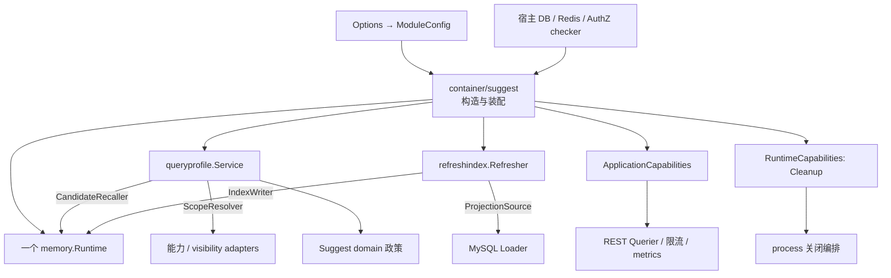

# Suggest 模块边界：实际装配、替换合同与修改索引

> 状态：已实现 · 本文维护源码导航、装配/资源责任和修改验收；算法及一致性细节回链主文，候选设计不代表已实施。

## 1. 先明确修改应该落在哪里

Suggest 从 Identity 事实构建候选投影，消费 AuthZ 能力，在本次查询中形成 Scope、执行准入/选择/披露。它拥有搜索政策与派生状态，不回写 User、Profile 或 ProfileLink，也不授予详情操作权限。

当前通过端口隔离技术，但标准 container 直接构造 MySQL Loader、memory Runtime 和 Prometheus Recorder；没有 `index.backend`、source/writer factory 或运行中切换机制。“实现接口后可重新装配”不等于只改配置就能替换后端。

| 修改意图 | 首先判断的责任 | 详细正文 |
| --- | --- | --- |
| 谁能搜、号码表示、候选是否合法或怎样披露 | domain政策及输入事实，而非树/handler中的角色分支 | [模型与端口](01-模型与应用端口.md) |
| 哪些源变化进入投影、删除/重放/游标与发布 | ProjectionSource、Refresher、IndexWriter各自合同 | [Full/Delta刷新](02-关键链路-索引刷新Full-Delta.md) |
| 请求优先级、通配/预算、输出与空结果 | transport门禁、Service编排、adapter召回及领域选择 | [查询链路](03-关键链路-SuggestProfile查询.md) |
| 配置进入哪个对象、谁持有资源、怎样换实现 | 本篇的输入→装配→能力出口→生命周期 | 本文 |
| 为什么采用派生索引而非主表查询 | 问题约束与替代方案 | [读模型专题](../../06-专题设计/05-Suggest为什么是读模型.md) |

## 2. 所有权与实际持有者

| 事实/对象 | 所有权和标准调用责任 | 不应据此推导的保证 |
| --- | --- | --- |
| Identity主表、关系及号码 | Identity维护；MySQL Loader只读取并派生 | 关系撤销不等于本次候选即时消失 |
| IAM UserID / JWT业务Org | AuthN验证；REST复制为Principal | 未重验QS Operator或当前组织成员 |
| Resource/Action能力 | AuthZ checker提供；FactsReader转为bool | 无共同PolicyVersion、未读取Assignment Scope |
| SuggestibleProfile / Scope / 查询策略 | Suggest domain表达最小形状和局部规则 | 构造合法不证明源资格/当前范围 |
| Runtime / Store | infra实现可丢弃索引；标准Refresher为现行写入者 | Runtime/Store仍有公开mutation方法，接口不禁止其他writer |
| DB / Redis client | 宿主创建并借给module/adapter | Suggest Cleanup不关闭借入连接池 |
| Querier / Refresher / Limiter / Cron | SuggestModule持有并组装 | initialized/available不证明正在调度或索引新鲜 |
| Prometheus collectors | metrics包级collector，Recorder为无状态值 | 不是每个module独立registry |
| REST DTO / envelope | transport映射ResultItem | 字段名或schema不强制所有自定义实现脱敏 |

在 `InitializeWithDeps` 中，Runtime是局部对象：同一指针注入Service的 CandidateRecaller与Refresher的 IndexWriter；module不保存/导出Runtime字段，也没有对外刷新管理出口。标准查询与刷新因此共享一个索引，替换时必须保持这条读写绑定，不能误接到两个彼此独立的实例。

## 3. 输入、装配与能力出口

### 3.1 实际构造链

```text
pkg/app: 读选择的配置文件 / BindPFlags / Unmarshal / Complete / Validate
  -> config.CreateConfigFromOptions
  -> container.RuntimeOptionsFromAPIServerOptions
  -> suggest.ModuleConfigFromOptions
  -> moduleGraph.suggestModuleDependencies
  -> NewSuggestModule / InitializeWithDeps
  -> BuildRESTDeps / BuildRuntimeDeps
```

`ModuleConfigFromOptions` 是窄配置转换；DB、Redis、Environment与可空AuthZ checker由moduleGraph借入。SuggestModuleDeps不需要Identity/AuthN module对象：它通过SQL读取Identity事实，认证依赖在REST router另行装配。



图表示标准构造/依赖与导出，不表示每个box都是module字段或独立进程。查询主链、Full发布和并发时序分别由相应主文维护。

### 3.2 三种出口不能混写

| 出口 | 当前内容/消费者 | 门禁与范围 |
| --- | --- | --- |
| ApplicationCapabilities | Querier、RateLimitRecorder、Limiter | 后两接口声明在infra；Go结构接口满足不等于行为等价 |
| CollectREST / BuildRESTDeps | 复制上述引用到REST deps | 按ModuleState.Available；不读取CheckHealth |
| RuntimeCapabilities / CollectRuntime | 仅Cleanup `func() error`，交给process | collector只检查module/输出指针非nil，没有REST同样的Available门禁 |
| CacheFamilyInspectors | 按实际Limiter具体类型提供inspector | custom Limiter不会因满足接口而自动获得inspector |

CollectREST还复制宿主RedisClient到REST deps，但当前REST没有消费该字段；Suggest handler只持有Querier和两个transport小接口。不能画成handler自己创建或调用Redis。BuildRESTDeps复制的是能力引用和状态视图，不是热更新注册/撤回协议。

标准路由要求Suggest可用、Querier与JWT存在；AuthZ可用且middleware存在时再挂 `profiles/search`。底层 Register仅要求非空middleware slice，认证前置和直接application调用不同，详见 [查询入口](03-关键链路-SuggestProfile查询.md#31-标准入口与直接调用有不同合同)。

当前proto、gRPC collector与SDK Client仅有AuthN、Identity、IDP、AuthZ出口，没有Suggest wrapper/service。这是现行源码事实，不是禁止未来新增Suggest协议的永久护栏。

## 4. 端口的签名与替换合同

端口由application消费；标准adapter实现它们。更换实现前应决定以下语义，编译断言只能证明方法集：

| 端口/位置 | 已表达的输入输出 | 替换时必须另定义 |
| --- | --- | --- |
| queryprofile.AuthorizationFactsReader / ScopeResolver | Principal→能力 / Scope | 版本一致、失败/缺端口、当前资格与取消；bool不携带共同版本 |
| queryprofile.VisibilityReader | Principal→ProfileIDs | 事实来源、缓存key/TTL/error、当前资格；扩展关系不能只换SQL |
| queryprofile.CandidateRecaller | Keyword、Intent、CandidateBudget→Candidates | 完整可见属性、Strength、重复/预算/取消；没有Scope、最终limit、续查游标或generation |
| refreshindex.ProjectionSource | Full集合；since时间→Delta变更 | 合格关系/删除事实、唯一ID、提交水位和Full/Delta同政策 |
| refreshindex.IndexWriter | Replace / Apply→error | nil是已受理、完整写入还是已发布可检索；部分/未知结果、代次、并发与Close |
| query/refresh/index/REST metrics | 决策、命令、规模或限流计数 | collector/registry与生命周期；计数不证明发布成功或新鲜 |
| REST RateLimiter | OperatorID、mobile形态→bool | 无ctx/error，不能直接表达请求取消与后端故障原因 |

一个具体失败：远端受理Replace后尚未可检索，adapter先返回nil，Refresher便推进游标/成功时间；查询实例可能仍读旧索引。另一个是部分bulk已写后返回error：游标保留不等于远端回滚。应先决定同步完成/可读回执，或扩展异步状态合同，不能仅靠适配现有error签名解决。

取消与部分应用、跨writer交错的当前限制见 [刷新](02-关键链路-索引刷新Full-Delta.md) 和 [查询](03-关键链路-SuggestProfile查询.md)。本篇不复制另一套行为承诺。

## 5. 配置：键、来源、转换与作用阶段

### 5.1 标准输入不等于任意构造入口

标准App在Unmarshal后Complete/Validate；`CreateConfigFromOptions` 只ApplyDefaults，RuntimeOptions转换也不调用Validate。直接调用转换器、构造ModuleConfig或领域策略，不能借用完整CLI校验的保证。

标准加载选择一个配置文件，未自动合并 `configs/suggest.prod.yaml`。程序NewSuggestOptions默认Enable/Required=false、Full1h、MaxResults20、KeyPadLen25；主 `apiserver.prod.yaml` 与独立Suggest示例的启用/调度值不同，它们也都不是当前部署证明。

AutomaticEnv只证明已知键的Get可以读取环境覆盖。当前Suggest没有独立flags/BindEnv/SetDefault，锁定Viper v1.20.1默认构建的Unmarshal先取AllKeys，再逐键Get：若键未由YAML/注册来源登记，仅设置对应env不保证进入Options。例如YAML未含required或注释掉rate_limit时，不能仅凭env名称推断它已生效。此为源码推论，未做新增env-only实验；固定retired env的LookupEnv拒绝不依赖该枚举。

### 5.2 键到内部对象

下表前缀为 `suggest.`，默认/关闭语义限定ModuleConfigFromOptions及标准装配；请求行为仍由Service/adapter决定。

| 外部键 | 映射/默认与作用 | 内部归属 |
| --- | --- | --- |
| enable | fresh module为false时跳过初始化，不导出Querier | container |
| required | 初始Full/Cron错误返回或内部降级；readiness另用它判断组件错误 | container / readiness |
| full_sync_cron | 精确空字符串在转换器补 `@every 1h`；直接ModuleConfig不补 | container |
| delta_sync_cron | 空字符串关闭调度，不表示DeltaSQL禁用 | container |
| max_results | ≤0补20 | queryprofile.Config.MaxResults |
| internal_max_results | ≤0补MaxResults×10，至少MaxResults | queryprofile.Config.CandidateBudget |
| key_pad_len | ≤0补25；是最短padding长度 | memory.Config |
| trie_wildcard_key_cap | ≤0补100；当前局部递归阈值，不是硬全局扫描上限 | memory.Config |
| full_sql / delta_sql | 空值分别用内建SQL，互相独立 | MySQL LoaderConfig |
| loader_placeholder_org_id | 默认投影组织占位，0不虚构组织；不读取成员事实 | MySQL LoaderConfig |
| visibility_cache_ttl_seconds | ≤0不缓存 | visibility.Config |
| disable_mobile_mask | 默认false；enabled标准module的production guard拒绝true | query / container |
| rate_limit.per_operator_qps | ≤0关闭整套限流 | ratelimit.Config |
| rate_limit.per_operator_burst | 非正补max(5,ceil(2×普通QPS)) | ratelimit.Config |
| rate_limit.mobile_keyword_per_operator_qps / mobile_keyword_per_operator_burst | mobileQPS非正回退普通；Burst非正补max(3,ceil(2×mobileQPS)) | ratelimit.Config |
| rate_limit.backend | 仅trim后redis（大小写不敏感）选Redis；无client回落memory，其他值也选memory | limiter factory |
| rate_limit.operator_map_max_entries | 非正补10000；两张memory map各受限 | memory limiter |

当前没有统一Suggest键/range/cron/backend校验；Cron在初始Full后注册才可能报错，`backend=rdeis` 不会被factory当未知枚举报错。直接Service/Runtime/Limiter也各有构造默认，不能把本表当所有入口的统一约束。两种限流算法、Full/Delta来源错配与生产mask适用范围回链各主文。

### 5.3 退役配置有不同拒绝路径

| 旧键 | YAML路径 | 环境路径 |
| --- | --- | --- |
| data_dir / snapshot | decode-only pointer tombstone；Validate只判非nil，不因指向空字符串/false免检（源码分支）；已有YAML测试仅含路径/true | 固定env名LookupEnv，存在即拒绝 |
| loader_placeholder_tenant_id | 无字段/tombstone；标准非Exact Unmarshal可忽略的源码推论。配置测试只禁止仓库两份主YAML含该键 | 固定旧env名LookupEnv，存在即拒绝，提示OrgID替代 |

因此“删除字段”与“所有输入fail closed”不同。typed转换还会丢掉tombstone，绕过App Validate的caller自行承担检查。候选是统一严格键与取值校验、明确env登记、启动I/O前校验Cron，并把测试限定到各输入路径；本轮未实施。

## 6. 可用、健康、治理与关闭各证明什么

| 观察 | 当前判断 | 不覆盖的状态 |
| --- | --- | --- |
| IsInitialized | module及Querier非nil | DegradedQuerier也成立；不证明正常查询/调度 |
| Available | 容器已bootstrap且已保存初始化module | 不读取CheckHealth，不能据此认定索引新鲜 |
| 初始optional Full/Cron失败 | module换DegradedQuerier并返回nil | 内部错误未写为bootstrap失败，Available仍可true |
| CheckHealth | enabled时Querier存在且Refresher曾Full/Delta成功 | 不查Cron running、最近错误、索引age或实例generation；Cleanup不清这些值 |
| rate-limit family inspect | memory直接healthy；Redis仅Ping，EntryCountKnown=false | 不查实际配额、visibility cache、索引规模/新鲜度 |
| Cleanup返回 | cancel自身ctx、Stop Cron并等运行任务 | 无自身超时、不清空索引/缓存/桶、不关闭借入DB/Redis |

Required只控制module部分初始化错误和readiness组件判定，不是全局模式策略：DB缺失/production明文配置无论Required均报错；容器错误最终是否允许继续由process的degraded/reliable规则决定。optional组件健康错误通常只degraded，但readiness总预算耗尽仍能overall not_ready。具体成功Full后Cron失败、无调度却health成功的情境见 [刷新主文](02-关键链路-索引刷新Full-Delta.md)。

静态catalog列两种可选限流family，只有实际具体MemoryLimiter/RedisLimiter注册inspector；未注册的catalog项显示未配置/不健康。自定义Limiter无自动inspector，可见性缓存/Store也不是现有注册family；Redis选择但缺client后的治理面应显示实际memory，而非配置字面的redis。

关闭还要追到宿主：policy/reliable drain先作为资源保留门禁；通过后执行lifecycle hooks→Suggest→Identity→DB→HTTP/gRPC。Suggest Cleanup error由通用step记录并继续，不能仅靠返回error获得前述资源门禁。停止Cron也不证明在途索引发布/HTTP查询已排空，详细次序归 [后台与关闭](../../01-运行时/03-后台任务就绪与优雅关闭.md)。

新增远端client/exporter时应明确创建者/Close责任与查询排空顺序。借入资源仍归宿主；module自建资源若被在途查询使用，不能直接放在现有停Cron之后关闭并声称安全。若异步adapter失败必须保留宿主资源，应重新设计资源关闭门禁，而不是藏在Cleanup的普通error里。

## 7. 代码地图

以下路径以仓库根为起点；文件名按责任合并，字段/时序正文保持单一来源。

### 7.1 Domain与application

| 目录 | 核心文件与修改职责 |
| --- | --- |
| internal/apiserver/domain/suggest/profile | profile.go：最小投影/可见资源；mobile.go：形态/掩码；disclosure_policy.go：首项披露；profile_test.go：构造清洗、常规号码行为 |
| internal/apiserver/domain/suggest/visibility | principal.go、authorization_facts.go：输入/能力；resource.go、scope.go：可见属性/OR；resolution_policy.go：组合；visibility_test.go：分支样本 |
| internal/apiserver/domain/suggest/search | keyword.go：准入/Intent；candidate.go：Strength；selection_policy.go：过滤/去重/排名；search_test.go：能力准入、Strength优先与高Weight去重 |
| internal/apiserver/application/suggest/queryprofile | ports.go：查询/facts/visibility/scope/metrics；service.go：编排；scope_resolver.go：读事实；authz.go：profiles资源与list/search/search_by_mobile常量，全量动作在facts_reader.go；command.go：Command/ResultItem；config.go：小配置；degraded.go：空结果 |
| internal/apiserver/application/suggest/refreshindex | ports.go：source/writer/metrics；change.go：Upsert/Delete；refresher.go：互斥/游标/成功状态；errors.go：ErrRefreshInProgress；refresher_test.go：受控失败/互斥/游标 |

Application根目录无façade；REST消费Querier，container持有具体Refresher。profile/search测试没有防御复制、所有排序tie/bonus、冲突同ID的完整专项，不能把表里的责任名扩成测试保证。

### 7.2 Infra与协议

| 目录/位置 | 核心文件与修改职责 |
| --- | --- |
| internal/apiserver/infra/mysql/suggest | loader.go：Full/Delta SQL和投影；visibility_reader.go：created_by IDs；loader_test.go/loader_integration_test.go/visibility_reader_test.go：SQL或SQLite证据 |
| internal/apiserver/infra/suggest/index/memory | runtime.go：active Store/Replace/Apply/Recall；store.go：锁/候选/反向key；tst.go：姓名/拼音/首字母；hash.go：ID/mobile key；config.go：adapter配置；metrics_port.go：规模端口 |
| internal/apiserver/infra/suggest/authorization | facts_reader.go：list_all后按分支读mobile bool，不携PolicyVersion |
| internal/apiserver/infra/suggest/visibility | cached_reader.go：OperatorID缓存及error；config.go：TTL |
| internal/apiserver/infra/suggest/metrics | metrics.go：包级Prometheus；recorder.go：query/refresh/index/限流接口适配 |
| internal/apiserver/infra/suggest/ratelimit | limiter.go：factory；memory.go/redis.go：不同算法；config.go：默认转换 |
| internal/apiserver/transport/rest/suggest | handler.go：注册/绑定/调用；principal.go：context输入；dto.go：字符串ID/输出；ports.go：限流小接口；handler_test.go：人工身份下响应 |
| internal/apiserver/transport/rest | deps.go、router.go、module_routes.go：模块状态与JWT/search装配；router_matrix_test.go：已注册路径有规范；router_test.go：缺JWT不挂路由 |
| api/rest/suggest.v2.yaml / internal/apiserver/docs | 手写OAS与生成Swagger；注解来自handler，生成物不由api-validate自动重建 |
| scripts/check-openapi-contracts.py / scripts/check-route-contracts.py | 保存schema/route比较，非完整runtime调用；Suggest item引用/错误状态缺口见查询正文 |

`TestLoaderFullDeltaEquivalenceOnActiveProfile` 实际只执行Full→Recall→Select；SQLite soft-delete/phone fixture也不隔离所有affected入口。代码/测试名称不能代替执行步骤，详细证据归刷新正文。

### 7.3 装配与宿主

| 位置 | 修改职责 |
| --- | --- |
| internal/apiserver/options/runtime_options.go / validation.go | 外部键、程序默认、退役字段/env拒绝 |
| pkg/app/app.go / config.go | 配置加载/Unmarshal/Complete/Validate，不是模块builder |
| internal/apiserver/container/runtime_options.go / module_graph.go | Options转换、借入DB/Redis/AuthZ checker |
| internal/apiserver/container/suggest/config.go / module.go | 窄配置与固定adapter构造、初始Full/Cron/健康/关闭 |
| internal/apiserver/container/suggest/capabilities.go / rest.go / runtime.go / cache_governance.go | 不同出口、collector及具体Limiter inspector |
| internal/apiserver/container/bootstrap_modules.go / module_state.go / readiness.go | 是否保存module、Available与组件就绪 |
| internal/apiserver/container/rest_deps.go / runtime_deps.go / grpc_registry.go | 跨模块能力视图；gRPC无Suggest collector |
| internal/apiserver/process/bootstrap.go / shutdown_lifecycle.go | 模式/启动失败政策与宿主资源顺序 |
| internal/apiserver/cache/catalog.go / application/cachegovernance | 静态描述与inspect聚合，不负责清理 |
| pkg/sdk/client.go | 当前四模块子客户端；没有Suggest出口 |

## 8. 设计依赖方向与现有护栏分开验收

设计方向仍为transport→application→domain、infra实现application端口、container选择具体实现。业务层不应依赖SQL/Gin/Cron/Prometheus/Redis/global options；这些是评审要求，不是当前静态规则全部证明的事实。

[architecture_test.go](../../../internal/pkg/architecture/architecture_test.go) 的Suggest专用检查具体如下：

| 检查 | 实际范围 | 不能扩大成的保证 |
| --- | --- | --- |
| application imports | queryprofile、refreshindex两树，禁本仓infra、os、path/filepath、固定cron包 | 全部文件系统/调度库；新增应用子包自动覆盖 |
| domain技术token | 非测试Go原文Contains，9个固定片段 | 类型/调用归属或所有第三方依赖；注释/字符串也参与 |
| REST imports | 禁infra/suggest前缀 | 同时禁infra/mysql/suggest或所有直接GORM依赖 |
| 根目录/旧路径 | 根目录不得有任何.go；固定字符串/两旧路径检查 | 真实用例一定调用政策，或全部同义旧实现均被拒绝 |
| memory metrics | 禁直接import本仓infra/suggest/metrics | 完整禁止直接import Prometheus |
| infra options | infra/suggest树，禁精确options import | 覆盖infra/mysql/suggest及所有全局配置来源 |
| retired numeric Tenant | 四固定文件、三个原文片段 | 全仓AST字段/语义检查；错误提示的TenantDomain不是现行模型依据 |

递归helper排除_test.go，解析匹配文件但不按build tag筛选、不做类型/调用图；根目录.go检查另包含测试文件。共享Domain/Application规则补充本仓infra/transport、GORM等禁令，仍不能据测试名称宣称所有技术依赖已隔离。

若要把设计要求升为完整护栏，先扩扫描树和导入匹配，再给规则失败样本；行为准入/发布/取消仍需用例证明。职责划分的合理性不能由目录、interface或固定字符串单独判定，详见 [架构护栏](../../05-工程质量与运维/01-架构护栏与分层验证.md)。

## 9. 换共享索引时怎样保持边界

以Elasticsearch为候选，新增adapter实现CandidateRecaller与IndexWriter只是起点，还要改module/config装配、资源管理和健康定义；DSL留在adapter，领域仍维护Keyword/Intent、Scope、Candidate与选择/披露。

### 9.1 先选择发布者模型

当前每个启用进程启动都Full，同一Refresher的TryLock只约束本实例。直接共享alias时可能A读旧基线、B发布新基线、A晚发布旧基线；本地互斥或单纯分布式lease不能防过期owner晚到发布。

| 候选 | 具体合同 | 成本 |
| --- | --- | --- |
| 单发布者、多查询实例 | 发布者持代次栅栏、按来源水位重建/增量；查询实例从共享generation/可读状态就绪 | 接管/恢复与发布者可用性；不能沿用“本地Refresher曾成功” |
| 多发布者、独立构建后条件发布 | 每次构建独立generation，发布比较当前代次并拒绝旧owner；Full/Delta绑定同generation与衔接水位 | 条件发布、清理未发布索引与跨代重放更复杂 |

两条路线都要明确Replace/Apply nil的可读完成含义、bulk部分/未知结果重试和旧tombstone拒绝。时间since本身不提供提交水位，不能把远端索引增加后自动视为同步可靠。

### 9.2 切换与验收

先对同一组事实构建两个backend，双读固定样本比较可见ID、字段/Strength、预算/重复、排序与披露；只比较最终条数会掩盖范围差异。新增远端持久化也改变隐私边界：索引字段/访问和诊断输出、号码精确键与披露材料分别设计，不能笼统承诺“加密字段仍保留原查询”。号码规范化/命名空间或盲索引还涉及Intent兼容与密钥轮换，另按模型合同评审。

随后验收旧新Full交错、部分/未知写入恢复、alias已切但读取未可见、旧generation的Delta、取消/关闭在途任务。确认读取与发布状态后再切能力，保留可回到旧后端的路由及当前资格合同；回退读旧索引仍可能带入年龄/撤销窗口，不能只凭旧进程存活接受。

Scope预过滤/排名下推若需要扩端口，须说明事实版本、扫描停止、续查游标与Store切换；提高预算不是全库top-k证明。上述为候选设计，当前没有共享索引、后台恢复或发布代次实现。

## 10. 按变化选验证，不把绿色当全体验收

| 变化 | 首要证据 | 当前测试盲区 |
| --- | --- | --- |
| domain/应用政策与端口 | 受影响domain/application回归、architecture及区分规则的样本 | 编译/import/token不证明行为等价 |
| 配置/装配/生命周期 | config、container/suggest、父container/process相应测试 | converter测试非CLI全链；development fixture可降级；callback顺序非真实Cron有界退出 |
| REST出口/门禁/DTO | 父transport/rest、suggest handler及相关middleware；契约变更同步生成物/OAS | route matrix只核已注册path有规范，不发HTTP或验证JWT/search |
| SQL/索引/缓存/限流 | 相关adapter、refresh/query与装配回归；必要的真实后端证明 | SQLite/miniredis/替身不替代MySQL/Redis故障、跨进程与旧owner撤销 |
| 纯文档 | docs-hygiene / docs-facts / validator | 链接/固定事实检查不证明全文语义与线上行为 |

父BuildRESTDeps测试放入空SuggestModule却不对Suggest出口断言；GRPC固定字符串护栏也没有实际编译/启动所有服务。Suggest模块development测试仅断言返回/IsInitialized，fixture缺内建SQL需要的revoked_at，会optional降级；health测试只验证disabled或无刷新成功。cache governance测试仅覆盖直接memory与无limiter，未证明Redis probe/fallback/custom行为。

`api-validate` 执行Spectral/警告基线、保存的Swagger/OAS比较、双向advertised routes及上述单向实际注册检查；它不重新生成Swagger。`docs-facts` 另检查配置/装配token及查询正文隐私短语，不启动模块或执行真实搜索。当前CI配置和本轮执行结果分别取证。

完整Suggest相关回归可按影响执行：

```bash
go test -race -count=1 \
  ./internal/apiserver/domain/suggest/... \
  ./internal/apiserver/application/suggest/... \
  ./internal/apiserver/infra/suggest/... \
  ./internal/apiserver/infra/mysql/suggest/... \
  ./internal/apiserver/transport/rest/suggest/... \
  ./internal/apiserver/container/suggest/...
go test -count=1 ./internal/pkg/architecture/...
make docs-hygiene
make docs-facts
```

改注册时加入父transport/rest；改配置输入时加入config/options/pkg/app相应验证；改机器契约再执行api-validate。本轮实际选择与源码绑定见 [重构记录](../../_data/reviews/2026-10-06-docs-refactor.md)，未将这份命令清单都宣称为本轮已经执行。
