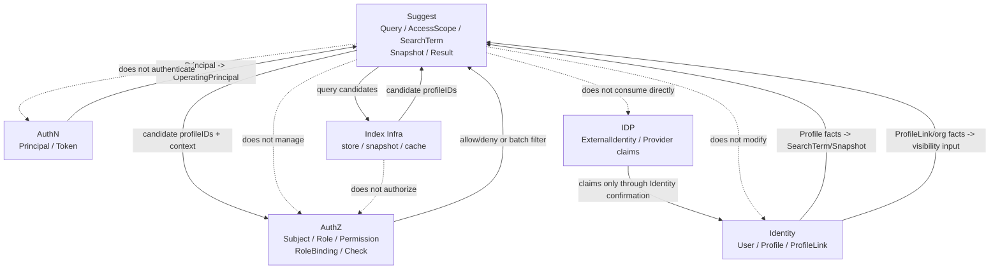

# 模块边界：Suggest 与 Identity / AuthZ

> 状态：规划改造 · 当前边界需以源码 port、组合根和测试为准；`ProfileSuggestionIndex` / `ProfileSuggestItem` 是 application 符号，Suggest gRPC/SDK 不是现行能力。

---

## 1. 本文回答

本文回答 10 个问题：

- Suggest 的模块边界是什么？
- Suggest 与 Identity 如何协作，为什么 `ProfileSearchTerm / ProfileSuggestionIndex` 不是 `Profile` 主数据？
- Suggest 与 AuthZ 如何协作，为什么 `ProfileAccessScope` 不是 AuthZ `Scope` 本体？
- Suggest 与 AuthN 如何协作，为什么 `OperatingPrincipal` 不是 AuthN `Principal` 本体？
- Suggest 与 IDP 如何协作，为什么外部 provider claims 不能直接写 Suggest 索引？
- Suggest 与索引 infra 的边界是什么，为什么 Store / Index 不应直接调用 AuthZ？
- `ProfileLink`、`ProfileAccessScope`、`RoleBinding` 三者最容易混淆的点在哪里？
- 哪些跨模块协作是允许的，哪些属于边界漂移？
- 手机号搜索、脱敏、限流应该放在哪一层治理？
- 修改 Suggest 边界时应该核对哪些代码和测试？

本文重点讲 Suggest 与 Identity / AuthZ 的边界，同时补充 Suggest 与 AuthN、IDP、Index infra 的协作边界。
领域模型见 [01-领域模型-ProfileSearchTerm-ProfileAccessScope-Snapshot.md](01-领域模型-ProfileSearchTerm-ProfileAccessScope-Snapshot.md)；
查询链路见 [03-关键链路-SuggestProfile查询.md](03-关键链路-SuggestProfile查询.md)；
手机号安全策略见 [04-安全策略-手机号搜索-脱敏-限流.md](04-安全策略-手机号搜索-脱敏-限流.md)；

---

## 2. 30 秒结论

Suggest 是 IAM 的 Profile 联想搜索读模型模块。

它只维护和产生：

```text
OperatingPrincipal；
ProfileAccessScope；
Query；
ProfileSearchTerm；
ProfileSuggestionIndex；
ProfileSuggestItem；
搜索候选集；
脱敏展示结果。
```

它不拥有其他模块的写模型：

```text
Identity 负责 User / Profile / ProfileLink；
AuthZ 负责 Subject / Role / Permission / RoleBinding / Check / PolicyVersion；
AuthN 负责 Principal / Credential / Challenge / Session / Token / JWKS；
IDP 负责 WechatApp / Credentials / AppToken / ExternalIdentity；
Index infra 只负责搜索存储和匹配，不负责授权决策。
```

最重要的边界：

```text
ProfileSearchTerm 不是 Profile；
ProfileSuggestionIndex 不是 Profile 主数据；
ProfileAccessScope 不是 ProfileLink；
ProfileAccessScope 不是 AuthZ Scope 本体；
ProfileAccessScope 不等于授权通过；
ProfileLink 不是 RoleBinding；
OperatingPrincipal 不是 AuthN Principal 本体；
索引命中不等于可见；
Store / Index 不应直接调用 AuthZ；
ProfileSuggestItem 不应返回明文手机号或证件号。
```

如果只记一句话：

> Suggest 负责“搜索候选”，Identity 负责“档案事实”，AuthZ 负责“可见性判断”。

---

## 3. 模块边界总图



读图规则：

```text
AuthN 提供 Principal，Suggest 转成 OperatingPrincipal；
Identity 提供 Profile/ProfileLink 等身份事实；
Suggest 从 Identity 派生搜索读模型，但不修改 Identity 主数据；
Suggest 通过 AuthZ Check/filter 做可见性过滤，但不管理 Role/Permission/RoleBinding；
IDP claims 如果要进入搜索字段，必须先经过 Identity 确认；
Index infra 只返回候选，不做授权决策。
```

---

## 4. Suggest 的职责边界

Suggest 负责：

| 能力 | 说明 |
| --- | --- |
| Query 建模 | keyword 校验、归一化、敏感形态识别 |
| OperatingPrincipal 建模 | 将 AuthN Principal 转成搜索操作者引用 |
| ProfileAccessScope 建模 | 表达本次搜索的可见范围输入 |
| ProfileSearchTerm 构建 | 从 Identity Profile 派生搜索 token |
| ProfileSuggestionIndex 构建 | 维护可重建的搜索读模型快照 |
| SuggestProfile 查询 | 命中候选、过滤、排序、截断、脱敏返回 |
| 手机号安全策略 | AllowMobileSearch、脱敏、限流、审计、指标 |
| 索引刷新 | Full / Delta / Snapshot 构建和原子切换 |

Suggest 不负责：

| 不负责 | 所属模块 |
| --- | --- |
| User / Profile / ProfileLink 写模型 | Identity |
| Role / Permission / RoleBinding / PolicyVersion | AuthZ |
| 通用授权策略管理 | AuthZ |
| Credential / Challenge 校验 | AuthN |
| Session / Token / JWKS | AuthN |
| WechatApp / Credentials / AppToken / ExternalIdentity | IDP |
| 微信/企微 provider API 调用 | IDP / infra |
| 明文敏感字段对外展示 | 禁止 |

---

## 5. Suggest 与 Identity

### 5.1 协作关系

Identity 是 Profile 主数据源。

Suggest 从 Identity 消费事实，派生搜索读模型。

```text
Identity Profile
  -> ProfileSearchTerm
  -> ProfileSuggestionIndex
  -> ProfileSuggestItem
```

Identity 还可以提供可见性事实：

```text
ProfileLink；
Profile status；
organization / tenant；
staff assignment，若属于 Identity 或业务事实；
Profile changed event / source version。
```

---

### 5.2 ProfileSearchTerm 不是 Profile

| 概念 | 所属模块 | 含义 |
| --- | --- | --- |
| `Profile` | Identity | Profile 主数据和真实档案事实 |
| `ProfileSearchTerm` | Suggest | 从 Profile 派生出的可搜索词条 |

关键边界：

```text
ProfileSearchTerm 是读模型；
ProfileSearchTerm 不是 Profile 本体；
ProfileSearchTerm 不应成为主数据事实源；
ProfileSearchTerm 不表达授权通过；
ProfileSearchTerm 应能从 Identity Profile 重建；
ProfileSearchTerm 中敏感字段应最小化、脱敏或 hash 化。
```

错误做法：

```text
通过修改 ProfileSearchTerm 来修改 Profile 姓名或手机号；
把 ProfileSearchTerm 当作 Profile 的唯一事实源；
在 ProfileSearchTerm 中保存完整明文证件号并对外返回。
```

---

### 5.3 ProfileSuggestionIndex 不是 Profile 主数据

`ProfileSuggestionIndex` 是某一版本的搜索读模型快照。

它不等于 Identity 的 Profile 表。

边界：

```text
ProfileSuggestionIndex 可以 stale；
ProfileSuggestionIndex 可以重建；
ProfileSuggestionIndex 可以丢弃后从 Identity 重建；
ProfileSuggestionIndex 不应作为权限事实源；
ProfileSuggestionIndex 不应作为 Profile 主数据回写 Identity；
ProfileSuggestionIndex 命中不等于 Profile 对当前操作者可见。
```

正确关系：

```text
Identity Profile committed
  -> ProfileSuggestionIndex eventually refreshed
  -> Query reads snapshot
  -> VisibilityFilter confirms visibility
```

---

### 5.4 ProfileLink 不是 ProfileAccessScope

| 概念 | 所属模块 | 表达事实 |
| --- | --- | --- |
| `ProfileLink` | Identity | User 与 Profile 的身份关系事实 |
| `ProfileAccessScope` | Suggest | 本次搜索的可见范围输入 |

区别：

```text
ProfileLink 回答“这个 User 与这个 Profile 有什么关系”；
ProfileAccessScope 回答“本次搜索希望在哪个范围内找候选”；
ProfileAccessScope 可以使用 ProfileLink 作为过滤事实；
ProfileAccessScope 不能替代 ProfileLink；
ProfileLink 存在也不代表可以绕过手机号搜索策略。
```

正确关系：

```text
ProfileAccessScope(linked_profiles)
  -> load Identity.ProfileLink facts
  -> visible profileIDs
```

错误关系：

```text
ProfileAccessScope == ProfileLink
```

---

### 5.5 Suggest 不修改 Identity 主数据

Suggest 不应执行：

```text
创建 User；
创建 Profile；
修改 Profile 姓名、手机号、证件号；
创建或修改 ProfileLink；
修改监护关系；
修改 Identity 主数据状态。
```

Suggest 可以执行：

```text
读取 Profile 展示字段；
读取 ProfileLink 关系事实；
消费 Profile changed event；
重建搜索索引；
删除或隐藏对应索引项；
返回脱敏展示结果。
```

---

## 6. Suggest 与 AuthZ

### 6.1 协作关系

AuthZ 负责通用授权策略和访问判定。

Suggest 可以通过 AuthZ 做可见性过滤。

```text
candidate profileIDs
  -> AuthZ Check / batch filter
  -> visible profileIDs
```

AuthZ 可以参与：

```text
判断当前操作者是否能搜索某类 Profile；
判断当前操作者是否能查看某个 Profile 候选；
判断当前操作者是否允许使用手机号搜索能力；
判断后台 staff 是否能在 organization scope 下搜索。
```

---

### 6.2 ProfileAccessScope 不是 AuthZ Scope 本体

| 概念 | 所属模块 | 含义 |
| --- | --- | --- |
| `ProfileAccessScope` | Suggest | 搜索请求中的可见范围输入 |
| `Scope` | AuthZ | 授权规则中的范围语义 |

边界：

```text
ProfileAccessScope 可以映射成 AuthZ Check 的 scope/context；
ProfileAccessScope 不是 AuthZ Scope 本体；
ProfileAccessScope 不等于授权通过；
ProfileAccessScope 不应替代 RoleBinding；
ProfileAccessScope 不能直接扩大可见范围。
```

正确链路：

```text
ProfileAccessScope
  -> build AuthorizationRequest context
  -> AuthZ Check/filter
  -> visible candidates
```

错误链路：

```text
ProfileAccessScope=organization
  -> return all organization matched profiles without AuthZ/Identity filter
```

---

### 6.3 Suggest 不管理 Role / Permission / RoleBinding

Suggest 不负责：

```text
创建 Role；
创建 Permission；
创建 RoleBinding；
撤销 RoleBinding；
修改 PolicyVersion；
写 Casbin policy；
管理授权版本传播。
```

Suggest 可以：

```text
调用 AuthZ Check；
调用 AuthZ batch filter；
读取 AuthZ decision；
根据 allow/deny 过滤候选；
记录授权过滤结果的数量和耗时。
```

---

### 6.4 Store / Index 不应直接调用 AuthZ

Store / Index 是 infra 层的数据访问或运行时索引组件。

它只应该负责：

```text
根据 Query 匹配候选 ProfileID；
读取当前 Snapshot；
返回 match metadata；
处理索引存储和缓存细节。
```

它不应该负责：

```text
AuthZ Check；
ProfileLink 判断；
RoleBinding 判断；
手机号搜索授权开关；
业务可见性决策。
```

推荐分层：

```text
application/suggest
  -> index store returns candidates
  -> visibility filter uses Identity/AuthZ
  -> rank / limit / mask
```

原因：

```text
避免 infra 依赖 application/authz；
避免权限逻辑散落在不同 store 实现；
避免绕过审计、限流和安全策略；
保持架构测试可约束。
```

---

## 7. Suggest 与 AuthN

### 7.1 协作关系

AuthN 负责认证结果。

Suggest 使用 AuthN 结果构造搜索操作者。

```text
AuthN Principal
  -> OperatingPrincipal
  -> Suggest Query
```

---

### 7.2 OperatingPrincipal 不是 AuthN Principal 本体

| 概念 | 所属模块 | 含义 |
| --- | --- | --- |
| `Principal` | AuthN | 认证成功后的运行时上下文 |
| `OperatingPrincipal` | Suggest | Suggest 内部搜索操作者引用 |

边界：

```text
OperatingPrincipal 只保留 Suggest 需要的最小身份引用；
OperatingPrincipal 不校验 Credential / Challenge；
OperatingPrincipal 不签发 Token；
OperatingPrincipal 不应携带完整 JWT claims；
Suggest 不解析或验签 Token；
Suggest 不创建 Session。
```

---

### 7.3 Suggest 不负责登录认证

Suggest 不应执行：

```text
登录；
密码校验；
OTP 校验；
JWT 验签；
Session 创建；
RefreshToken 刷新；
Logout；
JWKS 发布。
```

这些属于 AuthN。

---

## 8. Suggest 与 IDP

IDP 负责外部身份源。

Suggest 不负责：

```text
WechatApp；
Credentials；
AppToken；
ExternalIdentity；
provider callback；
微信/企微 API adapter；
openid / unionid / wecom userid 解析。
```

外部 provider claims 如果要影响搜索：

```text
IDP ExternalIdentity / claims
  -> AuthN / Identity 明确用例确认
  -> Identity Profile 主数据或展示字段
  -> Suggest 索引刷新
```

禁止：

```text
IDP adapter 直接写 Suggest index；
Suggest 直接解析 provider proof；
Suggest 直接根据 openid / unionid 返回 Profile；
Suggest 把 ExternalIdentity 当 OperatingPrincipal。
```

---

## 9. Suggest 与 Index Infra

Index infra 负责搜索存储和匹配。

它可以包括：

```text
内存 Snapshot；
MySQL / Mongo / Redis 搜索索引；
倒排索引；
缓存；
Normalizer 技术实现；
Snapshot 原子切换实现。
```

Infra 负责：

```text
存取 ProfileSearchTerm；
存取 ProfileSuggestionIndex；
按 Query 返回 candidate profileIDs；
处理 index store 读写；
处理 cache / snapshot / lock；
技术错误转换。
```

Infra 不负责：

```text
定义 Suggest 领域模型；
决定某个候选是否可见；
执行 AuthZ Check；
读取 AuthN token；
创建 Identity Profile；
管理 RoleBinding；
返回明文手机号。
```

边界：

```text
Index infra 返回的是候选，不是最终结果；
Application 层负责 visibility filter、rank、limit、mask；
Infra 不应绕过 application 直接返回 response DTO。
```

---

## 10. 跨模块协作方式

推荐方式：

| 协作 | 推荐方式 | 说明 |
| --- | --- | --- |
| AuthN -> Suggest | middleware context / Principal mapper | 构造 OperatingPrincipal |
| Suggest -> Identity | `ProfileFactReader` / `ProfileLinkReader` / `ProfileSource` port | 读取 Profile 和关系事实 |
| Identity -> Suggest | profile changed event / rebuild trigger | 刷新搜索索引 |
| Suggest -> AuthZ | `VisibilityChecker` / `BatchProfileAuthorizer` port | 候选可见性过滤 |
| Suggest -> Index | `ProfileSearchIndex` / `SnapshotStore` port | 获取候选和刷新索引 |
| Suggest -> RateLimit | `RateLimiter` port | 手机号等高敏感搜索限流 |
| Suggest -> Audit | `AuditRecorder` port | 搜索审计和安全事件记录 |

禁止方式：

```text
Suggest 直接 import Identity repository concrete；
Suggest 直接 import AuthZ RoleBinding repository concrete；
Index store 直接调用 AuthZ Check；
AuthZ 直接写 Suggest index；
Identity domain 直接依赖 Suggest domain；
IDP adapter 直接写 Suggest index；
transport handler 绕过 application 直接查 index。
```

---

## 11. 允许依赖与禁止依赖

### 11.1 允许依赖

Suggest application 可以依赖：

```text
Suggest domain；
Suggest index/repository port；
Identity fact query port；
AuthZ visibility/check port；
RateLimiter port；
Audit port；
Clock / ID generator；
Masker / Normalizer policy。
```

Suggest infra 可以依赖：

```text
Suggest domain；
数据库 / Redis / search engine concrete；
cache / lock concrete；
serialization concrete。
```

Suggest transport 可以依赖：

```text
Suggest application；
AuthN middleware 注入的 Principal context；
DTO/proto mapper；
错误映射器。
```

---

### 11.2 禁止依赖

Suggest domain 不应依赖：

```text
AuthN domain concrete；
Identity domain concrete；
AuthZ domain concrete；
IDP domain concrete；
transport/rest 或 transport/grpc；
infra repository concrete；
Redis/MySQL client concrete。
```

Suggest application 不应直接依赖：

```text
Identity repository concrete；
AuthZ RoleBinding repository concrete；
AuthN token verifier concrete；
IDP provider adapter concrete；
Suggest infra concrete，除非通过 port；
transport handler；
数据库 client concrete。
```

Suggest infra 不应依赖：

```text
application/authz concrete；
application/authn concrete；
transport/rest；
transport/grpc；
业务 handler。
```

---

## 12. 边界漂移检查清单

如果出现以下变化，需要警惕 Suggest 边界漂移：

```text
Suggest 代码开始创建或修改 Profile；
Suggest 代码开始创建或修改 ProfileLink；
Suggest 代码开始创建 RoleBinding；
Suggest domain import AuthZ concrete；
Index store 直接调用 AuthZ Check；
ProfileAccessScope 被当作授权通过；
ProfileLink 被当作 ProfileAccessScope；
ProfileSuggestionIndex 被当作 Profile 主数据；
搜索索引被当作权限事实源；
响应 DTO 出现明文 mobile/id_no；
手机号搜索不走限流；
IDP claims 直接写入 Suggest index；
transport handler 直接查 index 并返回结果。
```

发现后应回到以下问题：

```text
这是 Profile 主数据吗？如果是，归 Identity；
这是授权策略或访问判定吗？如果是，归 AuthZ；
这是认证上下文吗？如果是，归 AuthN；
这是外部 provider 身份声明吗？如果是，归 IDP；
这是搜索读模型、候选匹配或脱敏展示吗？如果是，归 Suggest；
这是索引存储技术细节吗？如果是，归 infra。
```

---

## 13. 常见反模式

| 反模式 | 问题 | 推荐做法 |
| --- | --- | --- |
| Suggest 直接创建 Profile | 读模型吞并写模型 | Profile 写入归 Identity |
| ProfileSuggestionIndex 当 Profile 主数据 | 主从倒置 | Snapshot 可重建，Profile 归 Identity |
| ProfileAccessScope 当 ProfileLink | 查询范围和身份关系混淆 | Scope 是查询输入，ProfileLink 是 Identity 事实 |
| ProfileAccessScope 当 AuthZ Scope | 搜索输入和授权模型混淆 | 映射成 AuthZ context 后 Check |
| ProfileLink 当 RoleBinding | 身份关系和授权事实混淆 | RoleBinding 归 AuthZ |
| Index 命中直接返回 | 越权泄露 | 先可见性过滤 |
| Store 直接调用 AuthZ | 依赖倒置 | Application 编排过滤 |
| 手机号搜索绕过限流 | 枚举风险 | RateLimit + Audit |
| 返回明文手机号 | 敏感泄露 | 只返回 mobile_mask |
| IDP claims 直接写索引 | 外部声明污染读模型 | 先经 Identity 确认 |

---

## 14. 代码事实源

| 事实 | 路径 |
| --- | --- |
| Suggest domain | `../../../internal/apiserver/domain/suggest` |
| OperatingPrincipal / Query / ProfileAccessScope | `../../../internal/apiserver/domain/suggest` |
| ProfileSearchTerm / ProfileAccessScope / Query | `../../../internal/apiserver/domain/suggest` |
| ProfileSuggestionIndex / ProfileSuggestItem | `../../../internal/apiserver/application/suggest` |
| Suggest application | `../../../internal/apiserver/application/suggest` |
| Suggest query use case | `../../../internal/apiserver/application/suggest` |
| Suggest refresh use case | `../../../internal/apiserver/application/suggest` |
| Visibility filter | `../../../internal/apiserver/application/suggest` |
| Index store / snapshot infra | `../../../internal/apiserver/infra` |
| Identity Profile / ProfileLink | `../../../internal/apiserver/domain/identity`、`../../../internal/apiserver/application/identity` |
| AuthZ Check/filter | `../../../internal/apiserver/domain/authz`、`../../../internal/apiserver/application/authz` |
| AuthN Principal | `../../../internal/apiserver/domain/authn/authentication/principal.go` |
| IDP ExternalIdentity | `../../../internal/apiserver/domain/idp` |
| Suggest REST transport | `../../../internal/apiserver/transport/rest` |
| Suggest gRPC transport | `../../../internal/apiserver/transport/grpc` |
| Suggest container | `../../../internal/apiserver/container/suggest` |
| 架构测试 | `../../../internal/pkg/architecture` |

注意：上表中的具体路径需要继续与当前源码核对。如果源码目录已调整，应以代码为准并同步更新本文。

---

## 15. Verify

修改本文后至少执行：

```bash
make docs-hygiene
```

涉及 Suggest 领域和应用层边界：

```bash
go test ./internal/apiserver/domain/suggest/...
go test ./internal/apiserver/application/suggest/...
```

涉及索引、store、snapshot、cache：

```bash
go test ./internal/apiserver/infra/...
```

具体路径以当前代码为准。

涉及 Identity/AuthZ/AuthN/IDP 边界：

```bash
go test ./internal/apiserver/domain/identity/...
go test ./internal/apiserver/application/identity/...
go test ./internal/apiserver/domain/authz/...
go test ./internal/apiserver/application/authz/...
go test ./internal/apiserver/domain/authn/...
go test ./internal/apiserver/domain/idp/...
```

涉及 REST/gRPC 契约或 transport：

```bash
make api-validate
make proto-gen
go test ./internal/apiserver/transport/rest/...
go test ./internal/apiserver/transport/grpc/...
```

涉及 SDK：

```bash
go test ./pkg/sdk/...
```

涉及分层依赖或模块边界：

```bash
go test ./internal/pkg/architecture
```

---

## 16. 本文总结

Suggest 与 Identity / AuthZ 的边界可以压缩成：

```text
Identity：User / Profile / ProfileLink 主数据和身份关系事实；
Suggest：Query / ProfileAccessScope / ProfileSearchTerm / ProfileSuggestionIndex / ProfileSuggestItem；
AuthZ：Subject / Role / Permission / RoleBinding / Check / PolicyVersion。
```

协作链路是：

```text
Identity Profile facts
  -> Suggest SearchTerm / Snapshot
  -> Query matches candidate profileIDs
  -> Identity facts + AuthZ Check/filter
  -> visible candidates
  -> rank / limit / mask
  -> ProfileSuggestItem
```

最重要的工程规则是：

```text
Suggest 不创建或修改 Profile/ProfileLink；
Suggest 不管理 Role/Permission/RoleBinding；
ProfileAccessScope 不是 ProfileLink，也不是 AuthZ Scope 本体；
ProfileSearchTerm/ProfileSuggestionIndex 不是 Profile 主数据；
索引命中不等于可见；
Store / Index 不应直接调用 AuthZ；
手机号搜索必须经过 scope、可见性过滤、限流、审计和脱敏。
```

下一篇应继续编写 Suggest 分层架构与代码索引，说明 Suggest 的 domain、application、infra、transport、container、contract 分别从哪里进入。
