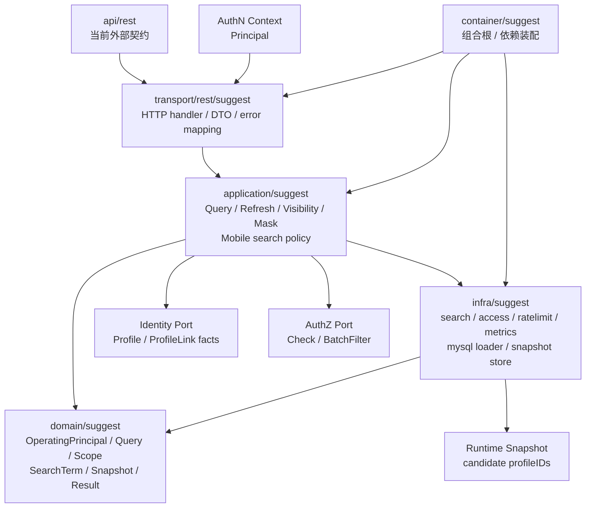

# Suggest 分层架构与代码索引

> 状态：规划改造 · 当前代码只提供 REST；`ProfileSuggestionIndex` / `ProfileSuggestItem` 位于 application。本文中的 gRPC/SDK 分层属于待收敛设计，不是现行代码事实。

---

## 1. 本文回答

本文回答 9 个问题：

- Suggest 模块在代码中如何分层？
- `domain / application / infra / transport / container / contract` 各层分别负责什么？
- `OperatingPrincipal / ProfileAccessScope / Query / ProfileSearchTerm / ProfileSuggestionIndex / ProfileSuggestItem` 应该从哪些入口开始读？
- 索引刷新、SuggestProfile 查询、手机号安全策略、可见性过滤链路如何串起来？
- Search runtime、Access scope、Rate limit、Metrics、MySQL loader 分别在什么位置？
- Suggest 与 Identity / AuthZ / AuthN 的跨模块 port 应该放在哪里？
- 哪些依赖方向是允许的，哪些依赖方向是边界漂移？
- 修改 Suggest 模型、索引刷新、查询链路、手机号安全策略时应该检查哪些文件？
- 修改 Suggest 代码或文档时应该运行哪些 Verify？

本文是 Suggest 的代码导航文档，不重复完整领域模型和关键链路。
领域模型见 [01-领域模型-ProfileSearchTerm-ProfileAccessScope-Snapshot.md](01-领域模型-ProfileSearchTerm-ProfileAccessScope-Snapshot.md)；
模块边界见 [05-模块边界-Suggest与Identity-AuthZ.md](05-模块边界-Suggest与Identity-AuthZ.md)；

---

## 2. 30 秒结论

Suggest 模块按 IAM 通用分层组织：

```text
transport/rest + transport/grpc
  -> application/suggest
  -> domain/suggest
  -> infra/suggest/search + access + ratelimit + metrics + mysql loader
  -> container/suggest
  -> api/rest
```

各层职责：

```text
domain：表达 OperatingPrincipal / ProfileAccessScope / Query / ProfileSearchTerm / RankingPolicy 的模型和不变量；
application：定义 ProfileSuggestionIndex port、ProfileSuggestItem，并编排索引刷新、SuggestProfile 查询、排序截断、脱敏和手机号安全策略等用例；
infra：实现搜索运行时、索引 store、Identity facts loader、Access scope adapter、RateLimiter、Metrics、Snapshot cache；
transport：把 REST/gRPC 请求转换为 application command/query，并处理 AuthN Principal 接入和错误映射；
container：组合根，装配 Suggest repository、search runtime、Identity/AuthZ port、rate limiter、metrics、handler；
contract：OpenAPI/proto/SDK 对外接入契约。
```

如果只记一句话：

> Suggest 的安全规则和查询编排应落在 domain/application，索引、缓存、限流、指标、MySQL loader 等技术细节应留在 infra，transport 只做协议适配，container 只做依赖装配。

---

## 3. 分层总图



读图规则：

```text
transport 依赖 application，不直接依赖 index store concrete；
application 可以依赖 domain、index port、Identity fact port、AuthZ visibility port、RateLimiter port、Metrics/Audit port；
domain 不依赖 transport、infra concrete、REST/gRPC、MySQL、Redis、AuthZ concrete；
infra 可以依赖 domain 做模型映射和技术实现；
container 可以知道具体实现，但不能执行业务用例；
AuthN Principal 进入 Suggest 后应映射为 OperatingPrincipal。
```

---

## 4. 代码事实源总表

| 层 | 路径 | 说明 |
| --- | --- | --- |
| Domain | `../../../internal/apiserver/domain/suggest` | Suggest 领域模型与规则 |
| Application | `../../../internal/apiserver/application/suggest` | 查询、索引刷新、可见性过滤、脱敏、手机号策略等用例 |
| Search runtime | `../../../internal/apiserver/infra/suggest/search` | 搜索运行时、Snapshot、候选匹配，具体以代码为准 |
| Access scope | `../../../internal/apiserver/infra/suggest/access` | 可见范围相关 infra adapter，具体以代码为准 |
| Rate limit | `../../../internal/apiserver/infra/suggest/ratelimit` | 手机号搜索等限流实现，具体以代码为准 |
| Metrics | `../../../internal/apiserver/infra/suggest/metrics` | Suggest 指标采集实现，具体以代码为准 |
| MySQL loader | `../../../internal/apiserver/infra/mysql/suggest` | Profile facts / index 数据加载或持久化，具体以代码为准 |
| REST transport | `../../../internal/apiserver/transport/rest/suggest` | Suggest REST handler、DTO、路由入口 |
| gRPC transport | 当前未提供 Suggest gRPC service | 如需新增，先补机器契约和注册测试 |
| Container | `../../../internal/apiserver/container/suggest` | Suggest 模块装配 |
| REST 契约 | `../../../api/rest/suggest.v2.yaml` | Suggest REST OpenAPI 契约 |
| gRPC 契约 | 当前未提供 Suggest proto | Suggest 当前只暴露 REST |
| SDK | `../../../pkg/sdk` | 对外 SDK 接入封装，具体路径以当前代码为准 |
| 架构测试 | `../../../internal/pkg/architecture` | 分层依赖边界测试 |

注意：上表中的路径需要继续与当前仓库目录逐项核对。如果源码目录已调整，应以代码为准并同步更新本文。

---

## 5. Domain 层

### 5.1 职责

Domain 层负责表达 Suggest 的搜索读模型和核心不变量。

它应该回答：

```text
OperatingPrincipal 是什么？
ProfileAccessScope 是什么？
Query 如何表达规范化后的搜索请求？
ProfileSearchTerm 如何表达可搜索词条？
ProfileSuggestionIndex 为什么不是 Profile 主数据？
ProfileSuggestItem 为什么必须脱敏？
AllowMobileSearch 表达什么？
为什么索引命中不等于可见？
为什么必须先过滤再排序截断？
```

Domain 层不应该负责：

```text
HTTP/gRPC 参数解析；
OpenAPI/proto DTO；
SQL 查询；
MySQL/GORM 细节；
Redis key 细节；
索引 store concrete；
AuthZ Check concrete；
AuthN Token 验签；
Identity Profile repository concrete；
限流中间件 concrete；
错误码到 HTTP/gRPC status 的映射。
```

---

### 5.2 代码索引

| 对象 / 能力 | 路径 | 说明 |
| --- | --- | --- |
| OperatingPrincipal | `../../../internal/apiserver/domain/suggest` | 当前搜索操作者引用，具体文件以源码为准 |
| ProfileAccessScope | `../../../internal/apiserver/domain/suggest` | 搜索可见范围输入，具体文件以源码为准 |
| Query | `../../../internal/apiserver/domain/suggest` | 规范化查询条件，具体文件以源码为准 |
| ProfileSearchTerm | `../../../internal/apiserver/domain/suggest` | Profile 派生搜索词条，具体文件以源码为准 |
| ProfileSuggestionIndex | `../../../internal/apiserver/application/suggest/ports.go` | 搜索索引 port |
| ProfileSuggestItem | `../../../internal/apiserver/application/suggest/dto.go` | 脱敏返回项 |
| SearchPolicy / AllowMobileSearch | `../../../internal/apiserver/domain/suggest` | 手机号搜索策略，具体文件以源码为准 |
| Mask policy | `../../../internal/apiserver/domain/suggest` | mobile_mask / id_no_mask 等脱敏规则，具体以代码为准 |

---

### 5.3 修改入口

如果要修改：

| 目标 | 优先阅读 |
| --- | --- |
| 新增 Query 匹配模式 | `domain/suggest` Query、Normalizer、Search runtime、REST/gRPC 契约 |
| 修改 ProfileAccessScope | domain scope、application visibility filter、AuthZ/Identity port |
| 新增 ProfileSearchTerm 类型 | domain term、索引刷新、search runtime、隐私策略 |
| 修改 Snapshot 版本语义 | domain snapshot、application refresh、infra search runtime |
| 修改 ProfileSuggestItem 字段 | domain result、masker、REST/gRPC DTO、SDK |
| 修改手机号搜索策略 | SearchPolicy、RateLimiter、VisibilityFilter、REST/gRPC 契约 |
| 修改脱敏策略 | Mask policy、application masker、contract tests |

---

## 6. Application 层

### 6.1 职责

Application 层负责 Suggest 用例编排。

它应该处理：

```text
从 AuthN Principal 构造 OperatingPrincipal；
校验和归一化 Query；
解析 ProfileAccessScope；
读取 Runtime Snapshot 并匹配候选；
调用 Identity facts port 和 AuthZ visibility port；
执行可见性过滤；
排序 visible candidates；
应用服务端 limit；
执行字段脱敏；
执行手机号搜索策略、限流、审计、指标；
编排 Full / Delta / Snapshot 索引刷新；
应用错误归一化。
```

Application 层不应该处理：

```text
HTTP/gRPC 协议细节；
SQL 细节；
Redis key 拼接细节，除非通过 port；
AuthN Credential / Challenge 校验；
JWT 验签；
创建 Profile/ProfileLink；
创建 RoleBinding；
解析 IDP provider proof；
直接操作 transport response。
```

---

### 6.2 代码索引

| 用例组 | 路径 | 说明 |
| --- | --- | --- |
| Suggest application | `../../../internal/apiserver/application/suggest` | Suggest 用例总入口，具体子目录以代码为准 |
| SuggestProfile query | `../../../internal/apiserver/application/suggest` | 在线查询用例，具体文件以代码为准 |
| Index refresh | `../../../internal/apiserver/application/suggest` | Full / Delta / Snapshot 刷新用例，具体文件以代码为准 |
| Visibility filter | `../../../internal/apiserver/application/suggest` | Identity/AuthZ 可见性过滤编排，具体文件以代码为准 |
| Mobile search policy | `../../../internal/apiserver/application/suggest` | AllowMobileSearch、限流、审计、指标编排，具体文件以代码为准 |
| Masker | `../../../internal/apiserver/application/suggest` | 脱敏返回转换，具体文件以代码为准 |
| Normalizer | `../../../internal/apiserver/application/suggest`、`../../../internal/apiserver/domain/suggest` | keyword 与 term 归一化，具体以代码为准 |

---

### 6.3 用例调用主线

SuggestProfile 查询：

```text
transport/rest or grpc
  -> application/suggest SuggestProfile
  -> OperatingPrincipal
  -> Query
  -> ProfileAccessScope
  -> Runtime Snapshot match
  -> VisibilityFilter
  -> rank / limit
  -> mask
  -> ProfileSuggestItem
```

索引刷新：

```text
Identity Profile source
  -> Full / Delta Refresh
  -> extract searchable fields
  -> normalize terms
  -> build ProfileSearchTerm
  -> build ProfileSuggestionIndex
  -> validate snapshot
  -> atomic swap runtime index
```

手机号搜索安全策略：

```text
Query detect mobile-like keyword
  -> SearchPolicy / AllowMobileSearch
  -> RateLimit
  -> mobile_suffix / mobile_hash match
  -> VisibilityFilter
  -> mobile_mask only
  -> Audit / Metrics
```

---

### 6.4 跨模块 port

Suggest application 可以通过最小 port 与其他模块协作。

典型 port：

| 协作 | 建议 port 语义 |
| --- | --- |
| AuthN -> Suggest | `PrincipalMapper` / middleware context |
| Suggest -> Identity | `ProfileFactReader` / `ProfileLinkReader` / `ProfileSource` |
| Identity -> Suggest | `ProfileChangedEvent` / `IndexRefreshTrigger` |
| Suggest -> AuthZ | `VisibilityChecker` / `BatchProfileAuthorizer` |
| Suggest -> Index | `ProfileSearchIndex` / `SnapshotStore` |
| Suggest -> RateLimit | `RateLimiter` |
| Suggest -> Audit | `AuditRecorder` |
| Suggest -> Metrics | `MetricsRecorder` |

要求：

```text
只暴露最小能力；
不直接 import 对方 repository concrete；
不直接操作对方数据库表；
Store / Index 不直接调用 AuthZ；
组合根负责装配具体实现；
跨模块协作必须可测试。
```

---

## 7. Infra 层

### 7.1 职责

Infra 层负责 Suggest 相关技术实现。

它应该处理：

```text
搜索运行时；
Runtime Snapshot 存取和原子切换；
ProfileSearchTerm index store；
MySQL loader；
cache；
access adapter；
rate limiter；
metrics recorder；
audit recorder concrete；
normalizer 技术依赖，若存在；
domain entity 与 persistence record 映射；
技术错误到 application error 的转换辅助。
```

Infra 层不应该处理：

```text
定义 Suggest 领域模型；
决定最终候选是否可见；
执行 AuthZ Check 业务决策；
校验 AuthN Credential；
创建 Identity Profile；
创建 AuthZ RoleBinding；
解析 IDP provider proof；
直接返回 REST/gRPC DTO；
返回明文手机号。
```

---

### 7.2 代码索引

| 能力 | 路径 | 说明 |
| --- | --- | --- |
| Search runtime | `../../../internal/apiserver/infra/suggest/search` | 搜索运行时、Snapshot、候选匹配 |
| Access scope infra | `../../../internal/apiserver/infra/suggest/access` | 可见范围相关 adapter，具体以代码为准 |
| Rate limit | `../../../internal/apiserver/infra/suggest/ratelimit` | 手机号等高敏感搜索限流实现 |
| Metrics | `../../../internal/apiserver/infra/suggest/metrics` | 指标采集实现 |
| MySQL loader | `../../../internal/apiserver/infra/mysql/suggest` | Suggest index 或 Identity facts 加载，具体以代码为准 |
| Infra root | `../../../internal/apiserver/infra/suggest` | Suggest infra 根目录，具体结构以代码为准 |

---

### 7.3 需要重点核对的实现点

| 实现点 | 为什么重要 |
| --- | --- |
| Snapshot 原子切换 | 防查询读到半更新索引 |
| 旧版本不能覆盖新版本 | 防索引回退 |
| mobile term 不保存明文 | 防敏感泄露 |
| match 只返回 candidate profileIDs | 防 infra 绕过 application 安全链路 |
| RateLimiter 维度 | 防手机号枚举 |
| Metrics 脱敏标签 | 防敏感 keyword 进入指标 |
| MySQL loader 不写 Identity 主数据 | 防读模型污染写模型 |
| Infra 不调用 AuthZ concrete | 防依赖倒置 |
| Mask failure 不返回明文 | 防兜底泄露 |
| Store error 可观测 | 防空结果无法排查 |

---

## 8. Transport 层

### 8.1 职责

Transport 层负责协议适配和认证上下文接入。

它应该处理：

```text
REST path/query/body/header 解析；
gRPC request metadata/message 解析；
从 AuthN middleware/context 获取 Principal；
DTO/proto 到 application query/command 的转换；
调用 Suggest application service；
把 application result 转换为 REST/gRPC response；
把 application error 映射为 HTTP/gRPC 错误；
接入必要的通用 rate limit / trace / logging middleware。
```

Transport 层不应该处理：

```text
直接访问 index store；
直接访问 Identity repository；
直接调用 AuthZ Check；
直接做手机号搜索策略判断；
直接执行脱敏逻辑，除非只是 DTO 字段映射；
直接创建 Profile；
直接签发 Token；
直接返回明文 mobile/id_no。
```

---

### 8.2 代码索引

| 协议 | 路径 | 说明 |
| --- | --- | --- |
| REST Suggest | `../../../internal/apiserver/transport/rest/suggest` | Suggest REST handler、DTO、路由入口 |
| gRPC Suggest | 当前未提供 | Suggest 当前只暴露 REST |
| REST root | `../../../internal/apiserver/transport/rest` | 路由注册、middleware 接入，具体以代码为准 |
| gRPC root | `../../../internal/apiserver/transport/grpc` | gRPC service 注册、interceptor 接入，具体以代码为准 |

---

### 8.3 错误映射建议

| 应用错误 | REST | gRPC |
| --- | --- | --- |
| 参数错误 | `400 Bad Request` | `InvalidArgument` |
| 未认证 | `401 Unauthorized` | `Unauthenticated` |
| 无搜索权限 | `403 Forbidden` | `PermissionDenied` |
| 手机号搜索不允许 | `403 Forbidden` 或 `400 Bad Request` | `PermissionDenied` 或 `InvalidArgument` |
| 限流 | `429 Too Many Requests` | `ResourceExhausted` |
| Snapshot 不可用 | `503 Service Unavailable` 或安全空结果 | `Unavailable` 或空结果 |
| 可见性过滤失败 | `503` 或 fail closed 空结果 | `Unavailable` 或空结果 |
| 内部错误 | `500 Internal Server Error` | `Internal` |

具体映射必须以当前 REST/OpenAPI、proto 和错误处理实现为准。

安全建议：

```text
对外错误不泄露无权限 Profile 是否存在；
日志保留 traceID、snapshotVersion、keywordType、candidateCount、visibleCount；
日志不打印明文手机号、证件号、原始敏感 keyword 或完整 token。
```

---

## 9. Container 层

### 9.1 职责

Container 是组合根，负责把 Suggest 模块装配进 iam-apiserver。

它应该处理：

```text
创建 search runtime concrete；
创建 index store / snapshot store；
创建 Identity fact reader adapter；
创建 AuthZ visibility checker adapter；
创建 RateLimiter；
创建 MetricsRecorder；
创建 AuditRecorder，若存在；
创建 Suggest application service；
创建 REST handler；
创建 gRPC service，若已实现；
把模块对象暴露给 process/transport 注册；
注册索引刷新任务，若存在。
```

Container 不应该处理：

```text
执行 SuggestProfile 查询；
执行 Full / Delta refresh 业务逻辑；
直接过滤候选；
直接调用 AuthZ Check；
直接访问 HTTP request；
直接返回 DTO；
创建 Profile 或 RoleBinding。
```

---

### 9.2 代码索引

| 能力 | 路径 | 说明 |
| --- | --- | --- |
| Suggest module wiring | `../../../internal/apiserver/container/suggest` | Suggest repository、service、runtime、handler 装配 |
| Root container | `../../../internal/apiserver/container` | 全局组合根入口，具体路径以代码为准 |
| Process lifecycle | `../../../internal/apiserver/process` | 索引刷新任务生命周期，若已实现 |

---

## 10. 契约与 SDK

### 10.1 REST 契约

REST 契约路径：

```text
../../../api/rest/suggest.v2.yaml
```

REST 契约应回答：

```text
SuggestProfile endpoint 如何定义；
keyword / scope / limit 参数如何表达；
响应 DTO 是否只包含 mobile_mask 而不包含 mobile；
错误码如何表达；
哪些接口需要 Bearer token；
手机号搜索不允许或限流如何表达；
字段命名是否与 application result 对齐。
```

---

### 10.2 gRPC 契约

当前未提供 Suggest proto、gRPC service 注册或 SDK。未来若新增，必须同时补充机器契约、transport 注册、错误映射、鉴权规则和测试；在此之前不得把设计草案写成现行接口。

---

### 10.3 SDK

SDK 应基于 REST/OpenAPI 或 gRPC/proto 契约生成或封装。

SDK 不应该：

```text
暴露明文 mobile/id_no；
绕过服务端 application；
在客户端自行做权限判断；
把 SDK DTO 当作 domain entity；
隐藏 PermissionDenied / ResourceExhausted / Unauthenticated 错误；
在日志中打印原始 keyword 或完整 token。
```

---

## 11. 典型修改路径

### 11.1 新增搜索字段

推荐检查顺序：

```text
1. domain/suggest：ProfileSearchTerm 类型和敏感等级
2. application/suggest：索引刷新 extractor / normalizer
3. infra/suggest/search：index match 支持
4. application/suggest：Query 识别和匹配策略
5. mask / privacy policy：是否允许返回展示字段
6. REST/gRPC 契约
7. tests + docs
```

---

### 11.2 修改 ProfileAccessScope

推荐检查顺序：

```text
1. domain/suggest：ProfileAccessScope 枚举和字段
2. application/suggest：scope resolver
3. Identity fact reader：是否需要新事实
4. AuthZ visibility checker：是否需要新 AuthorizationRequest context
5. REST/gRPC 契约
6. boundary docs + tests
```

---

### 11.3 修改索引刷新

推荐检查顺序：

```text
1. 02-关键链路-索引刷新Full-Delta-Snapshot.md
2. application/suggest：Full / Delta refresh use case
3. domain/suggest：ProfileSearchTerm；application/suggest：ProfileSuggestionIndex
4. infra/suggest/search：snapshot store / atomic swap
5. infra/mysql/suggest：loader / persistence
6. metrics / logs / alerts
7. tests + docs
```

---

### 11.4 修改 SuggestProfile 查询

推荐检查顺序：

```text
1. 03-关键链路-SuggestProfile查询.md
2. application/suggest：query use case
3. domain/suggest：Query / Scope / Result
4. infra/suggest/search：Snapshot match
5. visibility filter：Identity + AuthZ
6. mask / limit / ranking
7. REST/gRPC 契约和 SDK
8. tests + docs
```

---

### 11.5 修改手机号安全策略

推荐检查顺序：

```text
1. 04-安全策略-手机号搜索-脱敏-限流.md
2. domain/suggest：SearchPolicy / keyword type / mask policy
3. application/suggest：AllowMobileSearch / RateLimit / Audit
4. infra/suggest/ratelimit：限流实现
5. REST/gRPC DTO：禁止 mobile 明文字段
6. logs/metrics：脱敏和标签
7. tests + docs
```

---

### 11.6 修改可见性过滤

推荐检查顺序：

```text
1. 05-模块边界-Suggest与Identity-AuthZ.md
2. application/suggest：VisibilityFilter
3. Identity fact port：Profile/ProfileLink/org facts
4. AuthZ check/filter port：AuthorizationRequest 映射
5. Query 链路：filter before rank/limit
6. failure mode：fail closed
7. tests + docs
```

---

## 12. 依赖方向规则

### 12.1 允许

```text
transport -> application
application -> domain
application -> index/repository/rateLimiter/metrics/audit port
application -> Identity fact port
application -> AuthZ visibility/check port
infra -> domain
infra -> database/search/cache concrete
container -> all concrete wiring targets
contract -> transport implementation alignment
```

### 12.2 禁止

```text
domain/suggest -> application/suggest；
domain/suggest -> infra/suggest；
domain/suggest -> transport/rest；
domain/suggest -> transport/grpc；
domain/suggest -> api/rest or api/grpc；
domain/suggest -> AuthZ concrete；
domain/suggest -> Identity concrete；
domain/suggest -> Redis/MySQL client concrete；
application/suggest -> transport；
application/suggest -> Identity repository concrete；
application/suggest -> AuthZ RoleBinding repository concrete；
transport/suggest -> infra store concrete；
infra/suggest -> application/authz concrete；
infra/suggest -> application/authn concrete；
infra/suggest/search -> AuthZ Check concrete。
```

---

## 13. 常见反模式

| 反模式 | 问题 | 推荐做法 |
| --- | --- | --- |
| handler 直接查 index store | 绕过 application 安全链路 | handler 调 Suggest application |
| index store 直接调用 AuthZ | infra 吞并授权决策 | application 编排 VisibilityFilter |
| Suggest 创建 Profile | 读模型吞并 Identity | Profile 写入归 Identity |
| Suggest 写 RoleBinding | Suggest 吞并 AuthZ | 授权归 AuthZ |
| domain import infra/search | 领域层依赖技术实现 | 通过 port 和 application 编排 |
| DTO 返回 mobile 明文 | 敏感泄露 | 只返回 mobile_mask |
| Query 归一化写在 handler | 规则散落 | 放 domain/application 并测试 |
| Full refresh 失败清空 runtime | 大面积不可用 | 保留旧 Snapshot |
| limit 先于 visibility filter | 结果侧信道和体验问题 | 先 filter，再 rank/limit |
| AuthZ 不可用时默认放行 | 越权风险 | fail closed 或最小安全范围 |

---

## 14. Verify

修改本文后至少执行：

```bash
make docs-hygiene
```

涉及 Suggest domain：

```bash
go test ./internal/apiserver/domain/suggest/...
```

涉及 Suggest application：

```bash
go test ./internal/apiserver/application/suggest/...
```

涉及 Suggest infra：

```bash
go test ./internal/apiserver/infra/suggest/...
go test ./internal/apiserver/infra/suggest/search/...
go test ./internal/apiserver/infra/suggest/access/...
go test ./internal/apiserver/infra/suggest/ratelimit/...
go test ./internal/apiserver/infra/suggest/metrics/...
go test ./internal/apiserver/infra/mysql/suggest/...
```

涉及 transport / container：

```bash
go test ./internal/apiserver/container/suggest
go test ./internal/apiserver/transport/rest/suggest/...
```

当前没有 Suggest gRPC transport，不执行对应测试。

涉及 Identity/AuthZ/AuthN/IDP 边界：

```bash
go test ./internal/apiserver/domain/identity/...
go test ./internal/apiserver/application/identity/...
go test ./internal/apiserver/domain/authz/...
go test ./internal/apiserver/application/authz/...
go test ./internal/apiserver/domain/authn/...
go test ./internal/apiserver/domain/idp/...
```

涉及 REST/gRPC 契约：

```bash
make api-validate
make proto-gen
```

涉及 SDK：

```bash
go test ./pkg/sdk/...
```

涉及分层依赖边界：

```bash
go test ./internal/pkg/architecture
```

---

## 15. 本文总结

Suggest 的代码结构可以压缩成：

```text
domain       定义 OperatingPrincipal / ProfileAccessScope / Query / ProfileSearchTerm / RankingPolicy
application  定义 ProfileSuggestionIndex / ProfileSuggestItem，编排索引刷新、查询、排序、脱敏和手机号策略
infra        实现 search runtime、snapshot store、access adapter、ratelimit、metrics、mysql loader
transport    适配 REST/gRPC 请求、响应、AuthN Principal 接入和错误映射
container    装配 Suggest 模块依赖和跨模块 port
contract     约束 REST/gRPC/SDK 对外接入语义
```

维护 Suggest 时最重要的工程规则是：

```text
搜索规则不要写进 handler；
AuthZ Check 不要写进 Store / Index；
索引、缓存、MySQL、限流和指标细节不要写进 domain；
Suggest 不创建 Profile/ProfileLink；
Suggest 不管理 Role/Permission/RoleBinding；
手机号搜索必须走 application 层的 policy、rate limit、visibility filter 和 mask；
组合根只装配依赖，不执行业务用例。
```

读完本文后，Suggest 模块主文档已经形成闭环：

```text
00-模块总览.md
01-领域模型-ProfileSearchTerm-ProfileAccessScope-Snapshot.md
02-关键链路-索引刷新Full-Delta-Snapshot.md
03-关键链路-SuggestProfile查询.md
04-安全策略-手机号搜索-脱敏-限流.md
05-模块边界-Suggest与Identity-AuthZ.md
06-分层架构与代码索引.md
```
