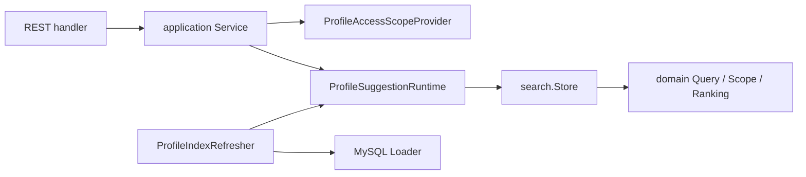

# Suggest

> 状态：已实现 · 已按当前 domain、application、infra、REST、container、配置和测试核对。Suggest 当前只提供 REST，没有 gRPC proto、gRPC service 或 Go SDK。

## 1. 30 秒结论

Suggest 是从 Identity 数据派生的 Profile 联想搜索读模型，不拥有 User、Profile 或 ProfileLink 主数据。

当前主线：

```text
MySQL profiles / profile_links / users
  -> Loader 构造 ProfileSearchTerm
  -> Full / Delta 刷新进程内 Store
  -> GET /api/v2/suggest/profile?k=...
  -> 解析 OperatingPrincipal 和 ProfileAccessScope
  -> 数字精确匹配或姓名/拼音匹配
  -> scope 过滤
  -> 排序、截断、手机号脱敏
  -> ProfileSuggestResponseItem[]
```

必须记住：

- 索引命中不等于可见，`Store` 在排序截断前执行 scope 过滤。
- `ProfileAccessScope` 是本次查询的可见范围，不是 ProfileLink，也不是通用 AuthZ 决策。
- 手机号形态查询需要 `search_by_mobile` 权限；没有权限时当前返回空结果。
- 当前进程内索引可以保存原始手机号，只有输出 DTO 做脱敏；索引数据不写盘。
- Suggest 没有 gRPC 或 SDK 接口。

## 2. 文档入口

本目录只保留一篇总览和三篇事实文档：

| 文档 | 回答的问题 |
| --- | --- |
| [README.md](README.md) | 模块职责、边界、分层、代码入口和当前限制 |
| [01-模型与应用端口.md](01-模型与应用端口.md) | 现行对象、端口和不变量是什么 |
| [02-关键链路-索引刷新Full-Delta.md](02-关键链路-索引刷新Full-Delta.md) | Full、Delta、运行时切换、并发锁和增量游标如何工作 |
| [03-关键链路-SuggestProfile查询.md](03-关键链路-SuggestProfile查询.md) | 查询、权限范围、手机号安全、限流和脱敏如何工作 |

设计取舍见 [Suggest 为什么是读模型](../../05-专题设计/06-Suggest为什么是读模型.md)，但当前行为以本目录和代码为准。

## 3. 职责与边界

| Suggest 负责 | Suggest 不负责 |
| --- | --- |
| 从 Profile 事实构建搜索读模型 | 创建或修改 Profile、User、ProfileLink |
| 姓名、拼音、档案 ID、手机号匹配 | 登录、Token 签发或身份源解析 |
| 解析本次查询的 ProfileAccessScope | 管理 Role、Permission、RoleBinding |
| scope 过滤、排序、截断和输出脱敏 | 把索引命中当作详情访问授权 |
| Full/Delta 刷新和进程内索引生命周期 | 提供 gRPC 或 Go SDK |

跨模块关系：

- Identity 提供 `profiles`、`profile_links`、`users` 数据；Suggest 只读取。
- AuthN middleware 把 JWT 上下文转换成 `OperatingPrincipal`。
- AuthZ runtime 提供角色和 `search_by_mobile` 判断；当前不会对每个候选逐条调用 AuthZ Check。
- IDP 不参与 Suggest 查询链路。

## 4. 运行时与分层



| 层 | 当前职责 | 主要入口 |
| --- | --- | --- |
| domain | Principal、Scope、SearchTerm、Query、匹配类型、排序和手机号脱敏规则 | `internal/apiserver/domain/suggest` |
| application | 查询用例、刷新用例、策略链、端口、返回项和配置 | `internal/apiserver/application/suggest` |
| infra | Trie/Hash/Store、原子 runtime、MySQL loader、scope adapter、限流和指标 | `internal/apiserver/infra/suggest`、`internal/apiserver/infra/mysql/suggest` |
| transport | REST 参数、Principal 转换、限流和响应映射 | `internal/apiserver/transport/rest/suggest` |
| container | 装配 DB、AuthZ runtime、Redis、刷新任务和 REST 能力 | `internal/apiserver/container/suggest` |
| contract | 当前唯一外部机器契约 | `api/rest/suggest.v2.yaml` |

## 5. 当前对外契约

```text
GET /api/v2/suggest/profile?k=<keyword>&limit=<n>
Authorization: Bearer <token>
```

REST 返回项：

| JSON 字段 | application 字段 | 说明 |
| --- | --- | --- |
| `id` | `ProfileID` | 字符串形式的 Profile ID |
| `name` | `DisplayName` | 展示名 |
| `mobile_mask` | `MobileMask` | 默认脱敏手机号，可为空 |
| `weight` | `Weight` | 排序权重 |

错误入口：缺少参数为 `400`，缺少有效 Principal 为 `401`，REST 限流为 `429`。手机号搜索无权限当前由策略返回空列表，不是专门的 `403`。

## 6. 装配和降级

启动时 `SuggestModule`：

1. `enable=false` 时跳过初始化；
2. 校验 DB，以及生产环境不能开启 `disable_mobile_mask`；
3. 创建 scope provider、runtime、loader、refresher 和 rate limiter；
4. 先执行一次 Full refresh；
5. 再启动 Full/Delta cron。

首次刷新失败时，`required=true` 返回错误；`required=false` 改用始终返回空列表的 `DegradedService`。后续 cron 失败只记录日志，不替换为 degraded service。

主要配置见 `configs/apiserver.dev.yaml`、`configs/apiserver.prod.yaml` 和 `internal/apiserver/application/suggest/config.go`。

## 7. 当前限制与风险

| 现状 | 影响 |
| --- | --- |
| 默认 Loader 通过占位 `org_id` 适配当前表结构 | 多组织部署需要配置正确的 Loader SQL，不能把 IAM tenant 当业务 org |
| 可见 ProfileID 的过渡实现按 `profiles.created_by` 查询 | 这是当前数据权限读模型，不等于完整业务授权模型 |
| Full/Delta 是进程内索引刷新 | 重启后必须通过 Full 重建，不能依赖本地文件恢复 |
| 内存索引包含原始手机号 | 当前没有 hash 化；不得写盘、写日志或未经权限返回 |
| 重叠刷新不会排队 | 后到任务返回 `refresh_in_progress`；应观察跳过频率和单次耗时 |
| Redis 限流器异常时 fail-open | Redis 故障期间不会拒绝请求，只记录 warn |
| `CheckHealth` 只检查 service 是否存在 | 不代表索引新鲜度或刷新任务健康 |

## 8. 修改导航

| 要修改什么 | 先看哪里 |
| --- | --- |
| ProfileSearchTerm、Query、Scope 或排序 | 领域模型文档 + `domain/suggest` 测试 |
| Full/Delta、Loader、Store、并发锁或游标 | 索引刷新文档 + application/infra 测试 |
| 查询、手机号权限、限流或脱敏 | 查询链路文档 + REST/application 测试 |
| REST 字段或状态码 | `api/rest/suggest.v2.yaml` + REST handler/DTO |
| 模块启停和降级 | `container/suggest/module.go` + 配置 |

## 9. Verify

```bash
make docs-hygiene
go test ./internal/apiserver/domain/suggest/...
go test ./internal/apiserver/application/suggest/...
go test ./internal/apiserver/infra/suggest/...
go test ./internal/apiserver/infra/mysql/suggest/...
go test ./internal/apiserver/transport/rest/suggest/...
go test ./internal/apiserver/container/suggest/...
```
