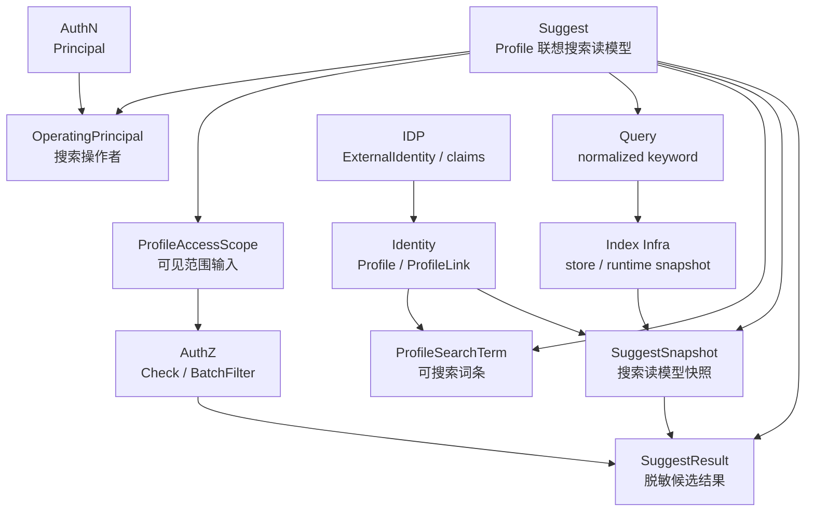

# Suggest

> 状态：待补证据 · Suggest 模块入口，已按“模型主文档 + 三条关键链路/安全策略 + 模块边界 + 代码索引”的结构重写，待继续按源码、契约、配置和测试核对。

---

## 1. 本目录定位

`05-Suggest/` 是 IAM Suggest 模块的文档入口。

Suggest 是 IAM 的 **Profile 联想搜索读模型模块**，负责回答：

```text
当前请求者在允许的可见范围内，
根据 keyword 能看到哪些可选择的 Profile 候选项？
```

Suggest 维护和产生：

```text
OperatingPrincipal；
ProfileAccessScope；
Query；
ProfileSearchTerm；
SuggestSnapshot；
SuggestResult；
搜索候选集；
脱敏展示结果。
```

Suggest 不负责 Profile 写模型、不负责登录认证、不负责通用授权策略管理、不解析外部 provider 身份，也不返回明文手机号、证件号等敏感字段。

对应边界：

```text
Identity 负责 User / Profile / ProfileLink；
AuthZ 负责 Subject / Role / Permission / RoleBinding / Check / PolicyVersion；
AuthN 负责 Principal / Credential / Challenge / Session / Token / JWKS；
IDP 负责 WechatApp / Credentials / AppToken / ExternalIdentity；
Index infra 只负责搜索存储和匹配，不负责授权决策。
```

---

## 2. 30 秒结论

Suggest 的核心主线可以压缩成：

```text
keyword
  -> normalize
  -> search terms / snapshot
  -> candidate profileIDs
  -> visibility filter
  -> rank
  -> limit
  -> mask
  -> SuggestResult
```

每个核心对象的职责是：

| 对象 | 一句话 | 不是什么 |
| --- | --- | --- |
| `OperatingPrincipal` | 当前搜索操作者引用 | 不是 AuthN `Principal` 本体，也不是 User 写模型 |
| `ProfileAccessScope` | 本次搜索的可见范围输入 | 不是 `ProfileLink`，也不是 AuthZ `Scope` 本体 |
| `Query` | 规范化后的搜索请求 | 不是原始 HTTP/gRPC request |
| `ProfileSearchTerm` | 从 Profile 派生出的可搜索词条 | 不是 `Profile` 写模型，不是权限事实源 |
| `SuggestSnapshot` | 某一版本的搜索读模型快照 | 不是 Profile 主数据 |
| `SuggestResult` | 脱敏后的候选展示结果 | 不是 Profile 写模型，不应包含敏感明文 |

最重要的边界：

```text
ProfileSearchTerm 不是 Profile；
SuggestSnapshot 不是 Profile 主数据；
ProfileAccessScope 不是 ProfileLink；
ProfileAccessScope 不是 AuthZ Scope 本体；
ProfileAccessScope 不等于授权通过；
ProfileLink 不是 RoleBinding；
OperatingPrincipal 不是 AuthN Principal 本体；
索引命中不等于可见；
Store / Index 不应直接调用 AuthZ；
SuggestResult 不应返回明文手机号或证件号。
```

如果只记一句话：

> Suggest 负责“搜索候选”，Identity 负责“档案事实”，AuthZ 负责“可见性判断”。

---

## 3. 文档结构

当前 Suggest 模块保留 6 篇主文档：

| 文档 | 作用 | 阅读重点 |
| --- | --- | --- |
| [00-模块总览.md](00-模块总览.md) | Suggest 职责、核心对象、关键链路和模块协作总览 | 建立对 Suggest 的整体认知 |
| [01-领域模型-ProfileSearchTerm-ProfileAccessScope-Snapshot.md](01-领域模型-ProfileSearchTerm-ProfileAccessScope-Snapshot.md) | Suggest 核心模型、模型图、生命周期、状态流转和不变量 | 唯一模型主文档 |
| [02-关键链路-索引刷新Full-Delta-Snapshot.md](02-关键链路-索引刷新Full-Delta-Snapshot.md) | Profile 搜索索引刷新链路 | Full rebuild、Delta refresh、Snapshot 原子切换、敏感字段治理 |
| [03-关键链路-SuggestProfile查询.md](03-关键链路-SuggestProfile查询.md) | SuggestProfile 在线查询链路 | OperatingPrincipal、Query、Snapshot 命中、可见性过滤、排序截断、脱敏返回 |
| [04-安全策略-手机号搜索-脱敏-限流.md](04-安全策略-手机号搜索-脱敏-限流.md) | 手机号搜索安全专题 | `AllowMobileSearch`、`mobile_mask`、限流、审计、Store/AuthZ 边界 |
| [05-模块边界-Suggest与Identity-AuthZ.md](05-模块边界-Suggest与Identity-AuthZ.md) | Suggest 与 Identity、AuthZ、AuthN、IDP、Index infra 的边界 | 防止 Profile/SearchTerm、Scope/ProfileLink、Index/AuthZ 混淆 |
| [06-分层架构与代码索引.md](06-分层架构与代码索引.md) | domain/application/infra/transport/container/contract 代码索引 | 修改代码时的导航入口和 Verify |

注意：

```text
原 02-领域模型图.md 的核心内容已经合并进 01-领域模型-ProfileSearchTerm-ProfileAccessScope-Snapshot.md。
后续如果该文件仍存在，应考虑删除、归档或改成跳转说明，避免重复维护。
```

---

## 4. Suggest 模块总图



读图规则：

```text
AuthN 提供 Principal，Suggest 内部转换为 OperatingPrincipal；
Identity 提供 Profile/ProfileLink 等身份事实；
Suggest 从 Identity 派生 ProfileSearchTerm 和 SuggestSnapshot；
Index infra 只返回候选 profileIDs；
候选必须经过 ProfileAccessScope 与 AuthZ/Identity 可见性过滤；
最终返回 SuggestResult，而不是 Profile 写模型；
IDP claims 如需影响搜索，必须先经过 Identity 确认。
```

---

## 5. 核心对象

### 5.1 OperatingPrincipal

`OperatingPrincipal` 是 Suggest 内部使用的当前搜索操作者引用。

它回答：

```text
谁在发起本次 Profile 联想搜索？
搜索可见范围应该以哪个主体为中心构造？
审计和限流应该归属到哪个操作者？
```

关键边界：

```text
OperatingPrincipal 不是 AuthN Principal 本体；
OperatingPrincipal 不校验 Credential / Challenge；
OperatingPrincipal 不签发 Token；
OperatingPrincipal 不应携带完整 JWT claims；
OperatingPrincipal 只保留 Suggest 查询和审计所需的最小身份引用。
```

---

### 5.2 ProfileAccessScope

`ProfileAccessScope` 是 Suggest 查询时的可见范围输入。

它回答：

```text
本次联想搜索应该在哪个 Profile 范围内寻找候选项？
```

关键边界：

```text
ProfileAccessScope 不是 Identity.ProfileLink；
ProfileAccessScope 不是 AuthZ Scope 本体；
ProfileAccessScope 不等于授权通过；
ProfileAccessScope 可以作为 AuthZ Check/filter 的 context；
ProfileAccessScope 不应替代 RoleBinding；
ProfileAccessScope 不应绕过 Identity.ProfileLink 或 AuthZ Check。
```

---

### 5.3 ProfileSearchTerm

`ProfileSearchTerm` 是从 Identity `Profile` 派生出的可搜索词条。

它回答：

```text
某个 Profile 可以被哪些 keyword 命中？
这些 keyword 应该如何规范化、加权和匹配？
哪些词条具有敏感属性，需要限制展示或日志？
```

关键边界：

```text
ProfileSearchTerm 是读模型词条；
ProfileSearchTerm 不是 Profile 写模型；
ProfileSearchTerm 不应保存不必要的敏感明文；
ProfileSearchTerm 不表达授权通过；
ProfileSearchTerm 命中只产生候选集；
ProfileSearchTerm 应能由 Identity Profile 事实重建。
```

---

### 5.4 SuggestSnapshot

`SuggestSnapshot` 是某一版本的 Profile 搜索读模型快照。

它回答：

```text
当前搜索索引基于哪个 Profile 版本构建？
某个 Profile 的可搜索词条和展示字段是什么？
索引是否需要刷新或重建？
```

关键边界：

```text
SuggestSnapshot 是读模型；
SuggestSnapshot 不是 Profile 主数据；
SuggestSnapshot 不应成为权限事实源；
SuggestSnapshot 可以最终一致；
SuggestSnapshot 可以被重建；
SuggestSnapshot 中敏感字段必须最小化、脱敏或 hash 化。
```

---

### 5.5 SuggestResult

`SuggestResult` 是对外返回的脱敏候选项。

它回答：

```text
当前请求者最终可以看到哪些 Profile 候选？
每个候选项可以展示哪些安全字段？
```

关键边界：

```text
SuggestResult 不是 Profile 写模型；
SuggestResult 不应包含明文手机号；
SuggestResult 不应包含明文证件号；
SuggestResult 不应暴露完整搜索 token；
SuggestResult 不应泄露无权限 Profile 的存在性；
SuggestResult 字段应根据调用方和权限策略最小化。
```

---

## 6. 关键链路

### 6.1 索引刷新 Full / Delta / Snapshot

索引刷新负责从 Identity 主数据派生 Suggest 搜索读模型。

主线：

```text
Identity Profile source
  -> load profile facts
  -> extract searchable fields
  -> normalize terms
  -> build ProfileSearchTerm
  -> build SuggestSnapshot
  -> validate snapshot
  -> atomic swap runtime index
  -> expose snapshot version
```

Full / Delta / Snapshot 的职责：

```text
Full：从 Identity 事实源完整重建索引；
Delta：根据 Profile 变化局部刷新索引；
Snapshot：提供运行时只读索引视图，并通过原子切换避免半更新状态。
```

详细说明见 [02-关键链路-索引刷新Full-Delta-Snapshot.md](02-关键链路-索引刷新Full-Delta-Snapshot.md)。

---

### 6.2 SuggestProfile 查询

SuggestProfile 查询是 Suggest 的核心读链路。

主线：

```text
GET /api/v2/suggest/profile
  -> extract OperatingPrincipal
  -> validate and normalize Query
  -> resolve ProfileAccessScope
  -> read Runtime Snapshot
  -> match candidate profileIDs
  -> visibility filter
  -> rank visible candidates
  -> limit
  -> mask fields
  -> return SuggestProfileResult
```

重点边界：

```text
Snapshot 命中不等于可见；
ProfileAccessScope 不等于授权通过；
不能先全局 limit 再过滤 scope；
手机号/证件号形态 keyword 需要额外权限、限流和审计；
响应只返回脱敏字段，例如 mobile_mask；
查询链路不创建 Profile；
查询链路不写 RoleBinding；
查询链路不签发 Token；
查询链路不刷新全量索引。
```

详细说明见 [03-关键链路-SuggestProfile查询.md](03-关键链路-SuggestProfile查询.md)。

---

### 6.3 手机号搜索 / 脱敏 / 限流

手机号搜索是高风险能力。

主线：

```text
keyword
  -> detect mobile-like keyword
  -> check AllowMobileSearch
  -> normalize / suffix / hash token
  -> match mobile index terms
  -> ProfileAccessScope filter
  -> AuthZ / Identity visibility filter
  -> rank visible candidates
  -> limit with stricter cap
  -> return mobile_mask only
  -> audit + metrics
```

重点边界：

```text
AllowMobileSearch 只允许“使用手机号索引命中候选”，不代表候选可见；
手机号搜索不能绕过 ProfileAccessScope；
手机号搜索不能绕过 AuthZ / Identity 可见性过滤；
响应 DTO 不应包含明文 mobile；
Store / Index 不应直接调用 AuthZ；
ProfileLink 不是 ProfileAccessScope；
手机号搜索必须限流和审计。
```

详细说明见 [04-安全策略-手机号搜索-脱敏-限流.md](04-安全策略-手机号搜索-脱敏-限流.md)。

---

## 7. 模块边界

| 边界 | 正确理解 | 错误理解 |
| --- | --- | --- |
| `ProfileSearchTerm` 与 `Profile` | SearchTerm 是从 Profile 派生的读模型词条 | SearchTerm 就是 Profile 主数据 |
| `SuggestSnapshot` 与 Profile 主数据 | Snapshot 可最终一致、可重建 | Snapshot 可回写 Identity 主数据 |
| `ProfileAccessScope` 与 `ProfileLink` | Scope 是搜索范围输入，ProfileLink 是 Identity 关系事实 | Scope 就是 ProfileLink |
| `ProfileAccessScope` 与 AuthZ `Scope` | Scope 可映射为 AuthZ context | Suggest Scope 等于授权通过 |
| `ProfileLink` 与 `RoleBinding` | ProfileLink 是身份关系，RoleBinding 是授权绑定 | 有 ProfileLink 就等于有授权 |
| `OperatingPrincipal` 与 AuthN `Principal` | Suggest 内部最小操作者引用 | OperatingPrincipal 是完整 JWT claims |
| Index 与 AuthZ | Index 只返回候选 | Store / Index 直接调用 AuthZ 并返回结果 |
| `SuggestResult` 与 Profile | Result 是脱敏展示结果 | Result 返回完整 Profile 明文 |

详细说明见 [05-模块边界-Suggest与Identity-AuthZ.md](05-模块边界-Suggest与Identity-AuthZ.md)。

---

## 8. 分层架构

Suggest 代码按以下分层维护：

```text
transport/rest + transport/grpc
  -> application/suggest
  -> domain/suggest
  -> infra/suggest/search + access + ratelimit + metrics + mysql loader
  -> container/suggest
  -> api/rest + api/grpc + pkg/sdk
```

| 层 | 职责 |
| --- | --- |
| domain | 定义 OperatingPrincipal / ProfileAccessScope / Query / ProfileSearchTerm / SuggestSnapshot / SuggestResult |
| application | 编排索引刷新、SuggestProfile 查询、可见性过滤、排序截断、脱敏、手机号安全策略 |
| infra | 实现 search runtime、snapshot store、access adapter、ratelimit、metrics、mysql loader |
| transport | 适配 REST/gRPC 请求、响应、AuthN Principal 接入和错误映射 |
| container | 装配 Suggest 模块依赖和跨模块 port |
| contract | 约束 REST/gRPC/SDK 对外接入语义 |

详细代码索引见 [06-分层架构与代码索引.md](06-分层架构与代码索引.md)。

---

## 9. 推荐阅读路径

### 9.1 新读者

```text
00-模块总览.md
  -> 01-领域模型-ProfileSearchTerm-ProfileAccessScope-Snapshot.md
  -> 05-模块边界-Suggest与Identity-AuthZ.md
```

目标：先理解 Suggest 是什么，以及它不是什么。

---

### 9.2 准备实现搜索查询

```text
03-关键链路-SuggestProfile查询.md
  -> 01-领域模型-ProfileSearchTerm-ProfileAccessScope-Snapshot.md
  -> 04-安全策略-手机号搜索-脱敏-限流.md
  -> 06-分层架构与代码索引.md
```

目标：理解 Query 如何命中 Snapshot，以及候选项如何过滤、排序、脱敏。

---

### 9.3 准备实现索引刷新

```text
02-关键链路-索引刷新Full-Delta-Snapshot.md
  -> ../01-Identity/README.md
  -> 06-分层架构与代码索引.md
```

目标：理解 Suggest 如何从 Identity 主数据派生、刷新和修复搜索读模型。

---

### 9.4 准备排查越权或结果缺失

```text
03-关键链路-SuggestProfile查询.md
  -> 05-模块边界-Suggest与Identity-AuthZ.md
  -> ../03-AuthZ/02-关键链路-权限检查Check.md
  -> ../01-Identity/README.md
```

目标：确认是索引缺失、可见性过滤、排序截断、脱敏策略还是 AuthZ/Identity 事实导致的问题。

---

### 9.5 准备修改手机号搜索

```text
04-安全策略-手机号搜索-脱敏-限流.md
  -> 03-关键链路-SuggestProfile查询.md
  -> 06-分层架构与代码索引.md
```

目标：确认 `AllowMobileSearch`、`mobile_mask`、限流、审计、指标、Store/AuthZ 边界都没有漂移。

---

## 10. 代码事实源

| 事实 | 路径 |
| --- | --- |
| Suggest domain | `../../../internal/apiserver/domain/suggest` |
| Suggest application | `../../../internal/apiserver/application/suggest` |
| Search runtime | `../../../internal/apiserver/infra/suggest/search` |
| Access scope infra | `../../../internal/apiserver/infra/suggest/access` |
| Rate limit | `../../../internal/apiserver/infra/suggest/ratelimit` |
| Metrics | `../../../internal/apiserver/infra/suggest/metrics` |
| MySQL loader | `../../../internal/apiserver/infra/mysql/suggest` |
| REST transport | `../../../internal/apiserver/transport/rest/suggest` |
| gRPC transport | `../../../internal/apiserver/transport/grpc/suggest`，若已实现 |
| Suggest container | `../../../internal/apiserver/container/suggest` |
| REST 契约 | `../../../api/rest/suggest.v2.yaml` |
| gRPC 契约 | `../../../api/grpc/iam/suggest/v2/suggest.proto`，若已存在 |
| 架构测试 | `../../../internal/pkg/architecture` |

注意：上表中的具体路径需要继续与当前源码核对。如果源码目录已调整，应以代码为准并同步更新本文。

---

## 11. 常见反模式

| 反模式 | 问题 | 推荐做法 |
| --- | --- | --- |
| handler 直接查 index store | 绕过 application 安全链路 | handler 调 Suggest application |
| index store 直接调用 AuthZ | infra 吞并授权决策 | application 编排 VisibilityFilter |
| Suggest 创建 Profile | 读模型吞并 Identity | Profile 写入归 Identity |
| Suggest 写 RoleBinding | Suggest 吞并 AuthZ | 授权归 AuthZ |
| ProfileAccessScope 当 ProfileLink | 查询范围和身份关系混淆 | Scope 是查询输入，ProfileLink 是 Identity 事实 |
| ProfileAccessScope 当授权通过 | 越权风险 | Scope 还需映射到 Identity/AuthZ filter |
| DTO 返回 mobile 明文 | 敏感泄露 | 只返回 mobile_mask |
| 手机号搜索绕过限流 | 枚举风险 | RateLimit + Audit |
| Full refresh 失败清空 runtime | 大面积不可用 | 保留旧 Snapshot |
| limit 先于 visibility filter | 结果侧信道和体验问题 | 先 filter，再 rank/limit |

---

## 12. Verify

修改本目录文档后至少执行：

```bash
make docs-hygiene
```

涉及 Suggest domain：

```bash
go test ./internal/apiserver/domain/suggest/...
```

涉及 Suggest application：

```bash
go test ./internal/apiserver/application/suggest/...
```

涉及 Suggest infra：

```bash
go test ./internal/apiserver/infra/suggest/...
go test ./internal/apiserver/infra/suggest/search/...
go test ./internal/apiserver/infra/suggest/access/...
go test ./internal/apiserver/infra/suggest/ratelimit/...
go test ./internal/apiserver/infra/suggest/metrics/...
go test ./internal/apiserver/infra/mysql/suggest/...
```

涉及 transport / container：

```bash
go test ./internal/apiserver/container/suggest
go test ./internal/apiserver/transport/rest/suggest/...
```

如果 gRPC 已实现：

```bash
go test ./internal/apiserver/transport/grpc/suggest/...
```

涉及 Identity/AuthZ/AuthN/IDP 边界：

```bash
go test ./internal/apiserver/domain/identity/...
go test ./internal/apiserver/application/identity/...
go test ./internal/apiserver/domain/authz/...
go test ./internal/apiserver/application/authz/...
go test ./internal/apiserver/domain/authn/...
go test ./internal/apiserver/domain/idp/...
```

涉及 REST/gRPC 契约：

```bash
make api-validate
make proto-gen
```

涉及 SDK：

```bash
go test ./pkg/sdk/...
```

涉及分层依赖边界：

```bash
go test ./internal/pkg/architecture
```

---

## 13. 本目录总结

Suggest 模块的主线是：

```text
keyword
  -> normalize
  -> search terms / snapshot
  -> candidate profileIDs
  -> visibility filter
  -> rank
  -> limit
  -> mask
  -> SuggestResult
```

Suggest 的核心职责是：

```text
维护 Profile 搜索读模型；
把 keyword 归一化并命中候选 Profile；
根据 Identity/AuthZ 事实过滤可见范围；
对可见候选排序、截断和脱敏；
返回安全的 SuggestResult；
治理手机号搜索、脱敏、限流、审计和指标。
```

Suggest 的核心边界是：

```text
不创建 User/Profile/ProfileLink；
不做登录认证；
不签发 Token；
不管理 Role/Permission/RoleBinding；
不解析外部 provider 身份；
不返回明文手机号或证件号；
不把搜索索引当主数据；
不把搜索索引当权限事实源；
不绕过 AuthZ/Identity 可见性过滤；
不让 Store / Index 直接调用 AuthZ。
```

读完本目录后，应能清楚说明 Suggest 的模型、链路、边界和代码入口，并能在修改代码时避免把 Identity、AuthZ、AuthN、IDP 或 Index infra 的职责混入 Suggest。
