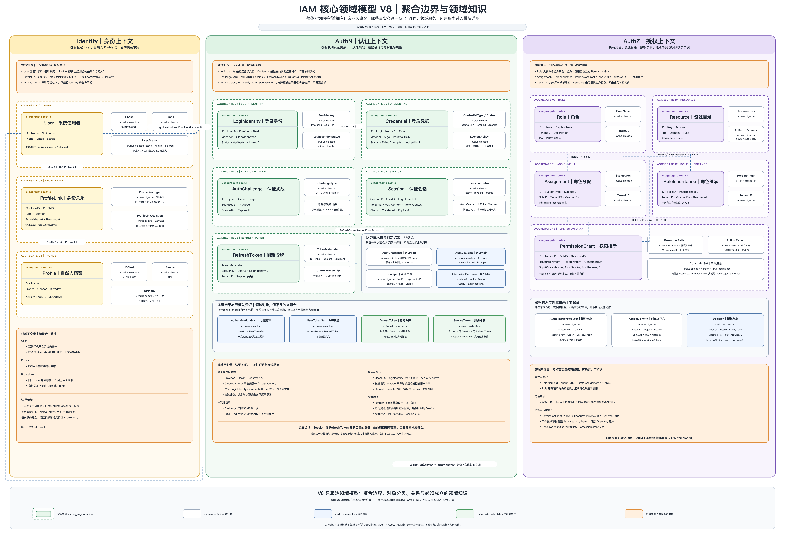

# 业务模块

> 状态：已实现 · 五个模块的职责、依赖方向和跨模块协作已按当前组合根复核。

## 模块入口

| 模块 | 核心问题 | 文档 |
| --- | --- | --- |
| Identity | User/Profile/ProfileLink 怎样建模并保持一致 | [Identity](01-Identity/README.md) |
| AuthN | 怎样证明身份、维持 Session 和令牌 | [AuthN](02-AuthN/README.md) |
| AuthZ | 怎样写入、传播和判定资源权限 | [AuthZ](03-AuthZ/README.md) |
| IDP | 怎样安全接入外部 provider | [IDP](04-IDP/README.md) |
| Suggest | 怎样构建可见 Profile 联想读模型 | [Suggest](05-Suggest/README.md) |



[V8 SVG 图源](../_images/architecture/core-domain-model-v8.svg)

V8 是整体介绍时的核心领域模型入口：以 Identity、AuthN、AuthZ 三个限界上下文为边界，明确 13 个聚合根、聚合内值对象、非聚合领域结果、稳定 ID 引用和关键领域不变量。当前核心模型以单实体聚合为主，
因此不会为了形式完整而虚构聚合内部实体。进入对应模块文档后，再展开领域服务、应用服务和具体场景链路：

- [Identity 模块详解](01-Identity/00-模块总览.md)
- [AuthN 模块详解](02-AuthN/00-模块总览.md)
- [AuthZ 模块详解](03-AuthZ/00-模块总览.md)

本目录是业务知识的主层，不以专题文档替代模块自身解释。每个模块按同一组问题展开：

```text
解决什么问题
  -> 核心概念怎样关联
  -> 领域不变量由谁维护
  -> 关键链路和事务/并发边界
  -> 失败后系统处于什么状态
  -> 与其他模块交换什么最小事实
  -> 为什么选择当前方案、替代方案代价是什么
  -> 当前代码、契约、测试与风险在哪里
```

## 协作主线

```text
IDP external proof
  -> AuthN LoginIdentity / Principal / Session / Token
  -> Identity User current state
  -> AuthZ Subject / Decision
  -> Suggest visibility-filtered candidates
```

## 必须保持的边界

- ExternalIdentity、LoginIdentity、User、Principal、Subject 是不同对象；
- ProfileLink 是身份关系，不是授权事实；
- provider AppToken 不是 IAM Token；
- AuthZ 不可变快照（含自有不可变角色图）和 Suggest Store 是派生 runtime，不是主数据；
- Token 验签、主体当前状态、资源授权是三步独立判断。

跨模块深入阅读：[统一模型](../00-概览/06-跨模块统一模型.md)、[身份认证与授权边界](../06-专题设计/01-身份认证与授权边界.md) 与
[事务缓存与事件一致性](../06-专题设计/02-事务缓存与事件一致性.md)。
