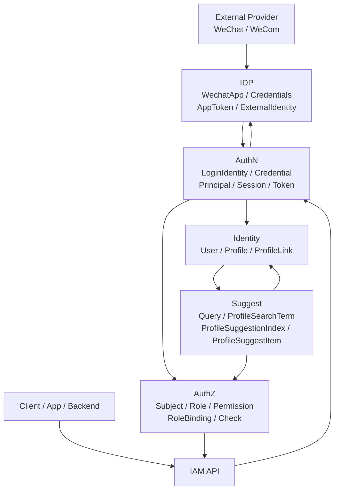

# 02-业务模块

> 状态：规划改造 · 已完成当前事实盘点；正文仍含待实现或尚未收敛的设计内容，不得作为现有能力承诺。

---

## 1. 本目录定位

`02-业务模块/` 是 IAM 文档体系中的核心业务事实层。

它回答：

```text
IAM 由哪些业务模块组成？
每个模块各自负责什么？
模块之间如何协作？
哪些对象归哪个模块拥有？
跨模块调用时哪些边界不能越过？
阅读具体模块文档应该从哪里开始？
```

本目录按当前业务模块组织，而不是按历史演进组织。

当前模块分为两类：

```text
核心模块：Identity / AuthN / AuthZ；
辅助模块：IDP / Suggest。
```

核心模块负责 IAM 的身份事实、认证结果和授权判定。

辅助模块负责外部身份源接入和 Profile 联想搜索读模型。

---

## 2. 30 秒结论

IAM 业务模块可以压缩成五个职责中心：

```text
Identity：谁是谁，人与档案之间是什么关系；
AuthN：当前请求者如何证明自己是谁，认证后如何表达 Principal / Session / Token；
AuthZ：某个 Subject 能不能对某个 Resource 执行某个 Action；
IDP：外部 provider 说了什么，如何解析成 ExternalIdentity；
Suggest：当前请求者在可见范围内能搜索到哪些 Profile 候选项。
```

五个模块的核心协作主线是：

```text
IDP ExternalIdentity
  -> AuthN LoginIdentity / Principal / Token
  -> Identity User / Profile / ProfileLink
  -> AuthZ Subject / Check
  -> Suggest Profile candidate / visibility filter / masked result
```

最重要的边界：

```text
ExternalIdentity 不是 User，也不是 LoginIdentity；
LoginIdentity 不是 User；
Principal 不是 User，也不是 Subject；
ProfileLink 不是 RoleBinding；
ProfileAccessScope 不是 AuthZ Scope 本体；
ProfileSuggestionIndex 不是 Profile 主数据；
AppToken 不是 IAM AccessToken；
Token 验签成功不等于授权通过。
```

如果只记一句话：

> Identity 管身份事实，AuthN 管认证结果，AuthZ 管授权判断，IDP 管外部身份源，Suggest 管可见范围内的 Profile 搜索候选。

---

## 3. 模块协作总图



读图规则：

```text
IDP 解析外部 provider 身份，只返回 ExternalIdentity；
AuthN 决定 ExternalIdentity 如何映射为 LoginIdentity，并构造 Principal / Session / Token；
Identity 维护 User / Profile / ProfileLink 等内部身份事实；
AuthZ 基于 Subject / Resource / Action / Scope 做授权判断；
Suggest 从 Identity 派生搜索读模型，再通过 AuthZ/Identity 做可见性过滤；
API 入口通常先经过 AuthN，再按场景进入 AuthZ、Identity、Suggest 或 IDP。
```

---

## 4. 模块定位总表

| 模块 | 入口 | 一句话定位 | 拥有的核心对象 |
| --- | --- | --- | --- |
| Identity | [01-Identity](01-Identity/README.md) | 身份事实中心 | `User` / `Profile` / `ProfileLink` / `Child` / `Guardianship` |
| AuthN | [02-AuthN](02-AuthN/README.md) | 认证中心 | `LoginIdentity` / `Credential` / `Challenge` / `Principal` / `Session` / `Token` / `JWKS` |
| AuthZ | [03-AuthZ](03-AuthZ/README.md) | 授权中心 | `Subject` / `Resource` / `Action` / `Scope` / `Role` / `Permission` / `RoleBinding` / `PolicyVersion` |
| IDP | [04-IDP](04-IDP/README.md) | 外部身份源基础设施 | `WechatApp` / `Credentials` / `AppToken` / `ExternalIdentity` |
| Suggest | [05-Suggest](05-Suggest/README.md) | Profile 联想搜索读模型 | `OperatingPrincipal` / `ProfileAccessScope` / `Query` / `ProfileSearchTerm` / `ProfileSuggestionIndex` / `ProfileSuggestItem` |

---

## 5. 五个模块分别回答什么问题

### 5.1 Identity

Identity 回答：

```text
IAM 内部有哪些人？
有哪些档案？
人与档案之间是什么关系？
User、Profile、Child、Guardianship、ProfileLink 等事实如何表达？
```

Identity 不回答：

```text
当前请求是否已经登录；
当前请求能不能访问某个资源；
微信 openid 如何解析；
Profile 如何被联想搜索命中。
```

---

### 5.2 AuthN

AuthN 回答：

```text
当前请求者如何证明自己是谁？
哪些登录方式可以映射到 IAM 内部登录身份？
认证成功后如何表达 Principal？
如何创建 Session、AccessToken、RefreshToken？
如何通过 JWKS 支持本地验签？
```

AuthN 不回答：

```text
User/Profile 主数据如何写入；
某个 Subject 是否有某个权限；
外部 provider app secret 如何管理；
Profile 搜索结果如何过滤和脱敏。
```

---

### 5.3 AuthZ

AuthZ 回答：

```text
某个 Subject 能不能对某个 Resource 执行某个 Action？
授权策略如何管理？
Role、Permission、RoleBinding 如何表达？
PolicyVersion 如何传播到 runtime？
Casbin runtime 如何承载授权执行？
```

AuthZ 不回答：

```text
用户如何登录；
Credential 如何校验；
Profile 主数据如何创建；
微信身份如何解析；
搜索索引如何构建。
```

---

### 5.4 IDP

IDP 回答：

```text
IAM 接入了哪个外部 provider app？
provider app secret / callback token / aes key 如何管理？
provider AppToken 如何获取和缓存？
微信/企微 code 或 callback 如何解析成 ExternalIdentity？
```

IDP 不回答：

```text
ExternalIdentity 是否能登录成某个 User；
LoginIdentity 如何绑定；
IAM Token 如何签发；
User/Profile 如何创建；
Subject 是否有权限。
```

---

### 5.5 Suggest

Suggest 回答：

```text
当前请求者在可见范围内，根据 keyword 能看到哪些 Profile 候选？
ProfileSearchTerm 和 ProfileSuggestionIndex 如何从 Identity 主数据派生？
候选结果如何经过可见性过滤、排序、截断和脱敏？
手机号搜索如何限流、审计并只返回 mobile_mask？
```

Suggest 不回答：

```text
Profile 主数据如何写入；
RoleBinding 如何创建；
用户如何登录；
微信身份如何解析；
明文手机号如何对外展示。
```

---

## 6. 核心协作链路

### 6.1 外部身份登录链路

```text
Client provider proof
  -> IDP ResolveExternalIdentity
  -> ExternalIdentity
  -> AuthN provider key
  -> LoginIdentity
  -> Principal
  -> Session / IAM Token
```

边界：

```text
IDP 只解析 ExternalIdentity；
AuthN 决定 login/link/onboard/deny；
Identity 只在明确 onboarding 用例中创建 User/Profile；
AuthZ 不直接消费 openid；
AppToken 不是 IAM AccessToken。
```

---

### 6.2 API 访问控制链路

```text
Request Bearer Token
  -> AuthN token verification
  -> Principal
  -> Principal -> AuthZ Subject
  -> AuthZ Check(Resource, Action, Scope)
  -> allow / deny
```

边界：

```text
Token 验签成功只说明请求者已认证；
授权通过必须经过 AuthZ Check；
Principal 不是 Subject，需要显式映射；
RoleBinding 不等于 ProfileLink。
```

---

### 6.3 用户与档案关系链路

```text
Identity User
  -> Profile / Child
  -> ProfileLink / Guardianship
  -> business use case consumes identity facts
```

边界：

```text
Identity 维护身份事实；
AuthN 不直接把 LoginIdentity 当 User/Profile；
AuthZ 不把 ProfileLink 当 RoleBinding；
Suggest 只消费 Profile/ProfileLink 事实，不修改 Identity 主数据。
```

---

### 6.4 Profile 联想搜索链路

```text
Identity Profile facts
  -> Suggest ProfileSearchTerm / ProfileSuggestionIndex
  -> Query matches candidate profileIDs
  -> Identity facts + AuthZ Check/filter
  -> visible candidates
  -> rank / limit / mask
  -> ProfileSuggestItem
```

边界：

```text
ProfileSuggestionIndex 不是 Profile 主数据；
索引命中不等于可见；
ProfileAccessScope 不是 AuthZ Scope 本体；
手机号搜索不能绕过 scope 和可见性过滤；
ProfileSuggestItem 不返回明文手机号或证件号。
```

---

## 7. 跨模块边界总表

| 容易混淆的对象 | 正确边界 | 错误理解 |
| --- | --- | --- |
| `ExternalIdentity` 与 `User` | ExternalIdentity 是外部 provider 身份声明 | openid/unionid 就是 UserID |
| `ExternalIdentity` 与 `LoginIdentity` | ExternalIdentity 可被 AuthN 映射为 LoginIdentity | ExternalIdentity 就是 LoginIdentity |
| `WechatApp` 与 `LoginIdentity` | WechatApp 是 provider app 配置 | WechatApp 是用户登录身份 |
| `Credentials` 与 AuthN `Credential` | Provider credentials 是 app secret 等外部凭据 | app secret 是用户凭据 |
| `AppToken` 与 IAM `AccessToken` | AppToken 用于调用 provider API | 微信 access_token 可访问 IAM API |
| `LoginIdentity` 与 `User` | LoginIdentity 是登录方式绑定 | LoginIdentity 就是 User |
| `Principal` 与 `User` | Principal 是认证结果上下文 | Principal 就是 User 主数据 |
| `Principal` 与 `Subject` | Principal 需映射为授权主体 | 登录成功天然授权通过 |
| `ProfileLink` 与 `RoleBinding` | ProfileLink 是身份关系事实 | ProfileLink 是授权绑定 |
| `ProfileAccessScope` 与 AuthZ `Scope` | Suggest Scope 是搜索范围输入 | Suggest Scope 等于授权通过 |
| `ProfileSearchTerm` 与 `Profile` | SearchTerm 是搜索读模型词条 | SearchTerm 是 Profile 主数据 |
| `ProfileSuggestionIndex` 与 Profile 主数据 | Snapshot 是可重建读模型 | Snapshot 可回写 Identity 主数据 |

---

## 8. 推荐阅读路径

### 8.1 新读者

```text
02-业务模块/README.md
  -> 01-Identity/README.md
  -> 02-AuthN/README.md
  -> 03-AuthZ/README.md
  -> 04-IDP/README.md
  -> 05-Suggest/README.md
```

目标：先建立五个模块的职责分工和边界。

---

### 8.2 准备理解登录认证

```text
02-AuthN/README.md
  -> 04-IDP/README.md
  -> 01-Identity/README.md
  -> 03-AuthZ/README.md
```

目标：理解外部身份如何进入 AuthN、AuthN 如何产生 Principal/Token，以及为什么认证不等于授权。

---

### 8.3 准备理解权限控制

```text
03-AuthZ/README.md
  -> 02-AuthN/README.md
  -> 01-Identity/README.md
  -> 05-Suggest/README.md
```

目标：理解 Principal、Subject、RoleBinding、ProfileLink、ProfileAccessScope 的差异。

---

### 8.4 准备实现微信/企微登录

```text
04-IDP/README.md
  -> 02-AuthN/04-关键链路-Login登录认证.md
  -> 02-AuthN/03-关键链路-Linking登录身份绑定.md
  -> 02-AuthN/02-关键链路-Onboarding身份开通.md
```

目标：理解 IDP 只解析 ExternalIdentity，AuthN 决定登录、绑定、开通或拒绝。

---

### 8.5 准备实现 Profile 搜索

```text
05-Suggest/README.md
  -> 01-Identity/README.md
  -> 03-AuthZ/README.md
```

目标：理解 Suggest 如何从 Identity 派生读模型，并通过 AuthZ/Identity 过滤可见候选。

---

## 9. 文档写法约定

每个模块文档按“总-分结构”组织：

```text
README.md
  -> 00-模块总览.md
  -> 01-领域模型-*.md
  -> 关键链路-*.md
  -> 模块边界-*.md
  -> 分层架构与代码索引.md
```

写作顺序遵循：

```text
模块定位
  -> 核心模型
  -> 对象边界
  -> 关键链路
  -> 模块协作
  -> 分层架构
  -> 代码事实源
  -> Verify
```

注意：

```text
文档应明确区分现状、规划和待核对；
不要把未实现能力写成已实现事实；
不要把外部术语直接当内部模型；
不要让同一对象在不同模块中使用不同名称；
专题设计和取舍放到 ../05-专题设计/。
```

---

## 10. 代码事实源

| 事实 | 路径 |
| --- | --- |
| Identity domain | `../../internal/apiserver/domain/identity` |
| Identity application | `../../internal/apiserver/application/identity` |
| AuthN domain | `../../internal/apiserver/domain/authn` |
| AuthN application | `../../internal/apiserver/application/authn` |
| AuthZ domain | `../../internal/apiserver/domain/authz` |
| AuthZ application | `../../internal/apiserver/application/authz` |
| IDP domain | `../../internal/apiserver/domain/idp` |
| IDP application | `../../internal/apiserver/application/idp` |
| Suggest domain | `../../internal/apiserver/domain/suggest` |
| Suggest application | `../../internal/apiserver/application/suggest` |
| REST transport | `../../internal/apiserver/transport/rest` |
| gRPC transport | `../../internal/apiserver/transport/grpc` |
| Container | `../../internal/apiserver/container` |
| REST 契约 | `../../api/rest` |
| gRPC 契约 | `../../api/grpc` |
| 架构测试 | `../../internal/pkg/architecture` |

注意：上表中的路径需要继续与当前仓库目录逐项核对。如果源码目录已调整，应以代码为准并同步更新本文。

---

## 11. 常见反模式

| 反模式 | 问题 | 推荐做法 |
| --- | --- | --- |
| IDP 直接创建 User | IDP 吞并 Identity | IDP 返回 ExternalIdentity，AuthN/Identity 决定开通 |
| IDP 直接签发 IAM Token | IDP 吞并 AuthN | AuthN 基于 Principal 签发 Token |
| AuthN 直接授权资源访问 | 认证和授权混淆 | AuthZ Check 做授权判断 |
| Token 验签成功就放行 | 已认证不等于已授权 | Token -> Principal -> AuthZ Check |
| ProfileLink 当 RoleBinding | 身份关系和授权事实混淆 | ProfileLink 归 Identity，RoleBinding 归 AuthZ |
| Suggest 索引命中直接返回 | 越权泄露 | 候选必须经过 AuthZ/Identity 过滤 |
| Suggest 创建 Profile | 读模型吞并写模型 | Profile 写入归 Identity |
| Store / Index 直接调用 AuthZ | infra 吞并授权决策 | application 编排 VisibilityFilter |
| 微信 access_token 当 IAM AccessToken | provider token 和 IAM token 混淆 | AppToken 只用于 provider API |
| ExternalIdentity 当 UserID | 外部身份和内部身份混淆 | AuthN/Identity 显式映射 |

---

## 12. Verify

修改本目录文档后至少执行：

```bash
make docs-hygiene
```

涉及所有业务模块时，可按模块执行：

```bash
go test ./internal/apiserver/domain/identity/...
go test ./internal/apiserver/application/identity/...

go test ./internal/apiserver/domain/authn/...
go test ./internal/apiserver/application/authn/...

go test ./internal/apiserver/domain/authz/...
go test ./internal/apiserver/application/authz/...

go test ./internal/apiserver/domain/idp/...
go test ./internal/apiserver/application/idp/...

go test ./internal/apiserver/domain/suggest/...
go test ./internal/apiserver/application/suggest/...
```

涉及 REST/gRPC 契约或 transport：

```bash
make api-validate
make proto-gen
go test ./internal/apiserver/transport/rest/...
go test ./internal/apiserver/transport/grpc/...
```

涉及容器装配、SDK 或架构边界：

```bash
go test ./internal/apiserver/container/...
go test ./pkg/sdk/...
go test ./internal/pkg/architecture
```

---

## 13. 本目录总结

`02-业务模块/` 的主线是：

```text
Identity：维护内部身份事实；
AuthN：完成认证并产生 Principal / Session / Token；
AuthZ：完成资源访问授权判断；
IDP：接入外部身份源并解析 ExternalIdentity；
Suggest：维护 Profile 搜索读模型并返回可见、脱敏候选。
```

五个模块协作时必须守住边界：

```text
外部身份不能直接当内部用户；
认证成功不能直接当授权通过；
身份关系不能直接当授权绑定；
搜索命中不能直接当结果可见；
外部 provider token 不能当 IAM token；
读模型不能替代写模型；
infra store 不能吞并 application 安全决策。
```

读完本文后，应进入各模块 README，继续按模型、链路、边界和代码索引深入阅读。
